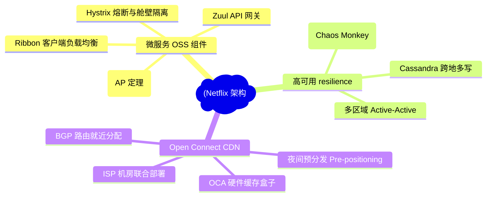
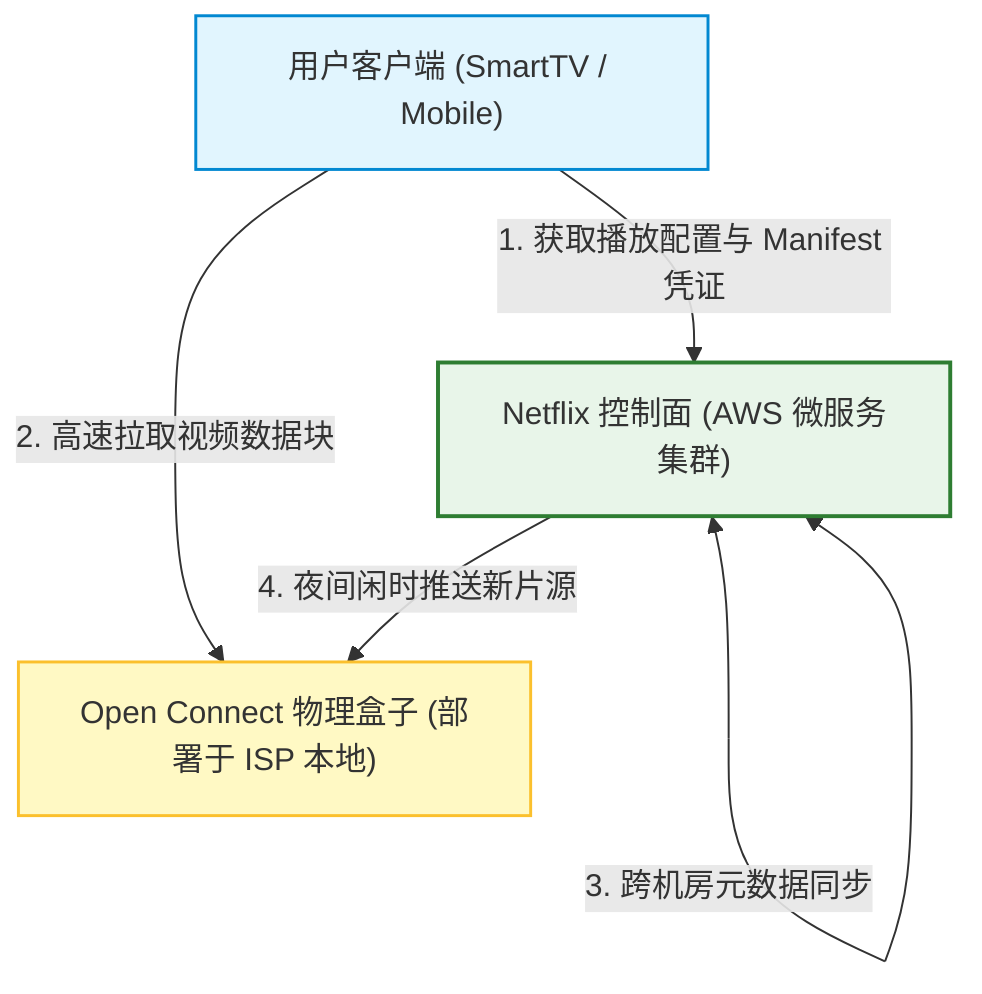
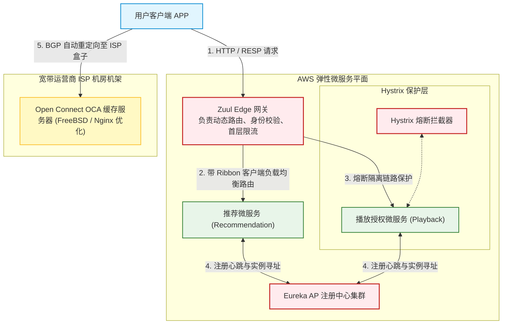
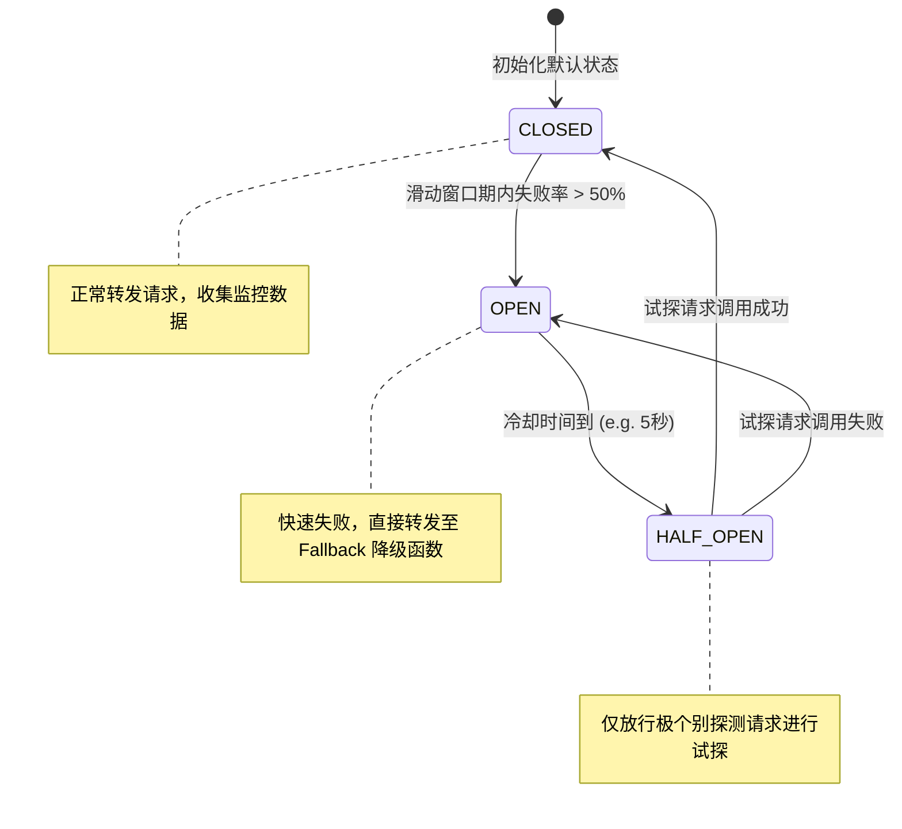
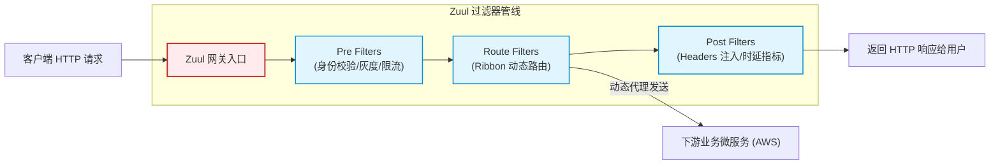
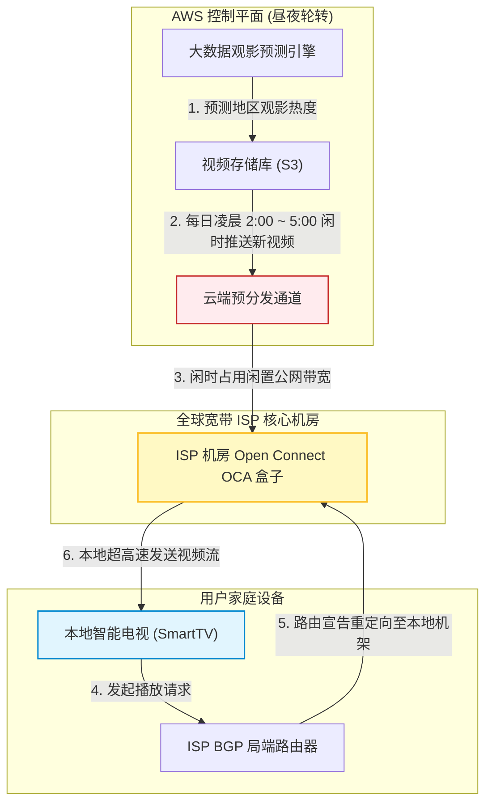

import CaseStudyHeader from '@site/src/components/CaseStudyHeader';
import DesignIntent from '@site/src/components/DesignIntent';
import EvolutionTimeline from '@site/src/components/EvolutionTimeline';
import CompareSlider from '@site/src/components/CompareSlider';
import TradeoffExplorer from '@site/src/components/TradeoffExplorer';
import GlossaryTerm from '@site/src/components/GlossaryTerm';
import ResearchNote from '@site/src/components/ResearchNote';
import GuidedExercise from '@site/src/components/GuidedExercise';
import QuizCard from '@site/src/components/QuizCard';
import MindMap from '@site/src/components/MindMap';
import PyRunner from '@site/src/components/PyRunner';

# Netflix：高可用微服务底座、OSS 容错组件与 Open Connect CDN 架构

<CaseStudyHeader
  oneLiner="Netflix 是全球微服务架构与大并发流媒体分发的鼻祖。它摒弃了集中式单体数据库的设计，全面拥抱 AWS 云原生高弹微服务，开源了深刻改写行业规则的 Netflix OSS 体系。通过基于 AP 定理的 P2P 注册中心 Eureka 规避脑裂阻塞，依靠 Hystrix 线程舱壁与滑动窗口熔断器切断依赖雪崩，配合 Zuul 网关进行边缘过滤路由，并依托 Open Connect 自建全球 CDN 盒子，达成了全天候 99.99% 的超高可用流分发。"
  stats={[
    {label: '定位与类别', value: '全球级分布式流媒体控制平面与自建 CDN 架构'},
    {label: '网关核心', value: 'Zuul 动态网关 (三级过滤器链条编排模式)'},
    {label: '注册发现', value: 'Eureka 注册中心 (无 Master 的 P2P 状态同步)'},
    {label: '服务级限流熔断', value: 'Hystrix 滑动窗口熔断器 + 线程池舱壁隔离'},
    {label: '自建 CDN 盒子', value: 'Open Connect (全球 ISP 联合部署 OCA 硬件)'},
    {label: '高可用容灾验证', value: '混沌工程 (Chaos Engineering / Chaos Monkey)'}
  ]}
/>

:::info 对应课程概念
本案例融合了以下课程核心概念：
*   **注册发现的 AP 与 CP 取舍（Month 5 协调共识）**：Eureka 放弃 ZooKeeper 强一致 CP，采用最终一致性 AP 来保障网络分区下服务不中断的架构设计。
*   **服务容错与故障隔离（Month 5 服务降级）**：基于 Hystrix 的熔断状态机与舱壁模式（Bulkhead），切断高并发微服务调用链路上的雪崩放大效应。
*   **网络就近路由与缓存（Month 5 负载均衡）**：Open Connect 自建 CDN 盒子如何在 ISP 机房通过 BGP 路由就近响应流媒体拉取。
*   **混沌工程与主动失效（Month 1 操作系统与服务）**：通过 Chaos Monkey 主动注入进程和虚拟机死机，倒逼微服务架构实现弹性自愈。
:::

---

## 1. 设计初衷：从数据库崩溃的阴影，走向不可摧毁的云原生微服务

在 2008 年以前，Netflix 的架构是一个典型的单体关系型数据库（Oracle）架构，通过自家物理机房提供 DVD 租借和早期流媒体服务：
1.  **单体崩溃的灾难**：
    *   2008 年 8 月，Netflix 的核心数据库发生了一次极其严重的物理故障，导致整个订购与分发系统瘫痪了整整三天，DVD 寄送完全停摆。
    *   管理层和技术架构师意识到：**单一机房和单一单体数据库是高可用的天敌**。如果不能将系统拆分为数百个独立运行、相互隔离的微服务，并且摆脱物理硬件维护的噩梦，就无法支撑未来全球数亿用户的流媒体并发爆发。
2.  **拥抱 AWS 与故障常态化**：
    *   Netflix 决定将全部控制面迁移至 AWS 公有云上。但当时的 AWS 虚机经常发生偶发性死机、网络抖动和磁盘脱线。
    *   Netflix 提出了一套革命性的口号：**“Design for Failure”（为失败而设计）**。假定底层的虚拟机随时会挂、网络随时会断。
    *   为了倒逼开发人员不写“依赖底层绝对可靠”的代码，他们编写了 Chaos Monkey 注入生产环境，随机杀掉正常运行的微服务实例，直接逼迫系统实现自动发现、自动剔除和自动降级，诞生了著名的“混沌工程”。
3.  **Open Connect：规避昂贵的公网传输**：
    *   随着高清流媒体业务爆发，Netflix 占据了美国夜间高峰期下行互联网流量的 30% 以上。如果所有视频流都从 AWS 中央机房发往全国，网络传输费会彻底掏空公司，且骨干网拥堵会导致用户频频卡顿。
    *   Netflix 决定退出第三方公共 CDN（如 Akamai），自研 Open Connect CDN 体系：制造专用的 OCA 视频缓存硬件盒子，直接**免费塞进全球各大宽带运营商（ISP）的机房里**，让海量流量直接在 ISP 内部消化。

<DesignIntent
  problem="如何在高度不稳定、随时会发生虚机死机与网络分区抖动的公有云上，构建一套承载数亿用户并发访问、核心微服务高容错、并且在全球视频流量爆发下仍能保持极低延迟响应的流媒体系统架构。"
  users="全球上亿的视频流媒体订阅用户，以及致力于构建高抗抖动、分布式弹性微服务架构的平台工程团队。"
  devices="智能电视、手机 APP、个人电脑浏览器、游戏主机等通过 RESP/HTTP 协议接入，视频流最终从就近的 ISP Open Connect CDN 盒子中拉取。"
  goals={[
    '核心控制面 99.99% 高可用：即使 AWS 单个 Region 整体断网，系统也能在秒级内自动将流量切换至备用 Region，用户完全无感知',
    '杜绝服务级级联雪崩：单个边缘服务（如推荐、评价、字幕）卡死或超时，绝对不能阻塞主播放链路的正常开启',
    '流量本底就近消纳：通过 Open Connect OCA 盒子，将 95% 以上的视频流媒体流量在 ISP 本地完成分发，避开骨干网网络时延',
    '生产故障持续免疫：利用混沌工程工具链在白天生产环境随机注入故障，持续验证系统在单点宕机下的自愈和隔离能力'
  ]}
  constraints={[
    'Eureka 注册信息的弱一致时延：Eureka 作为 AP 注册中心，节点间通过异步 gossip 广播同步。在实例发生漂移时，路由列表更新会有十几秒的最终一致时延，客户端必须依赖 Ribbon 本地缓存并具备重试防线',
    'Hystrix 线程池切换开销：每个被保护的服务都拥有独立的线程池隔离（舱壁），高频上下文切换会损耗微小的 CPU 吞吐，需要精细化微调线程池大小',
    'OCA 盒子的冷启动预分发：ISP 本地盒子无法实时拉取大容量新视频，必须采用夜间预分发机制（Pre-positioning），如果视频临时爆火而未提前分发，会产生高昂的公网穿透拉取压力'
  ]}
  firstStep="开发 Eureka 去中心化注册同步协议；编写 Hystrix 滑动窗口熔断拦截器逻辑；搭建 Zuul 网关过滤器（Pre/Route/Post）生命周期管道；设计并制造 Open Connect 硬件盒子 OCA 的文件系统及夜间分发计划。"
/>

---

## 2. 知识全景脑图

### 2a. 全景架构思维导图



### 2b. 交互脑图导航

<MindMap
  root={{
    label: 'Netflix 核心架构',
    children: [
      {
        label: '微服务底座 (Microservices)',
        children: [
          { label: 'Zuul 动态网关路由' },
          { label: 'Eureka AP 注册中心' },
          { label: 'Hystrix 滑动窗口熔断' }
        ]
      },
      {
        label: '故障自愈与混沌 (Chaos)',
        children: [
          { label: 'Chaos Monkey 主动失效' },
          { label: '舱壁隔离线程池保护' },
          { label: '自我保护模式防误杀' }
        ]
      },
      {
        label: '内容分发网络 (CDN)',
        children: [
          { label: 'OCA 物理缓存盒子' },
          { label: 'BGP 就近路由机制' },
          { label: 'Pre-positioning 夜间推送' }
        ]
      }
    ]
  }}
/>

---

## 3. 系统架构总览 (C4 Model)

### 3a. System Context (系统上下文图)



### 3b. Container Diagram (容器结构图)



---

## 4. 核心机制拆解

### 4a. Eureka 注册中心与 AP 定理下的 P2P 去中心化同步

在分布式注册中心的设计中，Netflix 坚决地站在了 CAP 定理的 **AP（可用性与分区容错性）** 一侧，与 CP 定理的 ZooKeeper/Consul 背道而驰：
1.  **无 Master 的 P2P 扁平拓扑**：
    *   Eureka 集群中的每个节点都是完全对等的（Peer-to-Peer）。没有 Master 选举，没有全局协调器。
    *   当某个微服务实例向 Eureka-A 注册时，Eureka-A 立即将注册信息通过异步 Gossip 广播转发给 Eureka-B 和 Eureka-C。
2.  **分区脑裂自适应**：
    *   在发生网络分区（Network Partition）导致集群脑裂时，Eureka 节点不会像 ZooKeeper 那样锁死整个集群去进行 Leader 选举、暂停服务。
    *   各个分区的 Eureka 节点依然能独立接受服务注册并响应查询，哪怕数据暂时不一致。
3.  **<GlossaryTerm term="自我保护模式" definition="自我保护模式是 Eureka 在网络分区故障时的一种防护机制。当 Eureka 检测到心跳丢失率突然超过 15% 时，它会判定发生了网络异常而非服务崩溃，从而暂停剔除过期实例，保留所有路由信息以保证服务高可用。">自我保护模式 (Self-Preservation)</GlossaryTerm>**：
    *   如果网络发生大面积卡顿，Eureka 发现 15% 以上的服务心跳丢失，它不会盲目剔除这些服务。
    *   Eureka 会自动开启自我保护，**锁定注册表，不删除任何实例**。因为“保留可能已经下线但部分可用的节点，远远好过彻底杀掉它们导致所有微服务瘫痪”，展现了 AP 架构的极致弹性。

```mermaid
graph TD
  classDef active fill:#ffebee,stroke:#c62828,stroke-width:1.5px;
  classDef instance fill:#e8f5e9,stroke:#2e7d32,stroke-width:1.5px;

  subgraph NetworkPartition ["网络分区脑裂状态 (AP 保障)"]
    subgraph Partition1 ["分区 1 (正常工作)"]
      EurekaNodeA["Eureka 节点 A"]:::active
      ServiceX["微服务实例 X"]:::instance
      ServiceX -->|1. 心跳注册| EurekaNodeA
    end
    
    subgraph Partition2 ["分区 2 (正常工作)"]
      EurekaNodeB["Eureka 节点 B"]:::active
      ServiceY["微服务实例 Y"]:::instance
      ServiceY -->|2. 心跳注册| EurekaNodeB
    end
    
    BrokenLine{{"物理断网 / 脑裂"}}
    EurekaNodeA -.- BrokenLine
    BrokenLine -.- EurekaNodeB
  end

  EurekaNodeA -->|3. gossip 异步同步被阻断| EurekaNodeB
  Note over NetworkPartition: 此时两边 Eureka 依然支持读写，数据最终一致！
```

---

### 4b. Hystrix 熔断器状态机与舱壁隔离 (Bulkhead)

在拥有数百个微服务的庞大系统中，服务间通过网络相互调用。如果服务 A 发生卡顿，调用它的服务 B 就会因为等待响应而阻塞线程，并迅速波及到网关，导致整个系统发生“级联雪崩”。
Netflix 研制了 **Hystrix** 容错保护器：
1.  **舱壁隔离 (Bulkhead Isolation)**：
    *   借鉴泰坦尼克号船舱分段防水的设计。Hystrix 为每个受保护的微服务分配独立的**线程池（Thread Pool）**。
    *   即使“推荐服务”的线程池被高时延请求全部占满，它也不会消耗“用户授权服务”或“播放服务”的线程，将故障范围限制在局部。
2.  **滑动窗口熔断状态机**：
    *   Hystrix 实时统计接口的健康率。如果在 10 秒（滑动窗口）内，接口调用失败率超过 50%，熔断器会从 `CLOSED` 转换为 `OPEN` 状态。
    *   一旦开启，所有后续请求**直接不调用服务，而是快速失败并执行 Fallback（降级回退函数）**。
    *   经过一定的冷却期（如 5 秒），熔断器进入 `HALF-OPEN` 试探状态，允许极少流量尝试调用。若调用成功则关闭熔断，若失败则重新开启，完美实现自愈。



---

### 4c. Zuul 动态网关的过滤器链条机制

作为 Netflix 所有流量的唯一入口，**Zuul** API 网关通过高度插件化的动态过滤器链条，实现了对流量的极佳编排：
*   **三级过滤器链（Pre / Route / Post）**：
    *   **Pre Filters**：在请求路由到下游服务前执行。用于身份校验、限流拦截、流量染色和日志收集。
    *   **Route Filters**：负责将解析好的请求分发转发给下游具体的微服务物理实例。
    *   **Post Filters**：在下游服务响应返回后执行。用于添加统一的 Response Header、收集时延 Metrics、以及错误包装。
*   **动态过滤器加载**：
    *   Zuul 的核心过滤器是用 Groovy 编写的。Zuul 会拉起一个后台文件线程，监控特定目录下的 Groovy 过滤器文件。
    *   开发人员可以**不重启网关进程，在生产环境直接上传一个新过滤器脚本**，瞬间上线防御恶意攻击的规则，获得了顶级的线上弹性管理。



---

### 4d. 自建 Open Connect CDN 与夜间预分发机制

Netflix 流媒体极高吞吐的终极物理法宝是 **Open Connect**：
1.  **OCA (Open Connect Appliance) 物理盒子**：
    *   Netflix 定制的高集成度存储服务器，运行 FreeBSD 操作系统，使用深度优化的 Nginx，内部塞满了几十块大容量机械磁盘和 SSD，存放数万部热门电影的各分辨率和多码率转译视频文件。
2.  **BGP 路由就近响应**：
    *   Netflix 将 OCA 免费塞进各大 ISP 机房并插在交换机上。
    *   OCA 盒子与 ISP 路由器通过 BGP（边界网关协议）宣告其承载的视频服务 IP。当本地用户发起播放请求时，ISP 路由器会自动将视频流的拉取请求物理重定向到本地机房的 OCA 盒子里，网络延迟降到个位数毫秒级，且完全不消耗骨干公网网卡带宽。
3.  **夜间闲时预分发 (Pre-positioning)**：
    *   OCA 盒子不具备实时穿透到 AWS 拉取新片的能力（这会导致网络瞬间拥堵）。
    *   Netflix 依靠强大的大数据算法，预测每个国家和地区用户明天的观影偏好，在**每天夜间凌晨至清晨的公网空闲时间段**，从 AWS 云端统一向全球 OCA 盒子流式推送新电影和爆款电视剧的视频分块，提前填满本地存储，实现了“白天的海量流量在本地消耗，公网凌晨空闲时做预同步”的完美网络调度取舍。



---

## 5. 关键数据结构与算法

### 5a. 熔断判定：滑动窗口度量统计 (Sliding Window Bucket)

为了高灵敏度且低内存损耗地计算最近 10 秒内的服务调用失败率，Hystrix 采用了**滑动窗口度量（Sliding Window Metric）**算法：
*   **环形存储结构**：
    *   Hystrix 默认将 10 秒的时长切分为 10 个桶（Bucket），每个桶代表 1 秒的物理时长。
    *   每个 Bucket 内部包含几个基本的原子计数器：`SuccessCount`、`FailureCount`、`TimeoutCount`、`FallbackCount`。
*   **滑动步进**：
    *   随着物理时间推移，系统以 1 秒为步长向前移动窗口，丢弃最老的第 11 个桶，并在头部插入一个新的空桶，将所有活跃的 10 个桶数据在内存中相加，得到最近 10 秒内的总失败率：`FailureRate = Sum(Failure) / Sum(Success + Failure)`。
    *   由于仅在内存中维护 10 个小结构体对象，其计算开销和内存占用恒定在极小常数，避免了由于记录每次请求的时戳导致内存暴涨。


---

### 5b. 一致性哈希与 Eureka 自我保护机制

当微服务数量急剧膨胀时，Eureka 需要在网络抖动和集群正常扩容时避免路由剧烈震荡。
*   **注册续约公式**：每个微服务以 30 秒为周期向 Eureka 发送心跳续约。
*   **自我保护触发阈值**：
    $$RenewsMinPerMin = ExpectedNumOfInstances \times 2 \times 0.85$$
    即正常情况下每分钟单实例心跳 2 次，如果集群在一分钟内的总心跳次数低于预期的 85%，Eureka 会立即判定“网络分区故障”而非所有服务崩溃，开启自我保护。

---

### 5c. BGP (边界网关协议) 局部路由就近分配

在互联网路由层面，Open Connect 利用 BGP 协议进行本地路由通告。
*   **Anycast / Local Loop**：OCA 盒子直接向 ISP 的汇聚路由器发送 BGP Peer 建立指令，发布 Netflix 视频源所在的 IP 段。当本 ISP 内部的用户尝试解析 manifest 上的 IP 时，ISP 路由器发现 BGP 路由表里该 IP 对应的路径开销（AS Path）极短，会优先把包转发给机架上的 OCA，实现高效率的网络本地分流。

---

## 6. 架构演进史

Netflix 开启了云原生微服务体系的黄金时代，并引导了全球流媒体分发技术的物理变迁：

<EvolutionTimeline
  events={[
    {
      year: '2008',
      title: 'Oracle 灾难与 AWS 迁移决心',
      why: '单体数据库在物理机房发生严重故障，导致整个系统连续停摆三天，促使公司下定决心彻底重组软件边界，转向微服务和云原生基础设施。',
      change: '全面启动 AWS 迁移计划；着手将单体服务拆分为松耦合的微服务；开发微服务基础组件。'
    },
    {
      year: '2011-2012',
      title: 'Netflix OSS 黄金开源生态上线',
      why: '随着云上微服务快速膨胀，传统的网络路由和容错机制（如硬负载均衡设备）无法应对频繁的实例漂移与级联雪崩。',
      change: '开源了 Eureka、Hystrix、Zuul、Ribbon，直接定义了第一代 Java 分布式微服务的基础框架标准。'
    },
    {
      year: '2015',
      title: 'Open Connect 全球视频网落盘',
      why: '流媒体用户高频请求 4K 等高清片源，公共 Internet 骨干网带宽价格高昂且时延不稳定，网络抖动极度破坏观影体验。',
      change: '自建 Open Connect CDN，部署冷热分离的 OCA FreeBSD 硬件服务器，并通过夜间闲时智能分发规避日间网络流量高峰。'
    },
    {
      year: '2018 至今',
      title: '现代化微服务迭代 (Zuul 2 & Limits)',
      why: '传统的阻塞式网络 IO（Zuul 1.0）在高并发连接下线程数暴涨、性能退化；Hystrix 线程池切换开销偏高，且难以自适应限流。',
      change: '升级 Zuul 2 到 Netty 异步非阻塞事件驱动模型；宣布 Hystrix 停止新特性演进，全面推行基于自适应滑动并发限制算法的 limits-protected 控制框架。'
    }
  ]}
/>

---

## 7. 架构对比：传统集中单体物理架构 vs. 弹性微服务 & 自建 Open Connect 架构

<CompareSlider
  before={
    <div style={{ padding: '20px', background: '#ffebee', border: '1px solid #c62828', borderRadius: '8px', height: '100%', color: '#333' }}>
      <strong>传统单体与公共 CDN 架构</strong>
      <p style={{ marginTop: '10px', fontSize: '0.9rem' }}>业务模块紧密堆积在单一 JVM 进程中，依赖中央 Oracle/MySQL 数据库强一致模型。一旦数据库卡顿或锁死，整个系统全面瘫痪。视频分发租用 Akamai 等公共 CDN 节点，数据拉取需要穿透多级公网，遇到大流量时成本极高且网络抖动大。</p>
    </div>
  }
  after={
    <div style={{ padding: '20px', background: '#e8f5e9', border: '1px solid #2e7d32', borderRadius: '8px', height: '100%', color: '#333' }}>
      <strong>弹性微服务 &amp; Open Connect</strong>
      <p style={{ marginTop: '10px', fontSize: '0.9rem' }}>服务完全拆分为数百个无状态微服务并托管于 AWS 云端，通过 Eureka AP 注册发现、Hystrix 熔断舱壁强限额切断雪崩。自建 Open Connect 硬件盒子，免费托管在各运营商本地机房，数据通过夜间预同步闲时加载，实现零骨干网穿透和毫秒级极速流播放。</p>
    </div>
  }
  labels={['单体传统架构', '弹性微服务与 CDN']}
/>

---

## 8. 设计模式与课程映射

本案例在实际工业界顶级大并发流媒体底座中，深度应用了以下课程章节中的核心设计模式与技术：

1.  **CAP 定理与 AP 注册发现模式**（参见 [共识与协调](../05-core-components/consensus-coordination.mdx) 章节）：
    *   Eureka 在网络分区脑裂下放弃 CP 选择 AP 最终一致性，是架构设计中“可用性优先”的经典实践，与传统 CP 一致性的 etcd / ZooKeeper 形成完美对照。
2.  **舱壁隔离与熔断器模式**（参见 [服务间容错与保护](../05-core-components/consensus-coordination.mdx) 章节）：
    *   Hystrix 的线程隔离与状态机，实质上应用了设计模式中的“代理模式（Proxy Pattern）”与“状态模式（State Pattern）”。它拦截了每一次网络远程调用（RPC），自动统计接口失败率并在状态转换间自愈。
3.  **过滤器动态链条模式**（参见 [设计模式与 LLD](../04-design-patterns-lld/overview.mdx) 章节）：
    *   Zuul 的三级过滤器管线，是“责任链模式（Chain of Responsibility Pattern）”在网关控制面的典型用法。通过将请求通过拦截管道处理，实现解耦的灰度控制和鉴权认证。
4.  **混沌破坏与主动容灾验证模式**（参见 [性能与延迟](../01-foundations/performance-and-latency.mdx) 章节）：
    *   Chaos Monkey 随机杀进程的主动破坏机制，是软件测试中“弹性工程”在生产环境的延伸，与 Month 1 强调的“防御性设计与故障恢复能力”完美对应。

---

## 9. 权衡：流媒体系统中的架构妥协

Netflix 在时延、分布式复杂性以及系统鲁棒性之间做出了以下取舍：

<TradeoffExplorer
  title="Netflix 最终一致、容错与分发架构权衡"
  dimensions={['全球用户视频毫秒级开启', '微服务注册路由强一致性', '单实例宕机级联隔离率', '骨干公网网卡带宽采购成本', '自建 CDN 硬件研发与运维开销']}
  options={[
    {
      name: 'AP 最终一致注册 + Hystrix 熔断 + 自建 Open Connect (Netflix 标准)',
      scores: [5, 2, 5, 5, 2],
      note: '通过放弃全局强一致性、采用 Hystrix 线程舱壁并在本地 ISP 免费机房塞满 OCA 盒子，Netflix 换取了业内顶级的流播放开启速度和不可摧毁的核心可用性，且骨干公网传输成本近乎清零。代价是微服务之间的路由同步存在滞后，且需要长期组建物理硬件研发和跨国 ISP 的公关运维团队。',
      whenToUse: '全球大规模流媒体分发、对用户观影延迟高度敏感、骨干网流量庞大且能容忍微服务元数据最终一致的分布式云原生业务。'
    },
    {
      name: 'CP 强一致注册 + 集中式硬件网关 + 第三方托管 CDN 缓存',
      scores: [3, 5, 2, 2, 5],
      note: '基于 ZooKeeper/Consul 强一致注册，路由状态绝对实时无误，并租用 Akamai 等第三方 CDN，免去了硬件研发与机房部署运维的巨大心智开销。但一旦发生集群脑裂，系统在选举期间可能整体不可写；且在遇到大流量时，网络带宽采购费用会成指数级飙升。',
      whenToUse: '核心业务以纯文本/关系型事务为主（如网上银行、高频交易）、开发周期要求短、不具备自建硬件研发能力且流量较小的小型企业。'
    },
    {
      name: 'Service Mesh 侧车代理网格架构 (如 Kubernetes + Envoy / Istio)',
      scores: [4, 4, 4, 3, 3],
      note: '将路由与熔断降级功能下放到与应用同机部署的 sidecar 容器中，用完全统一的基础设施接管熔断，摆脱了 Netflix OSS 对 Java 语言栈的重度绑定。但在高并发网络链路上，每次 RPC 都会增加双向两层代理的网络跳跃（Hop），对极敏时延略有损耗。',
      whenToUse: '企业内部采用多语种混合开发（Java, Go, Python 异构混杂）、微服务交互拓扑盘根错节、且依托 Kubernetes 平台的云原生架构。'
    }
  ]}
/>

---

## 10. 如果是你来设计：Hystrix 熔断器状态机模拟器

### 场景设想
在 Netflix 的微服务架构中，为了防止一个依赖服务挂掉拖垮核心业务，我们需要设计一个熔断保护机制：
*   熔断器有三个核心状态：
    1.  `CLOSED`（关闭状态）：正常将请求发送给下游依赖，并实时统计失败率。
    2.  `OPEN`（开启状态）：当调用失败率超过阀值时，熔断开启。系统**直接拦截请求**，不调用真实服务，而是直接执行 Fallback（降级逻辑）并快速失败，以节省线程资源。
    3.  `HALF_OPEN`（半开试探状态）：当熔断开启一段时间后，允许极少量的请求去试探下游服务。如果成功，则重新关闭熔断器恢复正常；如果再次失败，则重新开启熔断器。

请你用 Python 实现这套经典的 Hystrix 熔断器状态机控制核心逻辑。

<GuidedExercise
  title="基于 Python 的 Hystrix 熔断器状态机仿真"
  goal="实现包含 CLOSED、OPEN、HALF_OPEN 状态迁移，滑动错误窗口记录，以及在熔断开启时自动拦截并降级 Fallback 的安全限额引擎。"
  steps={[
    '步骤 1: 设计 HystrixCircuitBreaker 类。包含状态变量（`state`）、失败阈值限制（`failure_threshold`）、冷却期参数（`cooldown_seconds`）。',
    '步骤 2: 建立一个简单的内存滑动计数器。模拟记录最近 10 次服务调用的结果（Success/Failure），若在 CLOSED 状态下 Failure 占比超过 failure_threshold，状态机立刻切为 OPEN 且记录发生时间。',
    '步骤 3: 实现 `call(service_func, fallback_func)` 请求处理逻辑。如果当前状态为 OPEN，且已经过了 cooldown_seconds，则先自动把状态变更为 HALF_OPEN。',
    '步骤 4: 拦截校验：如果状态为 OPEN，直接执行并返回 fallback_func()。若为 CLOSED 或 HALF_OPEN，则真正尝试调用 service_func()。',
    '步骤 5: 在 HALF_OPEN 下，如果该测试调用成功，则认为服务自愈，重置滑动计数器，切换状态为 CLOSED；如果调用失败，则认为服务仍处于卡死状态，重置当前时间重新切回 OPEN。',
    '步骤 6: 编写运行脚本。模拟下游服务在一段时间内持续失败触发熔断降级，随后等待冷却期，试探恢复，最终重连成功的完整生命周期。'
  ]}
  checks={[
    '确认在服务连续失败后，熔断状态切换为 OPEN，且随后的服务调用瞬间被拦截并输出降级 fallback 文本',
    '验证在冷却期过去后，第一个请求会导致状态切换到 HALF-OPEN，并在服务恢复后自动退回 CLOSED',
    '确认当控制台输出“✅ Hystrix 熔断器状态机联调测试通过！”字样时，模拟器工作正常'
  ]}
/>

#### 交互式 Python 运行实验
在下方控制台中直接运行或修改已准备好的 Hystrix 熔断状态机仿真代码：

<PyRunner
  expect="Hystrix 熔断器状态机联调测试通过"
  rows={25}
  code={`import time

class HystrixCircuitBreaker:
    def __init__(self, failure_threshold=0.5, cooldown_seconds=2):
        self.state = "CLOSED"  # CLOSED, OPEN, HALF_OPEN
        self.failure_threshold = failure_threshold  # 失败阈值 (如 50%)
        self.cooldown_seconds = cooldown_seconds    # 熔断开启后的冷却期
        self.last_state_change = time.time()
        
        # 极简模拟滑动窗口 (记录最近 10 次的调用结果，1为成功，0为失败)
        self.window = []
        self.window_size = 10

    def _record_result(self, is_success):
        self.window.append(1 if is_success else 0)
        if len(self.window) > self.window_size:
            self.window.pop(0)

    def _get_failure_rate(self):
        if not self.window:
            return 0.0
        return self.window.count(0) / len(self.window)

    def call(self, service_func, fallback_func):
        now = time.time()

        # 1. 状态判定：如果在 OPEN 状态下，且冷却期已过，则自动变更为 HALF_OPEN 进行探测
        if self.state == "OPEN" and (now - self.last_state_change) >= self.cooldown_seconds:
            self.state = "HALF_OPEN"
            self.last_state_change = now
            print(f"   [状态变更] 冷却期已过 -> 状态切为 HALF_OPEN，准备进行单次请求试探")

        # 2. 核心拦截：如果状态依然是 OPEN，则直接“快速失败”，调用 Fallback
        if self.state == "OPEN":
            # 物理上完全不去调用底层 service_func，保护服务线程池
            return fallback_func("Circuit is OPEN, fast fail")

        # 3. 真正执行服务调用 (在 CLOSED 或 HALF_OPEN 状态下)
        try:
            result = service_func()
            self._record_result(is_success=True)
            
            # 在半开试探状态下，如果调用成功，代表下游服务已经自愈，恢复 CLOSED
            if self.state == "HALF_OPEN":
                self.state = "CLOSED"
                self.window.clear()  # 清空错误统计
                self.last_state_change = now
                print(f"   [🎉 熔断闭合] 探测调用成功！服务已自愈 -> 状态切回 CLOSED")
                
            return result

        except Exception as e:
            # 记录失败
            self._record_result(is_success=False)
            
            # 失败后重新评估状态
            if self.state == "CLOSED":
                rate = self._get_failure_rate()
                print(f"   [Metric]: 窗口调用失败率: {rate:.1%} (阈值={self.failure_threshold:.1%})")
                if rate >= self.failure_threshold:
                    self.state = "OPEN"
                    self.last_state_change = now
                    print(f"   [💥 熔断开启] 失败率超标！切断所有流量 -> 状态切为 OPEN")
                    
            elif self.state == "HALF_OPEN":
                # 半开下即使失败一次，也说明没好，继续打回 OPEN 重新开始冷却
                self.state = "OPEN"
                self.last_state_change = now
                print(f"   [💥 试探失败] 探测请求依然报错 -> 状态重回 OPEN，重新开启冷却期")

            # 异常发生时，降级返回 Fallback 结果
            return fallback_func(f"Service error: {str(e)}")

# 测试用例模拟
breaker = HystrixCircuitBreaker(failure_threshold=0.5, cooldown_seconds=2)

# 模拟健康的业务方法
def mock_good_service():
    return "SUCCESS: Video stream fetched."

# 模拟出故障的业务方法 (直接抛出网络异常)
def mock_bad_service():
    raise ConnectionError("Timeout reading database")

# 降级降速方法
def my_fallback(msg):
    return f"FALLBACK: This is placeholder video (Reason: {msg})."


print("--- 步骤 1: 正常情况下请求调用 ---")
for _ in range(3):
    print(breaker.call(mock_good_service, my_fallback))

print("\\n--- 步骤 2: 遭遇依赖服务大面积故障，观察熔断器跳闸 ---")
# 连续调用失败，使得滑动窗口失败率突破 50%
for _ in range(6):
    print(breaker.call(mock_bad_service, my_fallback))

print(f"当前熔断器物理状态: {breaker.state}")

print("\\n--- 步骤 3: 熔断器开启状态下，尝试正常调用 (验证快速失败拦截) ---")
# 即使调用的是 mock_good_service，因为状态是 OPEN，应该被瞬间拦截快速返回
print(breaker.call(mock_good_service, my_fallback))

print("\\n--- 步骤 4: 等待 2 秒冷却期，进行半开试探 ---")
time.sleep(2.1)
# 此时会变更为 HALF-OPEN 状态，并且我们传入 mock_good_service，模拟服务已经恢复正常
print(breaker.call(mock_good_service, my_fallback))

# 验证自愈后的终态
if breaker.state == "CLOSED" and len(breaker.window) == 0:
    print("\\n[✅ 验证成功]: Hystrix 熔断器状态机联调测试通过！")
else:
    print("\\n[❌ 验证失败]")
`}
/>

---

## 11. 常见误解

### 误解 1：Eureka 是最终一致性注册中心，所以客户端 Ribbon 在路由时绝对不会访问到已经挂掉的服务实例
*   **澄清**：这是极其危险的安全误区。
    1.  Eureka 的 AP 设计天然追求可用性，其数据更新是**异步 Gossip 同步**的。从一个服务实例真实挂掉，到 Eureka 节点感知并剔除、再广播通知到所有 Peer，最后由客户端本地 Ribbon 定期拉取更新，这个链路通常有 **30 秒甚至数分钟的延迟**。
    2.  在这段“一致性真空期”内，客户端 Ribbon 本地缓存的注册列表里依然包含了这台死机实例，调用时 100% 会发起真实网络请求并遭遇卡顿报错。
    3.  因此，微服务架构必须在客户端配置重试机制（Ribbon Retry）、超时时间，并与 Hystrix 熔断器配合来切断错误。**绝对不能把注册中心最终一致性等同于网络调用的绝对实时正确性**。

### 误解 2：Hystrix 线程池隔离（舱壁）可以无限制使用，为每一个微服务中的方法都分配一个独立的专属线程池最安全
*   **澄清**：这陷入了“过度隔离”的性能黑洞。
    1.  线程池（Thread Pool）并不是免费的午餐。每个物理线程都会占用可观的 JVM 栈内存（默认通常是 1MB），且多线程之间会有高昂的**上下文切换（Context Switch）**开销和 CPU 调度负担。
    2.  如果一个服务内调了 50 个不同的外部方法，你开了 50 个独立的线程池，高并发下整机的 CPU 将有 30% 被白白浪费在线程上下文的移魂大法上，导致接口响应时延大幅抖动。
    3.  所以在非必要场景下（如仅做极速纯内存计算或内存缓存查询），推荐使用轻量级、无上下文切换开销的**信号量隔离（Semaphore Isolation）**来做资源配额限制，或者仅仅将服务按重要等级大分类合并共享同一个线程池。

### 误解 3：Open Connect CDN 的 OCA 物理盒子既然部署在各大宽带运营商机房，所以它也承载了用户的登录、支付等交互性写操作
*   **澄清**：这是完全错误的。
    1.  OCA 盒子是**只读静态内容缓存（Read-Only Static Content Caches）**。它们唯一的职责是高速缓存那些 GB 级别、不可变的静态视频文件块（Segments）。
    2.  像用户的登录认证、购买会员、修改配置、以及搜索视频名称等包含动态交互和写事务的逻辑（交互式控制平面），**必须强行路由回到位于 AWS 的中央微服务集群进行决策**。
    3.  OCA 不具备任何 SQL/NoSQL 写一致性数据库能力，在分布式架构上，这属于典型的“计算归中心控制面，海量重度只读静态数据归边缘 Open Connect 分发面”的读写垂直解耦取舍。

---

## 12. 知识自测

<QuizCard
  questions={[
    {
      q: '在网络发生严重抖动、产生脑裂故障时，Eureka 注册中心为什么能依然保持高可用且不会“误杀”大批健康的微服务实例？',
      options: [
        'A. 因为 Eureka 拥有类似 etcd 的强一致性 Raft 机制，会强行锁死集群直至脑裂自愈',
        'B. 因为开启了自我保护模式（Self-Preservation）：一旦在 1 分钟内丢失的心跳率超过 15%，它会判定网络发生抖动而非服务集体崩溃，从而暂停剔除注册表中的任何实例，确保在网络分区下各节点依然可读可写',
        'C. 它会在内存中自动启动大量的 Docker 容器去重启挂掉的服务',
        'D. 利用了 BGP 协议，强行把挂掉的实例重定向到 AWS S3'
      ],
      answer: 1,
      explain: '这是 Eureka 作为 AP 注册中心的最核心高可用防御。它不以“心跳丢失就直接枪毙”为唯一准则，而是设立了 85% 总心跳的保护限额。在大面积断网时，不剔除任何数据（虽然会有过期的脏数据残留），最大化保护了分区下的可用性。'
    },
    {
      q: 'Hystrix 舱壁隔离（Bulkhead Isolation）模式中，使用独立的“线程池”而不是简单的“全局单线程池”，其最核心的目的什么？',
      options: [
        'A. 为了充分跑满宿主机上的所有 GPU 芯片进行向量相似度合并计算',
        'B. 为了让 Java 代码看起来比 Node.js 更具多线程逼格',
        'C. 隔离不同服务调用的系统线程开销。防止某个下游服务因为卡死而将全局网关的全部处理线程排队占满，导致其他完全不相关的正常业务服务也被连带阻塞雪崩',
        'D. 仅仅是为了实现 RDB 的写时复制（COW）数据落盘'
      ],
      answer: 2,
      explain: '这就是经典的舱壁模式。全局单线程池极易发生“线程饥饿（Thread Starvation）”——如果推荐服务慢了，所有线程都被卡在推荐的 join 上，那么最核心的登录和支付服务由于抢不到空闲线程也会无辜卡死。线程池隔离确保了每个服务都在属于自己的独立物理沙箱边界内消耗配额，互不沾染。'
    },
    {
      q: 'Netflix 自建的 Open Connect CDN 体系中，它是如何规避“高并发时段通过互联网公网向全球用户拉取 GB 级视频大文件产生的带宽瓶颈”的？',
      options: [
        'A. 依靠全球用户的客户端设备组成 P2P 邻居网，用户之间相互上传分享',
        'B. 强制限制所有的 TV 客户端只能看 360P 的超低清视频',
        'C. 依托大数据算法预测各地的观影热点，在每天夜间闲时公网流量低谷期，提前将新片和爆款片源推送填满全球 ISP 本地部署的 OCA 物理存储盒子，白天的观影拉取请求直接从本地 ISP 局端路由器就近重定向消纳',
        'D. 租用 Google Spanner 进行全球数据的 TrueTime 强一致强行复制'
      ],
      answer: 2,
      explain: '这是夜间预分发（Pre-positioning）与本地 BGP 宣告的威力。它将“白天的高频用户读”和“凌晨的闲时数据写”进行了时间上的完美垂直切分，将原本对公网带宽的百万级并发压迫，化解在了本地 ISP 的局域网物理连线内。'
    }
  ]}
/>

---

## 来源清单

*   [Netflix Technology Blog: Design for Failure & Chaos Monkey engineering guidelines](https://netflixtechblog.com/)
*   [Basiri, A., et al. (2016), Chaos Engineering: Abruptly and systematically injecting failure into systems (IEEE Software)](https://ieeexplore.ieee.org/document/7436659)
*   [Netflix Open Source Software (OSS) Wiki: Eureka, Hystrix, Zuul design internals](https://github.com/Netflix)
*   [Netflix Open Connect CDN: Open Connect Appliance (OCA) hardware deployment guide](https://openconnect.netflix.com/en/)