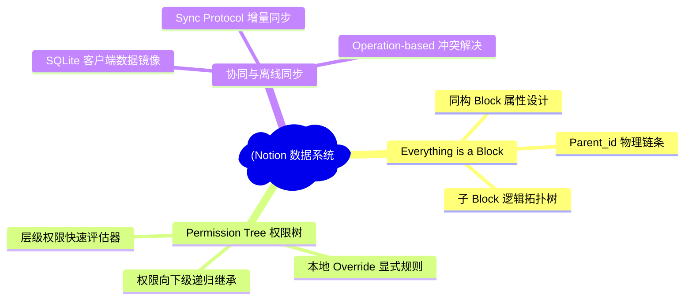
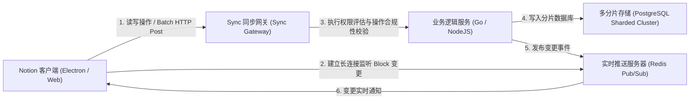
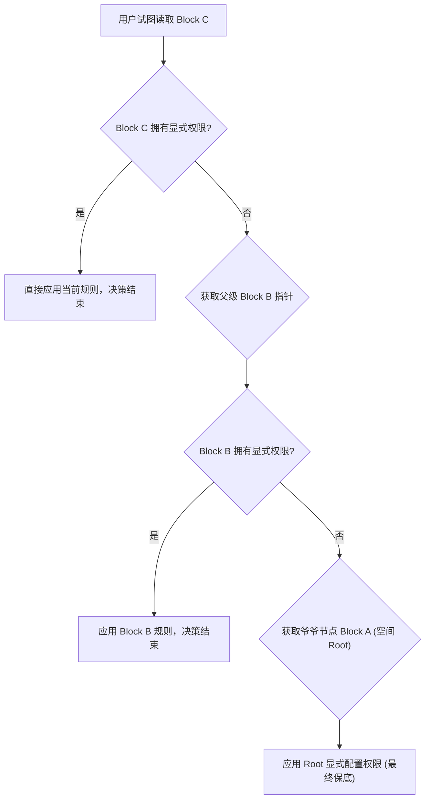
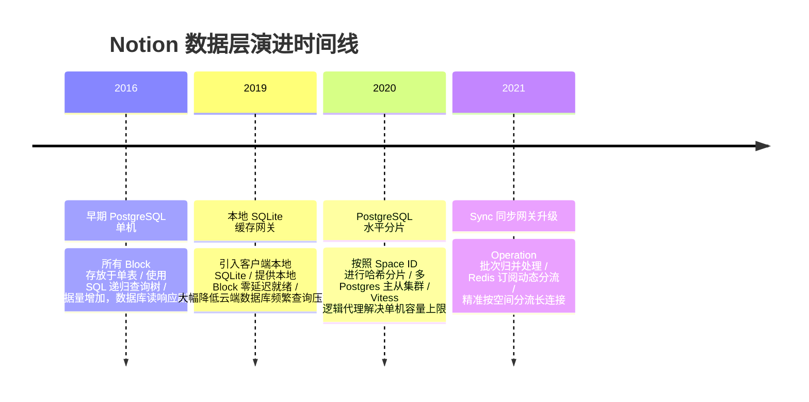

import CaseStudyHeader from '@site/src/components/CaseStudyHeader';
import DesignIntent from '@site/src/components/DesignIntent';
import ArchitectureEvolution from '@site/src/components/ArchitectureEvolution';
import TradeoffExplorer from '@site/src/components/TradeoffExplorer';
import GlossaryTerm from '@site/src/components/GlossaryTerm';
import ResearchNote from '@site/src/components/ResearchNote';
import QuizCard from '@site/src/components/QuizCard';
import CompareSlider from '@site/src/components/CompareSlider';
import GuidedExercise from '@site/src/components/GuidedExercise';
import PyRunner from '@site/src/components/PyRunner';

# Notion：万物皆 Block 的多租户协同与权限树架构

<CaseStudyHeader
  oneLiner="Notion 通过创新的 Everything is a Block 数据建模与分级树状权限继承体系，打破了传统文档的条块分割；配合轻量级 Operation 增量同步协议与 PostgreSQL Sharding 数据平面，实现了千万人级低延迟、离线就绪的高性能云协同平台。"
  stats={[
    {label: '数据模型', value: 'Everything is a Block (嵌套树)'},
    {label: '权限控制', value: 'Permission Tree (树状按需继承)'},
    {label: '协同同步', value: 'Operation-based Delta Sync (增量事务集)'},
    {label: '本地化缓存', value: 'SQLite 客户端镜像缓存'},
    {label: '底层存储', value: 'PostgreSQL 逻辑分片集群'}
  ]}
/>

:::info 对应课程概念
本案例横跨 [Month 5 分布式图数据模型](../core-components/api-gateway)、[Month 4 低阶设计 (LLD) 与设计模式](../foundations/programming-systems-primer)、[Month 6 租户隔离数据路由与缓存](../cloud-enterprise-industrial/capstone-cloud-native)。它向架构师展示了当产品数据高度异构、形态百变时，如何通过抽象出单一原子实体（Block）构建整棵文档森林，并基于指针回溯解决超高复杂度的多维权限校验与操作同步冲突。
:::

## 1. 设计初衷：打破“文档”与“行”的物理边界

在传统文档编辑器（如 Word, 早期 Google Docs）中，一篇文章是一个扁平的、包含 HTML 标记的长字符串。然而，当用户需要混合文档、看板、数据库、自建表格和嵌入视频时，传统的 HTML Document 结构在数据操纵、部分节点独立授权以及多人高度细粒度协同方面变得捉襟见肘。

Notion 团队决定在数据模型层进行底层颠覆，面临三大工程挑战：
1. **统一原子抽象（Unified Abstraction）**：无论是文本段落、待办清单、多级标题，还是整张 Database 看板、看板中的每一行，在底层都被视为一个同构实体 —— **<GlossaryTerm term="Everything is a Block" definition="万物皆 Block：Notion 的核心数据模型哲学。所有可见或不可见的节点（文本、图片、页面、数据库节点、嵌套视图）在底层都表示为 Block 实体，拥有相同的 parent_id 引用，通过逻辑树结构组织成完整的文档系统。">Everything is a Block（万物皆 Block）</GlossaryTerm>**。
2. **树状权限继承的判定耗时**：大型企业工作区拥有数十万个 Block。当子节点默认继承父页面权限时，在用户并发加载大量 Block 树的过程中，系统必须在毫秒级内依据**<GlossaryTerm term="Permission Tree" definition="树形权限继承树：指用户的安全权限（Read/Write/None）沿着 Block 的 parent 指针层层向上追溯，直到在祖先节点或空间 Root 节点找到显式配置的规则。">权限树（Permission Tree）</GlossaryTerm>**向上追溯直到空间 Root，且需抗住高频读写，避免数据库发生递归查询风暴。
3. **低算力离线协同（Offline-First Setup）**：客户端需要在断网下离线工作，并在联网后优雅地将离线操作集与服务器合并。这要求必须将传统富文本协同协议精简为高效、易排序的 **Operation 事务操作数组**。

Notion 依靠 Block-based 文档树与本地 SQLite 镜像缓存，给出了优雅的云原生解答。

<DesignIntent
  problem="如何在高度复杂、异构的嵌套文档协作系统中，设计一套支持百万级并发、高吞吐、强隔离的 Block 数据模型与权限树继承引擎，并保障离线编辑时的毫秒级响应与增量同步？"
  users="全球上亿办公协同用户，要求团队空间内各个子 Block 权限秒级生效，拖拽排版体验如丝般顺滑，断网编辑后上线无痛同步。"
  devices="跨平台的 Electron 桌面端（内置 SQLite 本地缓存镜像）、浏览器端及 iOS/Android 移动端客户端。"
  goals={[
    'Everything is a Block 实体建模：每个 Block 维护 parent_id、type 和 properties 等元数据，使全部文档关系表达为一棵多叉树。',
    '权限树路径向上评估：利用 parent 链回溯查找授权节点，在本地缓存权限树的拓扑关系以规避数据库递归查询。',
    '基于 Operation 的增量同步协议：将用户的每一次输入、拖拽操作抽象为单一的 Transaction Op 事务元组，实现多端广播去重。',
    '客户端 SQLite 本地离线就绪缓存：在 Electron 客户端持久化整个空间的 Block SQLite 镜像，实现瞬时 boot 启动。'
  ]}
  constraints={[
    'PostgreSQL Sharding 迁移代价：在大规模空间（Space）的写入请求下，需要基于 Space ID 对 MySQL 或 Postgres 实例进行水平分片，涉及跨空间的 Block 移动时需要分布式数据搬迁。',
    '网络延迟对抗：在弱网或网络瞬断下，客户端的 Operation 队列在本地自动缓存，重连后以幂等方式批量提交。'
  ]}
  firstStep="建立同构 Block 节点的树状内存拓扑；设计并实现自底向上的权限继承追溯算法；引入 Operation 操作包队列以承载协同传输。"
/>

## 2. 系统功能全景

以下是 Notion 核心 Block 存储与协同系统功能全景图：



---

## 3. 最新架构总览

Notion 系统主要由前端渲染引擎、Sync 协同网关、分片数据库路由，以及客户端本地 SQLite 镜像层组成：

### 3a. 系统上下文图 (System Context)



### 3b. 容器架构图 (Container)

```mermaid
graph TB
  subgraph UserDevice["Notion 客户端容器"]
    Editor["网格编辑器 (React Grid Engine)"]
    LocalSQL["("SQLite 客户端本地缓存镜像")"]
    SyncManager["本地同步事务管理器 (Sync Manager)"]
  end

  subgraph GatewayPlane["协同网关平面"]
    SyncGateway["同步网关 (Sync Gateway - Go)"]
    AuthEvaluator["权限树评估引擎 (Auth Evaluator)"]
  end

  subgraph CachePlane["缓存网络平面"]
    RedisPubSub["Redis 实时发布订阅集群"]
    BlockCache["Memcached Block 内存缓存"]
  end

  subgraph DataPlane["存储底座"]
    PGRouter["PostgreSQL 空间哈希路由中台"]
    PGShard1["("Postgres 分片 1 (Space A-K)")"]
    PGShard2["("Postgres 分片 2 (Space L-Z)")"]
  end

  Editor <-->|读写数据| LocalSQL
  Editor -->|操作流水线| SyncManager
  SyncManager <-->|批量 Transaction Ops (HTTPS)| SyncGateway
  
  SyncGateway <-->|快速判定权限| AuthEvaluator
  AuthEvaluator <-->|读取 Block 上游父级| BlockCache
  
  SyncGateway -->|写入持久化| PGRouter
  PGRouter --> PGShard1
  PGRouter --> PGShard2

  SyncGateway -->|通知变更广播| RedisPubSub
  RedisPubSub -.->|变更推送| SyncManager
```

---

## 4. 核心机制拆解

### 4a. 统一的原子抽象：Everything is a Block

在 Notion 架构中，没有专门的文件存储或扁平 HTML 概念。整篇文章在数据库中仅仅是几十个通过 `parent_id` 串联起来的 Block 实体。

例如，当你在页面中创建一个子页面，并写上一段文字和一个图片：
1. **Page Block (Root)**: 它的 `type` 是 `page`，`parent_id` 是用户的工作区 Space ID。
2. **Text Block**: 它的 `type` 是 `text`，`parent_id` 是 Page Block 的 ID。
3. **Image Block**: 它的 `type` 是 `image`，`parent_id` 是 Page Block 的 ID。

这种万物皆 Block 的数据结构极其利于数据的局部加载与协作：
- 客户端只需监听特定的 Block ID 的更新。
- 移动拖拽 Block（如将一个图片从 Page A 移入 Page B）在底层仅需修改一条数据记录：`UPDATE blocks SET parent_id = 'Page_B_ID' WHERE id = 'Image_Block_ID'`，即可无缝完成，而不需要重写整个长富文本字符串。

```mermaid
graph TD
  SpaceRoot["工作区主空间 (Workspace Space)"] -->|包含| PageA["页面 Block (Page A)"]
  PageA -->|子 Block 1| Text1["文本 Block: 'Notion 架构介绍'"]
  PageA -->|子 Block 2| Image1["图片 Block: (Diagram.png)"]
  PageA -->|子 Block 3 (嵌套页面)| PageB["子页面 Block (Page B)"]
  PageB -->|子 Block| Text2["文本 Block: '子页内容'"]
```

### 4b. 树形权限继承算法 (Permission Tree Evaluating)

因为文档是嵌套的，Notion 采用**按需递归继承模型（On-demand Recursive Permission）**：
1. **隐式继承**：用户请求读取 `Text2`，引擎先检查 `Text2` 是否有显式权限规则（如：是否有人单独配置了 `Text2` 的只读/不可见规则）。若没有，顺着 `parent_id` 向上查找 `PageB` 的权限。
2. **继续回溯**：若 `PageB` 也没有，继续回溯到 `PageA`，直到追溯到最顶层拥有显式权限配置的 Space 根节点。
3. **防递归风暴优化**：为了避免每次判定都向 Postgres 发送 $N$ 次数据库调用，Notion 在 Memcached 内存层缓存了 Block 的父指针索引（Ancestry Chain Cache）。引擎在内存中即可完成权限树的秒级溯源，极大地减轻了持久层的负载。



### 4c. 增量事务同步协议 (Operation-based Sync Protocol)

Notion 抛弃了复杂的实时字符级 OT 协同算法，采用了更加轻量且离线友好的 **Operation-based 增量同步协议**：
1. **操作抽象化 (Operations)**：客户端的所有修改，都表示为一个 Operation 结构：
   - `id`: 操作唯一识别码。
   - `command`: 如 `set`（修改属性）、`update`（更新表征）、`listAfter`（调整 Block 排序）。
   - `path`: 指向具体的属性路径（如 `["properties", "title"]`）。
   - `args`: 操作附带的值（例如 `[["新文本段落"]]`）。
2. **增量打包与离线队列 (Transaction Queue)**：在断网时，用户的输入在本地形成一个 Operation 队列存入客户端 SQLite。恢复连接后，客户端通过 Batch HTTP 发送操作包。
3. **服务器冲突合并 (Last-Write-Wins & Operational Reordering)**：同步网关收到批量 Op 后，使用乐观并发策略将操作合并写入 PostgreSQL。对同一个 Block 的同一属性发生冲突时，通常采用 Last-Write-Wins (最终写入者胜出) 或列表操作链自动修复。随后通过 Redis Pub/Sub 将最新的 Block 状态版本推给其他在线协同用户。

```mermaid
sequenceDiagram
  autonumber
  客户端 A->>本地 SQLite: 1. 离线修改标题 (添加 Op 到本地同步队列)
  Note over 客户端 A: 处于断网状态，所有 Op 在本地挂起
  Note over 客户端 A: 重新连接网络
  客户端 A->>同步网关: 2. 批量发送增量操作集: submitTransactions([Op1, Op2])
  同步网关->>权限评估引擎: 3. 校验租户空间访问权限
  权限评估引擎-->>同步网关: 4. 权限通过 (Authorized)
  同步网关->>PostgreSQL: 5. 写入 Blocks 变更记录
  同步网关->>Redis 广播: 6. 发布事件 'Block_Update'
  Redis 广播-.>>客户端 B: 7. 推送最新 Block 数据
  客户端 B->>客户端 B: 8. 更新本地 SQLite 镜像并重新渲染界面
```

---

## 5. 关键数据结构与算法：Block 结构表示

在底层数据库中，Notion 的 Block 采用结构化 JSON 格式存储。在内存中，它被编译为支持强类型的节点对象，以便极速定位。

其典型的 Block 逻辑结构为：
```json
{
  "id": "7ac2e19d-78fe-4a92-b91c-bf1b514d241c",
  "version": 142,
  "type": "text",
  "properties": {
    "title": [["Notion 核心 Block 数据结构"]]
  },
  "parent_id": "c62b21c4-11fa-4001-9a7d-b51c36de42ee",
  "parent_table": "block",
  "alive": true,
  "space_id": "workspace_space_001"
}
```

*设计用意*：
- `parent_table` 允许 Block 挂载在不同的物理实体下（如挂载在 `space` 或是另一个 `block`，甚至是 `collection`）。这使得数据模型极度灵活，具备极强的多维演进能力。

---

## 6. 架构演进史

Notion 的底层存储和协同系统经历了如下四个维度的架构变迁：



---

## 7. 架构对比

### 传统长富文本同步 (扁平 HTML + OT) vs Notion 同构 Block 树 (Block Tree + Ops)

<CompareSlider
  before={
    <div style={{ padding: '20px', background: '#ffebee', border: '1px solid #c62828', borderRadius: '8px', height: '100%', color: '#333' }}>
      <strong>传统长富文本同步 (如 Google Docs)</strong>
      <p style={{ marginTop: '10px', fontSize: '0.9rem' }}>
        文档表示为长字符串（带有 XML/HTML 标签），多人协同依赖极度复杂的协同算法（OT - Operational Transformation）来保证并发字符插入的绝对一致性。算法开发成本极高，且无法在单个页面内混入结构化 Database 单元。
      </p>
    </div>
  }
  after={
    <div style={{ padding: '20px', background: '#e8f5e9', border: '1px solid #2e7d32', borderRadius: '8px', height: '100%', color: '#333' }}>
      <strong>Notion 同构 Block 树状模式</strong>
      <p style={{ marginTop: '10px', fontSize: '0.9rem' }}>
        文档被打散成同构 Block 多叉树。多人协同退化为针对单个 Block 属性的 Operations 增量事务修改。大幅度削减了排版冲突的概率，且天然支持局部页面授权以及在普通段落间混合嵌套数据库。
      </p>
    </div>
  }
  labels={['长富文本模式', '同构 Block 树模式']}
/>

---

## 8. 核心决策的取舍

在决定同步协议时，架构师必须在操作的灵活性与协同的一致性强度之间做出抉择：

<TradeoffExplorer
  title="多人实时协同同步策略选择"
  dimensions={['字符级冲突处理精度', '开发与架构维护成本', '复杂版面块级排布支持', '离线断网自愈能力', '海量数据分片合规性']}
  options={[
    {
      name: '操作级增量同步 (Operation-based Delta Sync - Notion 采用模式)',
      scores: [3, 5, 5, 5, 4],
      note: '以 Block 的变更 Operation 作为最小同步单位。极大降低了 OT 协议的开发复杂度，能够轻松完成拖拽布局、块级拖移；但其在极细微的同一行内多人实时打字同步时，体验比字符级 OT 略有延缓，采用 LWW 合并。',
      whenToUse: '模块化协作工具、嵌套看板/数据表混合设计、离线断网高频的办公系统。'
    },
    {
      name: '实时字符协同 (Operational Transformation - Google Docs 模式)',
      scores: [5, 1, 2, 3, 3],
      note: '能够确保每个字符、光标位置的极速对齐，极度适合单纯的长文起草。但其对结构化数据块（Block/Database）的重新排列、拖拽排版以及多租户空间水平分片数据库支持非常困难。',
      whenToUse: '以纯文本长文编辑、合同共同拟定为核心场景的轻量协同文档。'
    },
    {
      name: '无冲突复制数据类型 (CRDT - Collaborative Engine 模式)',
      scores: [5, 2, 4, 5, 2],
      note: '通过数学公式定义无冲突的数据结构，天然支持去中心化、离线多端自由合并。但内存开销巨大，垃圾回收（Garbage Collection）历史墓碑标记会严重消耗本地性能。',
      whenToUse: '局域网去中心化协同、对云端中心服务器依赖较低的离线优先应用。'
    }
  ]}
/>

---

## 9. 实践指引：实现一个 Notion 树状权限评估器

为了掌握层级文档树权限路由的原理，我们需要实现一个能够沿着 Block-Tree 自底向上回溯判断用户是否有权访问叶子节点的判定模型。

在下方练习中，构建一个带有 parent 属性的树节点结构，并通过回溯链检测算法判定租户隔离权限是否安全。

<GuidedExercise
  title="练习指引：编写一个回溯型 Block 权限链评估引擎"
  goal="构建微型 Notion 权限路由器。从目标叶子 Block 开始，递归/回溯检查 parent 路径，直到找到拥有显式权限配置的祖先 Block，返回该用户的有效权限等级（Write, Read, None）。"
  hints={[
    '每个 Block 使用对象表示，含有 `parent_id` 属性。可以把所有的 Block 存储在一个字典里供全局查找。',
    '权限配置字典样例：`permissions = {"Alice": "write", "Bob": "read"}`，若为空则代表其为继承状态。',
    '循环引用环路预防：回溯过程中必须用集合记录已访问过的节点 ID，若遇到重复 ID 说明拓扑关系被篡改，需立刻中断回溯避免无限循环。'
  ]}
  steps={[
    '创建 `Block` 类，保存 Block 元数据、parent 引用、以及特异性显式权限。',
    '实现 `NotionAuthEvaluator` 主评估类，包含 `add_block(block)` 以及 `resolve_permission(user_id, block_id)` 方法。',
    '在 `resolve_permission` 中，使用 `while` 循环沿着 parent 链向上追踪，如果中途某个 Block 显式配置了该用户的权限，立即返回；若到 Root 仍无，默认返回 `none`。',
    '构造多层嵌套文档，包含局部覆盖权限的 Block，并运行仿真验证判定准确性。'
  ]}
  checks={[
    '子 Block 能正确继承数层之上的 Space 根节点的权限配置。',
    '如果子 Block 局部配置了 Override 权限规则，系统能正确中断回溯并优先采用该局部规则。'
  ]}
/>

#### 交互式 Python 运行实验
在下方控制台中运行并修改已准备好的 Block 权限评估与回溯仿真代码，观察树状节点在不同继承层次下的安全结果：

<PyRunner
  expect="分片路由与隔离验证成功"
  rows={25}
  code={`class Block:
    def __init__(self, block_id, block_type, parent_id=None, permissions=None):
        self.block_id = block_id
        self.block_type = block_type
        self.parent_id = parent_id
        # permissions: {"user_id": "read" | "write" | "none"}
        # 如果空代表没有显式规则，采用继承模式
        self.permissions = permissions or {}

class NotionAuthEvaluator:
    def __init__(self):
        self.blocks = {}
        
    def add_block(self, block):
        self.blocks[block.block_id] = block
        
    def resolve_permission(self, user_id: str, block_id: str) -> str:
        curr_id = block_id
        visited = set()
        
        print(f"[Engine] 正在为用户 '{user_id}' 评估 Block '{block_id}' 的安全访问级别...")
        
        # 自底向上追溯 parent_id 链
        while curr_id:
            # 环路阻断安全机制
            if curr_id in visited:
                print(f"⚠️ 安全警报：检测到 Block-Tree 层级循环指针：{curr_id}")
                return "none"
            visited.add(curr_id)
            
            block = self.blocks.get(curr_id)
            if not block:
                break
                
            # 若检测到当前节点存在该用户的显式 Override 配置，立刻返回
            if user_id in block.permissions:
                role = block.permissions[user_id]
                print(f"   -> 在 Block '{curr_id}' 找到显式规则: {role}")
                return role
                
            # 否则，向上追溯至父 Block
            print(f"   -> Block '{curr_id}' 无显式规则，沿着 parent 追溯到 '{block.parent_id}'")
            curr_id = block.parent_id
            
        print("   -> 链条终结未找到规则，默认分配：none")
        return "none"

# 1. 实例初始化
evaluator = NotionAuthEvaluator()

# 2. 建立典型的 Notion Block 层级多叉树
# 空间 Root 页面 (拥有根权限)
evaluator.add_block(Block("space_root", "page", parent_id=None, permissions={"Alice": "write", "Bob": "read"}))
# 子页面 A (无显式权限，代表继承)
evaluator.add_block(Block("page_a", "page", parent_id="space_root"))
# 子页面 A 中的第一段文本 (继承)
evaluator.add_block(Block("text_1", "text", parent_id="page_a"))
# 子页面 A 中的第二段敏感文本 (本地重写规则：Bob 不可见)
evaluator.add_block(Block("restricted_text", "text", parent_id="page_a", permissions={"Bob": "none"}))

print("--- 测试 1: Alice 访问常规段落 text_1 ---")
perm_alice = evaluator.resolve_permission("Alice", "text_1")
print(f"=> 最终判定结果: {perm_alice} (期望: write)\n")

print("--- 测试 2: Bob 访问常规段落 text_1 ---")
perm_bob_ok = evaluator.resolve_permission("Bob", "text_1")
print(f"=> 最终判定结果: {perm_bob_ok} (期望: read)\n")

print("--- 测试 3: Bob 访问受限段落 restricted_text ---")
perm_bob_fail = evaluator.resolve_permission("Bob", "restricted_text")
print(f"=> 最终判定结果: {perm_bob_fail} (期望: none)\n")
`}
/>

---

## 10. 知识自测

完成自测以检验你对 Block 嵌套模型、权限树回溯、Operation 同步与本地 SQLite 镜像的掌握程度：

<QuizCard
  questions={[
    {
      q: 'Notion 采用的 “Everything is a Block” 模型，对于多人拖拽布局排版及嵌套 Database 协作而言，在工程实现上面临的最核心优势是什么？',
      options: [
        'A. 文档所有的内容都被打散为具有唯一 ID 的同构原子节点，拖拽操作在底层仅需修改目标 Block 的 parent_id 引用，极大地简化了数据冲突合并算法并支持块级独立版本控制与权限控制',
        'B. 让文档可以直接转化为可执行的 Python 脚本',
        'C. 彻底消除了对 Web 浏览器的需求，完全由命令行操作',
        'D. 大幅度增加了文档中能插入的图片像素大小'
      ],
      answer: 0,
      explain: '这正是 Block-based 哲学的精髓。相比传统 HTML 长文容易发生大片区域的合并冲突，Notion 的每一段、每一图都是完全独立、具有 parent_id 指针的 Block 对象。因此拖拽仅仅是修改 parent 属性，无需改变文档其他模块，天然降低冲突概率。'
    },
    {
      q: '在大规模租户空间内，Notion 是如何避免权限树继承追溯在数据库层引起高频递归查询（查询风暴）的？',
      options: [
        'A. 取消所有的父级权限继承，强迫用户对每一个文本块都手动单独配置权限',
        'B. 通过在前端客户端强制运行多线程，让用户的浏览器分担数据库压力',
        'C. 在中心内存缓存层（Memcached）维护 Block 的父指针结构，在内存中进行自底向上的轻量路径评估，仅在缓存完全失效时才向 Postgres 实例发起批量查询',
        'D. 使用完全去中心化的局域网 P2P 网络同步所有人的权限列表'
      ],
      answer: 2,
      explain: '权限树判定是一项极度频繁的高频读。Notion 在缓存层对 Block 关系拓扑进行紧凑存储，保证了自底向上的 parent 追溯完全在内存中通过指针偏移完成，保护了后端的 PostgreSQL 分片数据库。'
    },
    {
      q: 'Notion 基于 Operation 的增量同步协议中，当客户端离线编辑时是如何工作的？',
      options: [
        'A. 客户端在离线时强行锁定界面不准用户输入，直到网络恢复',
        'B. 客户端本地拦截用户的每一次改动并格式化为 Operation 结构，持久化存入客户端本地 SQLite 离线队列中；连接重连后，将 Ops 打包通过批量接口同步至网关，用 optimistic LWW 解决潜在的同步冲突',
        'C. 客户端自动下载整个 Notion 公司的 PostgreSQL 数据集到本地运行',
        'D. 每次断网都会自动丢失全部未保存的更改，并在重新联网后完全重写'
      ],
      answer: 1,
      explain: 'Offline-First 的设计依赖本地坚实的数据镜像。Notion 客户端内置本地 SQLite，它不仅仅是缓存，更是 Block 状态在本地的微型数据库镜像。离线编辑转化为本地 SQLite 写入与挂起的 Op 队列，并在联网时自动上报，极大保障了体验流畅性与网络隔离韧性。'
    }
  ]}
/>

## 来源

- [How Notion Sharded Its PostgreSQL Database (Notion Engineering Blog)](https://www.notion.so/blog/sharding-notions-postgresql-database)
- [Collaborative Document Systems: Operation-based Sync Protocols and Block Architecture](https://dl.acm.org/doi/book/10.5555/3159187)
- [Notion's Collaborative Sync Engine - Transactions and Delta Merging Rules](https://developers.notion.com/)
- [Understanding SQLite Cache and Electron Native Integrations in Desktop Apps](https://www.sqlite.org/whentouse.html)