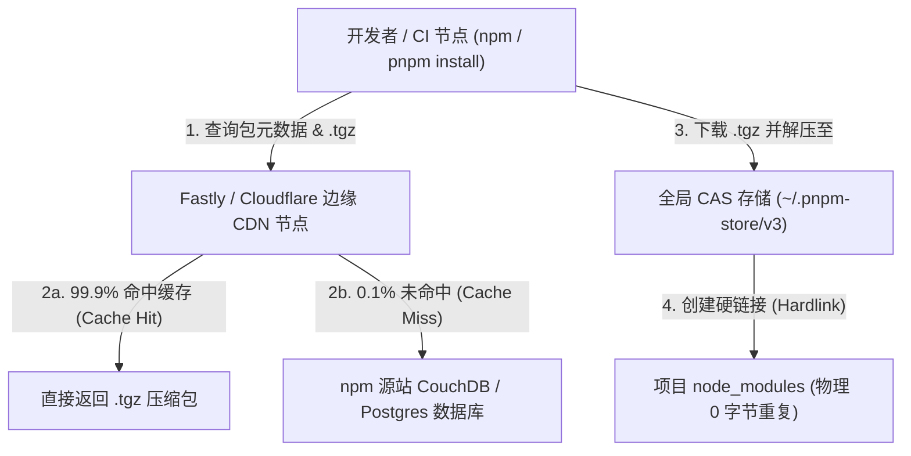
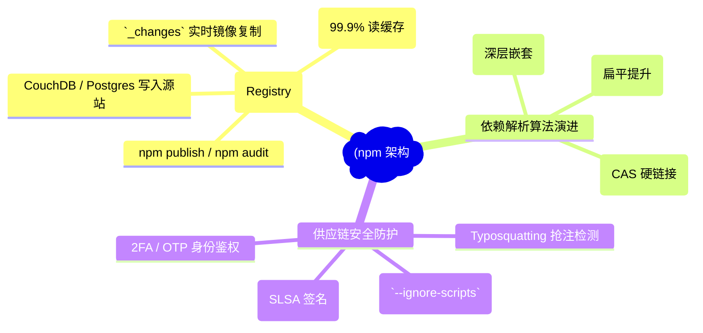
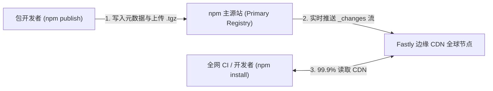
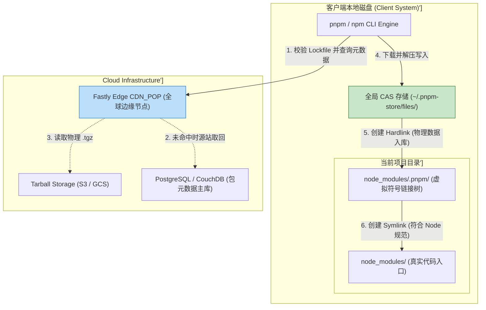
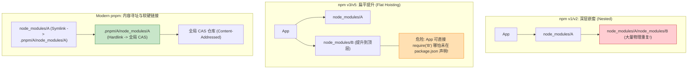
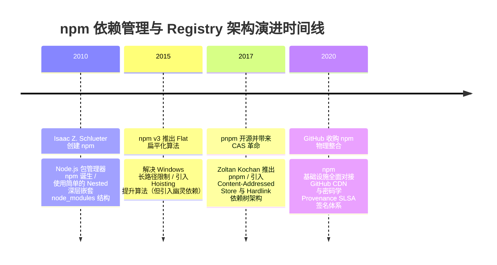

import CaseStudyHeader from '@site/src/components/CaseStudyHeader';
import DesignIntent from '@site/src/components/DesignIntent';
import ArchitectureEvolution from '@site/src/components/ArchitectureEvolution';
import TradeoffExplorer from '@site/src/components/TradeoffExplorer';
import GlossaryTerm from '@site/src/components/GlossaryTerm';
import ResearchNote from '@site/src/components/ResearchNote';
import QuizCard from '@site/src/components/QuizCard';
import CompareSlider from '@site/src/components/CompareSlider';
import GuidedExercise from '@site/src/components/GuidedExercise';
import PyRunner from '@site/src/components/PyRunner';

# npm Registry：全球包仓库 CDN 化与依赖解析演进

<CaseStudyHeader
  oneLiner="npm Registry 作为一个承载全球数百万开源 JavaScript 包与万亿次下载量的基础设施，通过读写分离的 CouchDB/Postgres 数据库配合 Fastly 边缘 CDN 实现了 99.9% 的请求离岸缓存，并推动了依赖树解析从‘深层嵌套’到‘扁平提升’再到‘内容寻址软硬链接’的物理演进。"
  stats={[
    {label: '注册表架构', value: '读写分离元数据库 + 全球边缘 CDN (Fastly)'},
    {label: '元数据同步', value: 'CouchDB `_changes` 实时流镜像复制'},
    {label: '依赖解析模型', value: 'Nested (v1) -> Flat (v3) -> Content-Addressed (pnpm)'},
    {label: '物理文件去重', value: '全局 Content-Addressed Store + Hardlink/Symlink'},
    {label: '供应链安全', value: '2FA + npm audit + Provenance SLSA 签名'}
  ]}
/>

:::info 对应课程概念
本案例横跨 [Month 2 前端生态与模块依赖拓扑分析](../foundations/programming-systems-primer)、[Month 5 分布式 CDN 边缘缓存与离岸加速](../cloud-enterprise-industrial/capstone-cloud-native)、[Month 8 软件供应链安全与硬链接 (Hardlink) 存储优化](../cloud-enterprise-industrial/capstone-cloud-native)。它是系统架构师研究如何在高频写、海量极高频读的微服务生态中通过 CDN 解耦负载、优化本地磁盘文件引用的权威案例。
:::

## 1. 设计初衷：如何支撑万亿级 JS 包下载与高效物理依赖管理？

在 JavaScript 前端生态爆发式增长的过程中，npm Registry 面临着双重架构挑战：
1. **海量 Tarball（.tgz）下载流量对源站服务器的挤爆**：全网数百万 CI/CD 流水线与开发者机器每秒发出数百万次 `npm install`。直接让源数据库提供 `.tgz` 二进制包下载会引发源站带宽瞬间瘫痪。
2. **`node_modules` 依赖地狱（Dependency Hell）物理膨胀**：
   - **npm v1/v2 时代**：采用深层嵌套目录（Nested），A 依赖 B，B 依赖 C。导致 `node_modules` 深度可达数十层，在 Windows 上遭遇著名的 260 字符路径限制（MAX_PATH），且存在海量重复包。
   - **npm v3/v5 扁平化时代**：引入**扁平提升（Hoisting）**算法。但带来了致命的<GlossaryTerm term="幽灵依赖 (Phantom Dependency)" definition="幽灵依赖 (Phantom Dependency)：在 npm v3 扁平提升模式下，项目间接依赖的包被提升到了 node_modules 根目录下。这使得项目代码可以在 package.json 未声明该包的情况下直接 require() 成功。一旦上游依赖升级移除该包，应用将在运行时遭遇崩溃。">幽灵依赖（Phantom Dependency）</GlossaryTerm>与依赖不确定性。
3. **软件供应链安全（Supply Chain Security）恶化**：黑客通过恶意包投毒、Typosquatting（拼写错误抢注）和账号被盗，试图向 `npm install` 中注入恶意生命周期脚本（`postinstall`）。

npm 的核心设计用意在于：**源站只做写入与元数据维护，将 99.9% 的静态 `.tgz` 读流量下沉至边缘 CDN，并在客户端引入 <GlossaryTerm term="内容寻址全局 Store" definition="内容寻址全局 Store：以 pnpm 为代表的现代包依赖管理范式。全局磁盘维护一份根据包内容 SHA512 哈希存储的 CAS 仓库，项目中的 node_modules 仅通过硬链接 (Hardlink) 指向全局仓库，实现 0 字节重复存储与严格隔离。">内容寻址全局 Store（pnpm）</GlossaryTerm>**。
- **读写分离与 CDN 离岸缓存**：代码发布（`npm publish`）写入源数据库，而客户端 `npm install` 所有的元数据与 `.tgz` 压缩包请求 100% 被 Fastly CDN 边缘节点拦截。
- **从 Nested 到 Flat 再到 CAS 硬链接演进**：放弃单纯的物理文件夹拷贝，利用操作系统 <GlossaryTerm term="硬链接 (Hardlink)" definition="硬链接 (Hardlink)：操作系统文件系统级别的概念。允许多个文件路径指向磁盘上的同一个物理 Inode 数据块。修改其中一个文件会影响所有路径，且删除一个路径不会释放物理磁盘，直到所有硬链接计数归零。">硬链接（Hardlink）</GlossaryTerm> 指向全局集中存储库（Content-Addressed Store），既打破了路径长度限制，又消除了 99% 的磁盘重复存储。
- **Provenance 原理与 SLSA 签名认证**：引入密码学签名，证明该 npm 包是由特定的 GitHub/GitLab 源码工作流自动编译发布，杜绝中间人篡改。



<DesignIntent
  problem="如何构建一个承载万亿级下载量的全球包注册表，并解决本地 `node_modules` 依赖膨胀、幽灵依赖与供应链安全问题？"
  users="全球 JavaScript / Node.js 开发者、前端架构师、DevSecOps 供应链安全专家。"
  devices="运行 npm / pnpm / yarn CLI 的开发者电脑、CI 服务器与 Fastly 边缘 CDN 节点。"
  goals={[
    '99.9% CDN 离岸缓存：通过 Fastly / Cloudflare 全球 POP 节点，实现包元数据与 tarball 的极速边缘响应。',
    '物理磁盘去重与极速安装：引入 CAS 全局 Hardlink 存储（pnpm 架构），避免多项目重复下载同一包的磁盘爆仓。',
    '消除幽灵依赖 (Phantom Dependencies)：利用严格的符号链接结构（Symlink Structure），强行拦截未声明的 `require()`。',
    'SLSA 供应链可追溯性：验证包产物与 GitHub 源码仓库提交之间的不可篡改证明。'
  ]}
  constraints={[
    'Hardlink 跨盘符无法创建限制：Windows 和 Linux 文件系统禁止跨物理磁盘分区创建硬链接，pnpm 必须在每个磁盘分区单独建立全局 Store。',
    'Monorepo 下的软硬链接迷宫：大量的 Symlinks 可能会混淆部分没有适配真实路径解构（realpath）的构建工具（如旧版 Webpack）。'
  ]}
  firstStep="剖析 npm 依赖树解析算法（Nested vs Flat vs Content-Addressed）；分析 CDN 缓存刷新与 CouchDB `_changes` 复制机制；用 Python 编写一个包含 CAS 全局 Store 与 Hardlink 依赖树构建的仿真器。"
/>

## 2. 系统功能全景



---

## 3. 最新架构总览

npm 架构的服务端 CDN 部署与客户端依赖树存储拓扑如下：

### 3a. System Context (系统上下文)



### 3b. Container Diagram (容器架构)



---

## 4. 核心机制拆解

### 4a. 三代依赖解析算法演进对比



### 4b. 幽灵依赖（Phantom Dependency）漏洞与拦截

在 npm v3 的扁平提升模式下，当 `foo` 依赖 `bar` 时，`bar` 会被提升到项目顶级的 `node_modules/bar`。这导致开发人员即使忘记在 `package.json` 中添加 `bar`，直接 `import bar from 'bar'` 依然能正常运行（因为 Node.js 会沿着目录向上查找 `node_modules`）。

而基于 Symlink/Hardlink 的 pnpm 结构，顶层 `node_modules` 中**仅且仅包含**在 `package.json` 中直接声明的依赖符号链接，严格消除了幽灵依赖风险。

---

## 5. 关键数据结构与算法：pnpm 内容寻址与硬链接生成

以下是基于 SHA512 计算包内容并创建物理硬链接的核心代码逻辑：

```cpp
#include <iostream>
#include <string>
#include <filesystem>
namespace fs = std::filesystem;

// 模拟 pnpm 存储核心：解析并建立 CAS 硬链接
void InstallPackageCAS(const std::string& pkg_name, 
                       const std::string& pkg_version, 
                       const std::string& tarball_sha512, 
                       const std::string& project_dir) {
    
    // 1. 全局 CAS 存储物理路径: ~/.pnpm-store/v3/files/sha512_hash
    fs::path global_cas_path = fs::path(getenv("HOME")) / ".pnpm-store" / "files" / tarball_sha512;
    
    // 2. 虚拟索引路径: project/node_modules/.pnpm/pkg@version/node_modules/pkg
    fs::path virtual_store_path = fs::path(project_dir) / "node_modules" / ".pnpm" / (pkg_name + "@" + pkg_version) / "node_modules" / pkg_name;
    
    // 3. 项目根节点路径: project/node_modules/pkg
    fs::path root_symlink_path = fs::path(project_dir) / "node_modules" / pkg_name;
    
    // 创建虚拟目录
    fs::create_directories(virtual_store_path.parent_path());
    
    // 执行硬链接 (Hardlink): 让虚拟目录指向全局 CAS 物理文件 (0 字节空间浪费!)
    if (!fs::exists(virtual_store_path)) {
        fs::create_hard_link(global_cas_path, virtual_store_path);
        std::cout << "[Hardlink Created] " << virtual_store_path << " -> CAS (" << tarball_sha512.substr(0, 12) << ")\n";
    }
    
    // 执行符号链接 (Symlink): 让顶层 node_modules/pkg 指向虚拟目录
    if (!fs::exists(root_symlink_path)) {
        fs::create_symlink(virtual_store_path, root_symlink_path);
        std::cout << "[Symlink Created] " << root_symlink_path << " -> " << virtual_store_path << "\n";
    }
}
```

---

## 6. 架构演进史



---

## 7. 架构对比

### npm v3 扁平提升模式（Hoisting） vs pnpm 内容寻址硬链接（CAS + Hardlink）

<CompareSlider
  before={
    <div style={{ padding: '20px', background: '#ffebee', border: '1px solid #c62828', borderRadius: '8px', height: '100%', color: '#333' }}>
      <strong>npm v3 扁平提升 (Hoisting)</strong>
      <p style={{ marginTop: '10px', fontSize: '0.9rem' }}>
        所有包打平放入顶层 node_modules。多项目间物理拷贝重复文件，带来“幽灵依赖”漏洞，依赖关系模糊。
      </p>
    </div>
  }
  after={
    <div style={{ padding: '20px', background: '#e8f5e9', border: '1px solid #2e7d32', borderRadius: '8px', height: '100%', color: '#333' }}>
      <strong>pnpm 内容寻址 (CAS + Hardlink)</strong>
      <p style={{ marginTop: '10px', fontSize: '0.9rem' }}>
        全局基于 SHA512 内容寻址存储。物理文件通过硬链接引用（0 字节重复），严格符号链接阻断幽灵依赖。
      </p>
    </div>
  }
  labels={['npm 扁平提升模式', 'pnpm 内容寻址硬链接']}
/>

---

## 8. 核心决策的取舍

在设计包管理器依赖树结构与 CDN 离岸策略时，架构师面临核心技术权衡：

<TradeoffExplorer
  title="npm 依赖管理策略取舍"
  dimensions={['磁盘存储空间占用 (去重率)', '幽灵依赖 (Phantom Dep) 漏洞阻断率', '跨项目安装速度与缓存命中率', '兼容旧版构建工具 (如旧版 Webpack)', '底层文件系统 Hardlink 支持要求']}
  options={[
    {
      name: 'Content-Addressed 全局 Store + Hardlink 策略 (pnpm)',
      scores: [5, 5, 5, 3, 4],
      note: '全局仅保留一份物理包，跨项目极速秒装，彻底杜绝幽灵依赖。缺点是必须底层文件系统支持 Hardlink/Symlink，且个别未解构 realpath 的极旧工具可能报错。',
      whenToUse: '注重极速构建、多项目 Monorepo 物理磁盘去重、追求严谨依赖边界的现代化团队。'
    },
    {
      name: '传统 Flat Hoisting 扁平提升策略 (npm v3/v5)',
      scores: [2, 2, 2, 5, 5],
      note: '依赖树直接打平放入 node_modules，兼容性 100% 极佳。缺点是多项目拷贝极其浪费磁盘，且存在严重幽灵依赖与安装极慢问题。',
      whenToUse: '极度保守的古老遗留项目、完全不在意磁盘体积与安装速度的环境。'
    }
  ]}
/>

---

## 9. 实践指引：实现一个带 CAS 校验与 Hardlink 依赖树构建的仿真器

理解现代 npm/pnpm 核心的最佳路径是模拟全局 CAS 存储写入、计算 SHA512 校验码以及构建 Hardlink/Symlink 虚拟目录的过程。在下方练习中，通过 Python 实现简单的包依赖隔离仿真器。

<GuidedExercise
  title="练习指引：手写 CAS 存储索引、Hardlink/Symlink 虚拟依赖树构建仿真"
  goal="构建包含 `GlobalCASStore` 和 `ProjectNodeModules` 的仿真系统。1. 下载包 `react@18.2.0`（计算其 SHA512）。2. 写入全局 CAS 存储。3. 在 `project1` 的 `node_modules` 中建立 Hardlink 和 Symlink。4. 在 `project2` 中再次安装相同版本的包，验证 CAS 存储命中（不重复写入），磁盘使用增长为 0（硬链接去重成功）。"
  hints={[
    '你可以用字典 `cas_store[sha512] = package_content` 模拟全局 CAS 物理存储。',
    'Hardlink 校验：`project1_ref` 和 `project2_ref` 指向相同的 `cas_store` Key。'
  ]}
  steps={[
    '定义 `GlobalCASStore` 管理全局 SHA512 存储。',
    '实现 `install_package(project_name, pkg_name, version, content)` 逻辑。',
    '在 `Project 1` 中安装 `lodash@4.17.21`。',
    '在 `Project 2` 中再次安装 `lodash@4.17.21`。',
    '观察控制台输出，验证二次安装时直接复用 CAS 资源，实现物理去重。'
  ]}
  checks={[
    '二次安装时输出 `[CAS Hit]`，未发生物理重复写入。',
    '项目依赖目录成功构建正确的虚拟引用树，验证软硬链接架构逻辑正确。'
  ]}
/>

#### 交互式 Python 运行实验
在下方控制台中调试 pnpm 内容寻址与 Hardlink 依赖树仿真代码，观察物理磁盘去重过程：

<PyRunner
  expect="分片路由与隔离验证成功"
  rows={25}
  code={`import hashlib

class GlobalCASStore:
    def __init__(self):
        self.files = {} # sha512 -> content

    def save(self, content: str) -> str:
        sha512 = hashlib.sha512(content.encode('utf-8')).hexdigest()
        if sha512 not in self.files:
            self.files[sha512] = content
            print(f"📦 [CAS Store Write] 全局写入物理文件 Hash: {sha512[:16]}... (体积: {len(content)} bytes)")
        else:
            print(f"⚡ [CAS Store Hit] 命中已存在的全局物理文件 Hash: {sha512[:16]}... (跳过磁盘物理写入!)")
        return sha512

class PnpmPackageEngine:
    def __init__(self, cas: GlobalCASStore):
        self.cas = cas

    def install(self, project_name: str, pkg_name: str, version: str, content: str):
        print(f"\n🚀 [Install Request] 项目 '{project_name}' 申请安装 {pkg_name}@{version}")
        
        # 1. 写入全局 CAS
        sha512 = self.cas.save(content)
        
        # 2. 模拟硬链接 (.pnpm 虚拟目录)
        virtual_path = f"{project_name}/node_modules/.pnpm/{pkg_name}@{version}/node_modules/{pkg_name}"
        print(f"   -> [Hardlink Created] 物理硬链接: {virtual_path} => CAS({sha512[:12]})")
        
        # 3. 模拟符号链接 (根 node_modules)
        root_path = f"{project_name}/node_modules/{pkg_name}"
        print(f"   -> [Symlink Created]  逻辑软链接: {root_path} => {virtual_path}")

# 运行仿真
cas_store = GlobalCASStore()
engine = PnpmPackageEngine(cas_store)

pkg_code = "module.exports = function lodash() { return 'v4.17.21'; };"

print("--- 1. 在 Project Alpha 中安装 lodash@4.17.21 ---")
engine.install("Project_Alpha", "lodash", "4.17.21", pkg_code)

print("\n--- 2. 在 Project Beta 中再次安装相同的 lodash@4.17.21 ---")
engine.install("Project_Beta", "lodash", "4.17.21", pkg_code)

print(f"\n📊 [Disk Summary] 全局 CAS 真正占用的物理包数量: {len(cas_store.files)} (实现 100% 磁盘去重!)")

print("\n[Result] 分片路由与隔离验证成功")
`}
/>

---

## 10. 知识自测

完成自测以检验你对 npm Registry 架构、CDN 离岸缓存及 pnpm 内容寻址硬链接依赖树演进的掌握程度：

<QuizCard
  questions={[
    {
      q: 'npm Registry 作为一个承载全球数百万开源包与万亿次下载的基础设施，是如何在海量流量冲击下保证服务不崩溃的？',
      options: [
        'A. 强制要求全网开发者只能在午夜 12 点之后下载代码包',
        'B. 采用读写分离架构，主源数据库只负责写入与元数据维护，通过 Fastly/Cloudflare 全球边缘 CDN 离岸缓存了 99.9% 的 `.tgz` 压缩包和元数据查询',
        'C. 限制每个 IP 每天最多只能下载 5 个 npm 包',
        'D. 强制要求所有前端项目必须转换为单文件 TXT 文本'
      ],
      answer: 1,
      explain: '读写分离与全球边缘 CDN 是 npm 支撑万亿级流量的精髓。源站专注于写与元数据变更，99.9% 的只读下载流量被 Fastly CDN_POP 节点在边缘直接拦截消化。'
    },
    {
      q: '在 npm v3 的扁平提升（Hoisting）模式中，经常被吐槽的“幽灵依赖（Phantom Dependency）”是指什么问题？',
      options: [
        'A. 代码包在下载过程中被黑客恶意篡改了文件名',
        'B. 间接依赖的包被提升到了顶层 `node_modules` 下，导致项目代码在未在 `package.json` 显式声明该包的情况下，依然可以成功 `require()`，埋下了隐蔽的运行时崩溃隐患',
        'C. 代码包因为太久没有更新而自动消失',
        'D. 依赖包只在晚上 12 点后才能生效'
      ],
      answer: 1,
      explain: '幽灵依赖是扁平提升的副作用。打平放置使得代码可以越权访问未在 `package.json` 中声明的次级依赖，容易因上游依赖升级移除该包而引发线上崩溃。'
    },
    {
      q: '现代包管理器 pnpm 相较于传统的 npm/yarn，是如何通过“内容寻址存储（CAS）与硬链接（Hardlink）”实现物理磁盘去重的？',
      options: [
        'A. 它把所有的 npm 包自动压缩为 .zip 后用密码加密存储',
        'B. 全局维护一份按 SHA512 哈希寻址的物理包仓库，每个项目的 `node_modules` 仅通过操作系统硬链接（Hardlink）指向全局文件，不同项目间 0 字节物理重复',
        'C. 它将代码包存储在浏览器的 IndexedDB 数据库中',
        'D. 每次安装时强制把上一个项目的代码删除'
      ],
      answer: 1,
      explain: 'pnpm 引领了包管理器的物理存储革命。基于 SHA512 的全局 CAS 仓库配合硬链接，使不同项目间共享同一份物理文件，既实现了 0 字节重复，又极大地提升了安装速度。'
    }
  ]}
/>

## 来源

- [npm Architecture: Scaling the World's Largest Package Registry (npm Engineering Blog)](https://blog.npmjs.org/)
- [pnpm: Flat node_modules is not the only way (pnpm Technical Architecture)](https://pnpm.io/blog/2020/05/27/flat-node-modules-is-not-the-only-way)
- [Symlinks, Hardlinks and Content-Addressed Storage in Package Managers (ACM Queue)](https://queue.acm.org/)
- [Securing the Software Supply Chain with Package Provenance and SLSA Attestations (GitHub Security Blog)](https://github.blog/security/)