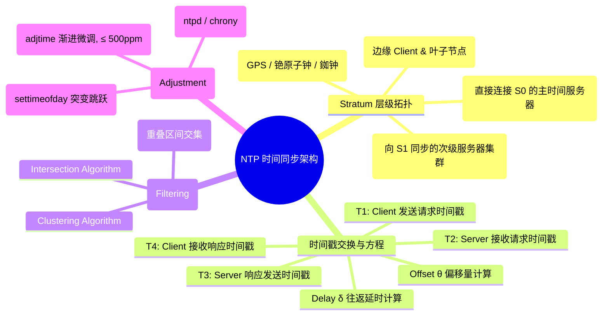
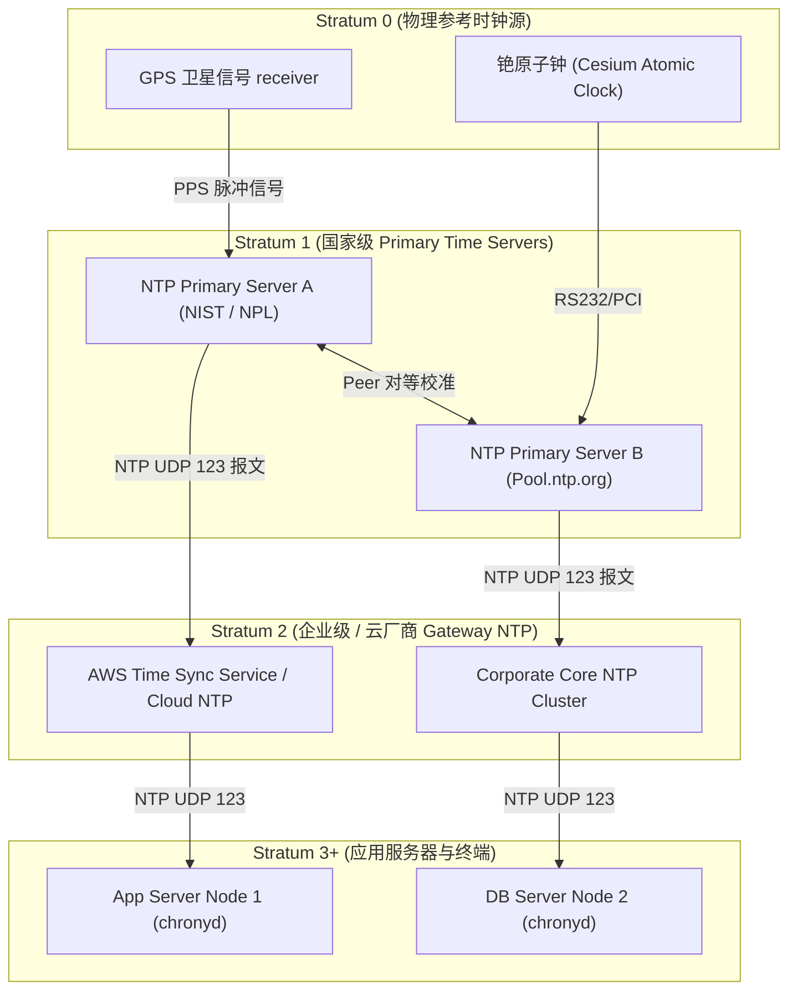
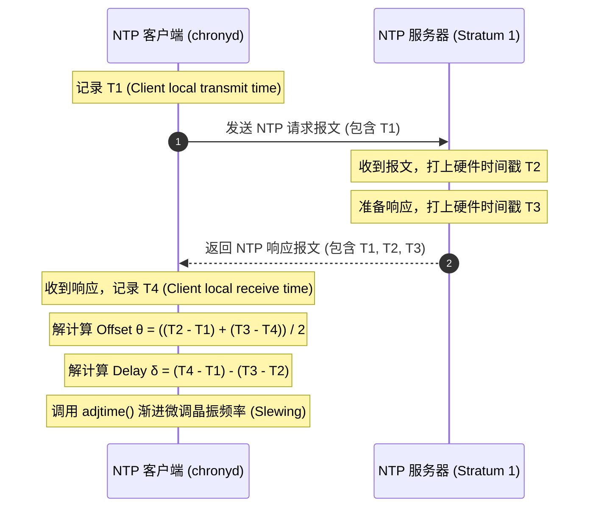

import CaseStudyHeader from '@site/src/components/CaseStudyHeader';
import DesignIntent from '@site/src/components/DesignIntent';
import EvolutionTimeline from '@site/src/components/EvolutionTimeline';
import CompareSlider from '@site/src/components/CompareSlider';
import TradeoffExplorer from '@site/src/components/TradeoffExplorer';
import GuidedExercise from '@site/src/components/GuidedExercise';
import QuizCard from '@site/src/components/QuizCard';
import GlossaryTerm from '@site/src/components/GlossaryTerm';
import ResearchNote from '@site/src/components/ResearchNote';

# NTP 时间同步：Stratum 树状分级与分布式系统隐形地基架构

<CaseStudyHeader
  oneLiner="网络时间协议 (NTP) 是整个互联网与分布式系统的『隐形地基』。通过 Stratum 分级树状拓扑、双向 UDP 报文四时间戳交叉对比、Marzullo 交集过滤算法以及 Slewing 渐进平滑调速，NTP 在公网不可靠延迟下实现了毫秒级（局域网微秒级）的高精度时间同步。"
  stats={[
    {label: '协议规范', value: 'RFC 5905 (NTPv4)'},
    {label: '发明人', value: 'David L. Mills (1985 年)'},
    {label: '层级结构', value: 'Stratum 0 (硬件) ~ Stratum 16 (不可用)'},
    {label: '同步精度', value: '公网 1-50 ms / 局域网 < 1 ms'},
    {label: '核心计算模型', value: 'Offset (θ) & Round-Trip Delay (δ)'},
    {label: '时钟微调方式', value: 'Slewing (相频微调, 绝不回退时间)'}
  ]}
/>

:::info 对应课程概念
本案例主要映射 [Month 5 分布式核心组件]（物理时钟、逻辑时钟与 TrueTime）、[Month 1 编程系统基石]（系统调用与 CPU 时钟中断）及 [F6. Google Spanner](./google-spanner.mdx)。
:::

## 1. 设计初衷：没有统一时间，就没有分布式系统

在单机计算机中，石英晶体振荡器（RTC）受温度和硬件老化影响，每天会产生数百毫秒的物理漂移（Clock Drift）。在分布式系统中，如果两台服务器的时间不一致，数据库 MVCC 事务版本将彻底错乱，日志审计与分布式锁（如 Redis / Zookeeper）也将引发严重故障。

<DesignIntent
  problem="如何在公网网络延迟不确定、数据包抖动（Jitter）且客户端晶振存在物理漂移的环境下，让全球数十亿台服务器维持高精度统一时间？"
  users="全球所有的服务器、操作系统、数据中心及 IoT 设备。"
  devices="从 Stratum 1 原子钟时间服务器到边缘终端。"
  goals={[
    '极致的微秒/毫秒级精度：局域网内维持 < 1ms 偏差，公网维持 < 10ms 偏差',
    '单调递增性（Monotonicity）：时钟只能平滑加速/减速，**严禁时间倒流（Time Reversal）**',
    '容错与抗拜占庭：自动识别并剔除故障或恶意造假的时间服务器（False Tickers）',
    '极低带宽消耗：单个 NTP 报文仅 48 字节，同步开销可忽略不计'
  ]}
  constraints={[
    '网络物理延迟是非对称的（去程与回程时间并不严格相等）',
    '客户端绝对不能因为时间调优而导致时间突变跳跃（Stepping），否则会导致定时任务重放或日志颠倒',
    '物理硬件原子钟极度昂贵，不可能为每台服务器配置'
  ]}
  firstStep="构建 Stratum 分层树状拓扑；设计 client-server UDP 4-Timestamp 交叉抵消方程。"
/>

## 2. 全景思维导图



## 3. 最新架构总览 (C4 风格)





## 4. 核心机制拆解

### 4a. 4-Timestamp 交叉抵消方程

NTP 利用双向报文交互生成的 4 个时间戳，精准消解单向传输延迟：


假设网络去程延迟与回程延迟对称（$a = b = \frac{\delta}{2}$），可列出等式：

$$T_2 = T_1 + a + \theta$$
$$T_4 = T_3 + b - \theta$$

立得 **Offset 偏移量 $\theta$** 与 **RTT 往返延迟 $\delta$**：

$$\theta = \frac{(T_2 - T_1) + (T_3 - T_4)}{2}$$

$$\delta = (T_4 - T_1) - (T_3 - T_2)$$

### 4b. Marzullo 滤波与区间交集算法

为了防止某些 NTP 服务器因故障或网络拥堵输出错误时间（False Tickers），客户端会同时向 $N$ 个不同的 NTP 服务器发包，并采用 <GlossaryTerm term="Marzullo 算法" definition="一种容错时间同步算法。将每个服务器返回的时间 offset ± delay 视作一个区间，寻找覆盖最多重叠区间的相交区域，剔除位于区间之外的异常节点。">Marzullo 算法</GlossaryTerm> 锁定正确区间：

```mermaid
flowchart TD
  S1["Server 1 范围: [10:00.001 .. 10:00.005]"] --> Intersection
  S2["Server 2 范围: [10:00.002 .. 10:00.006]"] --> Intersection
  S3["Server 3 范围: [10:00.003 .. 10:00.007]"] --> Intersection
  S4["Server 4 (故障): [10:05.000 .. 10:05.010]"] --> Reject[被 Marzullo 剔除 (False Ticker)]

  Intersection["计算最大交集区间 [10:00.003 .. 10:00.005]"] --> FineTune[作为最终同步基准]
```

### 4c. Slewing (相频平滑微调) vs Stepping (硬跳跃)

当计算出客户端时间落后或超前时，NTP 采用 <GlossaryTerm term="Slewing" definition="平滑时间微调（Through adjtime 系统调用）：通过改变 Linux 内核晶振计数的滴答频率（如调快 0.05%），让本地时间以极平滑的方式追赶目标时间，确保系统时间单调递增，绝不跳跃。">Slewing</GlossaryTerm> 机制：

- **Stepping (跳跃)**：直接修改系统时间（`settimeofday`）。仅在时间偏差巨大（如 $> 128\text{ms}$）且开机初始化时使用。
- **Slewing (微调)**：调整 Linux `adjtime`，每秒微调最多 $500\text{ PPM}$ (0.5ms/s)。如果偏差 10ms，系统将在 20 秒内平滑追平，**绝不会发生时间倒流**。

## 5. 关键数据结构与算法

### NTPv4 48-Byte 报文结构

```
 0                   1                   2                   3
 0 1 2 3 4 5 6 7 8 9 0 1 2 3 4 5 6 7 8 9 0 1 2 3 4 5 6 7 8 9 0 1
+-+-+-+-+-+-+-+-+-+-+-+-+-+-+-+-+-+-+-+-+-+-+-+-+-+-+-+-+-+-+-+-+
|LI | VN  |Mode |    Stratum    |     Poll      |   Precision   |
+-+-+-+-+-+-+-+-+-+-+-+-+-+-+-+-+-+-+-+-+-+-+-+-+-+-+-+-+-+-+-+-+
|                         Root Delay                            |
+-+-+-+-+-+-+-+-+-+-+-+-+-+-+-+-+-+-+-+-+-+-+-+-+-+-+-+-+-+-+-+-+
|                       Root Dispersion                         |
+-+-+-+-+-+-+-+-+-+-+-+-+-+-+-+-+-+-+-+-+-+-+-+-+-+-+-+-+-+-+-+
|                     Reference ID (SysID)                      |
+-+-+-+-+-+-+-+-+-+-+-+-+-+-+-+-+-+-+-+-+-+-+-+-+-+-+-+-+-+-+-+
|                     Reference Timestamp (64)                  |
+-+-+-+-+-+-+-+-+-+-+-+-+-+-+-+-+-+-+-+-+-+-+-+-+-+-+-+-+-+-+-+-+
|                      Origin Timestamp (T1)                    |
+-+-+-+-+-+-+-+-+-+-+-+-+-+-+-+-+-+-+-+-+-+-+-+-+-+-+-+-+-+-+-+-+
|                      Receive Timestamp (T2)                   |
+-+-+-+-+-+-+-+-+-+-+-+-+-+-+-+-+-+-+-+-+-+-+-+-+-+-+-+-+-+-+-+-+
|                     Transmit Timestamp (T3)                   |
+-+-+-+-+-+-+-+-+-+-+-+-+-+-+-+-+-+-+-+-+-+-+-+-+-+-+-+-+-+-+-+-+
```

时间戳采用 64 位定点数（32 位整数秒 + 32 位小数秒），分辨率达到 232 皮秒 ($2^{-32}\text{ 秒}$)。

## 6. 架构演进史

<EvolutionTimeline
  events={[
    {
      year: '1985',
      title: 'NTPv0 诞生 (RFC 958)',
      why: '早期 ARPANET 网络各节点时钟混乱，需要通用协议。',
      change: 'David Mills 提出 4-Timestamp 交叉推算方程与 Stratum 分级。'
    },
    {
      year: '1992',
      title: 'NTPv3 与 Marzullo 滤波 (RFC 1305)',
      why: '公网抖动与网络攻击导致错误时间源污染全网。',
      change: '引入 Marzullo 算法与相频自适应 PLL (Phase-Locked Loop) 环路。'
    },
    {
      year: '2010',
      title: 'NTPv4 与 Chrony 新一代 Daemon',
      why: '虚拟机 (VM) 与云原生频繁挂起/恢复，传统 ntpd 收敛太慢（需数小时）。',
      change: 'Chrony 算法实现在开机数秒内快速收敛，且支持 PTP (IEEE 1588) 硬件时间戳。'
    }
  ]}
/>

### 架构演进对比

<CompareSlider
  before={{
    title: '早期单机 RTC + 简单的 ntpdate 硬跳跃',
    description: '时间跳跃导致数据库 Log 顺序倒置，数据库事务崩溃，虚拟机休眠唤醒后偏差数分钟。'
  }}
  after={{
    title: 'Stratum 多源 + Chrony 渐进微调 (Slewing)',
    description: '时钟绝对单调递增，毫秒级微调，云原生 VM 休眠唤醒后 3 秒内恢复微秒级同步。'
  }}
/>

## 7. 设计模式与课程映射

1. **过滤器模式 (Filter Pattern)**：Marzullo 算法与 Jitter Filter 链式过滤噪声。
2. **中介者模式 (Mediator Pattern)**：Stratum 1/2 时间服务器作为客户端与物理原子钟之间的解耦中介。
3. **映射 [Month 5 分布式核心组件]**：物理时钟偏差与 Spanner TrueTime 理论边界。

## 8. 架构取舍与权衡

<TradeoffExplorer
  title="时间同步架构核心取舍"
  dimensions={['硬件成本', '同步精度', '部署复杂度', '网络依赖度']}
  options={[
    {
      name: '纯软件 NTP / Chrony 架构 (通用 NTP 方案)',
      scores: [100, 75, 95, 70],
      note: '零硬件成本，完全基于现有网络 IP 报文；精度受公网 BGP 抖动影响（1-10ms）。',
      whenToUse: '99% 的 Web 应用、微服务、通用企业数据中心。'
    },
    {
      name: 'Google TrueTime (GPS + 原子钟硬件机架)',
      scores: [20, 99, 30, 95],
      note: '精度达到微秒级（控制 $\epsilon < 1\text{ms}$），可用于分布式 SQL 外部一致性；但机柜硬件成本极其高昂。',
      whenToUse: 'Google Spanner 等需要全球分布式无锁 SQL 事务的顶级基座。'
    }
  ]}
/>

## 9. 常见误解与澄清

:::warning 常见误解澄清
- **误解一：NTP 会在发现时间慢了 1 秒时，直接把系统时钟强制拨快 1 秒。**
  *事实*：在正常运行中（Slewing 模式），NTP 绝不会直接跳变 1 秒。它会调用内核接口将 CPU 的 Clock Tick 频率稍微调快（例如从 1000Hz 调为 1005Hz），在随后的数分钟里平滑追上 1 秒，保证 `now()` 函数单调递增。
- **误解二：只要两台服务器都运行了 NTP，它们的时间就绝对完全相同。**
  *事实*：由于公网 UDP 报文去程与回程延迟不一定严格相等（Asymmetric Latency），NTP 必定存在 1-10ms 的物理不确定性区间（Uncertainty Window）。
:::

## 10. 如果是你来设计 (Guided Exercise)

<GuidedExercise
  title="设计 NTP 4-Timestamp Offset 计算器"
  goal="在 Python 中实现 NTP 偏移量 $\theta$ 与往返延迟 $\delta$ 的计算逻辑。"
  steps={[
    '步骤 1: 设定 T1 = 1000.000 (Client 发送)。',
    '步骤 2: 设定 T2 = 1000.020 (Server 接收)。',
    '步骤 3: 设定 T3 = 1000.021 (Server 响应发送)。',
    '步骤 4: 设定 T4 = 1000.043 (Client 接收)。',
    '步骤 5: 计算 Offset theta = ((T2 - T1) + (T3 - T4)) / 2。',
    '步骤 6: 计算 Delay delta = (T4 - T1) - (T3 - T2)。'
  ]}
  hints={[
    '验证: theta = ((0.020) + (-0.022)) / 2 = -0.001s (-1ms)。说明 Client 时钟比 Server 快了 1ms。',
    '验证: delta = (0.043) - (0.001) = 0.042s (42ms)。'
  ]}
  checks={[
    '如果 T2 和 T3 增加 10 秒，Offset 是否恰好增加 10 秒？',
    '如果网络单向延迟为 20ms，四时间戳算出的 Delay 是否为 40ms 加上 Server 内部处理耗时？'
  ]}
/>

## 11. 自测题与来源清单

<QuizCard
  questions={[
    {
      q: 'NTP 在正常运行调节本地系统时间时，为什么优先采用 Slewing (微调) 而非 Stepping (跳跃)？',
      options: [
        'A. 因为跳跃会消耗更多 CPU 内存',
        'B. 防止时间倒流或突变导致日志顺序颠倒、cron 定时任务重放或数据库事务错乱，确保时间单调递增',
        'C. 因为 Linux 内核不支持直接修改时间',
        'D. 为了防止网络封包被拦截'
      ],
      answer: 'B',
      explain: 'Slewing 机制通过渐进改变晶振滴答频率来平滑修正时间，维持了物理时间的单调递增性。'
    },
    {
      q: 'NTP 协议通过在 Client 与 Server 之间交换 4 个时间戳 (T1, T2, T3, T4)，主要用来计算什么？',
      options: [
        'A. 服务器的 CPU 内存占用',
        'B. 时间偏移量 Offset (θ) 与网络往返延迟 Delay (δ)',
        'C. 客户端的地理位置 GPS 坐标',
        'D. 报文的 AES 加密密钥'
      ],
      answer: 'B',
      explain: '4-Timestamp 交叉抵消方程能精准分离出网络双向传输延迟与两台机器之间的实际时间偏差 Offset。'
    },
    {
      q: '在 NTP Stratum 树状层级体系中，Stratum 0 代表什么？',
      options: [
        'A. 已经损坏不可用的时间节点',
        'B. 物理参考时钟硬件源（如 GPS 接收机、铯原子钟、铷原子钟），它不直接在网络上提供 UDP 服务',
        'C. 普通云服务器节点',
        'D. 互联网根域名服务器'
      ],
      answer: 'B',
      explain: 'Stratum 0 是高精度的硬件参考源，直接与 Stratum 1 主时间服务器物理相连。'
    }
  ]}
/>

<ResearchNote
  title="NTPv4 官方 RFC 规范"
  source="Mills, D. et al. (2010). Network Time Protocol Version 4: Protocol and Algorithms Specification (RFC 5905)"
  href="https://datatracker.ietf.org/doc/html/rfc5905"
  insight="NTP 发明人 David Mills 撰写的终极规范，详细解释了定点数时间格式、PLL 环路控制方程与 Marzullo 滤波数学证明。"
  application="架构借鉴：如何在不可靠、高抖动的分布式网络中设计高精度、高容错的状态同步协议。"
/>
