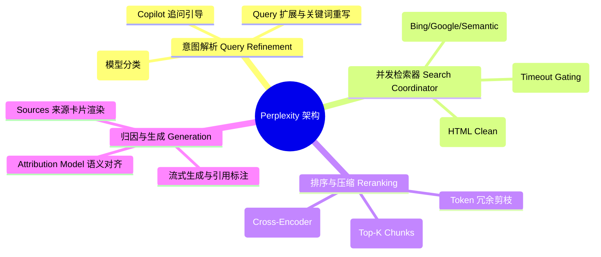
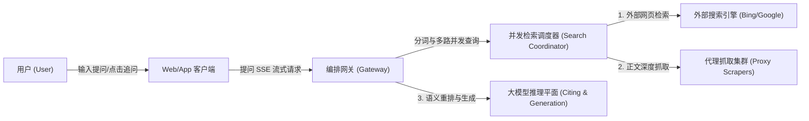
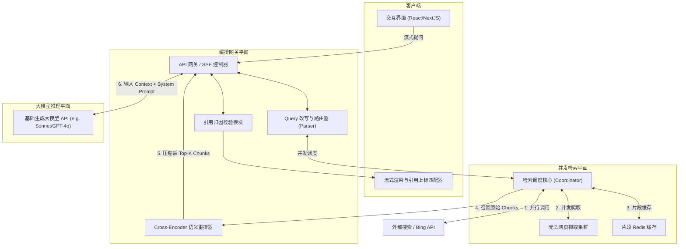
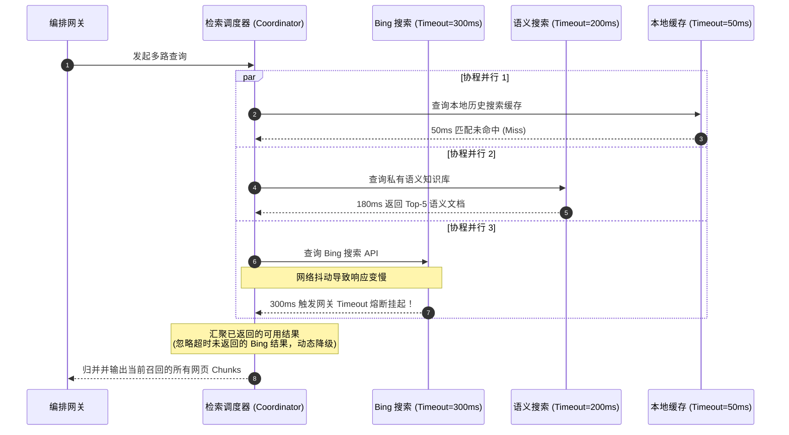
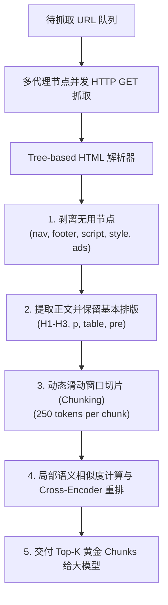
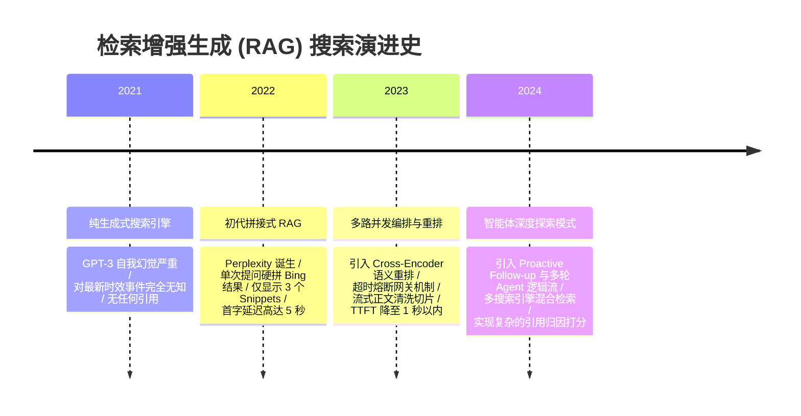

import CaseStudyHeader from '@site/src/components/CaseStudyHeader';
import DesignIntent from '@site/src/components/DesignIntent';
import ArchitectureEvolution from '@site/src/components/ArchitectureEvolution';
import TradeoffExplorer from '@site/src/components/TradeoffExplorer';
import GlossaryTerm from '@site/src/components/GlossaryTerm';
import ResearchNote from '@site/src/components/ResearchNote';
import QuizCard from '@site/src/components/QuizCard';
import CompareSlider from '@site/src/components/CompareSlider';
import GuidedExercise from '@site/src/components/GuidedExercise';

# Perplexity：RAG 搜索问答产品化与多源检索架构

<CaseStudyHeader
  oneLiner="Perplexity 通过多路并发搜索引擎聚合（Meta-Search）、毫秒级网页流式清洗与深度引用归因（Attribution Model），将传统的『10个蓝色链接』升级为直接回答、来源可溯的事实合成搜索引擎。"
  stats={[
    {label: '发布时间', value: '2022 年'},
    {label: '检索核心', value: '并发多源检索 (Google/Bing/Semantic)'},
    {label: '网页抓取能力', value: '百毫秒级无头抓取与 HTML 文本清洗'},
    {label: '并发控制', value: 'Timeout 熔断与动态降级路由'},
    {label: '引用归因模型', value: '句级交叉熵分类归因 (Attribution Score)'}
  ]}
/>

:::info 对应课程概念
本案例是 [Month 8 RAG 检索增强](../rag/why-rag) 的旗舰商业落地案例，同时也紧密回扣基础课——[L4 的超时与失败熔断](../foundations/error-handling)、[L1 的并发与延迟数量级](../foundations/programming-systems-primer)。它展示了如何在数十毫秒的网络极值约束下，编排复杂的异构外部服务。
:::

## 1. 设计初衷：消灭“蓝色链接的点击地狱”

传统搜索引擎（如 Google、Bing）只提供“海量网页链接”。用户为了寻找一个明确的事实（例如“2026年最新发布的某款处理器的能效比指标”），需要手动点击 4、5 个网页，忍受广告和无用信息，人肉提取并合并答案。而纯大模型对话工具又存在极高的“幻觉”，无法保证事实的准确性。

Perplexity 的核心设计在于**将检索增强生成（RAG）做成一个高并发、低延迟的实时问答产品**。它不仅是简单的套壳，更在底层设计了 Query 意图扩展树、搜索引擎高并发调度器（避免拖慢 TTFT）与精准的引用映射归因（Attribution Engine）。

<DesignIntent
  problem="在 2 至 3 秒的总体耗时限制内，完成意图改写、并发检索、网页清洗、语义重排，并输出一份带有可信度引用的事实性总结回答。"
  users="全球需要获取即时准确信息、整理研究报告、进行事实调研的高频互联网用户。"
  devices="支持极速流式输出渲染的 Web 端、移动 App，与云端低延迟检索编排网关的深度绑定。"
  goals={[
    '多路并发检索：在 300ms 内向多个外部搜索引擎、私有爬虫索引发起并发请求，合并去重。',
    '流式清洗与分块（Parser & Chunker）：在网页返回的百毫秒内，提取正文、切除 HTML 杂质，转为高密度的纯文本 Chunks。',
    '精确引用对齐：保证回答中的每一个数字、断言均能通过 `[数字]` 上标精确追溯到具体抓取网页的某句话，杜绝“张冠李戴”。',
    '主动交互追问（Proactive Follow-up）：模型生成回答的同时，预测并生成 3 个最相关的后续追问链接。'
  ]}
  constraints={[
    '外部搜索 API 的尾延迟（Tail Latency）：外部搜索引擎可能发生网络拥堵，必须设计严苛的超时熔断机制。',
    '网页抓取的反爬限制与网络带宽：物理抓取未知网页时速度受限，必须维护庞大的代理池或使用高性能缓存 Snippets。',
    'Token 吞吐量限制：长文本 Snippets 会导致模型推理变慢，必须在重排阶段进行强力压缩过滤。'
  ]}
  firstStep="构建 Query 解析路由器，将单次模糊问题转化为多路搜索指令；建立多线程/协程并发检索器；设计 Attributor 交叉注意力模型，实现生成文本与参考文本的句级映射。"
/>

## 2. 系统功能全景

以下是 Perplexity 的检索编排与事实生成功能全景图：

---

## 3. 架构总览

Perplexity 的数据流由客户端、智能编排网关、多路检索层与大模型推理平面协同完成：

### 3a. System Context (系统上下文图)

### 3b. Container (容器架构图)

---

## 4. 核心机制拆解

### 4a. 多路并发检索编排 (Parallel Search & Tail Latency Gating)

为保证极致的首字时间（TTFT），Perplexity 的检索调度器（Search Coordinator）不能采用串行等待。
系统必须在同一毫秒发起多协程网络调用。更重要的是，必须引入 **尾延迟熔断机制（Tail Latency Gating）**：

### 4b. 网页流式抓取与清洗管道 (Scraping Pipeline)

搜索引擎返回的 Snippets 通常字数受限、信息密度低。为获取深度的细节事实，Perplexity 会并发抓取排名前几的原始网页（Raw Web Pages）。
这套管道运行于高并发的无头浏览器/代理节点集群中，其数据清洗过程如下：

### 4c. 引用归属引擎 (Attribution Engine)

防止 AI “胡说八道”或“张冠李戴”，核心靠引用归属。
模型输出的每一段文字（通常是单句级别），都需要通过 <GlossaryTerm term="Attribution Score" definition="归因置信度分数：度量模型生成的语句在语义上是否完全能被参考源文档（Context）包含的指标。通常通过计算两者句子的交叉熵、蕴含关系（Entailment Classifier）或语义投影相似度得出。">归因分数（Attribution Score）</GlossaryTerm> 校验。

如果模型在生成某句结论后，Attributor 模块发现该句与所标引用源文档的蕴含度（Entailment）低于 0.6，系统会强行剔除该错误引用，或者在流式生成中动态将该上标剔除，避免误导用户。

---

## 5. 架构演进史

RAG 搜索问答经历了解耦演进：

---

## 6. 架构对比

### 传统多链接搜索 vs Perplexity 对白式合成搜索

<CompareSlider
  before={
    

      <strong>传统搜索引擎模式 (10 Blue Links)</strong>
      

        用户输入问题，系统返回一堆可能包含答案的网页链接。用户必须逐一点击，忍受网页广告、弹窗，手动在冗长正文中寻找并合成答案，费时费力。
      

    

  }
  after={
    

      <strong>Perplexity 编排合成模式</strong>
      

        直接流式输出事实提炼后的纯文字解答。每个断言后都带有可信的 `[数字]` 引用上标，支持鼠标悬停预览原网页文字，并智能预测并提供 3 个后续追问方向，免去反复输入。
      

    

  }
  labels={['传统链接搜索', 'Perplexity 对白合成']}
/>

---

## 7. 核心决策的取舍

在构建低延迟实时 RAG 时，对数据源和检索并发的设计在性能和成本间做出多维度取舍：

<TradeoffExplorer
  title="RAG 并发检索源策略取舍"
  dimensions={['获取最新时效信息', '单次查询API费用', '首字等待时间 (TTFT)', '私有化与内部系统接入', '网页解析信息密度']}
  options={[
    {
      name: '完全依赖第三方 Meta-Search APIs (如 Bing/Google API)',
      scores: [5, 2, 2, 1, 3],
      note: '时效性无可挑剔，覆盖面广。但每次查询按量收费，且响应延迟受制于第三方服务的网络尾延迟。',
      whenToUse: '全网公共知识问答、新闻类事实速递（Perplexity 核心业务基础）。'
    },
    {
      name: '自建垂直爬虫集群 + 向量混合索引 (自建向量数据库模式)',
      scores: [3, 5, 4, 5, 4],
      note: '无外部 API 计费成本，读写快，且能接入内部私有文档。但信息时效性取决于本地爬虫更新周期。',
      whenToUse: '企业内部研发知识库、行业特定垂直搜索、代码库检索。'
    },
    {
      name: '静态网页缓存片段 (Redis Snippet Cache 降级优先模式)',
      scores: [2, 5, 5, 3, 2],
      note: '极度省钱，响应时间降至毫秒级。但完全丧失了当前几秒钟内发生事件的实时感知能力。',
      whenToUse: '高频共性问题回答、API 限流降级备用路径。'
    }
  ]}
/>

---

## 8. 实践指引：实现一个简易的 HTML 文本清洗与 BM25 重排器

在实时 RAG 中，网页的抓取与清洗至关重要。

在 `labs/month08/scraped_rerank/` 目录下（或在下方练习中），实现一个可以清洗 HTML 正文并基于 BM25 算法对片段执行打分重排的核心组件。

<GuidedExercise
  title="练习指引：写一个 RAG 网页文本解析重排器"
  goal="编写一个 Python 脚本，接收一个包含 HTML 标签、nav栏、footer栏的粗糙网页内容，过滤无用元素并切片，最后基于用户 Query 检索出最相关的 Top-2 段落。"
  hints={[
    '你可以使用 Python 的 BeautifulSoup 来提取 `p` 和 `article` 节点，过滤掉 `script` 和 `style`。',
    '滑动窗口切片：可以每隔 150 个字符（或单词）切分为一个 Chunk，保持 30 字符的重叠度（Overlap）。',
    '使用简单的 TF-IDF 或内置 BM25 公式对 Query 与各个 Chunk 的相关度打分并排序。'
  ]}
  steps={[
    '定义 `clean_html(raw_html: str) -> str` 提取网页核心文本。',
    '实现 `chunk_text(text: str, size=150, overlap=30) -> list[str]`。',
    '编写一个 `bm25_scorer(query: str, chunks: list[str]) -> list[tuple[str, float]]` 进行相关度排序。',
    '编写单元测试，输入带有侧边栏广告的 HTML 段落，验证是否能精准提取核心正文，并在查询时让最相关片段排在最前。'
  ]}
  checks={[
    '你的代码能够完全过滤掉 HTML 的 script 块和无用标签。',
    '对于不同的 Query，你的重排器能够给出不同的打分输出，并保证 Top-1 Chunk 的内容与 Query 语义上最贴合。'
  ]}
/>

---

## 9. 知识自测

完成自测以检验你对 RAG 编排、多路并发、网页清洗与引用归因的架构掌握度：

<QuizCard
  questions={[
    {
      q: '在 Perplexity 并发检索引擎中，为了避免由于某个外部搜索引擎响应极慢（如网络抖动引起几秒的等待）而导致整个系统首字时间（TTFT）严重超时，最推荐采取什么架构手段？',
      options: [
        'A. 完全舍弃外部搜索引擎，只使用本地大模型内部的记忆来回答',
        'B. 设置严格的尾延迟超时时间（如 300ms），多路查询采用并发协程发起；一旦超时则立刻执行“超时熔断并动态降级”，基于当时已经成功返回的检索源数据执行回答生成，不等待慢节点',
        'C. 强制让用户等待所有节点完全返回后，再输出答案',
        'D. 频繁地向搜索引擎发送重复的重试请求，直到其快速返回为止'
      ],
      answer: 1,
      explain: '高尾延迟（Tail Latency）是分布式编排系统的头号敌人。在实时 RAG 中，设置严格的 Timeout（例如 300ms）并通过并发协程发起多路查询，一旦发生慢节点超时则强制切断（熔断），只归并已拿到的片段，是保证系统整体可用性与 TTFT 低于 2 秒的教科书级降级设计。'
    },
    {
      q: '在 RAG 正文提取阶段，为什么需要将抓取的原始 HTML 网页进行剥离 nav/footer/script 等动作，而不是将整个 HTML 文本直接塞给大模型？',
      options: [
        'A. 因为 HTML 包含特殊的编码，大模型完全看不懂任何 HTML 标签',
        'B. 因为未经过滤的 HTML 包含大量的广告、导航栏、JS 脚本以及统计代码。直接输入不仅极度浪费大模型的上下文 Token 额度、成倍增加计费成本，而且会引入海量无用噪声，严重干扰大模型对核心正文事实的检索定位（即干扰注意力计算）',
        'C. 因为将 HTML 直接上传会导致服务器上的安全杀箱发生穿透',
        'D. 因为如果不剥离广告，大模型生成的回答中会自动插播广告弹窗'
      ],
      answer: 1,
      explain: '信息密度（Information Density）是 RAG 的核心生命线。网页源码中 80% 以上通常是布局代码和无关文字（如免责声明、导航栏、热榜链接）。如果原封不动输入，不仅带来庞大的 Token 计费损耗，还会引起 Attention 计算的“注意力稀释”，使得模型极易发生信息丢失或召回幻觉。'
    },
    {
      q: 'Perplexity 系统的“前瞻式交互引导（Follow-up questions）”对提升智能搜索体验和减轻系统推理负担做出了什么贡献？',
      options: [
        'A. 它能够自动代表用户向第三方发起支付请求',
        'B. 它基于大模型对当前答案与上下文的理解，主动预测并输出 3 个后续最相关的问题。这样免去了用户再次构思并输入新问题的键盘成本；且由于后续问题是系统预设的，系统可以对这些高频 Follow-up 问题做预编译查询或缓存，极大提升响应性能',
        'C. 它是为了干扰用户，防止用户频繁提问导致服务器崩溃的保护手段',
        'D. 它是为了将用户引流到其它广告推销网站中'
      ],
      answer: 1,
      explain: '主动追问引导是卓越交互与工程优化的双赢结合。对用户而言，通过鼠标点击就能进行追问；对系统而言，预设的 Follow-up 问题具有很高的共性与可预测性，后端可以极高地命中前缀 Prompt Cache（提示词缓存），避免了重新对前文进行全量 Prefill 的昂贵开销。'
    }
  ]}
/>

## 来源

- [Perplexity AI: Ask Anything - Structured search grounding & agentic loop blog](https://www.perplexity.ai/blog)
- [BLEU: a Method for Automatic Evaluation of Machine Translation (Papineni et al., ACL '02)](https://aclanthology.org/P02-1040.pdf)
- [Cohere Rerank: Multi-stage retrieval and semantic ranking optimization reports](https://cohere.com/rerank)
- [Designing Large-Scale Search-Engine aggregators with multi-source concurrency pipelines](https://www.bing.com/webmaster/help/bing-webmaster-tools-overview)
