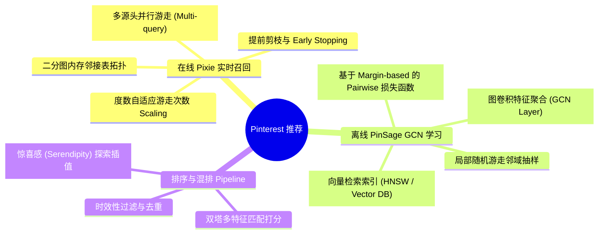
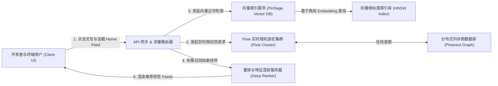
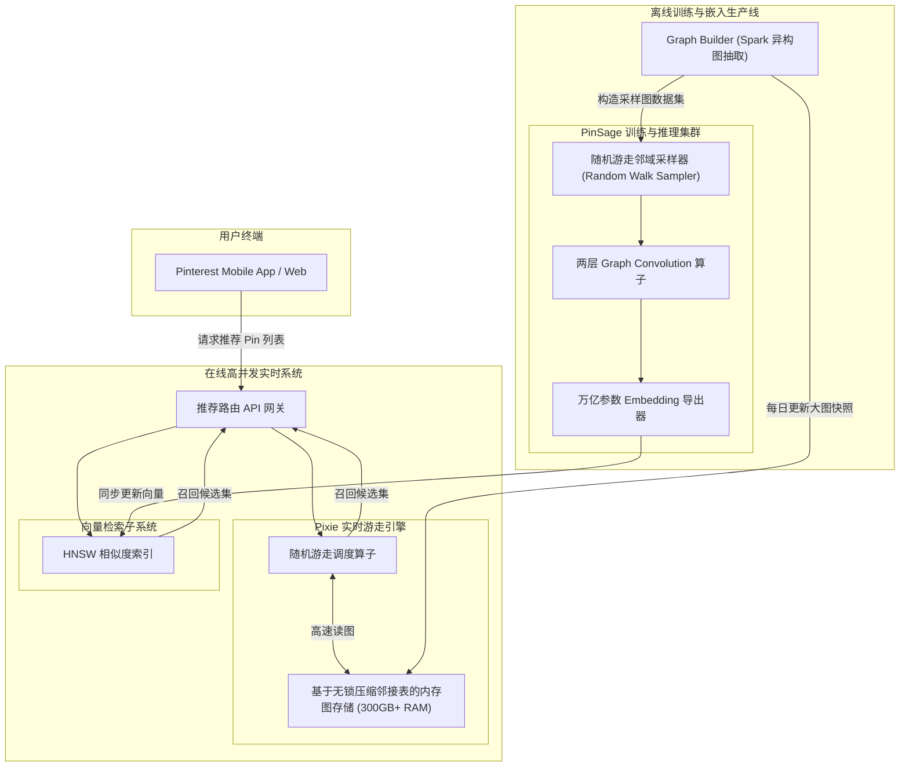
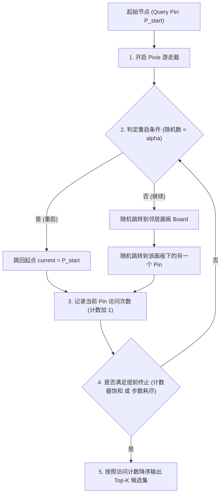
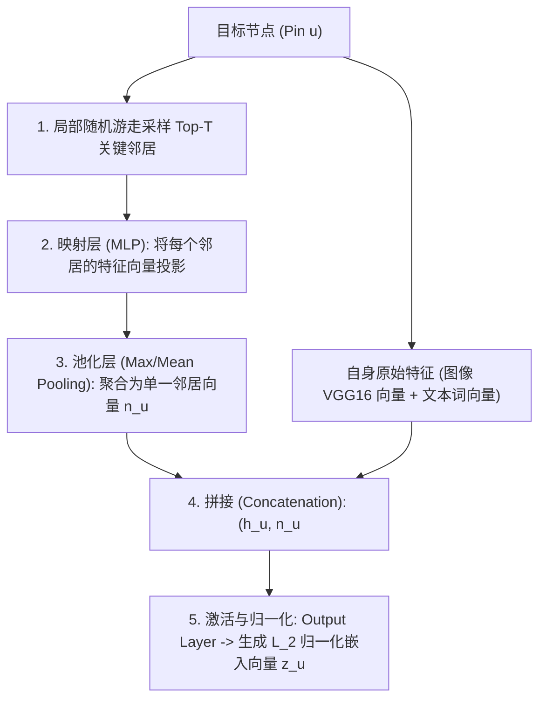

import CaseStudyHeader from '@site/src/components/CaseStudyHeader';
import DesignIntent from '@site/src/components/DesignIntent';
import ArchitectureEvolution from '@site/src/components/ArchitectureEvolution';
import TradeoffExplorer from '@site/src/components/TradeoffExplorer';
import GlossaryTerm from '@site/src/components/GlossaryTerm';
import ResearchNote from '@site/src/components/ResearchNote';
import QuizCard from '@site/src/components/QuizCard';
import CompareSlider from '@site/src/components/CompareSlider';
import GuidedExercise from '@site/src/components/GuidedExercise';
import PyRunner from '@site/src/components/PyRunner';

# Pinterest：PinSage 与 Pixie 图引擎推荐架构

<CaseStudyHeader
  oneLiner="Pinterest 创新性地结合了图表示学习与实时图游走：在召回阶段通过 Pixie 算法在二分图上执行极速（<20ms）实时随机游走，配合基于 PinSage 图卷积神经网络（GCN）提取节点在百亿边大图上的高质量语义嵌入向量，打造了业界领先的视觉发现引擎。"
  stats={[
    {label: '经典算法发布', value: '2018 年 (PinSage & Pixie)'},
    {label: '系统网络规模', value: '数十亿节点 / 百亿条边'},
    {label: '视觉 Pin 帖子数', value: '超过 4000 亿个'},
    {label: '游走召回延迟', value: 'Pixie 游走检索 < 20 毫秒'},
    {label: '单图卷积计算量', value: 'GCN 聚合特征处理亿级节点'}
  ]}
/>

:::info 对应课程概念
本案例横跨 [Month 8 搜索与推荐算法](./overview.mdx)、[Month 11 生产级 AI 平台与数据治理](../foundations/programming-systems-primer)、[Month 3 高并发缓存与数据库分区](../data-cache-queue/cache-queues-idempotency)。它完美演示了如何将极其复杂的图神经网络算法与极致低延迟（20ms）的实时线上高并发服务相结合，通过动静分离的双轨架构克服图计算的性能鸿沟。
:::

## 1. 设计初衷：如何从百亿“图片-画板”关系中寻找灵感？

Pinterest 作为一个视觉探索平台，其核心资产是用户收集的“图片（Pins）”以及用于归类的“画板（Boards）”。这形成了一个天然的巨大**<GlossaryTerm term="二分图" definition="Bipartite Graph，图论中的一种特殊图。图中的顶点可分为两个互不相交的子集（如 Pins 和 Boards），图中每条边关联的两个顶点分别属于这两个不同的集合。">二分图（Bipartite Graph）</GlossaryTerm>**。

Pinterest 面临的独特挑战是：
1. **内容关联的语义多样性**：同一个图片可能因为不同的视觉元素或归类目的，被分在不同的画板里（例如一张咖啡杯的图片，既可以出现在“北欧极简风家具”画板中，也可以出现在“拉花咖啡教程”画板中）。
2. **海量与高并发约束**：如果用户点击了一个关于“机械键盘”的 Pin，系统必须立即在 20 毫秒内，从 4000 亿个 Pin 中捞出与其最相关、最有趣的数十个候选 Pin，供下一步精排推荐。
3. **分布式算力瓶颈**：传统的图卷积神经网络（GCN）在训练时需要将整张图及其特征载入内存/显存，在百亿边规模下这在物理上是无法实现的。

为了解决上述问题，Pinterest 团队开发了双引擎架构：在线运行的 **Pixie 实时随机游走算法** 与 离线运行的 **PinSage 大规模图卷积表征学习模型**。

<DesignIntent
  problem="在百亿级节点的异构二分图上，克服图计算数据吞吐瓶颈与单卡显存限制，实现毫秒级（<20ms）的高准确度实时推荐，以及捕获高阶图拓扑结构的全局语义。"
  users="全球数亿寻找生活灵感的高频视觉浏览用户，对相关推荐的响应时效与图片语义契合度极度敏感。"
  devices="深度绑定的移动客户端 App、网页端，与云端低延迟高性能图计算集群及向量检索集群的实时 gRPC 通信。"
  goals={[
    'Pixie 实时召回：设计支持实时个性化的随机游走算法，跳出数据库检索瓶颈，实现单次请求 20 毫秒以内完成召回。',
    'PinSage 语义建模：首创在大规模工业级图上应用图卷积神经网络（GCN），自动聚合节点邻域的视觉、文本及拓扑特征。',
    '随机游走局部抽样：设计 Neighborhood-based 采样技术，使图神经网络只在当前计算节点的局部子图上做信息聚合，消灭全图计算显存暴涨问题。',
    '双轨协同：结合在线 Pixie 的时效反馈与离线 PinSage 嵌入的深度语义召回，构建双轮驱动的多级召回系统。'
  ]}
  constraints={[
    '数据不出域与低延迟：单次图游走的计算深度受到严格限制，必须做提前裁剪与剪枝。',
    '图的马太效应：部分极度热门的 Pin/Board 拥有超百万的度数（Degree），容易导致随机游走落入局部热点陷入死循环。',
    '大图通信开销：跨多个分布式计算节点进行图节点信息同步会导致极其沉重的网络带宽占用。'
  ]}
  firstStep="将 Pins 和 Boards 的拓扑关联抽象为内存二分图邻接表；在在线层设计基于度数动态裁剪的 Pixie 游走器；在离线层使用 TensorFlow 设计 PinSage 卷积层，基于 Mini-batch 子图采样进行分布式模型训练。"
/>

## 2. 系统功能全景

以下是 Pinterest 图推荐引擎系统的技术栈功能全景图：

---

## 3. 最新架构总览

Pinterest 采用在线实时图计算与离线向量化批处理相结合的双轨驱动架构：

### 3a. 系统上下文图 (System Context)

### 3b. 容器架构图 (Container)

---

## 4. 核心机制拆解

### 4a. Pixie 在线图随机游走算法 (Bipartite Random Walk)

<GlossaryTerm term="Pixie 算法" definition="Pinterest 开发的专为大规模二分图设计的实时随机游走召回算法。它通过模拟从给定起始节点出发的成千上万条游走路径，在极短时间内根据节点被访问的频次来评估关联度。">Pixie</GlossaryTerm> 是 Pinterest 实现秒级兴趣更新的秘密武器。

传统的图查询需要遍历多度邻居，计算量呈指数级暴涨。Pixie 引入了基于**<GlossaryTerm term="带重启的随机游走" definition="Random Walk with Restart (RWR)，从图中某个节点出发，每一步以一定概率随机选择一条相连的边走到下一个节点，以一定概率（重启概率）瞬间跳回初始起始节点。">带重启的随机游走（Random Walk with Restart, RWR）</GlossaryTerm>**的在线剪枝技术：
1. **路径生成**：从发起请求的 Pin 节点出发，随机选择相连的一个 Board 节点，再从该 Board 节点中随机挑选另一个 Pin 节点。如此往复游走。
2. **度数自适应（Scaling Steps）**：如果起始 Pin 是一个极其热门的节点（度数很大），Pixie 会分配较少的游走步骤（因为其特征泛化，游走极易发散）；如果是长尾冷门 Pin（度数很小），则分配更多的游走步骤以确保召回数量。
3. **提前终止（Early Stopping）**：当排名前列的候选 Pin 被访问的频次（计数）达到指定阈值，或者总游走步数耗尽时，立刻终止游走，确保计算延迟被死死卡在 20ms 以内。

### 4b. PinSage 大大规模分布式图卷积神经网络 (GCN Layer)

为了获得能够刻画全局高阶依赖且融合图像特征的高质量 Embedding 向量，Pinterest 设计了 **<GlossaryTerm term="PinSage" definition="业界首个在数十亿节点、百亿边的大规模工业图上成功落地训练的图卷积神经网络（GCN）系统。它引入了基于随机游走的邻域局部抽样机制，彻底消除了全图训练对内存的致命约束。">PinSage</GlossaryTerm>** 架构。

其信息聚合（Neighborhood Aggregation）的核心流程分为三步：
1. **邻域局域抽样**：对给定节点 $u$，运行多次随机游走，挑选出被访问频次最高的前 $T$ 个邻居节点，而非全量邻居，防止爆款节点邻居数过大导致显存崩塌。
2. **特征聚合 (Convolve)**：使用多层感知机（MLP）将邻居的输入向量进行映射，通过 Pooling（均值或最大值池化）操作聚合成一个单一向量。
3. **特征融合 (Update)**：将聚合得到的邻域向量与节点 $u$ 自身的特征向量拼接，再次通过全连接层映射，得到节点 $u$ 在当前层的更新表征。

---

## 5. 关键数据结构与算法

在大规模图推荐中，最核心的优化在于**剪枝随机游走**与**解决过度平滑**。

### Pixie 度数自适应游走步数公式
Pixie 算法分配给查询节点 $q$ 的总游走步数 $N(q)$，与该节点的度数（Degree） $deg(q)$ 呈现如下非线性关系：

$$N(q) = C \cdot ( 1 + (deg_max - deg(q)) / deg_max )$$

*设计用意*：
- 若起始节点是一个被数万个画板收藏的热门图片（$deg(q)$ 极大），其本身在二分图上的连通度极强，如果执行大量游走，会迅速扩散到不相关的类目中，导致推荐“泛化、无个性”。故缩减游走步数。
- 反之，如果是冷门长尾图片，图连通度极弱，必须使用大步数拼命在局部二分图里深挖，才能召回足够多的关联候选。

---

## 6. 架构对比

### 协同过滤召回 vs 实时二分图随机游走 (Pixie)

<CompareSlider
  before={
    

      <strong>传统协同过滤 (CF) / 双塔向量召回</strong>
      

        通常是全静态计算。用户收藏了新 Pin 之后，往往需要等到深夜跑完 Spark 批处理作业，或者等待云端向量库完成漫长的 HNSW 增量索引更新（数分钟到数小时），无法对用户的即时行为作出秒级响应。
      

    

  }
  after={
    

      <strong>Pixie 实时二分图随机游走</strong>
      

        直接将百亿边图完全装入分布式大内存中（邻接表压缩存储）。用户只要点击或收藏了某个 Pin，该 Pin 会被即时挂载到图结构上，Pixie 游走器从该点直接出发，10 毫秒内即可在局部拓扑路径上捞回最新关联视频/图片。
      

    

  }
  labels={['静态向量检索', 'Pixie 实时游走']}
/>

---

## 7. 核心决策的取舍

图神经网络虽然强大，但层数深浅、采样比例与线上高并发之间存在剧烈的工程妥协：

<TradeoffExplorer
  title="图卷积网络层数 (GCN Depth) 决策权衡"
  dimensions={['高阶多跳拓扑捕捉', '防止特征过度平滑', '在线推理计算开销', '内存/显存通信瓶颈', '模型泛化性']}
  options={[
    {
      name: '单层图卷积聚合 (1-Layer GCN)',
      scores: [2, 5, 5, 5, 2],
      note: '计算速度极快，完全没有多阶通信开销，绝不会发生特征过度平滑。但它只能捕获直接相邻节点的信息，丢失了复杂的二阶画板桥接等全局关联。',
      whenToUse: '对实时性要求极苛刻，且主要依靠节点自身图像特征进行检索的初筛阶段。'
    },
    {
      name: '双层图卷积聚合 (2-Layer GCN - Pinterest 经典选型)',
      scores: [4, 4, 3, 3, 5],
      note: '成功捕捉了“用户-画板-用户”这种经典的两跳高阶相似关系。计算和显存开销适中，是目前工业界推荐表示学习公认的黄金取舍。',
      whenToUse: '主流大规模图表征学习（PinSage 生产所用的卷积深度）。'
    },
    {
      name: '三层及以上深度图卷积 (3-Layer+ GCN)',
      scores: [5, 1, 1, 1, 1],
      note: '能捕获宏观的长程拓扑路径。但由于度数邻居成倍暴涨，带来了恐怖的通信与显存开销，且会导致所有节点的嵌入特征收敛均值化（过度平滑），推荐精度断崖式下跌。',
      whenToUse: '科学文献分类大图、分子结构建模等对深层化学拓扑有极高精度要求的非实时场景。'
    }
  ]}
/>

---

## 8. 实践指引：实现一个简易的二分图随机游走召回器

在内存中构建邻接表并模拟随机游走，是掌握 Pixie 图推荐算法精髓的捷径。

在 `labs/month08/graph_random_walk/` 目录下（或在下方练习中），完成一个具备重启功能的二分图游走打分器。

<GuidedExercise
  title="练习指引：写一个二分图随机游走 (RWR) 模拟器"
  goal="构建包含 Pin（图片）和 Board（画板）的内存二分图邻接表，并实现游走迭代核心逻辑。当输入起始 Pin 后，在 5 毫秒内召回关联计数最高的 Top-2 Pin 候选。"
  hints={[
    '二分图邻接表的数据结构可以简单设计为 Dict，例如 `adj = { "B1": ["P1", "P2"], "P1": ["B1"] }`。',
    '每次游走时，若随机数小于重启概率（如 0.15），则强行重置 `current_node = start_pin`。',
    '注意：向用户输出的推荐候选集必须只包含 Pin，应在记录时自动过滤 Board 节点，且去掉起始 Pin 本身以防止自循环占满结果。'
  ]}
  steps={[
    '初始化二分图的边：将 `P1, P2, P3` 挂载到画板 `B1`；将 `P2, P3, P4` 挂载到 `B2`；将 `P4, P5` 挂载到 `B3`。',
    '实现带有重启因子的 `random_walk(start_pin, max_steps=2000, restart_prob=0.15)` 主循环。',
    '使用 Python 的 Random 库选择邻居跳转。',
    '在游走结束后对所有 Pin 的命中频次进行排序，验证从 `P1` 开始游走，排名前列的推荐是否为共享画板邻居 `P2` 或 `P3`。'
  ]}
  checks={[
    '随机游走能在一毫秒内完成 2000 步的拓扑跳转并统计完频次。',
    '能够解释为什么在 B1 里的 P1 起点最终算出的推荐中，P2/P3 的分数远高于处于 B3 里的 P5。'
  ]}
/>

#### 交互式 Python 运行实验
在下方控制台中运行并修改已准备好的二分图随机游走仿真代码，观察在不同重启概率下，推荐结果是如何在“精准相关”与“泛化探索”之间发生偏移的：

<PyRunner
  expect="二分图随机游走验证成功"
  rows={25}
  code={`import random

class BipartiteGraph:
    def __init__(self):
        # 异构邻接表：节点ID -> 邻居节点列表
        self.adj = {}
        
    def add_edge(self, pin, board):
        if pin not in self.adj: self.adj[pin] = []
        if board not in self.adj: self.adj[board] = []
        # 双向连接
        self.adj[pin].append(board)
        self.adj[board].append(pin)

# 1. 构造 Pinterest 微缩二分图
# Board 1 包含 Pins: P1 (咖啡机), P2 (咖啡杯), P3 (复古桌子)
# Board 2 包含 Pins: P2 (咖啡杯), P3 (复古桌子), P4 (北欧吊灯)
# Board 3 包含 Pins: P4 (北欧吊灯), P5 (极简风绿植)
graph = BipartiteGraph()
graph.add_edge("P1", "B1")
graph.add_edge("P2", "B1")
graph.add_edge("P3", "B1")

graph.add_edge("P2", "B2")
graph.add_edge("P3", "B2")
graph.add_edge("P4", "B2")

graph.add_edge("P4", "B3")
graph.add_edge("P5", "B3")

def pixie_walk(graph, start_pin, total_steps=3000, restart_prob=0.15):
    visit_counts = {}
    current = start_pin
    
    for _ in range(total_steps):
        # 以重启概率瞬间跳回起点（保证游走不致无限跑偏，保留局部高相关性）
        if random.random() < restart_prob:
            current = start_pin
        else:
            neighbors = graph.adj.get(current, [])
            if neighbors:
                current = random.choice(neighbors)
            else:
                current = start_pin
        
        # 我们只给 Pin 节点记数，忽略起中间桥梁作用的 Board 画板节点
        if current.startswith("P") and current != start_pin:
            visit_counts[current] = visit_counts.get(current, 0) + 1
            
    return visit_counts

# 2. 仿真执行：设用户当前正在查看 P1（咖啡机）
query_pin = "P1"
counts = pixie_walk(graph, query_pin, total_steps=5000, restart_prob=0.20)

# 按照游走命中频次进行排序
recommended = sorted(counts.items(), key=lambda x: x[1], reverse=True)

print(f"--- 从起始 Pin ({query_pin}) 出发推荐的 Top-K 列表 ---")
for idx, (pin, hit) in enumerate(recommended, 1):
    print(f"推荐排名 {idx}: 视频/图片 ID {pin} | 命中次数: {hit} 次")

# 3. 校验算法有效性：
# P2 和 P3 应该由于和 P1 直接共享画板 B1，而获得压倒性的游走高分
top_recommendation = recommended[0][0]
print(f"\\n最终最相关的推荐 Pin: {top_recommendation}")
if top_recommendation in ["P2", "P3"]:
    print("✅ 二分图随机游走验证成功！成功推荐了高共享属性的相邻 Pin。")
else:
    print("❌ 推荐错误。")
`}
/>

---

## 9. 知识自测

完成自测以检验你对二分图、随机游走、度数自适应以及图卷积神经网络的理解：

<QuizCard
  questions={[
    {
      q: '在大规模工业级图（如 Pinterest 的百亿边图）上训练 GCN 时，PinSage 架构为什么能解决全图（Full-batch）训练导致的显存爆炸问题？',
      options: [
        'A. 因为 PinSage 直接丢弃了所有的边，仅对节点特征进行了聚类',
        'B. 因为它放弃了全图卷积，引入了基于局部随机游走的邻域抽样机制：只在计算节点局部的迷你批次（Mini-batch）内做小规模邻域抽样和特征卷积聚合，将计算量与全图大小剥离，从而能放入 GPU 进行分布式训练',
        'C. 因为 Pinterest 将所有服务器都换成了拥有 2TB 显存的定制版超级 GPU',
        'D. 因为 PinSage 将图的所有连接关系都压缩成了单个一维哈希值'
      ],
      answer: 1,
      explain: '这是图神经网络落地工业界的最核心创新。在 Full-batch GCN 中，每层卷积的节点邻居呈指数级暴增，百亿图绝对无法载入内存。PinSage 通过局部随机游走采样，将网络每次更新的子图大小限定在数百个节点内，将通信开销降至常数级，实现了大规模训练。'
    },
    {
      q: '在 Pixie 游走器中，为什么要设计“度数自适应（Scaling Steps）”机制，根据起始节点的 Degree 分配不同的总游走步数？',
      options: [
        'A. 为了降低低度数（Degree 较小）冷门节点的曝光，以保护服务器带宽',
        'B. 因为热门的高度数节点在图中连通度极高，分配过多游走步数会导致游走迅速向无关画板漫游发散；而冷门节点连通度差，如果不给予更多游走步数，游走就无法跳出局部小圈子，导致推荐结果为空或缺乏多样性',
        'C. 仅仅是因为度数大的节点需要更长时间进行磁盘读取',
        'D. 为了防止高度数节点因为访问次数太多而产生物理过载'
      ],
      answer: 1,
      explain: '这是一种根据图拓扑丰富度进行动态资源调配的工程思维。高度数 Pin（如大爆款图片）在大量画板中存在，Pixie 游走极易随大流扩散开去，产生无个性化、无关的推荐；相反，冷门 Pin（如小众手工制品）度数极小，图连接稀疏，需要加大步数强制其探索周围的长程关联。'
    },
    {
      q: '为什么在大规模图卷积（GCN）设计中，网络深度很少超过 2 层或 3 层？',
      options: [
        'A. 因为 3 层以上的神经网络在 Python 中无法进行反向传播（Backpropagation）',
        'B. 因为随着卷积层数的增加，每个节点的信息聚合邻域将呈几何倍数覆盖全图，导致所有节点聚合出的特征向量收敛为均值、完全失去个体特异性（即发生『过度平滑 Over-smoothing』），且导致推理延迟大幅失控',
        'C. 因为多于 3 层的 GCN 无法支持多模态数据输入',
        'D. 仅仅是因为 Pinterest 的底层硬件只支持 2层循环'
      ],
      answer: 1,
      explain: '过度平滑（Over-smoothing）是深层 GCN 的致命伤。在图上，只要卷积层数达到 4 到 5 层，全图绝大部分节点的表征就会因为反复的邻居聚合而变得极其接近，使模型无法区分不同节点的语义。同时，多步邻居聚合带来的线上拉取延迟也是生产环境不可承受之重。'
    }
  ]}
/>

<ResearchNote
  title="PinSage:把图神经网络做到工业级规模"
  source="Ying et al. (2018), Graph Convolutional Neural Networks for Web-Scale Recommender Systems (arXiv:1806.01973)"
  href="https://arxiv.org/abs/1806.01973"
  insight="PinSage 在数十亿节点的图上用随机游走采样邻居 + GraphSAGE 聚合,让 GNN 第一次在工业级规模跑通视觉推荐。"
  application="架构启示:大图上做 GNN 的关键是「采样而非全图」——用随机游走近邻替代全邻接,把不可扩展的图卷积变成可采样的 mini-batch。"
/>

## 来源

- [Graph Convolutional Neural Networks for Web-Scale Recommender Systems (Ying et al., KDD '18)](https://arxiv.org/abs/1806.01973)
- [Pixie: A System for Real-time Recommender Systems on Large Graphs (Exploiting Bipartite Graphs at Pinterest, WWW '18)](https://arxiv.org/abs/1711.07601)
- [GraphSAGE: Inductive Representation Learning on Large Graphs (Hamilton et al., NIPS '17)](https://arxiv.org/abs/1706.02216)
- [Random Walk with Restart (RWR) Algorithms and Benchmarks on Network Embeddings](https://link.springer.com/chapter/10.1007/978-3-030-05414-4_11)