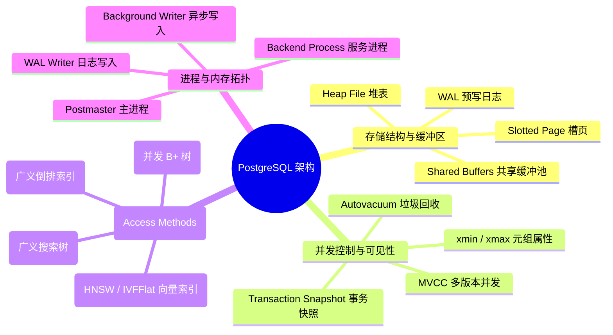
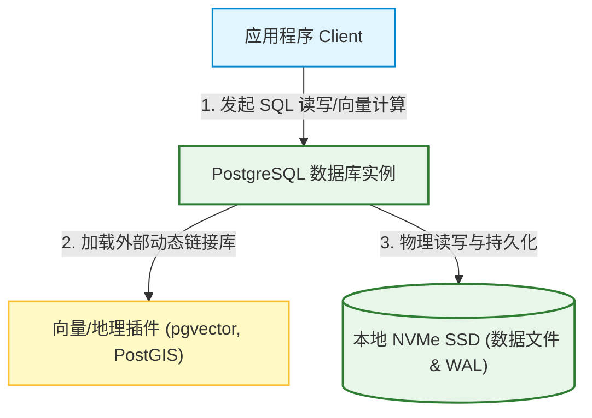
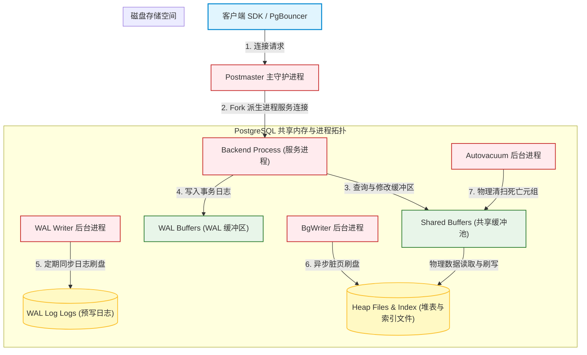
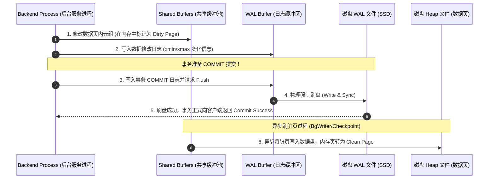
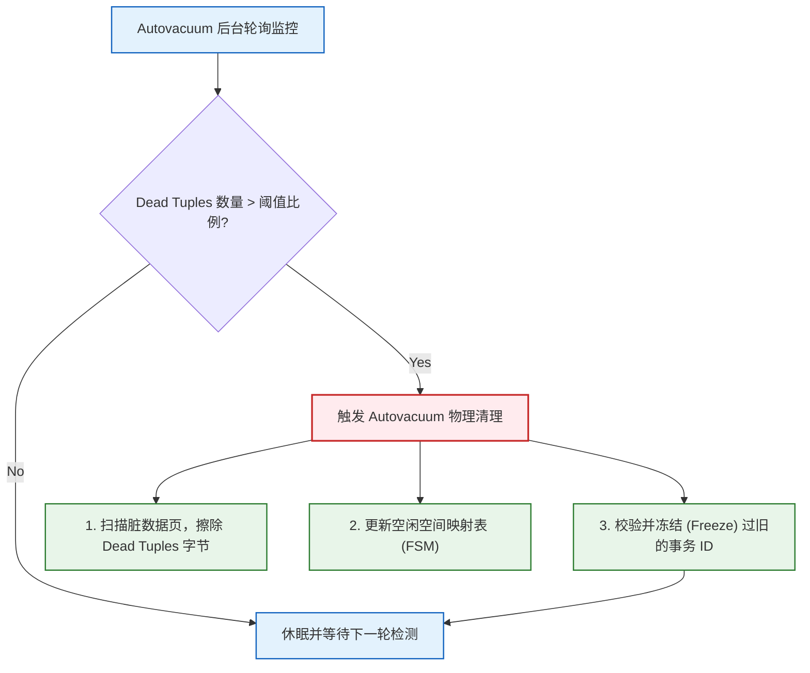
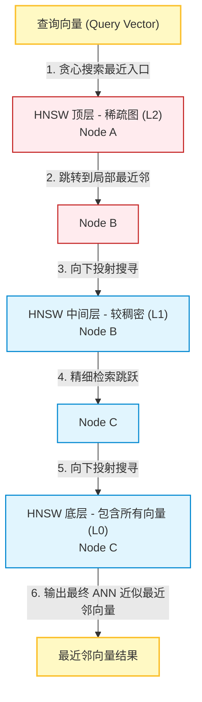

import CaseStudyHeader from '@site/src/components/CaseStudyHeader';
import DesignIntent from '@site/src/components/DesignIntent';
import EvolutionTimeline from '@site/src/components/EvolutionTimeline';
import CompareSlider from '@site/src/components/CompareSlider';
import TradeoffExplorer from '@site/src/components/TradeoffExplorer';
import GlossaryTerm from '@site/src/components/GlossaryTerm';
import ResearchNote from '@site/src/components/ResearchNote';
import GuidedExercise from '@site/src/components/GuidedExercise';
import QuizCard from '@site/src/components/QuizCard';
import MindMap from '@site/src/components/MindMap';
import PyRunner from '@site/src/components/PyRunner';

# PostgreSQL：学院派关系型数据库、MVCC 堆表与 pgvector 插件架构

<CaseStudyHeader
  oneLiner="PostgreSQL 是开源对象关系数据库的执牛耳者，以其严格的标准兼容性与超强的可扩展性著称。它采用追加写堆表（Heap File）的方式实现多版本并发控制（MVCC），利用 WAL 预写日志与共享内存缓冲区（Shared Buffers）保障 ACID 强一致性；并通过极其开放的扩展接口（Extension API）接入 pgvector 等插件，使其在 AI 时代完美演进为生产级高维向量数据库。"
  stats={[
    {label: '定位与类别', value: '开源关系型对象数据库 (RDBMS)'},
    {label: '存储组织形式', value: 'Heap File (堆表) + Slotted Page (槽页)'},
    {label: '并发隔离实现', value: 'MVCC (多版本) + xmin/xmax 头部标记'},
    {label: '并发索引结构', value: 'nbtree (并发 B+ 树，带 Latch Coupling)'},
    {label: '垃圾回收组件', value: 'Vacuum / Autovacuum 后台守护进程'},
    {label: 'AI 向量检索', value: 'pgvector 插件 (支持 HNSW 与 IVFFlat)'}
  ]}
/>

:::info 对应课程概念
本案例融合了以下课程核心概念：
*   **多版本并发控制 MVCC（Month 3 数据引擎）**：xmin/xmax 标记与活跃事务快照（Snapshot）在读写分离中的底层可见性计算。
*   **存储缓冲区与持久化（Month 3 存储引擎）**：Shared Buffers、脏页刷写与 WAL（Write-Ahead Logging）预写日志的协作。
*   **并发索引与锁机制（Month 3 并发控制）**：B+ 树索引（nbtree）的并发控制，以及基于共享锁与排他锁的粒度隔离。
*   **数据库插件扩展设计（Month 4 架构模式）**：插件机制（Extension）如何在不破坏 PG 内核代码的前提下，扩展高维向量检索能力。
:::

---

## 1. 设计初衷：学院派的扩展性探索与关系型 SQL 的卫冕

在 20 世纪 80 年代中期，关系型数据库（如早期 Oracle）虽然能处理简单的行列数据，但在复杂自定义数据类型与扩展能力上非常僵硬。
1.  **Michael Stonebraker 的 POSTGRES 梦想**：
    *   作为 Ingres 数据库的奠基人，Stonebraker 教授在加州大学伯克利分校开启了 POSTGRES（Post-Ingres）项目。其设计核心就是：**对象关系（Object-Relational）**。
    *   数据库不应该仅仅认识 int、varchar，它必须能够允许用户定义自己的复杂数据类型（如地理坐标几何体、IP 网段、高维嵌入向量），并允许自定义索引结构（如 R-Tree、HNSW）来加速检索。
2.  **放弃 Undo Log 的追加写 MVCC**：
    *   为了实现高并发且不阻塞读的事务隔离，设计团队选择了一条与 MySQL / Oracle 迥异的道路：不使用撤销日志（Undo Log）来动态回溯历史版本，而是直接在**数据块（Page）**中追加写入新版元组（Tuple）。
    *   这种设计极大地简化了崩溃恢复（Crash Recovery）机制，但代价是会产生大量的物理死亡元组（Dead Tuples），必须依靠专门的垃圾回收机制（Vacuum）进行物理清扫与压实。
3.  **插件扩展化（Extension API）的 AI 奇迹**：
    *   PostgreSQL 设计了极其开放的挂钩（Hook）和扩展机制，允许第三方编写 C 语言动态链接库在运行时载入。
    *   正因为这套在 30 年前就立下的可扩展地基，在 AI 时代爆发时，开发者无需修改 PostgreSQL 哪怕一行的内核代码，只需挂载 `pgvector` 插件，即可瞬间让原本存储传统财务数据的数据库，以极其恐怖的效率支撑数百维的 AI Embedding 向量相似度检索。

<DesignIntent
  problem="如何设计一个兼顾严格 ACID 事务安全性、PB 级高并发读写性能，且在数据类型、索引方法与查询优化层面具备无限运行时扩展能力的开源关系型数据库。"
  users="全球范围的大中型企业研发团队、数据库管理员（DBA）、大数据应用架构师、以及 AI 大模型 RAG 应用开发团队。"
  devices="运行在拥有高速 NVMe 固态硬盘的 x86/ARM 物理服务器或云虚拟主机上，通过标准 SQL (支持 C/Python/Go 等 SDK) 进行并发读写。"
  goals={[
    '无锁只读 MVCC 架构：只读查询获取活跃事务快照后，直接读取对应历史版本，完全不被任何写事务阻塞',
    '插件式高维检索：通过 pgvector 插件支持 HNSW 和 IVFFlat 向量索引，为 AI 应用提供零门槛的向量存储与混合 SQL 检索',
    '崩溃恢复与持久安全：引入 WAL（预写日志），在修改内存缓冲区块前强行刷盘，提供完美的 Crash Safety 和增量备份（PITR）',
    '超强标准扩展性：支持自定义操作符、地理空间索引（PostGIS）、倒排索引（GIN）与用户自定义函数（UDF）'
  ]}
  constraints={[
    '表膨胀与 VACUUM 抖动：由于 MVCC 采用追加写，频繁的 UPDATE/DELETE 产生大量死亡元组占满物理块，若后台 Autovacuum 速度跟不上，会造成严重的磁盘膨胀和 I/O 抖动',
    '单 Master 写入极限：作为经典关系型架构，其强一致写只能路由到主节点（Master），在超大规模互联网高并发写入场景下存在物理天花板',
    '连接开销大：每个客户端连接对应一个独立的 Backend 进程，高并发下进程切换调度开销巨大，通常需要额外配备 PgBouncer 连接池'
  ]}
  firstStep="搭建槽页（Slotted Page）和堆表（Heap File）的块物理结构；设计共享缓冲区（Shared Buffers）和 WAL 日志刷盘引擎；编写 xmin/xmax 判定可见性的快照计算框架；引入自定义索引接口（Index Access Methods）。"
/>

---

## 2. 知识全景脑图

### 2a. 全景架构思维导图



### 2b. 交互脑图导航

<MindMap
  root={{
    label: 'PostgreSQL 核心架构',
    children: [
      {
        label: '缓冲区与存储 (Storage)',
        children: [
          { label: 'Heap File 物理堆表' },
          { label: 'Shared Buffers 共享缓冲区' },
          { label: 'WAL 日志与持久性 (ACID)' }
        ]
      },
      {
        label: '并发控制 (Concurrency)',
        children: [
          { label: '追加写 MVCC (xmin/xmax)' },
          { label: '活跃事务快照 (Snapshot)' },
          { label: 'Autovacuum 后台空间压实' }
        ]
      },
      {
        label: '索引与扩展 (Index & Extensions)',
        children: [
          { label: 'nbtree 并发 B+ 树索引' },
          { label: 'pgvector AI 向量检索插件' },
          { label: 'HNSW / IVFFlat 算法' }
        ]
      }
    ]
  }}
/>

---

## 3. 系统架构总览 (C4 Model)

### 3a. System Context (系统上下文图)



### 3b. Container Diagram (容器结构图)



---

## 4. 核心机制拆解

### 4a. MVCC 与 Tuple 可见性判定机制 (xmin / xmax)

与 MySQL / Oracle 的 Undo Log 重构历史版本不同，PostgreSQL 每次执行 UPDATE，本质上是执行了一次 INSERT + DELETE：
1.  **多版本共存**：数据行物理存储在堆表（Heap File）中。每一行元组（Tuple）都在头部带有两个关键的事务 ID 标记：
    *   `t_xmin`：创建此版本元组的事务 ID。
    *   `t_xmax`：删除或更新此版本元组的事务 ID（若还未被删除，则设为 0）。
2.  **UPDATE 物理拆解**：如果对一行数据进行更新，PostgreSQL 并不修改原有行，而是将原有行的 `t_xmax` 设为当前更新事务的 ID，并新建一行元组，新元组的 `t_xmin` 设为当前事务 ID，`t_xmax` 设为 0。
3.  **快照可见性算法**：当读事务发起查询时，它会获得当前系统的 <GlossaryTerm term="事务快照" definition="事务快照是读事务启动时系统活跃事务的视图，包含当前活跃事务列表、已提交的最大事务号等，用以在 MVCC 下判断哪些数据版本对当前事务可见。">事务快照 (Snapshot)</GlossaryTerm>。判定一元组是否可见的核心规则为：
    *   创建它的事务 `t_xmin` 已经提交，且**不在**快照的活跃事务列表中。
    *   删除它的事务 `t_xmax` 尚未提交，或者 `t_xmax` 为 0。
    *   通过此算法，读事务可以精确获得其启动时刻的数据一致性快照，不被写事务干扰。

```mermaid
graph TD
  classDef tuple fill:#ffebee,stroke:#c62828,stroke-width:1.5px;
  classDef process fill:#e3f2fd,stroke:#1565c0,stroke-width:1.5px;

  subgraph HeapPage [物理数据页 (Page)]
    TupleV1["元组版本 1 (balance=50)<br/>xmin=100 (已提交)<br/>xmax=105 (已提交)"]:::tuple
    TupleV2["元组版本 2 (balance=100)<br/>xmin=105 (已提交)<br/>xmax=0 (激活)"]:::tuple
  end

  Reader["只读事务 (快照: 活跃列表=[105])"]:::process -->|读取数据| TupleV1
  Reader -->|读取数据| TupleV2

  Note over Reader, TupleV1: 因为 xmax=105，而 105 在快照中仍算活跃（未提交），<br/>所以 TupleV1 对当前 Reader 可见！
  Note over Reader, TupleV2: 因为 xmin=105，而 105 对 Reader 属于未提交的活跃事务，<br/>所以新版 TupleV2 对 Reader 不可见！
```

---

### 4b. WAL 预写日志与共享缓冲区 (Shared Buffers) 缓存淘汰

PostgreSQL 依靠 <GlossaryTerm term="WAL" definition="WAL (Write-Ahead Logging) 预写日志是关系型数据库保证持久性与一致性的关键技术。在数据页脏数据写入磁盘前，必须先将对应的变更日志（WAL）强行刷盘，以保证即使断电重启，也能通过日志重放恢复状态。">WAL (Write-Ahead Logging)</GlossaryTerm> 预写日志和 <GlossaryTerm term="Shared Buffers" definition="PostgreSQL 的共享缓冲区，用于在内存中缓存磁盘数据块。读写请求优先在缓冲区进行，写操作将对应块标记为脏页，并由后台进程异步刷盘。">Shared Buffers</GlossaryTerm> 共享缓冲区，完美实现事务持久性与高性能写入：
1.  **写缓冲与脏页**：当 Backend 进程修改数据时，它首先在 `Shared Buffers` 对应的内存 Page 中进行修改，该 Page 随即被标记为“脏页（Dirty Page）”。
2.  **日志先行铁律**：在脏页被写入磁盘前，系统**必须**先将对应的事务变更记录到 `WAL Buffer` 并物理同步到磁盘 `WAL Files` 中。这确保了即使服务器意外断电导致内存中脏页丢失，重启后数据库也能够通过重放 WAL 日志恢复终态（Redo 恢复）。
3.  **时钟淘汰算法 (Clock Sweep)**：在 Shared Buffers 空间占满时，PG 使用时钟扫掠算法（Clock Sweep）来选择淘汰页面：每个 Page 维护一个使用计数器（Usage Count，0-5）。淘汰指针扫描页面，将计数器减 1，直到遇到计数器为 0 的干净页执行置换淘汰，若脏页则唤醒后台写进程（BgWriter）先行刷盘。



---

### 4c. Autovacuum 自动垃圾回收与页清理机制

由于追加写 MVCC 机制，被删除或更新后的历史 Tuple 版本（Dead Tuples）会物理残留在页面中，造成“表膨胀（Bloat）”。PostgreSQL 依靠 <GlossaryTerm term="Vacuum" definition="PostgreSQL 特有的垃圾回收与空间压实机制。由于 MVCC 采用追加写，更新和删除会在堆中留存大量死亡元组，Vacuum 负责扫描并清理这些死亡元组，释放空闲空间供新数据写入，并防止事务ID环绕（Wrapround）风险。">Vacuum</GlossaryTerm> 机制进行空间释放与管理：
1.  **死亡元组清理**：`VACUUM` 进程扫描堆页面，清除被删除的 Dead Tuples，并更新槽页（Slotted Page）的行指针（Line Pointers），释放的空间在页面内部标记为 Free Space 供后续的 INSERT 写入复用，但默认**不会**把空间还给操作系统。
2.  **Autovacuum 自动化触发**：由于手动执行大表的 VACUUM 会带来高昂的 I/O 损耗，内核集成了 Autovacuum 守护进程。当堆表中的死亡元组比例超过设定的阈值（例如 `autovacuum_vacuum_scale_factor = 0.2`，即 20% 数据发生变更）时，系统自动在后台静默触发清理。
3.  **防止 ID 环绕 (Transaction ID Wrapround)**：PG 的事务 ID 是 32 位无符号整数，最大约为 40 亿。如果事务 ID 溢出重归为 0，旧事务提交的数据会突然因为“未来版本”而全部不可见，造成灾难性数据丢失。Autovacuum 负有强制启动 Freeze 清理的职责，将过旧元组的 xmin 改为特殊的 `FrozenTransactionId`（代表物理上永远可见），确保 ID 环绕永不发生。



---

### 4d. pgvector 扩展：高维向量索引 HNSW 与 IVFFlat 的设计

在 AI 时代，大语言模型生成的 Embedding 向量需要进行快速的余弦或 L2 距离近似最近邻（ANN）检索。`pgvector` 插件通过 Extension API 实现了这一能力：
1.  **向量作为原生类型**：`pgvector` 注册了新的 SQL 数据类型 `vector(N)`，允许直接通过 `[1.2, 0.5, -0.9]` 等数组格式插入列中。
2.  **IVFFlat (倒排平坦索引)**：
    *   通过 K-Means 聚类算法将所有向量划分为 $K$ 个中心簇（Centroids）。
    *   检索时，先计算查询向量到这 $K$ 个中心点的距离，只在最近的几个簇内进行精确暴力计算，大幅缩减了需要比对的向量个数。
3.  **HNSW (分层导航小世界图索引)**：
    *   `pgvector 0.5.0` 引入了极其强悍的 <GlossaryTerm term="HNSW" definition="分层导航小世界（Hierarchical Navigable Small World）算法，是一种基于多层图结构的高维向量近似最近邻（ANN）搜索算法，在 pgvector 中被广泛用于加速大模型 Embedding 检索。">HNSW 算法</GlossaryTerm>。它利用多层邻接图（类似于跳表的多层图结构）进行向量关联。
    *   最上层是稀疏图，用于大步长快速定位粗粒度区间；越往下层图越稠密。检索时，从顶层节点出发，通过贪心搜索找到局部最近邻节点，然后跳入下一层继续精细搜索，达到了微秒级的超低延迟和极高召回率。



<ResearchNote
  title="The Design of POSTGRES"
  source="Stonebraker & Rowe (1986), Proceedings of the 1986 ACM SIGMOD Conference"
  href="https://dsf.berkeley.edu/papers/ERL-M85-95.pdf"
  insight="Stonebraker 在 1986 年发表的奠基性论文首次完整阐述了 POSTGRES 的设计蓝图。为了彻底解决关系数据库不能扩展复杂类型、自定义索引的局限性，论文提出对象-关系模型和一套可扩展规则系统。此外，Stonebraker 在这篇论文中首次倡导了『无 Undo Log 的多版本并发控制存储引擎』，这成为了今日 PostgreSQL 物理底座的蓝图。"
  application="架构启示：**让软件为『未来不可预测的扩展』留足钩子**。当我们在 Month 4 中设计 LLD 架构或在 Month 11 中搭建生产级 AI 管道时，架构师应当学习 Stonebraker 的设计前瞻——定义一套极简且抽象度极高的 Access Method 接口，这使得几十年后高维向量检索（pgvector）诞生时，可以在零修改内核的优雅前提下被直接集成进来。"
/>

---

## 5. 关键数据结构与算法

### 5a. 槽页物理结构 (Slotted Page Layout)

PostgreSQL 的物理数据块（Page，默认为 8KB）采用槽页结构（Slotted Page）来高效处理变长数据行：
1.  **数据双向生长**：
    *   **Page Header**：位于页面最前端，保存数据块元信息。
    *   **Line Pointers (行指针数组/槽)**：紧随 Header 之后，每个指针占用 4 字节，记录对应的元组在页内的偏移量和字节长度。行指针**由前向后**顺序生长。
    *   **Tuple Data (物理元组数据)**：从页面的最末尾（8KB 边界）开始，**由后向前**逆向生长。
    *   **Free Space (空闲空间)**：夹在行指针与物理元组中间的未分配区域。
2.  **物理定位隔离**：当元组因为 UPDATE 导致长度改变或在页内移动时，PostgreSQL 仅修改对应的行指针偏移量，元组的逻辑标识符 CTID（形如 `(BlockNumber, OffsetNumber)`，即 `(0, 1)` 代表第 0 块的第 1 个槽）保持不变，保证了外键和二级索引指针无需跟随重构，大大提升了修改性能。

```mermaid
graph TD
  subgraph SlottedPageLayout [PostgreSQL 8KB 物理数据页布局 (Slotted Page)]
    Header["Page Header (页头部元信息 - 24 字节)"]
    LinePtrs["行指针数组 (Line Pointers / 槽)<br/>[Ptr #1] [Ptr #2] [Ptr #3] (由前向后生长)"]
    FreeSpace["夹在中间的空闲空间 (Free Space)"]
    Tuples["物理元组数据 (Tuple Data)<br/>[Tuple #3] [Tuple #2] [Tuple #1] (由后向前生长)"]
  end
  
  Header --> LinePtrs
  LinePtrs --> FreeSpace
  Tuples --> FreeSpace
  
  LinePtrs -->|Ptr #1 指向偏移| Tuples
```

---

### 5b. 并发 B+ 树索引 (nbtree) 算法

PostgreSQL 内部最主流的 B+ 树索引代码模块称为 `nbtree`。为了支撑高并发的读写，它采用了以下复杂的并发控制设计：
*   **锁耦合技术 (Latch Coupling / Crab Locking)**：当进行索引检索时，进程在持有了父节点的读锁（Shared Latch）后，才能去申请子节点的读锁；一旦成功获得了子节点的读锁，才可以释放父节点的锁。这样可以保证检索操作像螃蟹爬行一样安全推进，并防止并发写入导致读写冲突。
*   **页分裂与 High Key 优化**：当 B+ 树的叶子节点被写满时，需要执行页分裂（Page Split）。为了防止分裂时大范围锁定整棵树破坏并发，`nbtree` 引入了 **High Key** 机制：在叶子节点分裂出来的旧页末尾记录一个最大值限制（High Key）。当并发的读事务在未锁定的情况下通过旧页检索时，如果发现要找的 Key 超过了 High Key，它会智能地顺着右兄弟指针（Right-Sibling Link）向右查找，从而省去了在分裂期间对父节点和兄弟节点申请重度锁的开销。

---

### 5c. HNSW 近似最近邻 (ANN) 检索图算法

pgvector 实现 HNSW 索引的核心在于如何在多层图中构建和查询向量网络：
1.  **概率多层图构建**：
    *   每个新向量插入时，系统通过一个概率公式为其随机分配最高能插入的层数（类似于跳表的层高，顶层最高，底层最低）。
    *   在每一层中，系统寻找该向量的最近邻居节点（ANN），并使用启发式边构建算法与它们连接，限制每个节点的最大边数（常数 $M$），保证图的连通性和检索效率。
2.  **贪心路由算法**：
    *   在顶层从全局入口节点（Entry Point）开始，计算该点到查询向量 $q$ 的距离，并向它的邻居节点移动；若移动后距离变小，则更新当前位置并继续。
    *   当在当前层遇到“局部最小值”（即所有邻居到 $q$ 的距离都大于当前节点）时，将该节点投射到下一层作为下一层的起点，直至落入 $L0$ 底层，最终输出最相似的 $K$ 个向量。

---

## 6. 架构演进史

PostgreSQL 的架构变迁史展示了一个学院派关系型数据库向万能插件生态进化的漫长历程：

<EvolutionTimeline
  events={[
    {
      year: '1986',
      title: 'Berkeley POSTGRES 诞生',
      why: 'Michael Stonebraker 教授为探索对象关系型数据库体系，解决传统 RDBMS 无法定义复杂类型和自定义扩展接口的问题。',
      change: '提出可扩展规则系统、用户定义类型（UDT）和自定义函数；率先实现无 Undo Log 物理追加写 MVCC 的底层堆表架构。'
    },
    {
      year: '1996',
      title: 'SQL 兼容化与开源 PostgreSQL 发布',
      why: '学术项目 POSTGRES 原本使用自研的 POSTQUEL 查询语言，这偏离了工业界标准的 SQL 协议，极大限制了推广应用。',
      change: '引入 SQL 语言解析器；正式重命名为 PostgreSQL 6.0；开源社区接管开发，重构了事务隔离实现和 nbtree 索引模块。'
    },
    {
      year: '2014',
      title: 'JSONB 半结构化支持与流复制时代',
      why: '以 MongoDB 为代表的 NoSQL 数据库凭借半结构化文档存储在互联网大放异彩，关系数据库需要兼容文档存储。',
      change: '推出二进制 JSON 存储类型 `jsonb`，配合 GIN (广义倒排) 索引，使得 PG 对 JSON 的查询效率等同甚至超越 MongoDB，极大地巩固了关系型数据库的地位。'
    },
    {
      year: '2023 至今',
      title: 'pgvector 爆发与 RAG 大模型向量卫冕',
      why: '生成式 AI 爆发导致大模型 Embedding 向量的存储与近似最近邻（ANN）检索成为了所有大模型应用的刚需。',
      change: '通过开放的 Extension 挂钩，社区研发的 pgvector 0.5.0 提供了高效的 HNSW 分层导航小世界图索引，使得企业在不增设专用向量数据库的前提下，利用 PG 实现高性能 RAG 混合检索。'
    }
  ]}
/>

---

## 7. 架构对比：传统 MySQL InnoDB Clustered Index vs. PostgreSQL Heap-based MVCC 架构

<CompareSlider
  before={
    <div style={{ padding: '20px', background: '#ffebee', border: '1px solid #c62828', borderRadius: '8px', height: '100%', color: '#333' }}>
      <strong>MySQL InnoDB 聚簇索引与 Undo Log</strong>
      <p style={{ marginTop: '10px', fontSize: '0.9rem' }}>数据页按照主键顺序物理排序存储（聚簇索引）。修改操作在原元组上就地进行，并向 Undo Log 写入回滚日志。读快照时，根据版本链（Roll Pointer）在内存中重构历史版本。优点是没有物理空闲表膨胀，主键检索极快；缺点是二级索引查询需回表，且高并发写事务下 Undo 链条过长会引发严重的性能退化。</p>
    </div>
  }
  after={
    <div style={{ padding: '20px', background: '#e8f5e9', border: '1px solid #2e7d32', borderRadius: '8px', height: '100%', color: '#333' }}>
      <strong>PostgreSQL 物理堆表与追加写 MVCC</strong>
      <p style={{ marginTop: '10px', fontSize: '0.9rem' }}>数据在堆表（Heap File）中无序追加写入，二级索引直接通过物理元组 ID（CTID）定位。UPDATE 视为“老版本置 Dead + 新版本 Insert”。优点是写入和追加速度极快，回表开销小；缺点是频繁更新带来严重的数据页物理膨胀（Bloat），极其依赖 Autovacuum 进程清理死亡元组，容易产生 I/O 抖动。</p>
    </div>
  }
  labels={['MySQL InnoDB MVCC', 'Postgres Heap MVCC']}
/>

---

## 8. 设计模式与课程映射

本案例在实际工业界的顶级关系型数据库底座中，深度应用了以下课程章节中的核心设计模式与技术：

1.  **多版本并发控制 MVCC 与可见性计算**（参见 [存储引擎与持久化](../03-data-cache-queue/storage-engines.mdx) 章节）：
    *   PostgreSQL 中每一行 Tuple 的头部数据结构就是其 MVCC 可见性的具体物理承载。利用当前事务快照中的活跃事务列表与 xmin/xmax 字段比对，实现全局读不锁写、写不锁读的极高并发隔离性。
2.  **崩溃恢复机制与 WAL 先行原则**（参见 [数据一致性](../03-data-cache-queue/consistency-patterns.mdx) 章节）：
    *   PG 强制执行的 WAL 日志先行刷盘铁律，代表了经典的 Write-Ahead Logging 容错设计模式。它解决了内存缓冲区（Shared Buffers）延迟异步刷盘带来的物理丢失危险，保证了关系数据库硬性的 Durable 持久性。
3.  **并发控制与两阶段锁 (2PL)**（参见 [事务与隔离级别](../03-data-cache-queue/transactions-isolation.mdx) 章节）：
    *   尽管 PG 采用 MVCC 来提供快照隔离，但针对显式的排他更新（如 `SELECT ... FOR UPDATE`），仍然使用两阶段锁（2PL）在 Lock Table 内存结构中申请行级独占锁，以防并发下的幻读与写写冲突。
4.  **模块化插件架构设计**（参见 [设计模式与 LLD](../04-design-patterns-lld/overview.mdx) 章节）：
    *   Postgres 提供的 Extension API 是开闭原则（Open-Closed Principle）在系统级底座中的终极实践。通过对外暴露统一的自定义索引类型（Index Access Methods）与操作符挂钩，`pgvector` 可以在不触及核心引擎源代码的情况下，完成 HNSW 近似最近邻向量检索的全面适配。

---

## 9. 权衡：对象关系数据库引擎中的架构妥协

PostgreSQL 在写入追加模型、一致性以及系统复杂性之间做出了以下妥协：

<TradeoffExplorer
  title="PostgreSQL 存储、索引与并发控制架构权衡"
  dimensions={['高频写与更新吞吐性能', '数据物理块占用与防膨胀', '非结构化与向量扩展支撑', '崩溃自愈与冷备启动耗时', '高并发连接内存开销']}
  options={[
    {
      name: '追加写 MVCC 堆表 + 后台 Autovacuum 架构 (Postgres 标准)',
      scores: [5, 2, 5, 4, 2],
      note: '通过将所有修改转为追加写，Postgres 获得了无与伦比的数据插入吞吐速度，以及通过 Extension API 挂载 pgvector 等向量检索的极高灵活性。代价是高频更新下会产生大量的 Dead Tuples 导致物理表严重膨胀，极其依赖后台 Autovacuum 回收，且每个物理连接一个进程的模式限制了并发连接总数。',
      whenToUse: '读写并发要求高、存储数据类型异构（如混合结构 JSON、AI 高维向量）、需要通过复杂的自定义函数与规则扩展核心业务的系统。'
    },
    {
      name: '基于 Clustered Index 与 Undo Log 架构 (如 MySQL InnoDB)',
      scores: [3, 5, 2, 5, 4],
      note: '使用就地更新和 Undo 回滚页，彻底避免了物理表膨胀问题，不需要频繁调用类似 Vacuum 的垃圾清扫，磁盘利用率高且稳定。但缺点是缺乏复杂的索引扩展支持，在混合 JSON 或向量计算上扩展非常困难，且二级索引必须回表查，牺牲了部分灵活度和二级索引读取性能。',
      whenToUse: '高频读写传统的财务记账数据、主键精确检索比例极高、磁盘空间有限且不愿意承担 Autovacuum 磁盘 I/O 抖动风险的经典 RDBMS 场景。'
    },
    {
      name: '完全内存化多版本 MVCC 架构 (如 Memcached/Redis 等)',
      scores: [5, 1, 3, 1, 5],
      note: '将所有 MVCC 版本链保存在内存中，速度快到了微秒级别。代价是内存成本极其高昂，崩溃时需要漫长的快照重放或日志回重构，且无法支持超出物理内存量级的海量 PB 存储。',
      whenToUse: '实时风控过滤、高频缓存、秒杀库存扣减等极致延迟敏感且数据量可全部塞入内存的业务。'
    }
  ]}
/>

---

## 10. 如果是你来设计：PostgreSQL MVCC 行可见性判定模拟器

### 场景设想
在 PostgreSQL 的多版本并发控制（MVCC）中，当只读事务向数据库发起查询时，必须获得当前系统的快照 `Snapshot`。
*   快照包含：
    *   `xmin`：所有小于此 ID 的事务均已提交，对其可见。
    *   `xmax`：所有大于等于此 ID 的事务均未提交，对其不可见。
    *   `active_tx_list`：处于 xmin 和 xmax 之间的活跃（未提交）事务 ID 列表，对其不可见。
*   每一行元组具有 `t_xmin`（创建事务 ID）和 `t_xmax`（删除/更新事务 ID）的元数据标记。
*   请用 Python 编写这个符合 PostgreSQL 经典堆表可见性判定算法（HeapTupleSatisfiesMVCC）的模拟器。

<GuidedExercise
  title="基于 Python 的 Postgres MVCC 可见性判定算法仿真"
  goal="实现事务快照捕获、多版本元组存储、以及通过判定 xmin/xmax 决定某事务是否能读取指定元组版本的核心算法。"
  steps={[
    '步骤 1: 实现 TupleVersion 类。包含字段 `value`、`t_xmin` 和 `t_xmax`。',
    '步骤 2: 设计 TransactionSnapshot 快照类。包含 `xmin`、`xmax` 以及活跃事务列表 `active_tx_list`，用于隔离不同的读取视图。',
    '步骤 3: 编写核心判定函数 `is_tuple_visible(tuple_version, snapshot, committed_tx_set)`。模拟 PG 内核判定算法：如果 xmin 未提交或在活跃列表中，则不可见；如果 xmin 已提交，且 xmax 为 0 或 xmax 未提交（或在活跃列表中），则可见。',
    '步骤 4: 设计测试场景。运行 T105 事务更新 balance，在此期间 T106 发起读取，确认在未提交前只能读到旧版本，提交后可读到最新版本，验证读写隔离性。'
  ]}
  checks={[
    '确认事务提交状态（committed_tx_set）发生改变时，对应的 tuple 可见性算法工作正常',
    '验证当只读事务快照中的活跃事务列表包含写事务时，该只读事务只能读取到 xmax 未被改写前的老版本 tuple',
    '当控制台打印出“✅ MVCC 快照判定逻辑验证成功！”时，模拟器运行正常'
  ]}
/>

#### 交互式 Python 运行实验
在下方控制台中直接运行或修改已准备好的 PostgreSQL MVCC 判定仿真代码：

<PyRunner
  expect="快照判定逻辑验证成功"
  rows={25}
  code={`import time

class TupleVersion:
    def __init__(self, value, t_xmin, t_xmax=0):
        self.value = value
        self.t_xmin = t_xmin  # 创建此版本的事务 ID
        self.t_xmax = t_xmax  # 删除/修改此版本的事务 ID (0 代表未删除)

    def __repr__(self):
        return f"[Val: {self.value} | xmin: {self.t_xmin} | xmax: {self.t_xmax}]"

class TransactionSnapshot:
    def __init__(self, xmin, xmax, active_tx_list):
        self.xmin = xmin  # 最小活跃事务 ID (所有小于此 ID 的事务均已提交)
        self.xmax = xmax  # 最大活跃事务 ID (所有大于等于此 ID 的事务均未提交)
        self.active_tx_list = set(active_tx_list)  # 处于两者之间的活跃事务 ID 集合

    def __repr__(self):
        return f"Snapshot(xmin: {self.xmin}, xmax: {self.xmax}, active: {list(self.active_tx_list)})"

def is_tuple_visible(tuple_ver, snapshot, committed_txs):
    # 规则 1: 检查创建该元组的事务 t_xmin 是否已提交
    if tuple_ver.t_xmin not in committed_txs:
        # 如果创建它的事务本身尚未提交，说明数据还没生效，对其他事务不可见
        return False

    # 规则 2: 检查创建该元组的事务 t_xmin 是否在读快照的活跃事务列表中
    if tuple_ver.t_xmin in snapshot.active_tx_list:
        # 虽然 t_xmin 在全局提交集合，但对捕获该快照的读事务而言，当时它仍算活跃，因而不可见
        return False
    if tuple_ver.t_xmin >= snapshot.xmax:
        # 大于等于 xmax 的事务是在快照捕获后才开启的，因而不可见
        return False

    # 规则 3: 检查元组是否被更新/删除过 (即 t_xmax 是否有值)
    if tuple_ver.t_xmax == 0:
        # 没有被删除，且创建事务对快照可见，说明该行可见
        return True

    # 规则 4: 检查删除该元组的事务 t_xmax 是否已经提交
    if tuple_ver.t_xmax not in committed_txs:
        # 删除它的事务还没提交，说明删除动作未生效，元组依然可见
        return True

    # 规则 5: 检查删除该元组的事务 t_xmax 是否在读快照的活跃列表中
    if tuple_ver.t_xmax in snapshot.active_tx_list:
        # 虽然 t_xmax 在全局提交了，但对读事务发生时它还没提交，说明删除对快照不可见，元组依然可见
        return True
    if tuple_ver.t_xmax >= snapshot.xmax:
        # 在快照之后才被删除的，对快照可见
        return True

    # 其余情况（删除事务已提交且在快照捕获前已生效），该元组版本被判定为 Dead Tuple，不可见
    return False

# 仿真测试流程
# 当前已提交的事务集合
committed_tx_set = {100, 101, 102}

# 数据堆中有两个版本：T101 写入 balance=50；后来 T103 将其更新为 balance=100 (xmin=103)
# 原 Tuple 版本的 xmax 被改写为 103
v1 = TupleVersion(value=50, t_xmin=101, t_xmax=103)
v2 = TupleVersion(value=100, t_xmin=103, t_xmax=0)

# 测试场景一：一个只读事务启动，当前活跃事务列表包含 103 (即 103 正在写，还没提交)
# 系统为该读事务计算 Snapshot: xmin=102, xmax=104, active=[103]
snapshot_reader = TransactionSnapshot(xmin=102, xmax=104, active_tx_list=[103])
print(f"--- 场景一: 只读事务启动，获取 {snapshot_reader} ---")

vis_v1 = is_tuple_visible(v1, snapshot_reader, committed_tx_set)
vis_v2 = is_tuple_visible(v2, snapshot_reader, committed_tx_set)
print(f"   元组版本 1 (balance=50) 是否可见? -> {vis_v1} (预期: True)")
print(f"   元组版本 2 (balance=100) 是否可见? -> {vis_v2} (预期: False)")

# 测试场景二：写事务 103 终于执行 COMMIT 提交
print("\\n--- 场景二: 写入事务 103 执行提交，加入全局已提交集合 ---")
committed_tx_set.add(103)

# 开启一个新的只读事务，捕获新快照: xmin=104, xmax=105, active=[] (103 已经不在活跃中)
snapshot_new_reader = TransactionSnapshot(xmin=104, xmax=105, active_tx_list=[])
print(f"获取新快照: {snapshot_new_reader}")

vis_v1_new = is_tuple_visible(v1, snapshot_new_reader, committed_tx_set)
vis_v2_new = is_tuple_visible(v2, snapshot_new_reader, committed_tx_set)
print(f"   元组版本 1 (balance=50) 是否可见? -> {vis_v1_new} (预期: False - 已被 103 覆盖物理死掉)")
print(f"   元组版本 2 (balance=100) 是否可见? -> {vis_v2_new} (预期: True - 最新已提交版本)")

# 最终自验
if vis_v1 == True and vis_v2 == False and vis_v1_new == False and vis_v2_new == True:
    print("\\n[✅ 验证成功]: 快照判定逻辑验证成功！")
else:
    print("\\n[❌ 验证失败]")
`}
/>

---

## 11. 常见误解

### 误解 1：WAL 预写日志刷盘时，必须同步将 Shared Buffers 中的数据页也刷回磁盘
*   **澄清**：这是完全不需要的，也是 WAL（Write-Ahead Logging）最核心的性能优势。WAL 先行原则只要求在 dirty page 数据页刷盘前，对应的 WAL 日志必须刷盘；在事务 Commit 提交返回时，**只要求把 WAL 日志缓冲区物理强制刷盘即可**。至于 Shared Buffers 中真正的脏页，则由 Background Writer 或 Checkpoint 后台进程以完全异步、分批合并的方式慢慢刷写，从而将高频随机 I/O 转化为顺序 I/O 写入，大幅降低了磁盘开销。

### 误解 2：Autovacuum 只是为了压缩磁盘空间，把多占用的磁盘空间归还给操作系统
*   **澄清**：这是对 Vacuum 物理行为的极大误解。默认的 `VACUUM` 命令确实会清除 Dead Tuples 并释放空间，但它释放的空间**依然保留在该数据表文件的物理 Page 中，仅供以后的新数据写入复用，根本不会把物理文件大小缩小并归还操作系统**。只有执行了极具破坏性、需要获取独占排他锁（导致整张表锁死无法读写）的 `VACUUM FULL`，系统才会重新创建表文件并重新编排数据，真正将磁盘空间归还给系统。因此，生产环境必须极力避免表膨胀过度而频繁使用 `VACUUM FULL`。

### 误解 3：pgvector 只是一个 SQL 层的字符串转译层，高维向量检索必须依赖专门的 Pinecone 或 Milvus 向量数据库
*   **澄清**：这是错误的。`pgvector` 插件绝非仅仅是简单的转译，它是通过 C 语言扩展在 PostgreSQL 内核中注册了真正原生的 `vector` 物理数据类型、以及完全自主实现的 HNSW 和 IVFFlat 物理索引方法（Index Access Methods）。它的 HNSW 图构建、最近邻路由等高维计算完全在 PG 内部高性能执行，并且能与 PG 本身的关系型 SQL、次级索引、主键约束等完美结合，提供了单表混合检索（如：查询创建时间在 3 天内且向量相似度大于 0.8 的数据），这反而是许多独立专用向量数据库难以优雅实现的。

---

## 12. 知识自测

<QuizCard
  questions={[
    {
      q: '在 PostgreSQL 的追加写 MVCC 机制中，如果一个只读事务开始运行，系统分配给它的事务 ID 快照为 Snapshot(xmin=100, xmax=105, active=[102])。对于某行 Tuple（其中 t_xmin=101, t_xmax=103），且 101 和 103 事务均在全局已提交。请判定该 Tuple 版本对该只读事务是否可见？',
      options: [
        'A. 不可见。因为创建该元组的事务 101 已提交，且删除该元组的事务 103 也已在快照创建前完成提交（它小于 105 且不在活跃事务列表中），说明删除效果对该快照已生效，故该元组被认定为过期的死亡元组，对当前只读事务不可见',
        'B. 可见。因为创建该元组的事务 101 已经提交，删除事务 103 虽然已提交，但必须由 Autovacuum 进程清理后才真正对只读事务不可见',
        'C. 可见。因为该元组依然物理存在于数据槽页（Slotted Page）中，未进行物理擦除前均对只读事务可见',
        'D. 无法判定。因为快照隔离不适用于追加写堆表，必须依赖两阶段锁协议'
      ],
      answer: 0,
      explain: '判定 MVCC 元组可见性的核心是看它的创建（xmin）和删除/更新（xmax）事务对当前快照而言是否已生效。在本题中，xmin=101 已提交且不在活跃列表中，说明元组创建生效；而 xmax=103 也已提交且不在活跃列表中（103 < 105 且 active=[102]），说明元组被删除/更新的效果也已生效。因此，该元组已被认定为 Dead Tuple，对该快照下的只读事务不可见。'
    },
    {
      q: 'pgvector 插件中引入的 HNSW 索引，相比于 IVFFlat 索引，在处理 AI 高维嵌入向量检索时有什么优势？',
      options: [
        'A. HNSW 不需要消耗任何物理内存，可以在磁盘上进行极低成本的顺序查找',
        'B. HNSW 利用分层导航小世界多层图的跳跃检索，能够实现微秒级的近似最近邻（ANN）查询，且在召回率和查询延迟的稳定性上显著优于基于聚类扫描的 IVFFlat 索引',
        'C. HNSW 可以支持最大 100 万维度的向量，而 IVFFlat 只能支持 3 维向量',
        'D. HNSW 完全不需要在插入新向量时动态构建索引，从而可以实现零写开销'
      ],
      answer: 1,
      explain: '分层导航小世界（HNSW）是目前 ANN 近似最近邻检索的 SOTA 算法之一。它以概率多层图的形式对高维向量建立关联，检索时能大步长逼近，具有极其优秀的查询性能，虽然构图开销和内存占用比 IVFFlat 稍大，但响应延迟和准确度极大领先。'
    },
    {
      q: '关于 PostgreSQL 中的 Autovacuum 后台守护进程，以下哪项叙述是正确的？',
      options: [
        'A. Autovacuum 的主要目的是物理截断 Heap 堆表文件，并无条件将多占用的磁盘大小物理释放还给操作系统',
        'B. Autovacuum 旨在防止并发死锁，周期性扫描并杀死所有持有悲观锁的后端服务进程',
        'C. Autovacuum 在后台检测并清理无用的死亡元组（Dead Tuples）以防止表膨胀，更新空闲空间表以供后续数据复用，并周期性冻结（Freeze）过旧的事务 ID，以防事务 ID 环绕（Wrapround）造成系统级不可用',
        'D. Autovacuum 会自动将所有的 Heap File 堆表数据强行重写并转移至 Redis 内存缓存中'
      ],
      answer: 2,
      explain: 'Autovacuum 是 PostgreSQL 运维保障的生命线。它在后台默默清理更新/删除产生的大量 Dead Tuples 字节，同时还肩负着极重要的安全任务——冻结老旧的事务 ID，把它们标记为 Frozen，防范 32 位整型溢出环绕导致的数据库自毁风险。'
    }
  ]}
/>

---

## 来源清单

*   [Stonebraker & Rowe (1986), The Design of POSTGRES (ACM SIGMOD)](https://dsf.berkeley.edu/papers/ERL-M85-95.pdf)
*   [PostgreSQL Global Development Group, PostgreSQL 16.0 Official Documentation (Chapter 53: Internals of Write-Ahead Logging & Chapter 64: B-Tree Indexes)](https://www.postgresql.org/docs/16/internals.html)
*   [pgvector Github Repository: HNSW vector index implementation details for PostgreSQL](https://github.com/pgvector/pgvector)
*   [Michael Stonebraker, Retrospective on the POSTGRES Project (IEEE Transactions on Knowledge and Data Engineering)](https://ieeexplore.ieee.org/document/766258)
