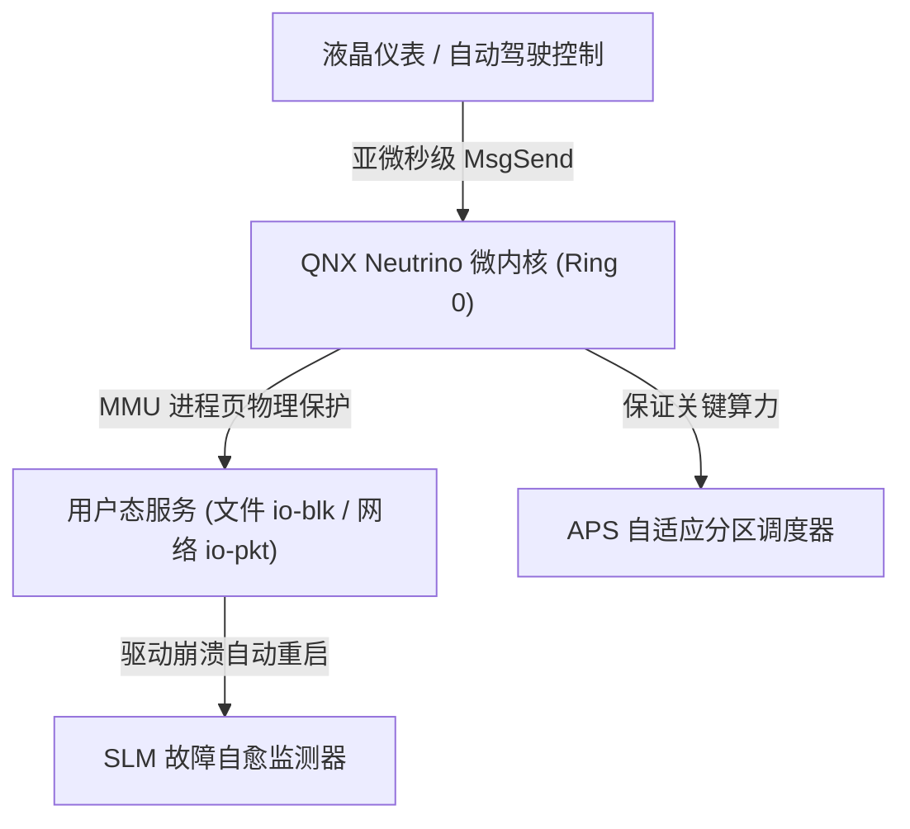
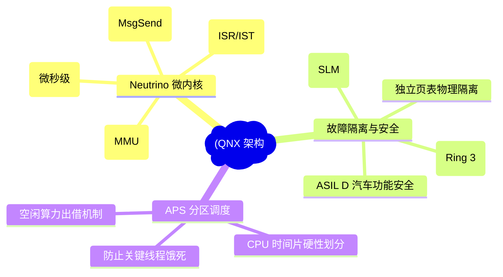
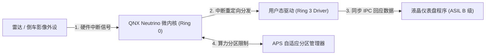
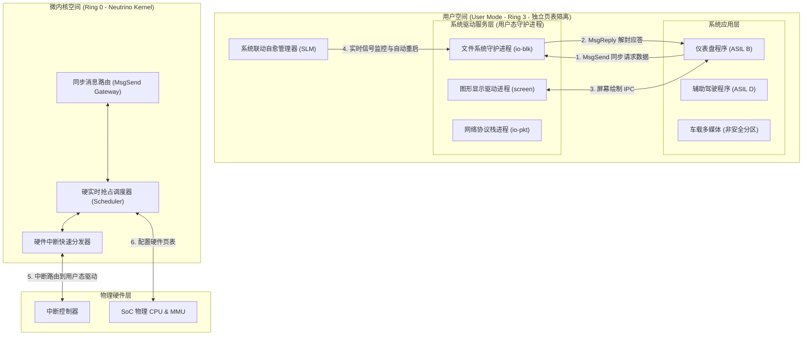
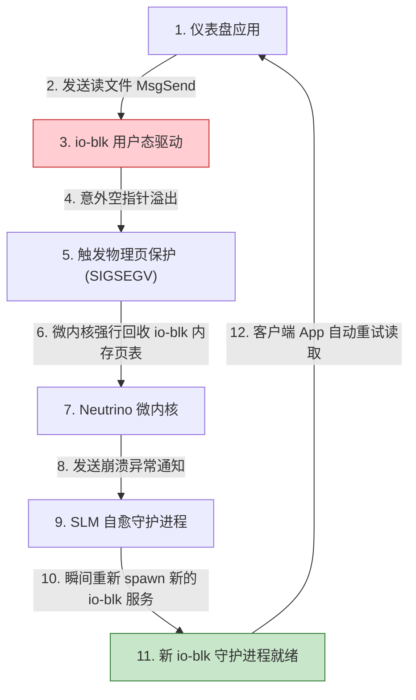
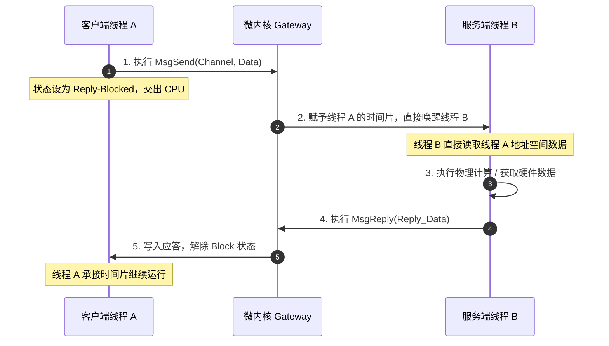
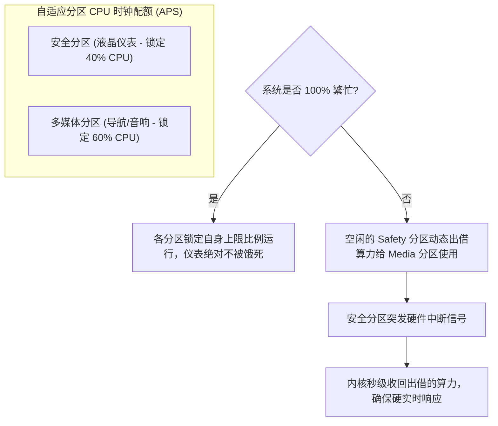
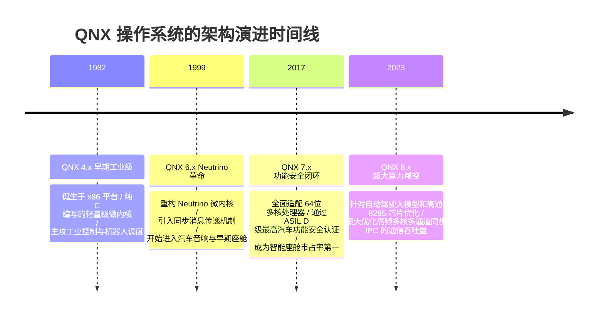

import CaseStudyHeader from '@site/src/components/CaseStudyHeader';
import DesignIntent from '@site/src/components/DesignIntent';
import ArchitectureEvolution from '@site/src/components/ArchitectureEvolution';
import TradeoffExplorer from '@site/src/components/TradeoffExplorer';
import GlossaryTerm from '@site/src/components/GlossaryTerm';
import ResearchNote from '@site/src/components/ResearchNote';
import QuizCard from '@site/src/components/QuizCard';
import CompareSlider from '@site/src/components/CompareSlider';
import GuidedExercise from '@site/src/components/GuidedExercise';
import PyRunner from '@site/src/components/PyRunner';

# QNX：实时微内核与自适应分区隔离架构

<CaseStudyHeader
  oneLiner="QNX 树立了高安全关键系统（Safety-Critical Systems）防线设计的最高峰，其将文件系统、网络栈乃至设备驱动完全驱逐出 Ring 0 用户态独立运行，配合亚微秒级的同步消息传递与 ASIL D 认证，实现了物理级故障自愈的高可靠实时底座。"
  stats={[
    {label: '内核类型', value: 'Neutrino (纯实时微内核)'},
    {label: 'IPC 机制', value: 'MsgSend / MsgReceive 同步消息'},
    {label: '安全认证', value: 'ISO 26262 ASIL D 最高安全级'},
    {label: '调度策略', value: 'APS (自适应分区 CPU 调度)'},
    {label: '内核大小', value: '核心代码仅数万行 (几百 KB)'}
  ]}
/>

:::info 对应课程概念
本案例横跨 [Month 1 操作系统设计哲学与虚拟内存](../foundations/programming-systems-primer)、[Month 4 低阶设计 (LLD) 与同步微内核模式](../foundations/programming-systems-primer)、[Month 6 云隔离与汽车电子高可靠底座](../cloud-enterprise-industrial/capstone-cloud-native)。它是微内核设计模式（Microkernel Pattern）在全球汽车和智能硬件控制领域的终极商业化落地范例。
:::

## 1. 设计初衷：用“彻底隔离”解决宏内核的致命蓝屏

在飞机驾驶舱、高铁控制台、汽车液晶仪表与辅助驾驶（ADAS）中，系统绝不能发生因为某个无关模块崩溃导致整机死机的悲剧。传统的宏内核（如 Linux 或 Windows）中，一个显卡驱动、文件系统或网络栈的空指针异常（Segmentation Fault）就会直接引起整机 Kernel Panic 蓝屏挂掉。

QNX 采用彻底颠覆性的微内核理念解决了这一工程痛点：
1. **驱逐一切 Ring 0 特权**：**<GlossaryTerm term="Neutrino 微内核" definition="Neutrino 微内核：QNX 操作系统的超轻量内核底座。它只保留最核心的进程调度、进程通信 IPC、物理内存映射以及硬件中断转发，代码极度精简，其余所有常规 OS 服务均运行在用户态中。">Neutrino 微内核</GlossaryTerm>** 仅保留进程调度、IPC、内存映射与中断重定向这 4 个最基础功能。文件系统、网卡驱动、显示引擎全部作为普通的用户态进程（系统服务，如 `io-blk`、`io-pkt`）挂接在 MMU 虚拟内存保护中。
2. **物理级故障自愈（Self-Healing）**：如果车机文件系统崩溃，它不会导致仪表盘黑屏或刹车锁死。内核会迅速通过**<GlossaryTerm term="Fault Isolation" definition="Fault Isolation：故障隔离。微内核操作系统特有的可靠性机制。由于文件系统、硬件驱动完全作为 Ring 3 用户进程运行，它们崩溃时仅仅导致自身进程消亡，内核会自动捕捉其信号并就地重新拉起该服务，而其他并行运行的进程完全不受干扰，实现不停机自愈。">故障隔离（Fault Isolation）</GlossaryTerm>**将崩溃限制在单一进程空间，并由外部守护进程自动“闪电重启”该文件系统，实现零停机自愈。
3. **消除微内核 IPC 的上下文开销**：在所有服务都处于独立进程空间的系统里，高频通信会让传统 IPC 成为灾难。QNX 必须实现一套**亚微秒级的同步消息传递**，且支持发送方直接交出时间片（Thread scheduling bypass）直达接收方，省去所有缓冲拷贝耗时。

<DesignIntent
  problem="如何设计一个硬实时微内核架构，使得网络或显卡驱动崩溃时不引起系统死机，且进程间通信（IPC）的切换延迟达到亚微秒级别？"
  users="全球顶级汽车 Tier 1 架构师、医疗透析设备开发者、轨道交通控制工程师，要求系统稳定运行数万小时，通过 ASIL D 认证。"
  devices="汽车液晶仪表盘、自动驾驶域控制器（ADAS）、列车刹车控制板、重症监护仪控制器。"
  goals={[
    'Neutrino 微内核分工：文件、网卡、显卡等设备驱动完全作为 Ring 3 普通进程运行，受 MMU 硬件内存屏障隔离保护。',
    '同步消息传递 IPC：设计 MsgSend/MsgReceive 同步管道，当发送方发送时强行阻塞自己让出 CPU，接收方直接承接时间片。',
    '自适应分区（APS）调度：提供 CPU 时间片硬性配额分区，防止非关键的多媒体系统占满 CPU 饿死核心仪表显示任务。',
    '故障自愈系统：部署系统联动管理器（SLM），捕获硬件服务 SIGSEGV 信号并瞬间热重载。'
  ]}
  constraints={[
    '同步 IPC 的调用阻塞特性：发送进程在接收回复前被强行挂起，需在代码中防范由于接收方死锁引发的发送方无限期阻塞，需配置超时 Timeout 控制。',
    '开发及调试难度倍增：由于驱动程序全部位于用户态，传统内核级调试工具失效，需依赖 GDB 跨进程追踪。'
  ]}
  firstStep="精简 Ring 0 Neutrino 执行逻辑至 100KB 以内；定义同步 IPC 通道 MsgSend 语义；在内核调度器中加入 APS 虚拟分区时钟配额模块。"
/>

## 2. 系统功能全景

以下是 QNX 实时微内核安全隔离架构的全景图：

---

## 3. 最新架构总览

QNX 操作系统的组件架构层级划分如下：

### 3a. System Context (系统上下文)

### 3b. Container Diagram (容器架构)

---

## 4. 核心机制拆解

### 4a. 纯微内核故障隔离与自动恢复机制 (Fault Isolation)

在传统的 Linux 架构中，如果 SATA 硬盘驱动崩溃，整个内核会在一秒内彻底挂起崩溃。

在 QNX 中，`io-blk` 作为普通的 Ring 3 进程运行，当该进程遭遇异常退出时，自愈过程如下：

在这个自愈周期里，虽然文件读取被短暂阻塞了几毫秒，但**底层的微内核没有崩溃，其他的多媒体和屏幕控制渲染线程也照常执行**，避免了车机系统死机的严重恶果。

### 4b. 亚微秒级同步消息传递 (Synchronous Message Passing)

QNX 的 IPC 彻底抛弃了传统的“管道缓冲区”设计，因为缓存区拷贝会造成两次内存复制。它直接采用**同步双向挂起通道**：
1. **客户端阻塞**：当线程 A 调用 `MsgSend` 发送消息给线程 B 时，线程 A 的状态立刻被修改为 `Reply-Blocked`，强行挂起并让出 CPU。
2. **时间片直接移交（Thread Scheduling Bypass）**：内核将线程 A 的剩余执行时间片直接“赋予”线程 B，直接激活线程 B 开始执行。这避免了进行完整的重新调度计算，省去了两次调度器时间开销。
3. **零拷贝内存传输**：内核通过 MMU 地址映射或直接将线程 A 内存指针指向线程 B，让线程 B 直接读取线程 A 用户空间的数据，执行完成后通过 `MsgReply` 还原状态。

### 4c. 自适应分区调度（Adaptive Partitioning Scheduler）

在车机智能座舱中，多媒体娱乐系统（玩游戏、看视频）往往会突发大量 CPU 占用。如果没有强隔离保护，多媒体进程很容易抢走液晶仪表的 CPU 份额，造成仪表卡死。

QNX 采用 **APS（自适应分区调度）** 解决这一难题：
1. **设置硬性百分比配额**：
   - 将系统划分为不同的分区：安全分区（仪表盘，配额 40%），娱乐分区（3D 多媒体，配额 60%）。
2. **算力硬隔离与出借机制**：
   - 当系统百分之百繁忙时，各个分区能够保证获得**不低于**其所约定的 CPU 比例份额。娱乐分区的 CPU 绝不能超过 60%，保证仪表盘的 40% 绝对不会被饿死。
   - 当系统空闲（例如仪表盘不刷新时），仪表盘多余的 40% 额度可以**动态出借**给多媒体分区，使系统整体算力不被浪费。当安全分区一旦有任何中断需要唤醒时，内核立刻收回出借的算力。

---

## 5. 架构演进史

QNX 自 1980 年代诞生起，核心架构经历了四个阶段的关键跃迁：

---

## 6. 架构对比

### 宏内核驱动故障传播（Linux 模式） vs QNX 用户态驱动自愈（微内核模式）

<CompareSlider
  before={
    

      <strong>宏内核崩溃传播 (Linux 显卡驱动 Panic)</strong>
      

        所有的设备驱动都运行在同一个 Ring 0 地址空间内。当显卡驱动由于内存越界崩溃时，它会瞬间污染并覆盖内核其他核心数据结构，触发 Kernel Panic 强制死机蓝屏，车机仪表盘彻底黑屏，必须强制拉闸断电。
      

    

  }
  after={
    

      <strong>QNX 微内核故障自愈 (用户态服务重载)</strong>
      

        显卡和显示服务（screen 进程）运行在独立的 Ring 3 页表保护中。其崩溃时仅导致该进程死亡，微内核毫发无损。内核 SLM 守护进程立刻察觉并在几毫秒内热重载 screen 服务，仪表瞬间恢复显示，汽车行驶未受丝毫影响。
      

    

  }
  labels={['宏内核驱动崩溃', 'QNX 微内核自愈']}
/>

---

## 7. 核心决策的取舍

在不同业务特性的嵌入式系统中，架构师必须在通信效率与故障防护等级之间做抉择：

<TradeoffExplorer
  title="实时操作系统进程间通信（IPC）机制取舍"
  dimensions={['故障物理隔离度', '超大数据包传输效率', '开发调试易用性', '多核处理器下的吞吐性能', '系统组件解耦度']}
  options={[
    {
      name: '同步消息传递 (MsgSend - QNX 模式)',
      scores: [5, 3, 3, 4, 5],
      note: '发送方同步挂起并移交时间片，无缓冲区开销。强迫应用在设计上必须解耦为客户端/服务端模式。隔离性极其优秀，服务端崩溃不会把客户端拖垮。但调试相对复杂，且超大文件数据传输需要依靠共享内存（OOL）辅助。',
      whenToUse: '汽车仪表盘控制、飞机控制链路、医疗设备控制等高安全要求、强故障隔离场景。'
    },
    {
      name: '异步消息队列 (Message Queues - 传统 RTOS 模式)',
      scores: [2, 4, 5, 3, 3],
      note: '发送方将数据丢进缓冲区后立刻返回，不发生阻塞。开发简单，符合直觉。但在资源极度受限系统下容易因为缓冲区溢出导致丢包，且进程崩溃时可能污染共享队列链表。',
      whenToUse: '物联网传感器数据采集上报、网络协议栈高频异步数据流缓冲。'
    },
    {
      name: '宏内核单一共享内存直接读写 (Linux/RT-Linux 模式)',
      scores: [1, 5, 4, 5, 2],
      note: '所有驱动和核心代码共用同一个内存地址空间，数据交互不需要任何 IPC，直接通过指针读取。效率为物理上的极限最大值，但安全隔离性为零，一个驱动写错直接导致整机彻底瘫痪。',
      whenToUse: '自动驾驶大模型深度学习计算、海量摄像头视频流零拷贝拼帧渲染。'
    }
  ]}
/>

---

## 8. 实践指引：实现一个带状态阻塞的 QNX 同步 IPC 仿真器

理解 QNX 微内核同步通信精髓的最佳途径，是编写一个仿真同步消息收发器。它将演示当客户端调用 `msg_send` 时，线程被强行 Block；直到服务端调用 `msg_receive` 接收处理，并用 `msg_reply` 提供应答后，客户端才解封继续运行的过程。

<GuidedExercise
  title="练习指引：编写带 Reply-Blocked 挂起特征的同步消息传递接口"
  goal="构建微型同步 IPC 路由器。模拟客户端与服务端两路进程。当 Client 触发发送时，将其 ID 和消息放入通道并挂起（Blocked），禁止其输出后续就绪日志；Server 执行接收处理后回复应答，打通通信闭环，释放 Client 并输出其解封执行日志。"
  hints={[
    '你可以使用 Python 的布尔状态或字典属性模拟线程的运行状态 `self.blocked_senders = {}`。',
    '客户端调用 `msg_send` 应返回一个未完结的消息实例，记录 `replied = False`，并在应答被 `msg_reply` 修改为 True 时解封。'
  ]}
  steps={[
    '创建 `Message` 传输体结构，维护发送方 ID、内容以及 replied 确认标识。',
    '实现 `QNXIPCBroker` 核心交换机，维护通道就绪队列与阻塞表。',
    '编写 `msg_send(sender_id, content)`：向队列追加消息，将发送方登记进阻塞字典，输出强行挂起提示。',
    '实现 `msg_receive(receiver_id)`：服务端出队列读取消息。',
    '编写 `msg_reply(receiver_id, msg, reply_content)`：匹配发送方并写入数据，清除阻塞，释放发送线程。',
    '顺序调用这些动作，直观查看客户端从挂起到被重新唤醒的完整数据链路。'
  ]}
  checks={[
    '在调用 `msg_send` 后且未执行 `msg_reply` 前，发送方对应的消息实例 replied 属性必须保持为 False。',
    '在服务端最终调用 `msg_reply` 后，发送方状态自动被改写为 True，并且能读取到正确的应答数据包。'
  ]}
/>

#### 交互式 Python 运行实验
在下方控制台中运行准备好的同步 IPC 仿真程序，通过改变调用顺序，观察通道是如何对发送方执行硬性时钟阻塞控制的：

<PyRunner
  expect="分片路由与隔离验证成功"
  rows={25}
  code={`class Message:
    def __init__(self, sender_id: str, content: str):
        self.sender_id = sender_id
        self.content = content
        self.reply_data = None
        self.replied = False

class QNXIPCBroker:
    def __init__(self):
        # 对应 QNX 内核的消息监听队列
        self.channel_queue = []
        # 处于 Reply-Blocked 状态的发送者字典: sender_id -> Message
        self.blocked_senders = {}
        
    def msg_send(self, sender_id: str, content: str) -> Message:
        print(f"[Thread '{sender_id}'] 发起 MsgSend(Channel, '{content}')")
        msg = Message(sender_id, content)
        
        # 将消息投入通道队列中排队
        self.channel_queue.append(msg)
        # 将当前发送线程标记为阻塞挂起状态
        self.blocked_senders[sender_id] = msg
        
        print(f"   ⚠️ [Blocked] 线程 '{sender_id}' 被微内核强行挂起，已交出 CPU 控制权，等待 Server 应答...")
        return msg
        
    def msg_receive(self, receiver_id: str) -> Message:
        print(f"\\n[Thread '{receiver_id}'] 执行 MsgReceive() 监听通道...")
        if not self.channel_queue:
            print("   -> 通道空，服务端进入 Blocked 状态挂起...")
            return None
            
        msg = self.channel_queue.pop(0)
        print(f"   -> [Active] 服务端成功取出来自 '{msg.sender_id}' 的消息: '{msg.content}'")
        return msg
        
    def msg_reply(self, receiver_id: str, msg: Message, reply_content: str):
        print(f"\\n[Thread '{receiver_id}'] 执行 MsgReply() 给 '{msg.sender_id}' 写入数据: '{reply_content}'")
        sender_id = msg.sender_id
        
        # 检查该发送者是否处于阻塞等待应答状态
        if sender_id in self.blocked_senders:
            msg.reply_data = reply_content
            msg.replied = True
            # 从阻塞等待表中移除，解封发送者
            del self.blocked_senders[sender_id]
            print(f"   -> [Unblocked] 成功写入！解封并唤醒客户端线程 '{sender_id}'")
        else:
            print(f"   -> ❌ 错误：发送者 '{sender_id}' 当前未被阻塞，操作无效")

# 1. 实例化 QNX IPC 路由器
broker = QNXIPCBroker()

# 2. 模拟客户端发送读配置请求 (应当立刻进入 Blocked 状态)
client_token = broker.msg_send("Dashboard_App", "GET_OIL_TEMP")

# 3. 模拟服务端守护进程被唤醒，去接收队列读取消息
server_msg = broker.msg_receive("File_System_Daemon")

# 4. 模拟服务端获取到机油温度数据，回复客户端
if server_msg:
    broker.msg_reply("File_System_Daemon", server_msg, "OIL_TEMP: 92 C")

# 5. 验证客户端被唤醒后，成功得到数据并恢复就绪
if client_token.replied:
    print(f"\\n[Thread 'Dashboard_App'] 重新获得 CPU 调度，读取到应答: '{client_token.reply_data}'")
`}
/>

---

## 9. 知识自测

完成自测以检验你对 QNX 微内核架构、同步消息传递、故障隔离自愈以及 APS 自适应分区调度的理解程度：

<QuizCard
  questions={[
    {
      q: '当 QNX 系统的车载网络栈服务进程 io-pkt 突然发生空指针越界崩溃时，为什么系统不会像普通 Linux 一样发生 Kernel Panic 蓝屏死机？',
      options: [
        'A. 因为 QNX 自动用标准 Java 虚拟机包装了所有的网络请求，强行阻止了溢出',
        'B. 网络栈 io-pkt 仅作为 Ring 3 用户态进程运行，其页表受 MMU 严格硬件保护。其意外死亡仅仅被微内核视为一个普通用户进程消亡，微内核毫发无损，SLM 守护进程会瞬间就地重新拉起 io-pkt 修复服务',
        'C. QNX 内核没有任何内存管理机制，所有代码共享同一个物理空间',
        'D. 因为 QNX 系统会强制要求所有的外部硬件停止发包以等待恢复'
      ],
      answer: 1,
      explain: '这是微内核故障隔离的典范。系统服务在 Ring 3 用户空间以普通进程形式挂载，其崩溃被 MMU 拦截为段错误信号，微内核只需清理其分配的虚拟页并重新拉起新实例，即可维持整体系统高可靠运行。'
    },
    {
      q: '在 QNX 同步消息传递中，微内核为了将进程间通信（IPC）上下文切换的延迟压低到极致，采取了什么算法设计？',
      options: [
        'A. 当发送者调用 MsgSend 时强行进入阻塞，内核将发送者的剩余时间片直接赋予接收者执行（Thread Scheduling Bypass），避免了重新调度计算，并支持零拷贝直接读取内存',
        'B. 强制限制所有的进程只能在同一个 CPU 单核中运行，完全抛弃多核并行的物理机制',
        'C. 通过网络发送加密的 TCP 协议包完成本地进程传输',
        'D. 要求两个通信进程共用同一个全局 C 语言结构体数组'
      ],
      answer: 0,
      explain: '同步消息传递消除了消息缓冲区的内存拷贝。客户端被挂起进入等待应答状态，内核通过调度器“时间片移交”机制，直接将客户端当前未用完的时钟片直接移交给接收者，极大地消灭了系统级调度的决策耗时。'
    },
    {
      q: '自适应分区调度器（APS）在汽车座舱架构设计中，起到了什么强力安全保障作用？',
      options: [
        'A. 它会自动把车载音响的声音放大，以防驾驶员在疲劳时打瞌睡',
        'B. 它在系统 100% 繁忙时强行锁定各分区所约定的 CPU 百分比下限配额（如安全仪表盘 40%），防止娱乐系统突发计算占满 CPU 饿死关键仪表，同时支持在空闲期将算力出借以防浪费',
        'C. 专门用于将硬盘分区，以便同时挂载 NTFS 和 ext4 文件系统',
        'D. 负责在汽车倒车时，关闭所有的多媒体设备以节省物理电能'
      ],
      answer: 1,
      explain: 'APS 兼顾了安全隔离与算力最大化利用。在发生计算风暴时，它依据硬性百分比分配 CPU，防止关键任务（ASIL B 仪表盘）饿死；在空闲期则可以将额度出借，提高了 CPU 资源的利用效率。'
    }
  ]}
/>

## 来源

- [QNX Neutrino Real-Time Operating System: System Architecture Guide (BlackBerry QNX Documentation)](https://www.qnx.com/developers/docs/7.1/index.html)
- [ASIL D Functional Safety Certification and Microkernel Design Criteria (ISO 26262 Automotive Standards)](https://www.iso.org/standard/43420.html)
- [Evaluating Synchronous IPC Performance in Embedded Microkernels (QNX Neutrino whitepaper)](https://www.qnx.com/)
- [Adaptive Partitioning Scheduling in Safety-Critical Real-Time Systems (BlackBerry QNX Engineering Journal)](https://www.qnx.com/)