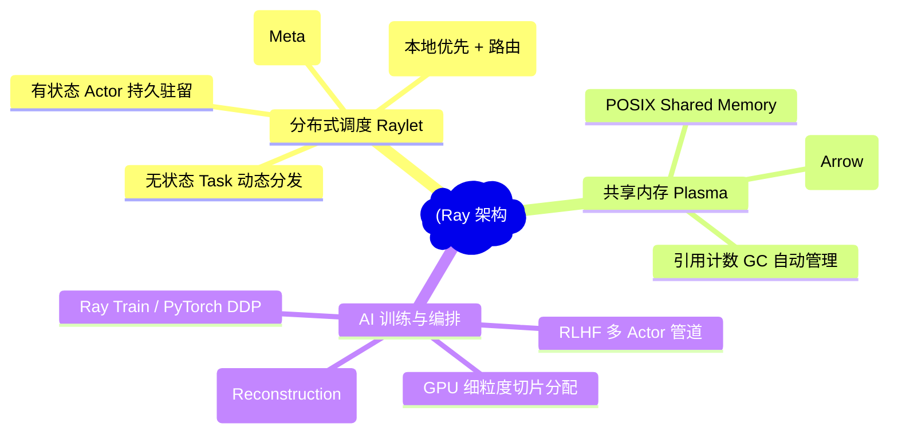
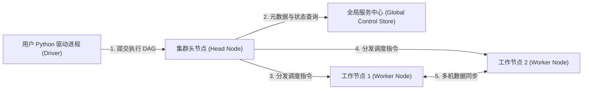
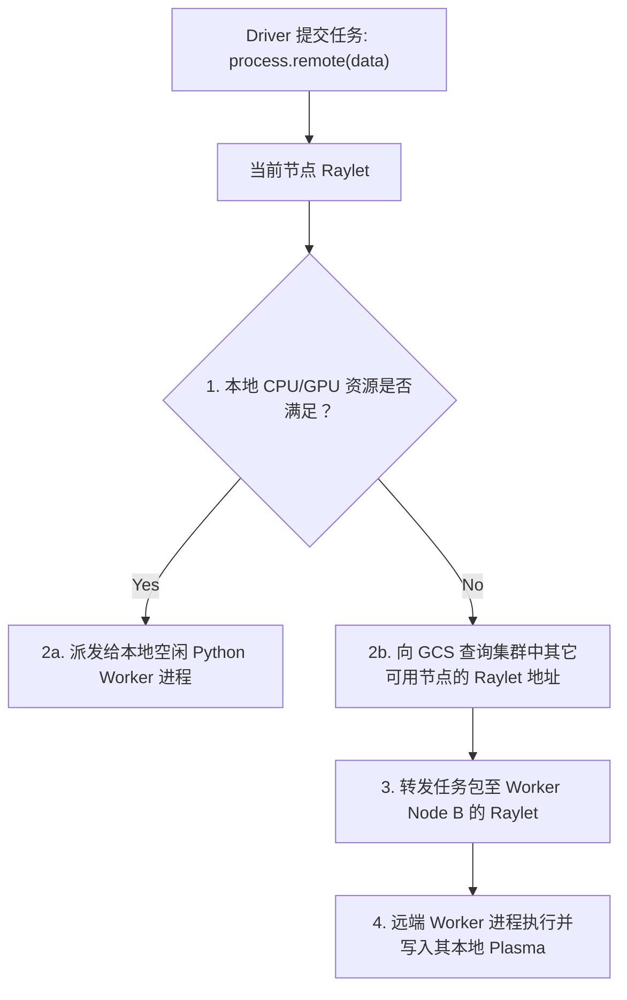
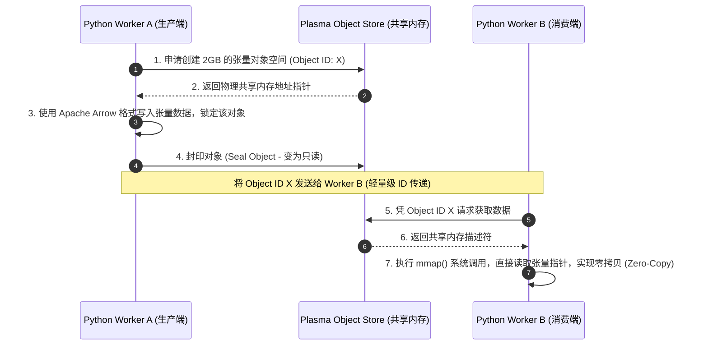
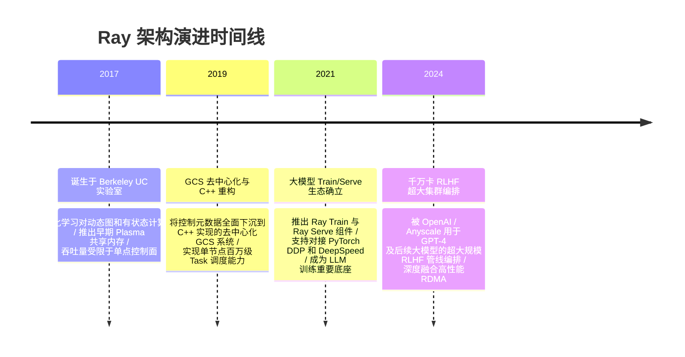

import CaseStudyHeader from '@site/src/components/CaseStudyHeader';
import DesignIntent from '@site/src/components/DesignIntent';
import ArchitectureEvolution from '@site/src/components/ArchitectureEvolution';
import TradeoffExplorer from '@site/src/components/TradeoffExplorer';
import GlossaryTerm from '@site/src/components/GlossaryTerm';
import ResearchNote from '@site/src/components/ResearchNote';
import QuizCard from '@site/src/components/QuizCard';
import CompareSlider from '@site/src/components/CompareSlider';
import GuidedExercise from '@site/src/components/GuidedExercise';

# Ray：分布式 Actor 调度与大模型训练/RLHF 基座架构

<CaseStudyHeader
  oneLiner="Ray 摒弃了传统 MapReduce/Spark 固化的块同步并行（BSP）限制，创造了无缝融合有状态 Actor 与无状态 Task 的低延迟动态图调度引擎，并通过本地共享内存对象存储 Plasma，在集群内实现微秒级的零拷贝张量数据传递。"
  stats={[
    {label: '开源时间', value: '2017 年'},
    {label: '调度吞吐量', value: '单节点百万级 Tasks / 秒'},
    {label: '共享内存核心', value: 'Plasma Object Store (shm / zero-copy)'},
    {label: '核心生态', value: 'Ray Core / Train / Tune / Serve'},
    {label: '关键应用场景', value: 'LLM 分布式预训练、RLHF 对齐、智能体模拟'}
  ]}
/>

:::info 对应课程概念
本案例横跨 [Month 11 生产级 AI 平台与数据治理](../foundations/programming-systems-primer)、[Month 10 经典架构演进](./overview.mdx)、[Month 3 高并发缓存与零拷贝](../data-cache-queue/cache-queues-idempotency)。它深度解析了大规模分布式张量计算是如何在多机多卡异构环境下进行极速调度与内存数据传递的。
:::

## 1. 设计初衷：满足大模型时代非结构化、强交互的分布式计算

早期的分布式数据处理框架（如 Hadoop MapReduce、Apache Spark）是专为“大规模数据并行（Data-Parallel）”设计的，遵循严格的块同步（BSP）范式：数据分片运行相同的函数，最后进行 Shuffle 和聚合。这一模型对静态离线报表处理完美，但完全无法应付现代化 AI。

在强化学习（RLHF）、大模型对齐与多智能体（Multi-Agent）模拟中：
- 任务执行图是**动态变化且不对称的**：例如，模型探索环境需要启动数千个有状态的 Simulator 进程，而模型训练则需要高密度的 GPU 节点进行梯度同步。
- 频繁产生超大体积的**模型权重与张量（Tensors）传输**：如果每次多卡通信都经过网络序列化或进程间拷贝，系统带宽将瞬间枯竭。

Ray 团队为此设计了**支持动态图调度与零拷贝对象存储的通用分布式运行时**。

<DesignIntent
  problem="在非对称、动态演进且高频交互的 AI 分布式计算拓扑中，实现微秒级的动态任务调度与单机多卡间零拷贝的数据对象传递。"
  users="大模型算法科学家、分布式算力平台架构师、机器学习工程师，特别是从事 LLM/RLHF 训练及高性能 Agent 模拟的开发者。"
  devices="配备高带宽 NVLink 的多机多 GPU 异构算力集群，运行大规模参数并行（Megatron-LM/DeepSpeed）训练任务。"
  goals={[
    '统一有状态与无状态计算：在同一框架内自由混合 Stateless Tasks（无状态轻量任务，如特征提取）与 Stateful Actors（有状态进程，如游戏模拟、GPU 权重驻留）。',
    '微秒级零拷贝共享内存：通过 Plasma 对象存储直接在同一物理主机的多个 Python 工作进程间共享多维数组（Numpy 数组 / PyTorch 张量），消除序列化开销。',
    '去中心化双层调度：设计本地调度器（Raylet）与全局目录服务（GCS），避免中央主节点（Master）成为数十万并发 Task 的吞吐瓶颈。',
    '异构硬件管线编排：允许 Task/Actor 细粒度声明资源需求（如 `num_gpus=0.25` 或 `resources={"A100": 1}`），实现高密度多租户共享 GPU。'
  ]}
  constraints={[
    'Python 进程间通信（IPC）的高昂开销：Python 存在 GIL 限制，传统的 `multiprocessing` 序列化（Pickle）极其缓慢。',
    '海量对象引用的内存泄露风险：分布式对象存储存在复杂的依赖 DAG 图，必须设计高可靠的分布式引用计数（Reference Counting）与垃圾回收。',
    '网络物理带宽瓶颈：多节点之间的大参数传递必须对接 RDMA/NCCL 底层，减少主 CPU 的数据拷贝开销。'
  ]}
  firstStep="设计基于 POSIX 共享内存的 Plasma Object Store；在 C++ 层实现本地调度守护进程 Raylet，集成极简的 C++ Actor/Task 执行栈；提供 Python 装饰器（@ray.remote）接入 API。"
/>

## 2. 系统功能全景

以下是 Ray 的底层分布式调度与大模型训练生态的功能全景图：



---

## 3. 架构总览

Ray 集群包含控制平面（GCS）、本地守护进程（Raylet，含 Scheduler 与 Plasma）以及执行具体计算任务的工作进程：

### 3a. 系统上下文图 (System Context)



### 3b. 容器架构图 (Container)

```mermaid
graph TB
  subgraph ClusterGlobal["全局控制面"]
    GCS["全局控制存储 (GCS - C++ Redis-like)"]
  end

  subgraph RayNode["物理计算节点 (Ray Worker Node)"]
    subgraph Raylet["本地控制守护进程 (Raylet - C++)"]
      LocalScheduler["本地调度器 (Local Scheduler)"]
      ObjectManager["分布式对象管理器 (Object Manager)"]
    end
    
    subgraph PlasmaStore["共享内存引擎 (Plasma Object Store)"]
      SharedMem["POSIX 共享内存段 (/dev/shm)"]
    end

    subgraph Workers["工作进程组 (Python Processes)"]
      WorkerProcess1["Worker 进程 1 (Stateless Task)"]
      WorkerProcess2["Worker 进程 2 (Stateful Actor)"]
    end
  end

  UserDriver["Driver 驱动端 (@ray.remote)"] -->|1. 注册 Task/Actor| LocalScheduler
  LocalScheduler <-->|2. 状态汇报/全局寻址| GCS
  LocalScheduler -->|3. 本地进程拉起| Workers
  
  Workers <-->|4. 零拷贝内存映射 (mmap)| SharedMem
  ObjectManager <-->|5. 多机间数据拉取 (RPC/RDMA)| SharedMem
  LocalScheduler <-->|6. 调度路由分配| ObjectManager
```

---

## 4. 核心机制拆解

### 4a. 早期 Spark（静态 MapReduce）与 Ray（动态 Actor）调度对比

Apache Spark 采用的是**块同步（BSP）**调度：所有任务必须在 Stage 边界同步，只有上一个 Stage 结束，下一个 Stage 才能开始。这无法处理复杂的交互式强化学习。

Ray 采用 **有向无环图（DAG）的动态执行图调度**：它允许在运行时动态提交任务（`ray.remote`），而且支持将有状态的 Actor 实例化到特定的物理节点（如固定在持有显卡的 Worker 2 上）。每个 Worker 节点上的本地调度器（Raylet）优先尝试在本地调度任务，只有在本地资源不足时，才通过 GCS 全局目录向其他节点发出“租约请求”（Lease Request）进行远端路由调度，消除了中央 Master 节点的瓶颈。



### 4b. Plasma 共享内存与零拷贝数据传递 (Zero-copy IPC)

在传统的 Python 多进程中，如果你将一个 1GB 的 Numpy 数组从进程 A 发送到进程 B：
1. 进程 A 必须对数组进行序列化（用 Pickle 转化为字节流）。
2. 通过 Socket 或 Pipe 发送给进程 B。
3. 进程 B 接收并进行反序列化，重新在自己的堆内存中开辟 1GB 空间。

这一过程不仅耗时，还占用了 2 倍的内存。

Ray 引入了 **Plasma 共享内存对象存储**。它利用系统底层 `/dev/shm`（POSIX 共享内存机制）开辟内存段：
- 进程 A 将数组序列化为 Apache Arrow 二进制格式，直接写入 Plasma 共享内存。
- 进程 B 不拷贝数据，而是通过 `mmap` 系统调用将这块共享内存段映射到自己的虚拟地址空间。
- 进程 B 能够像读取本地堆内存一样**直接并发读取**该多维数组。



### 4c. 大模型 RLHF 训练下的异构硬件管线编排

在大模型强化学习对齐（RLHF）训练中（如 PPO 算法），系统通常需要并发调度四个极其庞大的模型：
- **Policy Model (策略模型)**：生成文本，需要大量 GPU 计算并生成 KV Cache。
- **Value Model (价值模型)**：评估得分，计算参数与 Policy 相当。
- **Reference Model (参考模型)**：计算 KL 散度约束，参数巨大但只需推理。
- **Critic Model (评论家模型)**：计算反馈梯度。

如果将这些模型全塞在同一批 GPU 上，显存会瞬间 OOM。

Ray Train / Ray Core 充当了**异构硬件的交响乐指挥家**：
- 它通过 `ActorPool` 将 Policy 和 Reference 模型分配到不同的 GPU 物理分区上，甚至利用 CPU 节点来调度环境仿真。
- 在 Rollout 阶段，Policy 生成的 Token 张量通过 Plasma 零拷贝瞬间传递给 Reference 模型计算 KL 散度，并通过高效的分布式网关（Object Manager）自动通过 RDMA 多机网络传输，保证了混合流水线的高并发流式运转。

---

## 5. 架构演进史

Ray 从一个单纯的强化学习辅助工具演进为大模型时代核心的分布式算力基座：



---

## 6. 架构对比

### 经典 Spark 块同步 (BSP) 模式 vs Ray 动态有状态 Actor 模式

<CompareSlider
  before={
    <div style={{ padding: '20px', background: '#ffebee', border: '1px solid #c62828', borderRadius: '8px', height: '100%', color: '#333' }}>
      <strong>Apache Spark 块同步模式 (BSP)</strong>
      <p style={{ marginTop: '10px', fontSize: '0.9rem' }}>
        数据被切分为固定的 RDD/DataFrame 块。执行图（DAG）在计算前就已经静态编译确定。所有任务必须在 Stage 的 Shuffle 边界执行全局同步，无法在运行时动态调整计算拓扑，且工作进程（Executor）无状态，无法高效驻留大模型权重。
      </p>
    </div>
  }
  after={
    <div style={{ padding: '20px', background: '#e8f5e9', border: '1px solid #2e7d32', borderRadius: '8px', height: '100%', color: '#333' }}>
      <strong>Ray 动态有状态 Actor 模式</strong>
      <p style={{ marginTop: '10px', fontSize: '0.9rem' }}>
        支持在运行时动态提交 Task（无状态）与启动 Actor（有状态常驻进程）。Actor 能够将模型权重长期保留在 GPU 显存中，支持毫秒级的点对点 RPC 通信，不同计算节点间完全异步执行，非常契合强化学习和动态智能体模拟。
      </p>
    </div>
  }
  labels={['Spark BSP 静态图', 'Ray 动态 Actor 图']}
/>

---

## 7. 核心决策的取舍

在设计 AI 算力集群编排时，架构师面临着多种底座的折中决策：

<TradeoffExplorer
  title="分布式 AI 计算调度框架选型取舍"
  dimensions={['细粒度动态任务调度', '分布式对象零拷贝传输', '多机大参数同步 (NCCL)', '云原生生态成熟度 (K8s)', '状态保留与权重驻留']}
  options={[
    {
      name: 'Ray Core + Plasma 编排方案',
      scores: [5, 5, 4, 3, 5],
      note: '动态 Actor 极具弹性，Plasma 零拷贝几乎免除了单机多进程数据交换的延迟。但在常规容器服务和微服务发布生态上，不如 Kubernetes 成熟。',
      whenToUse: '强化学习、大模型微调/RLHF、动态图分布式计算、多智能体协同仿真。'
    },
    {
      name: 'Kubernetes (K8s) 原生 Pod + 批处理调度 (如 Volcano)',
      scores: [2, 1, 5, 5, 3],
      note: '云原生标准，生态庞大，镜像管理和权限控制极佳。但无法支持毫秒级、单机百万级的细粒度计算任务调度，进程间通信依然依赖传统序列化。',
      whenToUse: '静态资源静态分配、粗粒度模型训练任务拉起、生产级微服务发布。'
    },
    {
      name: 'Apache Spark / Flink 经典大数据底座',
      scores: [2, 3, 1, 4, 1],
      note: '适合海量结构化数据的ETL加工与流式数据处理。但其缺乏对 GPU 的一等公民支持，无法常驻大模型权重，不支持动态点对点 Actor 推理。',
      whenToUse: '大模型预训练前期的海量原始语料清洗、分布式特征工程、用户日志提取。'
    }
  ]}
/>

---

## 8. 实践指引：实现一个简易的本地共享内存对象管理器

在分布式系统和 AI 编排中，设计零拷贝数据共享是极致性能的关键。

在 `labs/month11/shared_mem_registry/` 目录下（或在下方练习中），实现一个可以管理共享内存生命周期的 Python 零拷贝组件。

<GuidedExercise
  title="练习指引：写一个基于共享内存的零拷贝数据注册中心"
  goal="用 Python 的 `multiprocessing.shared_memory` 编写一个轻量级本地共享内存管理器，支持跨多进程的键值读写，并基于引用计数实现主动内存回收。"
  hints={[
    '你可以使用 `SharedMemory(create=True, size=...)` 来开辟物理共享内存。',
    '序列化时，使用结构化数据（如 `struct` 或固定长度二进制），不要使用慢速的 JSON 或 Pickle。',
    '引入一个全局引用字典，记录有多少个 Worker 进程仍在使用当前的 SharedMemory，当引用清零时，主动调用 `shm.unlink()` 进行系统级回收。'
  ]}
  steps={[
    '创建 `SharedMemoryRegistry` 管理类，维护共享内存区命名和句柄映射。',
    '实现 `put(key: str, data: bytes) -> str`：开辟共享内存，写入数据字节，记录引用计数初始化为 1。',
    '实现 `get(key: str) -> memoryview`：返回对应共享内存的视图（memoryview 也是零拷贝的核心），并将引用计数加 1。',
    '实现 `release(key: str)`：将引用计数减 1。若计数为 0，释放并断开（close 和 unlink）共享内存。',
    '编写单元测试，创建多个子进程，验证它们能否通过 memoryview 直接读取同一块共享内存的数据，而无需通过管道发送完整字节。'
  ]}
  checks={[
    '子进程在修改数据时，其余进程可以瞬间观察到修改（说明是物理同一块内存）。',
    '所有引用释放后，系统 `/dev/shm`（或 Windows 页文件句柄）中已无该共享内存残留，内存成功回收无泄露。'
  ]}
/>

---

## 9. 知识自测

完成自测以检验你对 Ray 动态调度、Plasma 零拷贝与 AI 管线编排的掌握度：

<QuizCard
  questions={[
    {
      q: '在 Ray 的 Plasma 对象存储中，“零拷贝（Zero-Copy）”究竟是如何实现的？它解决了 Python 分布式框架的什么重大痛点？',
      options: [
        'A. 它利用量子通信技术，让数据完全不需要通过任何物理介质传输',
        'B. 它在物理主机上通过 POSIX 共享内存机制（如 /dev/shm）开辟一段物理内存，将大数组写入其中封印。其他多个 Worker 进程读取时，通过 mmap() 系统调用将这段内存映射到自己的虚拟空间中并发直读，完全绕过了进程间传统 Socket 传输、序列化与反序列化的巨大 CPU 与延迟损耗',
        'C. 它强制要求所有大张量转换为纯文本格式，用系统的命令行管道传输',
        'D. 它通过自动把 Python 翻译为 Assembly 汇编，从而减少了内存拷贝的动作'
      ],
      answer: 1,
      explain: '零拷贝的核心是“内存共享”。由于 Python 包含垃圾回收和全局锁（GIL），传统的进程间数据传输（IPC）需要经历“拷贝数据 $\to$ 管道 $\to$ 拷贝到子进程”的沉重过程。Plasma 共享内存结合 Apache Arrow 格式，使只读的大张量只需在内存中存在一份，所有 Worker 进程只要通过 mmap 射入虚拟指针，就能同时读取，在微秒级时间内完成 TB 级数据的传递。'
    },
    {
      q: '在 Ray Core 的去中心化双层调度架构中，Raylet（本地调度守护进程）起到了什么关键作用？它是如何防止像 Spark 那样全局 Master 节点在超高吞吐时过载的？',
      options: [
        'A. Raylet 负责将所有的 Python 变量强制同步到外部的 MySQL 数据库中备份',
        'B. 每个计算节点上都有一个 C++ 编写的 Raylet 进程。当 Driver 提交任务时，本地 Raylet 优先在本地做资源判断并调度，只有在本地资源不足时，才向上查询 GCS 并把任务路由给其他节点的 Raylet。这种去中心化的就近调度，避免了所有任务均需要向中央 Master 汇报排队的吞吐瓶颈',
        'C. Raylet 是用来对所有的 GPU 物理温度进行监控并实施断电保护的程序',
        'D. Raylet 通过强制将集群中所有其他节点关机，来保证当前节点不受干扰'
      ],
      answer: 1,
      explain: 'Ray 采用的是“双层调度（Two-Level Scheduling）”。单节点上每秒可能产生数万个微型任务，如果全部提交给全局 Master，系统会瞬间拥堵瘫痪。Raylet 将调度权下放到各个物理节点，实现了局部的自治和资源撮合。仅在跨节点数据搬运或本地过载时，才与 GCS 交互，使得整个集群在节点数扩张至数千台时，调度吞吐量依然呈线性增长。'
    },
    {
      q: '在大模型 RLHF 对齐训练中，PPO（近端策略优化）算法之所以高度依赖 Ray 作为底座，其根本原因是什么？',
      options: [
        'A. 因为 PPO 算法只能用 JavaScript 开发，只有 Ray 提供了该环境',
        'B. 因为 RLHF 训练中需要同时并发运行并频繁调用多个超大模型（Policy, Value, Reference, Critic），这些模型对 GPU 和 CPU 的资源需求是异构且动态变化的。Ray 的 Stateful Actor 机制允许这些模型有状态地长期驻留显存，且能以极低延迟进行张量传递和流水线式编排调度，避免了显存崩溃并最大化了多 GPU 吞吐效率',
        'C. 因为 Ray 能够把所有的显存自动压缩 100 倍且不丢失任何参数精度',
        'D. 因为使用 Ray 训练大模型可以完全不需要任何 GPU，仅靠普通 CPU 即可完成'
      ],
      answer: 1,
      explain: 'RLHF 是一套复杂的“多模型交响乐”。Policy 模型在生成文本时需要频繁产生 kv cache（大显存），Reference 模型则需要对其输出进行 KL 散度约束评分（只推理，可共享显存或置于闲置卡）。如果使用 Spark 等无状态框架，每次迭代重载参数会产生几十秒的开销。Ray 能够通过有状态的 Actor 将四大模型权重分别锁在不同的 GPU 显卡中，通过高速 Actor 方法调用极速传输張量数据，完美解决此场景的显存分配和异构管线编排。'
    }
  ]}
/>

## 来源

- [Ray: A Distributed Framework for Emerging AI Applications (Philipp Moritz et al., OSDI '18)](https://www.usenix.org/system/files/osdi18-moritz.pdf)
- [Anyscale: Scaling RLHF (Reinforcement Learning from Human Feedback) with Ray](https://www.anyscale.com/blog/scaling-rlhf-with-ray)
- [Plasma Object Store Architecture and Apache Arrow Integration Specification](https://arrow.apache.org/docs/format/plasma.html)
- [DeepSpeed-Chat: Easy, Fast and Affordable RLHF Training with Ray Platform Orchestration](https://arxiv.org/abs/2304.13702)