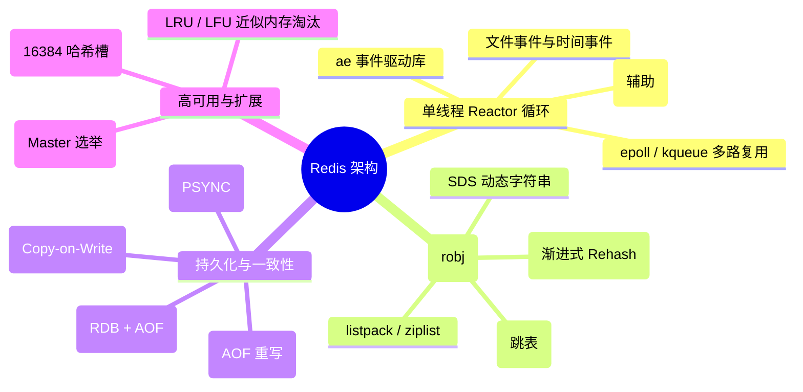
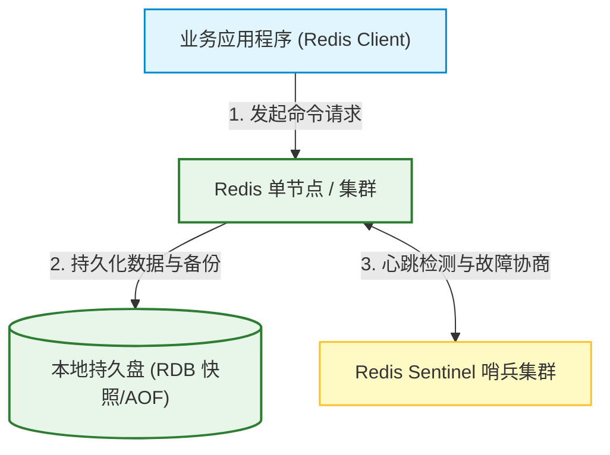
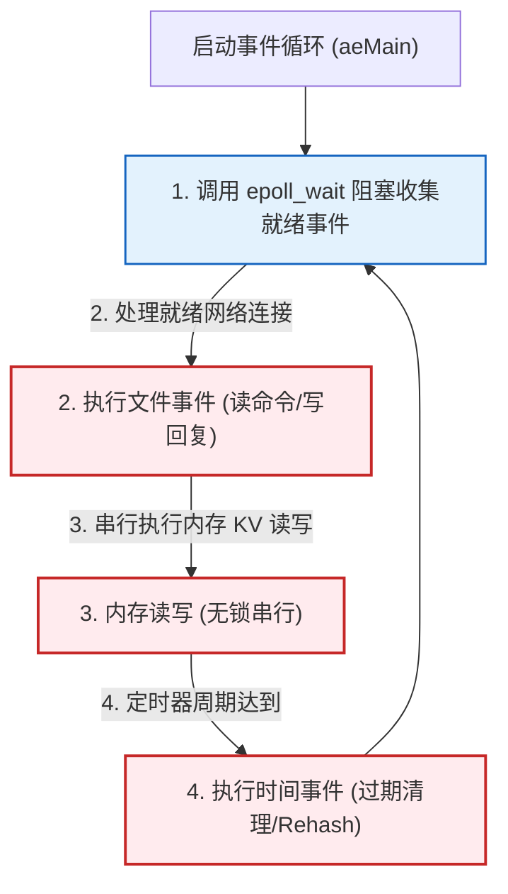
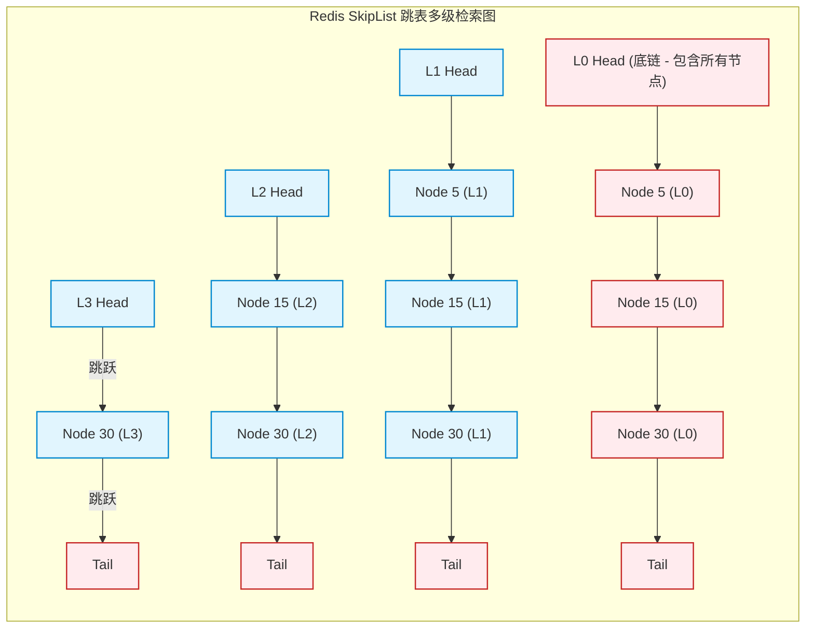

import CaseStudyHeader from '@site/src/components/CaseStudyHeader';
import DesignIntent from '@site/src/components/DesignIntent';
import EvolutionTimeline from '@site/src/components/EvolutionTimeline';
import CompareSlider from '@site/src/components/CompareSlider';
import TradeoffExplorer from '@site/src/components/TradeoffExplorer';
import GlossaryTerm from '@site/src/components/GlossaryTerm';
import ResearchNote from '@site/src/components/ResearchNote';
import GuidedExercise from '@site/src/components/GuidedExercise';
import QuizCard from '@site/src/components/QuizCard';
import MindMap from '@site/src/components/MindMap';
import PyRunner from '@site/src/components/PyRunner';

# Redis：内存键值数据库、单线程 Reactor 事件循环与渐进式 Rehash 架构

<CaseStudyHeader
  oneLiner="Redis 是全球最流行的开源内存数据结构存储系统。它凭借极简的单线程 Reactor 事件循环设计，消除了多线程上下文切换与锁竞争瓶颈，实现微秒级的超低延迟响应。底层数据结构经过极其严苛的内存编码优化（如 ziplist/listpack、跳表、SDS），并通过渐进式 Rehash 和 Copy-on-Write 异步持久化，在保障内存高利用率的同时实现了系统级的稳定运行。"
  stats={[
    {label: '定位与类别', value: '高性能内存数据结构存储 (KV 缓存)'},
    {label: '并发事件模型', value: '单线程 Reactor 事件循环 (基于 epoll/kqueue)'},
    {label: '核心数据结构', value: 'SDS, dict, zskiplist, listpack, quicklist'},
    {label: '平滑扩容算法', value: '渐进式 Rehash (双哈希表增量迁移)'},
    {label: '持久化机制', value: 'RDB (写时复制快照) + AOF (增量追加日志)'},
    {label: '分布式高可用', value: 'Redis Sentinel (哨兵集群) / Redis Cluster'}
  ]}
/>

:::info 对应课程概念
本案例融合了以下课程核心概念：
*   **单线程事件循环（Month 1/3 并发）**：单线程 Reactor 模式与 I/O 多路复用（epoll）在处理海量并发连接中的低开销实践。
*   **内存分配与编码优化（Month 3 数据引擎）**：Redis 针对内存紧凑性的变长编码设计（SDS, ziplist/listpack）与内存碎片抑制。
*   **平滑哈希扩容（Month 3 哈希表）**：分摊昂贵扩容开销的渐进式 Rehash 状态机逻辑。
*   **副本复制与高可用（Month 5 共识）**：Sentinel 集群类似 Raft 共识的 Master 选举，以及 Cluster 插槽的分片寻址。
:::

---

## 1. 设计初衷：单线程与物理光速的时延抗争

在 Redis 诞生前，主流的内存缓存（如 Memcached）多采用多线程加锁模式：
1.  **多线程的锁死漩涡**：
    *   多线程虽能充分利用多核 CPU，但引入了极高的上下文切换（Context Switch）开销和无处不在的锁竞争（Lock Contention）。
    *   随着 QPS 攀升，多线程系统将大量算力浪费在等待互斥锁（Mutex Latch）和脏缓存失效上，这反而拖慢了对延迟要求极其严苛（通常在几百微秒内）的缓存查询速度。
2.  **“单线程 + 多路复用”的黄金组合**：
    *   Redis 的作者 antirez 决定另辟蹊径：如果将所有数据操作完全限制在**单个主线程**中执行，那么系统就彻底不需要申请任何锁，也没有多线程切换的物理噪音，内存数据操作完全是纯净的内存指针指针移动。
    *   网络接入侧则配合非阻塞的 <GlossaryTerm term="I/O 多路复用" definition="I/O 多路复用是指通过操作系统内核提供的 select/poll/epoll/kqueue 等接口，用单线程/单进程同时监听成百上千个网络套接字（Socket）的就绪事件，从而实现高并发的网络接入。">I/O 多路复用（epoll/kqueue）</GlossaryTerm> 技术，单线程在网络就绪事件间闪转腾挪，实现了十万级别的极高并发吞吐。
3.  **零浪费的极致内存设计**：
    *   为了在昂贵的内存空间中塞入更多键值，Redis 绝不使用通用的高级数据结构。它为简单的 String 类型设计了能 O(1) 获取长度且防止溢出的 SDS；为小元素量的 Hash/List 设计了完全物理紧凑、无指针碎片开销的 ziplist/listpack，把内存压榨到了极致。

<DesignIntent
  problem="如何设计一个能够提供微秒级响应延迟、支持十万级并发吞吐，且数据类型极其丰富（支持 String、List、Hash、Set、ZSet）的高性能内存键值存储引擎。"
  users="全球范围需要处理超高频访问、低时延缓存（如登录会话、实时计数器、排行榜、消息发布订阅）的后端软件架构师。"
  devices="运行在配备海量高速 RAM 内存的 Linux 物理机或云原生容器上，客户端通过 TCP 基于极其轻量高效的 RESP 协议进行读写交互。"
  goals={[
    '极致超低延迟：在单核 CPU 上提供每秒 10 万次以上的读写处理，延迟控制在微秒级',
    '丰富的数据结构编码：原生支持多种复杂数据类型，且每种类型根据元素数量自动在紧凑编码和快速查找结构间无感切换',
    '无阻塞平滑扩容：哈希表在膨胀时采用渐进式 Rehash 机制，分摊迁移耗时，杜绝由于大表扩容导致单线程瞬时卡死',
    '安全高可用容灾：支持 Sentinel 哨兵实现主从秒级自动切换，以及 Cluster 水平分片插槽（Slots）'
  ]}
  constraints={[
    '单线程阻塞风险：任何 O(N) 的重度命令（如 KEYS *、HGETALL、FLUSHALL）都会霸占单线程主循环，导致后续的所有网络请求排队雪崩，因而限制了操作的复杂度',
    '内存容量限制：因为数据全物理驻留内存，总存储容量受物理内存大小制约，必须配以严格的内存淘汰（Eviction）机制以防 OOM',
    '写时复制内存双倍开销：在生成 RDB 磁盘快照时，若父进程有海量写入，操作系统写时复制（COW）会导致内存使用瞬间翻倍，面临物理溢出风险'
  ]}
  firstStep="编写基于 C 语言 epoll 绑定的核心 ae 事件循环（Reactor 模式）；设计 SDS 动态字符串与 dict 哈希结构；实现 RDB fork 备份与渐进式 rehash 状态机；建立哨兵集群心跳检测。"
/>

---

## 2. 知识全景脑图

### 2a. 全景架构思维导图



### 2b. 交互脑图导航

<MindMap
  root={{
    label: 'Redis 核心架构',
    children: [
      {
        label: '事件循环与网络 (Network)',
        children: [
          { label: 'ae.c 事件循环处理器' },
          { label: 'epoll 非阻塞多路复用' },
          { label: 'Redis 6.0 辅助 I/O 线程' }
        ]
      },
      {
        label: '内存数据组织 (Memory)',
        children: [
          { label: 'robj 对象外壳' },
          { label: 'SDS 与紧凑编码 listpack' },
          { label: 'dict 渐进式 Rehash' },
          { label: 'zskiplist 高效跳表' }
        ]
      },
      {
        label: '持久化与分布式 (Scale)',
        children: [
          { label: 'RDB 写时复制 (COW) 机制' },
          { label: 'AOF 顺序追加与重写' },
          { label: 'Sentinel 哨兵故障主从切换' },
          { label: 'Cluster 16384 哈希槽分片' }
        ]
      }
    ]
  }}
/>

---

## 3. 系统架构总览 (C4 Model)

### 3a. System Context (系统上下文图)



### 3b. Container Diagram (容器结构图)

```mermaid
graph TB
  classDef client fill:#e1f5fe,stroke:#0288d1,stroke-width:2px;
  classDef loop fill:#ffebee,stroke:#c62828,stroke-width:1.5px;
  classDef thread fill:#e8f5e9,stroke:#2e7d32,stroke-width:1.5px;
  classDef storage fill:#fff9c4,stroke:#fbc02d,stroke-width:1.5px;

  Client["Redis 客户端 (SDK)"]:::client -->|TCP Connection| NetworkSocket["网络套接字 (Socket)"]:::thread

  subgraph RedisServerInstance [Redis 进程内部架构]
    NetworkSocket <-->|多路复用监听| IOThreads["I/O 线程池 (Redis 6.0 引入/并行读写网络缓冲)"]:::thread
    
    subgraph MainThread [Redis 主线程 (单线程核心)]
      AE_Loop["ae 事件循环 (aeMain)"]:::loop <-->|epoll_wait| NetworkSocket
      AE_Loop -->|1. 分发文件事件| CommandExecutor["命令执行器 (命令解析与操作)"]:::loop
      
      CommandExecutor <-->|2. 读写操作| MemoryDB[("内存键值数据库 (SDS/Dict/Skiplist)")]:::storage
      AE_Loop -->|3. 执行定时器事件| ActiveExpire["定期过期清理 / 渐进式 Rehash"]:::loop
    end
    
    CommandExecutor -->|4. 异步刷写/后台清理任务| BioThreads["BIO 后台线程池 (bio_close_file, bio_aof_fsync)"]:::thread
    CommandExecutor -->|5. 触发物理备份| ForkChild["rdbSaveBackground 子进程 (Fork)"]:::thread
  end

  ForkChild -->|Copy-on-Write 物理转储| RDBFile[("Disk RDB File")]:::storage
  BioThreads -->|fsync 磁盘同步| AOFFile[("Disk AOF File")]:::storage
```

---

## 4. 核心机制拆解

### 4a. 单线程 Reactor 事件循环与多路复用

Redis 的性能神话完全建立在基于非阻塞 I/O 的 Reactor 模式之上：
1.  **事件驱动模型**：Redis 使用自研的 `ae.c` 事件驱动库，将所有的网络连接套接字（Socket）转化为事件。
2.  **文件与时间事件**：
    *   **文件事件（File Event）**：负责监听 Socket 上的读写请求（如客户端发来的命令、主从同步）。它使用操作系统的 `epoll`（Linux）、`kqueue`（macOS/BSD）等 I/O 多路复用技术，用单线程同时监视海量连接。
    *   **时间事件（Time Event）**：负责监听周期性的后台任务（如清理过期 Key、渐进式 Rehash 步进、自适应内存淘汰）。
3.  **单线程顺序执行**：主事件循环（`aeMain`）是一个无休止的 loop，它调用 `epoll_wait` 收集就绪套接字，然后**排队并串行执行**命令。因为主线程没有任何上下文切换和锁申请开销，每个内存操作又快至纳秒级，使得整体吞吐极为惊人。



---

### 4b. 渐进式 Rehash 机制与双哈希表结构

当 Redis 内部的字典（`dict`）元素过多、负载因子（Load Factor）过高时，必须进行扩容。为了防止单线程在迁移海量 Key 时造成数据库瞬间卡死，Redis 独创了 <GlossaryTerm term="渐进式 Rehash" definition="渐进式 Rehash 是 Redis 字典在扩容时使用的一种平滑迁移算法。它在内部维护两个哈希表，通过在每次读写命令中顺带迁移一个桶的数据，以及在后台定时器中分批迁移，将巨大的扩容开销分摊到平时的请求中，从而避免了单线程卡死。">渐进式 Rehash</GlossaryTerm>：
1.  **双哈希表结构**：每个 dict 拥有两个哈希表：`ht[0]`（正常存储数据）和 `ht[1]`（扩容后的新哈希表，大小为 `ht[0]` 的两倍）。
2.  **增量步进迁移**：
    *   在扩容期间，`rehashidx` 设为 0，代表从 `ht[0]` 的第 0 个桶（bucket）开始迁移。
    *   当客户端向 Redis 发送任何 `SET`、`GET`、`DEL` 命令时，主线程在执行完该命令之余，会**顺带将 `ht[0]` 中第 `rehashidx` 桶上的所有链表节点迁移至 `ht[1]`**，然后将 `rehashidx` 自增 1。
    *   在没有请求的空闲期间，时间事件处理程序也会定期迁移几百个桶的数据。
3.  **完全透明寻址**：在 Rehash 过程中，查询命令会同时搜索 `ht[0]` 和 `ht[1]`；新插入的值则一律直接写入 `ht[1]`。当 `ht[0]` 全部清空后，`ht[0]` 的指针指向 `ht[1]`，`ht[1]` 清空并重置 `rehashidx = -1`，扩容平滑结束。

```mermaid
graph TD
  subgraph ProgressiveRehashState [dict 渐进式 Rehash 双表内存图 (rehashidx = 2)]
    rehashidx["rehashidx = 2<br/>(指向 ht[0] 待迁移的 Bucket)"]
    
    subgraph ht0 [ht[0] (老小哈希表)]
      B0_ht0["Bucket 0: (已被迁空)"]
      B1_ht0["Bucket 1: (已被迁空)"]
      B2_ht0["Bucket 2: [KeyA -> ValA] -> [KeyB -> ValB] (等待本次命令触发迁移)"]
      B3_ht0["Bucket 3: [KeyC -> ValC]"]
    end
    
    subgraph ht1 [ht[1] (新大哈希表 - 正在接收 Key)]
      B0_ht1["Bucket 0: (KeyX -> ValX)"]
      B1_ht1["Bucket 1: (KeyY -> ValY)"]
      B2_ht1["Bucket 2: (空)"]
      B3_ht1["Bucket 3: (空)"]
      B4_ht1["Bucket 4: (空)"]
    end
  end

  rehashidx --> B2_ht0
```

---

### 4c. RDB 写时复制 (Copy-on-Write) 与 AOF 持久化

内存数据库一旦断电，数据将灰飞烟灭。Redis 提供了两种相辅相成的持久化机制：
1.  **RDB (Redis Database) 异步快照**：
    *   Redis 通过 `fork()` 系统调用派生出一个子进程。
    *   子进程在派生的那一刻，获得了父进程的内存地址映射，它开始扫描内存并顺序写入磁盘 `RDB` 二进制文件。
    *   为了防止在快照期间阻塞父进程的写入，系统采用操作系统的 <GlossaryTerm term="写时复制" definition="写时复制 (Copy-on-Write / COW) 是一种操作系统层面的物理内存管理机制。在 fork() 子进程后，父子进程共享相同的物理内存页。只有在父进程尝试修改某页数据时，内核才会把该页物理拷贝一份给父进程，从而实现了在不阻塞父进程写入的前提下，让子进程安全读取静态内存快照。">写时复制 (Copy-on-Write, COW)</GlossaryTerm> 技术：当父进程修改某个内存 Page 时，操作系统会复制该 Page 的物理副本，父进程只在副本上写入，子进程依然读取 `fork()` 瞬间的原始共享物理内存，实现了完全无锁、无干扰的后台备份。
2.  **AOF (Append Only File) 增量追加**：
    *   每次执行写命令时，Redis 将命令以 RESP 协议格式追加写入本地 AOF 缓冲区。
    *   随后根据刷盘策略（如 `everysec`：每秒调用一次 `fsync` 刷盘），由后台线程（BIO Thread）异步同步到磁盘。
    *   当 AOF 文件过大时，系统触发 `AOF Rewrite`（AOF 重写），通过读取当前内存中的键值直接在后台生成一份极简的替换指令集，压缩磁盘占用。

```mermaid
graph TD
  classDef process fill:#ffebee,stroke:#c62828,stroke-width:2px;
  classDef mem fill:#e8f5e9,stroke:#2e7d32,stroke-width:1.5px;
  classDef disk fill:#fff9c4,stroke:#fbc02d,stroke-width:1.5px;

  Parent["Redis 主进程 (Master Process)"]:::process -->|1. fork() 子进程| Child["RDB 备份子进程"]:::process
  
  Parent <-->|2. 共享只读物理内存页 (Page 100)| Memory[("物理内存 RAM")]:::mem
  Child -->|3. 读取并扫描内存 Page 100| Memory
  
  Parent -->|4. 尝试修改 Page 100 (发生写操作)| OS_COW["操作系统内核 COW 拦截"]:::process
  OS_COW -->|5. 拷贝 Page 100 -> Page 100_Copy| Memory
  OS_COW -->|6. 主进程在 Page 100_Copy 上执行写入| Parent
  
  Child -->|7. 持续写入静态数据| DiskRDB[("Disk RDB File")]:::disk
```

---

### 4d. Redis Sentinel 哨兵故障转移与 Cluster 哈希槽分片

在企业级高可用场景中，Redis 摆脱了单点故障的掣肘：
1.  **哨兵集群 (Redis Sentinel)**：
    *   哨兵是不保存数据的独立 Redis 实例，它们组成一个小型的分布式决策集群。
    *   每个哨兵周期性向 Master 发送 `PING` 心跳包。如果 Master 挂掉，哨兵通过类似 Raft 的多数派选举（Quorum）达成共识，自动在 Replica 从节点中选出一个升级为新 Master，并利用 `Pub/Sub` 广播通知所有客户端，实现秒级无感 failover。
2.  **集群切片 (Redis Cluster)**：
    *   为了突破单机物理内存容量上限，Redis Cluster 将整个键空间划分为固定数量的 **16384** 个 <GlossaryTerm term="哈希槽" definition="哈希槽 (Hash Slot) 是 Redis Cluster 进行分布式水平分片的物理逻辑单元。集群固定划分了 16384 个哈希槽，所有 Key 通过 CRC16 算法哈希后对 16384 取模，映射到具体的槽位上，各 Redis 节点各自负责一部分槽位以实现水平伸缩。">哈希槽 (Hash Slots)</GlossaryTerm>。
    *   每个 Key 插入时，系统计算其哈希值：`slot = CRC16(key) % 16384`。
    *   不同的 Redis Master 物理节点各自承载一部分槽位（例如：节点 A 承载 0-5000，节点 B 承载 5001-10000）。当客户端连接任意节点查询时，若该 Key 不在当前节点所辖槽位中，节点会向客户端返回一个 `MOVED` 重定向响应，指示客户端重新路由到正确物理机房，实现了高弹性的水平伸缩。

```mermaid
graph TD
  classDef client fill:#e1f5fe,stroke:#0288d1,stroke-width:1.5px;
  classDef node fill:#ffebee,stroke:#c62828,stroke-width:2px;

  Client["Redis 客户端 (SDK)"]:::client -->|1. 查询 key='user:100'| NodeA["Redis Master 节点 A<br/>负责槽位: 0 - 5460"]:::node
  
  NodeA -->|2. 计算 slot = CRC16('user:100') % 16384 = 8000| SlotCheck{"槽位 8000 在本节点么?"}
  
  SlotCheck -->|No| Redirect["3. 返回 MOVED 8000 Node-B (重定向)"]
  Redirect --> Client
  
  Client -->|4. 重新路由请求| NodeB["Redis Master 节点 B<br/>负责槽位: 5461 - 10922"]:::node
  NodeB -->|5. 返回结果数据| Client
```

<ResearchNote
  title="Redis Cluster Specification"
  source="Salvatore Sanfilippo (antirez), Redis Official Specifications"
  href="https://redis.io/docs/reference/cluster-spec/"
  insight="Redis Cluster 的官方设计文档阐述了如何在无全局单点元数据服务器的前提下，构建一个去中心化、能在线扩缩容、且在分区故障下仍具备多数派容错能力的 Shared-Nothing 内存集群体系。该规范证明了『基于哈希槽的逻辑分片配合客户端重定向』可以实现极高的单点性能与可伸缩性结合。"
  application="架构启示：**客户端侧智能路由可减少服务端网关抖动**。在 Month 3 缓存架构与 Month 5 大并发平台中，如果面临海量分布式缓存分片，与其在服务层挂一层会吃掉几毫秒网络延迟的反向代理（如 Twemproxy），不如像 Redis Cluster 一样，将路由规则推给客户端 SDK 缓存，通过重定向学习拓扑，获得无损的超低网络延迟。"
/>

---

## 5. 关键数据结构与算法

### 5a. 简单动态字符串 (SDS) 内存紧凑结构

Redis 放弃了 C 语言传统的以 `\0` 结尾的 char 数组，自研了 SDS (Simple Dynamic String) 数据结构：
*   **结构定义**：SDS 包含 `len`（当前已使用字节长度）、`alloc`（已分配的总内存长度，不含头部和 `\0`）、`flags`（SDS 的类型标记，用以区分不同大小的头部以压榨空间）、以及字符数组 `buf[]`。
*   **三大优势**：
    1.  **O(1) 获取长度**：直接读取 `len` 字段，省去了传统 C 字符串 `strlen` 遍历整条长串的时间损耗。
    2.  **杜绝缓冲区溢出**：在进行字符串追加（Append）时，SDS 会自动检测 `alloc` 剩余空间是否足够，若不足则先自动扩容，再拷贝数据。
    3.  **二进制安全**：由于 SDS 使用 `len` 判断边界，不依赖 `\0` 标记字符结尾，因而可以在 `buf[]` 内部安全地存放二进制图像文件、加密音频流等任意字符。

---

### 5b. 跳表 (SkipList) 结构与随机层高算法

在 Redis 的有序集合（Sorted Set / ZSet）中，当元素较多时，底层会选用跳表（zskiplist）和哈希表联动的结构来提供 O(log N) 的检索与范围扫描能力。
跳表是在链表的基础上，在每个节点随机建立多级索引节点来实现快速跳跃检索：
*   **层高随机算法**：Redis 的跳表节点最大支持 32 层。当插入一个新节点时，系统通过抛硬币概率公式动态决定该节点的层高：
    ```c
    int zslRandomLevel(void) {
        int level = 1;
        while ((random() & 0xFFFF) < (0.25 * 0xFFFF))
            level += 1;
        return (level < 32) ? level : 32;
    }
    ```
    即每次有 25% 的概率使层高加 1，使得高层节点的数量呈几何级级数递减，保证了平均检索复杂度在 $O(\log N)$ 的同时，避免了 AVL 树或红黑树繁琐的旋转重平衡操作。



---

### 5c. 内存淘汰算法 LFU 与 LRU 的近似时钟实现

如果数据写满内存，Redis 就会面临 OOM 崩溃。为了实现平滑的缓存淘汰，Redis 在底层对象外壳（`robj`）中划出了 24 个 bits 空间用来存储最近使用时间戳（LRU）或访问计数（LFU）：
1.  **近似 LRU (Least Recently Used)**：
    *   标准的 LRU 需要维护双向链表，在每次读写时调整链表节点到头部，这对于内存受限的 Redis 会产生高昂的 CPU 和额外指针开销。
    *   Redis 采用**近似采样算法**：当需要淘汰内存时，随机抽取 $N$ 个 Key（例如默认 5 个），比对它们在 24bit 时钟上的差值，挑出其中最久未被访问的那个 Key 予以物理剔除。在 $N=10$ 时，其淘汰效果几乎 99% 等同于标准 LRU。
2.  **近似 LFU (Least Frequently Used)**：
    *   24bits 空间拆分为：16位用于记录最后一次访问的时间（`ldt`），8位用于记录对数式的访问计数器（`counter`）。
    *   每次 Key 被访问时，8位计数器按对数递增公式累加（越往上加越困难，最大 255），并根据自上次访问以来的空闲时间衰减计数，实现了在极小内存开销下，对高频访问热点 Key 的精准识别与保护。

---

## 6. 架构演进史

Redis 从一个简单的单机 KV 内存数据库，演化为支撑全球大规模高并发集群的底层地基：

<EvolutionTimeline
  events={[
    {
      year: '2009',
      title: 'Redis 诞生与极简单机时代',
      why: 'antirez 在开发实时日志分析系统 LLOOGG 时，发现传统的 SQL 数据库写入延迟完全无法承受高并发实时插入，需要一款专有的超低时延内存 KV 系统。',
      change: '提出基于 Reactor 的单线程事件循环 ae.c 引擎；实现 SDS、dict 和基本 RDB/AOF 磁盘追加逻辑。'
    },
    {
      year: '2012-2015',
      title: '高可用分布式突破 (Sentinel & Cluster)',
      why: '企业用户大规模将 Redis 作为核心业务数据库而非普通临时缓存，单点宕机影响面巨大，且单机物理内存无法无限扩展。',
      change: '推出哨兵服务（Sentinel）实现主从心跳协商与秒级 Failover；发布 Cluster 集群实现 16384 哈希槽分片，实现真正的水平扩展。'
    },
    {
      year: '2020',
      title: 'Redis 6.0 辅助 I/O 线程池上线',
      why: '虽然单线程执行内存命令极快，但在万兆网卡普及的背景下，单线程对网络套接字（Socket）数据读取与协议解析的吞吐速率成为了新的物理天花板。',
      change: '引入多路辅助 I/O 线程池，在分发阶段并行并行解析网络协议和读写 Buffer，但核心命令的实际内存操作依然在主线程串行串行执行，既释放了网络多核性能，又保留了单线程的无锁安全性。'
    },
    {
      year: '2024 至今',
      title: '协议变更与社区 Valkey 崛起分水岭',
      why: 'Redis 官方突然宣布从 BSD 宽松开源协议转向非自由的 RSALv2 双授权许可，引发开源社区的强烈抵制。',
      change: 'Linux 基金会联手各大巨头拉取分支，推出 100% 宽松开源的 Valkey 分支，全力演进更轻量、更高伸缩性的内存结构存储体系。'
    }
  ]}
/>

---

## 7. 架构对比：传统多线程 Memcached 缓存 vs. Redis 单线程 Reactor 数据结构存储

<CompareSlider
  before={
    <div style={{ padding: '20px', background: '#ffebee', border: '1px solid #c62828', borderRadius: '8px', height: '100%', color: '#333' }}>
      <strong>Memcached 多线程内存缓存</strong>
      <p style={{ marginTop: '10px', fontSize: '0.9rem' }}>采用典型的多线程模型（如基于 libevent 的监听线程分发机制）。数据类型仅支持简单的 String 类型；修改操作必须申请段级或行级锁以防并发读写冲突。优点是能完全榨干多核 CPU；缺点是缺乏复杂数据类型，高并发下加锁开销大，且没有原生的持久化和分片方案。</p>
    </div>
  }
  after={
    <div style={{ padding: '20px', background: '#e8f5e9', border: '1px solid #2e7d32', borderRadius: '8px', height: '100%', color: '#333' }}>
      <strong>Redis 单线程 Reactor 事件循环</strong>
      <p style={{ marginTop: '10px', fontSize: '0.9rem' }}>核心命令执行完全限制在单线程内运行，配合非阻塞 epoll 多路复用。原生支持 SDS、双向链表、跳表等多种复杂结构，无锁竞争开销，时延极其平稳；并在后台配备多路 IO 线程和 Bio 线程池处理网络读写和异步刷盘，兼顾了高并发与丰富的功能特性。</p>
    </div>
  }
  labels={['Memcached 多线程', 'Redis 单线程 Reactor']}
/>

---

## 8. 设计模式与课程映射

本案例在实际工业界的高性能内存底座中，深度应用了以下课程章节中的核心设计模式与技术：

1.  **单线程 Reactor 事件驱动模型**（参见 [编程系统基石](../01-foundations/programming-systems-primer.mdx) 章节）：
    *   Redis 极简的 `ae` 事件循环即是 Reactor 模式的教科书级实践。它通过非阻塞多路复用，将所有的套接字网络事件序列化到单一主线程排队执行，完美避开了多线程加锁争抢的死结。
2.  **分布式一致性选举与 Sentinel**（参见 [共识与协调](../05-core-components/consensus-coordination.mdx) 章节）：
    *   当 Master 实例离线时，Sentinel 集群内部运行着基于 Raft 共识思想的选举机制。各个 Sentinel 通过协商并投出赞成票，当赞成票数超过 Quorum 阈值后决出领头哨兵去执行 Master 升级，体现了分布式共识的典型用法。
3.  **内存池与紧凑变长编码**（参见 [存储引擎与持久化](../03-data-cache-queue/storage-engines.mdx) 章节）：
    *   为了在内存成本与速度间获得取舍，Redis 设计了 SDS 及变长密排的 `listpack`。这种做法与传统数据库存储引擎中设计 Slotted Page 槽页类似，皆是用精心设计的紧密二进制布局换取零指针引用的物理开销。
4.  **悲观退避与乐观锁重试**（参见 [事务与隔离级别](../03-data-cache-queue/transactions-isolation.mdx) 章节）：
    *   在 Redis 的事务模块（`MULTI` / `EXEC`）中，系统不提供行锁隔离，而是通过 `WATCH` 命令监控某个 Key 的版本标识。这本质上是乐观锁（OCC）设计，当检测到版本变更时事务直接执行失败返回，极大地保护了单线程的处理吞吐。

---

## 9. 权衡：内存数据库系统中的架构妥协

Redis 在延迟、并发度以及系统复杂度之间做出了取舍：

<TradeoffExplorer
  title="Redis 单线程、内存与高并发架构权衡"
  dimensions={['微秒级响应延迟控制', '多核物理 CPU 算力利用率', '复杂数据类型与原语支持', '持久化物理 IO 抖动规避', '百 GB 级高内存硬件采购成本']}
  options={[
    {
      name: '单线程 Reactor 命令执行 + 内存紧凑编码 (Redis 标准)',
      scores: [5, 2, 5, 3, 1],
      note: '通过将所有内存写操作限死在单线程内，Redis 获得了业内最顶级的微秒级平稳时延，且无任何锁竞争开销，能高效支持各种复杂数据结构。代价是无法直接利用多核 CPU 算力（需多实例部署），重度阻塞命令会直接拉垮整个服务，且内存硬件价格极其昂贵。',
      whenToUse: '读写时延极其敏感、数据访问高并发且多异构类型、需要实时计算（如排行榜、滑动时间窗口限流）的实时性底座。'
    },
    {
      name: '多线程简单 KV 缓存 (如 Memcached 架构)',
      scores: [4, 5, 2, 5, 2],
      note: '网络与内存执行完全采用多线程模型，能瞬间跑满物理服务器的所有 CPU 核心。但不支持复杂的 List、Hash 等内置计算，在遇到写多读少时由于行锁/分段锁的并发争夺，其延迟抖动明显大过 Redis，且无原生的磁盘持久盘同步。',
      whenToUse: '数据极其单一（仅纯文本/数值 Key-Value）、以读为主且无复杂计算逻辑、追求单机网卡吞吐极限的分布式纯缓存场景。'
    },
    {
      name: '混合持久化外存延伸 (如 SSD 扩展 Redis / RocksDB-based KV)',
      scores: [2, 4, 4, 1, 5],
      note: '将冷数据刷盘，仅在内存中缓存热 Key，使得单个实例能支撑数 TB 级别的持久存储，硬件成本大跌。但代价是检索冷数据时需要从 SSD 中加载，这直接将原有的微秒级响应拉垮退化到了毫秒级，且存在后台 Compaction 带来的严重磁盘 I/O 抖动。',
      whenToUse: '数据量达 TB 级别、硬件预算有限、但业务上可以容忍偶发毫秒级时延波动的持久型 KV 存储场景。'
    }
  ]}
/>

---

## 10. 如果是你来设计：字典渐进式 Rehash 状态机模拟器

### 场景设想
在 Redis 系统的哈希表（dict）中，当元素量增多、需要扩容时：
*   如果执行一次性的暴力全量 Rehash，单线程将会被强行霸占几秒钟用来重新哈希和复制内存，这期间所有的网络请求都会阻塞排队引发故障。
*   因此，Redis 引入了渐进式 Rehash：
    *   在内部维护两个哈希表 `ht[0]`（老表）和 `ht[1]`（新表）。
    *   扩容开始时，设置 `rehashidx = 0`。
    *   当发生 `insert` 或 `get` 等业务命令时，控制器会顺带调用 `rehash_step()`，仅迁移 `ht[0]` 的第 `rehashidx` 槽位上的节点链表到 `ht[1]` 中，然后将 `rehashidx` 自增。
    *   如果遇到了连续的空槽，算法会智能跳过并寻找下一个有数据的桶。
    *   当所有数据转移完毕后，回收 `ht[0]` 并重置状态。

请你用 Python 实现这个经典的渐进式 Rehash 状态机模型。

<GuidedExercise
  title="基于 Python 的 Redis 字典渐进式 Rehash 仿真"
  goal="实现包含双哈希表结构、rehashidx 步进标记、以及命令执行顺带触发单槽位迁移的平滑扩容算法。"
  steps={[
    '步骤 1: 设计 RedisDict 类。其内部包含 `ht[0]` 和 `ht[1]` 两个 list (代表哈希桶数组)，以及 `rehashidx = -1` 指针。',
    '步骤 2: 实现 `rehash_step()`。从 `rehashidx` 开始在 `ht[0]` 寻找下一个非空槽位，将该槽位中的所有节点重新计算哈希值（以新表大小为掩码）后移至 `ht[1]`，随后 `rehashidx` 自增。',
    '步骤 3: 编写带有 Rehash 拦截的 `insert(key, value)` 和 `get(key)` 方法。如果 `rehashidx != -1`，每次操作前必须触发一次 `rehash_step()`；`insert` 时只写新表 `ht[1]`；`get` 时双表查找。',
    '步骤 4: 运行模拟。当插入大量键触发 Rehash 后，观察随着每一次的 `insert`，老表中的键是如何被一步步“润物细无声”地分摊迁往新表，直到最后完全无感过渡的。'
  ]}
  checks={[
    '确认在 Rehash 开始后，新插入的数据直接进入新表 ht[1] 且不在 ht[0] 停留',
    '验证每次命令执行只会导致 rehashidx 自增一步或数步，杜绝了单次请求阻塞全量迁移的风险',
    '确认当输出“验证通过，渐进式 Rehash 成功过渡！”字样时，模拟器工作正常'
  ]}
/>

#### 交互式 Python 运行实验
在下方控制台中直接运行或修改已准备好的 Redis 字典 Rehash 仿真代码：

<PyRunner
  expect="渐进式 Rehash 成功过渡"
  rows={24}
  code={`import time

class RedisDict:
    def __init__(self, size=4):
        # Redis 哈希表数组，ht[0] 是默认工作表，ht[1] 在 rehash 时启用
        self.ht = [ [[] for _ in range(size)], None ]
        self.size = [size, 0]
        self.rehashidx = -1  # -1 代表未处于 rehash 状态

    def _hash(self, key, table_idx):
        # 极简的哈希取模算法
        return hash(key) % self.size[table_idx]

    def is_rehashing(self):
        return self.rehashidx != -1

    def start_rehash(self):
        new_size = self.size[0] * 2  # 新表大小为老表两倍
        self.ht[1] = [[] for _ in range(new_size)]
        self.size[1] = new_size
        self.rehashidx = 0
        print(f"   [!] 系统提示: 触发哈希表扩容！ht[1] 已就绪 (大小={new_size}), 开启渐进式 Rehash")

    def rehash_step(self):
        if not self.is_rehashing():
            return

        # 寻找 ht[0] 中第一个非空的 Bucket
        # Redis 每次执行命令默认只迁移 1 个有数据的槽位
        while self.rehashidx < self.size[0] and len(self.ht[0][self.rehashidx]) == 0:
            self.rehashidx += 1

        # 如果发现 rehashidx 已经越过 ht[0] 边界，代表数据已经全部迁完
        if self.rehashidx >= self.size[0]:
            # 交换双表：ht[0] 指向新大表，ht[1] 设为空，关闭 rehashidx
            self.ht[0] = self.ht[1]
            self.size[0] = self.size[1]
            self.ht[1] = None
            self.size[1] = 0
            self.rehashidx = -1
            print("   [!] 系统提示: ht[0] 老数据迁移完毕！双表成功对调，Rehash 结束。")
            return

        # 迁移当前 Bucket (链表中的所有节点)
        bucket = self.ht[0][self.rehashidx]
        print(f"   [Rehash 步进]: 正在将 ht[0] 槽位 #{self.rehashidx} 的数据 {bucket} 迁往 ht[1]...")
        
        while len(bucket) > 0:
            key, val = bucket.pop(0)
            new_idx = self._hash(key, 1)  # 根据新表大小计算哈希槽位
            self.ht[1][new_idx].append((key, val))

        # 完成本槽位迁移后，rehashidx 步进 1
        self.rehashidx += 1

    def insert(self, key, value):
        # 1. 如果正在进行 Rehash，顺带帮手迁移一步 (分摊开销)
        if self.is_rehashing():
            self.rehash_step()

        # 2. 插入逻辑
        # 如果正在进行 Rehash，为了防止二次重复，新值直接写新表 ht[1]
        target_table = 1 if self.is_rehashing() else 0
        idx = self._hash(key, target_table)
        
        # 检查是否重复并覆盖
        for i, (k, v) in enumerate(self.ht[target_table][idx]):
            if k == key:
                self.ht[target_table][idx][i] = (key, value)
                return
        self.ht[target_table][idx].append((key, value))

        # 3. 检查扩容条件
        # 若负载因子达到 1.0 (元素个数/槽位数 >= 1.0) 且未进行 Rehash，则触发 Rehash
        total_elements = sum(len(b) for b in self.ht[0])
        if not self.is_rehashing() and (total_elements / self.size[0]) >= 1.0:
            self.start_rehash()

    def get(self, key):
        if self.is_rehashing():
            self.rehash_step()

        # 双表查询逻辑
        # 1. 查 ht[0]
        idx0 = self._hash(key, 0)
        for k, v in self.ht[0][idx0]:
            if k == key:
                return v
        
        # 2. 如果处于 Rehash 状态，还要查 ht[1]
        if self.is_rehashing():
            idx1 = self._hash(key, 1)
            for k, v in self.ht[1][idx1]:
                if k == key:
                    return v
        return None

# 测试开始
d = RedisDict(size=4)

print("--- 步骤 1: 连续插入 4 个键 (触发 LoadFactor >= 1.0 临界点) ---")
d.insert("user1", "Alex")
d.insert("user2", "Bob")
d.insert("user3", "Charlie")
d.insert("user4", "David")  # 此时第 4 个插入，触发扩容，开启 Rehash

print(f"当前 ht[0]: {d.ht[0]}")
print(f"当前 ht[1]: {d.ht[1]}")

print("\\n--- 步骤 2: 触发读取或写入命令，观察渐进式 Rehash 步进分批迁移 ---")
# 每次 get 或 insert 会在内部将 rehashidx 推进至有数据的 Bucket 并搬运
print(f"-> 查找 user1: {d.get('user1')}")
print(f"-> 查找 user2: {d.get('user2')}")
print(f"-> 插入新键 user5: {d.insert('user5', 'Eva')}")
print(f"-> 插入新键 user6: {d.insert('user6', 'Frank')}")

# 随着不断有操作，最终 ht[0] 应该迁空，并与 ht[1] 对调结束 Rehash
while d.is_rehashing():
    d.get("trigger_rehash")

# 验证终态
if d.size[0] == 8 and d.get("user4") == "David" and d.ht[1] is None:
    print("\\n[✅ 验证通过]: 渐进式 Rehash 成功过渡！")
else:
    print("\\n[❌ 验证失败]")
`}
/>

---

## 11. 常见误解

### 误解 1：Redis 采用单线程架构，因此完全无法利用多核 CPU 的计算性能
*   **澄清**：这是片面的。
    1.  虽然 Redis 的核心命令读写是在单一主线程中排队执行的，但系统的其他组件（如：AOF 日志刷盘 `fsync`、大内存对象后台释放 `lazyfree`、RDB 物理写盘）全部是在独立的**后台辅助线程池（Bio Threads）**中多线程执行的。
    2.  Redis 6.0 更是引入了**多线程 I/O 读写**：将最消耗 CPU 算力的网络 TCP 报文读取、协议解析和数据缓冲区拼接动作，分流给多个辅助 I/O 线程并行处理。主线程只负责获取解析好的指令并串行执行内存操作，从而轻松跑满万兆网卡。
    3.  在物理机房中，架构师通常会在一台多核服务器上部署多个独立的 Redis 实例（多进程模式），从而将整机所有的 CPU 核心压榨满，并非只能用单核。

### 误解 2：Redis 提供了 AOF 持久化，因此可以保证数据 100% 绝对零丢失
*   **澄清**：这是极其危险的刻板印象。实际上，即使将 AOF 刷盘策略设置为最严格的 `appendfsync always`（每次写命令都执行刷盘），也存在丢失的可能：
    1.  高频写入下 `always` 会带来毁灭性的物理 I/O 拖累，系统吞吐会瞬间暴跌，因而 99% 的企业生产环境使用的是 `appendfsync everysec`（每秒异步刷盘一次）。这意味着一旦系统突然遭遇物理断电或内核崩溃，**最多会损失 1 秒内提交的数据**。
    2.  此外，操作系统调用 `write()` 写入文件仅代表数据进入了内核页缓存（Page Cache），如果在内核尚未调用 `fsync` 真正同步到物理介质时服务器突然断电，数据依然会遗失。Redis 只是在应用层做到了极佳的安全控制，但无法逃脱操作系统缓冲区延迟的规律。

### 误解 3：跳表（SkipList）在写并发下有昂贵的树重平衡开销，所以性能弱于红黑树
*   **澄清**：这恰恰相反。
    1.  经典的平衡二叉树（如 AVL 树、红黑树）在插入或删除节点时，为了维持严格的树高度差或平衡状态，需要频繁自底向上地触发**旋转操作（Rotation）**，这在多线程或高频写场景下会产生巨大的计算开销与局部锁争用。
    2.  跳表完全放弃了复杂的旋转平衡逻辑。它在插入新节点时，仅通过**概率随机公式**为新节点分配一个层高，然后直接修改前后节点的指针完成连接。这种设计使得跳表节点的修改范围被限制在极小的局部（仅影响受其指针指向的几个节点），非常利于并发优化且代码逻辑简单，是典型的“用空间换取极佳写入并发与平滑实现难度”的架构决策。

---

## 12. 知识自测

<QuizCard
  questions={[
    {
      q: '在 Redis 6.0 引入的“多线程 I/O”机制中，以下关于线程职责的描述，哪一项是正确的？',
      options: [
        'A. 所有的客户端网络读取、协议解析、内存数据写入以及最后的响应拼接，都交由多个辅助工作线程在多核 CPU 上完全并行执行，主线程仅负责进程心跳',
        'B. 辅助工作线程仅负责并行读取网络套接字数据并进行协议解析，以及并行将响应 Buffer 拼接写回网络；而真正改变内存数据库键值的命令执行逻辑，依然在单一的主线程内串行串行执行',
        'C. Redis 6.0 彻底废除了单线程 Reactor 模型，改为类似于 MySQL 的 Connection-per-Thread 并发加锁模型',
        'D. 辅助工作线程负责执行 ZADD 等高复杂度内存写指令，以消解主线程计算负荷'
      ],
      answer: 1,
      explain: '这是 Redis 6.0 多线程 I/O 极其精妙的地方。它只把最消耗 CPU 和网络时延的“网络数据读写与协议转译”交给了多线程并行处理。而核心的内存数据读写指令为了保障“零加锁、零竞争、顺序一致性”的单线程 Reactor 特性，依然留在主线程中串行执行，在兼顾多核吞吐的同时保留了极简的高可用并发安全性。'
    },
    {
      q: '在 Redis 的“渐进式 Rehash”运行期间，当客户端向数据库发送了一条新数据插入命令（如 SET key value）时，系统底层会执行什么逻辑？',
      options: [
        'A. 主线程强行锁死两个哈希表，在内存中进行一次性暴力拷贝，把老表 ht[0] 上的所有槽位数据转移至新表 ht[1]，期间阻塞所有客户端连接',
        'B. 新数据会被同时写入 ht[0] 和 ht[1]，以保持双写一致性，并在后台唤醒专门的多线程进行物理合并',
        'C. 新数据只会被直接写入新表 ht[1]；同时，主线程在执行完该命令后，会顺带顺带触发一次 rehash_step()，搬迁 ht[0] 老表中当前 rehashidx 槽位上的链表节点到新表 ht[1]，以将扩容开销增量分摊',
        'D. Redis 会直接拒绝该写入操作，并返回 ERR_REHASHING 错误码，指示客户端退避重试'
      ],
      answer: 2,
      explain: '这是渐进式 Rehash 的精髓。在扩容期间，ht[0] 绝不再接收任何新增写请求，所有新写入的数据一律写新表 ht[1]。每次命令执行都会“搭便车”带走一步 rehash 迁移动作（rehash_step），将原本高昂的 O(N) 全量哈希重建，稀释平摊到了每次 O(1) 的命令交互中，实现了极佳的时延稳定性。'
    },
    {
      q: '在 Redis 执行后台 RDB 数据持久化快照（BGSAVE）时，它是如何确保在父进程不断接收写请求的同时，子进程能安全输出静态磁盘备份且不破坏内存状态的？',
      options: [
        'A. 利用操作系统的“写时复制”（Copy-on-Write / COW）机制，子进程与父进程共享只读内存页；仅在父进程尝试修改某页数据时，系统内核才复制该页物理拷贝供父进程写入，子进程依然读取 fork() 瞬时的只读备份',
        'B. 主线程强制将全部内存设置为只读，将所有客户端写入命令放入一个长达 2 小时的队列中排队，等子进程刷盘完毕后再按序放开',
        'C. 依靠 Raft 共识协议在本地 SSD 上建立两个强一致物理分区，交替进行文件同步',
        'D. 子进程强行锁定所有的 zskiplist 节点指针，导致 ZSet 在备份期间无法写入'
      ],
      answer: 0,
      explain: 'Redis 充分压榨了 Linux 操作系统的虚拟内存管理技术。通过 fork()，子进程获得了与父进程完全一样的虚拟内存地址映射，借由写时复制（COW）特性，父进程在修改数据时仅在被拷贝出的脏页上修改，子进程读取的仍是共享的只读快照页，从而既达成了静态快照输出，又避免了内存被暴力物理复制的昂贵开销。'
    }
  ]}
/>

---

## 来源清单

*   [Salvatore Sanfilippo (antirez), Redis: Remote Dictionary Server (GitHub Repository & src/ae.c, src/dict.c)](https://github.com/redis/redis)
*   [Pugh, W. (1990), Skip lists: a probabilistic alternative to balanced trees (Communications of the ACM)](https://dl.acm.org/doi/10.1145/78973.78977)
*   [Salvatore Sanfilippo, Redis Cluster Specification & progressive rehash design internals](https://redis.io/docs/reference/cluster-spec/)
*   [Redis Team, Redis 6.0 multi-threaded IO performance benchmarks and design evolution](https://redis.com/blog/diving-into-redis-6-0/)
