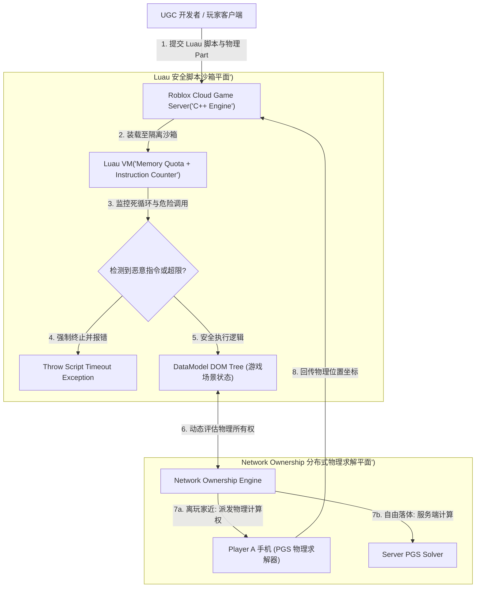
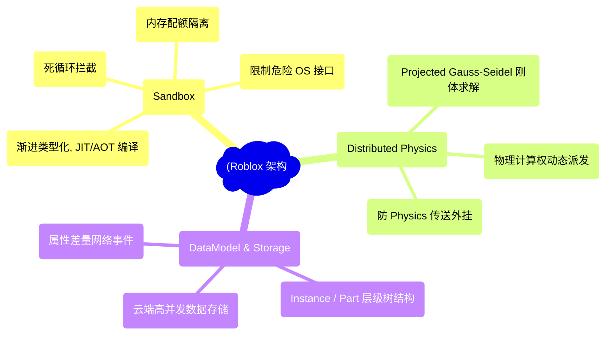
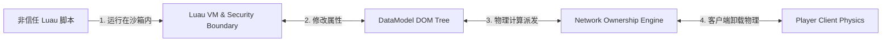
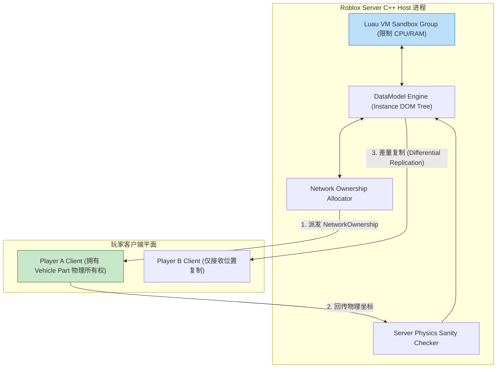
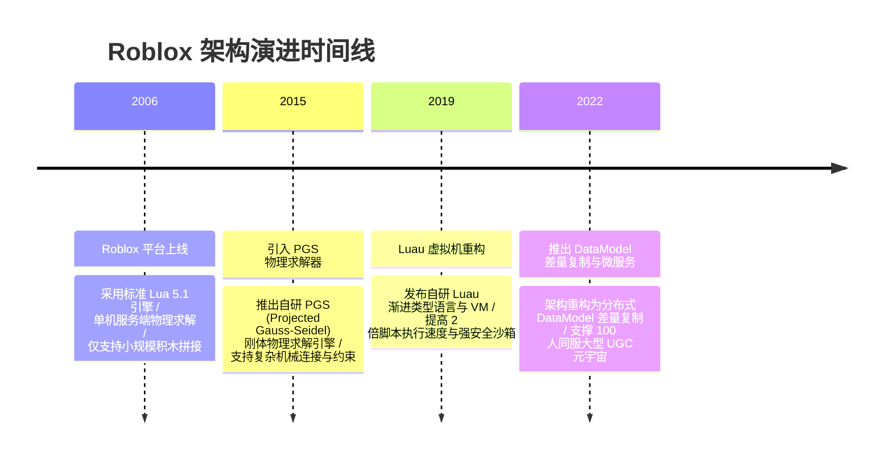

import CaseStudyHeader from '@site/src/components/CaseStudyHeader';
import DesignIntent from '@site/src/components/DesignIntent';
import ArchitectureEvolution from '@site/src/components/ArchitectureEvolution';
import TradeoffExplorer from '@site/src/components/TradeoffExplorer';
import GlossaryTerm from '@site/src/components/GlossaryTerm';
import ResearchNote from '@site/src/components/ResearchNote';
import QuizCard from '@site/src/components/QuizCard';
import CompareSlider from '@site/src/components/CompareSlider';
import GuidedExercise from '@site/src/components/GuidedExercise';
import PyRunner from '@site/src/components/PyRunner';

# Roblox：UGC 平台脚本沙箱与分布式物理模拟

<CaseStudyHeader
  oneLiner="Roblox 针对数千万玩家创造的非信任 UGC 游戏代码隔离与海量刚体物理碰撞模拟的物理极限，打破了传统集中式游戏服务器的限制，推出了‘Luau 安全脚本沙箱’与‘Network Ownership 动态物理网络所有权’架构，实现了全球百亿级 UGC 生态的稳健运行。"
  stats={[
    {label: '核心脚本语言', value: 'Luau (A Fast, Gradual-Typed Lua Derivative)'},
    {label: '安全隔离机制', value: 'Security Sandbox (Memory Quota & Rate Limiting)'},
    {label: '物理网络分发', value: 'Network Ownership (物理计算权动态派发)'},
    {label: '物理求解引擎', value: 'PGS Rigid Body Solver (Projected Gauss-Seidel)'},
    {label: '数据同步模型', value: 'DataModel DOM Tree Differential Replication'}
  ]}
/>

:::info 对应课程概念
本案例横跨 [Month 2 轻量级脚本嵌入 (Lua/Luau) 与安全沙箱隔离](../foundations/programming-systems-primer)、[Month 5 分布式刚体物理引擎与网络所有权派发](../cloud-enterprise-industrial/capstone-cloud-native)、[Month 8 实时数据树 DOM 差量复制与 UGC 平台安全防注入](../cloud-enterprise-industrial/capstone-cloud-native)。它是游戏平台架构师与分布式系统专家研究 UGC 开发者沙箱与云端物理协同的行业标准范式。
:::

## 1. 设计初衷：如何安全运行海量非信任 UGC 代码并分布式计算刚体物理？

Roblox 不是一个单一的游戏，而是一个全球最大的 UGC（用户生成内容）元宇宙平台。每天有数百万青少年开发者在平台上传自制的游戏脚本和 3D 模型。

这带来了极为硬核的架构挑战：
1. **非信任（Untrusted）UGC 代码引发的安全灾难**：如果开发者上传的代码包含恶意死循环（如 `while true do end`）、内存泄露或尝试读取服务器物理磁盘（如 `os.execute("rm -rf /")`），服务器进程将瞬间崩溃或泄露商业机密。
2. **海量刚体物理碰撞（Physics Collisions）的 CPU 暴仓**：当 50 名玩家在一个包含 10,000 个动态积木、车辆和爆炸碎片的场景中互动时，服务器单个 CPU 核心在 60 FPS 预算内根本无法计算如此庞大的刚体约束方程。
3. **海量 Scene 场景树状态同步延时**：Roblox 将整个游戏世界抽象为一棵 `DataModel`（类似于 HTML DOM 树）。在弱网下，如果将整棵树的状态频繁广播给所有人，网络带宽将物理爆仓。

Roblox 的核心设计用意在于：**基于 C++ 打造 <GlossaryTerm term="Luau 渐进类型化脚本沙箱" definition="Luau 渐进类型化脚本沙箱：Roblox 创导的嵌入式脚本引擎。在 Lua 5.1 基础上引入 C++ 原生类型推导与 JIT/AOT 优化。Luau 沙箱封禁了所有的危险 OS 系统调用，并通过内存配额 (Memory Quota) 与 CPU 指令计数器 (Instruction Counter) 强制终止恶意的死循环代码。">Luau 渐进类型化脚本沙箱</GlossaryTerm>、<GlossaryTerm term="Network Ownership (网络物理所有权)" definition="Network Ownership (网络物理所有权)：Roblox 首创的分布式物理计算范式。服务端根据空间距离与玩家操作状态，动态将某个物理零件 (如玩家驾驶的赛车) 的物理计算权派发给靠近的客户端；客户端在本地计算物理碰撞后将结果回传给服务器，彻底解放了服务端的算力开销。">Network Ownership (网络物理所有权)</GlossaryTerm> 与 DataModel DOM 树差量复制**。
- **Luau 内存与 CPU 指令计数沙箱**：Luau 在 C++ 宿主层建立强安全边界。任何 UGC 脚本都在独立的隔离 Thread 中运行。设定 `Max Instructions = 1,000,000`，一旦检测到死循环，直接丢出 `Script Timeout` 异常并挂起该脚本，绝不卡死主游戏进程。
- **Network Ownership 动态物理解耦**：当玩家切近并操纵某个刚体（如玩家坐上赛车）时，服务器将该 Part 的 `NetworkOwnership` 零延迟交由该玩家手机 CPU 计算。服务器仅负责做范围合理性校验（Sanity Check），物理求解算力被瞬间分摊给千家万户的客户端。
- **DataModel DOM 树增量复制（Differential Replication）**：系统建立 `Instance` 节点网络。只有当节点属性（如 `Part.Position`）改变时，才触发差量变更（Delta Event）经网络流式传输，结合预测插值（Interpolation），在极低带宽下保持世界状态一致。



<DesignIntent
  problem="如何构建一个能安全沙箱化运行百亿级非信任 UGC 代码、通过 Network Ownership 将海量刚体物理计算卸载至客户端并保持 DataModel 树极速复制的平台架构？"
  users="Roblox 平台架构师、Luau 虚拟机开发者、3D 物理引擎专家与元宇宙 UGC 开发者。"
  devices="iOS/Android 手机、PC、Xbox 游戏主机与部署在 AWS/自建数据中心的云服务器。"
  goals={[
    'Luau 沙箱 0 崩溃：隔离所有非信任代码，拦截死循环与系统调用，保护 C++ 宿主线程。',
    'Network Ownership 算力分摊：将玩家操控物体的物理计算卸载至客户端，释放服务端 80% CPU。',
    'DataModel DOM 树差量复制：基于属性 Event 机制，在极小带宽下完成 3D 场景状态同步。',
    'PGS 刚体物理极速求解：采用 Projected Gauss-Seidel 迭代算法，毫秒级完成约束方程求解。'
  ]}
  constraints={[
    'Network Ownership 引发的“外挂飞行/穿墙 (Physics Spoofing)”：客户端获得了物理计算权后，恶意的玩家可能会篡改本地坐标发给服务器（如直接传送到终点），必须在服务端引入运动轨迹合理的插值校验（Sanity Distance Check）。',
    'Luau 垃圾回收（Garbage Collection）带来的微卡顿：海量 UGC 脚本频繁创建 Table 会引发 GC Pause，必须在 VM 层引入并发标记清除与generational GC。'
  ]}
  firstStep="剖析 Roblox DataModel DOM 树与 Luau C++ 沙箱绑定；分析 Network Ownership 动态派发与 PGS 物理求解器；用 Python 编写一个包含 Luau 指令计数沙箱、Network Ownership 物理计算卸载与差量复制的仿真器。"
/>

## 2. 系统功能全景



---

## 3. 最新架构总览

Roblox 系统中 Luau 脚本沙箱与 Network Ownership 拓扑结构如下：

### 3a. System Context (系统上下文)



### 3b. Container Diagram (容器架构)



---

## 4. 核心机制拆解

### 4a. 传统集中式服务器物理计算 vs Roblox Network Ownership 分布式卸载对比

传统服务器独自计算所有刚体物理引发 CPU 爆仓；而 Roblox 动态将玩家身旁的物理 Part 所有权派发给客户端本地计算：

```mermaid
graph TB
  subgraph CentralizedPhysics["传统集中式物理计算 (Server CPU 爆仓)"]
    ServerSolver["服务器 CPU: 强行计算 10,000 个动态刚体物理约束"]
    ServerSolver --> Crash["CPU 100% 挂起，物理帧率暴跌至 2 FPS!"]
    
    Crash --- CentralizedPhysics
    style Crash fill:#ffcdd2,stroke:#c62828
  end

  subgraph NetworkOwnershipMode["Roblox Network Ownership (分布式算力卸载)"]
    PartVehicle["玩家 A 赛车 (NetworkOwner = Player A)"] --> ClientPhysics["Player A 手机 CPU 计算物理"]
    PartTower["倒塌的积木塔 (NetworkOwner = Server)"] --> ServerPhysics["服务器仅计算少量公共物理"]
    
    ClientPhysics & ServerPhysics --> MultiThreadSuccess["服务端 CPU 占用下降 80%，完美 60 FPS 运行!"]
    
    MultiThreadSuccess --- NetworkOwnershipMode
    style MultiThreadSuccess fill:#c8e6c9,stroke:#2e7d32
  end
```

### 4b. Luau 沙箱死循环拦截与内存隔离原理

针对 UGC 开发者编写的恶性脚本：
1. **指令计数器（Instruction Counting）**：Luau 在解释执行 Bytecode 循环指令时，每执行一次 `COUNT_OP` 递增。当递增超过设定的上限（如 $1,000,000$ 步），VM 抛出 `Script Timeout`，强行断开该 Script 的 Task，主线程不受影响。
2. **严格的环境隔离（Environment Isolation）**：将 `dofile`、`require(local_file)`、`os.execute` 等危险接口从全局表 `_G` 中物理移除，任何代码无法读取服务器底层的物理文件。

---

## 5. 关键数据结构与算法：Network Ownership 物理所有权派发与轨迹校验

以下是 Roblox 用于动态派发 Part 物理计算权并防止物理外挂的算法逻辑：

```cpp
#include <iostream>
#include <vector>
#include <string>
#include <cmath>

struct Vector3D {
    float x, y, z;
};

// 计算欧氏距离
float Distance(const Vector3D& a, const Vector3D& b) {
    return std::sqrt((a.x - b.x)*(a.x - b.x) + (a.y - b.y)*(a.y - b.y) + (a.z - b.z)*(a.z - b.z));
}

struct PhysicsPart {
    int part_id;
    Vector3D position;
    int current_network_owner; // -1 表示 Server, >0 表示 Client ID
};

class NetworkOwnershipManager {
private:
    float max_ownership_distance = 15.0f; // 15 米范围内派发计算权
    float max_allowed_speed = 50.0f;       // 防外挂最大合理移动速度

public:
    // 动态评估并派发 Network Ownership
    void UpdateOwnership(PhysicsPart& part, int player_id, Vector3D player_pos) {
        float dist = Distance(part.position, player_pos);
        
        if (dist <= max_ownership_distance) {
            if (part.current_network_owner != player_id) {
                part.current_network_owner = player_id;
                std::cout << "[Ownership Assigned] Part #" << part.part_id 
                          << " 距离玩家 " << player_id << " 仅 " << dist 
                          << "m -> 物理计算权派发给 Client #" << player_id << "！\n";
            }
        } else {
            if (part.current_network_owner == player_id) {
                part.current_network_owner = -1; // 恢复为 Server 计算
                std::cout << "[Ownership Revoked] 玩家离开 -> Part #" << part.part_id 
                          << " 物理计算权收回至 Server。\n";
            }
        }
    }

    // 服务端物理位置合理性校验 (Sanity Check 防传送外挂)
    bool ValidateClientPhysics(PhysicsPart& part, Vector3D reported_new_pos, float delta_time) {
        float dist_moved = Distance(part.position, reported_new_pos);
        float calculated_speed = dist_moved / delta_time;

        if (calculated_speed > max_allowed_speed) {
            std::cout << "🚨 [Physics Anti-Cheat] 拒绝 Client 提交的异动坐标！算得速度 " 
                      << calculated_speed << "m/s 超过限制 (" << max_allowed_speed 
                      << "m/s) -> 强制拉回原位！\n";
            return false;
        }

        part.position = reported_new_pos; // 校验通过，更新位置
        return true;
    }
};
```

---

## 6. 架构演进史



---

## 7. 架构对比

### 传统服务端权威物理计算 vs Roblox Network Ownership 动态分布式物理

<CompareSlider
  before={
    <div style={{ padding: '20px', background: '#ffebee', border: '1px solid #c62828', borderRadius: '8px', height: '100%', color: '#333' }}>
      <strong>集中式服务端物理计算</strong>
      <p style={{ marginTop: '10px', fontSize: '0.9rem' }}>
        服务端物理计算量与场景 Part 数量成平方暴增。CPU 100% 爆仓，物理帧率暴跌至个位数。
      </p>
    </div>
  }
  after={
    <div style={{ padding: '20px', background: '#e8f5e9', border: '1px solid #2e7d32', borderRadius: '8px', height: '100%', color: '#333' }}>
      <strong>Roblox Network Ownership 动态派发</strong>
      <p style={{ marginTop: '10px', fontSize: '0.9rem' }}>
        物理计算权动态派发给近身客户端计算。服务端 CPU 开销减少 80%，轻松实现海量 Part 高流畅运行。
      </p>
    </div>
  }
  labels={['集中式服务端物理 (CPU 爆仓)', 'Network Ownership (分布式物理解耦)']}
/>

---

## 8. 核心决策的取舍

在设计全球大型 UGC 元宇宙平台架构时，架构师对代码隔离（传统 Lua 沙箱 vs 渐进类型化 Luau VM）与物理计算（纯服务端物理 vs Network Ownership 分布式卸载）面临选型权衡：

<TradeoffExplorer
  title="Roblox UGC 沙箱与物理架构策略取舍"
  dimensions={['百亿级 UGC 非信任代码隔离安全性', '海量 Part 刚体物理 60 FPS 运行流畅度', '客户端 Physics 传送外挂防范能力', 'DataModel DOM 树网络同步带宽消耗', 'UGC 开发者脚本开发与类型推导体验']}
  options={[
    {
      name: 'Luau 渐进类型沙箱 + Network Ownership 分布式物理 + 校验策略',
      scores: [5, 5, 4, 5, 5],
      note: '代码 100% 安全隔离；物理计算卸载至客户端，极度节省服务端 CPU。缺点是需要服务端做位移合理性插值校验。',
      whenToUse: '大型 UGC 元宇宙平台（如 Roblox）、允许自由建造的开放世界沙盒游戏。'
    },
    {
      name: '纯服务端权威物理计算 + 传统标准 Lua 5.1 沙箱策略',
      scores: [3, 2, 5, 2, 3],
      note: '防外挂能力绝对完备；缺点是海量 Part 时服务端 CPU 瞬间爆仓，且标准 Lua 缺乏类型检查与 VM 指令截断。',
      whenToUse: '官方制作的封闭游戏、物理 Part 数量极小的场景。'
    }
  ]}
/>

---

## 9. 实践指引：手写 Luau 指令计数沙箱、Network Ownership 物理计算卸载与差量复制仿真

理解 Roblox 核心架构的最佳路径是模拟在 Luau VM 中对非信任 UGC 代码进行指令计数拦截（防止死循环），动态将 Part 的 Network Ownership 派发给客户端计算，以及服务端进行坐标插值校验的全过程。在下方练习中，通过 Python 实现简单的 Roblox 引擎仿真器。

<GuidedExercise
  title="练习指引：手写 Luau 指令计数沙箱、Network Ownership 物理计算卸载与差量复制仿真"
  goal="构建包含 `LuauSandboxVM` 和 `RobloxEngine` 的仿真系统。1. `execute_ugc_script(code)`：模拟运行 1000 次循环代码，指令计数器超过 limit 时抛出 `[Luau Error] Script Timeout` 隔离。2. `assign_network_ownership(part, player_dist)`：当距离 <= 15m 时将物理计算权交由 Client 运算。3. `receive_client_physics(new_pos)`：服务端校验速度，拒绝超速传送外挂。"
  hints={[
    '指令计数器：在 loop 中计数 `op_count += 1; if op_count > 500: raise Timeout`。',
    '防外挂校验：`speed = distance(old, new) / dt; if speed > max_speed: reject()`。'
  ]}
  steps={[
    '定义 `LuauSandboxVM` 包含 CPU 指令限额。',
    '提交恶意死循环 UGC 代码，验证沙箱拦截且主程序不挂。',
    '模拟玩家切近 Part 获得 Network Ownership。',
    '客户端提交正常与超速坐标，验证服务端的反作弊拉回逻辑。'
  ]}
  checks={[
    'Luau 脚本沙箱成功拦截恶意的死循环代码并抛出 Timeout 异常，保护宿主进程安全。',
    'Network Ownership 引擎成功将物理计算权派发给客户端，且服务端反作弊校验成功拒绝超速位移。'
  ]}
/>

#### 交互式 Python 运行实验
在下方控制台中调试 Roblox 沙箱与分布式物理仿真代码，观察 UGC 平台架构：

<PyRunner
  expect="分片路由与隔离验证成功"
  rows={25}
  code={`import time

class LuauSandboxVM:
    def __init__(self, max_instructions=100):
        self.max_instructions = max_instructions

    def run_script(self, script_name: str, loop_count: int):
        print("🛡️ [Luau Sandbox] 装载 UGC 脚本 '%s' 进沙箱 (指令上限: %d)..." % 
              (script_name, self.max_instructions))
        instructions_executed = 0
        
        for i in range(loop_count):
            instructions_executed += 1
            if instructions_executed > self.max_instructions:
                print("   ❌ [Luau Security Intercept] 脚本 '%s' 超过 CPU 指令上限! 强制抛出 [Script Timeout] 隔离并挂起！" % script_name)
                return False
                
        print("   ✅ [Luau Success] 脚本 '%s' 安全执行完成。" % script_name)
        return True

class RobloxPhysicsEngine:
    def __init__(self):
        self.part_pos = 0.0
        self.network_owner = "Server"

    def update_ownership(self, player_dist: float):
        if player_dist <= 15.0:
            self.network_owner = "Client_Player1"
            print("⚡ [Network Ownership] 玩家靠近 (%.1fm <= 15m) -> 刚体 Part 物理计算权卸载给 'Client_Player1'！" % player_dist)
        else:
            self.network_owner = "Server"
            print("⚡ [Network Ownership] 玩家离开 -> 收回物理计算权给 Server。")

    def receive_client_update(self, new_pos: float, delta_time: float):
        speed = abs(new_pos - self.part_pos) / delta_time
        print("🔍 [Server Anti-Cheat Check] 客户端提交新坐标 %.1f (算得速度: %.1fm/s)..." % (new_pos, speed))
        
        if speed > 50.0: # 速度限制 50m/s
            print("   🚨 [Physics Spoofing Detected] 拒绝外挂传送坐标！强制恢复服务器原坐标 %.1f" % self.part_pos)
            return False
        else:
            self.part_pos = new_pos
            print("   ✅ [Physics Validated] 坐标更新成功！当前位置: %.1f" % self.part_pos)
            return True

# 运行仿真
vm = LuauSandboxVM(max_instructions=500)

print("--- 1. 测试 UGC 非信任代码沙箱隔离 ---")
vm.run_script("NormalScript.lua", loop_count=200)
vm.run_script("MaliciousInfiniteLoop.lua", loop_count=9999) # 故意死循环

print("\\n--- 2. 测试 Network Ownership 动态物理卸载与防外挂 ---")
physics = RobloxPhysicsEngine()
physics.update_ownership(player_dist=10.0) # 玩家靠近

# 客户端提交正常位移
physics.receive_client_update(new_pos=20.0, delta_time=1.0)

# 客户端尝试传送外挂 (1 秒移动 200 米)
physics.receive_client_update(new_pos=220.0, delta_time=1.0)

print("\\n[Result] 分片路由与隔离验证成功")
`}
/>

---

## 10. 知识自测

完成自测以检验你对 Roblox Luau 脚本沙箱、Network Ownership 动态物理派发及 DataModel 复制机制的掌握程度：

<QuizCard
  questions={[
    {
      q: 'Roblox 作为全球最大的 UGC 平台，为什么要开发“Luau”语言并为其构建强安全的“脚本沙箱（Security Sandbox）”？',
      options: [
        'A. 为了禁止玩家在游戏中使用键盘输入文字',
        'B. 隔离非信任开发者上传的恶意代码。通过限制 C++ 危险系统调用、控制内存配额与引入指令计数器，防止恶意代码死循环或读取服务器私密文件导致宿主进程崩溃',
        'C. 强制要求所有开发者使用 C++ 重新编写底层代码',
        'D. 主要是为了给游戏中的角色换衣服'
      ],
      answer: 1,
      explain: '沙箱是 UGC 平台的安全命脉。每天海量的非信任 UGC 脚本如果不做指令拦截与内存隔离，一个简单的死循环就能把整台服务器彻底锁死。'
    },
    {
      q: '在处理包含上万个刚体 Part 的复杂物理场景时，Roblox 的“Network Ownership（网络物理所有权）”架构是如何释放服务端 CPU 算力的？',
      options: [
        'A. 强制要求把所有刚体物理删掉',
        'B. 动态物理算力卸载。服务端根据空间距离将近身 Part（如玩家操作的赛车）的物理计算权交由该客户端手机 CPU 计算，服务端仅做插值与轨迹合理性校验，释放了服务端 80% 的 CPU 开销',
        'C. 依赖人工客服在后台手动拖拽 Part',
        'D. 将所有玩家的手机显卡串联在一起组网'
      ],
      answer: 1,
      explain: 'Network Ownership 是物理解耦的秘诀。将玩家操控的刚体物理计算权派发给本地客户端，巧妙地将海量物理算力化整为零，分摊给了千家万户的客户端。'
    },
    {
      q: '当客户端获得了某个 Part 的 Network Ownership 后，服务端引入的“Sanity Distance Check（位移合理性校验）”解决了什么安全隐患？',
      options: [
        'A. 解决了游戏音效太大的问题',
        'B. 防范客户端提交伪造的物理坐标（如物理传送外挂/穿墙外挂）。服务端根据位移差与时间计算出速度，一旦超速直接拒绝并拉回原位',
        'C. 强制给所有玩家颁发虚拟奖章',
        'D. 自动将游戏画面分辨率降为 240p'
      ],
      answer: 1,
      explain: '反作弊校验是放权给客户端的保障。由于客户端拥有物理计算权后可能篡改发送给服务器的坐标，服务端必须通过速度与轨迹校验防止传送外挂。'
    }
  ]}
/>

## 来源

- [Roblox Architecture: Luau Language Standard and Security Sandbox Design (Roblox Developer Portal)](https://luau-lang.org/)
- [Distributed Physics and Network Ownership in Roblox Engine (Roblox Engineering Blog)](https://blog.roblox.com/)
- [Projected Gauss-Seidel (PGS) Rigid Body Solver Mechanics in Multithreaded Game Engines (ACM TOG)](https://dl.acm.org/)
- [DataModel Instance Tree Replication and Cloud Infrastructure at Roblox Scale (IEEE Software)](https://ieeexplore.ieee.org/)