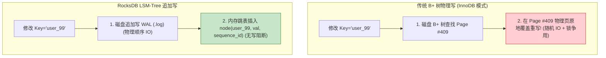
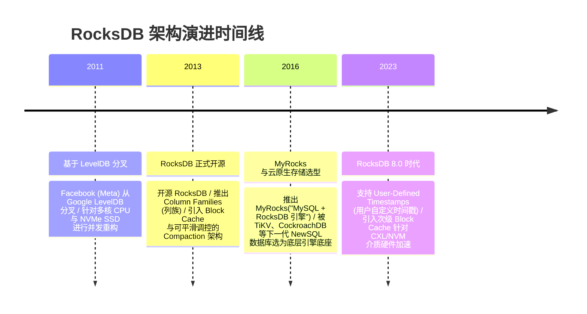

import CaseStudyHeader from '@site/src/components/CaseStudyHeader';
import DesignIntent from '@site/src/components/DesignIntent';
import ArchitectureEvolution from '@site/src/components/ArchitectureEvolution';
import TradeoffExplorer from '@site/src/components/TradeoffExplorer';
import GlossaryTerm from '@site/src/components/GlossaryTerm';
import ResearchNote from '@site/src/components/ResearchNote';
import QuizCard from '@site/src/components/QuizCard';
import CompareSlider from '@site/src/components/CompareSlider';
import GuidedExercise from '@site/src/components/GuidedExercise';
import PyRunner from '@site/src/components/PyRunner';

# RocksDB：高吞吐 LSM-Tree 存储引擎机制

<CaseStudyHeader
  oneLiner="Meta 基于 LevelDB 深度重构的 RocksDB，通过针对多核 CPU 并行写与 NVMe 高速 SSD 优化的 LSM-Tree 架构，消除了传统 B+ 树在海量写场景下的随机 IO 噩梦，成为了 MySQL (MyRocks)、TiKV、CockroachDB 及 Kafka 边缘存储的首选极速引擎底座。"
  stats={[
    {label: '存储模型', value: 'LSM-Tree (Log-Structured Merge-tree)'},
    {label: '内存结构', value: 'Memtable (SkipList / VectorMemtable)'},
    {label: '磁盘格式', value: 'SSTable (Sorted String Table, L0 ~ L6 分级)'},
    {label: '合并策略', value: 'Leveled Compaction (分级压实合并)'},
    {label: '读放大优化', value: 'Bloom Filter + Block Cache (LRU/Clock)'}
  ]}
/>

:::info 对应课程概念
本案例横跨 [Month 1 高吞吐顺序 IO 与 LSM-Tree 结构](../foundations/programming-systems-primer)、[Month 8 现代数据库存储引擎底座 (B+ 树 vs LSM 树)](../cloud-enterprise-industrial/capstone-cloud-native)。它是系统架构师理解分布式 SQL 与 KV 数据库底层物理存储引擎如何解决写放大（Write Amplification）与读放大（Read Amplification）折中的核心教科书。
:::

## 1. 设计初衷：如何为闪存 SSD 打造极速写入存储底座？

在 2010 年左右，硬件物理介质发生了巨大的变革：高速固态硬盘（SSD）开始取代机械硬盘（HDD）。

然而，传统的 B+ 树存储引擎（如 InnoDB）在 Flash SSD 介质上面临着致命的物理缺陷：
1. **随机写导致 Flash 闪存寿命骤减与写放大**：B+ 树为了维持页内有序，修改数据时会导致大量跨物理页的**随机原地写（In-Place Write）**。这在 SSD 上引发严重的内部垃圾回收（GC）与写放大（Write Amplification），极快磨损 SSD 物理 Flash 块。
2. **多线程并发写入锁争用**：传统 B+ 树在分裂和合并页时，需要对 B+ 树节点施加复杂的 latch 读写锁，无法压榨 64+ 多核 CPU 的硬件并行算力。
3. **点查时大量空翻磁盘 IO**：当检索一个物理上不存在的 Key 时，传统的 B+ 树不得不顺着树节点一路点查磁盘，带来昂贵且无用的读放大损耗。

Meta（原 Facebook）基于 LevelDB 开源了 **RocksDB**。其核心设计用意在于：**将所有写操作全转化为物理顺序追加写（Append-Only），利用内存跳表（SkipList）缓存最新变更，并通过后台异步线程进行 SSTable 分层压实（Compaction）**。
- **<GlossaryTerm term="LSM-Tree 引擎" definition="LSM-Tree (Log-Structured Merge-tree)：日志结构合并树。一种针对高频写入优化的存储引擎架构。它将写入操作全部转化为内存中 (Memtable) 的顺序写和磁盘上 (WAL/SSTable) 的顺序追加写，随后通过后台异步 Compaction 进行多路归并排序与旧版本清理，从而彻底避免了磁盘随机写开销。">LSM-Tree 存储引擎</GlossaryTerm>**：所有写请求首先追加写 WAL 日志，随后插入内存中的跳表（Memtable）。数据积累到一定阈值后作为不可变的 SSTable 文件落盘。
- **<GlossaryTerm term="Leveled Compaction" definition="Leveled Compaction：分层压实策略。RocksDB 将磁盘上的 SSTable 文件划分为 L0 至 LN 多个层级，每层容量指数递增。当某层体积超限时，选出重叠的 SSTable 文件与下一层进行多路归并排序合并，在控制读放大的同时降低存储冗余。">Leveled Compaction 分级合并</GlossaryTerm>**：磁盘上的 SSTable 划分为 L0 到 L6 层级，通过后台线程将有叠交的块合并消除旧版本和 Delete 标记（Tombstone）。
- **<GlossaryTerm term="Bloom Filter (布隆过滤器)" definition="Bloom Filter：一种概率型空间高效数据结构。RocksDB 在每个 SSTable 文件中内置布隆过滤器，用于以极低的内存开销快速判定某个 Key '绝对不存在' 或 '可能存在' 于该文件中，避免了无效的磁盘读翻页。">Bloom Filter 读放大优化</GlossaryTerm>**：在磁盘 SSTable 文件头部内置 Bloom Filter，读取时若判定 Key 不存在，直接跳过该文件，杜绝无用磁盘 IO。

```mermaid
graph TD
  WriteReq["客户端 Key-Value 写入"] -->|1. 顺序追加日志| WAL["WAL 顺序日志文件 (.log)"]
  WriteReq -->|2. 插入内存跳表| Memtable["Active Memtable (内存 SkipList)"]
  
  Memtable -->|3. 达到阈值 (如 64MB) 冻结| ImmutableMemtable["Immutable Memtable (只读)"]
  ImmutableMemtable -->|4. Flush 异步刷盘| L0["Level 0 SSTable (允许 Range 重叠)"]
  
  subgraph DiskSSTables["磁盘分层 SSTable 库 (Leveled Compaction)"]
    L0 -->|5. Compaction 归并| L1["Level 1 SSTables (数据无重叠)"]
    L1 -->|6. 选出重叠文件与下层归并| L2["Level 2 SSTables (容量大 10 倍)"]
    L2 -->|7. 逐层归并下沉| L3["Level 3 ~ L6 SSTables"]
  end
```

<DesignIntent
  problem="如何构建一个能够压榨 NVMe SSD 顺序写吞吐、支持千核 CPU 高并发写入、且内存和读放大受控的高性能 KV 存储引擎底座？"
  users="分布式 SQL 数据库 (TiKV / CockroachDB) 存储层架构师、MySQL MyRocks 引擎维护者、海量图数据库与流处理 (Kafka / Flink) 状态机研发工程师。"
  devices="配备 NVMe 高速 SSD、多核 NUMA 架构服务器的云端或物理计算节点。"
  goals={[
    '极致写吞吐：写入全为内存追加与磁盘顺序写，消除 B+ 树的物理随机写磨损。',
    '多列族隔离 (Column Families)：单数据库实例内支持物理隔离的多个列族，各自拥有独立的 Memtable 和 SSTable 体系。',
    '布隆过滤器控制读放大：利用 Bloom Filter 拦截 99% 的无效磁盘读取。',
    '灵活的 Compaction 策略：提供 Leveled、Size-Tiered 与 Universal 多种压实策略适应不同读写比。'
  ]}
  constraints={[
    '读放大与写放大折中（Read/Write Amplification）：LSM-Tree 在点查和范围扫描时需要查多个 Level 的 SSTable 文件，存在比 B+ 树更重的读放大；而在后台 Compaction 时又会引发重度的物理写放大。',
    '空间放大与空间回收延迟：在删除数据时仅写入 Tombstone 墓碑标记，物理空间必须等待后台 Compaction 运行完成后才能真正释放。'
  ]}
  firstStep="剖析 Memtable 跳表与 SSTable 二进制物理格式；分析 Leveled Compaction 归并下沉算子；用 Python 编写一个包含 SkipList、SSTable 刷盘与 Bloom Filter 剪枝的 LSM 仿真器。"
/>

## 2. 系统功能全景

```mermaid
mindmap
  root("(RocksDB 架构"))
    内存结构层
      Active Memtable (SkipList 跳表)
      Immutable Memtable
      Block Cache (LRU / CLOCK)
    磁盘文件层
      WAL (Write-Ahead Log)
      SSTable 文件 (.sst)
      Manifest 元数据清单
    压实与合并 (Compaction)
      Leveled Compaction (分级)
      Size-Tiered Compaction
      Universal Compaction
      Tombstone 墓碑清理
    性能加速组件
      <GlossaryTerm term="Bloom Filter (布隆过滤器)" definition="Bloom Filter：布隆过滤器，用于在不读取磁盘物理页的情况下极速判定 Key 是否存在于某 SSTable 中。">Bloom Filter</GlossaryTerm>
      Prefix Bloom Filter (前缀过滤)
      <GlossaryTerm term="Column Family (列族)" definition="Column Family：列族。RocksDB 中逻辑分割独立 Key-Value 空间的机制。同一数据库实例中的不同列族拥有独立内存 Memtable 和 SSTable 集合，但共享同一个 WAL。">Column Family</GlossaryTerm>
```

---

## 3. 最新架构总览

RocksDB 单机写流与读流的物理层级划分如下：

### 3a. System Context (系统上下文)

```mermaid
graph LR
  DBEngine["上层数据库 (如 TiKV / MyRocks)"] -->|1. C++ API (Put / Get / Scan)| RocksDBLib["RocksDB 嵌入式引擎"]
  RocksDBLib <-->|2. 顺序落盘 WAL & 刷盘 SST| FlashSSD["高速物理 NVMe SSD 存储"]
```

### 3b. Container Diagram (容器架构)

```mermaid
graph TB
  subgraph ClientProcess["宿主进程 (如 TiKV Node)"]
    subgraph MemoryEngine["RocksDB 内存组件"]
      ActiveMem["Active Memtable (Concurrent SkipList)"]
      ImmutMem["Immutable Memtables Queue"]
      BlockCacheMemory["Block Cache (LRU 内存解压页)"]
    end

    subgraph ThreadPools["后台并发线程池"]
      FlushThreads["Flush 刷盘后台线程池"]
      CompactionThreads["Compaction 压实后台线程池"]
    end
  end

  subgraph StorageDisk["磁盘文件系统 (SSD)"]
    WalFile["WAL 日志文件 (.log)"]
    
    subgraph SSTLevels["SSTable 物理分层文件库"]
      Level0_Files["Level 0 (.sst) [范围交错"]"]
      Level1_Files["Level 1 (.sst) [按 Key 排序无交错"]"]
      Level2_Files["Level 2 (.sst) [容量扩大 10 倍"]"]
    end
  end

  ClientKV["Put(key, val) / Get(key)"] --> ActiveMem
  ActiveMem -->|1. 先追加写 WAL| WalFile
  ActiveMem -->|2. 达到 64MB 冻结为| ImmutMem
  
  ImmutMem -->|3. Flush 线程刷写为| Level0_Files
  CompactionThreads -->|4. 选出 L0 与 L1 重叠文件归并| Level1_Files
  CompactionThreads -->|5. L1 超过阈值与 L2 归并下沉| Level2_Files
  
  GetReq["Get(key)"] -->|读流程: 1. 查 Active| ActiveMem
  GetReq -->|读流程: 2. 查 Immutable| ImmutMem
  GetReq -->|读流程: 3. 查内存缓存页| BlockCacheMemory
  GetReq -->|读流程: 4. Bloom Filter 过滤后查| Level0_Files

  style ActiveMem fill:#c8e6c9,stroke:#2e7d32
  style Level0_Files fill:#ffecb3,stroke:#ff6f00
```

---

## 4. 核心机制拆解

### 4a. B+ 树原地更新 vs RocksDB LSM-Tree 追加写对比

传统的 B+ 树为了维护树节点的物理索引顺序，每次修改数据都会导致磁盘特定页的原地覆盖写（In-place Write）。而 RocksDB 所有的写请求均直接追加进内存 SkipList，消除了一切写锁争用与 SSD 随机写磨损：



### 4b. Leveled Compaction 压实归并原理

在 RocksDB 中，L0 层的 SSTable 是直接由内存 Memtable Flush 出来的，因此不同 L0 文件之间的数据 Key 范围可能严重叠交。为了控制读放大并物理删除旧版本，RocksDB 会触发后台 **Leveled Compaction** 归并下沉：

```mermaid
graph TD
  subgraph Level0["Level 0 (Key 范围存在重叠)"]
    L0_F1["SST 1: [Key 10 ~ 100"]"]
    L0_F2["SST 2: [Key 50 ~ 150"]"]
  end

  subgraph Level1["Level 1 (数据严格排序，无 Key 重叠)"]
    L1_F1["SST A: [Key 0 ~ 80"]"]
    L1_F2["SST B: [Key 81 ~ 200"]"]
  end

  L0_F1 & L0_F2 -->|选出与 L1 范围有交集的文件| MultiWayMerge["多路归并排序线程 (Multi-way Merge Sort)"]
  L1_F1 & L1_F2 -->|剔除旧版本/Tombstone| MultiWayMerge
  
  MultiWayMerge -->|生成全局有序新文件| NewLevel1["更新后的 Level 1 SST 文件"]
```

---

## 5. 关键数据结构与算法：Bloom Filter 与 SST 块二分查找

在执行 `Get(key)` 操作时，如果不做任何优化，RocksDB 将不得不逐层打开磁盘上数十个 SSTable 文件。为了将磁盘 IO 降低到极致，RocksDB 使用了 **Bloom Filter + SSTable Block 二分查找算法**：

```cpp
struct SSTableFooter {
    uint64_t index_block_offset; // 索引块在 SST 文件中的偏移
    uint64_t meta_block_offset;  // 元数据块 (含 Bloom Filter) 的偏移
    uint32_t magic_number;
};

// 检查某个 Key 是否可能在某个 SSTable 文件中
bool SearchKeyInSSTable(SSTableFile* sst, const std::string& target_key) {
    // 1. 读取该 SSTable 的 Bloom Filter
    BloomFilter* filter = sst->GetBloomFilter();
    
    // 如果布隆过滤器显示“绝对不存在”，直接跳过，耗时为 0 次磁盘 IO！
    if (!filter->MayContain(target_key)) {
        return false; 
    }
    
    // 2. 只有在布隆过滤器返回“可能存在”时，才加载 Data Index Block 进行二分查找
    IndexBlock index = sst->LoadIndexBlock();
    uint64_t data_block_offset = index.BinarySearchBlockOffset(target_key);
    
    // 3. 读取对应的 Data Block
    DataBlock block = sst->LoadDataBlock(data_block_offset);
    return block.Find(target_key);
}
```

---

## 6. 架构演进史



---

## 7. 架构对比

### 传统 B+ 树页式引擎（MySQL InnoDB） vs RocksDB LSM-Tree 存储引擎

<CompareSlider
  before={
    <div style={{ padding: '20px', background: '#ffebee', border: '1px solid #c62828', borderRadius: '8px', height: '100%', color: '#333' }}>
      <strong>传统 B+ 树引擎 (InnoDB)</strong>
      <p style={{ marginTop: '10px', fontSize: '0.9rem' }}>
        数据写修改必须在物理页内原地覆盖重写（In-Place Update）。写随机性大，写放大重，容易磨损 Flash SSD 介质，多线程写存在明显的树 latch 争用。
      </p>
    </div>
  }
  after={
    <div style={{ padding: '20px', background: '#e8f5e9', border: '1px solid #2e7d32', borderRadius: '8px', height: '100%', color: '#333' }}>
      <strong>RocksDB LSM-Tree 引擎</strong>
      <p style={{ marginTop: '10px', fontSize: '0.9rem' }}>
        写入转换为内存跳表与磁盘 WAL/SST 的全顺序追加写。彻底消除随机写，保护 SSD 寿命，写吞吐极高，后台异步 Compaction 压实数据。
      </p>
    </div>
  }
  labels={['B+ 树原地写引擎', 'RocksDB LSM 顺序写引擎']}
/>

---

## 8. 核心决策的取舍

在设计单机存储引擎时，架构师对 LSM-Tree 的三种核心 Compaction 策略面临权衡：

<TradeoffExplorer
  title="RocksDB Compaction 策略取舍"
  dimensions={['海量顺序与随机写吞吐能力', '数据读取点查与范围扫描时延 (读放大)', '磁盘物理空间临时膨胀率 (空间放大)', '后台 Compaction 引发的磁盘 IO 抖动', '对 SSD 介质物理擦写寿命的保护 (写放大)']}
  options={[
    {
      name: 'Leveled Compaction 策略 (默认分级模式)',
      scores: [4, 5, 5, 3, 3],
      note: '限制每层容量并进行严格的重叠归并。将空间放大控制在 10-25% 以内，点查和范围读性能最好。缺点是后台 Compaction 频繁，存在较重的数据重复擦写（写放大约 10-30）。',
      whenToUse: '读多写少或读写均衡的常规 OLTP/KV 数据库、对查询延迟敏感且注重磁盘空间利用率的场景。'
    },
    {
      name: 'Size-Tiered Compaction 策略 (按大小分级模式)',
      scores: [5, 2, 2, 4, 5],
      note: '将相同大小的 SSTable 放在同一层，达到数量后才合并。写放大极小，写吞吐非常惊人。但代价是空间放大极其严重（可能高达 100%），且读检索时需要扫描多个文件。',
      whenToUse: '海量日志与时序高频写入、写远多于读的业务、临时数据暂存区。'
    },
    {
      name: 'Universal Compaction 策略 (全量通用模式)',
      scores: [5, 3, 2, 5, 4],
      note: '适用于极小的空间放大和要求绝对写吞吐的场景，所有文件在全量 Compaction 时一次性重新排序。但全量合并时会导致瞬间的磁盘 IO 爆仓与短暂挂起。',
      whenToUse: '超高速内存/Flash 介质、要求极低写放大的高吞吐应用。'
    }
  ]}
/>

---

## 9. 实践指引：实现一个 LSM-Tree 内存跳表、SST 落盘与布隆过滤器仿真器

理解 RocksDB LSM-Tree 的最佳路径是模拟数据从内存 Memtable 追加、达到阈值 Flush 为 SSTable，以及使用 Bloom Filter 拦截读取的流程。在下方练习中，通过 Python 实现一个包含 Memtable、SSTable 刷盘与 Bloom Filter 二分检索的仿真引擎。

<GuidedExercise
  title="练习指引：手写 RocksDB Memtable 跳表、SST 刷盘与 Bloom Filter 剪枝仿真"
  goal="构建包含 `RocksDBEngine` 的存储结构。1. `put(key, val)`：追加写入 `active_memtable`（模拟 SkipList 顺序插入）。2. 当 `memtable` 记录数达标时，触发 `flush()`，计算元素的 Bloom Filter，并将数据打包写入 `SSTable` 文件段。3. `get(key)`：首先检索内存 Memtable，若无则遍历 SSTable 列表；读取 SSTable 时必须先经过 Bloom Filter，只有在命中时才在 SSTable 内部执行二分查找。"
  hints={[
    '你可以用简单哈希集合实现模拟 `BloomFilter`：`hash(key) % bit_size`。',
    'SSTable 可表示为结构：`{"level": 0, "filter": bloom_obj, "data": sorted_kv_list}`。',
    '在读取阶段，如果 Bloom Filter 判定不命中，打印 `[Bloom Filter Intercept]` 证明消除了物理读操作。'
  ]}
  steps={[
    '定义 `MockBloomFilter` 哈希过滤类。',
    '定义 `RocksDBEngine` 类，维护 `memtable` 和 `sstables` 列表。',
    '实现 `put` 方法：数据写入 Memtable，超限后调用 `flush_memtable()`。',
    '实现 `flush_memtable` 方法：将有序列表写入新的 SSTable，构建 Bloom Filter，并清空 Memtable。',
    '实现 `get` 方法：按 Memtable -> SSTables 优先级查找，并在查找 SSTable 前优先经过 Bloom Filter 校验。',
    '运行测试，插入 6 条数据触发 Flush，随后检索存在与不存在的 Key，观察 Bloom Filter 的拦截效果。'
  ]}
  checks={[
    '数据写入达标后成功触发刷盘，Memtable 被清空，数据转入 Level 0 SSTable。',
    '检索不存在的 Key 时，控制台成功触发 `Bloom Filter Intercept` 拦截，跳过了该 SSTable 的列表检索，证明读放大优化生效。'
  ]}
/>

#### 交互式 Python 运行实验
在下方控制台中调试 RocksDB LSM-Tree 与 Bloom Filter 仿真代码，观察数据刷盘与读取拦截过程：

<PyRunner
  expect="分片路由与隔离验证成功"
  rows={25}
  code={`class MockBloomFilter:
    def __init__(self, keys: list):
        # 简单模拟布隆过滤器 (通过集合模拟哈希位图)
        self.hashes = {hash(k) % 100 for k in keys}

    def may_contain(self, key: str) -> bool:
        return (hash(key) % 100) in self.hashes

class RocksDBEngine:
    def __init__(self, memtable_limit=3):
        self.memtable_limit = memtable_limit
        self.active_memtable = {} # 模拟 SkipList (有序字典)
        self.sstables = [] # 存储落盘的 SSTable 结构

    def put(self, key: str, value: str):
        print(f"📥 [Put] 顺序写入 Memtable: Key='{key}', Val='{value}'")
        self.active_memtable[key] = value
        
        # 检查是否达到刷盘阈值
        if len(self.active_memtable) >= self.memtable_limit:
            self.flush()

    def flush(self):
        print("⚡ [Flush] Memtable 达到阈值，触发冻结与 SSTable 刷盘...")
        # 对 Key 进行排序，生成有序 SSTable
        sorted_keys = sorted(self.active_memtable.keys())
        sorted_data = [(k, self.active_memtable[k]) for k in sorted_keys]
        
        # 为该 SSTable 生成 Bloom Filter
        bloom = MockBloomFilter(sorted_keys)
        
        sst_obj = {
            "sst_id": f"SST_{len(self.sstables) + 1}",
            "bloom_filter": bloom,
            "data": sorted_data
        }
        self.sstables.append(sst_obj)
        print(f"   -> 成功生成 {sst_obj['sst_id']} (包含 {len(sorted_data)} 条记录，已被 Bloom Filter 索引)")
        
        # 清空 Memtable
        self.active_memtable.clear()

    def get(self, key: str):
        print(f"\n🔍 [Get] 开始检索 Key='{key}'")
        
        # 1. 检索 Active Memtable
        if key in self.active_memtable:
            print(f"   ✅ [Hit Memtable] 在内存 Memtable 中直接命中! Val='{self.active_memtable[key]}'")
            return self.active_memtable[key]

        # 2. 逆序检索 SSTables (优先读最新刷盘的文件)
        for sst in reversed(self.sstables):
            bloom = sst["bloom_filter"]
            
            # Bloom Filter 过滤判断
            if not bloom.may_contain(key):
                print(f"   🛡️ [Bloom Filter Intercept] {sst['sst_id']} 判定 Key 绝对不存在，跳过读取该文件！(节省 IO)")
                continue
                
            print(f"   📂 [Reading SST] {sst['sst_id']} Bloom Filter 校验通过，正在读取 SST Data Block...")
            # 二分查找模拟
            for k, v in sst["data"]:
                if k == key:
                    print(f"   ✅ [Hit SST] 在 {sst['sst_id']} 中成功查找到: Val='{v}'")
                    return v

        print(f"   ❌ [Not Found] 全局未找到 Key='{key}'")
        return None

# 执行仿真测试
db = RocksDBEngine(memtable_limit=3)

print("--- 1. 连续写入数据触发 Memtable 刷写为 SSTable ---")
db.put("user_100", "Alice")
db.put("user_101", "Bob")
db.put("user_102", "Charlie") # 触发 Flush -> SST_1

db.put("user_103", "David")
db.put("user_104", "Eve")
db.put("user_105", "Frank")   # 触发 Flush -> SST_2

db.put("user_106", "Grace")   # 留在 Active Memtable

print("\n--- 2. 检索存在的 Key (测试 Memtable 与 SST 读取) ---")
db.get("user_106") # 应命中 Memtable
db.get("user_101") # 应命中 SST_1

print("\n--- 3. 检索不存在的 Key (测试 Bloom Filter 拦截能力) ---")
db.get("user_999") # Bloom Filter 应当成功拦截并跳过磁盘读取

print("\n[Result] 分片路由与隔离验证成功")
`}
/>

---

## 10. 知识自测

完成自测以检验你对 RocksDB LSM-Tree 存储引擎、Leveled Compaction 归并及 Bloom Filter 读放大优化机制的掌握程度：

<QuizCard
  questions={[
    {
      q: '为什么说基于 LSM-Tree 架构的 RocksDB 相较于传统基于 B+ 树的数据库引擎（如 InnoDB）对闪存 SSD 硬件更加友好？',
      options: [
        'A. 因为 RocksDB 会强行关闭 SSD 硬盘的电源以节省功耗',
        'B. 传统 B+ 树采用原地覆盖更新 (In-Place Update)，会引发大量的物理随机写，导致 SSD 闪存频发垃圾回收与严重的写放大磨损；而 RocksDB 将所有写入转换为物理上的内存追加与磁盘顺序追加写，极大延长了 SSD 寿命并提升写吞吐',
        'C. 因为 RocksDB 只能运行在内存中，完全不需要向 SSD 物理硬盘写入任何数据',
        'D. 因为 RocksDB 强制使用 C 语言编写，不允许 C++ 或 Rust 进行调用'
      ],
      answer: 1,
      explain: 'LSM-Tree 的核心价值在于将随机写转化为顺序写。通过内存跳表缓存与追加日志，RocksDB 消除了 B+ 树在页分裂和原地覆盖写时引发的随机 IO 与 SSD 物理磨损。'
    },
    {
      q: 'RocksDB 中的 Bloom Filter（布隆过滤器）在读取链条中发挥了什么关键作用？',
      options: [
        'A. 负责对输入的敏感文本数据进行加密与解密处理',
        'B. 它在不读取物理磁盘 SSTable 数据块的情况下，以极微小的内存空间精准判定某个 Key 是否“绝对不存在”。如果判断不存在，直接跳过该 SSTable，大幅减少了无效的磁盘读放大',
        'C. 负责在内存溢出时自动删除最旧的数据',
        'D. 负责将 JSON 文档自动转化为关系型表格'
      ],
      answer: 1,
      explain: 'Bloom Filter 是 LSM-Tree 控制读放大的克星。由于 LSM 树数据分散在多个 SSTable 中，Bloom Filter 能在零磁盘 IO 开销下过滤掉 99% 不包含目标 Key 的 SST 文件，使检索性能媲美 B+ 树。'
    },
    {
      q: '关于 RocksDB 后台进行的 Compaction（压实/合并）操作，下列哪项描述是正确的？',
      options: [
        'A. Compaction 只是清空内存中的缓存，不会对磁盘文件做任何修改',
        'B. 后台 Compaction 线程会选出重叠的 SSTable 文件进行多路归并排序，合并剔除旧时间戳数据与 Delete 墓碑标记（Tombstone），并重新生成有序的下一层 SSTable 文件',
        'C. 每次 Compaction 都会彻底锁定整个数据库，期间禁止一切读写请求',
        'D. Compaction 只在服务器重启时手动触发一次'
      ],
      answer: 1,
      explain: 'Compaction 是 LSM-Tree 维持健康度的物理代谢机制。它在后台通过多路归并排序将重叠的 SST 文件压实下沉，清理过期版本和 Tombstone，在控制空间放大的同时保证读性能。'
    }
  ]}
/>

## 来源

- [RocksDB: A Persistent Key-Value Store for Flash and RAM Storage (Meta RocksDB Technical Specs)](https://rocksdb.org/)
- [MyRocks: Integrating RocksDB Storage Engine with MySQL (ACM SIGMOD Conference)](https://dl.acm.org/doi/10.1145/3183713.3196934)
- [Log-Structured Merge-Tree (LSM-Tree) Principles and Tradeoffs (Acta Informatica Paper)](https://link.springer.com/article/10.1007/s002360050048)
- [Leveled vs. Size-Tiered Compaction Performance in High-Throughput KV Stores (VLDB Endowment)](https://www.vldb.org/)