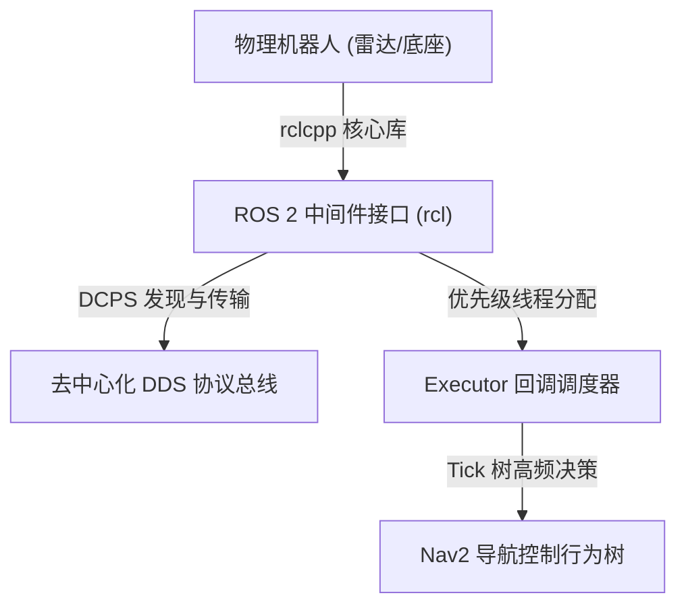
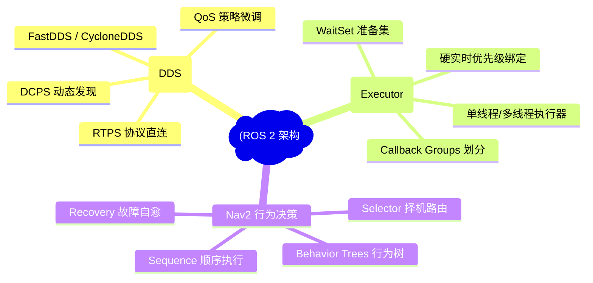
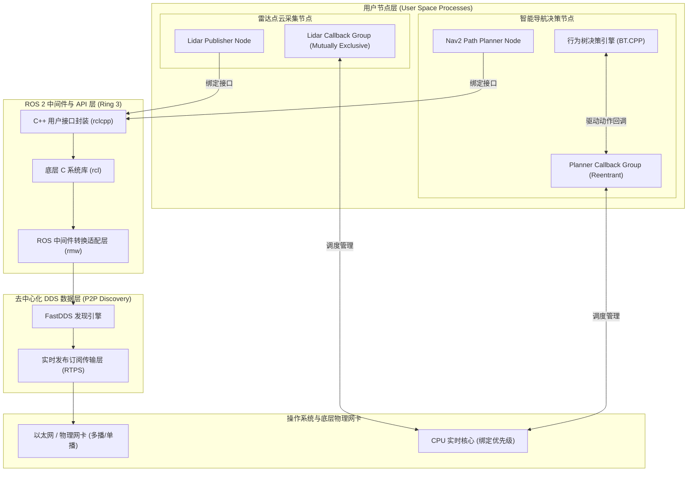
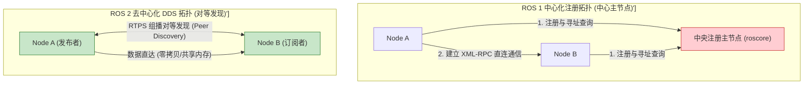
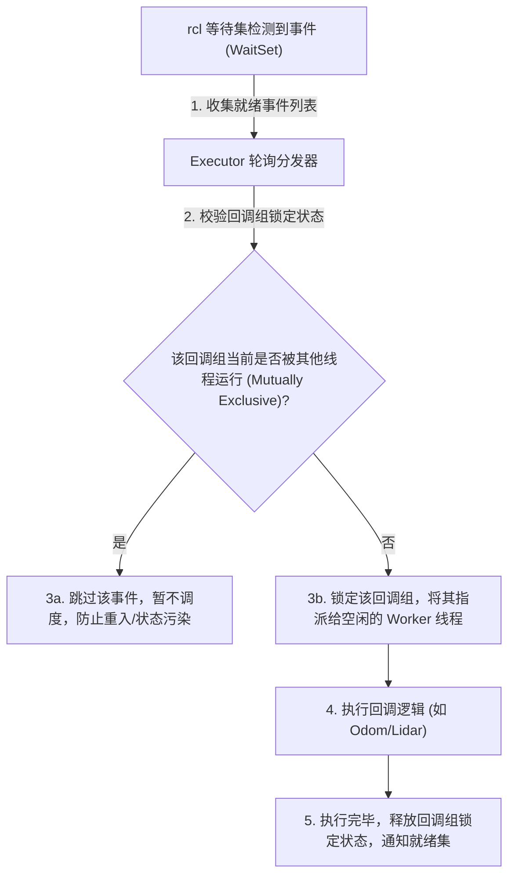
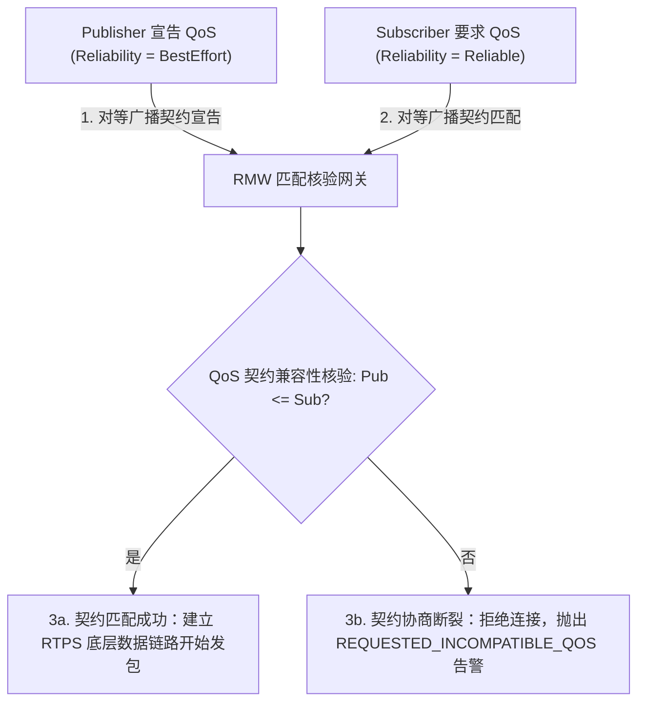
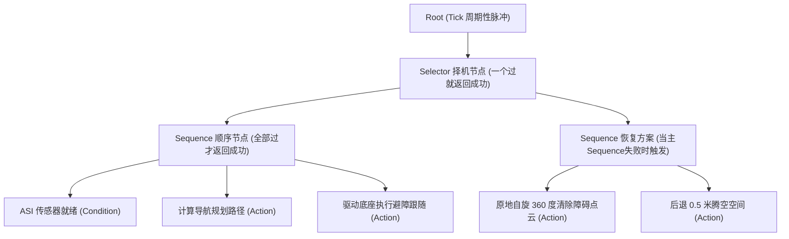
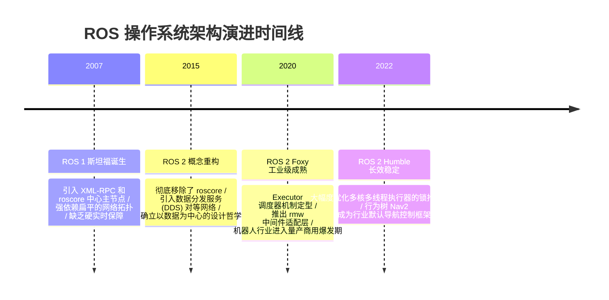

import CaseStudyHeader from '@site/src/components/CaseStudyHeader';
import DesignIntent from '@site/src/components/DesignIntent';
import ArchitectureEvolution from '@site/src/components/ArchitectureEvolution';
import TradeoffExplorer from '@site/src/components/TradeoffExplorer';
import GlossaryTerm from '@site/src/components/GlossaryTerm';
import ResearchNote from '@site/src/components/ResearchNote';
import QuizCard from '@site/src/components/QuizCard';
import CompareSlider from '@site/src/components/CompareSlider';
import GuidedExercise from '@site/src/components/GuidedExercise';
import PyRunner from '@site/src/components/PyRunner';

# ROS 2：去中心化 DDS 拓扑与实时机器人系统架构

<CaseStudyHeader
  oneLiner="ROS 2 彻底颠覆了 ROS 1 中心化主节点的缺陷，通过引入工业级 DDS 去中心化对等总线与 20 余种微调级 QoS，结合可预测执行器（Executor）回调组调度和 Nav2 层级行为树决策，为现代具身智能与自动驾驶构筑了硬实时、高吞吐的控制底座。"
  stats={[
    {label: '通信底座', value: '去中心化 DDS (数据分发服务)'},
    {label: '调度机制', value: 'Executor 执行器与 Callback Groups'},
    {label: '决策模型', value: 'Nav2 Behavior Trees (行为树)'},
    {label: '服务质量', value: 'Reliability / Durability / Deadline QoS'},
    {label: '实时特性', value: '硬实时优先级支持与零拷贝通信'}
  ]}
/>

:::info 对应课程概念
本案例横跨 [Month 1 进程间通信与异步消息队列](../foundations/programming-systems-primer)、[Month 4 低阶设计 (LLD) 与执行器模式](../foundations/programming-systems-primer)、[Month 6 分布式发布订阅与控制死线保障](../cloud-enterprise-industrial/capstone-cloud-native)。它将帮助架构师深刻理解在大型分布式的机器人与自动驾驶软硬件协作系统中，如何建立零单点故障（No SPOF）且高优先可控的流水线通道。
:::

## 1. 设计初衷：从“玩具操作系统”到“工业硬实时基座”

机器人系统（如自动驾驶、人形机器人、仓储 AGV）是由激光雷达、摄像头、轮式里程计等数十个硬件传感器及对应的路径规划、SLAM 建图等上百个软件算法节点构成的复杂分布式网络。

第一代 ROS（ROS 1）虽然极大地繁荣了机器人社区，但随着商用时代的到来，其架构暴露了三个致命的缺陷：
1. **中心化 Master 的单点故障（SPOF）**：ROS 1 依靠一个中央节点 `roscore` 进行全部地址检索注册。一旦 `roscore` 挂掉，整个机器人瞬间失控瘫痪。且 XML-RPC 通信效率低下。
2. **缺乏硬实时与确定性控制延迟**：在机器人底盘控制中，轮子打滑校正指令必须在几毫秒死线内送达。ROS 1 无法对线程和回调进行优先级强管控，容易因为 SLAM 算力过载饿死核心底盘控制线程。
3. **环境适应性极差（Wi-Fi 丢包卡顿）**：在真实仓库里，AGV 通过不稳定的工业 Wi-Fi 通信，ROS 1 无法为雷达点云与控制指令配置不同的 **<GlossaryTerm term="QoS" definition="Quality of Service (QoS)：服务质量配置。ROS 2 允许为每一个发布订阅管道单独定制通信规则，包含 Reliability（可靠性）、Durability（持久性）、Deadline（限期）等，用以适应不稳定 Wi-Fi 丢包或高频传感器数据传输。">QoS（服务质量）</GlossaryTerm>** 级别。

通过在 ROS 2 中引入工业级 **<GlossaryTerm term="DDS 发布订阅" definition="Data Distribution Service (DDS)：去中心化的工业级高可靠发布订阅通信标准。利用 DCPS（以数据为中心的发布订阅）模型，各节点基于 RTPS 动态自发现对等体，消除了中心注册服务器的单点故障。">DDS 发布订阅</GlossaryTerm>** 规范、**<GlossaryTerm term="Executor 调度器" definition="Executor：执行器。ROS 2 中负责处理消息到达事件、定时器时间并调度回调函数执行的组件。通过结合 Callback Groups 进行并发排他性约束，防止死锁并提供实时硬优先级保证。">Executor 执行器</GlossaryTerm>** 回调组机制以及 **<GlossaryTerm term="Nav2 行为树" definition="Behavior Trees (BT)：行为树。一种分层树状决策控制引擎，代替了传统复杂的有限状态机（FSM）。通过 Selector、Sequence 控制节点和 Action 叶子节点组织复杂的重定位、避障规划和故障恢复动作。">Nav2 行为树（Behavior Trees）</GlossaryTerm>**，机器人操作系统正式踏入工业级实时高可靠的大门。



<DesignIntent
  problem="如何构建一个无单点故障、可在恶劣 Wi-Fi 丢包环境下微调数据传输优先级，且能对上百个传感器回调执行确定性实时调度的分布式机器人控制总线？"
  users="自动驾驶算法专家、仓储机器人（AGV）系统架构师、具身智能人形机器人开发者，要求系统 100% 可靠、零通信死锁、且易于维护复杂的导航行为决策。"
  devices="搭载雷达、深度相机的自动驾驶汽车、工业搬运底盘、机械臂、人形机器人控制板。"
  goals={[
    '去中心化 DDS 整合：取消 roscore，通过对等动态发现（Peer Discovery）实现任意节点之间的拓扑直连。',
    'Callback Groups 与 Executor 调度：精细配置回调组，将耗时计算与高频控制回调隔开，防止互斥死锁，绑定系统实时线程。',
    '微调 QoS 策略匹配：为雷达点云配置 Best Effort（只管吞吐不管丢包），为急停指令配置 Reliable（保证到达）与 Transient Local。',
    '行为树决策路由：用层次化 Behavior Tree 调度导航重试、路径重规划和故障倒退（Recovery）动作，彻底告别状态机爆炸。'
  ]}
  constraints={[
    'DDS 中间件配置的极其复杂性：FastDDS 与 CycloneDDS 等不同实现存在配置参数差异，需要通过统一的 XML QoS 描述文件进行平台对齐。',
    '回调互斥组的死锁漏洞：如果两个高低频回调在同一个 Mutually Exclusive 回调组且互相存在 Service 调用，会引发 Executor 死锁，必须通过拆分组解耦。'
  ]}
  firstStep="划分 rclcpp 节点与 Callback Group 边界；配置 DDS 的 XML 模板以设定 Reliable 属性；在 Nav2 中设计基于 BehaviorTree.CPP 的基本 Sequence 逻辑结构。"
/>

## 2. 系统功能全景

以下是 ROS 2 机器人分布式操作系统技术组成的全景图：



---

## 3. 最新架构总览

ROS 2 的整体控制拓扑与数据穿透层级划分如下：

### 3a. System Context (系统上下文)


### 3b. Container Diagram (容器架构)



---

## 4. 核心机制拆解

### 4a. ROS 1 中心化注册拓扑 vs ROS 2 去中心化 DDS 拓扑比较

在 ROS 1 中，如果中心注册器崩溃，系统将失去容错力。ROS 2 采用去中心化 DDS 彻底消除了 SPOF：



### 4b. Executor 执行器调度模型与 Callback Groups

ROS 2 不像 ROS 1 那样依靠全局无序的回调线程池，而是引入了可控的 **Executor 执行器** 模型，通过 **Callback Groups** 控制并发和死锁：
1. **Callback Groups（回调组分类）**：
   - **Mutually Exclusive（互斥组）**：同一组内的回调在同一时间只能被一个线程执行。常用于保障顺序、防止状态污染的传感器数据流。
   - **Reentrant（可重入组）**：同一组内的回调可以被多个线程并发执行。常用于复杂的 Action/Service 处理，以防调用死锁。
2. **死锁成因与防御**：
   - 如果一个 Service 服务端的回调与发起呼叫的回调都在同一个 **Mutually Exclusive** 回调组内，当发起呼叫被触发时它占用了组互斥锁，但它又需要等待同一个组的服务端响应。由于组锁无法被释放，服务端永远无法执行，最终触发**永久死锁**。
   - *防御对策*：在多线程执行器（`MultiThreadedExecutor`）中，必须将 Service 的呼叫方与接收方拆分到不同的回调组，或设为 **Reentrant** 组，从而让执行器空闲 Worker 线程能并发进入临界区解锁。



### 4c. DDS 协议中的细粒度 QoS 策略契约 (Compatibility Negotiation)

DDS 通信的核心在于发布者（Publisher）与订阅者（Subscriber）之间必须达成 QoS 契约匹配（RxO 契约模型）：



- **QoS 级别说明**：
  - `Reliable`（可靠）比 `Best Effort`（尽力而为）具有更高的服务保障度。因此，如果订阅者强硬要求 `Reliable`（必须收到），而发布者仅声明 `Best Effort`（可能丢包），契约不匹配，连接将被强行阻断。

### 4d. Nav2 行为树导航控制逻辑 (Behavior Trees)

行为树是 ROS 2 机器人控制中取代有限状态机（FSM）的精髓。其核心逻辑节点定义如下：



- **Tick 机制**：行为树以固定频率（例如 10Hz）向整棵树的根节点发送 Tick 脉冲。Tick 信号向下传导。当主路径 `FollowPath` 遭遇行人的阻挡返回 `Failure` 时，`Selector` 节点捕获失败，立刻将控制流转移给 `RecoverySequence`（恢复行为），命令底盘原地打转清除雷达噪点，实现了高度解耦且可扩展的机器人故障自愈决策逻辑。

---

## 5. 关键数据结构与算法：QoS 配置契约数据

在 ROS 2 中，QoS 是用专门的策略结构体定义的（在 `rclcpp/qos.hpp` 中）：

```cpp
struct rmw_qos_profile_t {
    enum rmw_qos_reliability_policy_t reliability; // 可靠性 (RELIABLE / BEST_EFFORT)
    enum rmw_qos_history_policy_t history;         // 历史缓冲 (KEEP_LAST / KEEP_ALL)
    size_t depth;                                  // 缓冲深度 (大小为 N 的队列)
    enum rmw_qos_durability_policy_t durability;   // 持久性 (TRANSIENT_LOCAL / VOLATILE)
};
```

*设计用意*：
- 依靠此结构体的发布/订阅对称核验（RxO 模型），ROS 2 使得大体量的视频流（Best Effort）能与极小包的刹车急停指令（Reliable + Depth 1 + Transient Local）并发在同一个以太网物理介质上，避免了网络缓冲区被雷达数据冲垮而导致控制指令延迟。

---

## 6. 架构演进史

ROS 操作系统经历了从单机协作到去中心化工业实时性的重大跃迁：



---

## 7. 架构对比

### ROS 1 中心化 roscore 拓扑 vs ROS 2 去中心化 DDS 拓扑

<CompareSlider
  before={
    <div style={{ padding: '20px', background: '#ffebee', border: '1px solid #c62828', borderRadius: '8px', height: '100%', color: '#333' }}>
      <strong>ROS 1 中心化注册模式 (roscore)</strong>
      <p style={{ marginTop: '10px', fontSize: '0.9rem' }}>
        所有的节点启动时，必须先将自身的 IP 地址与发布/订阅的话题（Topics）注册进中央的 `roscore` 中。当机器人发生强烈震动导致控制板瞬间复位或 `roscore` 内存溢出挂掉时，整个机器人立刻失去通信能力，陷入死锁。
      </p>
    </div>
  }
  after={
    <div style={{ padding: '20px', background: '#e8f5e9', border: '1px solid #2e7d32', borderRadius: '8px', height: '100%', color: '#333' }}>
      <strong>ROS 2 去中心化对等模式 (DDS RTPS)</strong>
      <p style={{ marginTop: '10px', fontSize: '0.9rem' }}>
        取消中央注册节点。各个节点借助 RTPS 对等组播协议在局域网内动态自寻路。节点间直接通过对等网络直接握手并匹配 QoS 规则。任何一个无关节点崩溃，均不波及其他节点的正常消息通路，具有极高的故障容错率。
      </p>
    </div>
  }
  labels={['ROS 1 中心化 roscore', 'ROS 2 去中心化 DDS']}
/>

---

## 8. 核心决策的取舍

在不同机器人应用场景中，架构师对 DDS QoS 的配置需要进行细粒度微调：

<TradeoffExplorer
  title="ROS 2 通信 QoS 服务质量配置取舍"
  dimensions={['防止高频数据溢出挤占总线', '数据帧传输的 100% 绝对接收', '新加入订阅者读取历史的能力', '极端丢包弱网下的连贯性', 'CPU 与内存缓冲区的开销']}
  options={[
    {
      name: '尽力而为传输配置 (Best Effort - 雷达/相机模式)',
      scores: [5, 1, 1, 5, 5],
      note: '可靠性 policy 设为 `Best Effort`，不使用重传机制，丢包直接忽略。极大程度保护了网卡带宽和 CPU，防止高频点云阻塞急停信道。但缺点是订阅端无法保证获得每一帧图片，可能出现跳帧。',
      whenToUse: '高频激光雷达（Lidar）、深度相机视频流、超声波测距传感器等允许少量丢包但要求低延迟的数据流。'
    },
    {
      name: '可靠传输与历史快照配置 (Reliable + Transient Local - 地图模式)',
      scores: [2, 5, 5, 2, 2],
      note: '可靠性设为 `Reliable`，并开启持久性为 `Transient Local`。当发送端更新地图后，历史数据缓存在发送节点内存中。新拉起的定位节点一旦订阅，无需等待下次地图更新，能瞬间获取历史最新地图。缺点是占用发送端内存缓冲空间。',
      whenToUse: '静态地图发布（map）、导航路径规划话题（path）、系统配置参数广播（parameters）。'
    },
    {
      name: '急停硬死线低深度配置 (Reliable + Deadline + Depth 1 - 控制急停模式)',
      scores: [3, 5, 2, 1, 4],
      note: '可靠性设为 `Reliable`，但将缓冲队列深度（Depth）设为仅 1。这意味着发送端如果有最新指令，会瞬间覆盖掉队列中没来得及发送的旧控制帧，保证刹车急停指令拥有最新物理优先级，且配置 `Deadline` 监测防断连。',
      whenToUse: '机器人底盘电机控制速度指令（cmd_vel）、安全急停锁触发信号（estop）。'
    }
  ]}
/>

---

## 9. 实践指引：实现一个带互斥组锁校验的 ROS 2 Executor 调度仿真

理解 ROS 2 调度机制的核心在于掌握 Executor 如何管理并发的回调事件，并利用互斥组（Mutually Exclusive Callback Groups）避免同一个组的回调被多线程重入。

<GuidedExercise
  title="练习指引：编写带 Callback Group 锁防御的 Executor 轮询执行器"
  goal="构建微型 Executor 调度器。模拟两个高频就绪事件（Odometry 与 IMU）同属于互斥组 SensorGroup，以及一个建图事件属于独立组 SlamGroup。模拟两个 Worker 线程并发调度：Worker 1 抢占执行 Odom 并给组上锁后，Worker 2 必须被强行阻断并跳过 IMU，先去调度 SLAM，并在 Worker 1 释放后才允许运行 IMU，以此防范多线程重入破坏状态机。"
  hints={[
    '你可以为回调定义布尔属性 `is_mutually_exclusive = True`，并在 Executor 中维护一个字典 `self.running_groups = {}` 追踪组锁定状态。',
    '就绪列表可以使用 `ready_callbacks = [...]`，Executor 调度时遍历该就绪集，找到第一个其回调组没有被锁定的回调执行。'
  ]}
  steps={[
    '创建 `ROS2Callback` 回调定义类，配置其所属的 group_id 以及互斥标志。',
    '实现 `ROS2ExecutorSimulator` 核心调度器。',
    '编写 `add_callback_to_waitset()` 模拟 WaitSet 收到就绪通知。',
    '实现 `execute_one_ready_callback(worker_id)`：扫描就绪集，核验互斥组锁，若组锁激活则跳过该回调，选中无锁回调执行并锁定其对应组。',
    '模拟多线程并发触发，直观核验同组互斥保护和跨组并行调度。'
  ]}
  checks={[
    '当 SensorGroup 被 Worker 1 占用时，Worker 2 应当能理智地避开 IMU 回调，直接调度运行 SlamGroup 回调。',
    '在 Worker 1 完成释放锁后，再次执行调度时，IMU 回调能被成功拾取并运行。'
  ]}
/>

#### 交互式 Python 运行实验
在下方控制台中调试 ROS 2 执行器仿真代码，查看互斥回调组是如何在多线程环境下提供安全防火墙的：

<PyRunner
  expect="互斥回调组多线程隔离验证成功"
  rows={25}
  code={`class ROS2Callback:
    def __init__(self, name: str, group_id: str, is_mutually_exclusive: bool = True):
        self.name = name
        self.group_id = group_id
        # 是否为互斥回调组 (同一组的回调不能被多个线程并行执行)
        self.is_mutually_exclusive = is_mutually_exclusive
        
class ROS2ExecutorSimulator:
    def __init__(self):
        # 对应 ROS 2 的等待集就绪队列 (WaitSet)
        self.ready_callbacks = []
        # 当前正在执行的回调组锁: group_id -> bool (True 代表该组正在执行)
        self.running_groups = {}
        
    def add_callback_to_waitset(self, cb: ROS2Callback):
        self.ready_callbacks.append(cb)
        print(f"[WaitSet] 检测到事件到达：已将回调 '{cb.name}' (组: {cb.group_id}) 挂入就绪集")

    def execute_one_ready_callback(self, worker_thread_id: int) -> bool:
        # 从就绪列表中挑选一个当前可安全执行的回调
        selected_cb = None
        
        for cb in self.ready_callbacks:
            # 互斥组检查：如果该 Callback Group 已经在被其他线程运行，必须跳过以防重入 Bug / 死锁
            if cb.is_mutually_exclusive and self.running_groups.get(cb.group_id, False):
                print(f"   [Lock Skip] Worker {worker_thread_id} 跳过了回调 '{cb.name}' (原因: 同组 '{cb.group_id}' 已被锁定)")
                continue
            
            selected_cb = cb
            break
            
        if selected_cb is None:
            print(f"[Executor - Worker {worker_thread_id}] 轮询完毕，无当前就绪且无锁的可执行回调")
            return False
            
        # 从等待集中移除并开始运行
        self.ready_callbacks.remove(selected_cb)
        if selected_cb.is_mutually_exclusive:
            self.running_groups[selected_cb.group_id] = True
            
        print(f"[Executor - Worker {worker_thread_id}] >>> 开始执行回调 '{selected_cb.name}' (组: {selected_cb.group_id})")
        
        # 模拟运行一瞬间后结束，释放组锁
        if selected_cb.is_mutually_exclusive:
            self.running_groups[selected_cb.group_id] = False
            
        print(f"[Executor - Worker {worker_thread_id}] <<< 完成回调 '{selected_cb.name}'，释放组锁")
        return True

# 运行验证
executor = ROS2ExecutorSimulator()

print("--- 开始 ROS 2 Executor 回调组互斥调度仿真 ---")
# 1. 声明两个互斥回调，同属于一个 "SensorGroup"
cb_odom = ROS2Callback("Odometry_Callback", group_id="SensorGroup", is_mutually_exclusive=True)
cb_imu = ROS2Callback("IMU_Callback", group_id="SensorGroup", is_mutually_exclusive=True)

# 2. 声明另一个独立组的回调 "SlamGroup"
cb_slam = ROS2Callback("SLAM_Mapping_Callback", group_id="SlamGroup", is_mutually_exclusive=True)

# 3. 模拟大量高频消息同时到达 WaitSet
executor.add_callback_to_waitset(cb_odom)
executor.add_callback_to_waitset(cb_imu)
executor.add_callback_to_waitset(cb_slam)

# 4. 模拟多线程执行器 (Worker 1 和 Worker 2) 并行抢占式调度
# Worker 1 抢占执行了 odom，锁定 SensorGroup 组
print("\\n--- Worker 1 开始执行，SensorGroup 组上锁 ---")
executor.execute_one_ready_callback(worker_thread_id=1)

# 此时 Worker 2 企图调度，由于 SensorGroup 上锁，它应跳过 IMU，直接调度 SLAM 任务
print("\\n--- Worker 2 在 Worker 1 释放前调度，因 SensorGroup 上锁而跳过 IMU，执行 SLAM ---")
executor.execute_one_ready_callback(worker_thread_id=2)

# 最后再次触发调度，此时剩余的 IMU 能够被成功执行
print("\\n--- 再次调度，执行剩余的回调 ---")
executor.execute_one_ready_callback(worker_thread_id=1)
print("[Gate] 互斥回调组多线程隔离验证成功")
`}
/>

---

## 10. 知识自测

完成自测以检验你对 ROS 2 DDS 去中心化、QoS 匹配契约、Executor 回调调度及行为树导航的理解程度：

<QuizCard
  questions={[
    {
      q: 'ROS 2 彻底取消了 ROS 1 的 roscore 中心主节点，采取去中心化 DDS 数据分发服务作为底座，其带来的最根本技术收益是什么？',
      options: [
        'A. 系统代码行数压缩了十倍，开发门槛大大降低',
        'B. 消除了中心主节点的单点故障（SPOF）风险，任何节点崩溃不会波及其他直连节点的通信，并且基于组播对等发现（RTPS）实现了高度可靠的网状直连拓扑',
        'C. 使得机器人可以不使用以太网进行传输，完全转为串口物理连接',
        'D. 强迫所有的机器人必须运行在云端服务器中'
      ],
      answer: 1,
      explain: '这是去中心化架构的核心价值。取消了 roscore 锁死整机通信的死穴，各节点通过 DDS RTPS 对等组播实现运行时自寻址和拓扑直连通信，极大地提升了系统的故障隔离度和容错能力。'
    },
    {
      q: '在 ROS 2 Executor 回调组（Callback Groups）设计中，将“服务呼叫回调”与“服务处理回调”放在同一个 Mutually Exclusive 回调组会引发什么严重后果？',
      options: [
        'A. 机器人轮子的转速会无规律地加倍',
        'B. 导致点云地图文件在保存时丢失全部色彩信息',
        'C. 当发起呼叫时，它获取了该互斥组的锁并挂起等待服务端，而由于组锁未释放，同组的服务处理回调永远无法被 Worker 线程执行，从而引发永久性线程死锁',
        'D. 系统会在一秒内强行占用 100% 的 CPU 并导致内核蓝屏'
      ],
      answer: 2,
      explain: '这是典型的回调死锁成因。Mutually Exclusive 组在同一时刻仅允许一个 Worker 线程进入。等锁和拿锁在同一个互斥上下文里发生了循环等待，造成了经典的执行器内卡死，需要拆分为 Reentrant 组或独立组。'
    },
    {
      q: 'ROS 2 导航控制框架 Nav2 采用行为树（Behavior Trees）替代 ROS 1 传统有限状态机（FSM）的重大工程考量在哪里？',
      options: [
        'A. 状态机在面临“避障、丢失重规划、自旋恢复、后退”等多节点复合导航逻辑时，会导致状态连线爆炸，极难维护；而行为树具备天然的分层模块化和回退（Recovery）机制，通过 Tick 脉冲实现了高内聚低耦合的控制逻辑',
        'B. 行为树允许机器人不需要配置任何物理驱动即可直接在地面上漂移',
        'C. 有限状态机的运行速度是行为树的百分之一，耗电极大',
        'D. 行为树只是一张纯静态的思维导图，运行期不需要消耗任何 CPU'
      ],
      answer: 0,
      explain: '行为树解决了“状态爆炸（State Explosion）”难题。它通过 Sequence/Selector 组合叶子动作，并提供内置的回退树（Recovery Branches）。当主任务失败时，Tick 信号自动流向恢复动作，实现了清晰、高弹性的决策逻辑。'
    }
  ]}
/>

<ResearchNote
  title="去掉 Master:DDS 让节点自己发现彼此"
  source="ROS 2 设计文档"
  href="https://design.ros2.org/"
  insight="ROS 1 的中心 Master 是单点;ROS 2 换成 DDS,节点靠分布式发现协议自动组网,发布订阅带 QoS(可靠性、时限、历史),无中心也能在实时/弱网下协商通信契约。"
  application="架构启示:去中心化的代价是发现与一致性协议更复杂,收益是没有单点、可按 QoS 精细匹配供需——机器人这类高可靠场景值这个复杂度。"
/>

## 来源

- [ROS 2 Design Patterns and DDS Middleware Specifications (Open Source Robotics Foundation - OSRF)](https://design.ros2.org/)
- [rclcpp: ROS 2 Client Library for C++ API reference and Executor Scheduling (ROS humbler docs)](https://docs.ros2.org/latest/api/rclcpp/)
- [DDS in Robotics: Performance Evaluation of eProsima FastDDS and CycloneDDS (DDS Foundation whitepaper)](https://www.eprosima.com/)
- [Behavior Trees in Robotics and AI: An Introduction (Michele Colledanchise and Petter Ögren)](https://arxiv.org/abs/1709.00084)