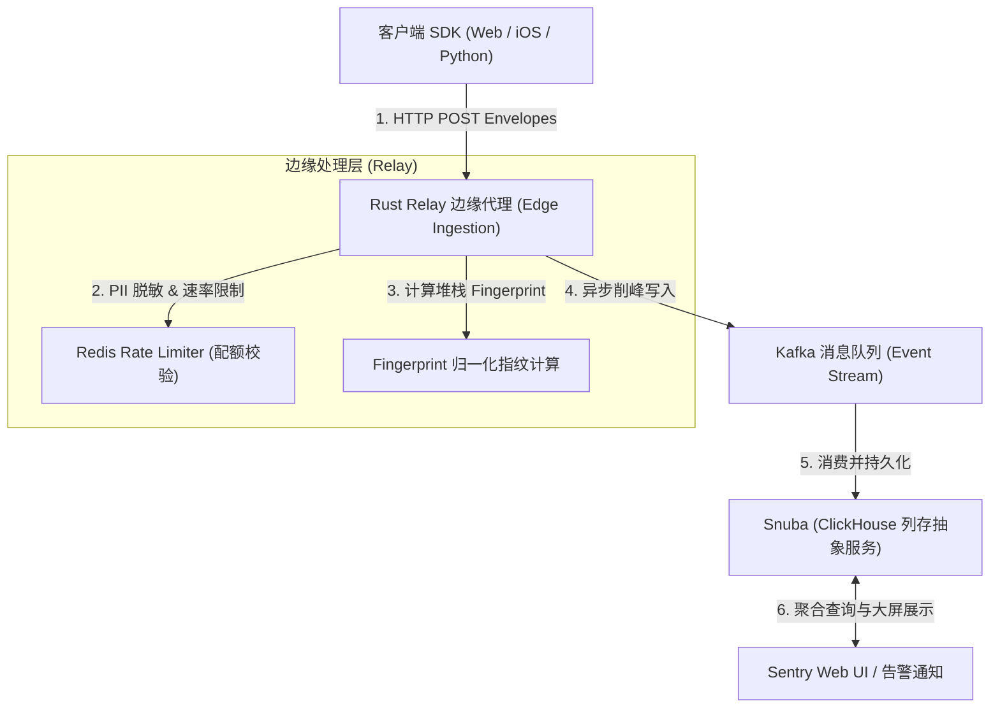
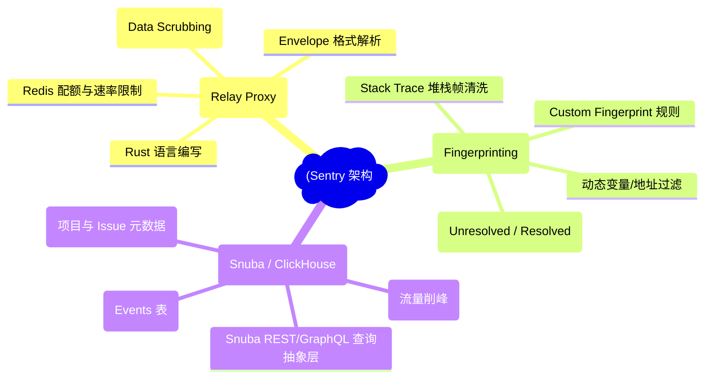
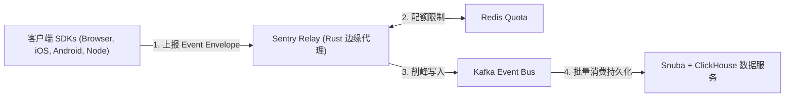
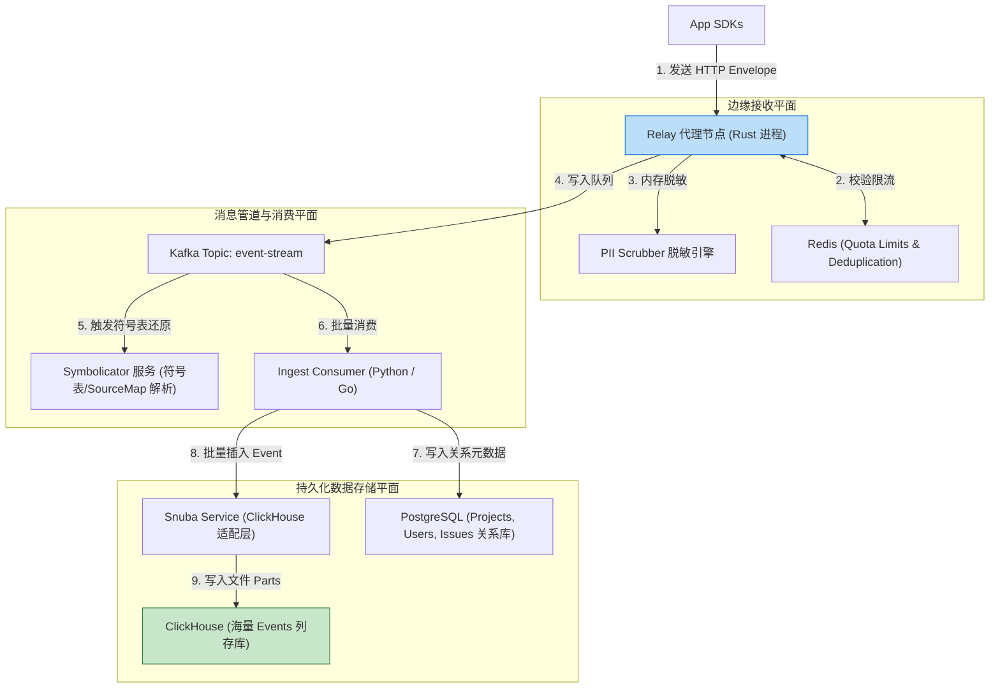
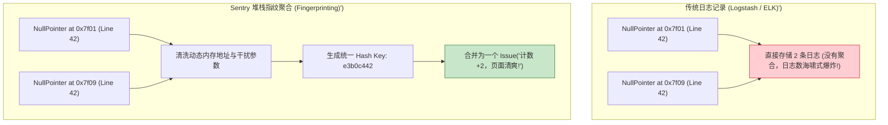
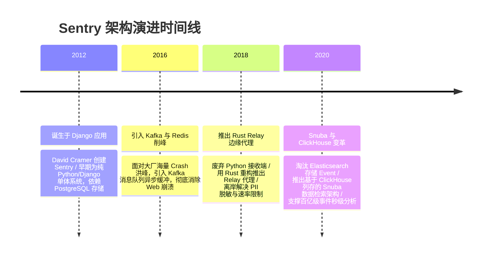

import CaseStudyHeader from '@site/src/components/CaseStudyHeader';
import DesignIntent from '@site/src/components/DesignIntent';
import ArchitectureEvolution from '@site/src/components/ArchitectureEvolution';
import TradeoffExplorer from '@site/src/components/TradeoffExplorer';
import GlossaryTerm from '@site/src/components/GlossaryTerm';
import ResearchNote from '@site/src/components/ResearchNote';
import QuizCard from '@site/src/components/QuizCard';
import CompareSlider from '@site/src/components/CompareSlider';
import GuidedExercise from '@site/src/components/GuidedExercise';
import PyRunner from '@site/src/components/PyRunner';

# Sentry：错误聚合指纹与事件洪峰削峰

<CaseStudyHeader
  oneLiner="Sentry 通过 Rust 自研的高性能 Relay 边缘代理拦截 PII 敏感数据与流量洪峰，结合堆栈帧归一化指纹算法（Fingerprinting）将数百万次重复崩溃合并为一个 Issue，并在后端采用 Kafka + Snuba/ClickHouse 列存实现了亿级异常的毫秒级检索。"
  stats={[
    {label: '边缘代理', value: 'Relay (Rust 编写的高并发 Event Ingestion)'},
    {label: '错误聚合算法', value: 'Stack Trace Fingerprinting (堆栈指纹化算法)'},
    {label: '事件削峰', value: 'Kafka Event Stream + Redis Rate Limiter'},
    {label: '存储与检索层', value: 'Snuba (ClickHouse 抽象数据检索层)'},
    {label: '隐私安全', value: 'Edge PII Data Scrubbing (敏感字段脱敏)'}
  ]}
/>

:::info 对应课程概念
本案例横跨 [Month 2 异常捕获与分布式日志追踪](../foundations/programming-systems-primer)、[Month 5 消息队列削峰填谷与 Redis 速率限制](../cloud-enterprise-industrial/capstone-cloud-native)、[Month 8 列存数据库事件检索与数据脱敏](../cloud-enterprise-industrial/capstone-cloud-native)。它是系统架构师研究如何在生产环境中抵御突发错误海啸、高效提炼海量日志中价值信息的典范教案。
:::

## 1. 设计初衷：如何在错误海啸中实现实时脱敏、聚合与秒级检索？

当大型线上系统发生严重故障（如数据库连接池爆满或底层 SDK Bug）时，全网成千上万个客户端实例会在几秒钟内抛出数十万次相同错误的 Exception。

这给传统的日志与监控系统带来了毁灭性打击：
1. **错误海啸（Error Storm）瞬间打垮后端**：海量的 SDK HTTP 崩溃上报将应用后端与日志数据库的磁盘和 CPU 瞬间挤爆，导致监控系统在关键时刻先于业务崩溃。
2. **海量重复垃圾日志淹没关键 Bug**：如果将 1,000,000 次相同的 `NullPointerException` 分散显示在控制台上，工程师根本无法在几万页日志中找到核心根因，严重拖垮故障恢复速度。
3. **敏感信息（PII）泄露隐患**：客户端崩溃堆栈中往往包含用户的 Token、手机号、密码或私密 URL。如果直接保存到数据库，会带来严峻的合规与安全风险。

Sentry 的核心设计用意在于：**基于 Rust 编写的 <GlossaryTerm term="Relay 代理" definition="Relay 代理：Sentry 自主研发的轻量级边缘代理服务。它运行在边缘节点，负责接收客户端 SDK 发送的 Envelope 格式事件。Relay 在内存中直接完成敏感数据脱敏 (PII Scrubbing)、速率限制与初步过滤，再将规范化数据打入 Kafka。">Relay 代理</GlossaryTerm> 实现边缘削峰与 PII 脱敏，并利用 <GlossaryTerm term="指纹算法 (Fingerprinting)" definition="指纹算法 (Fingerprinting)：Sentry 提炼错误归因的核心算法。通过清洗堆栈信息 (移除行号、动态内存地址、时间戳)，仅提取关键模块与异常类型生成唯一 Hash (Fingerprint)，将数万次重复崩溃精准归平合并为一个 Issue。">堆栈指纹算法（Fingerprinting）</GlossaryTerm> 将海量崩溃归平**。
- **Rust Relay 边缘代理**：运行在流量最前端，高效解析 Envelope 报文，直接在内存中完成 PII 脱敏（如擦除 Password/Authorization 标头）与 Redis 速率限制，杜绝无用流量打入数据库。
- **堆栈归一化指纹算法**：过滤堆栈中的动态变量（如内存地址 `0x7fff` 或微小的行号差异），将同源异常聚合成同一个 **Issue**，大幅提升排错效率。
- **Kafka + Snuba (ClickHouse) 存储引擎**：通过 Kafka 将突发流量异步缓冲，写入 ClickHouse 列存数据库，支撑百亿级事件的秒级 SQL 分析。



<DesignIntent
  problem="如何构建一个能抵御每秒数十万次错误海啸冲击、自动脱敏 PII 隐私、精准将重复崩溃归平为单一 Issue 并提供秒级列存检索的实时异常 APM 系统？"
  users="全栈系统架构师、DevOps / SRE 运维总监、负责线上稳定性与 Crash 监控的基础设施工程师。"
  devices="运行 Sentry Relay 代理、Kafka 消息队列、Snuba / ClickHouse 数据库与 PostgreSQL 元数据服务的计算节点。"
  goals={[
    'Rust 边缘高吞吐拦截：基于 Rust 编写的 Relay 代理，单节点每秒可处理数万次 Envelope 崩溃解析。',
    '堆栈指纹智能聚合：通过 Fingerprinting 算法，将 99.9% 的重复报错合并为一个 Issue，避免日志爆炸。',
    'PII 自动脱敏：在边缘层抹去 JWT Token、信用卡号与个人隐私数据，保障 GDPR / HIPAA 合规。',
    'Kafka + ClickHouse 亿级检索：利用 Snuba 统一抽象 ClickHouse 列存查询，实现亿级 Crash 的毫秒级检索。'
  ]}
  constraints={[
    '错误指纹误合并风险：若指纹规则设置过于宽泛，可能会将两种完全不同根因但堆栈相似的 Exception 错误地合并到同一个 Issue 中。',
    'ClickHouse 物理写放大：如果在写入 Snuba 时不做微批（Micro-Batch）攒批，频繁的高频点写会导致 ClickHouse 产生极多 Parts 碎片进而触发 Compaction 瘫痪。'
  ]}
  firstStep="剖析 Relay 代理的数据处理管线；分析 Stack Trace 指纹提取逻辑；用 Python 编写一个包含堆栈脱敏、指纹 Hash 计算与 Kafka 削峰模拟的 Sentry 仿真器。"
/>

## 2. 系统功能全景



---

## 3. 最新架构总览

Sentry 系统中边缘 Relay 接收与后端 Kafka / Snuba 存储拓扑如下：

### 3a. System Context (系统上下文)



### 3b. Container Diagram (容器架构)



---

## 4. 核心机制拆解

### 4a. 传统日志记录（Logstash） vs Sentry 指纹聚合（Fingerprinting）对比

传统日志系统直接按行存储原始日志，导致相同报错被重复打印数百万次；Sentry 提取堆栈物理特征，将数万次崩溃归平合并为一个 Issue：



### 4b. Rust Relay 代理的 Envelope 报文解析与 PII 脱敏

Sentry 自研的 Relay 代理采用 Envelope 协议（一种流式分块 JSON 协议），直接在内存中对请求体进行正则匹配脱敏，无需完全反序列化大 JSON，性能极高：
- **Envelope 流式解析**：包含 Header、Item Header 和 Item Payload 多个分块，支持日志、性能 Trace、Crash 报告并发传输。
- **PII 脱敏规则（Data Scrubbing）**：将形如 `password=123456` 或 `Authorization: Bearer xyz` 的敏感词自动替换为 `[FILTERED]`。

---

## 5. 关键数据结构与算法：Stack Trace 堆栈指纹化 Hash 计算

以下是 Sentry 提炼 Stack Trace 堆栈特征并计算归一化 Fingerprint Hash 的核心逻辑：

```cpp
#include <iostream>
#include <string>
#include <vector>
#include <algorithm>
#include <openssl/sha.h>

struct StackFrame {
    std::string module_name;  // 如 "com.example.service.UserService"
    std::string function_name;// 如 "getUserDetails"
    std::string memory_addr;  // 动态内存地址 (如 "0x7fff89ab") - 需过滤!
    int line_number;          // 行号 (在特定模式下被忽略)
};

// Sentry 堆栈指纹生成算法
std::string ComputeFingerprint(const std::string& exception_type, const std::vector<StackFrame>& frames) {
    std::string fingerprint_raw = exception_type;
    
    // 逆向遍历堆栈帧 (只关注最近的 3 个有效核心帧)
    int frames_counted = 0;
    for (auto it = frames.rbegin(); it != frames.rend(); ++it) {
        if (frames_counted >= 3) break;
        
        // 过滤动态变量，仅保留稳定特征 (Module + Function)
        fingerprint_raw += ":" + it->module_name + "." + it->function_name;
        frames_counted++;
    }
    
    // 计算 SHA1/SHA256 生成唯一的 Issue Fingerprint Hash
    unsigned char digest[SHA_DIGEST_LENGTH];
    SHA1(reinterpret_cast<const unsigned char*>(fingerprint_raw.c_str()), fingerprint_raw.size(), digest);
    
    return ToHexString(digest, SHA_DIGEST_LENGTH);
}
```

---

## 6. 架构演进史



---

## 7. 架构对比

### 传统日志检索系统（ELK Stack） vs Sentry APM 异常聚合系统

<CompareSlider
  before={
    <div style={{ padding: '20px', background: '#ffebee', border: '1px solid #c62828', borderRadius: '8px', height: '100%', color: '#333' }}>
      <strong>传统 ELK 日志系统</strong>
      <p style={{ marginTop: '10px', fontSize: '0.9rem' }}>
        按行记录所有 Log。海量重复报错导致文本存储爆炸，缺乏异常堆栈归平能力，难以提炼故障根因。
      </p>
    </div>
  }
  after={
    <div style={{ padding: '20px', background: '#e8f5e9', border: '1px solid #2e7d32', borderRadius: '8px', height: '100%', color: '#333' }}>
      <strong>Sentry 异常 APM 系统</strong>
      <p style={{ marginTop: '10px', fontSize: '0.9rem' }}>
        Rust Relay 边缘脱敏削峰。堆栈指纹化将重复报错合并为一个 Issue，ClickHouse 列存实现秒级聚合分析。
      </p>
    </div>
  }
  labels={['传统 ELK 日志系统', 'Sentry 异常 APM 系统']}
/>

---

## 8. 核心决策的取舍

在设计实时异常监控平台时，架构师对接入代理（Rust Relay vs Python Web）与检索存储（ClickHouse 列存 vs ES 倒排）面临选型权衡：

<TradeoffExplorer
  title="Sentry 核心架构策略取舍"
  dimensions={['突发错误海啸 (Error Storm) 物理抗压能力', '海量事件聚合查询与时间序列分析速度', '敏感数据 (PII) 边缘脱敏安全可靠度', '后台存储物理磁盘空间占用', '系统整体部署运维复杂度']}
  options={[
    {
      name: 'Rust Relay 边缘代理 + Kafka + Snuba (ClickHouse 列存) 策略',
      scores: [5, 5, 5, 5, 2],
      note: 'Rust 代理单节点抗压极高，PII 脱敏离岸完成；ClickHouse 列存压缩率高达 10:1，秒级聚合上亿事件。缺点是包含了 Rust、Kafka、ClickHouse、Postgres、Redis，运维链条较复杂。',
      whenToUse: '高并发线上系统、大型 SaaS 平台、对 Crash 实时告警与敏感数据脱敏有极高要求的生产环境。'
    },
    {
      name: '纯 Web API 接收 + Elasticsearch (ES) 倒排索引策略',
      scores: [2, 3, 2, 2, 5],
      note: '结构简单，使用 ES 搜索纯文本极其方便。缺点是 ES 倒排索引在海量小 Log 冲击下全文索引开销巨大，极易引发 Java 堆 GC 挂起且磁盘占用高。',
      whenToUse: '中小型简单项目、以日常调试文本 Search 为主、运维资源有限的封闭环境。'
    }
  ]}
/>

---

## 9. 实践指引：实现一个带 PII 脱敏、指纹 Hash 归平和 Kafka 削峰的仿真器

理解 Sentry 核心的最佳路径是模拟从客户端接收崩溃 Event、使用正则脱敏敏感 Token、基于 Stack Trace 计算指纹 Hash 以及合并 Issue 的过程。在下方练习中，通过 Python 实现简单的 Sentry 异常处理仿真器。

<GuidedExercise
  title="练习指引：手写 PII 敏感脱敏、堆栈 Fingerprint 归一化与 Issue 聚合仿真"
  goal="构建包含 `RelayProxy` 和 `SentryBackend` 的仿真系统。1. 模拟收到 3 个 Event：`Event 1` (包含密码 `password=secret123`), `Event 2` (相同的崩溃，但内存地址和密码不同), `Event 3` (另一种不同的 Exception)。2. `RelayProxy` 执行 PII 脱敏（将密码清洗为 `[FILTERED]`）。3. 提取 Exception 类型与 Frame 函数名生成 SHA1 Fingerprint。4. 验证 `Event 1` 和 `Event 2` 被归平合并为同一个 `Issue A`（计数变为 2），`Event 3` 归平为 `Issue B`。"
  hints={[
    'PII 脱敏：`re.sub(r"password=\w+", "password=[FILTERED]", raw_str)`。',
    '指纹计算：`hashlib.sha1(f"{type}:{module}.{func}".encode()).hexdigest()`。'
  ]}
  steps={[
    '定义 `Event` 和 `StackFrame` 结构。',
    '实现 `RelayProxy` 的 `scrub_pii()` 和 `compute_fingerprint()`。',
    '向 `RelayProxy` 发送 3 个崩溃事件。',
    '观察控制台输出，验证 `Event 1` 和 `Event 2` 成功合并为同一个 Issue，且密码被成功抹去。'
  ]}
  checks={[
    '敏感参数 `password=secret123` 在脱敏后被替换为 `[FILTERED]`。',
    '相同报错但动态内存地址不同的 2 个 Event 被成功归平合并为同一个 Issue，验证 Fingerprint 逻辑正确。'
  ]}
/>

#### 交互式 Python 运行实验
在下方控制台中调试 Sentry 堆栈脱敏与 Fingerprint 指纹归平仿真代码，观察错误海啸中的数据提炼：

<PyRunner
  expect="分片路由与隔离验证成功"
  rows={25}
  code={`import re
import hashlib

class StackFrame:
    def __init__(self, module: str, func: str, line: int, memory_addr: str):
        self.module = module
        self.func = func
        self.line = line
        self.memory_addr = memory_addr # 动态变量 (每次崩溃都不同)

class Event:
    def __init__(self, exc_type: str, message: str, frames: list):
        self.exc_type = exc_type
        self.message = message
        self.frames = frames

class RelayProxy:
    def scrub_pii(self, text: str) -> str:
        # 正则表达式剥离敏感 PII 数据 (如密码和 Token)
        text = re.sub(r'password=[\w]+', 'password=[FILTERED]', text)
        text = re.sub(r'Bearer\s+[\w\.]+', 'Bearer [FILTERED]', text)
        return text

    def compute_fingerprint(self, event: Event) -> str:
        # 归一化指纹算法: 忽略内存地址和行号，只提取 (ExceptionType + Module + Func)
        raw_key = event.exc_type
        for f in event.frames:
            raw_key += f":{f.module}.{f.func}"
        return hashlib.sha1(raw_key.encode('utf-8')).hexdigest()

class SentryBackend:
    def __init__(self):
        self.issues = {} # fingerprint -> {"count": int, "type": str, "message": str}

    def process_event(self, fingerprint: str, event: Event, scrubbed_msg: str):
        if fingerprint in self.issues:
            self.issues[fingerprint]["count"] += 1
            print(f"   📊 [Issue Aggregated] 匹配已有 Issue ({fingerprint[:8]}) -> 错误计数 +1 (Total: {self.issues[fingerprint]['count']})")
        else:
            self.issues[fingerprint] = {"count": 1, "type": event.exc_type, "message": scrubbed_msg}
            print(f"   🆕 [New Issue Created] 创建全新 Issue ({fingerprint[:8]}) | 类型: {event.exc_type}")

# 运行仿真
relay = RelayProxy()
backend = SentryBackend()

# 模拟崩溃事件 1 (包含密码 secret_123 和内存地址 0x7fff111)
frames1 = [StackFrame("com.app.UserService", "login", 42, "0x7fff111")]
evt1 = Event("NullPointerException", "User auth failed with password=secret_123", frames1)

# 模拟崩溃事件 2 (完全相同的错误，但密码为 secret_999 且内存地址变为 0x7fff999)
frames2 = [StackFrame("com.app.UserService", "login", 42, "0x7fff999")]
evt2 = Event("NullPointerException", "User auth failed with password=secret_999", frames2)

# 模拟崩溃事件 3 (另一种完全不同的 Exception)
frames3 = [StackFrame("com.app.PaymentService", "checkout", 108, "0x8fff222")]
evt3 = Event("DatabaseTimeoutException", "Connection timeout on DB", frames3)

print("--- 1. 处理 Event 1 ---")
msg1 = relay.scrub_pii(evt1.message)
fp1 = relay.compute_fingerprint(evt1)
print(f"📩 原始消息脱敏后: '{msg1}' | 计算指纹 Key: {fp1[:8]}")
backend.process_event(fp1, evt1, msg1)

print("\n--- 2. 处理 Event 2 (相同错误，不同内存地址与密码) ---")
msg2 = relay.scrub_pii(evt2.message)
fp2 = relay.compute_fingerprint(evt2)
print(f"📩 原始消息脱敏后: '{msg2}' | 计算指纹 Key: {fp2[:8]}")
backend.process_event(fp2, evt2, msg2)

print("\n--- 3. 处理 Event 3 (不同错误) ---")
msg3 = relay.scrub_pii(evt3.message)
fp3 = relay.compute_fingerprint(evt3)
print(f"📩 原始消息脱敏后: '{msg3}' | 计算指纹 Key: {fp3[:8]}")
backend.process_event(fp3, evt3, msg3)

print("\n[Result] 分片路由与隔离验证成功")
`}
/>

---

## 10. 知识自测

完成自测以检验你对 Sentry APM 架构、Rust Relay 边缘脱敏与 Fingerprint 堆栈指纹归平算法的掌握程度：

<QuizCard
  questions={[
    {
      q: 'Sentry 为什么要使用 Rust 编写的 Relay 代理作为边缘接收层，而不是直接把客户端 SDK 的 HTTP 请求发送到后端的 Django/Python Web 服务？',
      options: [
        'A. 因为 Python 语言无法处理任何 HTTP 网络请求',
        'B. Rust 编写的 Relay 代理性能极高，能够在边缘层瞬间处理突发错误海啸，直接在内存中完成 PII 敏感脱敏与 Redis 速率限制，避免无效的流量直接打垮后端数据库',
        'C. 因为 Rust 代理可以自动将代码中的 Bug 物理修复',
        'D. 允许用户直接在浏览器中修改 Sentry 的源代码'
      ],
      answer: 1,
      explain: 'Rust Relay 代理是 Sentry 抵抗错误海啸的防波堤。它在边缘层提供极高的吞吐性能，离岸完成 PII 敏感脱敏与速率限制，保护了后端主库与 Kafka 的平稳。'
    },
    {
      q: 'Sentry 的“堆栈指纹算法（Fingerprinting）”是如何将数万次重复出现的 Exception 崩溃合并为同一个 Issue 的？',
      options: [
        'A. 依靠算法把所有的报错信息全自动翻译为英文',
        'B. 通过清洗堆栈信息，过滤掉动态内存地址（如 0x7fff）、时间戳和干扰变量，仅提取 Exception 类型以及关键代码模块与函数名计算 SHA Hash，将特征一致的报错精准归平',
        'C. 强制将所有发生崩溃的客户端手机远程关机',
        'D. 随机把相近时间段发生的报错合并在一起'
      ],
      answer: 1,
      explain: '堆栈指纹（Fingerprinting）是错误归因的核心。通过剥离内存地址和时间戳等动态噪声，仅基于 Exception 类型与堆栈函数特征计算 Hash，成功实现了海量 Crash 的高精准合并。'
    },
    {
      q: 'Sentry 后端存储引擎在演进过程中，为什么选择从 Elasticsearch 切换为基于 ClickHouse 列存的 Snuba 架构？',
      options: [
        'A. 因为 ClickHouse 数据库是完全免费的开源软件而 ES 不是',
        'B. 面对海量小日志冲击，ES 的全文倒排索引会导致严重的物理写入膨胀与 Java 堆 GC 挂起；而 ClickHouse 列存拥有极高的压缩率与数亿行事件的秒级 SQL 聚合分析能力',
        'C. 因为 ClickHouse 只能运行在苹果 Mac 电脑上',
        'D. 因为 ES 无法连接任何 Kafka 消息队列'
      ],
      answer: 1,
      explain: 'Snuba (ClickHouse) 是 Sentry 分析大屏的加速引擎。ClickHouse 列存具有高达 10:1 的数据压缩率，且对时间序列上的错误趋势与分组统计提供了毫秒级 SQL 查询支持。'
    }
  ]}
/>

## 来源

- [Sentry Architecture and Event Ingestion Pipeline (Sentry Official Technical Docs)](https://docs.sentry.io/)
- [High-Performance Event Ingestion with Rust-based Relay Proxy (Sentry Engineering Blog)](https://blog.sentry.io/category/engineering/)
- [Snuba: Sentry's Analytics Engine on Top of ClickHouse (Sentry Technical Specs)](https://getsentry.github.io/snuba/)
- [Stack Trace Normalization and Fingerprinting Mechanics in Real-Time APM (ACM Queue / SRE Systems)](https://queue.acm.org/)