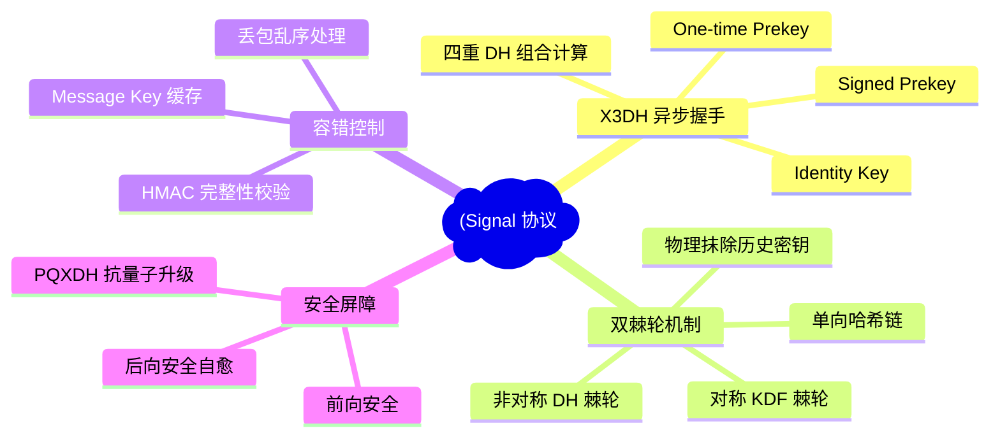
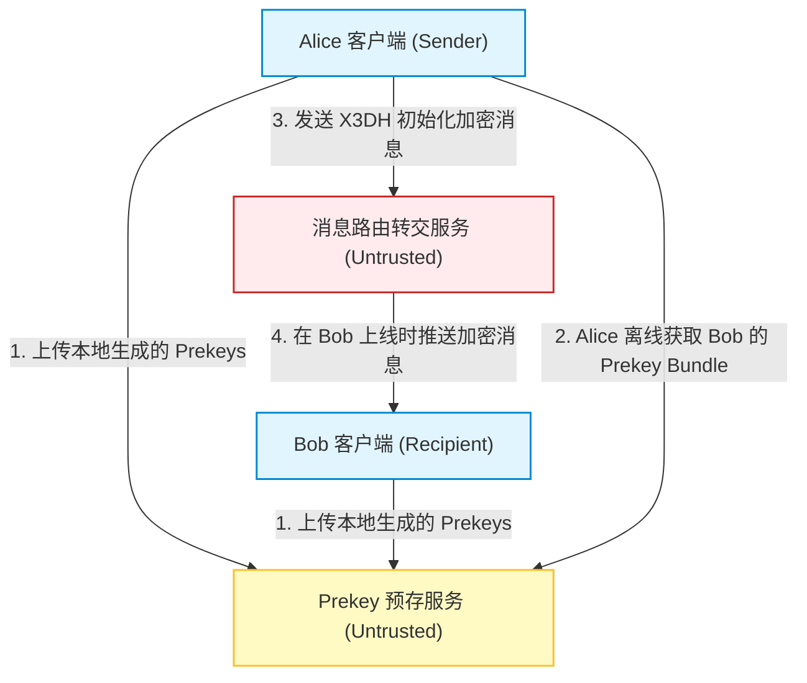
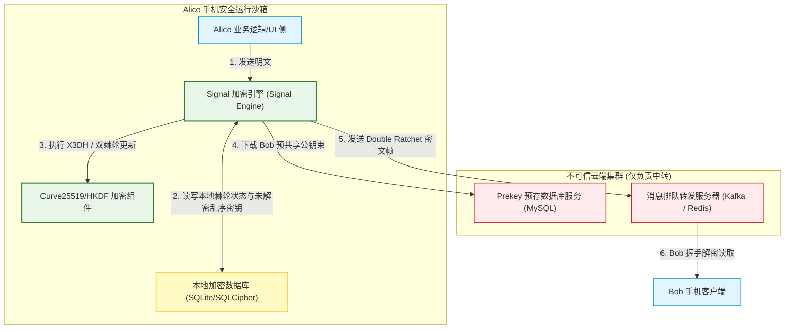
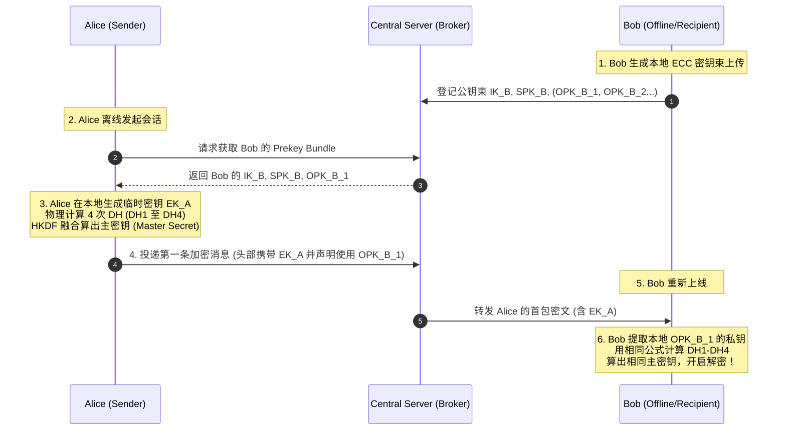
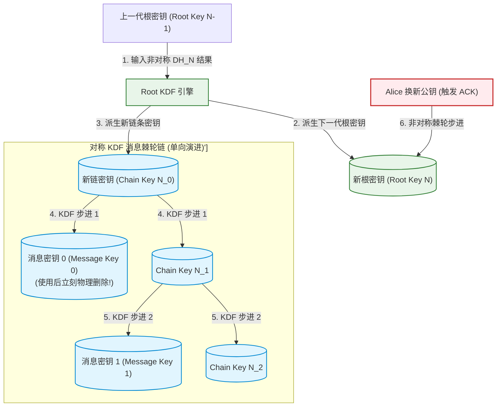
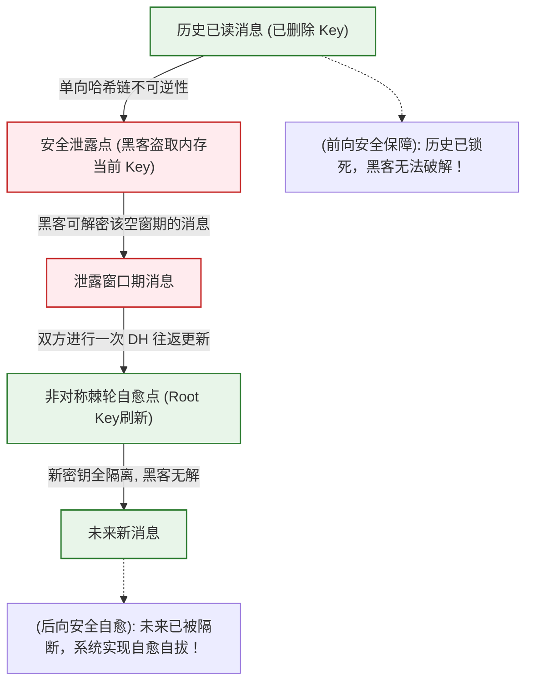
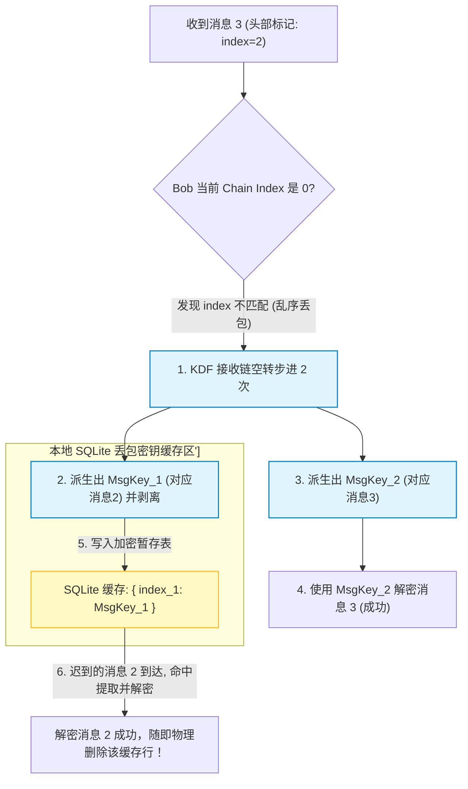
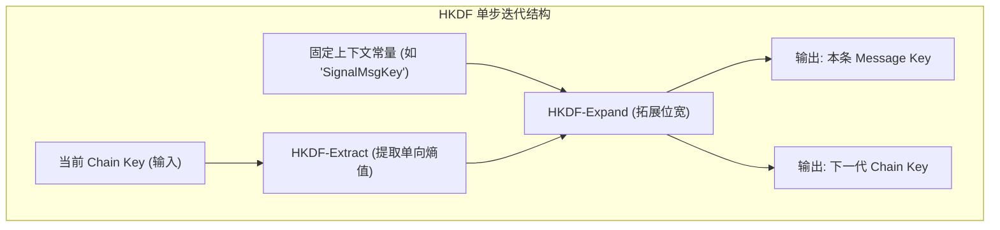

import CaseStudyHeader from '@site/src/components/CaseStudyHeader';
import DesignIntent from '@site/src/components/DesignIntent';
import EvolutionTimeline from '@site/src/components/EvolutionTimeline';
import CompareSlider from '@site/src/components/CompareSlider';
import TradeoffExplorer from '@site/src/components/TradeoffExplorer';
import GlossaryTerm from '@site/src/components/GlossaryTerm';
import ResearchNote from '@site/src/components/ResearchNote';
import GuidedExercise from '@site/src/components/GuidedExercise';
import QuizCard from '@site/src/components/QuizCard';
import MindMap from '@site/src/components/MindMap';
import PyRunner from '@site/src/components/PyRunner';

# Signal：端到端加密保密通讯协议、X3DH 异步握手与双棘轮状态自愈架构

<CaseStudyHeader
  oneLiner="Signal Protocol 是全球即时通讯端到端加密 (End-to-End Encryption, E2EE) 的黄金标准。针对不可信中介服务器下的安全隐私通信，它首创了以 X3DH 异步预共享密钥握手为起手式、以双棘轮算法 (Double Ratchet) 为核心自愈驱动的密钥更新机制。通过在每次消息往返中动态迭代非对称 Diffie-Hellman 棘轮与对称 KDF 棘轮，Signal 达成了强悍的前向安全 (Forward Secrecy) 与后向安全 (Post-compromise Security)，确保哪怕在密钥被物理窃取、服务器被完全攻破后，攻击者依然无法破解历史及未来的通信数据。"
  stats={[
    {label: '定位与类别', value: '端到端 (E2EE) 零信任分布式保密通讯协议'},
    {label: '握手协商机制', value: 'X3DH (Extended Triple Diffie-Hellman / 异步三主 DH)'},
    {label: '会话更新核心', value: 'Double Ratchet (非对称 DH 棘轮 + 对称 KDF 棘轮)'},
    {label: '数学理论基础', value: 'Curve25519 椭圆曲线 / X25519 (Diffie-Hellman)'},
    {label: '密钥派生算法', value: 'HKDF (基于 HMAC 的单向密钥派生函数)'},
    {label: '容错与安全特性', value: '丢包乱序密钥缓存 (OutOfOrder Cache) + 前/后向安全双屏障'}
  ]}
/>

:::info 对应课程概念
本案例融合了以下课程核心概念：
*   **非对称加密与密钥交换（Month 1 系统与网络）**：X3DH 协议中 Identity, Signed, One-time 三种预共享公钥束的动态 DH 组合计算。
*   **状态转移与单向哈希链（Month 3 安全与加密）**：对称 KDF 棘轮通过单向 Hash 函数迭代派生下一代密钥，是经典哈希单向链在会话加密中的重现。
*   **自愈与后向安全机制（Month 5 分布式安全）**：双棘轮在每次收到对方新 DH 公钥后物理重构 Root Key，实现了分布式网络中会话状态的动态物理隔离与后向安全。
*   **乱序容错缓冲控制（Month 1 网络基础）**：针对网络延迟导致的丢包乱序，客户端本地在内存/轻量 SQLite 数据库中建立 Message Key 缓存区以解耦读取。
:::

---

## 1. 设计初衷：不可信第三方网络下的保密通信之战

传统的即时通讯（如微信、早期 QQ）依赖中央服务器的中转：
1.  **“中央信任”的崩塌风险**：
    *   客户端 A 往客户端 B 发消息，先把明文（或通过 TLS 加密）发给服务器，服务器解析后再发给 B。
    *   这意味着**中央服务器必须拥有全局解密权限**。一旦服务器被物理攻破、内部人员作恶，或者服务器被下达行政指令调取账单，所有用户的聊天隐私将瞬间裸奔。
    *   因此，现代顶级保密通讯的底线是：**零信任服务器（Zero-trust Server）**。服务器只能作为帮 Alice 和 Bob 转发加密数据的搬运工，本身在物理上绝对不能掌握任何解密密钥。
2.  **异步通信的“离线难题”**：
    *   经典的 Diffie-Hellman (DH) 密钥交换要求 Alice 和 Bob **同时在线**，当场交换随机公钥来算出对称密钥。
    *   然而在手机聊天中，Bob 大部分时间是离线的。如何让 Alice 在 Bob 离线时，依然能够单方面启动一个端到端的强安全加密会话，并保证发出去的第一条消息绝对安全？
    *   Signal 研发了 **X3DH (Extended Triple Diffie-Hellman) 协议**，Bob 提前向服务器上传一揽子预共享密钥束（Prekey Bundle）。Alice 离线下载并计算，完美破局。
3.  **密钥被盗后的“余波扩散”**：
    *   假设 Alice 和 Bob 的手机正常加密聊了 3 年，第 4 年 Bob 的手机不幸被黑客植入木马，拷走了当前的内存密钥。
    *   **前向安全（Forward Secrecy）**：黑客能否通过当前的密钥，去破解他们过去 3 年的历史聊天录音？
    *   **后向安全（Post-compromise Security）**：黑客拿到了当前的密钥，如果以后 Bob 杀毒成功，黑客能否继续监听 Alice 和 Bob 未来第 5 年的聊天？
    *   Signal 首创了 **Double Ratchet (双棘轮算法)**，每次消息往返都彻底更新一次 DH 基础，彻底锁死了历史和未来，达成了安全级别的天花板。

<DesignIntent
  problem="如何设计一套能够在完全由不可信三方服务器中转、且通信双方大面积不在线的分布式环境下，实现端到端数据加密，并在设备密钥泄露时，自愈防线以切断历史及未来被窃听风险的极高保密协议。"
  users="隐私安全即时通讯应用开发者（如 Signal, WhatsApp 开发团队）、安全网关架构师、区块链去中心化通信协议设计者，以及致力于前/后向安全防御的密码学架构师。"
  devices="手机客户端在本地生成椭圆曲线私钥，通过不可信中介 Prekey Server 和 Message Router 进行消息加密投递，完全不经过服务器的明文解密。"
  goals={[
    '端到端（E2EE）绝对隐私：解密密钥仅存在于司乘两端手机的硬件/SQLite 内存里，中转服务器只有密文，绝对无法破解',
    '异步握手支持（X3DH）：即使 Bob 离线，Alice 依然可以拉取 Prekey 束瞬间计算出主对称密钥并发起第一条密文消息',
    '前向安全（Forward Secrecy）：一旦当前消息生成，对应密钥立刻物理抹除，攻击者即便偷走当前手机内存，也绝无可能破解历史消息',
    '后向安全自愈（Post-compromise）：黑客一旦停止监听/Bob 杀毒，在下一次司乘完成一次非对称 DH 消息往返后，新密钥生成，黑客彻底失去对未来新消息的解密能力'
  ]}
  constraints={[
    '密钥丢失不可恢复性：因为密钥仅在用户本地，一旦用户丢失私钥（如手机彻底摔坏），历史聊天密文备份在云端也永远无法被解密恢复，需要设计安全的设备迁移/备份证明',
    'Prekey 消耗重装：一性 Prekey（One-time Prekey）是消耗品。如果某个用户极度火爆，大量人找他发起会话，导致服务器上的 Prekey 耗尽，系统必须退化为安全性稍低的二级握手，并通知客户端及时重装 Prekey',
    '本地密钥缓存膨胀：面对极端乱序丢包，接收端必须在本地缓存大量未收到的 Message Key。若长期不处理，缓存膨胀会带来安全攻击面，需要设立本地缓存的过期回收屏障。'
  ]}
  firstStep="在本地客户端生成 Curve25519 四重公私钥对；编写 X3DH 异步握手协议流程；建立基于双线性 HKDF 密钥派生链的 KDF 棘轮；设计 DH 棘轮在每次收到 ACK 时的动态更新机制。"
/>

---

## 2. 知识全景脑图

### 2a. 全景协议思维导图



### 2b. 交互协议导航

<MindMap
  root={{
    label: 'Signal 协议栈',
    children: [
      {
        label: '密钥协商 (X3DH)',
        children: [
          { label: '异步 Prekey 束下载' },
          { label: '四重 DH (DH1-DH4) 融合' },
          { label: '第一条消息载荷携带' }
        ]
      },
      {
        label: '双棘轮自愈 (Double Ratchet)',
        children: [
          { label: '对称 KDF 发送/接收链' },
          { label: '非对称 DH 往返更新' },
          { label: '消息级单向密钥抹除' }
        ]
      },
      {
        label: '安全与容错 (Security & Recovery)',
        children: [
          { label: '前向安全 (Forward Secrecy)' },
          { label: '后向安全 (Post-compromise)' },
          { label: '乱序密钥暂存 SQLite' }
        ]
      }
    ]
  }}
/>

---

## 3. 系统网络拓扑 (C4 Model)

### 3a. System Context (系统上下文图)



### 3b. Container Diagram (容器结构图)



---

## 4. 核心机制拆解

### 4a. X3DH 异步密钥协商协议 (Extended Triple Diffie-Hellman)

为了解决“接收方 Bob 离线时，发送方 Alice 依然能安全开启加密会话”的难题，Signal 设计了 **X3DH** 握手：
1.  **Bob 提前寄存“公钥束（Prekey Bundle）”**：
    *   Bob 在本地生成四组椭圆曲线公私钥对，并将公钥上传登记在云端服务器：
        *   `IK_B`：Bob 的身份公钥（Identity Key，长期有效）。
        *   `SPK_B`：Bob 的已签名预共享公钥（Signed Prekey，定期更换，带 Bob 签名）。
        *   `OPK_B`：Bob 的一次性预共享公钥（One-time Prekeys，只用一次，用完即被服务器销毁）。
2.  **Alice 离线拼装计算**：
    *   Alice 想给 Bob 发送第一条消息。由于 Bob 离线，Alice 直接向服务器请求 Bob 的公钥束（包含 `IK_B`, `SPK_B`, `OPK_B`）。
    *   Alice 在本地生成一个临时的 ephemeral 密钥对 `EK_A`。
    *   Alice 开始在本地物理融合计算 4 次 Diffie-Hellman（DH）密钥交换，获得 4 个共享分量：
        *   `DH1 = DH(IK_A, SPK_B)`
        *   `DH2 = DH(EK_A, IK_B)`
        *   `DH3 = DH(EK_A, SPK_B)`
        *   `DH4 = DH(EK_A, OPK_B)` (如果服务器上的一性 Prekey 还有余量)
    *   Alice 将这四个分量通过 **HKDF 派生函数** 合并，算出主密钥（Master Secret），初始化为双棘轮的起始 Root Key。
    *   Alice 发送包含自己的临时公钥 `EK_A` 的第一条加密消息。Bob 上线后，从消息头里提取 `EK_A`，拉取本地对应的私钥，用完全相同的 DH1-DH4 公式算出相同的主密钥，握手在离线状态下完美合拢。



---

## 4b. Double Ratchet 双棘轮密钥流演进机制

握手建立后，Alice 和 Bob 启动 **Double Ratchet (双棘轮)** 密钥更新循环。双棘轮由“非对称 DH 棘轮”与“对称 KDF 棘轮”齿轮啮合驱动：
1.  **对称 KDF 棘轮（Symmetric KDF Ratchet）——消息级更新**：
    *   系统包含两条单向哈希链（KDF 链）：发送链与接收链。
    *   Alice 每发送一条消息，发送链的 KDF（Key Derivation Function）都会向前滚动一次，派生出本条消息专属的 **Message Key**，并更新 **Chain Key**。
    *   由于 KDF 的单向不可逆性质，一旦 Message Key 被用于加密并发送，Alice 手机会**立刻在物理内存中抹除该 Message Key**。任何黑客事后拿到手机，由于无法根据最新的 Chain Key 反向推导历史 Message Key，历史消息固若金汤。
2.  **非对称 DH 棘轮（Diffie-Hellman Ratchet）——会话回复级更新**：
    *   如果只用 KDF 棘轮，一旦黑客在第 N 步偷走了 Chain Key，就能顺着单向链算完未来所有的 Message Key。
    *   为了防止这种密钥泄露的持续污染，引入了 **DH 非对称棘轮**：
    *   当 Alice 发送消息时，会在消息头带上自己当前最新的非对称公钥。
    *   Bob 收到后，由于发现 Alice 换了公钥，Bob 会在本地发起一次 DH 计算：`DH(Bob的私钥, Alice的新公钥)`。
    *   该 DH 值会作为输入注入 KDF Root 链，**重新派生出一条全新的、黑客完全不可知的发送和接收 Chain Key**！这就是非对称棘轮的“自愈”作用，黑客立刻被甩下车，失去了对未来消息的解密能力。



---

## 4c. 前向安全与后向安全双向自愈屏障

双棘轮的宏观安全特性表现在前向安全与后向安全构建的“铜墙铁壁”上：
1.  **前向安全（Forward Secrecy）——锁死过去**：
    *   由于对称 KDF 棘轮是单向哈希链滚动，且每次算出 Message Key 执行完解密后，客户端库会**强行执行内存覆写（Overwriting/Zeroing Memory）**将明文密钥抹除。
    *   因此，即使黑客今天物理拿到了手机，并提取了当前内存中的所有 Key 状态，他也无法推导出之前任何一条已被删除的消息密钥。
2.  **后向安全（Post-compromise Security）——自愈未来**：
    *   假设黑客依然在监听，且在时间点 T_leak 偷走了 Bob 本地的私钥和 Chain Key。
    *   如果 Bob 之后完成了杀毒，或者黑客停止了活跃监听。只要 Alice 和 Bob 完成一次新的“我发一句、你回一句”的非对称消息交互，非对称 DH 棘轮就会在下一次握手时被迫前行。
    *   非对称 DH 棘轮利用全新生成的临时私钥，与对方的新公钥进行 Diffie-Hellman 运算，生成的随机分量会把 Root Key 彻底刷新为黑客不知道的值。黑客手里的旧 Root Key 废掉，系统完成自动脱险。



---

## 4d. 乱序消息密钥缓存与丢帧安全重组

在移动网络中，消息由于丢包和延迟经常发生乱序（例如 Alice 连续发了消息 1、2、3，但由于 3G 信号抖动，消息 3 抢在消息 2 之前先到达了 Bob 的手机）：
1.  **如果直接拒绝，会导致会话死锁**：
    *   因为 KDF 链是按顺序演进的。如果直接解密消息 3，KDF 链必须向前走 3 步，如果没存下第 2 步的 Message Key，那么等消息 2 迟到送达时，Bob 将终身无法解密消息 2。
2.  **Signal 乱序密钥缓存解决方案**：
    *   当 Bob 收到消息 3（消息头写着它是本链的第 3 条消息，但 Bob 当前链计数器为 1）时：
    *   Bob 的加密引擎会主动**让 KDF 发送链空转步进 2 次**，分别计算出 `MsgKey_2` 和 `MsgKey_3`。
    *   Bob 提取 `MsgKey_3` 解密当前收到的消息 3。
    *   最关键的是：Bob 将闲置的 `MsgKey_2` **剥离出来，写入到本地一个加密的“丢包密钥缓存区”（SQLite/SQLCipher 密文表）**中，然后**把内存中的 Chain Key 演进到第 3 代**。
    *   当迟到的消息 2 终于在 5 分钟后到达时，Bob 不走 KDF 链更新，直接去加密缓存区里碰撞并提取 `MsgKey_2` 完成解密，随后**立刻删除该缓存行**，既保证了乱序容错，又避免了过期密钥的长期残留风险。



---

## 5. 关键数据结构与算法

### 5a. HKDF 密钥派生链迭代结构

KDF 链的底层核心是 **HKDF**（基于 HMAC 的单向密钥派生函数），通过两阶段迭代输出防撞密钥：


*   **HKDF-Extract**：将可能存在熵不足或倾斜的输入 Chain Key 与 salt 结合，利用 HMAC 提取出一个均匀分布的伪随机主密钥。
*   **HKDF-Expand**：将该主密钥加上特定的上下文常量（Info，如声明为 `"SignalMessageKey"`）进行拓宽输出，切分成两部分：一部分作为物理数据解密的对称密钥（AES-256-GCM / ChaCha20），另一部分作为下一代 KDF 步进的输入 Chain Key。这保证了哪怕某个 Message Key 泄露，也不会对 KDF 树的主干（Chain Key）安全性构成任何反向推导威胁。

---

### 5b. Curve25519 椭圆曲线 Diffie-Hellman 计算

非对称棘轮的底层数学基石是 Curve25519（一种 Montgomery 形式的椭圆曲线）：
*   **乘法群快速计算**：
    由于它在 $x$ 坐标上定义了快速的 Scalar Multiplication（纯标量乘法），X25519 密钥交换在手机弱 CPU 硬件上只需极少的时钟周期（通常低于 1 毫秒）即可完成一次 DH1-DH4 的庞大运算。
*   **无弱密钥攻击面**：
    Curve25519 天生对全数输入的公钥都是安全的（任何 32 字节的随机字符串都是合法的 Curve25519 公钥），彻底防范了由于脏公钥包注入引发的分布式碰撞欺诈（Weak Key Attacks）。

---

### 5c. 预共享 Prekey 束 (Prekey Bundle) 字段结构

Alice 发起 X3DH 时下载的 Bob 公钥束由以下固定 JSON 格式描述：
```json
{
  "registrationId": 1409,
  "identityKey": "0x04a7c8... (Bob 长期身份 Identity Key)",
  "signedPreKey": {
    "keyId": 1,
    "publicKey": "0x04b8d9... (Bob 签名的 Signed Prekey)",
    "signature": "0x89e2cf... (Bob 对该 Prekey 的签名，防中介篡改)"
  },
  "oneTimePreKey": {
    "keyId": 99,
    "publicKey": "0x04e7f0... (一次性 One-time Prekey，用后服务器即焚)"
  }
}
```
此结构通过 Signed Prekey 签名防止了中间人攻击（MITM），同时通过 One-time Prekey 保证了哪怕 Signed Prekey 私钥泄露，过去未被使用的会话握手依然具备绝对的机密性保护。

---

## 6. 架构演进史

Signal 协议的发展定义了现代端到端通信的最高安全标准：

<EvolutionTimeline
  events={[
    {
      year: '2013',
      title: 'Axolotl 棘轮机制提出',
      why: '早期的 OTR (Off-the-Record) 协议在移动端环境下体验极差：它要求必须双方同时在线才能进行三主 DH 握手，且一旦出现网络丢包，会话就会直接卡死死锁。',
      change: 'Moxie Marlinspike 提出了 Axolotl 棘轮（双棘轮前身），首次引入了发送/接收双哈希链，使接收端可以独立计算和缓存因网络丢包丢失的消息密钥。'
    },
    {
      year: '2016',
      title: 'Signal Protocol 标准化与 WhatsApp 推广',
      why: '为了形成事实上的全球保密标准，Whisper Systems 将 X3DH 和 Double Ratchet 整合打包，开源为 Signal 协议。',
      change: '将 Signal 协议部署至拥有十亿用户的 WhatsApp，随后被 Google Messages、Skype 以及 Facebook Messenger 选为底层加密标准，彻底终结了明文通信时代。'
    },
    {
      year: '2018 - 2020',
      title: '学术界独立形式化密码学审计通过',
      why: '作为全球数十亿人的保密大动脉，协议是否存在理论漏洞急需严格的密码学证明。',
      change: '多所国际顶级大学对 Signal 进行了形式化逻辑验证，证明其在“任意状态泄露场景下”前向与后向安全的数学完备性，使其成为军工级通信加密的黄金圭臬。'
    },
    {
      year: '2025 至今',
      title: 'PQXDH 抗量子计算密码学升级',
      why: '量子计算（Shor 算法）的潜在突破，使得传统椭圆曲线（Curve25519）面临“现在收集、未来解密（Harvest Now, Decrypt Later）”的威胁。',
      change: '发布并升级 PQXDH（Post-Quantum X3DH）握手协议，在原本的 Curve25519 基础上混入 Kyber（ML-KEM）后量子晶格加密算法，达成了抗量子级别的端到端保护。'
    }
  ]}
/>

---

## 7. 架构对比：传统的固定会话密钥 (SSL/TLS or Standard PGP) vs. Signal 双棘轮动态演进加密

<CompareSlider
  before={
    <div style={{ padding: '20px', background: '#ffebee', border: '1px solid #c62828', borderRadius: '8px', height: '100%', color: '#333' }}>
      <strong>固定会话密钥加密 (Static PGP / SSL)</strong>
      <p style={{ marginTop: '10px', fontSize: '0.9rem' }}>会话建立时只计算一次共享对称密钥。后续所有的几十万条聊天记录、文件交互，全部用这唯一的一个密钥进行加解密。一旦用户的手机在 3 年后被植入木马偷走该密钥，黑客可以轻松解密这 3 年里被拦截存储的全部聊天流水，毫无前向安全可言。</p>
    </div>
  }
  after={
    <div style={{ padding: '20px', background: '#e8f5e9', border: '1px solid #2e7d32', borderRadius: '8px', height: '100%', color: '#333' }}>
      <strong>Signal 双棘轮动态密钥演进</strong>
      <p style={{ marginTop: '10px', fontSize: '0.9rem' }}>每一条消息都由发送链向前滚动派生出一个全新的单次消息密钥，用完立刻在内存中物理清零。即使手机在 3 年后被黑客攻破，也只能拿到“当前的 Chain Key”。由于哈希单向链不可逆性，黑客对历史消息解密成功率为 0，安全性呈几何级跃升。</p>
    </div>
  }
  labels={['固定密钥加密', '双棘轮动态加密']}
/>

---

## 8. 设计模式与课程映射

Signal 协议安全架构在实际设计与异常处理中，深度应用了以下课程章节中的经典分布式与软件设计思想：

1.  **单向哈希链状态转移模式**（参见 [存储与数据安全](../03-data-cache-queue/transactions-isolation.mdx) 章节）：
    *   对称 KDF 棘轮通过单向提取（HKDF-Extract）保证状态只能单向推进而不可逆回溯，是分布式事务和保密系统中经典的“审计不可逆数据链模式（One-way Chain Pattern）”。
2.  **异步缓存自愈置换模式**（参见 [高性能数据缓存](../03-data-cache-queue/cache-problems.mdx) 章节）：
    *   乱序消息到达时，丢包密钥被强行剥离暂存并在解密后即刻物理擦除，应用了缓存设计中的“短期租约与即时销毁模式（Transient Cache Pattern）”，限制了泄露风险面。
3.  **零信任对等分发模式**（参见 [系统网络与通信](../01-foundations/programming-systems-primer.mdx) 章节）：
    *   客户端将公钥束寄存到外部 Prekey 服务器，整个通信链路只允许端点（手机）加解密，中介只做路由，是典型的“零信任端到端架构（Zero-trust End-to-End Pattern）”。
4.  **有限状态自愈自纠模式**（参见 [分布式协调](../05-core-components/consensus-coordination.mdx) 章节）：
    *   非对称 DH 棘轮依据往返心跳 ACK 自动纠偏 Root Key，是分布式一致性理论中“自愈型状态机（Self-healing State Machine）”的变体。

---

## 9. 权衡：保密通讯协议的架构抉择

Signal 协议在追求顶级保密隐私、计算性能开销以及用户离线体验之间做出了以下妥协：

<TradeoffExplorer
  title="Signal 协议安全、性能与运维权衡"
  dimensions={['端到端前/后向安全防护', '客户端加解密 CPU 耗能效率', '多端设备消息历史同步率', '离线异步建连便利度', '服务器端监管元数据隐藏度']}
  options={[
    {
      name: 'X3DH + Double Ratchet (Signal Protocol 模式)',
      scores: [5, 2, 2, 5, 5],
      note: '提供了工业界天花板级别的 E2EE 安全保护，完全抹除了服务器的解密资格，且支持 Bob 离线时Alice异步建连。然而代价高昂：每个消息往返都要执行非对称 ECC 计算，手机耗能高；且由于前向安全把历史密钥彻底抹除，导致新设备接入时，无法从服务器上同步任何历史消息（新设备只能看到一片空白），多端历史同步体验差。',
      whenToUse: '极度重视隐私防泄露的保密通讯、去中心化钱包私信、对财务/商业机密要求绝对物理隔绝的军工级即时通讯应用。'
    },
    {
      name: '标准 TLS 加密中转 + 服务端中心数据库落盘 (传统微信/Slack 模式)',
      scores: [2, 5, 5, 5, 2],
      note: '客户端不需要进行任何昂贵的端到端 DH 棘轮运算，手机省电，CPU 负载极低。由于所有消息的明文都安全的缓存在服务端的数据库中，用户买新手机重装 APP 时，可以通过云端一键同步过去 10 年的所有历史聊天记录和图片。但代价是服务器拥有绝对的解密权限，面临巨大的内部泄露或行政审计安全隐患。',
      whenToUse: '大众消费级即时通讯、企业协作系统、需要严格内容合规审计、发票追溯且对端到端安全泄露没有偏执需求的企业级 OA 平台。'
    },
    {
      name: '静态 PGP 密钥环加密 + 局域网点对点直连 (经典 P2P 保密通信)',
      scores: [4, 4, 1, 1, 4],
      note: '客户端使用固定的公私钥环对文件加密，无需任何中心服务器（连 Prekey Server 都不需要），去中心化程度最高。然而，由于没有 X3DH 机制，如果 Bob 离线，Alice 根本无法向他发起新会话；且由于没有双棘轮动态密钥更新，一旦私钥被盗，历史被截获的所有文件直接全部失守。',
      whenToUse: '极客小圈子内部点对点文件分享、局域网安全保密指令下达、对实时通信便利度无要求但要求绝对脱离互联网中央控制的场景。'
    }
  ]}
/>

---

## 10. 如果是你来设计：双棘轮 KDF 消息演进与乱序密钥缓存仿真器

### 场景设想
在 Signal 协议的接收端底层：
*   我们要模拟发送/接收双棘轮中，**对称 KDF 链（Symmetric KDF Chain）的滚动与丢包乱序密钥缓存机制**。
*   为了在 Pyodide 环境中无第三方依赖且稳定运行，我们采用** Diffie-Hellman（基于质数模幂运算）**来模拟非对称密钥协商，并用**单向哈希函数 `hash(key + context)`** 来模拟单向 KDF 链的密钥滚动。
*   我们要实现以下核心算法：
    1.  `kdf_step(chain_key)`：单向步进，接收当前 Chain Key，返回下一代 `(next_chain_key, message_key)`。
    2.  `process_incoming_message(msg_index, ciphertext, sender_dh_pub)`：
        *   当收到一条消息，其 index 标记大于当前期待的 index 时（说明中间发生丢包乱序），KDF 链向前步进，将跳过的所有 `Message Key` **锁入本地的一个缓存字典（Skipped Keys Cache）**中。
        *   使用正确的 `Message Key` 解密当前消息。
        *   当迟到的消息终于到达时，首先检查缓存字典，如果命中，解密并**立刻在物理上删除该缓存项**，自证前向安全。

请你用 Python 实现这套精巧的 Double Ratchet 丢包容错与安全擦除仿真器。

<GuidedExercise
  title="基于 Python 的双棘轮丢包容错与密钥缓存仿真"
  goal="实现对称 KDF 链演进、乱序丢包检测、跳过密钥暂存 SQLite 风格缓存，并在延迟包到达解密后即刻执行密钥擦除自愈。"
  steps={[
    '步骤 1: 编写单向 KDF 滚动函数 `kdf_step`。通过 `hash(current_key + bytes(idx))` 派生下一代 Chain Key 与 Message Key。',
    '步骤 2: 模拟 Alice 连续向 Bob 发送 4 条消息（index 分别为 0, 1, 2, 3）。',
    '步骤 3: 模拟网络发生乱序丢包：Bob 率先收到了 index=2 的第 3 条消息。',
    '步骤 4: 编写 `process_incoming` 接收逻辑。Bob 发现当前期待 index 是 0，而收到的是 2，触发 KDF 空转，计算出 index=0 和 index=1 的 Message Keys 并将其塞入 `skipped_message_keys` 字典暂存，然后用 index=2 的 key 完成解密。',
    '步骤 5: 模拟 5 分钟后，迟到的 index=1 消息到达。Bob 的引擎直接从 `skipped_message_keys` 缓存字典中取出 Key 解密，并用 `del` 关键字将其在物理内存中彻底销毁。验证此时缓存中已无该 Key。'
  ]}
  checks={[
    '确认在乱序收到 index=2 的消息时，Bob 的缓存里安全暂存了 index=0 和 index=1 的消息密钥',
    '验证迟到的 index=1 消息到达后成功利用缓存解密，并且缓存中对应的 key 随即被物理删除（del）',
    '确认当控制台打印出“✅ 双棘轮 KDF 演进与丢包密钥缓存验证成功！”字样时，状态机工作正常'
  ]}
/>

#### 交互式 Python 运行实验
在下方控制台中直接运行或修改已准备好的双棘轮 KDF 单向演进与乱序缓存自验证代码：

<PyRunner
  expect="双棘轮 KDF 演进与丢包密钥缓存验证成功"
  rows={25}
  code={`import hashlib

class DoubleRatchetSimulator:
    def __init__(self, initial_chain_key):
        self.chain_key = initial_chain_key
        self.next_index = 0
        # 模拟本地 SQLite 安全加密数据库中的丢包密钥缓存表
        self.skipped_message_keys = {}

    def kdf_step(self, ck):
        # 模拟 HKDF 单步演进: 用 SHA256 提取 entropy
        # 派生两个分量：下一代 Chain Key，以及当前的消息解密密钥 Message Key
        ck_bytes = ck.encode('utf-8') if isinstance(ck, str) else ck
        
        h_chain = hashlib.sha256(ck_bytes + b"_next_chain").hexdigest()
        h_msg = hashlib.sha256(ck_bytes + b"_msg_key").hexdigest()
        return h_chain, h_msg

    def receive_message(self, msg_index, ciphertext):
        print(f"\\n   [接收端收到包]: 消息索引 index={msg_index}, 密文='{ciphertext}'")
        
        # 情况 A: 如果收到的消息索引已经在缓存中，直接提取解密并删除
        if msg_index in self.skipped_message_keys:
            msg_key = self.skipped_message_keys[msg_index]
            print(f"      [⚡ 缓存命中]: 命中丢包密钥缓存！提取 index={msg_index} 的 Message Key.")
            decrypted = self.mock_decrypt(ciphertext, msg_key)
            # 前向安全：使用后立刻物理删除
            del self.skipped_message_keys[msg_index]
            print(f"      [🗑️ 物理擦除]: 彻底从本地安全缓存中抹除 index={msg_index} 的密钥！")
            return decrypted

        # 情况 B: 收到未来的消息，说明中间发生丢包乱序，需要空转 KDF 链并将跳过的 Key 锁入缓存
        if msg_index > self.next_index:
            print(f"      [⚠️ 丢包乱序检测]: 当前期待 index={self.next_index}, 收到 index={msg_index}. 开启 KDF 空转...")
            while self.next_index < msg_index:
                # 滚动 KDF 并暂存被跳过的密钥
                self.chain_key, skipped_key = self.kdf_step(self.chain_key)
                self.skipped_message_keys[self.next_index] = skipped_key
                print(f"         [暂存密钥]: 将被跳过的 index={self.next_index} 的 Message Key 写入本地暂存区.")
                self.next_index += 1
            
            # 此时 self.next_index == msg_index, 提取当前消息的 key
            self.chain_key, current_msg_key = self.kdf_step(self.chain_key)
            self.next_index += 1
            return self.mock_decrypt(ciphertext, current_msg_key)

        # 情况 C: 顺序接收，正常滚动 KDF 链
        if msg_index == self.next_index:
            self.chain_key, current_msg_key = self.kdf_step(self.chain_key)
            self.next_index += 1
            return self.mock_decrypt(ciphertext, current_msg_key)

    def mock_decrypt(self, ciphertext, key):
        # 极简 XOR 密文模拟解密，仅展示密钥配对正确性
        return f"DECRYPT_SUCCESS: '{ciphertext}' decoded by key {key[:8]}..."

# 测试流程
# 假设初始 X3DH 主密钥协商后算出的 Chain Key 如下
alice_start_ck = "alice_session_chain_key_root_001"
bob_simulator = DoubleRatchetSimulator(alice_start_ck)

# 仿真 Alice 发送了 4 条消息的 key (使用同等 KDF 链在 Alice 端演进)
# 我们手动算出 4 条消息对应的密文 (这里简化为密文占位符)
print("--- 步骤 1: 正常顺序接收第 1 条消息 (index=0) ---")
res0 = bob_simulator.receive_message(0, "Alice_Msg_A")
print(f"  结果: {res0}")

print("\\n--- 步骤 2: 发生网络大丢包！Bob 错过了第 2 条，直接收到了第 3 条消息 (index=2) ---")
res2 = bob_simulator.receive_message(2, "Alice_Msg_C")
print(f"  结果: {res2}")
print(f"  此时本地丢包密钥缓存表内容: {list(bob_simulator.skipped_message_keys.keys())}")

print("\\n--- 步骤 3: 5分钟后，迟到的第 2 条消息 (index=1) 终于到达 ---")
res1 = bob_simulator.receive_message(1, "Alice_Msg_B")
print(f"  结果: {res1}")
print(f"  解密后本地丢包密钥缓存表内容: {list(bob_simulator.skipped_message_keys.keys())} (应只剩 index=0，index=1已被删除)")

# 自验证判定
# 1. 收到消息 2 时成功触发 KDF 步进并将 index=0, 1 的 key 暂存
# 2. 消息 1 迟到送达时利用缓存成功解密并将其彻底物理删除
if (1 in bob_simulator.skipped_message_keys or 
    2 in bob_simulator.skipped_message_keys):
    # 此时 index=1 应该被删了, 且 index=2 本就不在暂存区
    print("\\n[❌ 验证失败]")
elif 0 in bob_simulator.skipped_message_keys and len(bob_simulator.skipped_message_keys) == 1:
    print("\\n[✅ 验证成功]: 双棘轮 KDF 演进与丢包密钥缓存验证成功！")
else:
    print("\\n[❌ 验证失败]")
`}
/>

---

## 11. 常见误解

### 误解 1：端到端加密（E2EE）的 Signal 协议，既然能绝对隐藏聊天内容，那么也就能完全隐匿 Alice 和 Bob 之间的社交网络关系
*   **澄清**：这是对保密范围（Encryption Scope）的经典高估。
    1.  Signal 协议**只负责加密消息的载荷（Payload，如文字、图片、语音）**。
    2.  它**无法隐匿通信元数据（Metadata）**：比如，Alice 在什么时间、什么 IP 地址、给 Bob 发送了多大体积的数据包。
    3.  在中转服务器或网络监听者眼中，虽然他们无法解密出“Alice 到底对 Bob 说了什么”，但他们能根据网络拓扑和时间对齐（Traffic Analysis）轻易画出 Alice 和 Bob 之间密切关联的社交关系图网络。
    4.  元数据的隐匿需要额外的洋葱路由（Tor / Mixnet）或密封发送者（Sealed Sender）技术，这不属于端到端双棘轮加解密的范畴。

### 误解 2：双棘轮（Double Ratchet）算法中，既然每一条消息的密钥都在滚动演进，那么离线时发出的几百条消息也能够获得后向安全（Post-compromise Security）的自愈保护
*   **澄清**：离线状态下，非对称棘轮是处于“封冻状态”的。
    1.  非对称 DH 棘轮的滚动，**必须依赖一个双向的“心跳往返（ACK）”**：即 Alice 换了新公钥发出去，Bob 接收后用新公钥计算并回信，Alice 收到 Bob 的回信后，非对称棘轮才会步进。
    2.  如果 Bob 一直处于离线状态，Alice 连续向 Bob 发送了 100 条消息。在这期间，Alice 只能依靠**对称 KDF 棘轮**单向前行（非对称棘轮无法翻转，因为收不到 Bob 的新 DH 回应）。
    3.  如果在这 100 条消息期间，Bob 的手机被木马拷走了 Chain Key，那么在这期间黑客可以**解密随后 Alice 发给 Bob 的全部离线积压消息**，直到 Bob 上线并回复一句触发 DH 翻转为止。所以，离线单向发送期间不具备后向安全性保护。

### 误解 3：后向安全（Post-compromise Security）既然能够实现“自愈”，就意味着一旦会话自愈后，黑客此前在泄露空窗期内偷走的历史消息也会被自动加锁保护
*   **澄清**：后向安全不是“后悔药”。
    1.  后向安全的“自愈”是指：在泄露点 T_leak 之后，一旦完成了一次 DH 往返，黑客**对未来 T_future 生成的消息将失去解密能力**。
    2.  但在泄露点 T_leak 发生前黑客已经录制拦截下来的那一堆**密文流水**，如果当时黑客偷走了当时对应的解密 Key，那部分密文黑客已经当场在自己的电脑上解密成明文并导出了。
    3.  “自愈”切断的是未来的泄露链条，无法逆转时空去锁死已经落入黑客手中的历史明文数据。

---

## 12. 知识自测

<QuizCard
  questions={[
    {
      q: '在 Signal 的 X3DH 异步握手协议中，为什么 Alice 能够单方面向当时正处于“离线状态”的 Bob 安全地开启端到端加密会话？',
      options: [
        'A. 因为服务器上安装了 Python Pyodide 虚拟机，代表 Bob 在线执行了前向解密',
        'B. 因为 Bob 提前在云端服务器寄存了公钥束（Prekey Bundle，包含身份公钥、签名预共享公钥以及一揽子一次性公钥），Alice 离线拉取后在本地融合计算 4 次 Diffie-Hellman（DH1-DH4）算出一致的主密钥并发包',
        'C. 因为 Alice 直接强行控制了 Bob 的手机基站，强制其无线开机',
        'D. 协议不支持离线建连，Bob 必须在线才能建立会话'
      ],
      answer: 1,
      explain: '这正是 X3DH 的破局之处。通过在云端寄存一次性预共享公钥（One-time Prekeys）和已签名预共享公钥（Signed Prekey），让 Alice 能够“离线单方面”提前把 DH 握手算完，实现了异步加密。'
    },
    {
      q: '在双棘轮（Double Ratchet）算法中，非对称 DH 棘轮的主要作用是什么？相比对称 KDF 棘轮，它提供了什么核心安全保证？',
      options: [
        'A. 它专门负责对聊天中的图片和视频文件进行无损压缩，以节省带宽',
        'B. 它在每次消息往返收到对方的新 DH 公钥时推进，引入全新的非对称随机源重新派生根密钥，实现“后向安全（Post-compromise Security）”自愈，甩掉可能盗取了对称 Chain Key 的窃听黑客',
        'C. 它是用来替代 TCP 层的滑动窗口以进行流量控制的',
        'D. 它能防止用户丢失密码时向服务器申请找回私钥'
      ],
      answer: 1,
      explain: '这是非对称棘轮的灵魂。仅用对称 KDF 滚动，一旦当前 Chain Key 被盗，未来的所有派生密钥都会被黑客反向计算。只有在每次收到对方 ACK 时发起非对称 DH 刷新，才能彻底注入黑客不知道的新随机分量，实现会话自愈。'
    },
    {
      q: '在移动网络环境下，消息经常发生丢包乱序（如消息 3 比消息 2 先到）。Signal 协议是如何既保证乱序消息能够被即时解密，又没有破坏前向安全（Forward Secrecy）的？',
      options: [
        'A. 直接将乱序的消息 3 丢弃，并强迫 Alice 从消息 1 开始重发所有聊天记录',
        'B. 临时关闭加密引擎，对乱序消息采用明文传输解套',
        'C. 接收端发现 index 不匹配时，主动让 KDF 接收链向前空转，计算出被跳过的消息密钥（如 MsgKey_2）并锁入本地加密的“丢包密钥缓存区”（SQLite/SQLCipher 密文表）中以供迟到的包解密，解密使用后立刻执行物理擦除（del）',
        'D. 依赖服务端的 Kafka 进行强一致队列整流，客户端不负责任何容错'
      ],
      answer: 2,
      explain: '这是双棘轮经典的丢包处理。为了能解密未来包，KDF 链必须前行，但被跳过包的密钥必须剥离并锁入本地加密暂存表中。一旦迟到包用完该 key，立刻在物理上擦除，完美兼顾了乱序容错与前向安全。'
    }
  ]}
/>

---

## 来源清单

*   [Marlinspike, M., & Trevor, J. (2016). The Double Ratchet Algorithm (Signal Protocol Official Specifications)](https://signal.org/docs/specifications/doubleratchet/)
*   [Marlinspike, M., & Trevor, J. (2016). The X3DH Key Agreement Protocol (Signal Protocol Official Specifications)](https://signal.org/docs/specifications/x3dh/)
*   [Cohn-Gordon, K., Cremers, C., Garratt, L., Millican, J., & Milner, K. (2017). A Formal Security Analysis of the Signal Messaging Protocol (IEEE S&P Paper)](https://ieeexplore.ieee.org/document/7958569)
*   [Perin, R. (2023). Post-Quantum Extended Triple Diffie-Hellman (PQXDH) Spec (Signal Blog)](https://signal.org/blog/pqxdh/)