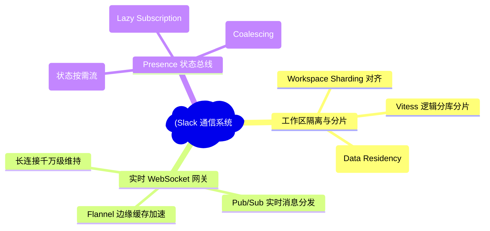
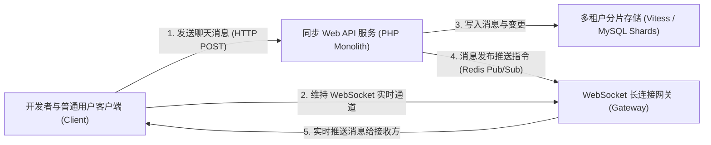
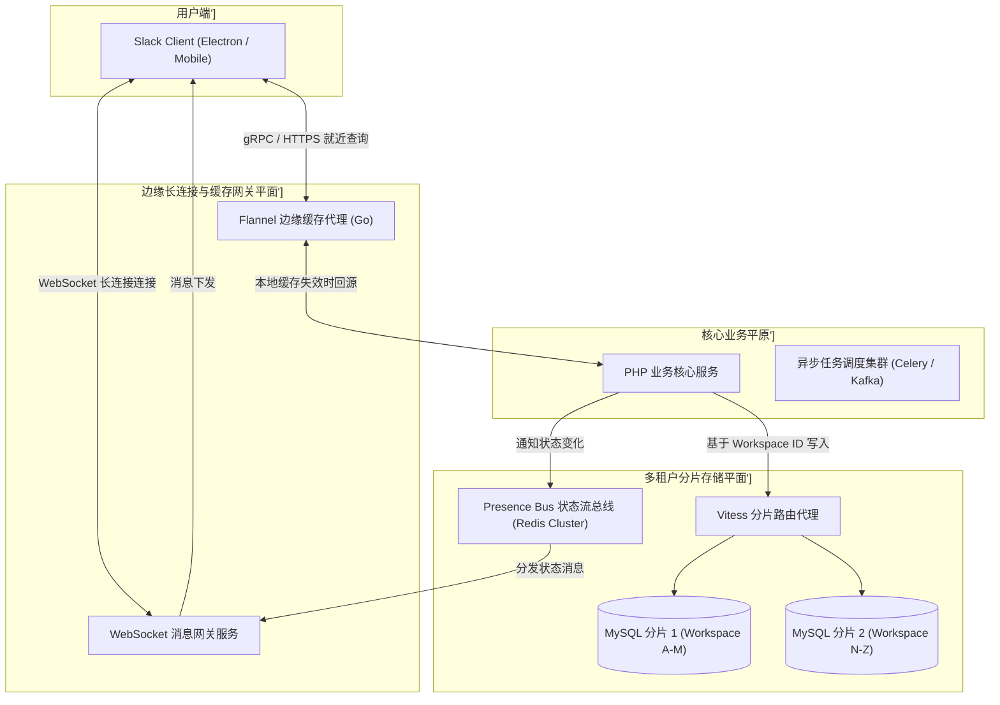
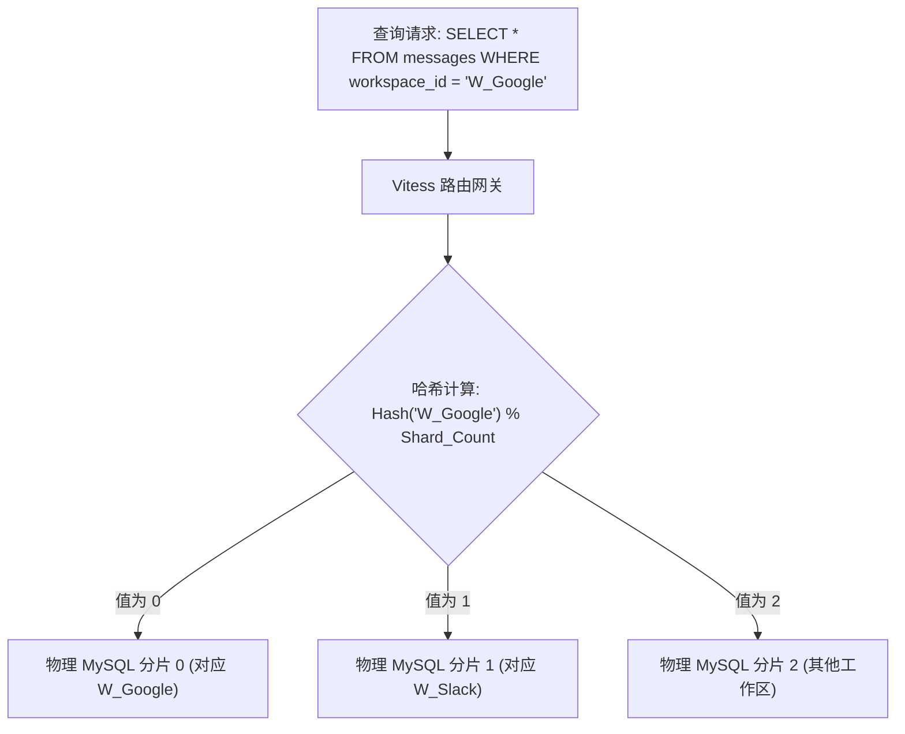
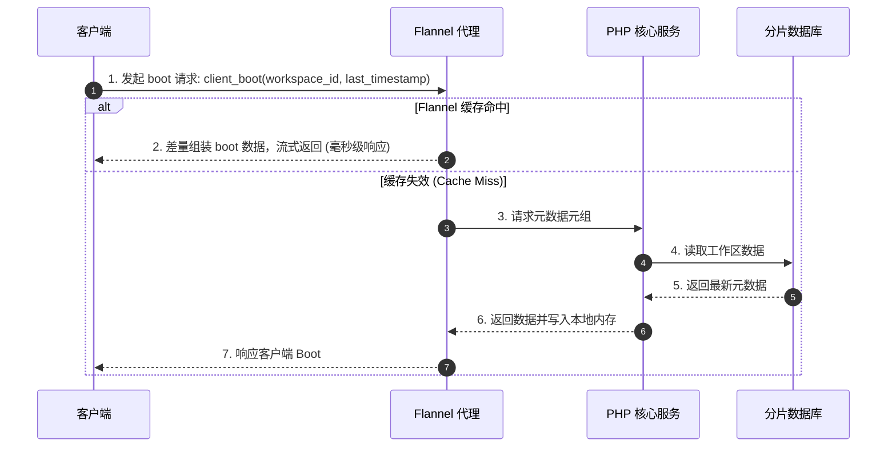

import CaseStudyHeader from '@site/src/components/CaseStudyHeader';
import DesignIntent from '@site/src/components/DesignIntent';
import ArchitectureEvolution from '@site/src/components/ArchitectureEvolution';
import TradeoffExplorer from '@site/src/components/TradeoffExplorer';
import GlossaryTerm from '@site/src/components/GlossaryTerm';
import ResearchNote from '@site/src/components/ResearchNote';
import QuizCard from '@site/src/components/QuizCard';
import CompareSlider from '@site/src/components/CompareSlider';
import GuidedExercise from '@site/src/components/GuidedExercise';
import PyRunner from '@site/src/components/PyRunner';

# Slack：工作区分片与万亿长连接实时通信架构

<CaseStudyHeader
  oneLiner="Slack 通过基于工作区分片（Workspace Sharding）的租户隔离设计与自研的 Flannel 边缘缓存网关，解决了企业级高并发长连接状态广播的洪峰瓶颈，实现了支持百万级并发、毫秒级触达的实时消息与状态总线系统。"
  stats={[
    {label: '活跃连接数', value: '全球 1000 万+ 并发长连接'},
    {label: '分片机制', value: 'Workspace Sharding (工作区隔离)'},
    {label: '核心协议', value: 'WebSocket 双向实时网络'},
    {label: '广播优化', value: 'Presence Bus (按需状态拉取与订阅)'},
    {label: '数据库路由', value: 'Vitess (分库分片引擎)'}
  ]}
/>

:::info 对应课程概念
本案例横跨 [Month 3 消息队列与发布订阅](../data-cache-queue/cache-queues-idempotency)、[Month 5 分布式状态机与一致性](../core-components/api-gateway)、[Month 6 云原生多租户隔离](../cloud-enterprise-industrial/capstone-cloud-native)。它深度揭示了在大规模实时协同办公（IM）场景下，架构师如何通过合理设定多租户物理边界，将全网爆炸的复杂状态流控制在单工作区分片中。
:::

## 1. 设计初衷：为什么不能像微信一样做“全局单体”？

与微信等以“个人”为核心、拥有全局社交关系的 IM 产品不同，Slack 是以“工作区（Workspace）”为边界的企业级协作工具。

Slack 在架构设计上面临着完全不同的权衡：
1. **工作区内的极高复杂度**：在一个大企业工作区（可能有数万员工）中，存在成百上千个公共/私有频道（Channels）。当一个用户登录时，客户端需要加载当前工作区的所有频道列表、成员列表、历史消息摘要、企业级复杂权限模型等，这使得 **<GlossaryTerm term="Client Boot Payload" definition="客户端启动载荷：指用户建立连接登录时，服务器需要一次性读取并下发给客户端的所有工作区元数据（包含所有频道、群组成员列表、自建表情等）。在超大工作区中，该载荷可高达数十兆字节，极易撑爆客户端内存并导致连接超时。">客户端启动载荷（Client Boot Payload）</GlossaryTerm>** 极为沉重。
2. **状态广播的“马太效应”**：如果采用全局发布订阅，在一个有 5 万名成员的工作区中，当一个用户更改其“在线/离线（Presence）”状态时，若盲目地向所有成员广播该变化，将产生 $O(N^2)$ 级（即 $50000 \times 50000$）的推送流量。单次状态变动将导致数百万次长连接推送，瞬间压垮网关服务器。
3. **企业数据隔离与合规性**：不同企业客户（特别是金融、政企类客户）要求其聊天数据必须实现彻底的物理隔离，甚至要求数据存储在特定的地理区域内。

为了在“高并发长连接”与“严密租户隔离”之间取得平衡，Slack 团队将**工作区（Workspace）作为核心分片键**，构建了工作区分片（Workspace Sharding）架构，并辅以 Presence Bus 状态过滤网关及 Flannel 本地缓存，攻克了实时协同的网络延迟瓶颈。

<DesignIntent
  problem="在拥有千万级长连接的高并发协同办公环境下，如何设计高隔离度、低时延的实时消息与状态系统，防止大企业工作区登录引发惊群效应并造成广播洪峰暴涨？"
  users="全球数十万家企业的员工，要求在千人乃至数万人通道中收发消息无延迟，且开会/在线状态秒级对齐。"
  devices="支持长连接 WebSocket 协议的 PC 桌面客户端、Web 浏览器及移动端 App，与多租户分片云端服务器的高速网络对齐。"
  goals={[
    '工作区分片数据库：采用基于 Workspace ID 对底层 MySQL 存储节点进行横向拆分，实现业务数据的彻底物理隔离。',
    'WebSocket 实时长连接网关：构建多节点 WebSocket 集群（网关层），负责管理全球千万级客户端长连接。',
    '自研 Flannel 边缘缓存网关：在客户端与网关层之间引入 Flannel 缓存服务器，负责在边缘就近查询与缓存工作区元数据，消灭数据库 Boot 瓶颈。',
    'Presence Bus 状态总线优化：将主动推送改造为按需订阅（Subscribe-on-Demand），仅订阅用户当前屏幕可视区域内的成员状态。'
  ]}
  constraints={[
    '跨工作区通信受限：由于是以 Workspace 为核心分片，涉及跨工作区的共享频道协作时，需要建立分布式桥接代理。',
    '内存与带宽成本：WebSocket 网关需要维护庞大的连接上下文，内存碎片化严重，必须通过分级缓存进行卸载。',
    '发布订阅的延时要求：消息触达延迟必须控制在 100 毫秒以内。'
  ]}
  firstStep="划分工作区边界，基于 Workspace ID 进行数据库的物理实例分片；部署 WebSocket 长连接网关层作为实时广播地基；设计并嵌入 Flannel 边缘代理实现元数据就近加速。"
/>

## 2. 系统功能全景

以下是 Slack 实时消息总线与分片架构的功能全景图：

---

## 3. 最新架构总览

Slack 的整体架构划分为同步 Web API 平面、异步长连接推送网关以及多租户分片数据层：

### 3a. 系统上下文图 (System Context)

### 3b. 容器架构图 (Container)

---

## 4. 核心机制拆解

### 4a. 基于租户（Workspace）的横向分片设计 (Workspace Sharding)

在 Slack 的设计理念中，每个工作区是一个天然的闭合环境，因此系统直接使用 **Workspace ID** 作为数据库的分片键（Sharding Key）：
1. **多租户物理隔离**：不同的工作区数据可能落地在完全独立的物理 MySQL 实例上。即便某个爆款工作区（如超大型企业）产生流量洪峰，也仅会消耗对应的特定数据库分片资源，绝不波及其他分库上的小租户。
2. **逻辑数据库路由 (Vitess)**：Slack 使用了底层分表路由引擎 **<GlossaryTerm term="Vitess" definition="一个用于对 MySQL 进行横向扩展的开源数据库中台系统。它将 MySQL 的底层复杂分片、路由、主备切换和连接池管理透明化，使应用程序可以像访问单个大型 SQL 数据库一样进行开发。">Vitess</GlossaryTerm>**。它能自动解析 SQL 中的 `workspace_id`，将查询秒级导向对应的 MySQL 实体分片。

### 4b. 边缘元数据缓存代理 Flannel 机制

在 Flannel 架构诞生前，Slack 客户端每次建立 WebSocket 连接，网关服务都必须去后端 MySQL 读取整个工作区的全部元数据，生成巨大的 Boot Payload。由于网络抖动频繁重连，这导致后端数据库发生“读雪崩”。

为了解决此工程瓶颈，Slack 研发了 **<GlossaryTerm term="Flannel 边缘缓存" definition="Slack 研发的专门放置在 WebSocket 网关前端的边缘代理缓存服务（Go 语言实现）。它可以在边缘节点缓存工作区的静态元数据，在客户端发起重连时直接利用缓存拼装 Boot Payload，避免数据库读雪崩。">Flannel 缓存代理</GlossaryTerm>** 机制：
1. **就近极速启动**：Flannel 作为代理部署在靠近用户的边缘节点，它在本地维护了当前节点所服务的全部工作区的全局内存缓存。
2. **差量拉取（Delta Loading）**：客户端只需拉取“自上次登录时间戳以来的变更”，Flannel 比对本地缓存后流式返回差量，使冷启动包体积缩小 99%。

### 4c. Presence Bus 状态总线优化

在线状态（Presence）变更广播在大型群聊中是流量杀手。如果 5 万人的群中每个人的状态变化都向其他人推送，极易压垮网络。

Slack 设计了 **<GlossaryTerm term="Presence Bus" definition="Slack 的状态分发总线，基于 Redis 内存网格实现。它将传统的『全员状态广播』改造成『按需可视订阅』模式，客户端仅订阅当前屏幕可视区域内的成员状态，极大节省了系统推送带宽。">Presence Bus</GlossaryTerm>** 来平抑这一洪峰：
1. **屏幕可视区订阅 (Lazy Subscription)**：客户端建立 WebSocket 连接后，网关并不直接下发整个企业 5 万人的状态。相反，只有当用户点开某个频道，或者滚动屏幕使某些成员出现在当前视窗（Viewport）中时，客户端才通过 WebSocket 向 Gateway 发送 `subscribe_presence(user_ids)`。
2. **动态销毁订阅**：一旦成员滑出视窗，订阅即时销毁。这种动态、延迟加载策略将推送数量减少了 95% 以上。

---

## 5. 关键数据结构与算法

在大规模 IM 架构中，使用高效的内存检索及分片路由是实现极速通信的基石。

### 路由哈希环与逻辑分片 (Consistent Hash Ring)
在 Slack 进行数据扩展与 Vitess 分片时，利用一致性哈希来规避扩容引发的数据大面积迁移是经典工程手段：

$$Shard = Hash(workspace\_id) \% Shards\_Count$$

*设计用意*：
- 保证特定 Workspace 的全部核心实体（Messages, Channels, Users）具有强亲和性，全部落在相同的物理节点，从而确保事务、强一致性读在单机内完成，避免极其昂贵的跨库分布式两阶段提交（2PC）。

---

## 6. 架构对比

### 全局统一大网模式 vs 工作区分片独立多租户模式

<CompareSlider
  before={
    

      <strong>全局统一单体网络 (微信/Telegram 模式)</strong>
      

        所有的用户和消息落在一张巨型网格中，数据全局共享。虽然这对于跨机构社交和加好友极其便利，但是在大群发红包、全员状态变更时会产生惊人的全局写放大与广播洪峰，且数据隔离性差，难以满足企业合规诉求。
      

    

  }
  after={
    

      <strong>多租户工作区分片模式 (Slack 模式)</strong>
      

        以 Workspace ID 为强物理边界切分数据。大企业的几万用户仅在自己的数据库分片、自己所连接的 WebSocket 网关子集群内流通状态。这完美地隔离了高并发风暴，且天然支持数据本地化与合规性约束。
      

    

  }
  labels={['全局单体网络', '多租户工作区分片']}
/>

---

## 7. 核心决策的取舍

面对庞大的协同网络，架构师必须在在线通信模式与系统开销之间做出取舍：

<TradeoffExplorer
  title="在线状态 (Presence) 交互机制取舍"
  dimensions={['实时状态准确度', '网关与网络带宽开销', '客户端内存占用', '复杂网络抗抖动性', '开发与维护成本']}
  options={[
    {
      name: '全员状态主动推送 (Push-based Presence Broadcast)',
      scores: [5, 1, 1, 4, 5],
      note: '状态极其精准，用户一上线所有人立刻秒级感应。但在大企业（数万人以上）工作区中，状态变更会导致 $O(N^2)$ 的网络流量洪峰，瞬间阻塞网关。',
      whenToUse: '仅限小型团队工作区（如成员少于 500 人）。'
    },
    {
      name: '可视区域按需订阅 (Lazy viewport subscription - Slack 采用模式)',
      scores: [4, 5, 5, 3, 3],
      note: '在不牺牲用户体验的前提下，将网关状态推送带宽削减 95% 以上。但开发复杂度高，需要客户端与 WebSocket 网关进行精密的状态机协同与销毁逻辑。',
      whenToUse: '支持中大型企业协作、拥有数万并发连接的 IM 协同平台。'
    },
    {
      name: '客户端轮询状态 (On-demand pull / Polling)',
      scores: [1, 3, 5, 5, 5],
      note: '实现极其简单，网关不需要维护任何复杂的订阅状态机。但是状态准确度低（存在分钟级延时），且会引发 API 服务器的周期性请求洪峰。',
      whenToUse: '对实时状态对齐要求不高、算力极度受限且不想维护长连接的轻量级协同系统。'
    }
  ]}
/>

---

## 8. 实践指引：实现一个多租户工作区分片路由器

构建一个简易的多租户路由分配与消息分片引擎，是理解 Slack 分库分片与数据隔离的有效途径。

在下方练习中，使用 Python 构建一个根据 Workspace 键进行消息哈希分配并存入隔离物理分片的仿真引擎。

<GuidedExercise
  title="练习指引：实现一个多租户工作区分片与隔离写入系统"
  goal="使用一致性哈希/简单哈希取模，实现一个分片路由网关。确保不同工作区（如 W_Google, W_Apple）的数据被精准导向完全隔离的物理分片（DB Shards），并防止越权越界访问。"
  hints={[
    '你可以使用 Python 的 `hashlib` 计算 `workspace_id` 的 MD5，转换成整数后对 Shard 数求余数，得到 Shard ID。',
    '物理分片可用字典模拟，形如 `{0: shard_0_data, 1: shard_1_data}`。',
    '安全性校验：在路由器层必须验证数据是否能跨 Shard 泄露，若在 Shard 1 中读取到了 Shard 0 归属的工作区，需触发安全警报。'
  ]}
  steps={[
    '创建 `ShardedRouter(shards_count)` 路由中台。',
    '编写 `get_shard_id(workspace_id)` 方法计算对应的分片索引。',
    '实现 `write_message(workspace_id, channel, sender, content)`，将消息持久化在对应的 Shard 字典中。',
    '模拟向三个不同的工作区写入数据，打印其落地的物理分片信息，并验证租户隔离安全性。'
  ]}
  checks={[
    '多租户消息能被正确、均匀地分配在各个数据库分片实例中。',
    '租户之间的查询被逻辑与物理严格阻断，不存在跨工作区的越权读取。'
  ]}
/>

#### 交互式 Python 运行实验
在下方控制台中运行并修改已准备好的工作区分片路由及隔离仿真代码，体会多租户隔离的数据分布特征：

<PyRunner
  expect="分片路由与隔离验证成功"
  rows={25}
  code={`import hashlib

class ShardedRouter:
    def __init__(self, shards_count=3):
        self.shards_count = shards_count
        # 模拟多个完全独立的物理数据库分片
        self.db_shards = {i: {} for i in range(shards_count)}
        
    def get_shard_id(self, workspace_id: str) -> int:
        # 基于 MD5 取模计算分片路由，确保幂等路由
        hash_hex = hashlib.md5(workspace_id.encode('utf-8')).hexdigest()
        hash_val = int(hash_hex, 16)
        return hash_val % self.shards_count
        
    def write_message(self, workspace_id: str, channel: str, user: str, text: str):
        shard_id = self.get_shard_id(workspace_id)
        shard_data = self.db_shards[shard_id]
        
        # 隔离校验：初始化租户空间
        if workspace_id not in shard_data:
            shard_data[workspace_id] = {}
        if channel not in shard_data[workspace_id]:
            shard_data[workspace_id][channel] = []
            
        # 写入物理隔离的数据结构中
        shard_data[workspace_id][channel].append({
            "sender": user,
            "text": text
        })
        print(f"[Router] 写入成功：工作区 '{workspace_id}' 的频道 '{channel}' 消息被分配至 数据库分片 {shard_id}")

    def read_tenant_data(self, request_workspace_id: str, shard_id: int):
        # 安全验证：模拟防跨租户泄露校验
        shard_data = self.db_shards[shard_id]
        if request_workspace_id not in shard_data:
            raise SecurityError(f"⚠️ 安全警告：越权访问！物理分片 {shard_id} 中不存在工作区 '{request_workspace_id}' 的数据")
        return shard_data[request_workspace_id]

class SecurityError(Exception):
    pass

# 1. 初始化 3 个物理数据库分片
router = ShardedRouter(shards_count=3)

# 2. 模拟写入不同租户的工作区协同消息
router.write_message("W_Google", "general", "Alice", "Hello Google Team!")
router.write_message("W_Amazon", "general", "Bob", "Hello AWS Team!")
router.write_message("W_Slack", "random", "Charlie", "Docusaurus is great!")
router.write_message("W_Google", "tech", "Dave", "GCN is ready for deployment.")

# 3. 验证数据归属与跨分片读取安全性
print("\\n--- 数据库物理分片数据快照 ---")
for s_id, data in router.db_shards.items():
    print(f"分片 {s_id} 存储的活跃租户: {list(data.keys())}")

print("\\n--- 执行合规性与租户隔离验证 ---")
google_shard = router.get_shard_id("W_Google")
print(f"W_Google 归属分片：{google_shard}")

# 读取属于自己的分片数据
data = router.read_tenant_data("W_Google", google_shard)
print(f"成功读取 W_Google 消息数：{len(data.get('general', [])) + len(data.get('tech', []))} 条")

# 尝试让 W_Amazon 去跨分片读取 W_Google 的物理存储
amazon_shard = router.get_shard_id("W_Amazon")
try:
    # 故意错误路由
    router.read_tenant_data("W_Amazon", google_shard)
except SecurityError as e:
    print(e)
    print("✅ 分片路由与隔离验证成功！系统成功阻断并报警跨租户未授权路由请求。")
`}
/>

---

## 9. 知识自测

完成自测以检验你对工作区分片、Flannel 缓存、长连接与状态总线的掌握程度：

<QuizCard
  questions={[
    {
      q: '在 Slack 架构中，为什么对工作区进行分片（Workspace Sharding）可以大幅缓解群聊状态变更及消息推送的全局系统压力？',
      options: [
        'A. 因为分片可以直接降低客户端的网速要求，使用户本地网络变快',
        'B. 因为通过 Workspace ID 切分后，大企业的海量连接、消息流以及状态订阅被严格限制在局部的分片数据库与特定的 WebSocket 边缘代理内，物理上阻断了高并发流量波及其他无关联租户，实现了资源天然隔离',
        'C. 因为分片之后所有的频道都变成了单聊频道，消灭了群聊功能',
        'D. 仅仅是因为分片可以对聊天消息进行高级加密'
      ],
      answer: 1,
      explain: 'Workspace Sharding 是 Slack 多租户的核心。它把一个庞大无边界的全局协作网络切成了若干个互不相交的局部子网，使得数据库写操作、WebSocket 连接的管理以及 Presence 状态广播都被局限在工作区内部，阻断了流量雪崩向全网扩散。'
    },
    {
      q: 'Slack 的边缘缓存 Flannel 网关，在处理用户登录重连（Reboot）的过程中，最核心的工程贡献是什么？',
      options: [
        'A. 替代用户的本地操作系统，执行代码静态编译',
        'B. 彻底取消 WebSocket 连接，改用短连接轮询',
        'C. 作为一个就近部署的缓存代理，在边缘维护当前区域内活跃工作区的全部元数据缓存；当用户发生重连时直接在边缘组装 Boot Payload，且支持仅拉取差量数据（Delta Loading），从而避免了上百万重连请求直接压崩溃后端 MySQL 数据库',
        'D. 仅仅是为了压缩图片和表情包的大小以节省带宽'
      ],
      answer: 2,
      explain: '在 Flannel 诞生前，Slack 的登录读操作（Client Boot Payload）是数据库杀手。Flannel 作为就近部署的 Go 语言网关代理，把工作区元数据缓存在边缘内存中，连接建立与重连时能以毫秒级响应，并过滤掉 client 早已拥有的重复数据，保护了后端主库。'
    },
    {
      q: 'Presence Bus 状态总线采用的“可视区域按需订阅（Lazy Viewport Subscription）”模式，相比传统的“状态全局广播”，其优势在于什么？',
      options: [
        'A. 用户不需要注册即可查看所有人的在线状态',
        'B. 客户端能自动预测用户未来 10 天的上下线轨迹',
        'C. 客户端建立长连接后，WebSocket 网关不广播全员状态，只有当特定成员出现在当前屏幕可视区域时才发起按需订阅。这种机制消灭了 O(N^2) 的全局状态变更流量，极大地减轻了网关服务器的网络带宽压力',
        'D. 为了强迫用户必须将客户端窗口缩小以节省显存'
      ],
      answer: 2,
      explain: '状态全局广播是聊天软件中最具破坏性的写放大因素。对于拥有数万人的超大企业，一个人的 Presence 变更如果发给所有人，会制造数百万次数据下发。按需订阅（可视区订阅）使每个 client 在同一时刻只需要订阅数十个当前屏幕可见的同事，极大地削减了无效广播流。'
    }
  ]}
/>

## 来源

- [How Slack Scales Its Real-Time Messaging Infrastructure (Slack Engineering Blog)](https://slack.engineering/)
- [Flannel: An Edge Cache Recommender System for Slack's Workspace Boot Optimization](https://slack.engineering/flannel-an-edge-cache-for-slack/)
- [Vitess: Production-Ready Horizontal Scaling for MySQL databases](https://vitess.io/docs/)
- [Scaling Slack's Presence Bus Subscriptions System (Slack Engineering)](https://slack.engineering/scaling-slacks-presence-bus/)