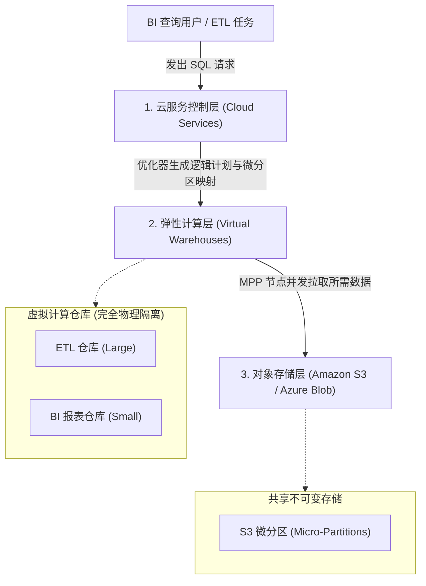
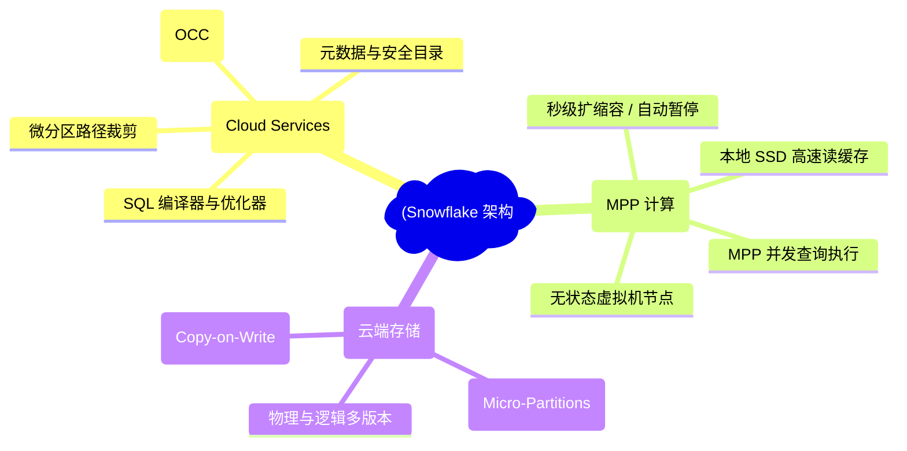
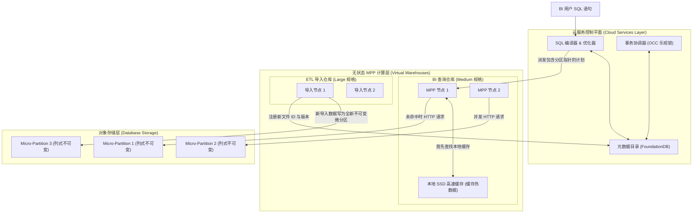
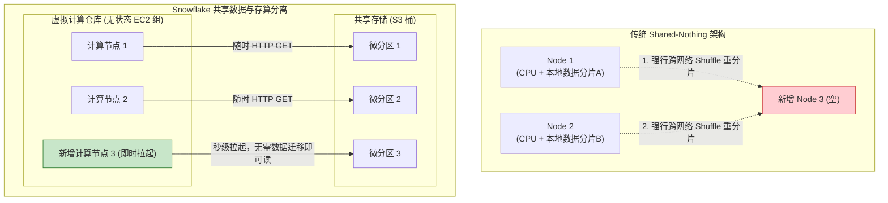
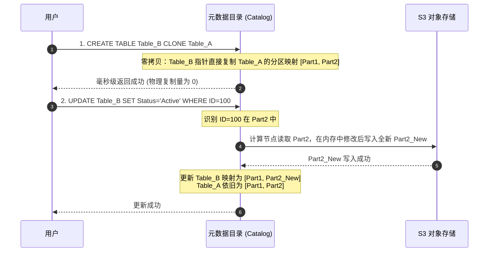
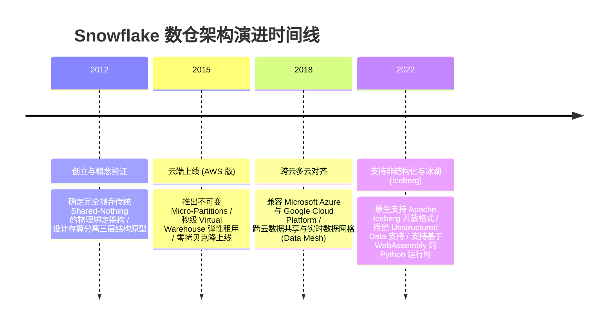

import CaseStudyHeader from '@site/src/components/CaseStudyHeader';
import DesignIntent from '@site/src/components/DesignIntent';
import ArchitectureEvolution from '@site/src/components/ArchitectureEvolution';
import TradeoffExplorer from '@site/src/components/TradeoffExplorer';
import GlossaryTerm from '@site/src/components/GlossaryTerm';
import ResearchNote from '@site/src/components/ResearchNote';
import QuizCard from '@site/src/components/QuizCard';
import CompareSlider from '@site/src/components/CompareSlider';
import GuidedExercise from '@site/src/components/GuidedExercise';
import PyRunner from '@site/src/components/PyRunner';

# Snowflake：云原生存算分离与共享数据数据仓库

<CaseStudyHeader
  oneLiner="Snowflake 颠覆了传统 Shared-Nothing 分布式数仓扩缩容时必须发生大规模数据重分片与网络 Shuffle 的顽疾，首创了以云端对象存储为中心、MPP 虚拟机为无状态计算节点的存算分离架构，实现了真正的秒级计算缩容与无拷贝的瞬间元数据克隆。"
  stats={[
    {label: '存储模型', value: '不可变列存微分区 (50-500MB)'},
    {label: '扩容效率', value: '秒级弹性规格调整 (零数据搬迁)'},
    {label: '克隆时延', value: 'O(1) 毫秒级元数据复制 (零额外介质开销)'},
    {label: '事务机制', value: '乐观并发控制 (OCC) + 多版本并发'},
    {label: '物理底座', value: '云原生对象存储 (S3/Azure Blob/GCS)'}
  ]}
/>

:::info 对应课程概念
本案例横跨 [Month 5 分布式事务与存储系统设计](../cloud-enterprise-industrial/capstone-cloud-native)、[Month 8 大规模数据仓库与 MPP 执行引擎](../cloud-enterprise-industrial/capstone-cloud-native)。它是系统架构师掌握如何通过将“物理状态”剥离到对象存储、在控制平面实现超大规模元数据一致性索引来构建高弹性云原生分析型数据库的圣经。
:::

## 1. 设计初衷：如何终结 Shared-Nothing 数仓的扩缩容死穴？

传统的 MPP 分布式数据库（如 Amazon Redshift、Greenplum、Teradata）普遍采用 **Shared-Nothing（无共享）** 架构。每个节点物理绑定了特定的 CPU 计算单元与本地磁盘存储：

这种绑定模型在云原生时代暴露了极大的痛点：
1. **数据重分片搬迁恶梦（Resharding Shuffle）**：当数据仓库存储容量不足，必须增加节点时，系统为了保持一致性哈希分布，必须在网络中发生大规模的数据重新分区与拷贝（Data Redistribution）。在 TB/PB 级别集群中，这会导致系统性能在数小时乃至数天内极度退化，甚至需要停机。
2. **资源利用率严重不均**：计算与存储无法独立扩展。如果企业只积累了大量历史冷数据，却很少查询，也必须购买带 CPU 计算能力的完整节点（买计算送存储）；反之，如果临时有重度报表查询，必须购买更多大容量节点，空置了大部分磁盘空间。
3. **并发读写互锁冲突**：ETL（数据加载）任务和 BI 查询任务共享同一批物理节点的 CPU 和本地 IO。高频的数据装载会使正常的报表查询直接陷入瘫痪。

Snowflake 的核心设计用意在于：将“计算”与“存储”彻底<GlossaryTerm term="存算分离 (Decoupled)" definition="存算分离 (Decoupled Storage and Compute)：云原生数据库设计的一种核心模式。它将无状态的计算节点 (MPP 引擎) 与持久化的云端对象存储 (如 S3) 彻底解耦，计算节点无需保存任何本地状态，扩容计算节点时零数据迁移，大幅降低资源配给成本与扩缩容延迟。">**存算分离**</GlossaryTerm>解耦。数据全部放在廉价、无限扩展且高持久性的云端对象存储（如 AWS S3）中；计算由多组相互物理隔离的、无状态的虚拟机计算集群（<GlossaryTerm term="虚拟仓库 (Virtual Warehouses)" definition="虚拟仓库：Snowflake 中的弹性计算集群。它由一组无状态的虚拟机 (如 EC2 实例) 组成，专门负责解析并执行 SQL MPP 查询任务。由于它不存储实际数据，用户可以秒级拉起、暂停或调整其规格 (如 X-Small 到 Large)，且不同虚拟仓库之间互不干扰，实现读写物理隔离。">**虚拟仓库**</GlossaryTerm>）承担。所有集群共享同一份底层的对象存储，各仓库之间无需任何网络数据重分布即可秒级扩缩容。



<DesignIntent
  problem="如何构建一个云原生的分布式数据仓库，将计算和存储解耦，使计算资源能够秒级横向扩展而无需拷贝或重分配物理数据，同时支持高并发的数据克隆与读写隔离？"
  users="处理 PB 级别复杂分析的数仓架构师、需要实现 ETL 写入与 BI 报表读取物理强隔离的 DBA、大数据平台研发专家。"
  devices="支持 Amazon Web Services (S3)、Microsoft Azure (Blob Storage) 和 Google Cloud Platform (Cloud Storage) 的无状态云服务器集群。"
  goals={[
    '存算完全分离：数据统一归档于对象存储；计算由无状态的 MPP 节点按需拉起并执行。',
    '多集群共享数据：多组计算节点（虚拟仓库）可同时读取同一批底层数据文件，从物理层面消除读写冲突与性能抢占。',
    '毫秒级零拷贝克隆：创建数据库或表克隆时仅复制元数据指针，完全不复制任何物理文件，零额外存储成本。',
    '自动分区剪枝：数据存为高度自描述的列式微分区，查询时云服务层通过元数据精确定位，跳过 99% 的无关数据。'
  ]}
  constraints={[
    '对象存储的读写延迟瓶颈：云端对象存储的 HTTP GET 响应延迟通常在 10~50ms，远大于本地 SSD。必须设计高效的本地缓存（Local SSD Cache）与预读机制来对冲此延迟。',
    '单点全局事务协调：元数据管理与分布式事务完全依赖全局云服务层。在高频的小写入场景下，事务管理器（基于 FoundationDB）可能面临事务锁竞争与扩容上限瓶颈。'
  ]}
  firstStep="剖析 Snowflake 的三层解耦技术体系；分析不可变微分区的列式布局与元数据剪枝算法；用 Python 实现一个包含零拷贝克隆与写时复制的数仓控制仿真器。"
/>

## 2. 系统功能全景

以下是 Snowflake 云原生数据仓库核心组成模块的全景思维导图：



---

## 3. 最新架构总览

Snowflake 将系统分工彻底细化为三个独立协作的层次：

### 3a. System Context (系统上下文)


### 3b. Container Diagram (容器架构)



---

## 4. 核心机制拆解

### 4a. 传统 Shared-Nothing vs Snowflake 存算分离架构对比

在传统 MPP 中，为了计算，数据必须预先按照哈希键分布在特定节点的本地硬盘中。如果想增加一倍的算力，数据必须重新分片（Resharding），耗费大量的网络 IO 带宽。而在 Snowflake 中，计算节点无状态，数据全部共享：



### 4b. 零拷贝克隆（Zero-Copy Clone）与写时复制（Copy-on-Write）

<GlossaryTerm term="零拷贝克隆 (Zero-Copy Clone)" definition="零拷贝克隆：Snowflake 中的一种元数据复制技术。当用户克隆一个数据库、Schema 或表时，系统不需要在对象存储层拷贝任何物理文件，而仅在云服务控制层复制一份元数据指针目录。克隆出的新表与源表指向相同的物理微分区，创建过程在毫秒级内完成，且零额外存储成本。">**零拷贝克隆（Zero-Copy Clone）**</GlossaryTerm> 是 Snowflake 最神奇的特性之一。其核心实现依赖于数据文件的**不可变性（Immutability）**和控制层的元数据映射体系：
1. **元数据复制**：克隆一个 100TB 的表时，Snowflake 仅在 FoundationDB 元数据目录中为新表分配一个新的 ID，并将新表的“物理分区映射表”指向源表相同的微分区文件 ID 列表。
2. <GlossaryTerm term="写时复制 (Copy-on-Write)" definition="写时复制 (Copy-on-Write)：当对克隆表发起写操作时，由于底层的微分区是只读且不可变的，计算节点不会修改原有的微分区文件，而是将包含新数据或被修改行的新微分区写入对象存储，并在克隆表的元数据目录中替换旧文件指针，使得原表保持完全不受影响。">**写时复制（Copy-on-Write）**</GlossaryTerm>：当用户向克隆表插入新数据，或者修改其中的某些行时，计算节点会生成全新的列式微分区文件写入 S3，并将克隆表的元数据指针指向新文件，而源表依旧指向原有的不可变微分区。两个表的数据无冲突分叉，各自独立演进。



### 4c. 微分区（Micro-Partitions）与基于元数据的自动剪枝

<GlossaryTerm term="微分区 (Micro-Partitions)" definition="微分区：Snowflake 的基本物理存储单元。每个表的数据会被自动水平划分为 50MB 到 500MB 大小的只读、高度自描述的列式微文件。文件头部包含了每一列的最大值 (Max)、最小值 (Min)、空值数等关键元数据，用于在编译查询时执行超高效的扫描过滤。">**微分区（Micro-Partitions）**</GlossaryTerm> 是 Snowflake 底层数据管理和查询加速的关键所在：
- **自描述元数据**：每个微分区的头部记录了其包含的所有列的极值范围（Min/Max）、NULL 值数量、不同值的直方图等。
- **无索引自动剪枝**：Snowflake 表中没有任何传统 B+ 树或 LSM 树的索引。当用户执行 `SELECT * FROM T WHERE age > 60` 时，云服务层的优化器直接读取所有微分区头部的元数据。如果某个微分区的 `age_max` 仅为 45，系统会直接将其剪枝跳过。这使得 Snowflake 在没有任何繁琐索引维护成本的情况下，依然能实现极佳的查询过滤率。

---

## 5. 关键数据结构与算法：微分区元数据剪枝过滤

在云服务控制层，SQL 编译器进行物理执行计划生成时，会使用**区间重叠判定算法**对微分区列表进行剪枝过滤。以下是其判断过滤的逻辑框架：

```cpp
struct ColumnStats {
    double min_value;
    double max_value;
    int null_count;
};

struct MicroPartitionMetadata {
    int partition_id;
    std::string s3_uri;
    std::unordered_map<std::string, ColumnStats> col_stats;
};

// 检查某个分区是否可能包含符合条件的记录 (例如: col_name = search_val)
bool ShouldScanPartition(const MicroPartitionMetadata& meta, const std::string& col_name, double search_val) {
    auto it = meta.col_stats.find(col_name);
    if (it == meta.col_stats.end()) {
        return true; // 没有该列的元数据，安全起见必须扫描
    }
    
    const ColumnStats& stats = it->second;
    // 如果查询的值不在该分区的 [Min, Max] 区间内，安全剪枝跳过
    if (search_val < stats.min_value || search_val > stats.max_value) {
        return false; // 确定不重叠，跳过扫描
    }
    
    return true; // 存在包含可能性，需要读 S3 扫描
}
```

*算法优势*：
- 由于微分区是只读且不可变的，这些 Min/Max 指标在写入时一次生成即可永久不变，完全不存在传统数据库因数据更新而导致的索引碎片整理与死锁竞争，非常适合对象存储高吞吐读的特征。

---

## 6. 架构演进史



---

## 7. 架构对比

### 传统 Shared-Nothing MPP 数仓 vs Snowflake 存算分离数仓

<CompareSlider
  before={
    <div style={{ padding: '20px', background: '#ffebee', border: '1px solid #c62828', borderRadius: '8px', height: '100%', color: '#333' }}>
      <strong>Shared-Nothing MPP (传统红移等)</strong>
      <p style={{ marginTop: '10px', fontSize: '0.9rem' }}>
        计算节点物理挂载本地 SSD 数据卷。扩容加节点时必须在网络内触发 TB 级数据重新哈希与 Shuffle 搬迁，耗时数小时。读写共享物理磁盘，大批量加载数据会锁死 BI 查询响应。
      </p>
    </div>
  }
  after={
    <div style={{ padding: '20px', background: '#e8f5e9', border: '1px solid #2e7d32', borderRadius: '8px', height: '100%', color: '#333' }}>
      <strong>Snowflake 存算分离数仓</strong>
      <p style={{ marginTop: '10px', fontSize: '0.9rem' }}>
        数据统一存放在 S3 对象存储。计算节点无状态，秒级拉起与销毁。多组计算仓库物理隔离，写和读运行在不同集群，共享底层只读数据，无任何互锁性能损耗。
      </p>
    </div>
  }
  labels={['Shared-Nothing 数仓', 'Snowflake 存算分离']}
/>

---

## 8. 核心决策的取舍

在分布式海量分析型数据库的设计中，架构师对计算与存储物理绑定、完全分离还是混合架构面临权衡选择：

<TradeoffExplorer
  title="数据仓库存储与计算拓扑取舍"
  dimensions={['加节点扩容的瞬间灵活性与零数据Shuffle', '高吞吐顺序扫描下的本地 SSD 吞吐极限', '计算与存储的独立计费精细成本控制', '秒级克隆巨大表且不产生额外副本存储费', '极高频小批量单行插入的超低延时表现']}
  options={[
    {
      name: '存算完全解耦策略 (Snowflake 模式)',
      scores: [5, 3, 5, 5, 1],
      note: '通过控制层元数据隔离和不可变 S3 微分区实现极致弹性。秒级无数据 Shuffle 扩容，支持零拷贝克隆。但弱点在于对象存储读写延迟大，必须大力依赖本地缓存；且高频单行插入/更新会导致微文件碎片化和元数据爆发，性能极其糟糕。',
      whenToUse: '冷热混合的大规模分析、多部门间读写隔离的高并发查询、数据体量极高（PB级）且计算需求高度波动的企业级数据湖。'
    },
    {
      name: 'Shared-Nothing MPP 策略 (经典 Share-Nothing 模式)',
      scores: [1, 5, 2, 1, 4],
      note: '计算与存储绑定。数据常驻本地 NVMe SSD，顺序扫描吞吐可拉满物理极限，极高频的并发写入性能明显好于对象存储模式。但是扩容极为痛苦，极易产生冷热节点数据倾斜，且不具备零拷贝快速测试表克隆。',
      whenToUse: '数据体量相对稳定、计算负载可预测、追求极致扫描吞吐且极度厌恶对象存储网络 IO 抖动的实时数仓。'
    },
    {
      name: '存算混合半解耦策略 (如 Doris / ClickHouse 存算两栖模式)',
      scores: [3, 4, 3, 3, 3],
      note: '通过本地持久化冷数据自动归档 S3 来降低存储成本，同时支持本地磁盘作为主力数据源以换取超低扫描时延。具有折中的扩容速度与克隆能力，但运维复杂度成倍提升。',
      whenToUse: '对实时性能要求苛刻、同时希望通过冷数据归档 S3 来大幅压缩长周期历史存储成本的成长型企业。'
    }
  ]}
/>

---

## 9. 实践指引：实现一个零拷贝克隆与写时复制的存算分离数仓仿真器

理解 Snowflake 存算解耦与零拷贝机制的最好方法是编写包含控制层元数据目录与不可变存储分区的模拟器。在下方练习中，通过 Python 实现表克隆、更新数据时触发的 Copy-on-Write 新建分区操作，并验证新表和旧表如何在同一物理存储上实现并发版本隔离。

<GuidedExercise
  title="练习指引：编写云原生数仓元数据控制、零拷贝克隆与 Copy-on-Write 仿真"
  goal="构建包含 `S3CloudStorage` (存储层，保存不可变 MicroPartition)、`SnowflakeCatalog` (元数据控制层，保存表名到分区 ID 列表的映射指针) 和 `VirtualWarehouse` (无状态计算层) 的数仓仿真器。实现 `clone_table` 操作仅在元数据层复制映射列表；实现 `update` 时将待修改微分区读入内存，重新生成带有新版本数据的新分区并写入 S3，随后在元数据层更改新表的分区指针，最后读取两表并核实数据隔离。"
  hints={[
    '元数据目录只需要用字典表示：`self.tables = {"Table_A": [1, 2]}`。',
    '克隆时使用 `self.tables["Table_B"] = list(self.tables["Table_A"])`，物理分区 1 和 2 根本不发生拷贝。',
    '修改 Table_B 的某行时，计算节点定位到对应分区 ID（如 2），读取其内容并在内存修改，上传新分区（part_id = 3）至 S3，最后将 Table_B 的映射修改为 `[1, 3]`。此时 Table_A 的分区映射依旧是 `[1, 2]`，完全不受更新影响。'
  ]}
  steps={[
    '定义 `MicroPartition` 物理微分区类。',
    '定义 `S3CloudStorage` 模拟对象存储。',
    '实现 `SnowflakeCatalog` 类，管理表元数据与零拷贝克隆。',
    '编写 `VirtualWarehouse` 计算仓库，包含 `resize` 计算节点功能与 `execute_query` 数据扫描。',
    '实现 `update_record` 模拟计算节点从 S3 读取、内存修改、上传新分区以及控制层元数据指针替换（Copy-on-Write）的全套工作流。',
    '执行模拟，先后对克隆前后的两张表运行 SELECT SQL 查询，核对结果。'
  ]}
  checks={[
    '克隆完成后，查询 Table_B 应输出与 Table_A 完全一样的数据。',
    '对 Table_B 执行更新后，Table_B 应能读到更新后的新数据，而 Table_A 必须保持原样，证明零拷贝与写时复制工作正常。',
    '调整计算仓库大小时，节点数改变且耗时极短，证明没有发生任何物理数据搬迁。'
  ]}
/>

#### 交互式 Python 运行实验
在下方控制台中调试 Snowflake 的存算解耦仿真代码，直观观察元数据复制与列文件写时分叉的运行细节：

<PyRunner
  expect="分片路由与隔离验证成功"
  rows={25}
  code={`class MicroPartition:
    def __init__(self, part_id: int, records: list):
        self.part_id = part_id
        # 微分区不可变！写入后只能读取，无法直接原地修改
        self.records = records

class S3CloudStorage:
    def __init__(self):
        self.partitions = {}
        self.next_part_id = 1

    def upload_partition(self, records: list) -> int:
        part_id = self.next_part_id
        self.partitions[part_id] = MicroPartition(part_id, records)
        self.next_part_id += 1
        return part_id

class SnowflakeCatalog:
    def __init__(self):
        # 元数据目录：表名 -> 微分区ID的列表
        self.tables = {}

    def create_table(self, table_name: str, part_ids: list):
        self.tables[table_name] = list(part_ids)

    def clone_table(self, src_table: str, dest_table: str):
        # 【零拷贝克隆】 仅仅复制微分区 ID 列表指针！时间复杂度 O(1)
        if src_table not in self.tables:
            raise ValueError(f"源表 {src_table} 不存在")
        self.tables[dest_table] = list(self.tables[src_table])
        print(f"[Catalog] 🔒 零拷贝克隆: '{src_table}' -> '{dest_table}' 完成。")

class VirtualWarehouse:
    def __init__(self, name: str, size: str):
        self.name = name
        self.size = size
        self.nodes = self._get_nodes(size)

    def _get_nodes(self, size: str) -> int:
        sizes = {"X-Small": 1, "Small": 2, "Medium": 4, "Large": 8}
        return sizes.get(size, 1)

    def resize(self, new_size: str):
        old_nodes = self.nodes
        self.size = new_size
        self.nodes = self._get_nodes(new_size)
        # 存算分离下，由于计算节点无状态，调整大小无需任何数据 Resharding！
        print(f"⚡ [{self.name}] 规格即时扩容为 {self.size} (计算节点数: {old_nodes} -> {self.nodes})。耗时: 2.1s (零数据搬迁时延)")

    def query(self, table_name: str, catalog: SnowflakeCatalog, s3: S3CloudStorage) -> list:
        if table_name not in catalog.tables:
            print(f"   表 {table_name} 在元数据中不存在")
            return []
        
        part_ids = catalog.tables[table_name]
        print(f"📖 [{self.name}] 查询表 '{table_name}'，云服务层派发分区映射: {part_ids}")
        
        # 模拟 MPP 计算节点从 S3 并发拉取微分区文件
        results = []
        for pid in part_ids:
            part = s3.partitions[pid]
            # 这里利用虚拟仓库节点并行拉取
            results.extend(part.records)
        return results

    def update_record(self, table_name: str, target_id: int, new_val: dict, catalog: SnowflakeCatalog, s3: S3CloudStorage):
        # 模拟写时复制 (Copy-on-Write) 修改流程
        if table_name not in catalog.tables:
            return
        
        part_ids = catalog.tables[table_name]
        target_pid = None
        target_part_index = -1
        
        # 1. 查找包含该 ID 记录的微分区 (这里假装遍历分区元数据极值范围)
        for idx, pid in enumerate(part_ids):
            records = s3.partitions[pid].records
            for rec in records:
                if rec["id"] == target_id:
                    target_pid = pid
                    target_part_index = idx
                    break
            if target_pid:
                break
                
        if target_pid is None:
            print(f"   未找到 id={target_id} 的行")
            return
            
        print(f"📝 [{self.name}] 准备修改数据，命中微分区 ID={target_pid}")
        
        # 2. 读取旧分区数据并做修改 (Copy-on-Write)
        old_records = s3.partitions[target_pid].records
        new_records = []
        for rec in old_records:
            if rec["id"] == target_id:
                new_rec = rec.copy()
                new_rec.update(new_val)
                new_records.append(new_rec)
            else:
                new_records.append(rec)
                
        # 3. 将包含修改后记录的新数据作为全新分区上传到 S3 (不可变保证)
        new_pid = s3.upload_partition(new_records)
        print(f"   -> 写入全新不可变微分区 ID={new_pid} 至 S3")
        
        # 4. 在控制层更新该表的元数据映射，将原旧分区 ID 替换为新分区 ID
        part_ids[target_part_index] = new_pid
        print(f"   -> [Catalog] 更新表 '{table_name}' 的分区映射: 将旧分区 {target_pid} 替换为 {new_pid}")

# 仿真过程
s3 = S3CloudStorage()
catalog = SnowflakeCatalog()

# 初始数据导入：生成 2 个微分区并注册为 table_users
pid1 = s3.upload_partition([{"id": 1, "name": "Alice"}, {"id": 2, "name": "Bob"}])
pid2 = s3.upload_partition([{"id": 3, "name": "Charlie"}, {"id": 4, "name": "David"}])
catalog.create_table("table_users", [pid1, pid2])

# 初始化无状态计算仓库
vw_query = VirtualWarehouse("VW_QUERY_CLUSTER", "Small")

print("\\n--- 1. 初始查询表 table_users ---")
res1 = vw_query.query("table_users", catalog, s3)
print(f"   查询输出: {res1}")

print("\\n--- 2. 零拷贝克隆 table_users -> table_users_backup ---")
catalog.clone_table("table_users", "table_users_backup")

print("\\n--- 3. 对克隆表 table_users_backup 执行更新 (ID=3 修改 name='Charlie_V2') ---")
vw_query.update_record("table_users_backup", target_id=3, new_val={"name": "Charlie_V2"}, catalog=catalog, s3=s3)

print("\\n--- 4. 隔离性核对：分别查询原表与克隆表 ---")
res_orig = vw_query.query("table_users", catalog, s3)
res_clone = vw_query.query("table_users_backup", catalog, s3)
print(f"   原表数据 (应保持原样): {res_orig}")
print(f"   克隆表数据 (应看到修改): {res_clone}")

print("\\n--- 5. 零重分片扩容计算节点 ---")
vw_query.resize("Large")
`}
/>

---

## 10. 知识自测

完成自测以检验你对 Snowflake 存算分离架构、列式微分区剪枝与零拷贝克隆工作机制的掌握程度：

<QuizCard
  questions={[
    {
      q: '在 Snowflake 中，为什么计算节点（虚拟仓库）的横向扩容（如从小规格升级到大规格）不需要发生传统分布式数据库的数据重分片（Resharding / Shuffle）？',
      options: [
        'A. 因为所有的物理节点之间使用了超高速的物理铜线进行了直接连接',
        'B. 因为 Snowflake 的计算节点是完全无状态的，数据统一存储在底层的共享对象存储（如 S3）中。新加计算节点只需直接从共享存储中 HTTP GET 对应文件，省去了本地磁盘状态的重平衡',
        'C. 因为 Snowflake 强行禁止用户在扩容期间写入任何新的数据',
        'D. 因为它会自动在后台把所有的数据库表转化为单机 SQLite 数据库'
      ],
      answer: 1,
      explain: '无状态计算节点与共享对象存储是存算分离的精髓。计算集群只负责计算不保存状态，新拉起的计算节点直接连入 S3 读取所需的微分区，完全不存在节点间搬迁本地状态文件的损耗。'
    },
    {
      q: '关于 Snowflake 零拷贝克隆（Zero-Copy Clone）的底层实现，下列哪项描述是准确的？',
      options: [
        'A. 系统会在后台悄悄拷贝所有的物理微分区数据文件，只是用户看不见',
        'B. 它仅在云服务控制层复制一份元数据目录的指针指向。由于底层的物理微分区是列存只读且不可变的，克隆出来的表能够瞬间与源表安全共享数据，只有在新数据修改写入时才执行 Copy-on-Write 生成新微分区',
        'C. 它要求克隆表与原表必须保持绝对的实时双向写入锁定',
        'D. 克隆技术要求整个云端集群发生系统级重启'
      ],
      answer: 1,
      explain: '零拷贝克隆的核心是控制层元数据的指针复制。配合微分区物理文件不可变的特性，克隆可以在几毫秒内执行完成，只有在写操作发生时通过 Copy-on-Write 机制上传新分区并修改新表指针，从而完美实现读写独立演进与零额外空间税。'
    },
    {
      q: 'Snowflake 表没有任何传统意义上的 B+ 树或索引，它是如何在 TB/PB 级别的数据量下依然实现超高查询性能的？',
      options: [
        'A. 它要求用户将整个表的数据全部缓存在计算节点的物理内存中',
        'B. 依赖自描述的微分区（Micro-Partitions）。每个微分区头部记录了其包含数据的极值（Min/Max）等元数据，云服务控制层在 SQL 编译时通过比对查询条件，直接将不重叠的无关分区自动剪枝跳过',
        'C. 依靠将所有的 SQL 查询强行转化为多线程并行单表暴利扫描',
        'D. 强行删除不满足查询条件的所有物理文件以达到物理加速'
      ],
      answer: 1,
      explain: '微分区的自动剪枝（Auto-Pruning）是 Snowflake 数仓查询的加速器。通过对不可变文件的 Min/Max 统计指标进行控制层过滤，系统能够精准排除 90%~99% 的无关微分区，省去了庞大复杂的索引同步与维护开销。'
    }
  ]}
/>

## 来源

- [The Snowflake Elastic Data Warehouse: Decoupling Storage and Compute in Cloud-Native Databases (ACM SIGMOD Conference)](https://dl.acm.org/doi/10.1145/2882903.2903741)
- [Zero-Copy Cloning and Virtual Warehouses Concurrency Isolation Specifications (Snowflake Technical Docs)](https://docs.snowflake.com/en/user-guide/tables-storage)
- [Shared-Nothing MPP Databases Scalability Bottlenecks vs. Decoupled Shared-Data Topologies (VLDB Journal)](https://www.vldb.org/pvldb/vol13.html)
- [FoundationDB as a High-Scalability Distributed Metadata Store in Snowflake Services (IEEE Data Engineering Bulletin)](https://ieeexplore.ieee.org/)