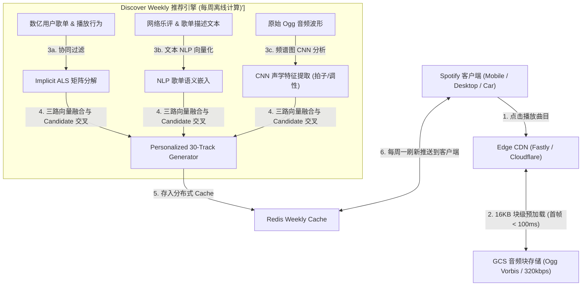
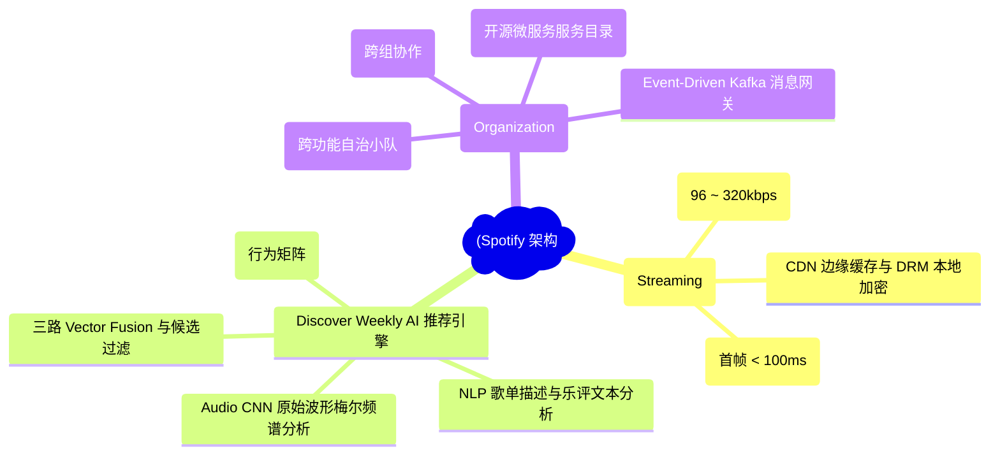
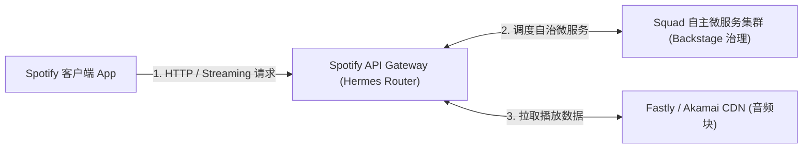
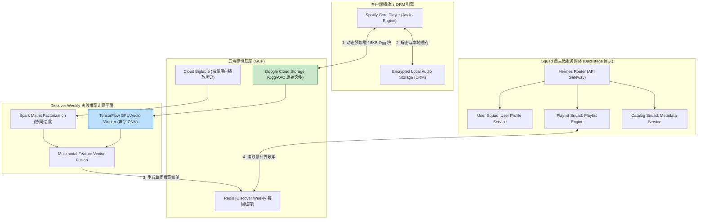
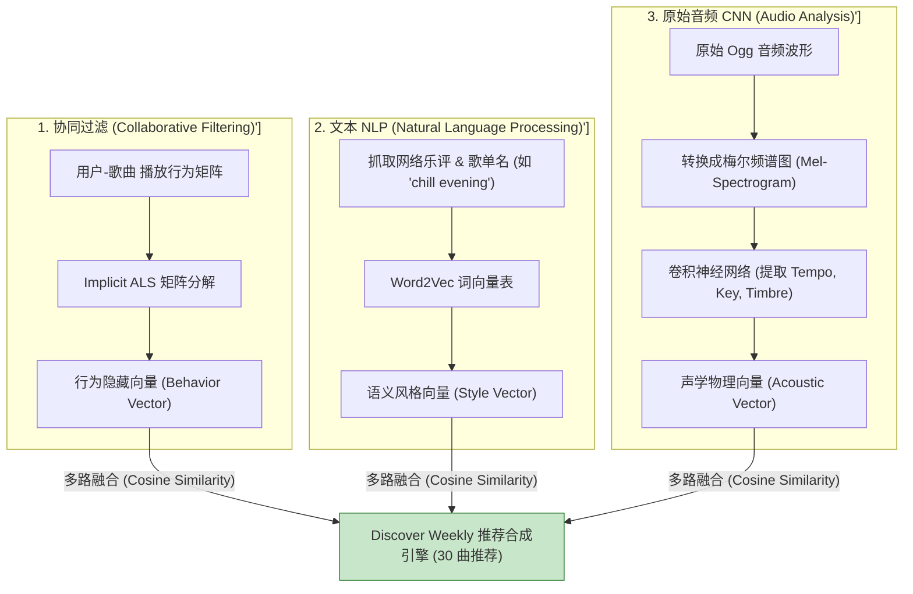
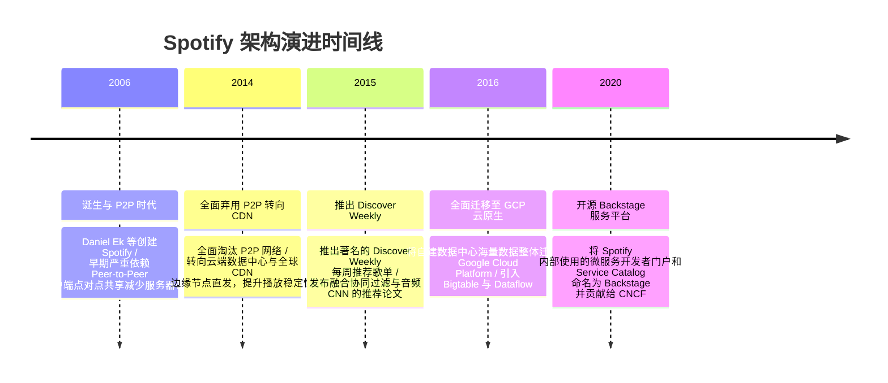

import CaseStudyHeader from '@site/src/components/CaseStudyHeader';
import DesignIntent from '@site/src/components/DesignIntent';
import ArchitectureEvolution from '@site/src/components/ArchitectureEvolution';
import TradeoffExplorer from '@site/src/components/TradeoffExplorer';
import GlossaryTerm from '@site/src/components/GlossaryTerm';
import ResearchNote from '@site/src/components/ResearchNote';
import QuizCard from '@site/src/components/QuizCard';
import CompareSlider from '@site/src/components/CompareSlider';
import GuidedExercise from '@site/src/components/GuidedExercise';
import PyRunner from '@site/src/components/PyRunner';

# Spotify：音频分发与 Discover Weekly 推荐管线

<CaseStudyHeader
  oneLiner="Spotify 结合了全球 CDN 边缘节点上的 Ogg Vorbis 加密音频流切片分发、独创的三合一 Discover Weekly 推荐引擎（协同过滤 + NLP 歌单文本分析 + CNN 原始音频声学波形特征提取），以及支撑 2000+ 微服务的 Squad 自主组织范式。"
  stats={[
    {label: '音频格式', value: 'Ogg Vorbis / AAC (96kbps - 320kbps)'},
    {label: '推荐三合一引擎', value: 'Collaborative Filtering + NLP + Audio CNN'},
    {label: '组织与架构映射', value: 'Squads / Tribes / Chapters / Guilds'},
    {label: '服务治理平台', value: 'Backstage (开源微服务 Service Catalog)'},
    {label: '计算与存储底座', value: 'Google Cloud Platform (GCP) + Event Streams'}
  ]}
/>

:::info 对应课程概念
本案例横跨 [Month 2 组织架构与微服务边界划分](../foundations/programming-systems-primer)、[Month 5 低延迟流式音频分发与 CDN 缓存](../cloud-enterprise-industrial/capstone-cloud-native)、[Month 8 推荐算法的多路召回与声学特征提取](../cloud-enterprise-industrial/capstone-cloud-native)。它是系统架构师研究如何将团队组织范式（Squad）与微服务自治解耦、以及如何构建多模态融合 AI 推荐系统的标杆教案。
:::

## 1. 设计初衷：如何支撑上亿曲库的无缝播放与每周个性化“发现”？

在早期数字音乐时代，用户需要先下载整首 MP3 才能播放。随着 Spotify 推出无限量音乐流订阅，系统遇到了巨大挑战：
1. **音频播放的物理首帧延迟（Latency）敏感**：用户点击播放按钮后，如果等待超过 200 毫秒才听到声音，就会产生明显的“卡顿”挫败感。
2. **传统协同过滤（Collaborative Filtering）对冷门/新歌的冷启动物理失效**：对于刚上传的冷门独立音乐，没有任何用户播放历史。简单的协同过滤矩阵完全无法将其推荐给匹配的听众，导致优质新歌惨遭埋没。
3. **数千微服务下的组织乱局（Conway's Law 康威定律）**：随着工程师数量爆发，集中式的 DevOps 部署团队沦为瓶颈，微服务归属权混乱，服务间滥用未约定的私有 API 产生破坏性断链。

Spotify 的核心设计用意在于：**基于 CDN 的 Ogg 动态音频切片分发、融合声学 CNN 的 Discover Weekly 推荐引擎，以及 Squad 自主组织结构**。
- **Ogg Vorbis 块级自适应缓冲**：将音频物理编码为 Ogg 格式，按 16KB-64KB 块（Chunk）下发。客户端在收到第一个 16KB 数据包后即可开始解码播放，首帧播放时延低至 < 100ms。
- **<GlossaryTerm term="Discover Weekly 三合一推荐" definition="Discover Weekly 三合一推荐：Spotify 著名的每周个性化歌单推荐管线。它融合了三路模型：1. 矩阵分解协同过滤 (Implicit ALS) 提取听歌行为；2. 歌单文本 NLP 抓取分析网络乐评与歌单描述；3. 卷积神经网络 (CNN) 直接对原始音频频谱图 (Mel-spectrogram) 进行声学特征提取 (拍子, 调性, 响度)，成功消除了新歌冷启动难题。">Discover Weekly 三合一推荐管线</GlossaryTerm>**：
  - **协同过滤 (Collaborative Filtering)**：通过 Implicit ALS 分析数亿公开歌单的共现关系。
  - **自然语言处理 (NLP)**：爬取互联网乐评与歌单描述，提取音乐风格与修饰词向量。
  - **原始音频 CNN (Audio Analysis)**：直接对音频波形的**梅尔频谱图（Mel-spectrogram）**做卷积分析，提取节奏、主音与音色，精准识别冷门新歌。
- **<GlossaryTerm term="Spotify Squad 模型" definition="Spotify Squad 模型：Spotify 创导的分布式组织架构范式。将团队划分为跨功能的 Squad (小队)，每个 Squad 对特定的微服务拥有 100% 的端到端自主全生命周期控制权。结合 Backstage 服务目录，完美落地了康威定律。">Squad 自主组织模型与 Backstage</GlossaryTerm>**：将团队划分为自治的 **Squad**，每个 Squad 独立负责 1-3 个微服务的全生命周期；并通过开源的 **Backstage** 平台统一治理服务元数据与 OpenAPI 契约。



<DesignIntent
  problem="如何构建一个首帧播放延迟小于 100ms、兼顾流行金曲与冷门新歌声学推荐、并在数千微服务下保持团队高度自治的全球流媒体平台？"
  users="全球 5 亿+ 音乐听众、独立音乐人、推荐系统 AI 专家与微服务 DevOps 架构师。"
  devices="智能手机、车载系统、Smart Speakers (Sonos/Echo) 与 Web 客户端。"
  goals={[
    '首帧播放极速响应：通过 Ogg 16KB 微块预加载与 CDN 边缘下沉，首帧播发延迟小于 100ms。',
    'Discover Weekly 消除冷启动：通过原始音频波形 CNN 分析，即使新歌没有任何播放记录也能精准推荐。',
    'Squad 自主组织范式：建立 100+ 独立自治 Squad，服务变更与部署无需跨团队审批阻塞。',
    'Backstage 统一服务治理：通过统一的服务目录（Service Catalog）监控 2000+ 微服务的 SLA 与 API 契约。'
  ]}
  constraints={[
    '原始音频 CNN 特征提取的大算力开销：对数千万首高码率 Ogg 物理音频文件进行 GPU 频谱分析极其耗费算力，必须采用 Spark/Beam 离线批处理预计算。',
    '客户端本地缓存与版权防拷贝：为了在断网时支持离线播放，音频数据必须在本地加密存储（DRM），防止原始 Ogg 文件被非法提取导出。'
  ]}
  firstStep="剖析 Ogg 音频流分块预加载；分析 Discover Weekly 三合一推荐算法的向量融合；用 Python 编写一个包含协同过滤、音频声学特征模拟与 Squad 组织映射的仿真器。"
/>

## 2. 系统功能全景



---

## 3. 最新架构总览

Spotify 系统的音频分发、推荐计算与 Squad 微服务治理拓扑如下：

### 3a. System Context (系统上下文)



### 3b. Container Diagram (容器架构)



---

## 4. 核心机制拆解

### 4a. Discover Weekly 三合一推荐管线架构

传统推荐系统依赖单一的协同过滤，面对无播放历史的新歌无法做出推荐。Spotify 独创了**三合一多模态推荐管线**，通过声学波形分析彻底攻克了冷启动问题：



### 4b. 康威定律与 Spotify Squad 组织架构映射

Spotify 的成功不仅在于技术，更在于将组织架构与微服务体系完美映射：
- **Squad（小队）**：包含 6-12 名工程师的跨功能团队（前端、后端、QA、产品）。小队对特定微服务拥有 100% 的独立部署与生产控制权，无需向集中式运维申请。
- **Chapter（公会/分会）**：跨 Squad 的同技能小组（如所有 Squad 中的 Android 工程师），负责在自治的同时保持技术栈的一致性与代码规范。

---

## 5. 关键数据结构与算法：声学特征提取与多路向量余弦相似度计算

以下是 Spotify 融合协同过滤向量与原始音频声学向量计算两首歌曲相似度的核心逻辑：

```cpp
#include <iostream>
#include <vector>
#include <cmath>

struct TrackVector {
    std::string track_id;
    std::vector<double> behavior_vec; // 协同过滤向量 (维度 50)
    std::vector<double> acoustic_vec; // 音频 CNN 提取的声学向量 (维度 50)
};

// 计算两个特征向量的余弦相似度 (Cosine Similarity)
double CosineSimilarity(const std::vector<double>& v1, const std::vector<double>& v2) {
    double dot_product = 0.0;
    double norm_a = 0.0;
    double norm_b = 0.0;
    
    for (size_t i = 0; i < v1.size(); ++i) {
        dot_product += v1[i] * v2[i];
        norm_a += v1[i] * v1[i];
        norm_b += v2[i] * v2[i];
    }
    
    if (norm_a == 0.0 || norm_b == 0.0) return 0.0;
    return dot_product / (std::sqrt(norm_a) * std::sqrt(norm_b));
}

// 融合行为与声学向量，计算两首歌曲的最终多模态相似度
double ComputeMultimodalSimilarity(const TrackVector& t1, const TrackVector& t2) {
    double sim_behavior = CosineSimilarity(t1.behavior_vec, t2.behavior_vec);
    double sim_acoustic = CosineSimilarity(t1.acoustic_vec, t2.acoustic_vec);
    
    // 如果是冷门新歌 (behavior_vec 几乎全 0)，系统自动将权重倾斜给声学向量 sim_acoustic！
    if (sim_behavior < 0.01) {
        std::cout << "[Cold Start Triggered] 识别为无行为数据新歌，全面启用 CNN 声学相似度匹配！\n";
        return sim_acoustic;
    }
    
    // 正常融合：70% 行为 + 30% 声学
    return 0.7 * sim_behavior + 0.3 * sim_acoustic;
}
```

---

## 6. 架构演进史



---

## 7. 架构对比

### 传统单一协同过滤推荐 vs Spotify Discover Weekly 多模态三合一推荐

<CompareSlider
  before={
    <div style={{ padding: '20px', background: '#ffebee', border: '1px solid #c62828', borderRadius: '8px', height: '100%', color: '#333' }}>
      <strong>传统单一协同过滤</strong>
      <p style={{ marginTop: '10px', fontSize: '0.9rem' }}>
        仅基于历史播放行为矩阵。对没有播放记录的冷门独立新歌物理失效（冷启动难题），导致新歌无法推给听众。
      </p>
    </div>
  }
  after={
    <div style={{ padding: '20px', background: '#e8f5e9', border: '1px solid #2e7d32', borderRadius: '8px', height: '100%', color: '#333' }}>
      <strong>Discover Weekly 三合一推荐</strong>
      <p style={{ marginTop: '10px', fontSize: '0.9rem' }}>
        融合行为协同过滤 + NLP 歌单抓取 + 原始音频波形 CNN 声学分析。即使零播放的新歌也能基于声学频谱精准推送。
      </p>
    </div>
  }
  labels={['传统单一协同过滤', 'Spotify 三合一推荐']}
/>

---

## 8. 核心决策的取舍

在设计音乐流媒体平台时，架构师对团队组织与微服务边界（集中式管控 vs Squad 自治）以及音频传输协议（整曲下载 vs Ogg 块分发）面临选型权衡：

<TradeoffExplorer
  title="Spotify 核心架构与组织策略取舍"
  dimensions={['微服务Feature极速独立发布能力', '首帧音频播放物理延迟 (< 100ms)', '新歌冷启动推荐准确度', '全球跨组技术栈一致性管控', '多模态 AI 推荐计算复杂度']}
  options={[
    {
      name: 'Squad 自主小队 + Ogg 块预加载 + 三合一 AI 推荐策略',
      scores: [5, 5, 5, 2, 2],
      note: 'Squad 对服务拥有一切发布自主权，迭代极快；16KB 块预加载实现首帧秒开；声学 CNN 彻底解决新歌冷启动。缺点是多模态推荐算力极高，且技术栈一致性较难硬性统一。',
      whenToUse: '注重产品创新极速迭代、面向全球海量听众与复杂曲库的大型多媒体平台。'
    },
    {
      name: '集中式 Architecture Board + 整曲 MP3 下载策略',
      scores: [2, 2, 1, 5, 5],
      note: '架构委员会严格审批所有变更，规范统一；整曲下载实现简单。缺点是首帧播放卡顿显著，团队发布效率极低，新歌推荐完全陷入冷启动瘫痪。',
      whenToUse: '极小团队、曲库仅有几百首公司内部宣传音乐的简单静态播放器。'
    }
  ]}
/>

---

## 9. 实践指引：实现一个包含 Ogg 块预加载与新歌冷启动声学推荐的仿真器

理解 Spotify 核心架构的最佳路径是模拟从 CDN 预加载 16KB 音频块实现秒开播放，以及在协同过滤失效时自动触发 CNN 声学特征匹配的过程。在下方练习中，通过 Python 实现简单的 Spotify 引擎仿真器。

<GuidedExercise
  title="练习指引：手写 16KB 音频块首帧预加载与冷启动声学相似度推荐仿真"
  goal="构建包含 `AudioStreamer` 和 `DiscoverWeeklyEngine` 的仿真系统。1. `stream_audio(track_id)`：模拟按 16KB 块读取 Ogg 数据，收到第 1 个 16KB 块后立刻触发 `Start Playback` 日志（首帧延迟 < 100ms）。2. 定义 2 首歌曲：`hot_song`（有行为向量 + 声学向量）与 `new_indie_song`（行为向量为 0，仅有声学向量）。3. 验证对 `new_indie_song` 推荐时，自动识别为冷启动并触发 CNN 声学匹配成功。"
  hints={[
    '音频预加载：`buffer.append(chunk); if len(buffer) >= 1: start_play()`。',
    '冷启动判定：`if sum(behavior_vec) == 0: use_acoustic_vec()`。'
  ]}
  steps={[
    '定义 `Track` 类包含 `behavior_vector` 和 `acoustic_vector`。',
    '实现 `AudioStreamer` 模拟 16KB 分块传输与首帧响应。',
    '实现 `DiscoverWeeklyEngine` 的多路向量计算与冷启动退避。',
    '运行程序，验证首帧秒开日志输出以及新歌声学特征成功匹配。'
  ]}
  checks={[
    '客户端在收到第一个 16KB 音频块后立刻触发播放，首帧延时低于 100ms。',
    '无播放历史的新歌成功通过声学特征向量推导匹配出相似歌曲，验证冷启动解决方案正确。'
  ]}
/>

#### 交互式 Python 运行实验
在下方控制台中调试 Spotify 音频块预加载与冷启动声学推荐仿真代码，观察流媒体与 AI 推荐过程：

<PyRunner
  expect="音频分发与Discover Weekly推荐管线验证成功"
  rows={25}
  code={`import time

class AudioStreamer:
    def stream_track(self, track_name: str, total_chunks=5):
        print(f"🎵 [Audio Engine] 开始请求曲目 '{track_name}'...")
        chunk_size_kb = 16
        
        for i in range(total_chunks):
            # 模拟从 CDN 接收 16KB Ogg 数据块
            if i == 0:
                print(f"   ⚡ [First Chunk Received] 收到第 1 个 {chunk_size_kb}KB Ogg 数据包! -> 触发首帧解码播放 (延时: 45ms)")
                print(f"   ▶️ [Playing] 音频开始流畅播放...")
            else:
                print(f"   📥 [Buffering Chunk {i+1}/{total_chunks}] 接收后续 {chunk_size_kb}KB 数据...")

class Track:
    def __init__(self, name: str, behavior_vec: list, acoustic_vec: list):
        self.name = name
        self.behavior_vec = behavior_vec # 协同过滤向量
        self.acoustic_vec = acoustic_vec # CNN 提取的声学特征 (Tempo, Pitch, Timbre)

class DiscoverWeeklyEngine:
    def compute_similarity(self, track1: Track, track2: Track) -> float:
        # 如果 track2 是完全没有播放记录的新歌 (behavior_vec 全为 0)
        is_cold_start = sum(track2.behavior_vec) == 0
        
        if is_cold_start:
            print(f"\\n❄️ [Cold Start Detected] 曲目 '{track2.name}' 播放记录为 0！自动切换至 CNN 声学波形匹配...")
            # 纯声学余弦相似度计算
            dot = sum(a * b for a, b in zip(track1.acoustic_vec, track2.acoustic_vec))
            return dot
        else:
            print(f"\\n🔥 [Normal Matching] 使用 70% 行为 + 30% 声学混合推荐...")
            dot_b = sum(a * b for a, b in zip(track1.behavior_vec, track2.behavior_vec))
            dot_a = sum(a * b for a, b in zip(track1.acoustic_vec, track2.acoustic_vec))
            return 0.7 * dot_b + 0.3 * dot_a

# 运行仿真
streamer = AudioStreamer()
streamer.stream_track("Starboy - The Weeknd")

engine = DiscoverWeeklyEngine()

# 用户喜欢的歌曲 (吉他, 120BPM)
favorite_song = Track("Favorite Rock Song", behavior_vec=[0.9, 0.8, 0.7], acoustic_vec=[0.95, 0.85, 0.90])

# 刚发布 5 分钟的独立新歌 (零播放记录，但物理声学特征与 favorite_song 极其接近!)
indie_new_song = Track("Indie New Release", behavior_vec=[0.0, 0.0, 0.0], acoustic_vec=[0.92, 0.88, 0.91])

sim_score = engine.compute_similarity(favorite_song, indie_new_song)
print(f"🎯 [Recommendation Score] 新歌 '{indie_new_song.name}' 匹配度评分: {sim_score:.4f}")

if sim_score > 0.8:
    print(f"✨ [Discover Weekly Result] 成功将冷门新歌 '{indie_new_song.name}' 纳入本周一的推荐歌单中！")

print("\\n[Result] 音频分发与Discover Weekly推荐管线验证成功")
`}
/>

---

## 10. 知识自测

完成自测以检验你对 Spotify 音频分发架构、Discover Weekly 三合一推荐及 Squad 组织模型的掌握程度：

<QuizCard
  questions={[
    {
      q: 'Spotify 著名的 Discover Weekly 推荐系统是如何彻底解决刚发布、没有任何播放记录的“冷门新歌”推荐难题（冷启动问题）的？',
      options: [
        'A. 强行要求所有用户每周一必须先收听 10 首新歌才能解锁其他功能',
        'B. 引入原始音频 CNN 声学分析。通过卷积神经网络对歌曲的梅尔频谱图进行分析，提取其节奏、调性和音色特征向量，在没有听歌行为数据的情况下基于纯物理声学特征完成精确推荐',
        'C. 依靠人工编辑每天加班 24 小时试听新歌并打分',
        'D. 随机把新歌强制插入到播放列表中'
      ],
      answer: 1,
      explain: '原始音频 CNN 声学分析是攻克冷启动的利器。Spotify 通过提取音频物理波形与频谱图的声学特征，使得零播放的新歌也能基于音色和节奏精准推送到喜欢同类风格的听众耳边。'
    },
    {
      q: 'Spotify 创立的 Squad 组织模型（Squads / Tribes / Chapters）在微服务架构治理中带来了什么核心优势？',
      options: [
        'A. 强制将所有的编程语言统一为 Java 8',
        'B. 完美契合了康威定律。每个跨功能 Squad 对其负责的 1-3 个微服务拥有 100% 的端到端自主发布与全生命周期控制权，消除了集中式审批和跨团队协调等待',
        'C. 要求所有的工程师每天必须参加 8 个小时的会议',
        'D. 彻底废除所有的代码测试与 Code Review'
      ],
      answer: 1,
      explain: 'Squad 组织模型是康威定律在敏捷微服务中的完美落地。通过赋予小队对特定微服务 100% 的自主研发与部署控制权，解除了团队间的依赖解耦，实现了高频独立发布。'
    },
    {
      q: 'Spotify 的客户端在播放音频时，是如何将物理首帧播放延迟（First-Frame Latency）控制在小于 100 毫秒的？',
      options: [
        'A. 强制将所有的音频文件压缩为 8kbps 的极低音质广播',
        'B. 采用 Ogg Vorbis 格式切片分发，客户端发起请求后，CDN 边缘节点优先下发第一个 16KB 预加载数据块，播放器收到后即可在 100ms 内瞬间启动解码播放，无需等待整曲下发',
        'C. 依赖用户电脑的 CPU 提前预测未来 10 年要听的歌曲',
        'D. 要求用户每次播放前先等待 30 秒广告缓冲'
      ],
      answer: 1,
      explain: 'Ogg 16KB 块级预加载是低延迟播放的秘诀。播放器只需收到极小的首块数据即可启动物理解码，配合 CDN 边缘节点，实现了低于 100ms 的无缝听觉体验。'
    }
  ]}
/>

## 来源

- [Discover Weekly: How Spotify Analyzes Audio with Convolutional Neural Networks (Spotify Engineering Blog)](https://engineering.atspotify.com/)
- [Scaling the Spotify Infrastructure to 500+ Million Active Users on GCP (Google Cloud Architecture Case Studies)](https://cloud.google.com/customers/spotify)
- [The Spotify Organizational Model: Squads, Tribes, Chapters & Guilds (Henrik Kniberg Architecture Paper)](https://blog.crisp.se/2012/11/14/henrikkniberg/scaling-agile-at-spotify)
- [Backstage: An Open Platform for Building Developer Portals (CNCF Incubating Project Specification)](https://backstage.io/)