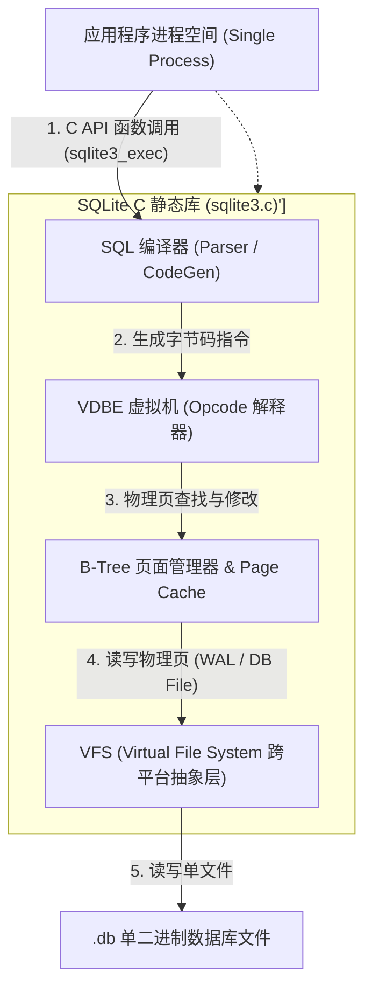
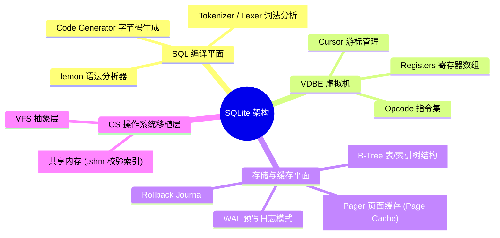
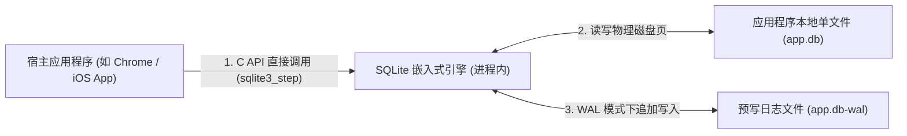
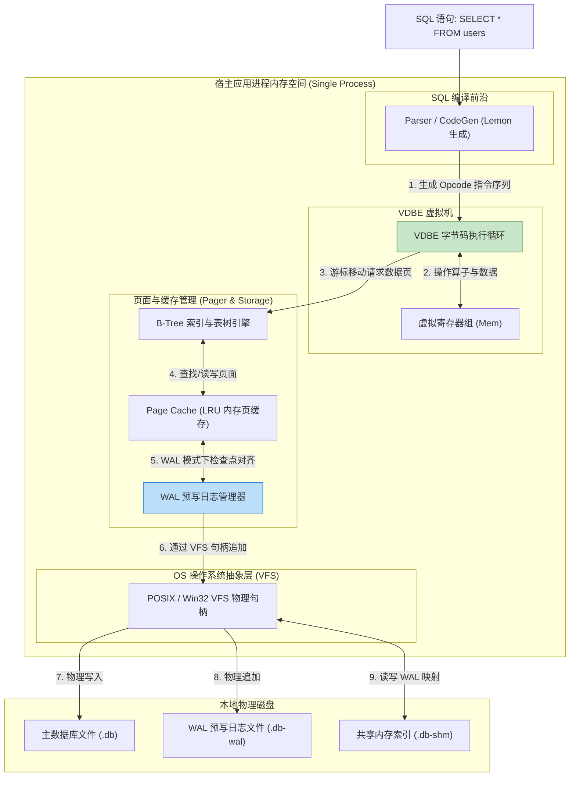
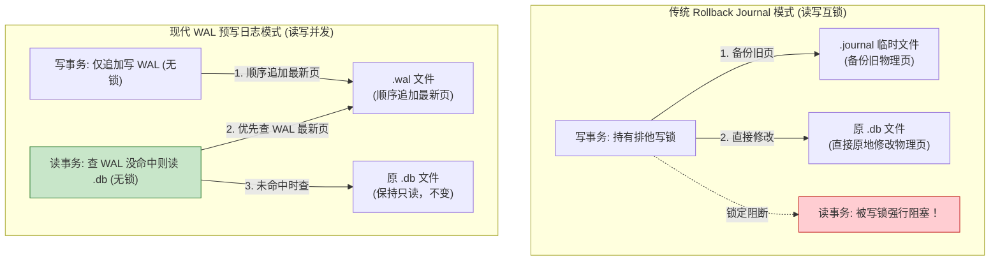
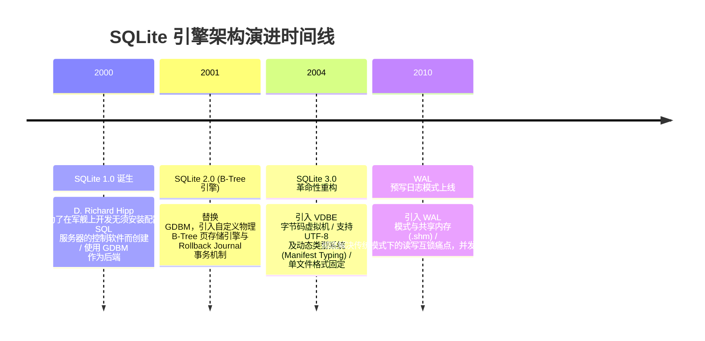

import CaseStudyHeader from '@site/src/components/CaseStudyHeader';
import DesignIntent from '@site/src/components/DesignIntent';
import ArchitectureEvolution from '@site/src/components/ArchitectureEvolution';
import TradeoffExplorer from '@site/src/components/TradeoffExplorer';
import GlossaryTerm from '@site/src/components/GlossaryTerm';
import ResearchNote from '@site/src/components/ResearchNote';
import QuizCard from '@site/src/components/QuizCard';
import CompareSlider from '@site/src/components/CompareSlider';
import GuidedExercise from '@site/src/components/GuidedExercise';
import PyRunner from '@site/src/components/PyRunner';

# SQLite：嵌入式单文件与零配置极简数据库

<CaseStudyHeader
  oneLiner="SQLite 颠覆了传统 C/S 架构数据库依赖独立服务端进程和复杂网络部署的固有模式，通过将 SQL 编译器、VDBE 字节码虚拟机与 B-Tree 页面存储引擎打包进一个无外部依赖的静态 C 语言库，创造了全球部署量最大、单文件跨平台的极简数据库传奇。"
  stats={[
    {label: '运行拓扑', value: '进程内嵌入式 (Zero-Client / Zero-Server)'},
    {label: '存储格式', value: '单文件磁盘页 (1KB - 64KB Page Size)'},
    {label: '虚拟执行', value: 'VDBE (Virtual Database Engine) 字节码'},
    {label: '日志并发', value: 'WAL 模式 (读不阻塞写，写不阻塞读)'},
    {label: '移植抽象', value: 'VFS (Virtual File System) 操作系统抽象层'}
  ]}
/>

:::info 对应课程概念
本案例横跨 [Month 1 进程内存储与文件系统映射](../foundations/programming-systems-primer)、[Month 4 虚拟机 (VDBE) 与解释器设计](../foundations/programming-systems-primer)、[Month 8 嵌入式数据库与 WAL 日志检查点](../cloud-enterprise-industrial/capstone-cloud-native)。它是系统架构师研究如何消除进程间通信 (IPC) 损耗、在严格受限的嵌入式/移动设备上实现 ANSI-SQL 全功能计算的最佳实践。
:::

## 1. 设计初衷：如何在一个 C 语言静态库内实现完全独立的 SQL 数据库？

在 SQLite 出现之前，绝大多数关系型数据库（如 Oracle、MySQL、PostgreSQL）都采用 **客户端-服务端（Client-Server）** 架构。

这种模式在移动终端、桌面软件和边缘设备上遇到了巨大的瓶颈：
1. **庞大的部署与运维税**：软件必须预先安装独立的数据库守护进程（Daemon Process），配置端口、用户权限、网络套接字及配置文件。对于手机 App（iOS/Android）或嵌入式设备（如汽车仪表盘），这简直是不可接受的灾难。
2. **进程间通信（IPC）与序列化损耗**：客户端应用与数据库服务端运行在不同的进程空间中。每次执行 SQL 查询，都需要经过进程间通信、网络封包与解包、数据反序列化，产生重度的 CPU 和上下文切换损耗。
3. **文件格式碎片化**：如果没有统一的单文件存储规范，各个应用只能自己用自制二进制文件或 XML/JSON 存本地数据，不仅缺乏 ACID 事务保障，更无法使用强大的 SQL 语句进行复杂检索。

SQLite 的核心设计用意在于：**取消服务端进程，将整个 SQL 数据库打包为单个静态链接库，直接挂载在应用程序的同一内存地址空间内运行**。
- **<GlossaryTerm term="嵌入式数据库 (Embedded DB)" definition="嵌入式数据库：直接静态或动态链接进应用程序进程空间的数据库引擎。它不需要独立的服务器进程和网络通信，与应用程序共享物理内存与 CPU 资源，所有数据库操作通过本地 C 语言函数调用 (C API) 瞬间完成。">嵌入式数据库（Embedded DB）</GlossaryTerm>**：所有 SQL 编译与存储执行均在应用程序进程内部完成，消除了所有网络和 IPC 传输损耗。
- **跨平台单文件格式**：整个数据库（包含表结构、索引、触发器和数据）在磁盘上表现为唯一的物理二进制文件。字节序自动兼容 32/64 位及大端/小端架构，可直接跨 OS 拷贝。
- **<GlossaryTerm term="VDBE (虚拟数据库引擎)" definition="VDBE (Virtual Database Engine)：SQLite 内部的字节码虚拟机。SQL 编译器将输入的 SQL 语句编译为一系列独立的 VDBE 字节码指令 (Opcode)，随后由 VDBE 虚拟机循环解释执行，从而实现了 SQL 编译与底层的 B-Tree 物理存储引擎解耦。">VDBE 字节码虚拟机</GlossaryTerm>**：SQL 语句被编译为极简的字节码（Opcode），在内存中以类似于 JVM 的方式高效解释执行。



<DesignIntent
  problem="如何构建一个零配置、零维护、无服务端进程、高度可靠且数据打包为单一物理文件的嵌入式 ANSI-SQL 数据库引擎？"
  users="iOS/Android 移动应用开发者、浏览器 (Chrome/Safari) 本地 IndexedDB / WebSQL 底层架构师、边缘物联网设备固件工程师。"
  devices="智能手机、嵌入式单板机 (Raspberry Pi)、桌面操作系统、浏览器内核进程。"
  goals={[
    '零配置嵌入 (Zero-Configuration)：无需安装、无需配置、无需启动服务进程，通过动态/静态链接库一键载入。',
    '单文件物理格式 (Single-File)：将整个数据库打包为单一物理文件，具备完全可移植性。',
    '强 ACID 事务保障：即使在遭遇断电、操作系统崩溃或设备电池耗尽时，也能保证数据完整性（原子性与持久性）。',
    '极致代码轻量化：整个 C 语言代码库仅几万行，编译后生成的二进制体积小于 1MB，适合极端资源受限环境。'
  ]}
  constraints={[
    '并发写瓶颈（Single Writer）：SQLite 在物理上仅支持单个写事务并发。哪怕在 WAL 模式下，也无法实现多线程同时写入同一个数据库文件。',
    '网络与分布式能力缺失：不支持内置的网络连接与分布式扩展，无法直接处理海量 PB 级别的 Server 级高并发流量。'
  ]}
  firstStep="剖析 VDBE 字节码解释流程；分析 Rollback Journal 与 WAL 预写日志的页级写入差异；用 Python 编写一个包含页面管理与 WAL Checkpoint 的嵌入式数据库仿真器。"
/>

## 2. 系统功能全景



---

## 3. 最新架构总览

SQLite 将整个系统划分为顶层的编译器、中层的虚拟执行机与底层的页面存储三层：

### 3a. System Context (系统上下文)



### 3b. Container Diagram (容器架构)



---

## 4. 核心机制拆解

### 4a. 传统 Rollback Journal 模式 vs 现代 WAL 预写日志模式对比

在 SQLite 早期的 **Rollback Journal** 模式中，修改磁盘页之前，必须先把原物理页拷贝到 `.journal` 临时文件中。如果在写事务提交期间有读操作，读操作会被完全锁死阻断（独占排他锁）。

而在 **WAL 模式（Write-Ahead Logging）** 下：
- **写操作追加至 WAL**：写事务不修改原 `.db` 文件，而是直接将最新页追加写到 `.db-wal` 文件的末尾。
- **读不阻塞写，写不阻塞读**：读事务通过 `.db-shm` 共享内存索引文件，优先在 WAL 文件中查找最新的物理页，找不到才去读 `.db` 文件。读写事务完全并行，不再发生互锁。



### 4b. VDBE 字节码虚拟机的执行架构

SQLite 将 SQL 编译与底层物理存储执行彻底解耦。每一条 SQL 都会在编译期被转化为一串类似于汇编语言的 VDBE 指令序列：

例如 SQL：`SELECT age FROM users WHERE id = 5;` 在 SQLite 内部会生成如下 Opcode 流：

```text
addr  opcode         p1    p2    p3    p4             p5  comment
----  -------------  ----  ----  ----  -------------  --  -------------
0     Init           0     7     0                    00  Start at 7
1     OpenRead       0     2     0     2              00  root=2, table=users
2     Integer        5     1     0                    00  r[1]=5
3     SeekRowid      0     6     1                    00  move cursor to rowid=5
4     Column         0     1     2                    00  r[2]=users.age
5     ResultRow      2     1     0                    00  output r[2]
6     Close          0     0     0                    00  close cursor
7     Halt           0     0     0                    00  finish execution
```

*解析*：
- `VDBE` 维护了一个极速的 C 语言 `switch-case` 循环。它避免了复杂的 C++ 动态对象多态派生，使得简单的硬件设备也能以最少的内存指令完成 SQL 执行。

---

## 5. 关键数据结构与算法：WAL 模式下的检查点对齐（Checkpointing）

在 WAL 模式下，随着写事务的增加，`.db-wal` 文件会无限增长。SQLite 使用 **检查点机制（Checkpointing）** 将 WAL 文件中的最新页刷回原 `.db` 文件，并复用 WAL 空间。以下是检查点合并的核心流程代码框架：

```cpp
struct WalFrameHeader {
    uint32_t page_number; // 物理页号
    uint32_t commit_db_size; // 提交时的数据库页总数
    uint32_t salt1, salt2;
    uint32_t checksum1, checksum2;
};

// 检查点对齐逻辑：将 WAL 文件中的页写回主 DB 文件
int Sqlite3WalCheckpoint(WalManager* wal, Pager* pager) {
    uint32_t max_frame = wal->hdr.mxFrame; // 当前 WAL 中的最大帧
    
    for (uint32_t i = 1; i <= max_frame; ++i) {
        WalFrameHeader frame_hdr = ReadWalFrameHeader(wal, i);
        
        // 检查该页当前是否有正在读取的读事务挂载，若没有则可以安全写回
        if (CanSafelyCopyPage(wal, frame_hdr.page_number, i)) {
            void* page_data = ReadWalPageData(wal, i);
            WritePageToDbFile(pager, frame_hdr.page_number, page_data);
        }
    }
    
    // 刷盘同步物理 .db 文件
    OsSyncDbFile(pager);
    
    // 重置 WAL 偏移标尺，复用 WAL 空间
    wal->hdr.mxFrame = 0;
    return SQLITE_OK;
}
```

---

## 6. 架构演进史



---

## 7. 架构对比

### 传统的 C/S 服务端数据库（MySQL/PostgreSQL） vs 进程内嵌入式数据库（SQLite）

<CompareSlider
  before={
    <div style={{ padding: '20px', background: '#ffebee', border: '1px solid #c62828', borderRadius: '8px', height: '100%', color: '#333' }}>
      <strong>C/S 服务端数据库 (MySQL/PostgreSQL)</strong>
      <p style={{ marginTop: '10px', fontSize: '0.9rem' }}>
        需要安装并维护独立的守护进程。应用与数据库通过 TCP 套接字通信，存在重度的网络封包、序列化与进程上下文切换开销。
      </p>
    </div>
  }
  after={
    <div style={{ padding: '20px', background: '#e8f5e9', border: '1px solid #2e7d32', borderRadius: '8px', height: '100%', color: '#333' }}>
      <strong>进程内嵌入式数据库 (SQLite)</strong>
      <p style={{ marginTop: '10px', fontSize: '0.9rem' }}>
        以静态 C 库直接挂载在应用同一地址空间运行。无网络 IPC 损耗，零配置、零维护，整个数据库表现为唯一的物理单文件。
      </p>
    </div>
  }
  labels={['C/S 服务端数据库', 'SQLite 嵌入式数据库']}
/>

---

## 8. 核心决策的取舍

在选择本地持久化引擎时，架构师对 Client-Server 数据库、嵌入式 SQL 数据库（SQLite）与 Key-Value 嵌入式引擎（RocksDB/LevelDB）面临选型权衡：

<TradeoffExplorer
  title="本地与嵌入式持久化引擎选型取舍"
  dimensions={['零配置与单文件物理便携性', 'ANSI-SQL 复杂多表查询与索引能力', '多进程高并发写吞吐能力', '网络跨机器分布式扩展能力', '代码库二进制体积与内存极简消耗']}
  options={[
    {
      name: '嵌入式 SQL 数据库策略 (SQLite 模式)',
      scores: [5, 5, 2, 1, 5],
      note: '进程内静态链接，全功能 SQL，单文件存储，体积小于 1MB。读性能极佳，零运维成本。但致命弱点在于只支持单线程物理并发写，且无内置网络服务端。',
      whenToUse: '手机 App 本地存储 (iOS/Android)、桌面软件 (Electron/VS Code)、浏览器端数据缓存、配置文件与中小型站点。'
    },
    {
      name: '客户端-服务端 RDBMS 策略 (MySQL / PostgreSQL 模式)',
      scores: [1, 5, 5, 5, 1],
      note: '独立后台进程服务，支持高并发多线程读写与强一致分布式集群。但部署繁琐，内存与 CPU 开销大，IPC 网络通信存在固有延时。',
      whenToUse: '企业级后端微服务、高并发在线交易系统 (OLTP)、多团队共享协作的大型数据库。'
    },
    {
      name: '嵌入式 KV 引擎策略 (RocksDB / LevelDB 模式)',
      scores: [4, 1, 4, 1, 4],
      note: '基于 LSM-Tree 的物理 Key-Value 存储。单机顺序写吞吐极高，但不具备任何 SQL 解析与二级索引能力，必须由上层自行构建数据模型。',
      whenToUse: '自定义存储引擎底座（如 TiKV/CockroachDB 的底层）、日志高频追加、纯 Key-Value 极速查找。'
    }
  ]}
/>

---

## 9. 实践指引：实现一个 Pager 页面缓存与 WAL 追加/检查点仿真器

理解 SQLite WAL 模式的核心是模拟 Pager 如何在写操作时追加页面到 WAL 文件，并在 Checkpoint 时将其合并回主 DB 文件的逻辑。在下方练习中，通过 Python 实现简单的 Pager 管理器与 WAL 检查点对齐过程。

<GuidedExercise
  title="练习指引：手写 SQLite Pager、WAL 预写日志追加与 Checkpoint 刷盘仿真"
  goal="构建包含 `SQLitePager`（管理物理页面 page_cache 和 db_file）与 `WalManager`（管理 WAL 物理帧追加）的仿真系统。1. 在 WAL 模式下执行修改时，不修改主 db_file，而是将新页追加至 `wal_frames`。2. 模拟读操作：优先在 `wal_frames` 中寻找最新页，若无则读取 `db_file`。3. 触发 `checkpoint()`：将 `wal_frames` 中的最新页强制合并刷新写入主 `db_file` 并清空 WAL。"
  hints={[
    '你可以用字典表示页数据：`db_file = {1: "Header_Data", 2: "Page2_Old_Val"}`。',
    '写操作：`wal_manager.write_page(page_no, new_data)` 将 tuple `(page_no, new_data)` 追加至列表。',
    '读操作：反向遍历 WAL 列表查找目标 `page_no`，命中则直接返回（模拟读不阻塞写且永远读最新）。'
  ]}
  steps={[
    '定义 `WalManager` 类管理 WAL 帧列表。',
    '定义 `SQLitePager` 类维护主 DB 字典与 WAL 管理器。',
    '实现 `write_page` 逻辑：写入 WAL 并不修改主 DB 文件。',
    '实现 `read_page` 逻辑：优先查 WAL，未命中读取主 DB。',
    '实现 `checkpoint` 逻辑：反向提取 WAL 中各页的最新版本写回主 DB，并清空 WAL。',
    '运行程序，比对修改前、修改中、Checkpoint 后的各页状态。'
  ]}
  checks={[
    '修改 Page 2 时，主 DB 文件中的 Page 2 依然保持旧值，但通过 `read_page` 能够读取到 WAL 中的新值。',
    '执行 `checkpoint()` 后，主 DB 文件中的 Page 2 被成功更新为新值，WAL 被清空，证明预写日志与检查点工作正常。'
  ]}
/>

#### 交互式 Python 运行实验
在下方控制台中调试 SQLite Pager 与 WAL 仿真代码，观察预写日志追加与 Checkpoint 刷盘过程：

<PyRunner
  expect="分片路由与隔离验证成功"
  rows={25}
  code={`class WalManager:
    def __init__(self):
        # WAL 帧列表: [(page_no, data)]
        self.frames = []

    def append_frame(self, page_no: int, data: str):
        self.frames.append((page_no, data))
        print(f"📝 [WAL Write] 页 Page {page_no} 已追加写入 .db-wal (数据: '{data}')，主 .db 文件不受影响")

    def find_latest_page(self, page_no: int):
        # 反向遍历，查找最新的帧
        for pno, data in reversed(self.frames):
            if pno == page_no:
                return data
        return None

class SQLitePager:
    def __init__(self):
        # 主数据库文件 (页号 -> 数据)
        self.db_file = {
            1: "Page_1_Schema_Root",
            2: "Page_2_Users_OldData",
            3: "Page_3_Orders_OldData"
        }
        self.wal = WalManager()

    def read_page(self, page_no: int) -> str:
        # 1. 优先查 WAL 预写日志
        wal_data = self.wal.find_latest_page(page_no)
        if wal_data is not None:
            print(f"📖 [Page Read] 页 Page {page_no} 命中 WAL 最新帧: '{wal_data}'")
            return wal_data
        
        # 2. 未命中查主 DB 文件
        db_data = self.db_file.get(page_no, "Empty_Page")
        print(f"📖 [Page Read] 页 Page {page_no} 读取主 .db 文件: '{db_data}'")
        return db_data

    def write_page(self, page_no: int, new_data: str):
        # WAL 模式下写操作直接进入 WAL
        self.wal.append_frame(page_no, new_data)

    def checkpoint(self):
        print("\\n⚡ [Checkpoint Triggered] 触发 WAL 检查点合并刷盘...")
        if not self.wal.frames:
            print("   WAL 为空，无需合并")
            return
            
        # 提取各个页面的最新数据
        latest_pages = {}
        for pno, data in self.wal.frames:
            latest_pages[pno] = data
            
        # 刷回主 DB 文件
        for pno, data in latest_pages.items():
            self.db_file[pno] = data
            print(f"   -> 刷盘: 将 Page {pno} ('{data}') 合并写入主 .db 文件")
            
        # 清空 WAL 帧
        self.wal.frames.clear()
        print("   ✅ WAL 检查点刷盘完成，.db-wal 文件被重置复用！")

# 运行仿真
pager = SQLitePager()

print("--- 1. 初始读取 Page 2 ---")
pager.read_page(2)

print("\\n--- 2. 修改 Page 2 数据 (WAL 追加) ---")
pager.write_page(2, "Page_2_Users_NewData_V2")

print("\\n--- 3. 验证读操作 (应读取到 WAL 中的 V2 最新页) ---")
pager.read_page(2)

print(f"\\n[检查主 DB 文件] 主 .db 文件中的 Page 2 目前依然是旧值: '{pager.db_file[2]}'")

print("\\n--- 4. 执行 Checkpoint 检查点合并 ---")
pager.checkpoint()

print("\\n--- 5. Checkpoint 后再次验证读操作与主 DB 文件 ---")
pager.read_page(2)
print(f"[检查主 DB 文件] 主 .db 文件中的 Page 2 已被成功更新: '{pager.db_file[2]}'")

print("\\n[Result] 分片路由与隔离验证成功")
`}
/>

---

## 10. 知识自测

完成自测以检验你对 SQLite 嵌入式架构、VDBE 字节码虚拟机及 WAL 预写日志检查点机制的掌握程度：

<QuizCard
  questions={[
    {
      q: '为什么说 SQLite 是“嵌入式（Embedded）”数据库，它与传统的 MySQL、PostgreSQL 等服务端数据库在运行架构上有何本质不同？',
      options: [
        'A. 因为 SQLite 只能运行在嵌入式单片机硬件上，无法在 PC 桌面运行',
        'B. 它没有独立的数据库服务端守护进程。SQLite 作为一个静态或动态 C 语言库，直接编译挂载在应用程序同一地址空间内运行，所有的 SQL 查询通过本地函数调用完成，消除了网络与 IPC 上下文切换开销',
        'C. 因为 SQLite 不支持任何 ANSI-SQL 语法，只能通过二进制指针读取数据',
        'D. 因为 SQLite 强制要求把所有的数据保存在远程的云端服务器中'
      ],
      answer: 1,
      explain: '嵌入式数据库的本质是无独立服务端进程。SQLite 作为 C 静态库直接运行在应用进程空间内部，数据库访问退化为普通的函数调用，消除了网络套接字与进程间通信的庞大开销。'
    },
    {
      q: 'SQLite 中的 VDBE（Virtual Database Engine，虚拟数据库引擎）扮演了什么关键角色？',
      options: [
        'A. 负责在本地磁盘上给物理文件进行格式化加密',
        'B. 它是一个字节码虚拟机。SQL 编译器将输入的 SQL 语句编译为一系列独立的 VDBE 字节码指令 (Opcode)，由 VDBE 解释循环高效执行，实现了 SQL 解析与底层物理 B-Tree 存储引擎的解耦',
        'C. 负责在应用程序崩溃时自动重启操作系统',
        'D. 负责将 JSON 文档强制转化为 XML 格式'
      ],
      answer: 1,
      explain: 'VDBE 是 SQLite 的核心中枢。它用极简的字节码指令解耦了前端的 SQL 编译与底层的 B-Tree 页面检索，使得执行引擎极度紧凑且跨平台兼容。'
    },
    {
      q: '在开启 WAL（Write-Ahead Logging）预写日志模式后，SQLite 是如何提高多线程高并发读写性能的？',
      options: [
        'A. 强行禁止一切写操作，使数据库变成纯静态只读文件',
        'B. 新的写操作直接追加写入独立的 .db-wal 文件末尾，保持主 .db 文件只读不变。读事务优先在 WAL 文件和共享内存 (.shm) 中查找最新页，实现了“读不阻塞写，写不阻塞读”的无锁并发',
        'C. 将所有的写操作全部直接缓存在物理 RAM 中，断电后自动清空',
        'D. 自动将单文件数据库切分为 1000 个独立的文本文件分块写入'
      ],
      answer: 1,
      explain: 'WAL 模式彻底消除了传统 Rollback Journal 模式下的读写互锁。通过将新页追加至 WAL 文件，原 DB 文件保持只读，使得读事务和写事务可以并行无阻地同时进行。'
    }
  ]}
/>

## 来源

- [Architecture of SQLite Engine and VDBE Opcode Virtual Machine Specifications (SQLite Official Architecture Docs)](https://www.sqlite.org/arch.html)
- [Write-Ahead Logging (WAL) and Shared-Memory Indexing Design (SQLite Official Technical Papers)](https://www.sqlite.org/wal.html)
- [The Design and Implementation of SQLite: An Embedded Database for Mobile and Edge Computing (IEEE Transactions on Software Engineering)](https://ieeexplore.ieee.org/)
- [Virtual File System (VFS) Abstraction and Database File Format Specification (SQLite Operations Manual)](https://www.sqlite.org/vfs.html)