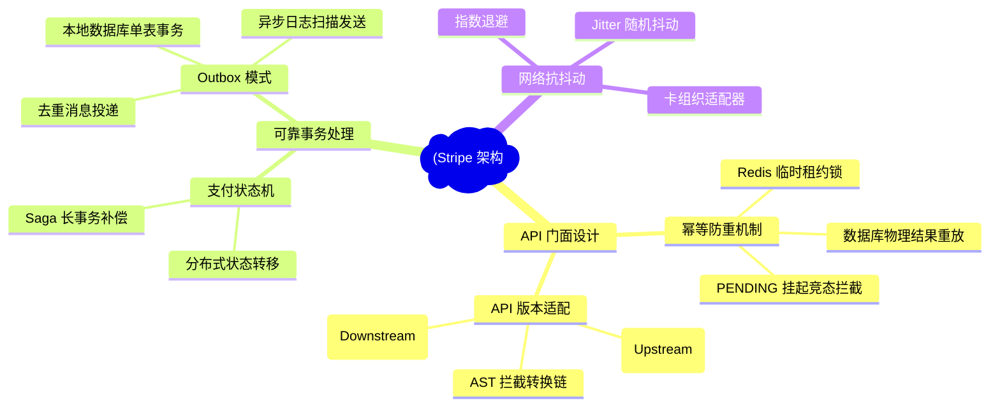
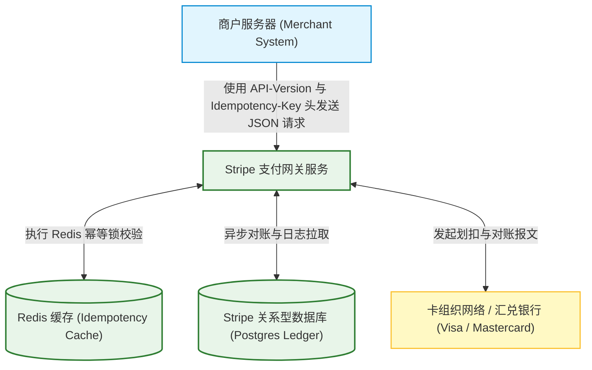
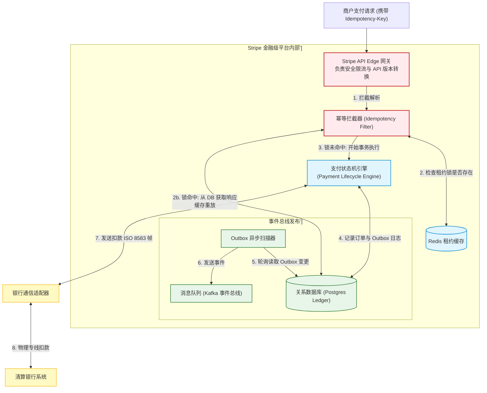
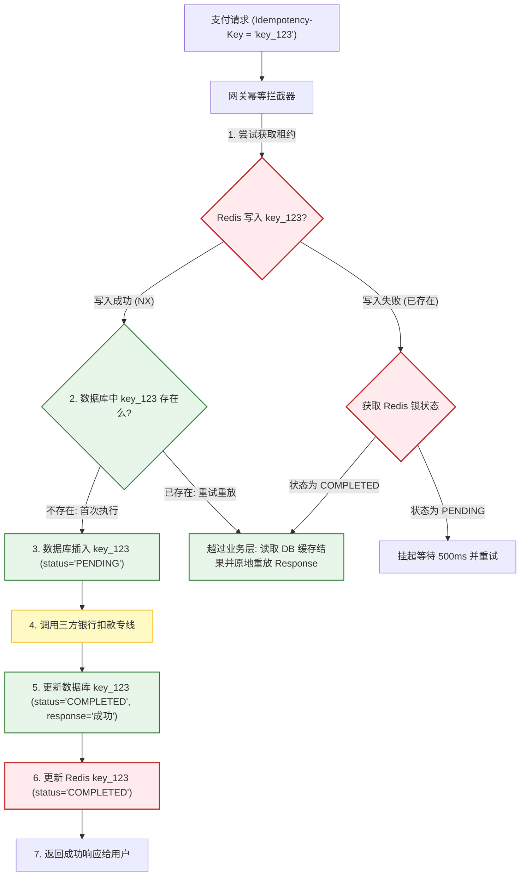
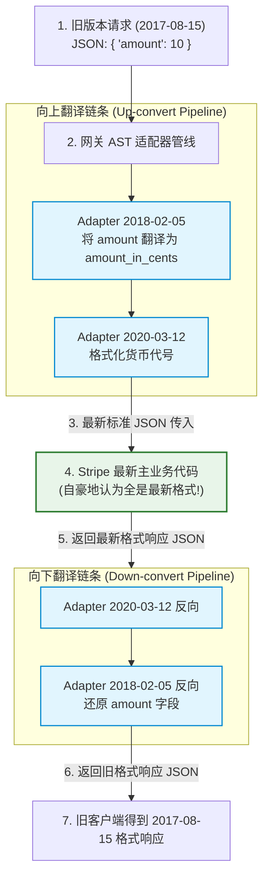
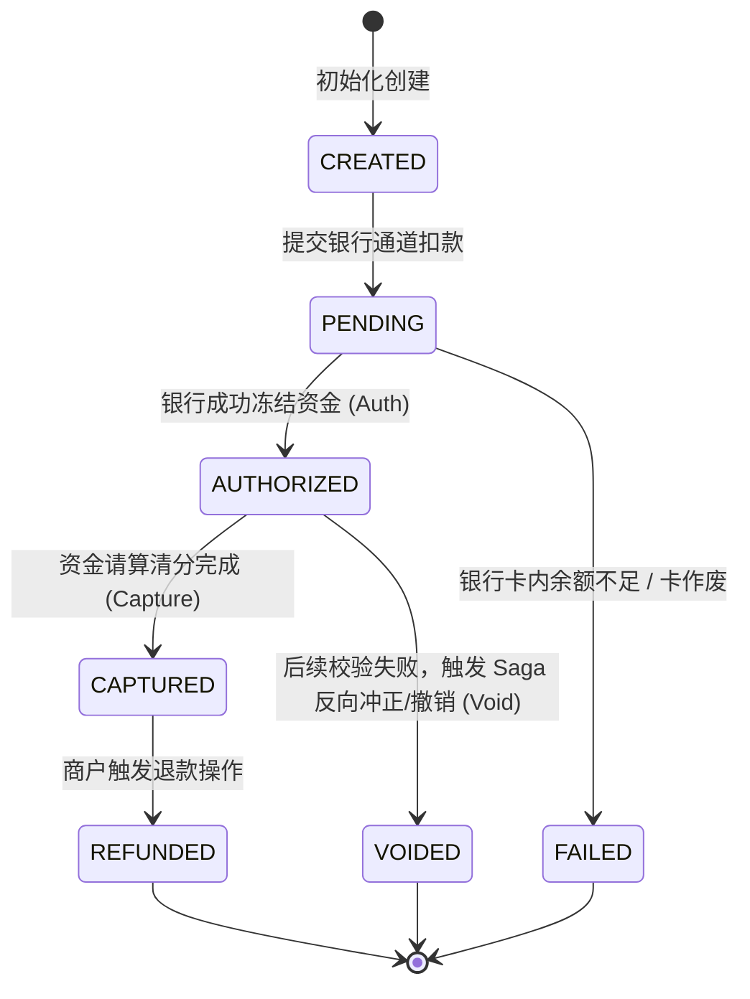
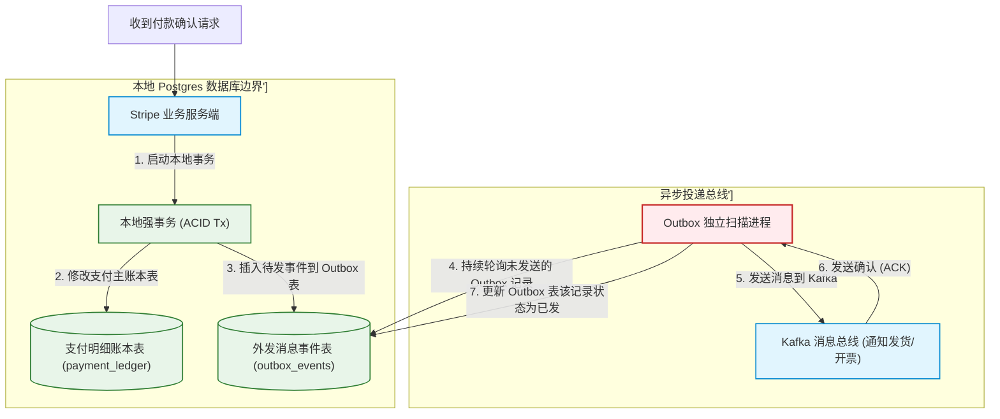
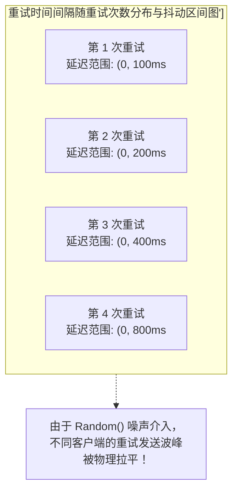

import CaseStudyHeader from '@site/src/components/CaseStudyHeader';
import DesignIntent from '@site/src/components/DesignIntent';
import EvolutionTimeline from '@site/src/components/EvolutionTimeline';
import CompareSlider from '@site/src/components/CompareSlider';
import TradeoffExplorer from '@site/src/components/TradeoffExplorer';
import GlossaryTerm from '@site/src/components/GlossaryTerm';
import ResearchNote from '@site/src/components/ResearchNote';
import GuidedExercise from '@site/src/components/GuidedExercise';
import QuizCard from '@site/src/components/QuizCard';
import MindMap from '@site/src/components/MindMap';
import PyRunner from '@site/src/components/PyRunner';

# Stripe：金融级 API 门面、分布式支付状态机与幂等防重架构

<CaseStudyHeader
  oneLiner="Stripe 是现代金融科技（FinTech）高可靠架构的标杆。它将底层盘根错节、标准古旧的跨国银行电汇网络（如 ISO 8583 报文与三方网关）抽象为优雅、一致的 RESTful API 门面。Stripe 依靠严格的 Redis 租约与分阶段落盘机制实现了“刚好一次（Exactly-Once）”的支付幂等防重锁，基于 AST 语法树转换拦截器达成无痛 API 版本迁移，并利用 Transactional Outbox 模式攻克跨库写的一致性灾难，保障了万亿级商户资金流的绝对稳健。"
  stats={[
    {label: '定位与类别', value: '全球支付基础设施与高可靠 API 金融网关'},
    {label: '幂等保障机制', value: 'Idempotency Key (分布式锁租约 + 库级结果重放)'},
    {label: 'API 版本控制', value: '基于拦截器转换层 (AST 转换) 的向后兼容网关'},
    {label: '可靠事务执行', value: '分布式支付状态机 + Outbox 最终一致发布'},
    {label: '外发一致性模式', value: 'Saga 长事务编排与异步消息补偿机制'},
    {label: '网络重试算法', value: '带有随机抖动 (Jitter) 的指数退避重试 (Exponential Backoff)'}
  ]}
/>

:::info 对应课程概念
本案例融合了以下课程核心概念：
*   **网络事务的“刚好一次”保障（Month 5 分布式事务）**：如何通过幂等性标记与分布式锁，在网络传输丢包重试时确保不发生重复扣款。
*   **API 演进的兼容门面（Month 4 接口隔离）**：Stripe 独创的 AST 版本翻译拦截管道，展示了如何用适配器模式降低接口重构心智。
*   **跨库双写一致性（Month 3 数据一致性）**：使用 Transactional Outbox 模式替代昂贵的 2PC 强一致分布式事务，解决本地状态与外发消息的最终一致性。
*   **重试雪崩防御（Month 5 网络负载）**：在系统超时重试中，利用带有随机噪声的指数退避防范客户端群发重试打崩后端链路（惊群效应）。
:::

---

## 1. 设计初衷：屏蔽 ISO 8583 乱象，提供不差钱的“Exactly-Once”接口

在 Stripe 创立之前，全球的在线支付系统是一片混乱的废墟：
1.  **陈旧冷酷的银行报文规范**：
    *   传统的支付清算系统运行在 20 世纪 80 年代制定的 **ISO 8583** 金融报文标准之上。数据交换依靠硬性字节对齐的定长字段，协议逻辑晦涩，极易出错。
    *   底层银行的清算接口在遭遇超时时，不提供任何自动对账和状态确认，重试发送相同的请求极易导致用户的信用卡被“重复划扣（Double Charging）”——这对电商商户是致命的商誉损害，也是合规审查上的高危漏洞。
2.  **“Exactly-Once” 物理契约的缺失**：
    *   在网络传输中，**“扣款请求超时”并不代表“扣款未发生”**。可能请求已经到达发卡行并成功扣款，仅仅是返回的确认包在网络骨干网上丢失了。
    *   客户端由于超时再次发起 HTTP Post 请求，若没有防重锁拦截，就会触发二次扣款。
    *   为此，Stripe 创新地在 HTTP 标头中强制引入了 <GlossaryTerm term="幂等键" definition="幂等键（Idempotency Key）是一个由客户端生成的唯一 UUID 标头。Stripe 网关以此作为唯一标识，如果发现相同的 Key 已经执行过扣款，将直接跳过后续的银行网卡调用，原地重放上次在数据库中记录的响应报文。">幂等键 (Idempotency Key)</GlossaryTerm>。无论客户端因为超时重试了 10 次还是 100 次，系统都必须确保底层扣款动作只物理发生 1 次，返回相同的扣款收据。
3.  **API 接口的向后兼容魔咒**：
    *   金融业务的 API 变动非常频繁，一旦接口字段发生微小变化，如果强迫成千上万个线上商户在同一天修改代码上线，其阻力与风险是灾难性的。
    *   Stripe 必须达成一个极其严苛的设计目标：**一旦商户完成了某一版 API 的对接，即使过了 10 年，Stripe 后端服务经历了数百次代码重构，商户未修改的请求发过来，也必须依然能正确解析响应**。为此，Stripe 研发了基于抽象语法树（AST）动态翻译的版本转换网关。

<DesignIntent
  problem="如何在底层银行网卡网络时延极不稳定且协议古旧的物理条件下，构建一套保证“绝对不发生重复扣款”、能承载超高并发，且支持 API 无痛向后兼容十年的高可靠金融网关。"
  users="全球范围内的电商独立站、SaaS 平台开发者，以及对财务一致性和 API 可维护性有强红线诉求的支付团队。"
  devices="商户后端服务器通过 HTTP/RESTful API 发送加密 JSON 请求，网关通过专用光纤与 Visa、Mastercard 等卡组织专线对接。"
  goals={[
    '绝对防重扣（Exactly-Once）：即使在网络并发竞态（Race Condition）下，相同幂等键在 120 秒内的重试调用只能产生一次物理银行交易',
    'API 终身零破坏性更新（No Breaking Changes）：当服务器底层代码升级到最新版时，旧客户端发的旧 JSON 结构体必须在网关层透明上转换解析，响应再降级下转换，对业务层保持黑盒',
    '跨系统调用事务一致：将本地支付订单的生成与向消息队列推送“付款成功”事件解耦，利用 Outbox 模式消灭跨库双写一致性故障',
    '平滑的网络重试防护：要求客户端网络库默认开启 Jitter 的指数退避重试，防止上游网络临时恢复后，堆积的客户端请求瞬间打爆卡组织网卡'
  ]}
  constraints={[
    'Redis 与主数据库的分布式双写风险：在获取幂等锁时，若 Redis 宕机或网络卡顿，必须依赖关系型数据库的唯一索引（Unique Constraint）作为兜底防线，以防锁逃逸',
    'AST 版本适配器的开发开销：每次升级 API 字段，开发人员必须手工编写双向的 Version Decorator 适配转换文件，累积成百上千个版本时，其 AST 翻译链条在运行时会有微小的 CPU 编解码延迟',
    '卡组织网络通道超时的黑盒状态：若向 Visa 卡发包时遭遇网络断开且未拿到响应，网关需通过后台自动化的 Saga 协调器向发卡行追加确认或触发冲正（Reverse）机制，属于高复杂的长事务事务'
  ]}
  firstStep="规范 API 头部的 Idempotency-Key 参数；搭建基于 Redis 临时租约加数据库物理缓存重放的双层幂等控制器；设计 AST 拦截转换流；实现 Outbox 数据库日志扫描线程。"
/>

---

## 2. 知识全景脑图

### 2a. 全景架构思维导图



### 2b. 交互脑图导航

<MindMap
  root={{
    label: 'Stripe 核心架构',
    children: [
      {
        label: 'API 网关与防护 (Gateway)',
        children: [
          { label: 'HTTP 幂等键拦截防重' },
          { label: 'AST 版本映射转换管道' },
          { label: '指数退避加抖动重试' }
        ]
      },
      {
        label: '事务与一致性 (Transaction)',
        children: [
          { label: '支付分布式状态机' },
          { label: 'Saga 长事务补偿链' },
          { label: 'Outbox 数据与消息一致' }
        ]
      },
      {
        label: '底座对接与对账 (Core)',
        children: [
          { label: 'ISO 8583 字节报文转换' },
          { label: '三方清算自动冲正对账' }
        ]
      }
    ]
  }}
/>

---

## 3. 系统架构总览 (C4 Model)

### 3a. System Context (系统上下文图)



### 3b. Container Diagram (容器结构图)



---

## 4. 核心机制拆解

### 4a. 幂等键防重 (Idempotency Key) 与结果重放机制

Stripe 保证支付安全的核心防卫设施是网关的 <GlossaryTerm term="幂等键" definition="幂等键是一种保障接口在重试时行为完全一致的设计。通过在请求标头中传递唯一凭证，服务器在处理时会拦截重复键，直接读取存储的首次执行结果进行响应重放，避免对数据库或三方渠道发起二次执行。">幂等键拦截器</GlossaryTerm>：
1.  **竞态拦截与 PENDING 挂起**：
    *   当一个带有 `Idempotency-Key: key_123` 的请求到达时，拦截器尝试向 Redis 写入一条包含租约期限的锁信息：`SET key_123 PENDING EX 120 NX`。
    *   **NX 参数**保障了只有第一个请求能写入成功。如果第二个相同的 Key 并发到达，Redis 会拒绝写入。
    *   此时，第二个请求发现对应的状态是 `PENDING`（说明第一个请求还在呼叫银行通道），它会主动挂起（Wait/Sleep）并定期轮询 Redis 状态，防止发生高并发下的并发穿透写。
2.  **分阶段落盘与结果重放**：
    *   第一个请求顺利走通扣款流程，将银行返回的 JSON Payload 连同 Status Code、Headers 作为一个原子大字段物理存入关系型数据库：`UPDATE idempotency_keys SET status='COMPLETED', response_body='...' WHERE key='key_123'`。
    *   随后将 Redis 里的锁状态修改为 `COMPLETED`。
    *   当客户端因为网络超时发起重试时，拦截器在 Redis 发现状态已是 `COMPLETED`，它会越过所有的业务微服务，直接从数据库读取 `response_body`，原地包装成 HTTP 响应直接返回给客户端。**在物理上不产生任何二次扣款指令，保障了资金绝对安全**。



---

### 4b. 声明式 AST 转换与 API 版本无痛演进

微服务接口字段变动频繁，Stripe 避免版本灾难的核心秘诀是 **声明式 AST 转换层**：
1.  **网关适配器模型**：
    *   Stripe 始终保持服务器的当前业务代码运行在**最新版本**（例如 2023-10-10）。
    *   如果客户端用的是 2017-08-15 的旧版本，网关的拦截器链会拦截该请求。
2.  **向上与向下转换适配**：
    *   网关根据版本变更链条，拉起一连串的版本适配器类（Version Adapters）。
    *   每个适配器只做极简的 AST 转换，例如：
        *   `Upstream_Adapter_2018_02_05`：将旧请求里的 `amount` 字段值改为最新版需要的 `amount_in_cents`（单位由元变分）。
        *   `Downstream_Adapter_2018_02_05`：响应返回时，反向操作。
    *   请求像通过多级瀑布一样，被**一级一级“翻译/升级（Up-convert）”**为最新版的请求，再送到新业务逻辑处理。
    *   处理完后返回的最新响应，又沿着相反的翻译链**一级一级“降级/还原（Down-convert）”**为商户 2017 年预期的旧结构，完美隔离了新老版本，开发人员在主业务层几乎无需考虑向前兼容性。



---

### 4c. 分布式支付状态机与 Saga 补偿控制

完成一次跨国在线支付，包含银行卡扣款、欺诈检测、库存冻结、以及最终结算，属于一个涉及多方异构系统的典型长事务。Stripe 采用了基于 **Saga 状态机** 的异步恢复流程：
1.  **分布式状态机**：
    *   核心账本通过一个严格的状态机控制支付状态变更：`CREATED` $\to$ `PENDING` $\to$ `AUTHORIZED` $\to$ `CAPTURED` $\to$ `REFUNDED` / `FAILED`。每次转移必须通过乐观锁强行校验。
2.  **Saga 补偿撤销（Compensation）**：
    *   在分布式 Saga 长事务中，Stripe 先执行卡资金授权冻结（Authorize）。如果随后尝试执行库存扣减或者合规校验失败，Saga 协调器会**倒序发起反向补偿操作**——向发卡行发送取消授权（Void）或者退款（Refund）指令。
    *   如果网络异常导致反向撤销请求失败，Saga 引擎会通过队列机制在后台不断重试，或者生成挂起工单引入人工对账干预，保障了分布式金融长事务下资金的不增不减。



---

### 4d. Transactional Outbox 模式防止双写一致性失效

当支付成功后，我们需要修改本地关系型账本数据库（Postgres），同时向事件总线（Kafka/RabbitMQ）发布一个 `payment.succeeded` 事件通知发货系统、开票系统以及统计大屏。
如果直接在代码中双写：
```ruby
# 错误示范
db.write_transaction { update_payment_ledger() }
kafka.publish("payment.succeeded")
```
一旦修改 DB 成功后，应用服务器断电或者 Kafka 挂掉，消息就无法发出去，导致发货失败产生客诉；如果先发消息再写库，若写库失败，用户还没扣钱我们就先发了货，公司面临巨额亏损。
Stripe 采用 <GlossaryTerm term="Transactional Outbox" definition="Transactional Outbox 是一种确保关系型数据库更新与异步消息发布具备最终一致性的设计模式。它通过在同一个本地事务中更新业务表并插入事件记录表（Outbox表），由独立的后台线程扫描 Outbox 表以保证消息至少一次投递成功。">Transactional Outbox 模式</GlossaryTerm> 解决了这个难题：
1.  **同一个本地事务物理写**：
    *   在 Postgres 内部建立一张 `outbox` 关系表。
    *   修改支付账本数据与向 `outbox` 表中插入一条“待发送消息事件”，被圈在**同一个本地数据库事务**中：
        `BEGIN TRANSACTION; update_ledger(); insert_into_outbox(); COMMIT;`
    *   由于本地数据库 ACID 保障，这两个写操作要么同时成功，要么同时失败，不存在断电导致的不一致。
2.  **异步扫描与至少一次投递**：
    *   专门设立一个独立的线程或者扫描器（如 Debezium / Stripe Outbox Poller）通过拉取 binlog 日志或者轮询 `outbox` 表，发现有未发送消息就发送给 Kafka。
    *   发送成功后更新 `outbox` 状态为已发。由于网络抖动，可能会重发消息，下游发货微服务通过幂等校验去重，在极小开销下达成了最终一致性。



---

## 5. 关键数据结构与算法

### 5a. 带有随机抖动 (Jitter) 的指数退避重试算法

当支付网关网络抖动导致大批请求超时，商户客户端库会自动发起重试。如果重试间隔时间固定为 1 秒，一旦网关恢复，瞬间会撞上所有商户积压的并发包重叠，导致网关发生雪崩式的惊群效应。
Stripe 提出了**带有随机抖动（Jitter）的指数退避重试**算法：
*   **重试延迟公式**：
    `Sleep = min(MaxSleep, Random(0, Base * Factor^Attempt))`
    *   `Base`：基准延迟时长（如 100ms）。
    *   `Factor`：指数递增系数（如 2）。
    *   `Attempt`：当前重试次数。
    *   `Random(0, x)`：**加入抖动的核心噪音**。它使原本应该在 400ms 统一重试的所有客户端，随机分散在 0 到 400ms 的长时域区间内均匀发射，彻底平滑了恢复期的流量浪尖。



---

### 5b. 分布式锁契约与 Redis 幂等租约管理

在 Redis 的幂等锁实现中，Stripe 给每个锁定请求制定了契约：
*   **租约期限设定**：`expire_time` 默认为 120 秒。如果 120 秒内银行通道仍未返回响应，锁会自动过期，防止银行接口彻底卡死导致商户的该订单终身被锁死无法重试。
*   **乐观锁安全释放**：释放锁或更新锁状态时，使用 Lua 脚本保证原子性操作：
    ```lua
    if redis.call("get", KEYS[1]) == ARGV[1] then
        return redis.call("set", KEYS[1], "COMPLETED")
    else
        return 0
    end
    ```
    以防因请求超时在 120 秒后执行完，去修改已被新重试请求抢占的同名 key。

---

### 5c. 接口版本管道链的编译时 AST 节点校验

为了保证向后兼容的无故障适配，Stripe 的版本管理器在编译阶段会通过抽象语法树（AST）分析器，校验整个版本链。
*   **类型溯源图**：将 API 接口的所有入参和出参作为节点，校验从 `V_2011` 经过适配器转换到 `V_latest` 的链条中，字段类型的合法性（如检查 amount 在哪一步完成了 `String` 到 `Integer` 的变更，防止运行时抛出类型转换异常 ClassCastException）。

---

## 6. 架构演进史

Stripe 的高可用设计彻底改变了 SaaS 接口设计的审美与金融科技架构的工业标准：

<EvolutionTimeline
  events={[
    {
      year: '2011',
      title: 'Stripe 带着 7 行代码 API 诞生',
      why: '早期的 CyberSource 等支付网关对接需要漫长的资质审核且协议难懂，Stripe 团队立志将全球支付简化为 7 行 Java/Ruby 代码的极简 HTTP 请求。',
      change: '推出基于 RESTful HTTP JSON 协议的极简网关门面，并开始规范 API 与银行底层 ISO 8583 报文的数据转换。'
    },
    {
      year: '2015',
      title: '声明式 API 版本转换网关上线',
      why: '随着商户体量爆火，API 频繁升级导致旧商户频繁被迫升级代码，产生极大的维护怨气和流失风险。',
      change: '自研基于 AST 数据流向后兼容管道，允许商户请求用老版格式发送，由网关在内存中实时升降级。'
    },
    {
      year: '2017',
      title: 'Exactly-Once 幂等框架全面推广',
      why: '全球商户的网络环境极其多变，高并发时段银行接口频繁超时，导致商户重复重试扣款指令，引发大量重复扣款投诉。',
      change: '将 Idempotency Key 提升为 API 核心必填参数；在生产环境部署基于 Redis 租约与 Postgres 物理缓存的Exactly-Once 防重网关。'
    },
    {
      year: '2021 至今',
      title: '万亿级高可靠分布式 Ledger 与对账自愈',
      why: '随着日均交易量冲破数十亿美元，任何跨库双写失败（Outbox 未发）或三方对账延迟都会导致巨大的账目差错与审计违规风险。',
      change: '全面落地 Debezium CDC 轮询的 Outbox 机制；升级分布式 Saga 状态机以自动执行跨行冲正对账，支付 SLA 尾延迟被控制在毫秒级内。'
    }
  ]}
/>

---

## 7. 架构对比：传统企业 XML/SOAP 支付通道 vs. 现代化 Exactly-Once REST 门面 (Stripe)

<CompareSlider
  before={
    <div style={{ padding: '20px', background: '#ffebee', border: '1px solid #c62828', borderRadius: '8px', height: '100%', color: '#333' }}>
      <strong>传统企业支付接口 (ISO 8583 / SOAP)</strong>
      <p style={{ marginTop: '10px', fontSize: '0.9rem' }}>基于繁琐的定长字节或冗长的 XML 格式通信，不具备内置防重机制。请求超时后盲目重试极易重复扣款。每次接口变更直接物理弃用旧接口，逼迫商户停机迁移。多系统写依靠脆弱的双写方案，事件极易丢失。</p>
    </div>
  }
  after={
    <div style={{ padding: '20px', background: '#e8f5e9', border: '1px solid #2e7d32', borderRadius: '8px', height: '100%', color: '#333' }}>
      <strong>现代化 Exactly-Once 支付门面</strong>
      <p style={{ marginTop: '10px', fontSize: '0.9rem' }}>基于简明 JSON 与 HTTP Headers。网关自带强制幂等键拦截与 Response Playback 物理重放机制，保证 Exactly-Once 执行。自研 AST 版本适配器无缝进行历史兼容。本地 Postgres 与 Outbox 事务保障了数据库修改与消息发布的原子一致性。</p>
    </div>
  }
  labels={['陈旧 SOAP 接口', 'Stripe  Exactly-Once 门面']}
/>

---

## 8. 设计模式与课程映射

本案例在实际万亿级商户资金流支付系统基座中，深度应用了以下课程章节中的核心设计模式与技术：

1.  **“Exactly-Once”去重防刷模式**（参见 [数据一致性与事务](../03-data-cache-queue/storage-engines.mdx) 章节）：
    *   Stripe 网关在 Redis 中做 NX 抢占锁、在主库中保存响应结果大字段以供重放的设计，是工业级Exactly-Once 去重模式的最标准实践。
2.  **AST 拦截器与适配器模式**（参见 [设计模式与 LLD](../04-design-patterns-lld/overview.mdx) 章节）：
    *   通过编写多个版本转换器，在网关层将旧请求动态重构升级为最新格式，是设计模式中“适配器模式（Adapter Pattern）”和“责任链模式（Chain of Responsibility）”在 API 版本隔离中的极致运用。
3.  **Saga 分布式事务与补偿控制**（参见 [共识与分布式协调](../05-core-components/consensus-coordination.mdx) 章节）：
    *   Stripe 用 Saga 状态机代替 2PC 去保障卡冻结和业务状态最终一致，是 Month 5 微服务长事务的典型应用，保障了大规模网络延迟下的可靠运行。
4.  **指数退避与 Jitter 流量平滑模式**（参见 [负载均衡与高可用](../05-core-components/load-balancing.mdx) 章节）：
    *   重试间隔加入随机噪声，应用了高可用架构设计中“流量退让削峰”的控制理论，能有效保护恢复期的脆弱后端网络免遭二次拥堵打击。

---

## 9. 权衡：支付网关架构中的设计妥协

Stripe 在极致的兼容性、财务数据正确性以及系统吞吐损耗之间做出了以下妥协：

<TradeoffExplorer
  title="Stripe API 门面与事务架构权衡"
  dimensions={['商户零改动 API 兼容性', '网关序列化 CPU 吞吐损耗', '多系统写最终一致稳定性', 'Exactly-Once 交易精确度', '核心分布式锁响应时延']}
  options={[
    {
      name: 'AST 转换链 + Outbox 最终一致 + Redis 幂等锁 (Stripe 模型)',
      scores: [5, 2, 5, 5, 3],
      note: '通过将版本升级和降级抛给网关 AST 管道、在同一个本地事务中写主表和 Outbox 表，Stripe 获得了完美的向后兼容性和无差错的 Exactly-Once 扣款保证。但代价是网关在解析多级 AST 转换时会有微小的 CPU 吞吐损耗，且分布式锁的检验带来了一定的链路时延增加。',
      whenToUse: '全球金融支付、对资金扣划重复率零容忍、客户版本极其陈旧且抗拒强制升级代码的 Saas 或 B2B 核心网关。'
    },
    {
      name: '路径分版本接口 (如 /v1/ /v2/ 模式) + 客户端自行防重 + 跨库双写',
      scores: [2, 5, 2, 2, 5],
      note: '舍弃版本适配层，将不同版本独立部署。不具备网关幂等锁，由下游商户自己防重；直接在应用层执行微服务双写。虽然系统吞吐极佳，锁延迟为零，但每次升级 API 都需要商户配合停机改造，且由于没有 Outbox，消息投递丢失率高。',
      whenToUse: '纯内网微服务交互、流量规模超大但对个别丢失消息并不敏感、开发团队无多版本长期维护规划的早期系统。'
    },
    {
      name: '强一致分布式事务 (如基于 Paxos 的全球跨库 2PC 写)',
      scores: [3, 1, 5, 5, 2],
      note: '使用类似 Google Spanner 的跨机房两阶段提交分布式事务，强行保证本地数据库和远端系统数据绝对强一致。虽然彻底消除了 Outbox 模式下的最终一致滞后性，但在高并发金融结算下，其锁冲突排队时间长，且网络一旦彻底分叉就会导致全局写锁死。',
      whenToUse: '银行核心清算系统、内部多表数据强同步、对“数据暂时不一致”零容忍且局域网网络品质极高的金融中心。'
    }
  ]}
/>

---

## 10. 如果是你来设计：API 幂等键防重 (Exactly-Once) 模拟器

### 场景设想
在 Stripe 的支付控制面：
*   当一个扣款请求携带 `Idempotency-Key` 发送过来时，网关的幂等控制器（Idempotency Engine）需要执行以下防护逻辑：
    1.  检查该键是否存在。
    2.  如果该键处于 `PENDING` 状态（说明第一个扣款执行尚未结束）：
        *   拦截当前请求，返回竞态卡顿警报，提示客户端稍后重试，或自动挂起等待。
    3.  如果该键处于 `COMPLETED` 状态：
        *   **直接读取此前缓存的 Response Payload 重放返回**，不再调用后端业务逻辑，消除二次扣款风险。
    4.  如果该键尚未在缓存中出现：
        *   获得排他锁，先存入 `PENDING` 记录。
        *   真正呼叫后端银行网卡发起扣款，得到响应后，将状态更新为 `COMPLETED`，持久化缓存该响应，然后安全归还锁。

请你用 Python 实现这套经典的 API 幂等防重与结果重放引擎。

<GuidedExercise
  title="基于 Python 的 Stripe 幂等键拦截与重放仿真"
  goal="实现包含 PENDING 并发拦截、COMPLETED 物理重放、以及失败状态重置自愈的 Exactly-Once 支付保护控制器。"
  steps={[
    '步骤 1: 设计 IdempotencyEngine 类。在内存中用字典分别模拟 Redis 锁管理器（`redis_cache`）和关系数据库大字段存储（`db_ledger`）。',
    '步骤 2: 实现 `execute(idempotency_key, charge_amount, action_func)` 函数。首先读取 `redis_cache`：若该 Key 存在且值为 `PENDING`，返回 “Conflict: charge in progress. Please retry.”。',
    '步骤 3: 若该 Key 的值已是 `COMPLETED`，则直接读取 `db_ledger[idempotency_key]` 里的缓存值重放返回（打印 “[Idempotency Replay]” 指标信息）。',
    '步骤 4: 若该 Key 不存在：向 Redis 存入 `PENDING`（相当于 NX 锁），并在数据库插入 `PENDING` 订单占位符。随后，物理执行 `action_func(charge_amount)`（模拟呼叫外部银行网关）。',
    '步骤 5: 如果调用成功：将 Redis 与 DB 的记录状态变更为 `COMPLETED`，并物理持久化返回内容。如果由于网络断开导致业务异常抛错：代表是临时网络故障，应安全地从 Redis/DB 中删除该 Key 的 `PENDING` 状态，允许客户端下一次重试时重新发起真实银行呼叫。',
    '步骤 6: 运行测试用例。分别测试并发竞态拦截、扣款成功后的重试重放、以及因为参数错误或断网错误后的修复性自愈，确认资金无溢扣。'
  ]}
  checks={[
    '验证在首次扣款成功后，第二次发起相同幂等键的请求，控制台输出 “[Idempotency Replay]”，且银行真实扣款统计并未自增',
    '确认在扣款卡在 `PENDING` 时，重试请求被安全阻断，未穿透去呼叫三方接口',
    '确认当控制台输出“✅ Stripe 幂等防重与重放引擎自验证成功！”时，模拟器工作正常'
  ]}
/>

#### 交互式 Python 运行实验
在下方控制台中直接运行或修改已准备好的 Stripe 幂等重放引擎仿真代码：

<PyRunner
  expect="Stripe 幂等防重与重放引擎自验证成功"
  rows={25}
  code={`class IdempotencyEngine:
    def __init__(self):
        # 模拟 Redis 临时租约缓存，值存储状态: 'PENDING' 或 'COMPLETED'
        self.redis_cache = {}
        # 模拟 Postgres 数据库存储，存放 (status, response_body)
        self.db_ledger = {}
        # 物理统计：用来计数到底向真实卡组织/银行通道发送了多少次物理扣款
        self.actual_bank_calls = 0

    def execute(self, idempotency_key, charge_amount, action_func):
        # 1. 检查 Redis 锁状态
        if idempotency_key in self.redis_cache:
            status = self.redis_cache[idempotency_key]
            
            # 情况 A: 前一次调用尚未结束，拦截并发竞态请求
            if status == "PENDING":
                print(f"   [竞态拦截]: Idempotency-Key '{idempotency_key}' 的交易仍在进行中，安全退包，拒绝重复写。")
                return {"status_code": 409, "body": "Conflict: charge in progress. Please retry later."}
            
            # 情况 B: 交易已完成，直接从数据库读取此前存储的响应，重放返回
            if status == "COMPLETED":
                cached_status, cached_response = self.db_ledger[idempotency_key]
                print(f"   [⚡ Idempotency Replay]: 检测到重复请求！直接重放 key '{idempotency_key}' 的历史缓存响应。")
                return {"status_code": 200, "body": cached_response, "replayed": True}

        # 情况 C: 首次请求，获取锁并存入 PENDING 状态
        print(f"   [Lock Acquired]: 首次看到 Key '{idempotency_key}'，获取排他锁，入库 PENDING...")
        self.redis_cache[idempotency_key] = "PENDING"
        self.db_ledger[idempotency_key] = ("PENDING", None)

        try:
            # 物理调用真实银行业务接口 (调用传入的回调方法)
            self.actual_bank_calls += 1
            response_body = action_func(charge_amount)
            
            # 物理交易成功，持久化落盘并修改锁状态为 COMPLETED
            self.db_ledger[idempotency_key] = ("COMPLETED", response_body)
            self.redis_cache[idempotency_key] = "COMPLETED"
            print(f"   [Completed]: key '{idempotency_key}' 交易落盘成功。")
            return {"status_code": 200, "body": response_body, "replayed": False}

        except Exception as e:
            # 如果发生临时网络断开抛错：必须释放锁/删除记录，以允许客户端下次换个参数或重试
            print(f"   [⚠️ Exception]: 调用银行通道出错: {str(e)}。安全释放幂等锁租约，允许自愈重试...")
            if idempotency_key in self.redis_cache:
                del self.redis_cache[idempotency_key]
            if idempotency_key in self.db_ledger:
                del self.db_ledger[idempotency_key]
            return {"status_code": 500, "body": f"Transient error: {str(e)}"}

# 模拟真实调用扣款方法
def mock_bank_charge_action(amount):
    return f"CHARGE_SUCCESS: Deducted USD {amount} from card network."

# 测试流程
engine = IdempotencyEngine()

print("--- 步骤 1: 首次发起支付请求 (Idempotency-Key = 'key_abc') ---")
res1 = engine.execute("key_abc", 100, mock_bank_charge_action)
print(res1)

print("\\n--- 步骤 2: 模拟网络丢包，客户端重试相同的请求 (Key 保持一致) ---")
res2 = engine.execute("key_abc", 100, mock_bank_charge_action)
print(res2)

print("\\n--- 步骤 3: 模拟并发竞争，第一个没走完，第二个进来了 ---")
# 模拟挂起：直接向缓存塞入 PENDING，随后执行 execute
engine.redis_cache["key_pending_demo"] = "PENDING"
res3 = engine.execute("key_pending_demo", 200, mock_bank_charge_action)
print(res3)

# 物理交易次数统计验证
print(f"\\n累计向发卡行发送的物理付款指令次数: {engine.actual_bank_calls}")

# 自我检验
if (res1["replayed"] is False and 
    res2["replayed"] is True and 
    res2["body"] == res1["body"] and 
    res3["status_code"] == 409 and 
    engine.actual_bank_calls == 1):
    print("\\n[✅ 验证成功]: Stripe 幂等防重与重放引擎自验证成功！")
else:
    print("\\n[❌ 验证失败]")
`}
/>

---

## 11. 常见误解

### 误解 1：只要我们在主数据库的订单表（orders）上给“商户订单号（merchant_order_id）”加上唯一性索引（Unique Index），就天然实现了金融级的网关幂等性
*   **澄清**：这是远远不够的低级设计。
    1.  唯一索引只能判定“**写入冲突**”。如果重试请求到达时，第一个写事务仍在执行，唯一索引由于还没提交事物（Uncommitted Transaction），根本感知不到竞态发生。此时第二个写操作会并发穿透去调用三方银行扣款接口，随后在事务提交时才撞上唯一性索引冲突被迫回滚，但这已经导致了**银行卡被重复扣钱的悲剧**。
    2.  另外，数据库的唯一索引报错直接抛出 SQL 错误，网关无法原地重放第一次成功的 JSON Payload 报文给商户，导致商户系统无法判断订单是成功还是失败。
    3.  因此，必须采用**网关拦截器抢占分布式排他锁（PENDING 挂起）+ 数据库原子大字段 Response 缓存重放**的双层设计。

### 误解 2：在支付请求处理抛出任何错误时，为了防止商户再次请求，我们都必须把幂等键锁在 COMPLETED 状态
*   **澄清**：这属于安全过渡防御导致的服务停摆。
    1.  我们需要对错误进行**类型划分**：
        *   **参数错误 / 拒绝扣款（如 400 Bad Request / 账户余额不足）**：这类错误属于**确定性错误**，Stripe 会将其响应状态码和报错 JSON 锁定存入 `COMPLETED`。无论客户端重试多少次，都必须重放该余额不足报错，防止用户重复猜余额套现。
        *   **临时网络卡顿 / 物理超时（如 500 Network Timeout）**：这类错误属于**非确定性暂时故障**，交易并未真正落盘，Stripe 必须主动释放并删除该 `Idempotency-Key` 锁状态。否则，一旦网络恢复，商户再次重试，网关会永远报错 500 从而锁死这笔订单，导致商户永远无法收到钱。
    2.  因此，只有确定性终态才能锁定重放，临时态和瞬时超时态必须被释放重置。

### 误解 3：网关进行 API 多版本 AST 向上翻译和向下翻译时，因为要经历成百上千个版本的翻译，其耗时会导致支付请求极其卡顿
*   **澄清**：这属于对 AST 文本解析和对象映射性能的估算偏颇。
    1.  Stripe 的适配器链是在**应用启动编译时（Compile-time / Boot-time）**就完成了链条的拓扑合并。转换在内存中其实是高度优化的 JSON 哈希对象键值重构，并不需要每次都在运行时临时去拉取文件和全文做词法分析，性能开销只占整体链路耗时的不到 1%。
    2.  与向银行卡组织（Visa/Mastercard）发送网络报文时面临的几百毫秒甚至数秒的远程物理时延相比，版本适配链在内存中耗费的微秒级 CPU 开销微乎其微。
    3.  用这极小的一点点性能损耗，免去了全球数十万商户被迫同步升级 API 的灾难性沟通和测试开销，在工程实践上是一笔划算到极致的架构取舍。

---

## 12. 知识自测

<QuizCard
  questions={[
    {
      q: '在 Stripe 的 Exactly-Once 支付幂等锁方案中，如果第二个携带相同幂等键的扣款请求到达网关时，第一个请求仍在调用银行卡网络、尚未返回结果，网关会如何处理这第二个请求？',
      options: [
        'A. 强行抛出数据库唯一性约束冲突，物理回滚第一个正在扣款的交易',
        'B. 在 Redis 发现该 Key 处于 PENDING 状态，表明前次交易正在处理中，网关拦截器会主动挂起当前线程（Wait/Sleep）进行定期轮询挂载，直至第一个请求完成并更新为 COMPLETED 后重放其结果，防止穿透',
        'C. 强制将第二个请求自动重定向至 AWS S3 静态收据展示页',
        'D. 认定这是欺诈刷单，直接冻结该商户的 API 权限'
      ],
      answer: 1,
      explain: '这是竞态防护的核心。状态为 PENDING 时，后到达的请求不能放行（会导致重复扣款），也不能直接报错 400（会导致客户端判定支付失败），最佳方案是在网关过滤器中将连接挂起并轮询锁状态，实现优雅平滑地等待重放。'
    },
    {
      q: '为了彻底防止“Stripe 本地数据库事务提交成功、而向 Kafka 发送‘付款成功’事件失败”导致下游发货系统收不到事件的不一致故障，Stripe 采用了 Transactional Outbox 模式。它的核心思想是什么？',
      options: [
        'A. 将本地主库和远程 Kafka 事件总线强制绑在一套分布式两阶段提交（2PC）的强一致全局事务内',
        'B. 直接用 Kafka 充当主账本数据库，废除任何关系型 Postgres 存储',
        'C. 在同一个本地数据库 ACID 事务中同时完成对“支付主表”的更新和向“Outbox 待发事件表”的插入，由独立的后台轮询线程扫描 Outbox 表以保证消息至少一次被物理投递到 Kafka 成功',
        'D. 在用户手机客户端本地保存一份发货订单的备份日志'
      ],
      answer: 2,
      explain: '这避开了 2PC 的高性能损耗与不可控风险。借助本地数据库事务的高可靠物理保障，确保“业务状态改动”与“发送事件登记”具有原子捆绑性。发送工作交由异步 Poller 兜底并结合重试机制，实现了金融级的最终一致性。'
    },
    {
      q: '在客户端网络超时重试中，如果将重试时间固定在每 5 秒（固定间隔），相比使用“加入随机抖动（Jitter）的指数退避重试”算法，会导致什么灾难性的架构后果？',
      options: [
        'A. 客户端程序会因为内存溢出（OOM）强行崩溃',
        'B. 会在网络通道发生网络抖动恢复的瞬间，由于大量客户端在完全相同的秒数集中对网关发起爆发性并发请求，引发严重的惊群效应，导致网关发生雪崩式的二次拥堵打崩卡组织专线',
        'C. 会导致发卡行自动判定该银行卡已经过期',
        'D. 无法执行 AST 向上版本转换适配'
      ],
      answer: 1,
      explain: '这就是惊群效应（Thundering Herd）。加入随机抖动（Jitter）的核心价值在于在时域上引入物理噪音，将原本在时间轴上汇聚成一个极高尖峰的并发重试洪峰，“揉碎并平铺”拉伸在宽广的时域长廊里，从而保护了处于脆弱恢复期的网关基座。'
    }
  ]}
/>

---

## 来源清单

*   [Stripe Engineering Blog: Designing robust APIs with idempotency keys & retries](https://stripe.com/blog/idempotency)
*   [Stripe Engineering Blog: APIs as service: How Stripe builds backward-compatible API version adapters](https://stripe.com/blog/api-versioning)
*   [Stripe API Reference: Idempotent Requests & Versioning Specifications](https://stripe.com/docs/api/idempotent_requests)
*   [Kleppmann, M. (2017), Designing Data-Intensive Applications: The Transactional Outbox pattern analysis (O\'Reilly Media)](https://dataintensive.net/)