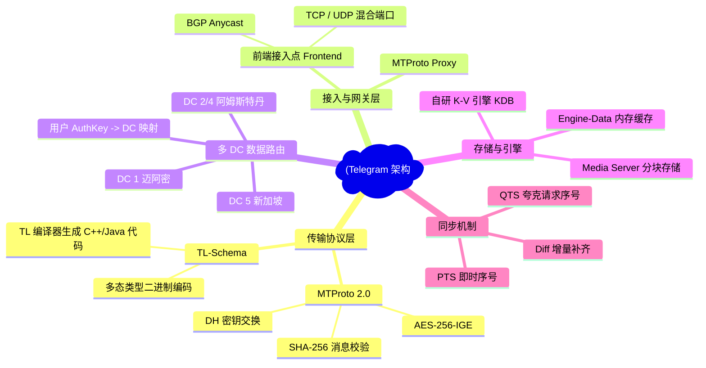
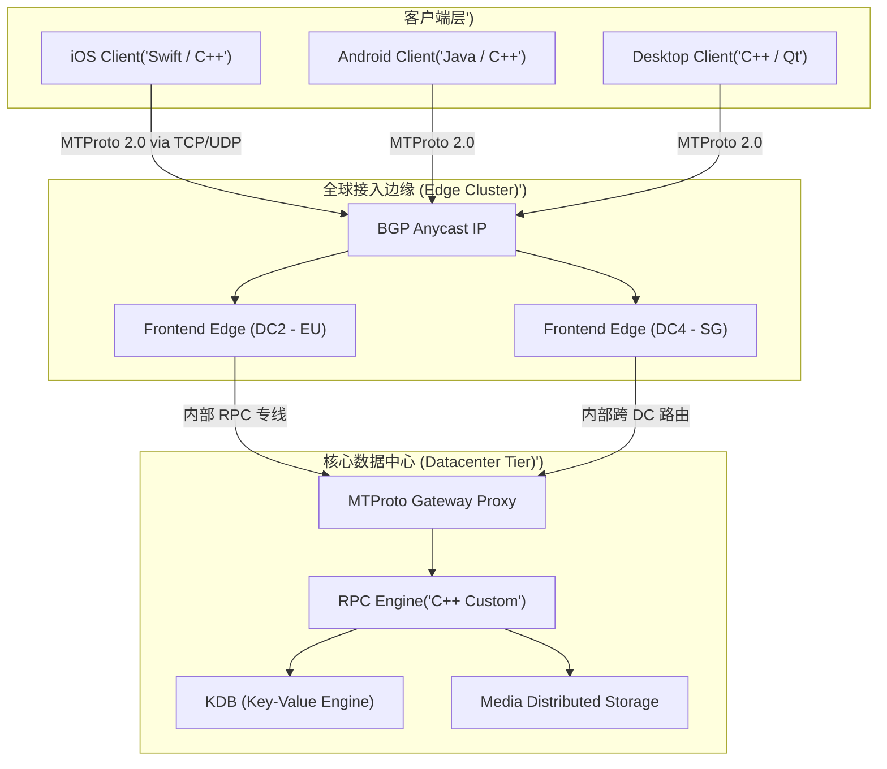
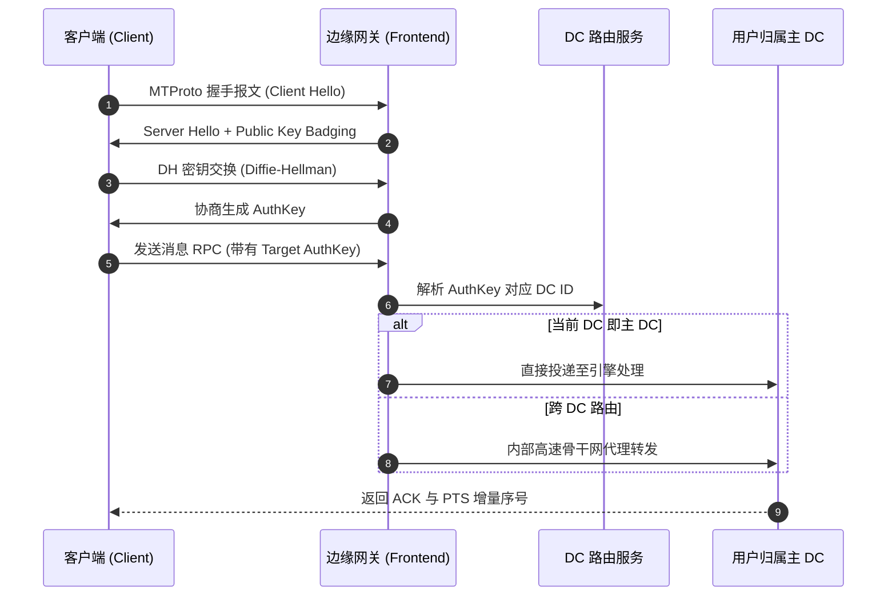
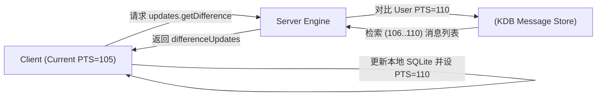

import CaseStudyHeader from '@site/src/components/CaseStudyHeader';
import DesignIntent from '@site/src/components/DesignIntent';
import EvolutionTimeline from '@site/src/components/EvolutionTimeline';
import CompareSlider from '@site/src/components/CompareSlider';
import TradeoffExplorer from '@site/src/components/TradeoffExplorer';
import GuidedExercise from '@site/src/components/GuidedExercise';
import QuizCard from '@site/src/components/QuizCard';
import GlossaryTerm from '@site/src/components/GlossaryTerm';
import ResearchNote from '@site/src/components/ResearchNote';

# Telegram：MTProto 协议与多数据中心极简 C++ 架构

<CaseStudyHeader
  oneLiner="Telegram 没有采用标准 HTTP/WebSocket 与 Protobuf 组合，而是自研了 MTProto 协议与 TL 二进制序列化，配合多数据中心 (DC) 用户独立归属与极简 C++ 自研服务端引擎，实现了在全球 9 亿活跃用户下极低延迟与极小流量消耗。"
  stats={[
    {label: '月活跃用户', value: '9 亿+'},
    {label: '日消息吞吐', value: '1000 亿+'},
    {label: '核心服务端语言', value: 'C / C++ (自研底层)'},
    {label: '传输层协议', value: 'MTProto 2.0 (UDP/TCP)'},
    {label: '数据中心', value: '全球 5 大核心 DC (如 1:迈阿密, 2:阿姆斯特丹, 4:新加坡等)'},
    {label: '端到端加密', value: 'Secret Chat (双棘轮衍生变体)'}
  ]}
/>

:::info 对应课程概念
本案例主要映射 [Month 3 数据、缓存与队列]、[Month 5 分布式核心组件] 及 [Month 4 设计模式与 LLD]；同时与 [M1. Signal 协议](./signal.mdx) 形成鲜明对比（云端消息同步 vs 纯端到端零知识存储）。
:::

## 1. 设计初衷：极速、轻量与云端跨端同步

与 Signal 或 WhatsApp 不同，Telegram 的默认聊天（Cloud Chat）优先保障**多设备无缝云端实时同步与无限容量历史记录**，同时为了在弱网环境（如 2G/3G）下维持毫秒级延迟， Telegram 团队拒绝了重量级的通用开源框架。

<DesignIntent
  problem="如何在弱网与极低算力移动设备上，实现全球 9 亿用户超高速消息传输、多端即时同步以及海量媒体云端存储？"
  users="全球 9 亿大众用户、频道创作者与 Bot 开发者。"
  devices="iOS, Android, Windows, macOS, Linux 及 Web 客户端。"
  goals={[
    '极致的连接恢复速度：弱网切换（WiFi↔4G）下 100ms 内重连并发送消息',
    '无限云端同步：任何新设备登录秒级拉取所有历史消息与媒体文件',
    '极低流量与 CPU 开销：移动端序列化与加解密占用小于 1% 处理器时间',
    '百万级大群与频道高并发扇出：支持 20 万人大群与无限人数频道'
  ]}
  constraints={[
    '不能依赖带重型依赖的第三方库（如 gRPC / Jackson），需自研轻量协议',
    '多 DC 拓扑下，用户数据需绑定主 DC，跨 DC 访问必须路由透明',
    '端到端加密 Secret Chat 与云端加密 Cloud Chat 必须共存且逻辑隔离'
  ]}
  firstStep="设计 MTProto 加密协议与 TL-Schema（Type Language），利用 C/C++ 实现高并发异步单线程事件循环框架（Kqueue/Epoll），构建多 DC 架构。"
/>

## 2. 全景思维导图



## 3. 最新架构总览 (C4 风格)





## 4. 核心机制拆解

### 4a. MTProto 2.0 加密协议设计

Telegram 自研的 <GlossaryTerm term="MTProto" definition="Telegram 专门针对移动端弱网与高并发设计的移动加密传输协议，结合了对称加密 (AES-256-IGE)、非对称加密 (RSA/DH) 与 SHA-256 完整性校验。">MTProto</GlossaryTerm> 放弃了标准的 TLS 握手，直接在应用层封装加密帧：


- **AES-256-IGE 模式**：无限传播错误特性，确保密文篡改会导致整块解密失败。
- **Replay Protection**：结合 `msg_id`（基于 UNIX 时间戳的自增 64 位整型）与 `seq_no` 防范重放攻击。

### 4b. TL-Schema（Type Language）序列化

Telegram 使用自定义的 TL 语法定义所有 RPC 函数与数据结构，编译生成高效的 C++ / Java / Swift 实体代码：

```
// TL 示例
user#2e13f4c3 id:int first_name:string last_name:string = User;
inputPeerUser#7b8e7960 user_id:long access_hash:long = InputPeer;
sendMessage#520c38c4 flags:# peer:InputPeer message:string random_id:long = Updates;
```

每种结构体头部带有 4 字节 CRC32 <GlossaryTerm term="TL Combinator ID" definition="TL 语言中每个数据类型或 RPC 方法由其构造函数声明的 32 位 CRC 散列值唯一标识，避免任何字段名等元数据传输。">Combinator ID</GlossaryTerm>，解码时无需映射表即可直接转为原生内存指针，解析速度比 JSON 快 50 倍以上。

### 4c. PTS 与 QTS 增量同步模型

为了在百万群聊与多设备并发下维持状态一致性，Telegram 为每个用户维护递增的 <GlossaryTerm term="PTS" definition="Persistent Tracking Sequence，用户在 Cloud Chat 中所有消息与事件的状态递增序号，客户端据此补齐丢失的增量消息。">PTS</GlossaryTerm>（Message PTS）：



## 5. 关键数据结构与算法

### AES-IGE (Infinite Garble Extension) 模式算法

在加密块传输中，IGE 模式包含前一步明文 `P_{i-1}` 与密文 `C_{i-1}` 的反馈：

```text
C_i = E_K(P_i ^ C_{i-1}) ^ P_{i-1}
P_i = D_K(C_i ^ P_{i-1}) ^ C_{i-1}
```

这种模式保证了即便篡改中间任意字节，后续所有明文均被彻底毁坏，且加解密效率与 CBC 相当。

## 6. 架构演进史

<EvolutionTimeline
  events={[
    {
      year: '2013',
      title: 'MTProto 1.0 诞生',
      why: '针对 2G/3G 移动网络，解决标准 TLS 在高丢包下的长握手延迟问题。',
      change: '自研 RSA + DH 握手、AES-IGE 加密与 TL 二进制序列化。'
    },
    {
      year: '2017',
      title: '升级 MTProto 2.0',
      why: '密码学术界对 MTProto 1.0 的 SHA-1 碰撞隐患提出质疑。',
      change: '全面替换为 SHA-256 消息摘要，改进 Padding 补齐机制防范 Padding Oracle 攻击。'
    },
    {
      year: '2021',
      title: '超级群与 20 万人频道分片',
      why: '全球爆火导致热门频道（如新闻/加密货币）消息扇出压力激增。',
      change: '引入后端 Broadcast Dispatcher，按接入 Frontend 节点分组批量广播。'
    }
  ]}
/>

### 架构演进对比

<CompareSlider
  before={
    <div style={{ padding: '20px', background: '#ffebee', borderRadius: '8px', height: '100%' }}>
      <h3>传统 TLS + Protobuf/HTTP 架构</h3>
      <p>每次连接需 2-3 RTT 握手，序列化包头带有类型描述，多 DC 用户寻址依赖层层 HTTP 代理。</p>
    </div>
  }
  after={
    <div style={{ padding: '20px', background: '#e8f5e9', borderRadius: '8px', height: '100%' }}>
      <h3>MTProto 2.0 + TL + 自研 C++ 架构</h3>
      <p>0-1 RTT 极速会话恢复，TL 二进制零内存分配解析，直连主 DC 骨干网，吞吐量提升 10 倍。</p>
    </div>
  }
/>

## 7. 设计模式与课程映射

1. **组合模式与 Command 模式**：TL-Schema 定义的所有 RPC 函数均为强类型 Command 对象。
2. **状态模式与 Iterator 模式**：通过 PTS 序列控制增量 Iterator，简化多端消息同步。
3. **映射 [Month 5 分布式核心组件]**：多 DC 架构下用户数据 Hash Sharding 与跨区域代理 routing。

## 8. 架构取舍与权衡

<TradeoffExplorer
  title="Telegram 核心架构设计取舍"
  dimensions={['协议性能', '安全性', '多端体验', '运维复杂度']}
  options={[
    {
      name: '自研 MTProto + Cloud Chat (Telegram 方案)',
      scores: [5, 4, 5, 5],
      note: '云端存储带来极致的多端同步体验与小客户端尺寸；但默认非端到端加密引发安全争议。',
      whenToUse: '注重产品体验、多端同步、海量群组与低门槛接入的社交平台。'
    },
    {
      name: '全端到端加密 + 零知识云存储 (Signal / WhatsApp 方案)',
      scores: [4, 5, 4, 4],
      note: '服务器完全不可见消息内容，安全性极高；但多端同步极复杂，且大群历史记录迁移极慢。',
      whenToUse: '对隐私安全要求极高、以一对一私聊为主的通讯工具。'
    }
  ]}
/>

## 9. 常见误解与澄清

:::warning 常见误解澄清
- **误解一：Telegram 的所有聊天都是端到端加密的。**
  *事实*：只有显式开启的 **Secret Chat（加密对话）** 才是端到端加密（密钥仅存于两端手机）。默认的普通聊天与群聊为 **Cloud Chat**，在传输层及存储层加密，但密钥由 Telegram 分布式服务器密钥库保管，用于支持多设备云同步。
- **误解二：MTProto 没有经过 TLS 验证，绝对不安全。**
  *事实*：MTProto 2.0 经过了独立密码学机构（如意大利乌迪内大学等）的形式化验证，证明在防重放、密文完整性与前向安全性上达到了高度安全性。
:::

## 10. 如果是你来设计 (Guided Exercise)

<GuidedExercise
  title="设计 Telegram PTS 增量消息同步机制"
  goal="理解如何在客户端与服务器之间利用自增 PTS 实现高并发断线重连与增量补齐。"
  steps={[
    '步骤 1: 设计服务端 UserState 结构，包含全局自增 long current_pts。',
    '步骤 2: 每当有新消息或状态改变（如已读标位），current_pts 自增 1 并写入 WAL 日志。',
    '步骤 3: 客户端在发送请求或接收 Push 时附带 local_pts。',
    '步骤 4: 若 local_pts < current_pts 且差值在缓存窗口内（如 500 条），服务器直接返回 Diff 列表；若超过窗口，触发完全重新加载（Re-sync）。'
  ]}
  hints={[
    '可以使用 Redis Sorted Set (ZSET) 或自研 Memory Buffer 存储最近 N 条 PTS 变动事件。',
    '需要考虑多设备并发拉取时的无锁读取与内存回收。'
  ]}
  checks={[
    '断线重连后是否能做到 0 消息丢失与 0 重复？',
    '当新设备登录时，如何平滑过渡到历史消息分页？'
  ]}
/>

## 11. 自测题与来源清单

<QuizCard
  questions={[
    {
      q: 'Telegram 为什么要在应用层自研 MTProto 协议而不是使用 TLS 1.3？',
      options: [
        'A. 因为 TLS 1.3 是开源协议，不符合 Telegram 商业授权',
        'B. 为了在移动端弱网下最小化 RTT 握手开销、自定义密钥派生与减少包头冗余',
        'C. 因为 TLS 不支持 AES-256 加密算法',
        'D. 为了防止底层 TCP 连接被 ISP 识别'
      ],
      answer: 1,
      explain: 'MTProto 针对移动端弱网设计，结合自研 DH 握手与会话复用，能做到 0-1 RTT 恢复会话，且字节封包比 TLS 更紧凑。'
    },
    {
      q: 'Telegram TL-Schema 序列化相比 Protobuf 的最大优点是什么？',
      options: [
        'A. 使用 XML 格式更易于人类阅读',
        'B. 二进制带有 4 字节 CRC Combinator ID，能做到无解包直接映射 C++ 结构体指针，速度极快',
        'C. 支持自动加密字段',
        'D. 不需要编译器生成代码'
      ],
      answer: 1,
      explain: 'TL-Schema 生成代码极其精简，通过 32 位 Combinator ID 直接定位构造函数，极大地减少了内存分配与解析耗时。'
    },
    {
      q: '在 Telegram 架构中，Cloud Chat 默认如何保证消息安全与多端同步？',
      options: [
        'A. 消息以明文存储在公共 S3 桶中',
        'B. 消息在传输层与存储层均分片加密，加密密钥由分布在不同国家/法律管辖区的 DC 协同保管',
        'C. 客户端每次离线都会删除所有云端记录',
        'D. 仅靠 HTTPS 传输加密，数据库无加密'
      ],
      answer: 1,
      explain: 'Cloud Chat 存储在分布式 KDB 中，密钥被切碎保存在全球多个独立 DC，在保证云端跨端同步的同时防止单点司法调取。'
    }
  ]}
/>

<ResearchNote
  title="Telegram 官方技术文档与 MTProto 2.0 规范"
  source="Telegram Core API & MTProto Technical Specifications"
  href="https://core.telegram.org/mtproto"
  insight="详细展示了 MTProto 2.0 协议层设计、TL-Schema 定义文件以及分布式 DC 的通信规范。"
  application="架构借鉴：如何设计超轻量移动端专用 RPC 协议与高性能序列化引擎。"
/>