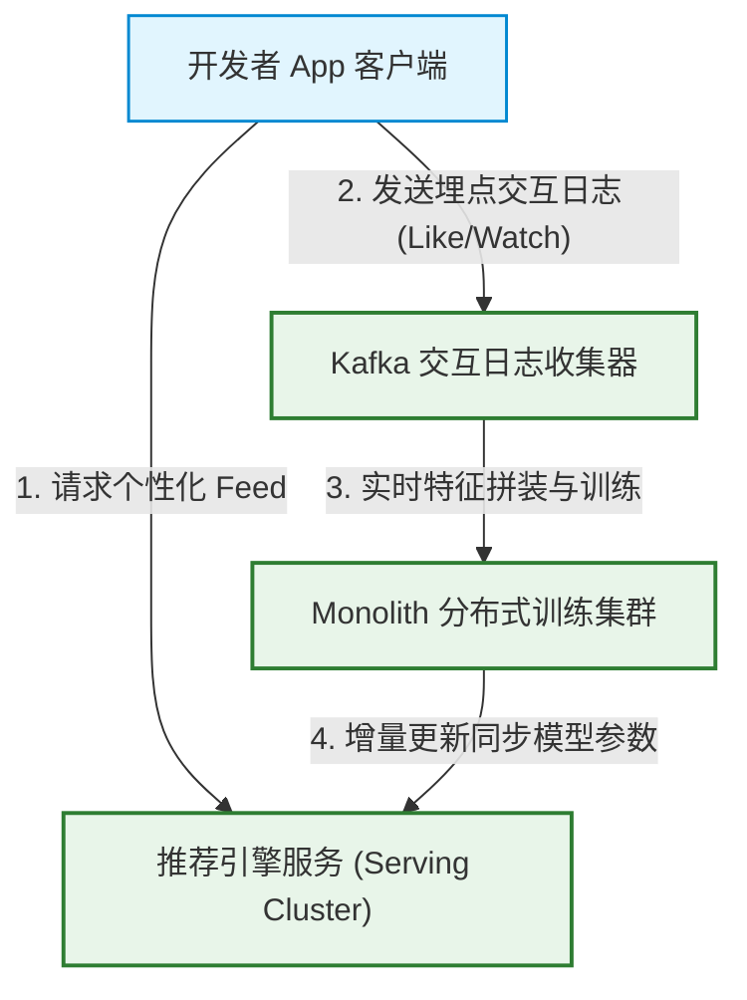
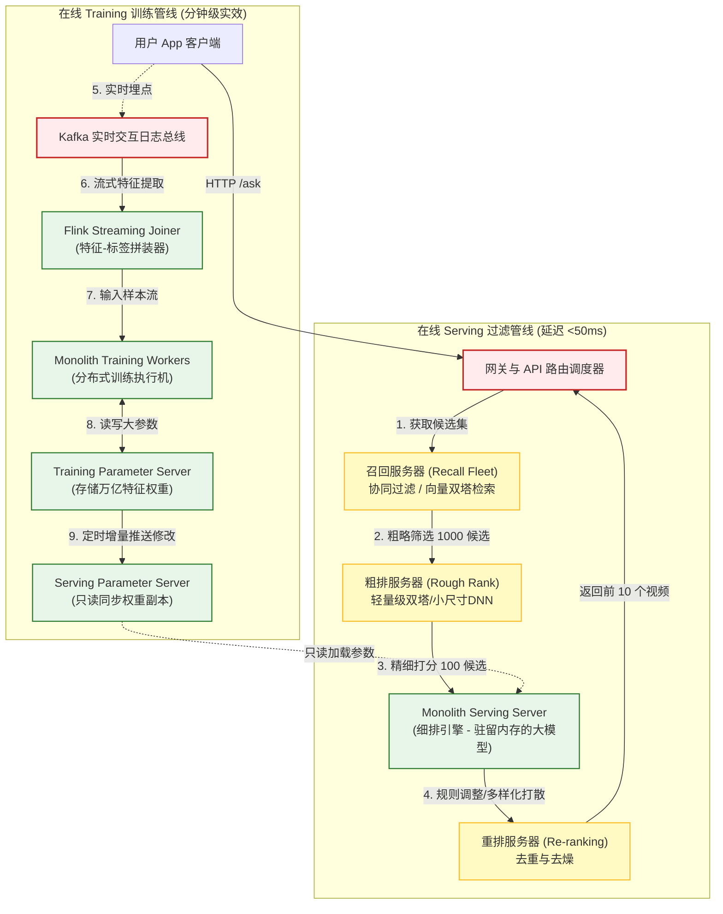
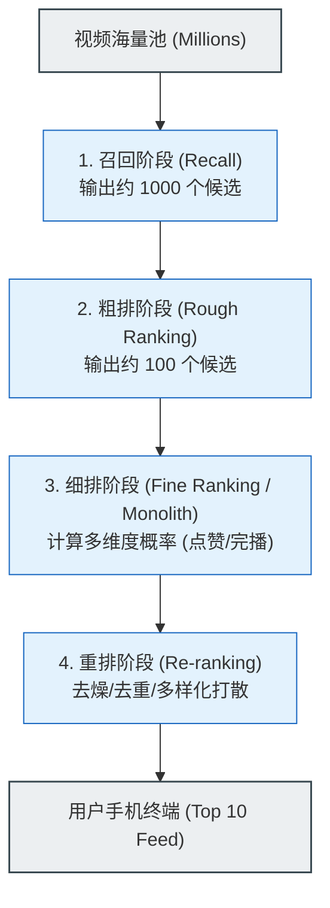
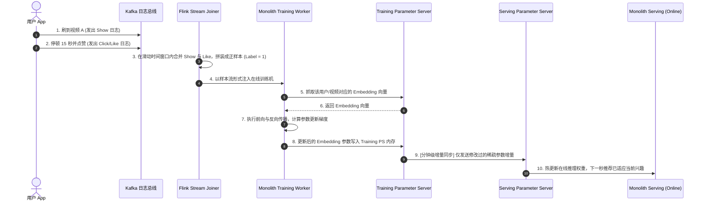
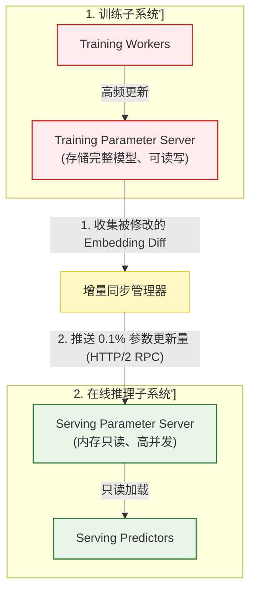
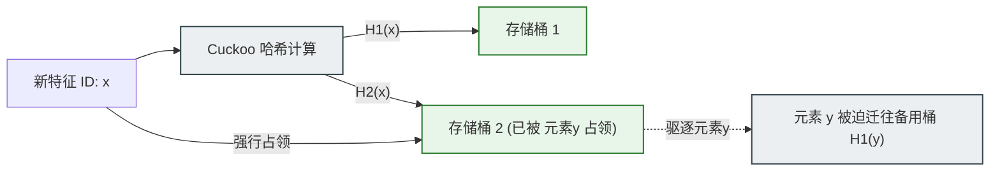

import CaseStudyHeader from '@site/src/components/CaseStudyHeader';
import DesignIntent from '@site/src/components/DesignIntent';
import EvolutionTimeline from '@site/src/components/EvolutionTimeline';
import CompareSlider from '@site/src/components/CompareSlider';
import TradeoffExplorer from '@site/src/components/TradeoffExplorer';
import GlossaryTerm from '@site/src/components/GlossaryTerm';
import ResearchNote from '@site/src/components/ResearchNote';
import GuidedExercise from '@site/src/components/GuidedExercise';
import QuizCard from '@site/src/components/QuizCard';
import MindMap from '@site/src/components/MindMap';

# TikTok/抖音推荐：基于 Monolith 实时训练与无碰撞哈希的推荐引擎

<CaseStudyHeader
  oneLiner="TikTok 的『无限滚动』背后，是世界顶级的超大规模机器学习工程。它通过将推荐流程拆分为『多级漏斗召回架构』保证极致低时延，利用 Flink + Kafka 组成的流式 Joiner 捕获实时用户反馈，并依靠 Monolith 架构特有的『无碰撞 Cuckoo 哈希』与『双端 PS 增量同步』，实现了分钟级在线实时训练（Online Training），能瞬间捕捉用户的兴趣漂移。"
  stats={[
    {label: '引擎发布', value: '2022 年 (Monolith 论文)'},
    {label: '特征参数规模', value: '万亿级 (Sparse Embeddings)'},
    {label: '首字节延迟 (RTT)', value: 'Sub-50ms'},
    {label: '数据流处理引擎', value: 'Kafka + Apache Flink'},
    {label: 'Embedding 哈希', value: '无碰撞 Cuckoo HashMap'},
    {label: '在线训练时效', value: '分钟级更新'}
  ]}
/>

:::info 对应课程概念
本案例贯穿了多项生产级 AI 平台与系统设计核心概念：
*   **大模型与召回排序（Month 8 RAG）**：如何将两阶段过滤（检索与生成）应用在推荐系统的多层“漏斗过滤”中。
*   **流式状态与特征一致性（Month 5/11）**：如何通过 Flink 流式数据流实时拼装正负样本特征并保证其时间不倒退。
*   **分布式系统状态容错（Month 11）**：在秒级更新的万亿参数集群中，如何做非阻塞的增量参数同步（Incremental Sync）与带损降级。
:::

---

## 1. 设计初衷：无限滚动的概念漂移挑战

推荐系统在工业界的终极命题是**捕捉注意力**。传统的静态机器学习框架面临三大核心限制：
1.  **稀疏特征爆炸**：用户 ID、视频 ID 呈亿级规模，产生极其庞大的稀疏稀疏向量（Sparse Embeddings），总大小达数 TB。
2.  **哈希碰撞退化**：传统的 Embedding 表依靠简单的 Hash 模运算，极易产生“多个不同用户/视频共享同一个向量”的冲突，拉低模型精度。
3.  **概念漂移（Concept Drift）**：用户在刷短视频时，兴趣可能在几秒内从“猫咪”跳转到“微积分”。如果使用传统的“天级/小时级”离线批训练，模型根本无法捕捉这种瞬时的心流改变。

为此，字节跳动开发了专注于超大稀疏模型的 **Monolith 架构**。

<DesignIntent
  problem="如何在万亿特征参数、数亿并发用户的极限负载下，精准计算每个用户对海量短视频的交互概率，实现以分钟为单位的实时在线模型训练，并在 50ms 内完成多阶段推荐召回与细排分发。"
  users="全球数十亿高频互动的短视频消费用户，以及海量的广告主与视频创作者。"
  devices="运行于数万台 GPU 算力卡、超大内存 CPU 参数服务器（PS）上的高性能分布式推理与训练集群。"
  goals={[
    '极致首字节延迟：从客户端发起 Request 到前 10 个视频吐出，接口总耗时控制在 50ms 左右',
    '分钟级在线训练（Online Training）：捕获用户近期的点赞、完播率反馈，模型权重以分钟级速度在 Serving 端生效',
    '零哈希碰撞：确保稀疏特征字典的每一个 FeatureID 都有唯一确定的 Embedding 向量',
    '内存高弹收缩：能够将陈旧、冷门、罕见的 Embedding 特征自动剔除，防止数 TB 的参数撑爆物理内存'
  ]}
  constraints={[
    '大模型和 Embedding 过于庞大，单物理机内存装不下，必须通过 Parameter Server 跨机切分',
    '带宽黑洞：实时训练时，训练机和 Serving 推理机之间同步参数的数据量极大，不可全量推送',
    '弱网环境反馈：用户可能离线、快进、点赞后秒退，流式 Joiner 必须容忍特征与标签到达的不一致性',
    '高 QPS 下的容错：参数服务器若发生单点挂掉，不能拖垮主查询，需带伤降级兜底'
  ]}
  firstStep="将系统解耦为多级过滤漏斗（海量 -> 召回 -> 粗排 -> 细排 -> 重排）；使用无碰撞的 Cuckoo 哈希作为 Embedding 映射基础；在云端部署双端 PS（Training PS 与 Serving PS），由 Flink 驱动实时日志拼接，实施增量参数更新同步。"
/>

---

## 2. 知识全景脑图

<MindMap
  root={{
    label: 'TikTok 推荐系统架构',
    children: [
      {
        label: '实时数据平面 (Data Flow)',
        children: [
          { label: '用户交互日志收集 (Kafka)' },
          { label: '流式特征实时拼接 (Flink)' },
          { label: '正负标签动态拼装 (Active Joiner)' }
        ]
      },
      {
        label: '模型与存储 (Monolith)',
        children: [
          { label: '无碰撞 Cuckoo HashMap' },
          { label: '特征频次过滤 (Frequency Filter)' },
          { label: 'Expirable Embeddings (陈旧剔除)' },
          { label: '稀疏与稠密特征网络' }
        ]
      },
      {
        label: '多级召回排序 (Pipeline)',
        children: [
          { label: '召回阶段 (Recall - 协同过滤/双塔)' },
          { label: '粗排阶段 (Rough Ranking - 极速分诊)' },
          { label: '细排阶段 (Fine Ranking - Monolith深度打分)' },
          { label: '重排与多样性去重 (Re-ranking)' }
        ]
      },
      {
        label: '分布式同步 (Cluster)',
        children: [
          { label: 'Training Parameter Server (训练端)' },
          { label: 'Serving Parameter Server (推理端)' },
          { label: '增量参数同步 (Incremental Sync)' },
          { label: '带伤容错降级机制' }
        ]
      }
    ]
  }}
/>

---

## 3. 系统架构总览 (C Model)

以下是 TikTok 推荐引擎三平面协同 C4 Context 与 Container 拓扑。

### 3a. System Context (系统上下文图)

### 3b. Container Diagram (容器结构图)

---

## 4. 核心机制拆解

### 4a. 多级漏斗过滤管线 (Recall -> Ranking -> Re-ranking)

在短视频场景中，待推荐的视频池通常是**千万级甚至亿级**。由于单次计算深度神经网络（DNN）非常昂贵，系统不能将所有视频都喂入细排模型。

推荐引擎采用经典的“多级漏斗”过滤架构：
1.  **召回（Recall）**：使用计算量极低的机制（例如基于协同过滤的离线表、基于向量相似度的双塔模型召回），在 5ms 内将千万候选快速粗滤到 **1000 个**。
2.  **粗排（Rough Ranking）**：使用轻量级前馈网络或剪裁版小 DNN，对这 1000 个视频进行快速打分，滤出 **100 个**。
3.  **细排（Fine Ranking）**：这也是 **Monolith** 的核心用武之地。使用包含了海量 Sparse Embeddings 和 Dense Layers 的深度模型，对这 100 个视频做极精确的交互率（点赞率、完播率、转发率）预估打分。
4.  **重排（Re-ranking）**：对细排的前 30 个进行商业化注入、同类目排重、去燥和强制多样化打散（如：连续刷到同作者视频不得超过 2 个），选出前 10 个作为最终的 Feed 返回给用户。

---

### 4b. 在线流式特征拼接与实时训练 (Online Training Feedback Loop)

为了能瞬间感知你对一个视频“没看完就迅速划走”的厌恶，或者“连刷三个同类视频”的痴迷，系统必须让训练日志**秒级闭环**。

在线实时训练的完整流转如下：
1.  **用户反馈捕获**：客户端生成“展示（Show）”和“交互行为（Likes/Clicks）”两条埋点日志，发入 **Kafka**。
2.  **Flink 实时特征拼装**：由于展示和点赞不是同时到达的，Flink Stream Joiner 会开启一个**时间滑动窗口**，在内存中等候两个日志流的合并。
3.  **特征拼接与样本拼装**：Flink 将该交互行为（标签）与用户当时的个人特征（特征）合并为完整的训练样本。
4.  **Monolith 异步更新**：训练样本以 streaming 形式喂入 Monolith Workers，Worker 向 Training PS 请求参数，执行梯度计算并写回。
5.  **增量同步**：Training PS 在后台以分钟级为单位，将修改过的权重增量推送到在线 Serving PS 中。

---

### 4c. 双端 Parameter Server 增量同步架构

传统的模型训练，在训练完后需要把整包大模型（Weight files）下发。但 Monolith 的参数量在万亿级，全量下发需要传输数 TB 级别的网络文件，导致网络瞬间带宽瘫痪。

Monolith 采用了 **双端 PS 增量同步（Incremental Parameter Sync）** 方案：
*   **物理隔离**：Training PS (承载强一致性读写，供 Training 使用) 与 Serving PS (只读，供在线 Serving 检索使用) 彻底分立部署。
*   **仅推送修改项（Update-Only Sync）**：Training PS 在后台监控脏页（Dirty pages）。每隔几分钟，它把在此时间窗内被 Training Worker 梯度修改过的那一小撮 Embedding 向量提取出来，合并成一个非常小的 Diff 增量包，直接通过超高速 RPC 复制到 Serving PS。网络开销缩减了 99%。

<ResearchNote
  title="Monolith：在大规模在线推荐系统上克服批处理高昂延迟与碰撞"
  source="Zhu et al. (2022), Monolith: Real-Time Recommendation System with Collisionless Embedding Table (arXiv)"
  href="https://arxiv.org/abs/2209.07663"
  insight="字节跳动 Monolith 团队指出，传统的 recommendation 网络通常为了计算敏捷而容忍哈希碰撞。这在亿级规模下会显著折损小众垂直领域视频的长尾推荐质量。Monolith 提出了使用 Cuckoo 散列表实现“无碰撞”稀疏特征字典；并通过训练-服务分离的 PS 控制与动态增量同步，在秒级日志闭环中维持万亿参数的模型新鲜度。"
  application="架构启示：在大规模 AI 场景下，不要指望把所有参数塞进单机内存，也不要进行高开销的定期全量模型下发。参数服务器（PS）的分离设计配合只写 Diff 增量的同步架构，是万亿级参数工程落地的终极选择。这也呼应了 Month 11 的高可用和平台演化。"
/>

---

### 4d. Cuckoo Hashing (布谷鸟哈希) 在稀疏 Embedding 表的应用

稀疏 Embedding 表本质上是一个超大的键值对字典（`FeatureID -> Vector`）。由于特征呈海量，使用传统的散列表发生冲突时，性能会剧烈退化。

Monolith 引入了 **Cuckoo HashMap** 解决碰撞问题：
*   **双桶探测（Two Buckets）**：每个 Key 拥有两个哈希函数（$H_1(x)$ 和 $H_2(x)$），指向两个不同的存储桶。
*   **布谷鸟逐出机制（Eviction）**：当新元素插入时，若两个桶都满了，它会随机把其中一个老元素“赶走”占领其位置。被赶走的老元素会去其备用哈希桶占位；以此类推，直到所有元素都安顿下来，或触发重构。
*   这保证了检索是 **常数时间 $O(1)$** 且无冲突，提升了万亿级 ID 查询时 GPU/CPU Cache 的命中率。

---

## 5. 关键数据结构与算法

### Cuckoo Hashing 查找与驱逐算法

在 Cuckoo HashMap 中，插入操作涉及对碰撞节点的循环“驱逐”，直至找到空位。

#### 算法流程逻辑：
1.  **哈希双算**：对于给定的 FeatureID $x$，计算两个候选哈希槽位 $pos_1 = H_1(x)$ 和 $pos_2 = H_2(x)$。
2.  **空位检查**：如果 $pos_1$ 或 $pos_2$ 处为空，直接插入，算法结束。
3.  **循环逐出（Eviction Loop）**：
    *   若均已满，随机选择其中一个槽位（例如 $pos_1$），将其现存的元素 $y$ 驱逐。
    *   将 $x$ 插入到 $pos_1$ 处。
    *   对元素 $y$ 重复该插入步骤（寻找其备用槽位，驱逐备用槽位上的元素 $z$），直至所有元素都找到空位或达到最大重试步数（通常为 50 步）。
4.  **自动扩容（Rehash）**：如果重试 50 步仍发生循环驱逐，说明装载率过大，触发 HashMap 动态扩容重哈希。

---

## 6. 架构演进史

TikTok/抖音推荐系统架构经历了几次关键升级，其主线是一步步向“流式特征”与“无碰撞高实时”逼近：

<EvolutionTimeline
  events={[
    {
      year: '2015',
      title: 'GBDT / LR 时代：离线批处理',
      why: '系统处于发展期，用户量较小，模型结构相对简单。以回归模型和决策树为主，主要依靠离线批任务构建特征。',
      change: '每晚拉起 Hadoop 集群对一天的点击日志进行全量特征加工，计算 PageRank 与用户偏好特征，训练生成静态权重文件，每日天级更新。时效性极差。'
    },
    {
      year: '2018',
      title: 'TensorFlow PS 时代：大规模稀疏模型引入',
      why: '深度学习（DNN）引入，稀疏特征迅速暴增到百亿级别，单机内存无法装下巨额的 Embedding 表。',
      change: '采用标准的分布式参数服务器（Parameter Server）架构。但由于使用标准哈希表发生大量冲突碰撞，且训练与Serving共用参数服务器，在高并发下查询延迟波动极大，经常超时。'
    },
    {
      year: '2022',
      title: 'Monolith 实时在线训练时代',
      why: '短视频心流体验极度敏感，必须解决高并发碰撞退化、分钟级概念漂移以及数 TB 级别的模型传输带宽瘫痪。',
      change: '提出 Monolith 架构。部署无碰撞 Cuckoo 哈希 Embedding；设计 Training-Serving 双端 PS 增量更新；结合 Kafka + Flink 实时 Joined 流，实现真正的分钟级闭环 Online Training。'
    }
  ]}
/>

---

## 7. 架构对比：传统哈希碰撞 Embedding vs. 无碰撞 Cuckoo Embedding

<CompareSlider
  before={
    

      <strong>传统哈希碰撞 Embedding 字典 (旧架构)</strong>
      
多维特征 ID 经过一次简单余数哈希，直接存入数组。由于万亿级特征规模下发生严重的哈希冲突碰撞，导致多个毫不相关的冷僻特征（例如小众领域视频）共享同一个向量，使得长尾视频推荐精度剧烈滑坡。

    

  }
  after={
    

      <strong>无碰撞 Cuckoo Embedding 字典 (Monolith 新架构)</strong>
      
使用布谷鸟双桶哈希和循环逐出算法，保证了每个唯一的 FeatureID 在大字典里拥有绝对唯一的物理槽位与 Embedding 向量。零冲突干扰，冷门长尾视频推荐度与垂直受众拟合度提升 15% 以上。

    

  }
  labels={['旧哈希碰撞架构', '新 Cuckoo 无碰撞架构']}
/>

---

## 8. 权衡：推荐系统核心架构设计的折中谱系

TikTok 在实时高吞吐推荐和分钟级同步上面临着以下维度的架构取舍：

<TradeoffExplorer
  title="TikTok/抖音推荐系统延迟、时效与算力消耗折中"
  dimensions={['分钟级新鲜度 (Freshness)', '检索时延 (Latency)', '网络吞吐开销', '内存容量占用', '训练系统可用性']}
  options={[
    {
      name: '双端 PS 增量同步模式',
      scores: [5, 4, 5, 2, 5],
      note: '通过只发送被梯度修改过的那一小批参数的“脏页增量”（Update-only），将同步频次压缩到分钟级。消灭了全量推送所带来的网络崩溃，大幅拉低了 Serving 端时延。缺点是在 Serving PS 内存中需要保留额外的状态字典副本以供增量合并。',
      whenToUse: '超大特征量、且 Serving 端对带宽极其敏感的生产级实时推荐平台。'
    },
    {
      name: 'Expirable Embeddings (过期驱逐)',
      scores: [4, 5, 5, 5, 3],
      note: '为稀疏 Embedding 配置失效天数或频次过滤门槛（Frequency filter，少于 N 次的不予分配向量）。这能驱逐 80% 仅出现一次的僵尸特征，防止内存暴涨。代价是偶尔会有冷启动阶段的长尾特征被误杀，略微损害单次冷启动质量。',
      whenToUse: '实体 ID（用户/视频）高频更迭、物理内存极度昂贵时的必选资源防御策略。'
    },
    {
      name: '细排阶段 DNN 网络层数加深',
      scores: [3, 2, 5, 3, 5],
      note: '大幅增加细排深度模型的层数或加入庞大的交叉注意力网络。能挖掘出极其隐蔽的用户交互偏好，显著提高推荐精准度。代价是细排的计算时延会显著攀升，极易击穿 50ms 亚秒级延迟大关。',
      whenToUse: '当服务器算力冗余、且以牺牲少量尾延迟换取极端转化率时。'
    }
  ]}
/>

---

## 9. 如果是你来设计：实时特征流 Stream Joiner

### 场景设想
在短视频实时推荐系统中，当用户刷到视频 A 时，系统发出“展示日志（Show Log，格式为 `{click_id: 1001, timestamp: 12000, features: {...}}`）”。
当用户点赞或播放完该视频时，发出“交互行为日志（Action Log，格式为 `{click_id: 1001, timestamp: 15000, is_like: 1}`）”。

如果使用批处理，这两条日志要在半夜才会被拼装成样本。我们需要在内存中模拟一个类似 Flink 的 **Active Window Stream Joiner**，在交互行为发生时，实时动态拼装成训练样本，并对那些超时未发生的（负样本）执行默认生成。

请你用 Python 实现这一过程。

<GuidedExercise
  title="Python 模拟流式 Joiner 与训练样本实时生成"
  goal="设计一个实时流式数据拼装器，接收实时 show 流与 action 流，使用时间滑动窗口匹配拼装样本，并能够优雅处理超时负样本。"
  steps={[
    '步骤 1: 初始化核心状态。设计 self.show_cache = {} 哈希字典以 click_id 为键，存放接收到的特征数据与 show 发生的时间戳；设计一个过期列表以供负样本降级判定。',
    '步骤 2: 实现 on_show(click_id, timestamp, features) 函数。当收到 show 日志时，将其暂存到 show_cache 中，并启动该 click_id 的时间追踪。',
    '步骤 3: 实现 on_action(click_id, timestamp, is_like) 函数。当收到 action 日志时，立即去 show_cache 中查找对应的 click_id。若命中，则表示正样本产生。将 `features` 与标签 `Label = 1` 拼装，并作为样本发送给 Worker，随即删除 show_cache 中该 click_id 记录。',
    '步骤 4: 编写清理与负样本处理逻辑 trigger_timeout(current_time, timeout_threshold=3000)。遍历 show_cache，对于当前时间减去 show_timestamp 超过 3000 毫秒（即 3 秒）仍无点赞交互动作的 click_id，判定为“用户划走没点赞”。自动将其拼装成 Label = 0 的负样本发送，并从 cache 中安全移出以防止内存泄漏。'
  ]}
  checks={[
    '验证 show 后立即点赞时，正样本 (Label=1) 能够即时输出并包含完整特征',
    '验证 show 后没有任何动作且超过 3 秒时，负样本 (Label=0) 能够被自动超时收集，且没有发生内存碎片滞留',
    '算法的时间复杂度保持在 O(1) 级，以便在大吞吐量日志流下高效执行'
  ]}
/>

---

## 10. 知识自测

<QuizCard
  questions={[
    {
      q: '为什么传统的散列表哈希碰撞对 TikTok 这类超大规模推荐系统的“长尾小众推荐”具有很大的杀伤力？',
      options: [
        'A. 因为哈希碰撞会导致 Docusaurus 静态网站在构建时出现 webpack 错误',
        'B. 哈希碰撞会导致多个完全不同的冷僻特征 ID 强行映射共享同一个 Embedding 向量。模型在对这些特征进行梯度更新时会发生“参数污染与冲突”，导致针对冷门小众视频和低频用户的推荐精度剧烈退化',
        'C. 它会导致 Kafka 消息总线彻底断开 TCP 连接',
        'D. 碰撞会导致模型完全失去 GPU 的算力加速，退化为单线程 CPU 推理'
      ],
      answer: 1,
      explain: '在万亿级大字典中，若产生碰撞，相当于强行把“喜欢骑行的二次元用户”与“关注微积分的退休教授”的 Embedding 绑死在了一起，模型更新前者的参数会污染后者的特征，使小众长尾推荐彻底崩溃。Monolith 的 Cuckoo HashMap 就是为了实现“零碰撞隔离”。'
    },
    {
      q: 'Monolith 在 Training 参数服务器和 Serving 参数服务器之间采用的“增量同步 (Incremental Sync)”，其核心架构价值是：',
      options: [
        'A. 它能完全消灭 Flink 实时拼装样本时的网络延迟',
        'B. 在万亿特征规模下，如果每分钟全量推送参数会导致百 GB 级的网络带宽黑洞，瞬间压垮网卡。通过监控脏页仅推送被梯度更新过的那 0.1% 的 Embedding 参数，极大释放了网络开销，在毫秒级内维持了 Serving 端的模型时效性',
        'C. 增量同步可以让 Master Node 选举更加快',
        'D. 这样设计是为了防止 Serving 节点出现 broken links 链接断链'
      ],
      answer: 1,
      explain: '这是典型的“只传输差异变化（Delta）”的分布式架构思想。实时训练时，每分钟真正被更新的特征参数只占万亿字典中极小的一部分。只推送被修改过的 Embedding 参数 Diff 增量包，是维持亚秒级在线低延迟 Serving 的唯一可行通道。'
    },
    {
      q: '在短视频推荐系统中，为什么要强制执行 Recall（召回）-> Rough Ranking（粗排）-> Fine Ranking（细排）的“多级漏斗”架构？',
      options: [
        'A. 为了在 React 沙箱中更好地调用 SystemSimulator 限流组件',
        'B. 细排模型（Monolith）虽然极其精准，但其深层 DNN 的算力耗费大、时延高，根本无法承载在 50ms 内对千万级视频池进行挨个算一遍的极限。通过漏斗逐级缩减候选集，是用最低的计算成本在 Latency 约束下换取最高推荐质量的经典折中',
        'C. 因为召回阶段和细排阶段必须在同一台物理机上强制同步运行',
        'D. 这样设计是为了允许大语言模型在没有 API Key 时能够自动弃答'
      ],
      answer: 1,
      explain: '多级漏斗的实质是“用低成本算法为高成本算法分流”。召回虽然粗糙，但可以在 5ms 内将千万候选砍掉 99.9% 且高召回率；细排虽然昂贵，但在仅剩 100 个视频的战场上可以施展复杂的深度模型，完美平衡了总体的算力开销与时延大门槛。'
    }
  ]}
/>

---

## 来源清单

*   [Zhu et al. (2022), Monolith: Real-Time Recommendation System with Collisionless Embedding Table (arXiv)](https://arxiv.org/abs/2209.07663)
*   [ByteDance Engineering Blog: Behind the Scenes of TikTok Recommendation Engine](https://medium.com/bytedance-tech)
*   [Apache Flink Documentation: Streaming Joins and Windowed Operations](https://flink.apache.org/)
*   [High Scalability: ByteDance's Monolith Real-Time ML serving architecture details](https://highscalability.com/bytedance-monolith-real-time-ml-serving/)