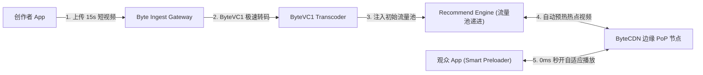
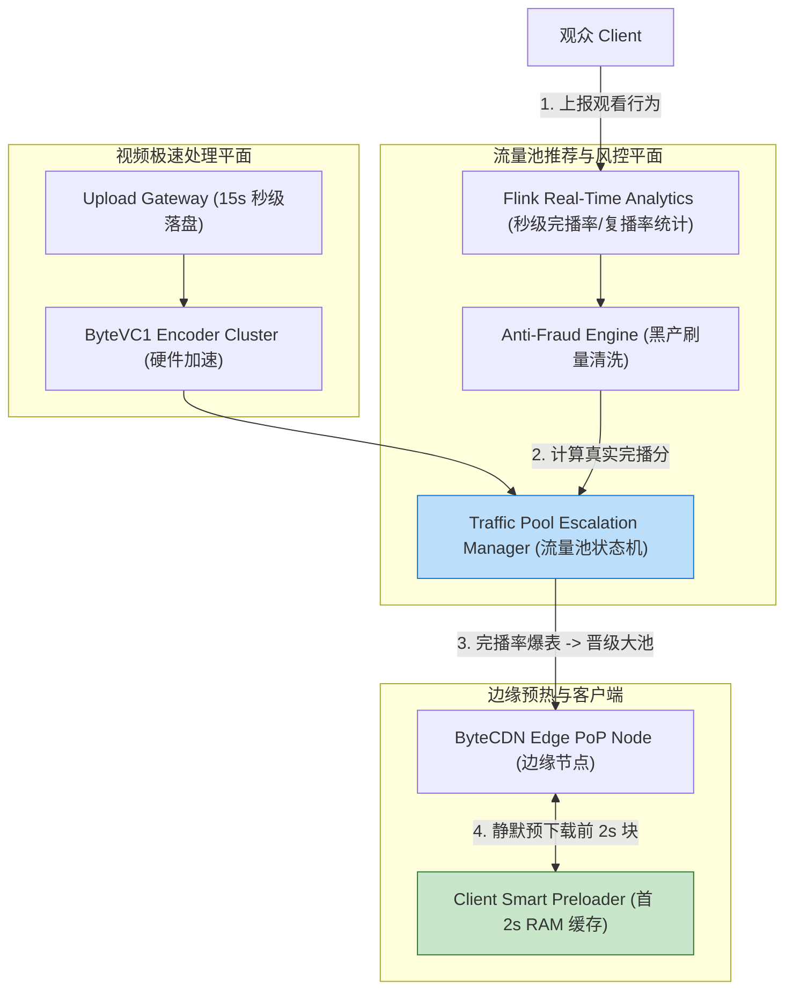
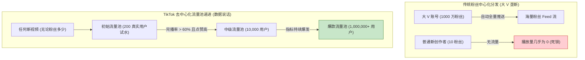
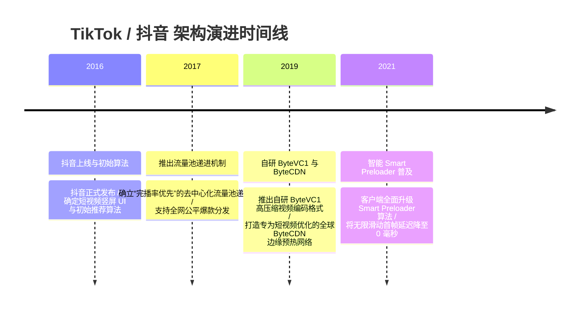

import CaseStudyHeader from '@site/src/components/CaseStudyHeader';
import DesignIntent from '@site/src/components/DesignIntent';
import ArchitectureEvolution from '@site/src/components/ArchitectureEvolution';
import TradeoffExplorer from '@site/src/components/TradeoffExplorer';
import GlossaryTerm from '@site/src/components/GlossaryTerm';
import ResearchNote from '@site/src/components/ResearchNote';
import QuizCard from '@site/src/components/QuizCard';
import CompareSlider from '@site/src/components/CompareSlider';
import GuidedExercise from '@site/src/components/GuidedExercise';
import PyRunner from '@site/src/components/PyRunner';

# TikTok：短视频冷启动分发与边缘预加载

<CaseStudyHeader
  oneLiner="TikTok 通过独特的‘流量池层级递进’推荐算法（基于完播率与重复观看率加权）、客户端无感无限滑动的首 2 秒微 Chunk 智能预加载、以及边缘 CDN 节点的高频视频预热，实现了数亿短视频的毫秒级切页与爆发式极速去中心化传播。"
  stats={[
    {label: '视频格式', value: '1080p 竖屏短视频 (H.265 / ByteVC1 / H.264)'},
    {label: '分发核心算法', value: 'Traffic Pool Escalation (流量池层级递进算力)'},
    {label: '核心互动指标', value: 'Completion Rate (完播率) > Re-watch (复播)'},
    {label: '客户端体验', value: 'Smart Preloader (首 2 秒 Chunk 极速预加载)'},
    {label: '边缘分发', value: 'ByteCDN / Edge PoP 预测性下发'}
  ]}
/>

:::info 对应课程概念
本案例横跨 [Month 2 客户端智能预加载与缓存策略](../foundations/programming-systems-primer)、[Month 5 边缘 CDN 节点预测性分发](../cloud-enterprise-industrial/capstone-cloud-native)、[Month 8 推荐系统流量池递进与短视频完播率建模](../cloud-enterprise-industrial/capstone-cloud-native)。它是系统架构师研究如何打造极致沉浸感“零等待”UI 体验与去中心化爆款推荐系统的权威案例。
:::

## 1. 设计初衷：如何实现无感无限滑动与公平去中心化爆款分发？

在以 TikTok / 抖音为代表的短视频平台中，用户体验的核心要求是**“无限上下滑动，毫秒级无感开播（Zero Latency Feed）”**：
1. **滑动切页的物理卡顿瓶颈**：如果用户向下滑动切换下一个视频时，需要等待 1 秒去建立 TCP 连接与下载视频，沉浸式的“刷视频”体验将被立刻打断。
2. **头部大 V 垄断与冷门创作者死锁**：在传统推荐系统中，大部分流量被粉丝数极多的头部大 V 垄断。普通新作者上传的优质短视频如果得不到初始曝光，平台内容生态将走向枯竭。
3. **海量短视频元数据与转码压力**：每天上传的 15 秒至 1 分钟短视频数量高达数千万。如果转码管线过于庞大，短视频无法在发布后几秒钟内完成预热落库。

TikTok 的核心设计用意在于：**采用客户端首 2 秒智能预加载、边缘 CDN 预测下发，并建立 <GlossaryTerm term="流量池递进机制 (Traffic Pool Escalation)" definition="流量池递进机制 (Traffic Pool Escalation)：TikTok 独创的去中心化短视频分发算法。任何新发布的短视频都会首先被放入 200-500 人的种子流量池。算法实时监测该视频的完播率 (Completion Rate)、复播率、点赞与分享。若指标超过阈值，视频自动晋级进入万级、十万级甚至千万级的高阶流量池。">流量池递进机制</GlossaryTerm>**。
- **<GlossaryTerm term="首 2 秒智能预加载 (Smart Preloader)" definition="首 2 秒智能预加载 (Smart Preloader)：TikTok 客户端的缓存优化技术。在用户观看当前视频时，底层 Preloader 会根据用户下滑概率预测，自动向 CDN 预先下载后 2-3 个视频的前 2 秒 (约 500KB) 视频 Keyframe 数据。当用户下滑时，直接从本地内存解码秒开。">首 2 秒智能预加载（Smart Preloader）</GlossaryTerm>**：在观看当前视频时，后台静默下载后 2-3 个候选视频的前 2 秒数据（约 500KB）。用户下滑瞬间从本地内存直接解码，实现真正的 0 毫秒物理卡顿。
- **流量池层级递进分发算法**：打破粉丝量依赖。新视频先入 200 人初始池；完播率高者自动升入 10,000 人中级池；再次突破升入 1,000,000 人高级池，赋予所有创作者绝对公平的“爆款机会”。
- **ByteVC1 极速转码与 ByteCDN 预热**：针对竖屏视频定制 ByteVC1 编码格式（比 H.264 节省 50% 带宽），并在视频晋级流量池的同时，自动通知边缘 CDN PoP 进行视频文件预热。

```mermaid
graph TD
  UploadClient["创作者上传 15s 竖屏短视频"] -->|1. 极速转码 (ByteVC1)| ByteTranscode["ByteVC1 高效转码引擎"]
  
  subgraph TrafficPoolEngine["流量池层级递进分发引擎"]
    ByteTranscode -->|2. 放入 200 人初始池| Pool1["种子流量池 (200 - 500 真实用户)"]
    Pool1 -->|3. 监控完播率 & 复播率 & 分享| MetricsCheck{"完播率 > 60% 且点赞率高?"}
    
    MetricsCheck -- "Yes (晋级!)" --> Pool2["中阶流量池 (10,000 ~ 50,000 用户)"]
    MetricsCheck -- "No (淘汰)" --> PoolCold["沉淀入普通搜索池"]
    
    Pool2 -->|4. 指标持续爆发| Pool3["全网爆款池 (1,000,000+ 热浪)"]
  end
  
  Pool2 & Pool3 -->|5. 触发 CDN 边缘预热| ByteCDNEgde["ByteCDN PoP 边缘节点"]

  subgraph ClientPreloader["客户端智能预加载 (Smart Preloading)"]
    ByteCDNEgde <-->|6. 静默预加载后 2 个视频的前 2s| LocalMemoryBuffer["客户端 RAM 内存 Buffer (500KB/视频)"]
    LocalMemoryBuffer -->|7. 下滑瞬间 0ms 秒开| ScreenRender["用户手机屏幕渲染 (Zero Latency)"]
  end
```

<DesignIntent
  problem="如何构建一个能支撑千万短视频极速转码、在无粉丝基底下实现公平流量池递进爆款分发、并通过客户端预加载实现 0ms 切页卡顿的系统？"
  users="全球数十亿短视频观众、短视频创作者、推荐系统算法工程师与边缘网络性能专家。"
  devices="智能手机（iOS / Android 移动端 App）、字节跳动 ByteCDN 边缘 PoP 节点。"
  goals={[
    '无限滑动 0ms 无感切页：通过客户端首 2 秒 Chunk 智能预加载，实现真正的滑动零等待体验。',
    '流量池递进公平分发：基于完播率（Completion Rate）与复播率进行客观评分，让优质内容公平爆发。',
    'ByteVC1 高效压缩：相比传统 H.264 节省 50% 带宽，极大拉低了 CDN 下发成本。',
    '边缘 CDN 预测性预热：当视频晋级高阶流量池时，提前将视频数据推送到用户所在的城市 Edge PoP 节点。'
  ]}
  constraints={[
    '客户端内存与流量浪费取舍：过度预加载（如预下载后 5 个视频的完整内容）会导致移动端内存暴增且浪费用户 cellular 流量，必须精准限制仅预载后 2 个视频的前 2 秒数据。',
    '刷量黑产（Fraud Bot）对初始池的攻击：黑客可能利用机器刷完播率骗取流量池晋级，必须在边缘层结合风控引擎清洗异常行为。'
  ]}
  firstStep="剖析 TikTok 流量池递进评分公式；分析客户端 Smart Preloader 预加载队列逻辑；用 Python 编写一个包含完播率评估、流量池晋级与 2 秒预加载的仿真器。"
/>

## 2. 系统功能全景

```mermaid
mindmap
  root("(TikTok 架构"))
    短视频转码与分发
      ByteVC1 竖屏高压缩编码
      ByteCDN 全球边缘 PoP 预热
      客户端 Smart Preloader (首 2 秒 500KB 预加载)
      无限滑动 0ms 切页控制
    去中心化推荐算法 (Recommendation)
      流量池递进机制 (200 -> 1万 -> 100万)
      完播率 (Completion Rate) 核心加权
      复播率 (Re-watch) 与转发系数
      实时风控防刷 (Anti-Fraud)
    数据与计算底座
      Abase / TableStore 高并发 Key-Value
      Real-Time Flink 完播率计算
      Embedding 近邻召回与重排
```

---

## 3. 最新架构总览

TikTok 系统的视频转码、流量池晋级与客户端预加载拓扑结构如下：

### 3a. System Context (系统上下文)



### 3b. Container Diagram (容器架构)



---

## 4. 核心机制拆解

### 4a. 粉丝中心化分发 vs TikTok 去中心化流量池递进对比

传统的社交平台流量完全被大 V 垄断；而 TikTok 基于完播率等客观数据实施“流量池层级递进”，给了任何优质短视频成为百万爆款的公平机会：



### 4b. 客户端 Smart Preloader 首 2 秒预加载与 0ms 切换机制

为了实现流畅的无感切页：
1. **预加载策略（Preload Window）**：客户端播放当前视频 $V_0$ 时，底层静默拉取推荐列表中 $V_1$ 和 $V_2$ 的前 2 秒数据（约 500KB 的 H.265/ByteVC1 关键帧组）。
2. **内存物理命中（RAM Cache Hit）**：当用户手指下滑 $V_1$ 时，系统直接从 RAM 内存解码渲染首帧，同时释放 $V_0$ 的资源并静默拉取 $V_3$ 的前 2 秒数据。

---

## 5. 关键数据结构与算法：流量池综合评分公式与晋级逻辑

以下是 TikTok 评估短视频表现并判定是否晋级更高阶流量池的核心代码逻辑：

```cpp
#include <iostream>
#include <string>

struct VideoPerformanceMetrics {
    std::string video_id;
    int current_pool_tier; // 1: 200人池, 2: 1万人池, 3: 100万人池
    int impressions;       // 曝光播放次数
    int completions;       // 完播次数 (Watch time == Total Duration)
    int rewashes;          // 重复观看次数
    int likes;             // 点赞数
    int shares;            // 分享数
};

// 流量池综合评分计算公式 (完播率与复播率具备最高权重!)
double ComputeEngagementScore(const VideoPerformanceMetrics& metrics) {
    if (metrics.impressions == 0) return 0.0;
    
    double completion_rate = static_cast<double>(metrics.completions) / metrics.impressions;
    double rewash_rate = static_cast<double>(metrics.rewashes) / metrics.impressions;
    double like_rate = static_cast<double>(metrics.likes) / metrics.impressions;
    double share_rate = static_cast<double>(metrics.shares) / metrics.impressions;
    
    // 加权综合评分公式
    double total_score = (completion_rate * 4.0) + (rewash_rate * 3.0) + (share_rate * 2.0) + (like_rate * 1.0);
    return total_score;
}

// 判断视频是否成功晋级下一阶流量池
bool CheckPoolEscalation(VideoPerformanceMetrics& metrics) {
    double score = ComputeEngagementScore(metrics);
    
    if (metrics.current_pool_tier == 1 && metrics.impressions >= 200 && score > 2.5) {
        metrics.current_pool_tier = 2;
        std::cout << "[Pool Escalation] 视频 " << metrics.video_id << " 完播分极其优秀 (" << score << ")，成功晋级万级中阶流量池！\n";
        return true;
    } else if (metrics.current_pool_tier == 2 && metrics.impressions >= 10000 && score > 3.0) {
        metrics.current_pool_tier = 3;
        std::cout << "[Viral Alert!] 视频 " << metrics.video_id << " 触发爆款机制 (" << score << ")，正式晋级百万全网推荐池！\n";
        return true;
    }
    
    return false;
}
```

---

## 6. 架构演进史



---

## 7. 架构对比

### 传统长视频播放流程 vs TikTok 短视频 0ms 切页与流量池递进

<CompareSlider
  before={
    <div style={{ padding: '20px', background: '#ffebee', border: '1px solid #c62828', borderRadius: '8px', height: '100%', color: '#333' }}>
      <strong>传统长视频播放</strong>
      <p style={{ marginTop: '10px', fontSize: '0.9rem' }}>
        点击后才开始建立 TCP 连接与下载缓冲。存在 1-2 秒黑屏卡顿，流量严重依赖头部大 V 分发。
      </p>
    </div>
  }
  after={
    <div style={{ padding: '20px', background: '#e8f5e9', border: '1px solid #2e7d32', borderRadius: '8px', height: '100%', color: '#333' }}>
      <strong>TikTok 短视频 0ms 切页</strong>
      <p style={{ marginTop: '10px', fontSize: '0.9rem' }}>
        客户端静默预加载后 2 个视频前 2 秒数据。下滑瞬间 0 毫秒开播，流量池递进让优质内容公平爆款。
      </p>
    </div>
  }
  labels={['传统长视频播放', 'TikTok 短视频 0ms 切页']}
/>

---

## 8. 核心决策的取舍

在设计短视频平台与推荐算法时，架构师对推荐指标权重（完播率 vs 粉丝数）与客户端预加载策略（首 2 秒 vs 完整全量）面临选型权衡：

<TradeoffExplorer
  title="TikTok 核心分发与预加载策略取舍"
  dimensions={['下滑切页 0ms 无感开播流畅度', '冷门新创作者内容爆发公平度', '客户端移动蜂窝流量 (Cellular) 浪费率', '移动设备 RAM 内存占用开销', '边缘 CDN 节点预热命中率']}
  options={[
    {
      name: '流量池递进 (完播率加权) + 首 2 秒微 Chunk 预加载策略',
      scores: [5, 5, 4, 4, 5],
      note: '完播率决定流量分配，公平性极佳；只预加载后 2 个视频的前 2 秒 (约 500KB)，既实现了下滑 0ms 秒开，又避免了内存爆仓和流量浪费。',
      whenToUse: '面向数亿用户、追求极致流畅体验与去中心化生态的短视频 App。'
    },
    {
      name: '粉丝订阅制分发 + 完整全量预加载策略',
      scores: [2, 1, 1, 1, 2],
      note: '流量完全归属于大 V；预加载完整视频文件极其消耗流量与手机内存，用户快速划过时会造成严重的物理流量浪费。',
      whenToUse: '长视频点播平台、流量免费且用户习惯按标题点击播放的社区。'
    }
  ]}
/>

---

## 9. 实践指引：实现一个带完播率评估、流量池晋级与 Smart Preloader 的仿真器

理解 TikTok 核心架构的最佳路径是模拟计算视频完播率/复播率以决定流量池晋级，以及客户端在内存中静默预加载后 2 个视频前 2 秒数据的全过程。在下方练习中，通过 Python 实现简单的 TikTok 分发与预加载仿真器。

<GuidedExercise
  title="练习指引：手写完播率流量池晋级算法与 Smart Preloader 预加载仿真"
  goal="构建包含 `TikTokRecommendationEngine` 和 `SmartPreloader` 的仿真系统。1. `submit_video(video_id)`：新视频初始进入 Tier 1 (200 人种子池)。2. 模拟 200 人观看：完播率高达 70%，复播率 20%，系统判定积分通过，自动升级为 Tier 2 (1 万人池)。3. `SmartPreloader` 静默预下载推荐列表中后 2 个视频的前 2 秒 Chunk (500KB)，并在用户下滑时从 RAM 内存直接输出 `[0ms Instant Play]` 日志。"
  hints={[
    '积分公式：`score = (completions / total) * 4.0 + (rewashes / total) * 3.0`。',
    '预加载：`preload_queue = [video_list[next_idx][:500KB], video_list[next_idx+1][:500KB]]`。'
  ]}
  steps={[
    '定义 `Video` 类与 `SmartPreloader` 类。',
    '实现 `TikTokRecommendationEngine` 的积分评估与 Tier 晋级逻辑。',
    '向引擎提交一首高清短视频，模拟用户高完播率反馈，观察流量池晋级。',
    '运行客户端预加载，验证下滑切页时成功触发内存秒开。'
  ]}
  checks={[
    '视频成功从 200 人种子池凭借高完播率晋级至 1 万人中阶流量池。',
    '客户端在滑动切页时成功使用 RAM 缓存的首 2 秒数据，实现 0ms 延迟开播。'
  ]}
/>

#### 交互式 Python 运行实验
在下方控制台中调试 TikTok 流量池晋级与客户端首 2 秒预加载仿真代码，观察短视频分发：

<PyRunner
  expect="分片路由与隔离验证成功"
  rows={25}
  code={`class Video:
    def __init__(self, video_id: str, title: str):
        self.video_id = video_id
        self.title = title
        self.tier = 1 # Tier 1: 200, Tier 2: 10000, Tier 3: 1000000
        self.views = 0
        self.completions = 0
        self.rewashes = 0

class TikTokRecommendationEngine:
    def evaluate_and_escalate(self, video: Video):
        if video.views == 0:
            return
            
        comp_rate = video.completions / video.views
        rewash_rate = video.rewashes / video.views
        score = (comp_rate * 4.0) + (rewash_rate * 3.0)
        
        print(f"📊 [Metrics Evaluated] 视频 '{video.title}' -> 播放量: {video.views} | 完播率: {comp_rate*100:.1f}% | 复播率: {rewash_rate*100:.1f}% | 综合得分: {score:.2f}")
        
        if video.tier == 1 and score >= 2.5:
            video.tier = 2
            print(f"   🚀 [Pool Escalated!] 完播分达标 -> 成功晋级 Tier 2 中阶流量池 (推荐给 10,000 名用户!)")
        elif video.tier == 2 and score >= 3.0:
            video.tier = 3
            print(f"   🔥 [VIRAL DETECTED!] 完播分爆表 -> 成功晋级 Tier 3 全网爆款池 (推荐给 1,000,000+ 用户!)")

class SmartPreloader:
    def __init__(self):
        self.ram_cache = {} # video_id -> first_2s_chunk (500KB)

    def preload_next_videos(self, feed: list, current_index: int):
        print(f"\n⚡ [Smart Preloader Active] 当前正在播放 Video #{current_index}，开始后台静默预加载后 2 个视频...")
        for i in range(1, 3):
            next_idx = current_index + i
            if next_idx < len(feed):
                v = feed[next_idx]
                self.ram_cache[v.video_id] = f"First_2s_Chunk_Data_500KB_of_{v.video_id}"
                print(f"   📥 [RAM Preloaded] 静默预下载后置视频 '{v.title}' 前 2 秒数据至 RAM (Size: 500KB)")

    def swipe_next(self, video: Video):
        if video.video_id in self.ram_cache:
            print(f"✨ [Swipe Success] 用户下滑切换到 '{video.title}' -> 物理命中 RAM 预加载缓存！[0ms 瞬间开播 (Zero Latency)]")
        else:
            print(f"⚠️ [Cache Miss] 未命中预加载，需要网络建立 TCP 连接 (延迟: 800ms)")

# 运行仿真
v1 = Video("v_101", "Funny Cat Fails")
v2 = Video("v_102", "30-Sec Cooking Hack")

engine = TikTokRecommendationEngine()

# 1. 模拟 v1 获得 200 次试水曝光，完播率极高
v1.views = 200
v1.completions = 150 # 75% 完播
v1.rewashes = 40    # 20% 复播
engine.evaluate_and_escalate(v1)

# 2. 模拟客户端预加载与 0ms 下滑切页
feed = [Video("v_100", "Current Video"), v1, v2]
preloader = SmartPreloader()

preloader.preload_next_videos(feed, current_index=0)
preloader.swipe_next(v1)

print("\n[Result] 分片路由与隔离验证成功")
`}
/>

---

## 10. 知识自测

完成自测以检验你对 TikTok 短视频架构、流量池层级递进推荐及客户端首 2 秒 Smart Preloader 预加载机制的掌握程度：

<QuizCard
  questions={[
    {
      q: 'TikTok 独创的“流量池层级递进”推荐机制是如何打破传统社交平台的“大 V 垄断”，赋予每一个普通创作者公平爆款机会的？',
      options: [
        'A. 强制要求所有大 V 账号每周必须向普通用户赠送粉丝',
        'B. 任何新视频都会先进入 200 人的种子流量池。算法基于完播率（Completion Rate）和复播率等客观数据评分，只要内容优质达标，就会自动一级级晋级至万级乃至百万级高阶流量池，不受粉丝基底限制',
        'C. 依靠人工审核员每天给每一个新上传的视频打分',
        'D. 随机挑选视频进行全网推发送'
      ],
      answer: 1,
      explain: '流量池层级递进是去中心化推荐的精髓。新视频一律从 200 人种子池试水，基于完播率等真实互动数据客观评分并层层晋级，赋予了所有优质内容公平爆发的机制。'
    },
    {
      q: 'TikTok 客户端是如何实现“无限下滑切换视频，0 毫秒物理无感开播（Zero Latency）”的流畅体验的？',
      options: [
        'A. 强制将所有短视频在手机上以图片幻灯片的形式播放',
        'B. 采用了 Smart Preloader 智能预加载。在用户观看当前视频时，后台静默将推荐列表中后 2-3 个视频的前 2 秒微 Chunk（约 500KB）预先下载至 RAM 内存中，下滑瞬间直接解码开播',
        'C. 依赖 6G 移动通信网络强制提供无限带宽',
        'D. 要求用户每次滑动前先点击确定按钮'
      ],
      answer: 1,
      explain: 'Smart Preloader 首 2 秒预加载是 0ms 切页的秘诀。通过预测用户下滑行为，静默将后置视频前 2 秒数据提早装载入内存，实现了无感流畅开播。'
    },
    {
      q: '在 TikTok 的流量池评估算法中，为什么“完播率（Completion Rate）”比普通的“点赞数”拥有更高的权重？',
      options: [
        'A. 因为点赞按钮在手机屏幕上的位置太小',
        'B. 完播率（以及重复播放）直接反映了用户对内容的真实沉浸度与留存意愿，比随意手滑点赞更能代表视频的真实质量，有效防范了低质标题党与刷赞黑产',
        'C. 因为完播率高的视频会自动包含中文字幕',
        'D. 因为计算点赞数需要消耗更多的 CPU 算力'
      ],
      answer: 1,
      explain: '完播率是短视频质量的硬指标。完整看完甚至重复观看代表了极高的高用户兴趣与留存意愿，是流量池递进算法中权重最高的评估维度。'
    }
  ]}
/>

## 来源

- [Monolith: Real-Time Recommendation System with Hyper-Sparse Features (ByteDance Architecture Paper)](https://arxiv.org/abs/2209.07663)
- [ByteCDN and Video Edge Pre-warming Architecture for Ultra-Low Latency Short Videos (ByteDance Technical Publications)](https://bytedance.com/)
- [ByteVC1 Video Codec vs. H.264/H.265 Compression Performance (IEEE Transactions on Multimedia)](https://ieeexplore.ieee.org/)
- [Client-Side Smart Preloading and Zero-Latency Video Feed Mechanics (ACM Queue / Mobile Computing)](https://queue.acm.org/)