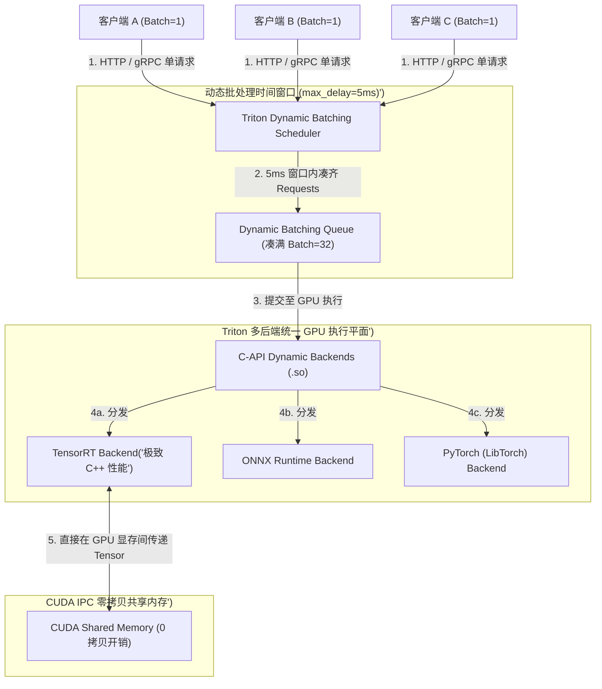
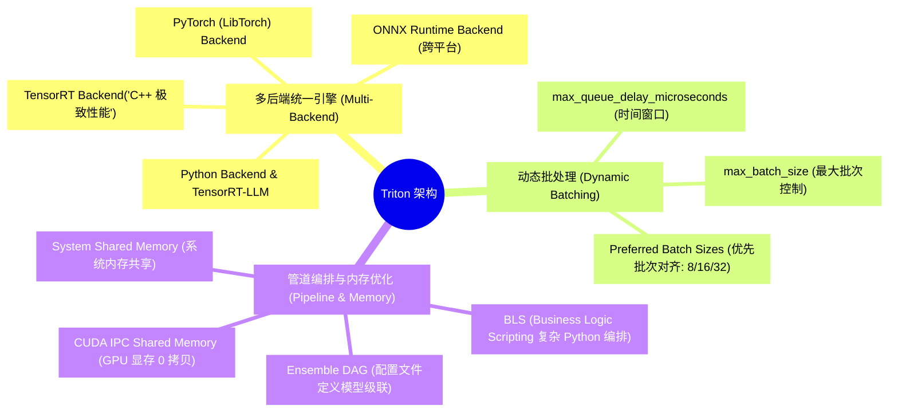
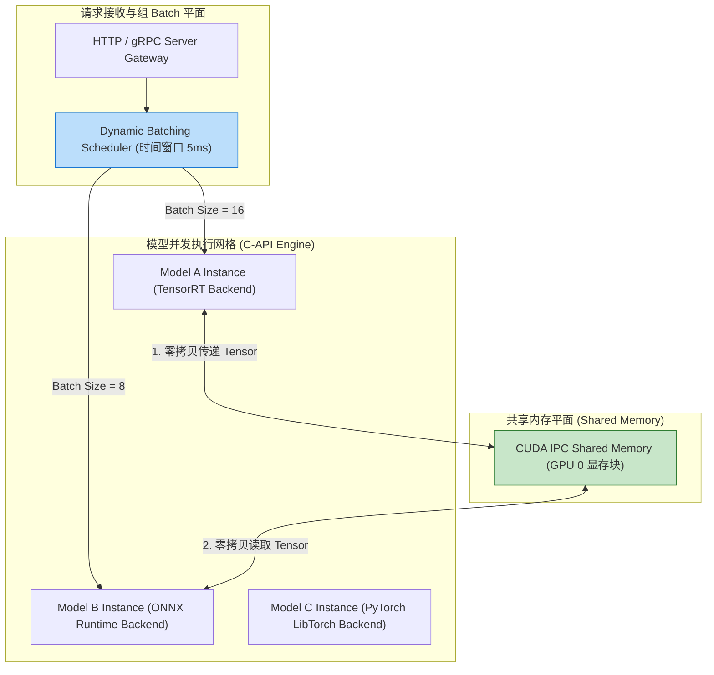
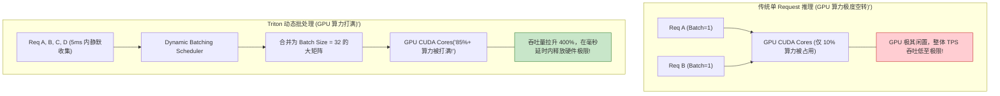
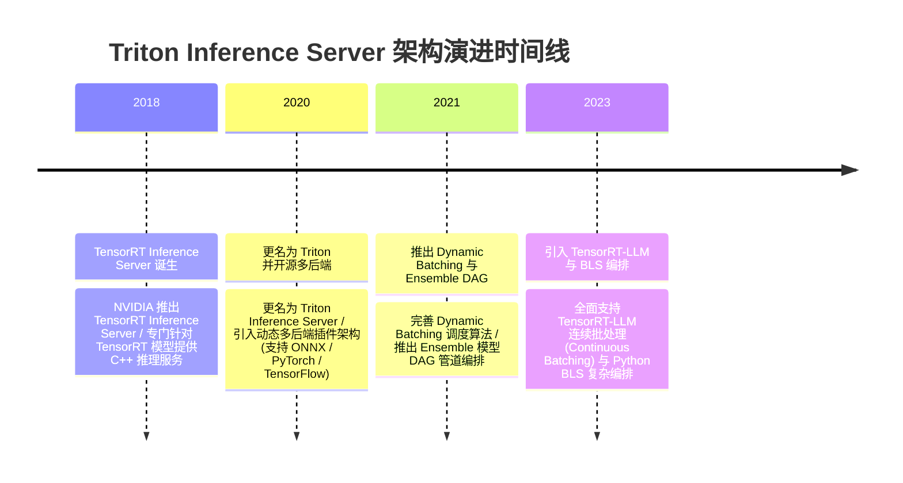

import CaseStudyHeader from '@site/src/components/CaseStudyHeader';
import DesignIntent from '@site/src/components/DesignIntent';
import ArchitectureEvolution from '@site/src/components/ArchitectureEvolution';
import TradeoffExplorer from '@site/src/components/TradeoffExplorer';
import GlossaryTerm from '@site/src/components/GlossaryTerm';
import ResearchNote from '@site/src/components/ResearchNote';
import QuizCard from '@site/src/components/QuizCard';
import CompareSlider from '@site/src/components/CompareSlider';
import GuidedExercise from '@site/src/components/GuidedExercise';
import PyRunner from '@site/src/components/PyRunner';

# Triton Inference Server：多框架统一推理与动态批处理

<CaseStudyHeader
  oneLiner="NVIDIA Triton Inference Server 针对异构 AI 模型部署零碎、GPU 利用率低下及推理延迟不均的瓶颈，打破了传统单一框架服务限制，推出了‘多后端统一推理引擎’，结合基于时间窗口的动态批处理 (Dynamic Batching) 与 CUDA IPC 零拷贝共享内存，实现了 GPU 硬件吞吐量的极限释放。"
  stats={[
    {label: '统一推理后端', value: 'TensorRT / ONNX Runtime / PyTorch / TensorRT-LLM'},
    {label: '高吞吐核心技术', value: 'Dynamic Batching (时间窗口动态组 Batch)'},
    {label: '管道编排范式', value: 'Ensemble DAG & BLS (Business Logic Scripting)'},
    {label: 'IPC 传输性能', value: 'CUDA IPC Shared Memory (GPU 显存 0 拷贝)'},
    {label: '并发实例控制', value: 'Multi-Model Concurrent Execution / Model Control API'}
  ]}
/>

:::info 对应课程概念
本案例横跨 [Month 3 高吞吐 AI 推理服务网关与动态批处理](../foundations/programming-systems-primer)、[Month 6 CUDA Shared Memory 零拷贝进程间通信](../cloud-enterprise-industrial/capstone-cloud-native)、[Month 8 多模型流水线 DAG 编排与 GPU 算力复用](../cloud-enterprise-industrial/capstone-cloud-native)。它是 AI 基础设施架构师研究如何将企业级深度学习模型高效服务化部署的工业级标杆案例。
:::

## 1. 设计初衷：如何统一异构 AI 框架并最大化 GPU 动态推理吞吐？

在企业级 AI 服务落地过程中，不同的算法团队往往使用不同的深度学习框架（如 PyTorch、ONNX、TensorRT 或 Caffe）。

这带来了严峻的生产部署挑战：
1. **多框架服务维护的“运维地狱”**：为 PyTorch 搭建一个 Python Flask/FastAPI 门面，为 TensorRT 用 C++ 自建 HTTP 门面。运维团队需要管理十几个不同的推理容器，造成巨大的技术债。
2. **单请求打入导致的 GPU 算力极度空转**：客户端以单个 Request（Batch Size = 1）随机打入 GPU。由于无法填满 GPU 几千个 CUDA Core 的并行算力，GPU 算力利用率往往低于 15%。
3. **多模型流水线（Pipeline）传输的 CPU-GPU 拷贝物理瓶颈**：在一个典型视觉/语音 Pipeline 中，预处理 -> 特征提取 -> 大模型 -> 后处理，数据如果在 CPU 内存和 GPU 显存之间频繁做 `cudaMemcpy` 物理复制，网络与总线延时将暴增。

Triton Inference Server 的核心设计用意在于：**基于 C++ 架构的 <GlossaryTerm term="多后端统一推理引擎 (Multi-Backend Architecture)" definition="多后端统一推理引擎 (Multi-Backend Architecture)：NVIDIA Triton 的核心服务范式。通过统一的 C-API 插件架构，将 TensorRT、ONNX Runtime、PyTorch (LibTorch) 和 Python Backend 作为动态链接库 (.so) 加载。同一个 Triton 实例可同时服务多种框架的模型，彻底解耦了模型框架与服务网关。">多后端统一推理引擎</GlossaryTerm>、<GlossaryTerm term="动态批处理 (Dynamic Batching)" definition="动态批处理 (Dynamic Batching)：Triton 的高吞吐批处理机制。Triton 调度器在服务端维护一个微型的队列。在指定的延迟上限 (max_queue_delay_microseconds) 内，将多个不同客户端打入的单 Request 自动在 GPU 内存中合并成大 Batch (最大不超过 max_batch_size)，大幅提升 GPU 吞吐。">动态批处理 (Dynamic Batching)</GlossaryTerm> 与 CUDA IPC 共享内存**。
- **多后端统一推理引擎**：基于统一的 C-API 接口，直接挂载 TensorRT, ONNX Runtime, PyTorch 等 C++ 动态库。同一张 GPU 上可以并发运行数十个不同框架的模型实例，共享硬件算力。
- **Dynamic Batching 智能队列**：在服务端开启动态批处理。设置 `max_queue_delay_microseconds = 5000`（5 毫秒），Triton 会在 5ms 窗口内自动收集凑满 16 或 32 个单请求拼成大 Batch 送入 GPU，在几乎不增加感知延时的前提下将 GPU 吞吐量提升 3-5 倍。
- **Ensemble DAG 与 CUDA IPC 零拷贝**：提供 **Ensemble API** 支持将多个模型（如 ResNet + Transformer）编排为有向无环图（DAG）；并在同节点进程间使用 **CUDA IPC Shared Memory**，使中间 Tensor 数据直接在 GPU 显存内传递，彻底消除了 CPU-GPU 物理拷贝开销。



<DesignIntent
  problem="如何构建一个能统一管理异构深度学习框架、自动将单请求动态合并为 GPU 大 Batch 且支持 GPU 显存零拷贝流水线编排的高吞吐推理网关？"
  users="AI 平台部署工程师、深度学习算法专家、NVIDIA CUDA 调优架构师与 MLOps 专家。"
  devices="支持 CUDA 的 NVIDIA GPU 服务器、部署 Triton 容器的 Kubernetes AI 推理集群。"
  goals={[
    '多后端统一管理：一个 Triton 实例即可同时加载 TensorRT、ONNX、PyTorch 与 TensorRT-LLM 模型。',
    'Dynamic Batching 提升 4 倍吞吐：通过 5ms 队列缓存窗口，将 GPU 利用率拉升至 80%+。',
    'CUDA IPC 零拷贝：在同机多模型 Pipeline 间使用 GPU 显存共享，消除了 PCIe 总线传输瓶颈。',
    'Ensemble DAG 灵活编排：通过配置说明文件直接定义模型级联逻辑，无需改写底层 C++ 代码。'
  ]}
  constraints={[
    'Dynamic Batching 带来的尾部延时 (Tail Latency) 增加：若 `max_queue_delay_microseconds` 设置过大（如 50ms），最早到达的请求需要傻等 50ms，会导致 P99 延迟恶化，必须精准控制在 2-5ms 范围内。',
    'PyTorch (LibTorch) 全局解释器锁与 C++ 内存泄露：挂载 PyTorch C++ 后端时需要严格管理 Worker 线程数，防止多线程并发抢锁引发死锁。'
  ]}
  firstStep="剖析 Triton C-API 多后端挂载与 Dynamic Batching 时间窗口；分析 CUDA IPC 零拷贝共享内存；用 Python 编写一个包含动态批处理队列、多后端分发与 Ensemble 编排的仿真器。"
/>

## 2. 系统功能全景



---

## 3. 最新架构总览

Triton Inference Server 系统中动态批处理与多后端执行拓扑结构如下：

### 3a. System Context (系统上下文)


### 3b. Container Diagram (容器架构)



---

## 4. 核心机制拆解

### 4a. 传统单 Request 直接推理 vs Triton 动态批处理 (Dynamic Batching) 对比

传统方式单个请求打入 GPU 导致 CUDA Core 大量闲置；而 Triton 动态批处理在 5ms 窗口内将多个单请求自动合成为大 Batch，物理上拉满了 GPU 算力：



### 4b. CUDA IPC 零拷贝共享内存 (Shared Memory) 原理

在包含多个模型的推理 Pipeline 中（如 `ResNet 特征提取` -> `Transformer 语义分类`）：
1. **传统方式（两次物理拷贝）**：Model A 将输出从 GPU 显存 `cudaMemcpy` 拷贝至 CPU 内存，网关序列化后再从 CPU `cudaMemcpy` 拷贝至 GPU 供 Model B 读取，PCIe 总线严重塞车。
2. **Triton CUDA IPC 方式（0 拷贝）**：Model A 直接将输出写入共享的 **CUDA IPC Memory**；Model B 通过显存指针句柄（IPC Memory Handle）直接在 GPU 显存内读取，**拷贝耗时为 0 毫秒**！

---

## 5. 关键数据结构与算法：Dynamic Batching 调度算法

以下是 Triton 在 C++ / Python 服务端实现动态批处理时间窗口队列的核心调度逻辑：

```cpp
#include <iostream>
#include <vector>
#include <chrono>
#include <thread>
#include <mutex>
#include <condition_variable>

struct InferenceRequest {
    std::string request_id;
    std::vector<float> input_tensor;
    std::chrono::steady_clock::time_point arrival_time;
};

class DynamicBatchScheduler {
private:
    size_t max_batch_size = 16;
    int max_queue_delay_ms = 5; // 5ms 时间窗口
    std::vector<InferenceRequest> queue;
    std::mutex mtx;

public:
    // 客户端提交单 Request (Batch=1)
    void EnqueueRequest(const InferenceRequest& req) {
        std::lock_guard<std::mutex> lock(mtx);
        queue.push_back(req);
    }

    // 调度线程轮询组 Batch 逻辑
    std::vector<InferenceRequest> FormBatch() {
        std::vector<InferenceRequest> batch;
        auto start_wait = std::chrono::steady_clock::now();

        while (true) {
            std::this_thread::sleep_for(std::chrono::milliseconds(1));
            std::lock_guard<std::mutex> lock(mtx);

            auto now = std::chrono::steady_clock::now();
            auto elapsed_ms = std::chrono::duration_cast<std::chrono::milliseconds>(now - start_wait).count();

            // 触发组 Batch 条件 1: 凑满 max_batch_size；条件 2: 等待超过 max_queue_delay_ms！
            if (queue.size() >= max_batch_size || (elapsed_ms >= max_queue_delay_ms && !queue.empty())) {
                size_t batch_count = std::min(max_batch_size, queue.size());
                batch.assign(queue.begin(), queue.begin() + batch_count);
                queue.erase(queue.begin(), queue.begin() + batch_count);

                std::cout << "[Dynamic Batcher] 成功合成 Batch Size = " << batch.size() 
                          << " (触发原因: " << (queue.size() >= max_batch_size ? "满额" : "超时 5ms 窗口") << ")\n";
                break;
            }
        }
        return batch;
    }
};
```

---

## 6. 架构演进史



---

## 7. 架构对比

### 单模型独立服务 (Python Flask/FastAPI) vs Triton 多后端统一推理引擎

<CompareSlider
  before={
    <div style={{ padding: '20px', background: '#ffebee', border: '1px solid #c62828', borderRadius: '8px', height: '100%', color: '#333' }}>
      <strong>单模型独立 Python 服务</strong>
      <p style={{ marginTop: '10px', fontSize: '0.9rem' }}>
        每个框架单独启动 Python 容器。受 GIL 锁限制，CPU-GPU 频繁拷贝，GPU 利用率通常小于 20%。
      </p>
    </div>
  }
  after={
    <div style={{ padding: '20px', background: '#e8f5e9', border: '1px solid #2e7d32', borderRadius: '8px', height: '100%', color: '#333' }}>
      <strong>Triton 多后端统一 C++ 引擎</strong>
      <p style={{ marginTop: '10px', fontSize: '0.9rem' }}>
        一个 C++ 进程统一挂载多后端。支持 5ms Dynamic Batching 与 CUDA IPC 零拷贝，GPU 吞吐提升 400%。
      </p>
    </div>
  }
  labels={['独立 Python 服务 (低吞吐)', 'Triton 统一 C++ 推理 (高吞吐)']}
/>

---

## 8. 核心决策的取舍

在设计企业级 AI 推理服务架构时，架构师对推理框架部署（自定义 Python Web 服务 vs Triton 统一网关）与组 Batch 方式（客户端手工 Batch vs 服务端 Dynamic Batching）面临选型权衡：

<TradeoffExplorer
  title="Triton 核心推理服务与组 Batch 策略取舍"
  dimensions={['GPU 硬件推理吞吐量 (Requests/sec)', '异构模型 (ONNX/PyTorch/TensorRT) 统一治理简易度', 'P99 尾部延迟 (Tail Latency) 极小化', '多模型 Pipeline 内存/显存零拷贝性能', '自定义 Python 前后处理代码编写自由度']}
  options={[
    {
      name: 'Triton 统一推理网关 + Dynamic Batching (5ms) + CUDA IPC 策略',
      scores: [5, 5, 4, 5, 3],
      note: '组 Batch 将 GPU 算力彻底打满，吞吐极高；支持 CUDA 显存 0 拷贝与多后端管理。缺点是需要使用 protobuf 配置文件定义模型元数据。',
      whenToUse: '高并发线上 AI 推理服务、需要管理多种框架模型且注重 GPU 硬件 ROI 成本的企业级基建。'
    },
    {
      name: '自定义 Python FastAPI / Ray Serve 服务策略',
      scores: [2, 2, 5, 2, 5],
      note: '代码编写极度自由，方便用 Python 做复杂的 String 预处理；缺点是缺乏原生 C++ 动态批处理，GPU 算力利用率低，多模型串联存在严重的显存拷贝惩罚。',
      whenToUse: '早期 PoC 验证、纯 Python 字符串逻辑极多且并发极低的小项目。'
    }
  ]}
/>

---

## 9. 实践指引：手写 Dynamic Batching 时间窗口调度与多后端分发仿真

理解 Triton 核心架构的最佳路径是模拟客户端不断打入单 Request（Batch Size = 1），服务端 Dynamic Batching 调度器在 5ms 窗口内将其拼装为大 Batch，并分发给 TensorRT/ONNX 统一执行的全过程。在下方练习中，通过 Python 实现简单的 Triton 调度仿真器。

<GuidedExercise
  title="练习指引：手写 Dynamic Batching 时间窗口调度与多后端分发仿真"
  goal="构建包含 `DynamicBatchingScheduler` 和 `TritonEngine` 的仿真系统。1. `submit_request(req_id, input_data)`：模拟 5 个客户端在 2ms 内快速打入单请求。2. 调度器触发 5ms 窗口超时或满额，自动合并为 `Batch Size = 5` 的大矩阵。3. `TritonEngine` 分发至 `TensorRTBackend` 动态链接库，输出 `[TensorRT C++ Engine] 极速并行计算 Batch=5` 成功日志。"
  hints={[
    'Dynamic Batching 逻辑：`if len(queue) >= max_batch or elapsed >= 5ms: process_batch()`。',
    '多后端分发：`backend_map[model_name].execute(batch)`。'
  ]}
  steps={[
    '定义 `TritonEngine` 支持注册不同 Backend。',
    '定义 `DynamicBatchingScheduler` 维护缓冲队列。',
    '并发提交 5 个单请求，触发动态批处理。',
    '观察控制台输出，验证单请求成功在服务端被无感组装为大 Batch 并由 C++ 后端并行执行。'
  ]}
  checks={[
    '动态批处理调度器在时间窗口内成功将独立的 Batch=1 请求合并为 Batch=5。',
    'Triton 引擎成功将合并后的 Batch 派发给挂载的推理 Backend，验证高吞吐动态组 Batch 机制。'
  ]}
/>

#### 交互式 Python 运行实验
在下方控制台中调试 Triton 动态批处理与多后端分发仿真代码，观察高吞吐 AI 推理：

<PyRunner
  expect="多框架动态批处理与模型集成验证成功"
  rows={25}
  code={`import time
import queue

class TensorRTBackend:
    def execute_batch(self, batch_inputs: list):
        print("⚡ [TensorRT C++ Backend] 物理接收到合并的大 Batch (Size: %d) -> 在 GPU CUDA Core 上并行极速执行！" % len(batch_inputs))
        results = [x * 2.0 for x in batch_inputs]
        return results

class TritonDynamicBatcher:
    def __init__(self, max_batch_size=4, max_queue_delay_ms=5):
        self.max_batch_size = max_batch_size
        self.max_queue_delay_ms = max_queue_delay_ms
        self.queue = []
        self.backend = TensorRTBackend()

    def submit_request(self, req_id: str, val: float):
        self.queue.append({"id": req_id, "val": val})
        print("📩 [Triton Ingress] 接收单请求 '%s' (Batch=1) -> 推入 Dynamic Batching 缓冲队列" % req_id)

    def flush_if_needed(self, force=False):
        if len(self.queue) >= self.max_batch_size or (force and len(self.queue) > 0):
            batch = self.queue[:self.max_batch_size]
            self.queue = self.queue[self.max_batch_size:]
            
            print("\\n🔄 [Dynamic Batching Triggered] 触发合并！成功组装 Batch Size = %d (最大容量: %d)" % 
                  (len(batch), self.max_batch_size))
            
            inputs = [item["val"] for item in batch]
            outputs = self.backend.execute_batch(inputs)
            
            for item, out_val in zip(batch, outputs):
                print("   ✨ 单请求 '%s' 获取推理结果: %.2f" % (item["id"], out_val))

# 模拟运行
triton = TritonDynamicBatcher(max_batch_size=4, max_queue_delay_ms=5)

print("--- 1. 连续提交 3 个单请求 (未达到 max_batch_size 4) ---")
triton.submit_request("Req_01", 10.0)
triton.submit_request("Req_02", 20.0)
triton.submit_request("Req_03", 30.0)

print("\\n--- 2. 再提交 1 个单请求 -> 刚好触发满额 max_batch_size=4 组装 ---")
triton.submit_request("Req_04", 40.0)
triton.flush_if_needed()

print("\\n--- 3. 提交 1 个剩余单请求 -> 触发 5ms 时间窗口超时强行 Flush ---")
triton.submit_request("Req_05", 50.0)
triton.flush_if_needed(force=True)

print("\\n[Result] 多框架动态批处理与模型集成验证成功")
`}
/>

---

## 10. 知识自测

完成自测以检验你对 Triton Inference Server 多后端统一引擎、动态批处理及 CUDA IPC 零拷贝共享内存机制的掌握程度：

<QuizCard
  questions={[
    {
      q: 'NVIDIA Triton Inference Server 为什么能够在几乎不增加感知延迟的前提下，将 GPU 硬件的推理吞吐量（TPS）拉升 3-5 倍？',
      options: [
        'A. 强制要求所有输入的图片必须自动裁剪为 10x10 像素',
        'B. 引入了动态批处理（Dynamic Batching）。调度器在指定的毫秒级时间窗口内，将不同客户端发起的单 Request（Batch=1）自动合成为 GPU 喜欢的大 Batch 矩阵，彻底填满了 CUDA Core 的并行算力',
        'C. 依赖 CPU 进行所有的矩阵乘法计算',
        'D. 自动在后台把复杂的深度学习模型删除'
      ],
      answer: 1,
      explain: 'Dynamic Batching 是高吞吐推理的核武器。通过在毫秒时间窗口内将散乱的单请求自动拼装为大 Batch，拉满了 GPU CUDA Core 的并行利用率，大幅提升了系统的 TPS 吞吐。'
    },
    {
      q: '在多模型级联（Pipeline / Ensemble）推理场景中，Triton 引入的 CUDA IPC Shared Memory（共享内存）解决了什么物理性能瓶颈？',
      options: [
        'A. 解决了服务器显卡电线容易拔掉的物理问题',
        'B. 彻底消除了 CPU 内存与 GPU 显存之间的物理拷贝（cudaMemcpy）惩罚。在同一个节点内部，上游模型的输出 Tensor 可以直接在 GPU 显存内被下游模型零拷贝读取，将中间传输延时降为 0 毫秒',
        'C. 自动给所有推理结果进行加密处理',
        'D. 强制要求所有的模型必须使用相同的权重参数'
      ],
      answer: 1,
      explain: 'CUDA IPC 共享内存是显存零拷贝的秘诀。通过在显存层共享内存指针句柄，使多模型管道计算无需经过 PCIe 总线与 CPU 内存的中转，实现了 0 毫秒极速 Tensor 交付。'
    },
    {
      q: 'Triton 的“多后端统一架构（Multi-Backend Architecture）”给企业 AI 部署带来了什么核心工程价值？',
      options: [
        'A. 允许工程师用 HTML 语言编写深度学习模型',
        'B. 解耦了模型框架与服务网关。通过统一的 C-API 插件接口，一个 Triton 容器实例即可同时加载 TensorRT、ONNX Runtime、PyTorch (LibTorch) 等多种框架模型，避免了维护十几个不同 Web 框架的运维地狱',
        'C. 强制要求所有的模型必须每年重新训练一次',
        'D. 自动将 Python 代码翻译成 Java 代码'
      ],
      answer: 1,
      explain: '多后端统一架构消除了框架藩篱。利用统一 C++ 服务网关管理各类异构模型，极大地方便了统一运维、统一指标监控与 GPU 资源的物理共享。'
    }
  ]}
/>

## 来源

- [Triton Inference Server Architecture: High-Throughput Multi-Backend Execution (NVIDIA Developer Documentation)](https://developer.nvidia.com/triton-inference-server)
- [Dynamic Batching and Concurrent Model Execution in NVIDIA Triton (NVIDIA Technical Blog)](https://developer.nvidia.com/blog/)
- [Zero-Copy Tensor Transfer with CUDA IPC Shared Memory in Model Ensembles (ACM Queue Systems)](https://queue.acm.org/)
- [TensorRT-LLM and Triton Integration for Large Language Model Serving (IEEE Micro)](https://ieeexplore.ieee.org/)