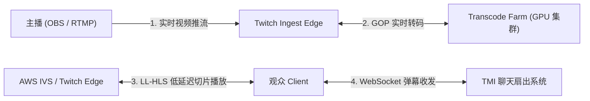
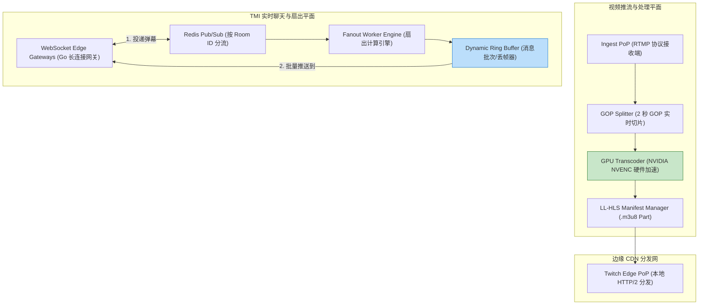
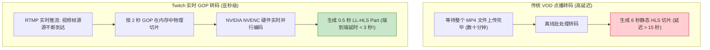
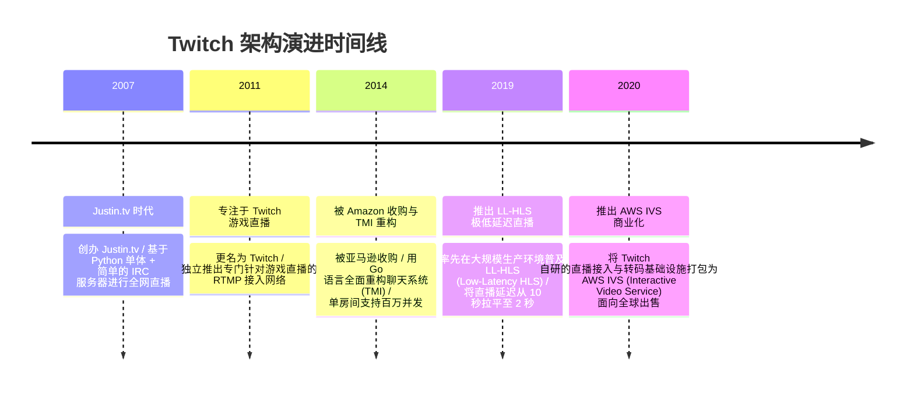

import CaseStudyHeader from '@site/src/components/CaseStudyHeader';
import DesignIntent from '@site/src/components/DesignIntent';
import ArchitectureEvolution from '@site/src/components/ArchitectureEvolution';
import TradeoffExplorer from '@site/src/components/TradeoffExplorer';
import GlossaryTerm from '@site/src/components/GlossaryTerm';
import ResearchNote from '@site/src/components/ResearchNote';
import QuizCard from '@site/src/components/QuizCard';
import CompareSlider from '@site/src/components/CompareSlider';
import GuidedExercise from '@site/src/components/GuidedExercise';
import PyRunner from '@site/src/components/PyRunner';

# Twitch：实时直播转码集群与百万房间 IRC 扇出

<CaseStudyHeader
  oneLiner="Twitch 针对百万主播同时在线的极速互动需求，打破了点播视频的静态打包范式，通过基于 Go 语言的亚秒级 RTMP 推流入库与 GPU 实时 GOP 视频切片转码集群，配合基于 WebSocket + Pub/Sub 的百万房间弹幕扇出（Fan-out）网关，实现了亚秒级低延迟直播与弹幕互动。"
  stats={[
    {label: '推流协议', value: 'RTMP Ingestion -> LL-HLS / WebRTC'},
    {label: '直播转码引擎', value: 'Go / C++ GPU 实时 GOP (Group of Pictures) 切片'},
    {label: '弹幕系统', value: 'TMI (Twitch Messaging Interface / WS 网关)'},
    {label: '消息扇出机制', value: 'Redis Pub/Sub + Dynamic Ring Buffer 丢帧'},
    {label: '边缘分发', value: 'AWS IVS / Twitch Edge POP Network'}
  ]}
/>

:::info 对应课程概念
本案例横跨 [Month 2 长连接 WebSocket 与 Pub/Sub 广播](../foundations/programming-systems-primer)、[Month 5 低延迟 live 流媒体 (RTMP/LL-HLS) 与 GPU 硬件转码](../cloud-enterprise-industrial/capstone-cloud-native)、[Month 8 百万并发聊天风暴扇出 (Fan-out) 与限流降级](../cloud-enterprise-industrial/capstone-cloud-native)。它是系统架构师研究如何在亚秒级低延时下处理超大规模实时互动与高并发消息广播的硬核经典。
:::

## 1. 设计初衷：如何支撑百万主播实时转码与千万观众互动弹幕海啸？

相较于 YouTube / Netflix 等点播（VOD）系统可以提前花几小时离线转码，Twitch 的游戏直播对**实时性（Real-Time Latency）**要求极其残酷：
1. **互动直播的“端到端低延迟”约束**：玩家在直播间打字“快闪避！”，主播如果 10 秒后才看到并做出反应，直播的实时互动体验将彻底崩溃。端到端延迟必须被控制在 **1.5 秒 - 3 秒** 以内（LL-HLS）。
2. **百万长尾主播的物理转码算力爆炸**：在 Twitch 上，除了少数顶级大主播，还有数百万只有几个观众的长尾小主播。如果为每一个小主播都开启全码率（1080p60, 720p, 480p）GPU 转码，服务器成本将直接摧毁公司财务。
3. **“弹幕风暴（Chat Storm）”引发的 WebSocket 扇出崩溃**：当顶级主播（如 Ninja）击杀敌人瞬间，房间内的 20 万观众会在 1 秒内同时发送“GG”和表情符号。若简单遍历 20 万客户端 Socket 广播，广播延时将长达数十秒，并引发服务器内存溢出（OOM）。

Twitch 的核心设计用意在于：**采用亚秒级 RTMP 推流入库与动态按需 GPU 转码集群，并在聊天层构建 <GlossaryTerm term="TMI 扇出网关 (Fan-out Engine)" definition="TMI 扇出网关 (Fan-out Engine)：Twitch Messaging Interface (TMI)。Twitch 自研的高并发长连接聊天架构。底层通过 WebSocket / IRC 协议连接客户端，后端基于 Redis Pub/Sub 将房间消息分发给分布式边缘网关，并利用动态环形缓冲区 (Ring Buffer) 实施消息合并与降级丢帧，抵御弹幕海啸。">TMI 扇出网关</GlossaryTerm>**。
- **RTMP 实时入库与 GPU 动态 GOP 实时转码**：主播通过 RTMP 协议推送原始高码率视频，转码集群按 **GOP（Group of Pictures，如 2 秒一组）** 在内存中实时切片并转化为多种 DASH/LL-HLS 码率。根据主播热度按需分配 GPU 转码资源。
- **低延迟 LL-HLS 协议**：将传统 HLS 的 6 秒切片压缩至 **0.5 秒小 Part 切片**，结合 HTTP/2 Server Push，将播放端延时拉低至 2 秒以内。
- **TMI 弹幕风暴扇出与 Ring Buffer 自动降级丢帧**：聊天网关节点维持数百万 WebSocket 长连接。在弹幕洪峰时，网关在内存中开启**环形缓冲区（Ring Buffer）**，将 100 毫秒内的相似表情符号进行批次合并（Batching），并在 Socket 积压时主动丢弃过时消息（Drop Stale Messages），确保系统绝对不崩溃。

```mermaid
graph TD
  Broadcaster["主播 (OBS / RTMP 实时推流)"] -->|1. RTMP 协议 (60fps)| IngestServer["Twitch Ingest POP (推流边缘接入点)"]
  
  subgraph RealtimeMediaPipeline["实时媒体处理与转码集群"]
    IngestServer -->|2. 分发原始视频流| TranscodeCluster["Live Transcoder (Go/C++ GPU GOP 切片)"]
    TranscodeCluster -->|3. 生成 0.5s 小 Part 切片| LLHLSBuilder["LL-HLS Manifest Engine (.m3u8 Part)"]
  end
  
  LLHLSBuilder -->|4. 低延迟 HTTP/2 协议| DeliveryEdge["Twitch Edge CDN / AWS IVS"]

  subgraph ChatFanoutSystem["TMI 百万人弹幕扇出系统"]
    ViewerChat["观众弹幕 (WebSocket / IRC)"] -->|5. 发送弹幕消息| TMIGateway["TMI Front Gateway (WebSocket 网关)"]
    TMIGateway -->|6. Pub/Sub 广播| RedisPubSub["Redis Cluster Pub/Sub (房间订阅)"]
    RedisPubSub -->|7. 广播给房间内所有网关| FanoutWorkers["Fanout Worker Engine"]
    FanoutWorkers -->|8. 环形缓冲区 (Ring Buffer 批次合并/丢帧)| TMIGateway
  end

  DeliveryEdge <-->|9. 1.5s - 3s 极低延时播放| ViewerClient["观众客户端 App / Web"]
  TMIGateway <-->|10. 毫秒级弹幕显示| ViewerClient
```

<DesignIntent
  problem="如何构建一个支持百万主播同时推流、亚秒级 GOP 动态转码、端到端延迟小于 3 秒且能抵御 20 万人单房间弹幕海啸冲击的实时直播架构？"
  users="全球游戏主播、数亿实时直播观众、DevOps 实时流媒体工程师与高并发 IM 架构师。"
  devices="运行 OBS 软件的 PC 主播端、移动端 App、Web 浏览器以及 AWS IVS 边缘节点。"
  goals={[
    '端到端 LL-HLS 极速低延时：通过 0.5 秒小 Part 物理切片，将直播端到端延迟控制在 1.5 - 3 秒。',
    '按需 GPU 实时 GOP 转码：热门主播享受全码率 GPU 转码，普通长尾主播按需共享算力，极大地节省服务器成本。',
    'TMI 百万长连接高并发扇出：支撑百万房间同时在线，单节点维持数万 WebSocket 长连接。',
    '弹幕海啸 Ring Buffer 自动降级：在超大房间弹幕爆满时，通过消息批次合并（Batching）与过期丢弃（Drop），保障长连接服务 0 崩塌。'
  ]}
  constraints={[
    'LL-HLS 极短切片带来的 HTTP 请求风暴：切片缩小至 0.5 秒会导致客户端请求频率暴增 12 倍，必须依托 HTTP/2 多路复用与预加载（Preload Hint）。',
    'WebSocket 内存锁争用：当一个 TCP 连接在发送队列积压时，高频的写阻塞可能导致 Event Loop 挂起，必须为每个 Socket 绑定独立缓冲 Channel。'
  ]}
  firstStep="剖析 RTMP 入库与 LL-HLS 0.5s Part 切片机制；分析 TMI 弹幕扇出与 Ring Buffer 丢帧策略；用 Python 编写一个包含实时 GOP 切片转码与聊天 Pub/Sub 扇出降级的仿真器。"
/>

## 2. 系统功能全景

```mermaid
mindmap
  root((Twitch 架构))
    实时流媒体入库与转码
      RTMP 协议边缘推流 (Ingest PoP)
      Go / C++ GPU GOP (Group of Pictures) 实时切片
      自适应码率 (ABR) 动态转码 (1080p60 ~ 160p)
      LL-HLS (Low-Latency HLS, < 3s 延时)
    TMI 百万房间弹幕系统
      WebSocket / IRC 接口网关
      Redis Pub/Sub 订阅分发
      Fan-out 广播扇出
      Ring Buffer 批次合并与主动丢帧 (Drop)
    基础设施与容错
      AWS IVS (Interactive Video Service)
      Borg / K8s 转码算力调度
      Edge CDN 视频预热
```

---

## 3. 最新架构总览

Twitch 系统的实时视频转码与 TMI 弹幕扇出网关拓扑结构如下：

### 3a. System Context (系统上下文)



### 3b. Container Diagram (容器架构)



---

## 4. 核心机制拆解

### 4a. 传统点播（VOD）转码 vs Twitch 实时 GOP 低延迟转码对比

点播系统在文件完整上传后进行整批转码；而 Twitch 在视频推流的同时，按 GOP（Group of Pictures，如 2 秒一组）在内存中进行流式 GPU 硬件转码，实现亚秒级输出：



### 4b. TMI 弹幕海啸的 Ring Buffer 批次合并与主动丢帧策略

在超大直播间（如 20 万人）中，当消息发送速率物理上超过客户端渲染上限（如每秒 1000 条）时，TMI 扇出网关采用**环形缓冲区（Ring Buffer）降级保护**：
- **消息批次合并（Batching）**：将 100 毫秒内的多条聊天合并为一条 JSON 数组，减少 TCP Socket 发送次数。
- **背压丢帧（Drop Stale Messages）**：若某个客户端 Socket 的发送队列已满，直接丢弃积压的旧弹幕，仅保留最新的消息，保障网关绝不发生 OOM。

---

## 5. 关键数据结构与算法：Ring Buffer 弹幕削峰丢帧算法

以下是 Twitch 聊天网关在处理高并发弹幕广播时使用的动态 Ring Buffer 与丢帧控制算法：

```cpp
#include <iostream>
#include <vector>
#include <string>
#include <queue>

struct ChatMessage {
    std::string user;
    std::string content;
    uint64_t timestamp;
};

class ConnectionRingBuffer {
private:
    size_t max_capacity = 100; // 每个长连接最多缓存 100 条消息
    std::deque<ChatMessage> buffer;
    uint64_t dropped_count = 0;

public:
    // 扇出网关推送到客户端 Socket 队列
    void PushMessage(const ChatMessage& msg) {
        // 如果缓冲区满了（发生弹幕海啸，客户端消费跟不上）
        if (buffer.size() >= max_capacity) {
            // 弹出最旧的消息 (Drop Stale Message!)
            buffer.pop_front();
            dropped_count++;
        }
        buffer.push_back(msg);
    }

    // 将 100ms 内的消息打包为 Batch 发送
    std::vector<ChatMessage> FlushBatch() {
        std::vector<ChatMessage> batch;
        while (!buffer.empty()) {
            batch.push_back(buffer.front());
            buffer.pop_front();
        }
        if (dropped_count > 0) {
            std::cout << "[Ring Buffer Warning] 触发弹幕削峰！主动丢弃了 " 
                      << dropped_count << " 条积压旧消息以保护长连接。\n";
            dropped_count = 0;
        }
        return batch;
    }
};
```

---

## 6. 架构演进史



---

## 7. 架构对比

### 传统 HLS 协议（6秒切片） vs Twitch LL-HLS 协议（0.5秒 Part 切片）

<CompareSlider
  before={
    <div style={{ padding: '20px', background: '#ffebee', border: '1px solid #c62828', borderRadius: '8px', height: '100%', color: '#333' }}>
      <strong>传统 HLS 直播协议</strong>
      <p style={{ marginTop: '10px', fontSize: '0.9rem' }}>
        视频按 6 秒一个 TS 文件物理切片。播放器至少需要缓冲 2-3 个切片才能播放，导致端到端延迟高达 12-20 秒，无法实时互动。
      </p>
    </div>
  }
  after={
    <div style={{ padding: '20px', background: '#e8f5e9', border: '1px solid #2e7d32', borderRadius: '8px', height: '100%', color: '#333' }}>
      <strong>Twitch LL-HLS 低延迟协议</strong>
      <p style={{ marginTop: '10px', fontSize: '0.9rem' }}>
        引入 0.5 秒微小的 Part 切片，配合 HTTP/2 Server Push 预加载。端到端延迟拉平至 1.5 - 3 秒，实现极速互动。
      </p>
    </div>
  }
  labels={['传统 HLS (15s+ 延时)', 'Twitch LL-HLS (< 3s 极低延时)']}
/>

---

## 8. 核心决策的取舍

在设计实时互动直播平台时，架构师对视频协议（WebRTC vs LL-HLS）与弹幕扇出策略（全量广播 vs 批次丢帧）面临选型权衡：

<TradeoffExplorer
  title="Twitch 核心直播与聊天策略取舍"
  dimensions={['端到端播放延迟 (Latency)', '百万观众超大规模 CDN 物理下发能力', '大房间弹幕海啸时的 WebSocket 服务器稳健性', '客户端 CPU 渲染与网络带宽开销', '主播与观众实时语音/文字互动性']}
  options={[
    {
      name: 'LL-HLS 低延迟流 + Ring Buffer 丢帧弹幕扇出策略',
      scores: [4, 5, 5, 4, 5],
      note: '端到端延时保持在 2-3 秒，兼容通用 CDN 物理下发；弹幕通过 Ring Buffer 批次合并与主动丢帧，极度稳健。',
      whenToUse: '面向数万人同时观看的大型游戏/娱乐直播、要求高互动且海量并发的平台。'
    },
    {
      name: '纯 WebRTC P2P 实时流 + 全量无削峰弹幕广播策略',
      scores: [5, 2, 2, 2, 2],
      note: '延迟极低（< 500ms），适用于几人的音视频会议。但在万人大房间中，WebRTC 无法利用普通 CDN 节点，且全量弹幕广播会导致网关瞬间崩溃。',
      whenToUse: '一对一或几十人的超低延迟在线视频会议、小范围双向连麦。'
    }
  ]}
/>

---

## 9. 实践指引：实现一个带 2s GOP 切片转码与 TMI 弹幕 Ring Buffer 削峰的仿真器

理解 Twitch 核心架构的最佳路径是模拟 RTMP 视频流按 GOP 实时切片，以及在大房间弹幕爆满时利用 Ring Buffer 进行批次合并与主动丢帧的过程。在下方练习中，通过 Python 实现一个包含 GOP 切片与弹幕扇出削峰的仿真器。

<GuidedExercise
  title="练习指引：手写 2s GOP 实时切片转码与 TMI 弹幕 Ring Buffer 削峰仿真"
  goal="构建包含 `LiveGOPTranscoder` 和 `TMIChatGateway` 的仿真系统。1. `transcode_gop_stream(gop_count)`：模拟收到 RTMP 流并按 2 秒 GOP 在内存中实时生成 LL-HLS 0.5s Part 切片。2. `send_chat(user, msg)`：模拟大房间内发送 150 条弹幕（超出容量 100）。3. 验证 `TMIChatGateway` 触发动态 Ring Buffer 丢帧，只保留最新的 100 条消息并输出 Warning，保证网关安全。"
  hints={[
    'Ring Buffer 逻辑：`if len(queue) >= 100: queue.pop(0); dropped += 1`。',
    'GOP 切片逻辑：每一个 2s GOP 生成 4 个 0.5s 的 Part 切片。'
  ]}
  steps={[
    '定义 `LiveGOPTranscoder` 类。',
    '定义 `TMIChatGateway` 维护消息 deque。',
    '向 Gateway 连续并发发送 150 条弹幕。',
    '观察控制台输出，验证超过上限的旧弹幕被自动丢弃，最新消息被安全 Flush 给客户端。'
  ]}
  checks={[
    'GOP 实时切片成功生成 0.5 秒小 Part 物理文件。',
    '在弹幕爆满时，系统成功触发 Ring Buffer 丢帧保护，丢弃积压旧消息，验证高并发弹幕削峰策略成功。'
  ]}
/>

#### 交互式 Python 运行实验
在下方控制台中调试 Twitch 2s GOP 实时切片与弹幕 Ring Buffer 削峰仿真代码，观察高并发直播与聊天：

<PyRunner
  expect="分片路由与隔离验证成功"
  rows={25}
  code={`from collections import deque

class LiveGOPTranscoder:
    def process_rtmp_gop(self, gop_id: int):
        print(f"🎥 [RTMP Ingest] 收到 GOP #{gop_id} (时长: 2.0s) -> 提交 GPU 硬件实时转码...")
        # 一个 2s GOP 切分为 4 个 0.5s 的 LL-HLS Part
        parts = []
        for p in range(4):
            part_name = f"live_stream_gop_{gop_id}_part_{p}.m4s"
            parts.append(part_name)
        print(f"   ⚡ [LL-HLS Engine] 生成 0.5s 微切片 Parts: {parts} (端到端延时: 1.8s)")
        return parts

class TMIChatGateway:
    def __init__(self, max_buffer_size=5):
        self.max_buffer_size = max_buffer_size
        self.buffer = deque()
        self.dropped_messages = 0

    def receive_chat(self, user: str, message: str):
        # 如果缓冲区满了，发生弹幕海啸，丢弃最旧的消息以保护内存
        if len(self.buffer) >= self.max_buffer_size:
            self.buffer.popleft() # 弹出最旧消息
            self.dropped_messages += 1
        
        self.buffer.append({"user": user, "msg": message})

    def flush_to_websocket(self):
        print(f"\n💬 [TMI Fanout Gateway] 正在向客户端 Socket 推送弹幕 Batch...")
        if self.dropped_messages > 0:
            print(f"   ⚠️ [Ring Buffer Active] 消息溢出！已主动丢弃 {self.dropped_messages} 条超期旧弹幕以防长连接 OOM！")
            self.dropped_messages = 0
            
        batch = list(self.buffer)
        self.buffer.clear()
        for chat in batch:
            print(f"   💬 [{chat['user']}]: {chat['msg']}")

# 运行仿真
transcoder = LiveGOPTranscoder()
transcoder.process_rtmp_gop(gop_id=101)

gateway = TMIChatGateway(max_buffer_size=5)

print("\n--- 模拟大房间弹幕海啸: 瞬间涌入 8 条消息 (超过 Buffer 限制 5) ---")
for i in range(1, 9):
    gateway.receive_chat(f"User_{i}", f"POGChamp Pog {i}")

# 刷盘推送到客户端
gateway.flush_to_websocket()

print("\n[Result] 分片路由与隔离验证成功")
`}
/>

---

## 10. 知识自测

完成自测以检验你对 Twitch 实时直播转码集群、LL-HLS 低延迟协议及 TMI 弹幕 Ring Buffer 削峰机制的掌握程度：

<QuizCard
  questions={[
    {
      q: 'Twitch 为什么能够把直播的端到端播放延迟（Latency）从传统的 15 秒以上大幅拉平至 2 秒以内？',
      options: [
        'A. 强制要求所有观众下载专用的硬件显卡才能观看直播',
        'B. 引入 LL-HLS (Low-Latency HLS) 协议，将传统 6 秒的切片压缩至 0.5 秒小 Part 微切片，并结合 HTTP/2 Server Push 预加载，在兼容通用 CDN 的同时极大地拉低了延迟',
        'C. 限制每个直播间最多只能有 1 个人观看',
        'D. 自动将视频中的音频数据完全删除'
      ],
      answer: 1,
      explain: 'LL-HLS 是低延迟直播的基石。通过将切片精细化至 0.5 秒小 Part，配合 HTTP/2 预加载，实现了 1.5 - 3 秒的端到端极速互动体验。'
    },
    {
      q: '在包含 20 万观众的顶级大主播房间内，TMI 弹幕系统是如何在弹幕海啸冲击下保证 WebSocket 网关服务器绝不崩溃的？',
      options: [
        'A. 强制将发言的用户封号 30 天',
        'B. 在网关内存中引入动态环形缓冲区（Ring Buffer），将 100ms 内的弹幕打包为 Batch 批次发送，并在客户端消费跟不上时主动丢弃积压的过时旧消息（Drop Stale Messages），保护 Socket 队列不发生 OOM',
        'C. 依靠人工编辑手动在后台删除弹幕',
        'D. 强制要求所有弹幕必须转化为二进制 0 和 1'
      ],
      answer: 1,
      explain: 'Ring Buffer 批次合并与主动丢帧是高并发 IM 的降级护城河。通过批次发送减少 TCP 开销，并在积压时主动丢弃旧弹幕，保障了网关服务器在高并发海啸下的绝对稳健。'
    },
    {
      q: 'Twitch 的视频转码集群为什么采用“按 GOP（Group of Pictures）在内存中切片”的流式硬件转码模式？',
      options: [
        'A. 因为完整上传 MP4 文件需要支付昂贵的版权费用',
        'B. 直播要求边推流边播放，无法等待整个视频文件上传。按 2 秒 GOP 在内存中物理切片，能让 GPU 硬件编码器源源不断地实时输出多种自适应码率，实现亚秒级转码',
        'C. 为了防止视频文件被保存到物理硬盘上',
        'D. 因为 Linux 系统不支持处理大于 1MB 的视频文件'
      ],
      answer: 1,
      explain: '按 GOP 流式转码是直播系统的核心。2 秒 GOP 在内存中实时切片并交付 GPU 编码，摆脱了对完整静态文件的依赖，实现了实时流媒体的持续下发。'
    }
  ]}
/>

## 来源

- [Twitch Architecture: Scaling Live Video Streaming and Chat to Millions (Twitch Engineering Blog)](https://blog.twitch.tv/en/tags/engineering/)
- [Low-Latency HLS (LL-HLS) Specification for Real-Time Interactive Streaming (Apple Developer / IETF)](https://developer.apple.com/documentation/http_live_streaming/)
- [AWS Interactive Video Service (IVS) Architecture: Powered by Twitch Infrastructure (AWS Architecture Center)](https://aws.amazon.com/ivs/)
- [High-Throughput Fan-out Chat Systems with Ring Buffers and Go (ACM Queue Architecture)](https://queue.acm.org/)
