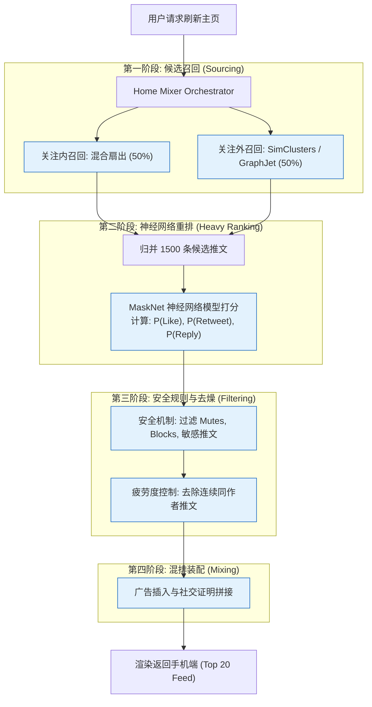

import CaseStudyHeader from '@site/src/components/CaseStudyHeader';
import DesignIntent from '@site/src/components/DesignIntent';
import EvolutionTimeline from '@site/src/components/EvolutionTimeline';
import CompareSlider from '@site/src/components/CompareSlider';
import TradeoffExplorer from '@site/src/components/TradeoffExplorer';
import GlossaryTerm from '@site/src/components/GlossaryTerm';
import ResearchNote from '@site/src/components/ResearchNote';
import GuidedExercise from '@site/src/components/GuidedExercise';
import QuizCard from '@site/src/components/QuizCard';
import MindMap from '@site/src/components/MindMap';

# Twitter/X.com：万亿推文的混合 Fanout 扇出与 Home Mixer 智能时间线架构

<CaseStudyHeader
  oneLiner="Twitter/X.com 的核心挑战是『极度不对称的关注社交图谱』。它通过将普通用户的『写时扇出 (Push)』与头部大 V (名人) 的『读时扇出 (Pull)』有机结合为混合架构，完美化解了写入风暴；并利用高度工程化的 Home Mixer 推荐引擎，在 50ms 内完成候选人召回、重度排序（Heavy Ranker）与安全过滤，支撑了全球亿级并发的时间线刷新。"
  stats={[
    {label: '开源年份', value: '2023 年 (GitHub 开源)'},
    {label: '每日发推量', value: '约 5 亿条'},
    {label: '大 V 划分阈值', value: '10,000+ 粉丝 (典型值)'},
    {label: '时间线查询时延', value: 'Sub-50ms (P95)'},
    {label: '核心缓存选型', value: 'Redis (Sorted Sets)'},
    {label: '发文ID算法', value: 'Snowflake (雪花算法)'}
  ]}
/>

:::info 对应课程概念
本案例融合了以下课程核心概念：
*   **读写权衡与扇出风暴（Month 4/11）**：如何在大规模高并发社交应用中，根据用户粉丝不对称性做 Push/Pull 架构的折中决策。
*   **内存数据库与快速排序（Month 5）**：如何使用 Redis ZSET 结构动态归并时间线并维持滑动窗口剔除。
*   **分布式唯一 ID 分布式事务（Month 11）**：Snowflake 算法的无锁高并发时钟回拨处理与高可用。
:::

---

## 1. 设计初衷：不对称社交图谱与读写不平衡的物理极限

社交媒体（社交网络）的核心是**时间线（Timeline）**。
在物理存储上，时间线包含两大形态：
*   **用户时间线（User Timeline）**：特定用户自己发过的推文列表。
*   **主页时间线（Home Timeline）**：用户登录后看到的，他所关注的几百上千人发的推文聚合。

如果所有用户的发推都采用 **写时扇出（Fanout-on-Write / Push）**，即当用户发推时，将推文 ID 复制到该用户所有粉丝的 Inbox 缓存中。对于粉丝较少（如 100 个）的普通用户，这非常轻松；但对于拥有 1 亿粉丝的头部大 V（如 Elon Musk），发一条推文将触发 **1 亿次缓存写 I/O 操作**，形成恐怖的**写时扇出风暴**，瞬间压瘫缓存集群。

反之，若采用 **读时扇出（Fanout-on-Read / Pull）**，即用户刷新主页时，动态向自己关注的 1000 个用户请求最新推文并在线归并。由于每次读操作都需要查询上千个列表，这会给读性能带来巨大压力，无法满足高并发下主页刷新的 sub-50ms 时延要求。

Twitter 的精妙之处就在于设计了 **混合扇出（Hybrid Fanout）** 策略，并结合 **Home Mixer** 推荐管道，解决了这一读写物理壁垒。

<DesignIntent
  problem="如何在拥有万级粉丝不对称、粉丝规模相差百万倍的极端社交图谱下，实现推文的高吞吐写入，并在 50ms 内为用户刷新出兼顾时效性、相关度与安全策略的个性化智能主页时间线。"
  users="全球数亿在线消费短文字/多媒体推文的社交网络用户，以及数百万高频发帖的头部创作者与企业。"
  devices="支持手机 App、桌面浏览器端。后台服务主要部署于 Twitter 自有全球数据中心的大规模分布式 JVM 服务群与超大 Redis 缓存集群。"
  goals={[
    '极致读取延迟：主页时间线（Home Timeline）刷新延迟在 P95 状态下控制在 50ms 以内',
    '杜绝写入风暴：将头部大 V 的推文写入压力卸载，避免单次发推引起全网缓存抖动',
    '个性化相关度打分：结合深度模型，在 1500 条候选推文中自动筛选并推荐最可能产生交互的 Top K 推文',
    '全局唯一有序 ID：保证所有推文在分布式环境下，不依赖单点锁，生成绝对趋势递增的 64-bit ID'
  ]}
  constraints={[
    'Redis 内存空间极其昂贵，不能无限存放推文，必须在主页时间线缓存上实施滑动窗口上限（如 800 条）限制',
    '网络开销瓶颈：拉取大 V 动作被分流至读时聚合，必须在读取阶段与内存缓存进行亚毫秒级无痕混合',
    '社交图谱查询高并发：社交关系图（FlockDB）非常复杂，关注与粉丝关系库读并发极高',
    '服务器时钟回拨：依赖物理时间戳的 Snowflake 算法，在机器 NTP 时钟同步微量回拨时极易发生 ID 重复冲突'
  ]}
  firstStep="将发推用户分为“普通用户”与“大 V 用户”；普通用户走“写时扇出”，大 V 用户走“读时拉取”；主页时间线在 Home Mixer 框架下运行，通过召回（Sourcing）、重度打分（Heavy Ranking）、安全策略过滤（Filtering）三阶段实现秒级生成。"
/>

---

## 2. 知识全景脑图

<MindMap
  root={{
    label: 'Twitter/X 架构全景',
    children: [
      {
        label: '写入与扇出 (Write & Fanout)',
        children: [
          { label: ' Snowflake 分布式唯一 ID' },
          { label: '普通用户：写时扇出 (Push)' },
          { label: '头部大 V：只写 User Timeline' },
          { label: '社交图谱服务 (FlockDB)' }
        ]
      },
      {
        label: '主页混合读 (Read & Merge)',
        children: [
          { label: 'Redis Home Timeline 缓存' },
          { label: '读时动态拉取大 V (Pull)' },
          { label: '双路归并排序 (ZSET)' }
        ]
      },
      {
        label: 'Home Mixer 推荐管道',
        children: [
          { label: '候选召回 (Candidate Sourcing)' },
          { label: '重度排序 (Heavy Ranker/MaskNet)' },
          { label: '启发过滤 (Mutes/NSFW Filter)' },
          { label: '社交证明混合 (Social Proof)' }
        ]
      },
      {
        label: '缓存防御 (Cache Protection)',
        children: [
          { label: '缓存滑动窗口限制 (800条)' },
          { label: '冷热数据自动换入/换出' }
        ]
      }
    ]
  }}
/>

---

## 3. 系统架构总览 (C4 Model)

以下是 Twitter 智能主页时间线生成的三平面协同 C4 Context 与 Container 拓扑。

### 3a. System Context (系统上下文图)

```mermaid
graph TB
    classDef client fill:#e1f5fe,stroke:#0288d1,stroke-width:1.5px;
    classDef main fill:#e8f5e9,stroke:#2e7d32,stroke-width:2px;
    classDef third fill:#fff9c4,stroke:#fbc02d,stroke-width:1.5px;

    UserApp["用户客户端 (Mobile/Web)"]:::client -->|1. 发表推文 / 刷新时间线| WebGateway["API Gateway 网关层"]:::main
    
    WebGateway -->|2. 调度查询与混合| HomeMixer["Home Mixer 核心编排服务"]:::main
    HomeMixer -->|3. 查询社交图谱与推文库| SocialGraphDb["FlockDB 社交图谱 / TweetStore"]:::third
    HomeMixer -.->|4. 高速读写缓存| RedisTimeline["("Redis Timeline Cache 集群")"]:::main
```

### 3b. Container Diagram (容器结构图)

```mermaid
graph TB
    classDef serve fill:#e1f5fe,stroke:#0288d1,stroke-width:2px;
    classDef data fill:#e8f5e9,stroke:#2e7d32,stroke-width:1.5px;
    classDef cache fill:#ffebee,stroke:#c62828,stroke-width:1.5px;

    UserPost["发表推文"] --> TweetService["Tweet Creation Service"]:::serve
    TweetService --> Snowflake["Snowflake Generator<br/>(无锁趋势递增 ID)"]:::serve
    
    TweetService --> FanoutRouter{"扇出路由器<br/>(粉丝数判断)"}:::serve
    
    FanoutRouter -->|普通用户: 粉丝 < 10,000| WriteFanout["Fanout Daemon (Push)<br/>向所有粉丝的 Home Timeline ZSET 复制"]:::data
    FanoutRouter -->|大 V: 粉丝 >= 10,000| OnlyWriteUser["仅写入 User Timeline Db<br/>不进行全网广播 (Pull 模式地基)"]:::data

    UserRead["刷新主页时间线"] --> HomeMixerNode["Home Mixer Service"]:::serve
    
    HomeMixerNode -->|1. 读取预计算缓存| RedisHomeCache["("Redis Home Timeline Cache<br/>(滑动窗口 800条 ID 列表)")"]:::cache
    HomeMixerNode -->|2. 社交图谱查找| GraphService["Social Graph Service (FlockDB)<br/>找出该用户关注的大 V 列表"]:::data
    GraphService -->|3. 动态拉取大 V 推文| UserTimelineDb["("User Timeline Database")"]:::data
    
    HomeMixerNode -->|4. 双路归并与重度打分| HeavyRanker["Heavy Ranker (MaskNet ML Model)"]:::serve
    
    WriteFanout --> RedisHomeCache
```

---

## 4. 核心机制拆解

### 4a. 混合扇出模型 (Hybrid Fan-out)

为了让读写负载各取所长，ES 与社交平台一样，必须精细分化用户的发帖模式。
1.  **普通用户发推**：系统执行 **Push** 机制。通过异步队列获取其粉丝列表，然后将 TweetID 依次追加写入到这些粉丝的 Redis `Home Timeline` 缓存（用 Sorted Set 存储，以 TweetID/时间戳为 Score）中。
2.  **大 V 用户发推**：不执行 Push。而是将 TweetID 仅存放到大 V 自家的 Redis `User Timeline` 缓存中。
3.  **粉丝刷新主页**：读取其 Redis `Home Timeline` 缓存中的普通推文，同时通过 `FlockDB` 找出他关注的、处于大 V 状态的用户，向其 `User Timeline` 发起 **Pull** 请求，最后在内存中将这两部分 TweetIDs 进行 ZSET 快速双路归并，交由打分模型重排。

```mermaid
graph TD
    classDef push fill:#ffebee,stroke:#c62828,stroke-width:1.5px;
    classDef pull fill:#e8f5e9,stroke:#2e7d32,stroke-width:2px;

    TweetReq["发表新推文 (Tweet ID: #999)"] --> CheckFollowers{"判断发推者粉丝数是否 >= 10,000?"}
    
    subgraph PushPath ["写时扇出路 (Push)"]
        CheckFollowers -->|No (普通用户)| FetchFollowers["读取发推者所有粉丝的 ID 列表"]:::push
        FetchFollowers --> LoopPush["遍历粉丝列表"]:::push
        LoopPush -->|写入粉丝缓存| PushRedis["追加到粉丝对应的 Redis Home Timeline Cache"]:::push
    end
    
    subgraph PullPath ["读时拉取路 (Pull)"]
        CheckFollowers -->|Yes (明星大 V)| OnlyUserDb["仅写入大 V 自己的 User Timeline 缓存中"]:::pull
        OnlyUserDb -->|不再广播| FinishWrite["写入完毕 (写延迟极低)"]:::pull
    end
    
    subgraph ReaderHome ["读取主页时间线流程"]
        Reader["用户 A 刷新主页"] --> ReadCache["1. 读取 A 的 Redis Home Timeline Cache (来自普通用户)"]:::pull
        Reader --> GetCelebrities["2. 查询 A 关注了哪些大 V"]:::pull
        GetCelebrities --> PullCelebrity["3. 动态拉取这些大 V 的 User Timeline"]:::pull
        ReadCache & PullCelebrity --> MemoryMerge["4. 内存 Sorted Set 合并与打分排序"]:::pull
    end
```

---

### 4b. Home Mixer 推荐管道执行生命周期

现代 X/Twitter 的时间线不是严格按时间倒排的，而是高度个性化的推荐流。这由 **Home Mixer** 框架在 50 毫秒内编排完成：

1.  **候选人召回（Sourcing）**：系统在 10ms 内搜集大约 1500 条推文。
    *   **关注内召回（In-Network）**：从混合扇出架构的缓存中获取，这占推荐量的约 50%。
    *   **关注外召回（Out-of-Network）**：使用 *SimClusters*（基于社群检测的同好推文向量）与 *RealGraph*（预估你与某位陌生人产生互动的概率图），找出你可能感兴趣的外部推文。
2.  **重度打分（Heavy Ranking）**：这 1500 条推文被送到基于 MaskNet 的神经网络模型中。模型会计算这 1500 条推文被你点赞、转发、评论、长停留的联合概率分值，并重新进行由大到小的强力排序。
3.  **规则与安全过滤（Filtering）**：过滤掉已被你屏蔽、消音的用户推文，剔除 NSFW 敏感内容，并限制在刷出的前几条里“连续出现同一作者推文”的现象，防止审美疲劳。
4.  **社交证明混剪（Mixing）**：将剩余得分最高的推文与商业广告、转发评论混合，组成精美的主页时间线 Feed 返回。



<ResearchNote
  title="Twitter 的开源算法：推荐时间线的编排系统"
  source="X Engineering (2023), The Open Source Algorithm for Home Timeline Generation (GitHub)"
  href="https://github.com/twitter/the-algorithm"
  insight="X/Twitter 开源了其整个 Home Timeline 生成的算法内核。其最核心的架构决策在于利用 Product Mixer 框架，将极度庞大的社交图谱（几亿节点）解构成轻量级的“In-Network”与“Out-of-Network”两个异构召回源，并在重度排序器（Heavy Ranker）中通过特征工程直接融入了强时效性衰减因子。这为如何以 sub-50ms 延迟提供超大吞吐量推荐系统树立了工业标杆。"
  application="架构启示：高并发系统的『个性化推荐』绝对不是一次性在海量主库上执行联表查询。在写入期将数据先置入内存缓存（Redis Sorted Sets），在读取期通过多重独立的 Microservices（GraphJet、SimClusters）并发召回，再在 Coordinating 层（Home Mixer）做归并与模型预测，是分布式 AI 工程设计的典型代表。"
/>

---

## 5. 关键数据结构与算法

### 5a. Snowflake 分布式全局唯一 ID 生成算法

为了在分布式数据库环境下保证推文的绝对有序，且避免因为向单一 Master 索取自增 ID 带来严重的并发锁瓶颈，Twitter 提出了 **Snowflake（雪花算法）**。

它生成一个 64-bit 的二进制长整型 ID，其物理组成结构如下：

| 1-bit | 41-bit 时间戳（单位：毫秒） | 10-bit 工作机器 ID | 12-bit 序列号（单机并发自增） |
| :---: | :---: | :---: | :---: |
| 符号位 | 记录从 epoch 开始经过的毫秒数 | 划分 Datacenter ID 与 Worker ID | 在同一毫秒内自增，满 4096 溢出等待 |

```
0 - 00000000000000000000000000000000000000000 - 0000000000 - 000000000000
↑                 ↑                                ↑             ↑
符号位       41位毫秒级时间戳                    10位工作节点ID    12位序列号
```

**工程实现挑战：时钟回拨问题（Clock Backwards）**
雪花算法高度依赖各物理服务器的系统时间。如果 NTP 时钟同步发生回拨（机器时间倒退），极易导致在相同的毫秒内生成完全重复的 ID。
**解决方案**：
*   在生成 ID 时，缓存上一次生成的最大时间戳 `lastTimestamp`。
*   如果当前系统时间戳 `currentTimestamp < lastTimestamp`，说明发生了时钟回拨。此时系统会触发拒绝服务（抛出异常/阻断），或者短暂线程休眠（Thread.sleep）等待时钟追赶上 `lastTimestamp` 后再提供服务，保障了全局唯一递增性。

---

### 5b. Redis Timeline 缓存组织 (Sorted Sets)

在 Home Timeline 缓存中，Twitter 采用 Redis 的 **Sorted Set（有序集合，ZSET）** 进行存储：
*   **Key**：`home:timeline:user_id`
*   **Score**：Snowflake ID（物理上包含时间戳，直接代表时间先后顺序）。
*   **Value**：`TweetID`（64位整型）。

在 Redis 中，ZSET 依靠 **Skip List（跳表）** 实现。在读取时可以执行 `ZREVRANGEBYSCORE` 或者是 `ZREVRANGE` 得到最新 K 条推文，时间复杂度为 $O(\log N + M)$，非常高效。同时，系统在写入时，会强制保留一个滑动窗口（如 ZREMRANGEBYRANK，只保留最新的 800 条），防止 Redis 内存因万亿推文爆发而崩溃。

---

## 6. 架构演进史

Twitter 系统架构的数次大变迁，是互联网高并发网站架构演进的活字典：

<EvolutionTimeline
  events={[
    {
      year: '2007',
      title: 'Ruby on Rails 单体时代：Fail Whale 的常客',
      why: '早期用户增长极快，单体 Web 应用配合 MySQL 执行大量的 SELECT JOIN 联表查询，数据库瞬间被读写锁锁死，页面频繁崩溃（Fail Whale 蓝鲸画面）。',
      change: '废弃单体 RoR，将系统用 JVM（Scala/Java）微服务化重构；引入全局分布式缓存，用内存缓存卸载数据库的联表压力。'
    },
    {
      year: '2012',
      title: 'FlockDB 与全量写时扇出 (Push) 时代',
      why: '为了追求极致的读取速度，开发了图数据库 FlockDB。此时系统全面使用写时扇出，但随着名人效应（Lady Gaga/奥巴马发推）席卷，大 V 扇出风暴导致内存缓存集群彻底被打满崩溃。',
      change: '提出 Hybrid 混合扇出模型。划定粉丝数阈值（粉丝数 >= 10,000 的判定为大 V），大 V 发推不再扇出，仅在粉丝刷新时在内存中双路归并拉取。'
    },
    {
      year: '2023',
      title: 'Home Mixer 与大模型推荐开源时代',
      why: '用户对千人千面的“为您推荐（For You）”智能时间线需求迫切，老旧的简单时间线已被历史淘汰。',
      change: '将时间线完全托管给 Home Mixer，利用 SimClusters 检索关注外候选人，并基于深度排序器（Heavy Ranker）的交叉神经网络进行概率排序。将整个推荐引擎向开源生态发布。'
    }
  ]}
/>

---

## 7. 架构对比：写时扇出 (Push) vs. 读时扇出 (Pull)

<CompareSlider
  before={
    <div style={{ padding: '20px', background: '#ffebee', border: '1px solid #c62828', borderRadius: '8px', height: '100%', color: '#333' }}>
      <strong>写时扇出 (Push 模式)</strong>
      <p style={{ marginTop: '10px', fontSize: '0.9rem' }}>用户发推时，系统将推文 ID 强行复制推送到所有粉丝的主页时间线缓存（Redis ZSET）中。读取时仅需 1 次 Redis 内存查询，速度极快（Latency 小于 10ms）。但是对于粉丝数极多的大 V，写入耗费了天量 CPU 和磁盘 I/O 资源，易引发写时扇出风暴。</p>
    </div>
  }
  after={
    <div style={{ padding: '20px', background: '#e8f5e9', border: '1px solid #2e7d32', borderRadius: '8px', height: '100%', color: '#333' }}>
      <strong>读时扇出 (Pull 模式)</strong>
      <p style={{ marginTop: '10px', fontSize: '0.9rem' }}>用户发文时，仅写入发帖人自己的 User Timeline。当粉丝刷新主页时，动态向所有关注的人发起 Pull 请求并在线合并。发文写入无压力，但读取时需要并发联查几百个关注人列表，严重拖慢了主页响应时延。</p>
    </div>
  }
  labels={['写时扇出 (Push)', '读时扇出 (Pull)']}
/>

---

## 8. 权衡：主页时间线设计的折中光谱

Twitter 在追求时间线读写平衡与智能化推荐的过程中，进行了多维度的架构权衡：

<TradeoffExplorer
  title="Twitter/X 时间线读写、网络与个性化折中"
  dimensions={['主页读取延迟 (RTT)', '写入高平滑 (无扇出风暴)', '模型打分推荐质量', '内存缓存容量消耗', '运维与图算法复杂度']}
  options={[
    {
      name: '纯粹写时扇出 (全量 Push)',
      scores: [5, 1, 5, 2, 4],
      note: '为所有人执行写时扇出。读取极快，但任何大 V 的发帖动作都会造成队列积压，拖慢整个集群的推文写入。',
      whenToUse: '社交图谱完全对称（如加好友必须双方同意、没有单向关注名人机制）的社交网络系统。'
    },
    {
      name: '混合扇出模型 (Hybrid Fanout)',
      scores: [4, 5, 4, 3, 2],
      note: '对普通用户 Push，对粉丝数超 10,000 的大 V 进行读时 Pull 并在内存合并。在保障 99% 普通查询延迟的同时，彻底清除了大 V 带来的写入风暴。代价是增加了读取期社交图谱查询与双路跳表合并的逻辑复杂度。',
      whenToUse: '关注图谱极度倾斜、大 V 效应极其明显的大型非对称社交网络平台。'
    },
    {
      name: '开启 Home Mixer 深度模型打分',
      scores: [2, 5, 5, 3, 1],
      note: '召回 1500 条推文并使用 Heavy Ranker 神经网络进行交互率预测。时间线从纯“时间倒排”转为“兴趣高度匹配”，用户留存率大幅上涨。缺点是每次主页刷新都需要走一遍复杂的模型计算，CPU/GPU 算力消耗暴涨，耗时增加了 20-30ms。',
      whenToUse: '需要增强用户粘性、拥有海量算力集群的现代化个性化推荐平台。'
    }
  ]}
/>

---

## 9. 如果是你来设计：混合扇出调度器

### 场景设想
在社交网络系统时间线的写平面中，假设我们划定大 V 用户的粉丝数阈值为 **3 个**（以小数值模拟大吞吐）。
当用户发帖时，我们需要一个 **Fanout Coordinator（扇出协调器）** 来决定走 Push 模式还是 Pull 模式：
*   发帖者粉丝数 < 3：将帖子 ID 写入其所有粉丝的 `home_timeline` 内存列表中（Push 模式）。
*   发帖者粉丝数 >= 3（大 V）：仅写入大 V 自己的 `user_timeline`，不复制给粉丝。当粉丝调用 `get_home_timeline` 时，动态拉取关注的明星大 V 的推文并和自身的 `home_timeline` 进行有序合并（Pull 模式）。

请你用 Python 实现这个混合扇出调度器。

<GuidedExercise
  title="基于 Python 的混合扇出与明星合并调度器模拟"
  goal="设计并实现一个能够判断粉丝阈值、分流 Push/Pull 写入、并在读取时动态归并大 V 推文的混合时间线生成系统。"
  steps={[
    '步骤 1: 初始化核心关系链。用字典定义 self.followers = {"A": ["B", "C"], "Star": ["A", "B", "C", "D"]} 表示粉丝列表；用 self.user_timelines = {} 和 self.home_timelines = {} 暂存帖子 ID。',
    '步骤 2: 实现 post_tweet(user, tweet_id, timestamp) 写入逻辑。将该推文放入 self.user_timelines[user] 列表。判断 user 的粉丝数是否 >= 3：若不是，则遍历 followers 列表，将该推文 ID 顺序写入粉丝的 self.home_timelines 列表中；若是大 V，则直接返回，不更新粉丝列表。',
    '步骤 3: 实现 get_home_timeline(user) 读取逻辑。获取 user 自身的 home_timelines（普通用户推送到此的推文）。获取 user 关注的所有用户，过滤出粉丝数 >= 3 的明星大 V 列表，拉取这些明星在 user_timelines 中的帖子。',
    '步骤 4: 执行双路有序合并。在内存中合并普通推文与大 V 推文，并按照时间戳/推文 ID 由新到老进行归并排序，返回前 N 条推文。'
  ]}
  checks={[
    '验证普通用户发帖后，其粉丝的 home_timeline 立即被 Push 更新并可读出',
    '验证明星大 V 发帖后，粉丝的 home_timeline 没有发生 Push（保持清洁），但调用 get_home_timeline 时能够成功动态 Pull 并合流读出大 V 的推文',
    '确认在读取大 V 帖子时，合并后的推文时间轴严格按 ID 倒排递增无乱序'
  ]}
/>

---

## 10. 知识自测

<QuizCard
  questions={[
    {
      q: 'Twitter/X.com 采用“混合扇出（Hybrid Fanout）”架构来生成主页时间线，其解决的根本性痛点是什么？',
      options: [
        'A. 解决前端 React 沙箱中 broken links 的解析报错',
        'B. 解决大 V 发文时的“写时扇出风暴”与普通粉丝刷新主页时“读时联表过多导致时延失控”的读写冲突。通过将大 V 剥离出写扇出并由读端动态合并，实现了读写负载的最优平衡',
        'C. 为了防止 Snowflake ID 时钟回拨导致的数据丢失',
        'D. 强制限制大 V 每晚发推的数量以节省 Redis 磁盘'
      ],
      answer: 1,
      explain: '这是一种经典的非对称系统设计。明星用户的粉丝体量可能达到千万级，如果坚持 Push，会产生恐怖的写时 I/O 阻塞；如果坚持 Pull，普通粉丝关注了几十个明星，读时合并联表查询也是死穴。混合扇出让普通用户的发文走 Push，明星走 Pull，完美化解了这一读写冲突。'
    },
    {
      q: '在 Snowflake（雪花算法）的 64-bit ID 结构中，如果物理服务器的 NTP 时钟同步发生“时钟回拨”，系统如果不加防护，会导致什么灾难？',
      options: [
        'A. 会导致 Kafka 的 Flink Joined 时间戳无限倒退',
        'B. 会导致生成完全重复的全局唯一 ID，破坏关系型数据库或 Redis 的有序自增索引主键约束',
        'C. 会导致 Redis 的 Sorted Set 物理退化为普通哈希表',
        'D. 会直接拖慢 GWS 协调节点到 Doc Servers 的物理拉取网速'
      ],
      answer: 1,
      explain: '雪花算法将 41-bit 的系统物理时间戳作为 ID 的高位。如果系统时间倒退，意味着当前生成的 ID 高位时间戳与之前回拨前某一时间戳重叠；如果在相同毫秒内序列号计数器也重新从 0 计算，就会产生完全一模一样的 ID。所以必须监控 lastTimestamp 实施回拨回退保护。'
    },
    {
      q: '在 Home Mixer 智能时间线框架中，重度打分阶段（Heavy Ranking）与候选召回阶段（Sourcing）的分工是：',
      options: [
        'A. 重度打分用于解决 Snowflake 时钟回拨，候选召回用于判断粉丝数',
        'B. 候选召回在 10ms 内低成本粗筛出 1500 条推文（In-Network 与 Out-of-Network），防止计算风暴；重度打分再用重型网络模型对这 1500 条进行交互率预测排序，在 Latency 时延上限内保障推荐相关性',
        'C. 重度打分直接写入 Redis，候选召回直接写入 FlockDB',
        'D. 候选召回只在天级离线运行，重度打分只在秒级在线运行'
      ],
      answer: 1,
      explain: '这与 TikTok 的“召回-细排”机制有异曲同工之妙。召回（Sourcing）从混合扇出的 Redis 及 SimClusters 中用极短时间搜集 1500 条粗大候选，而 Heavy Ranker 用神经网络对这 1500 条进行极精细的 CTR/Like 概率预估，分段式管线实现了高性能与高准确度的共生。'
    }
  ]}
/>

---

## 来源清单

*   [X Engineering (2023), The Open Source Algorithm for Home Timeline Generation (GitHub)](https://github.com/twitter/the-algorithm)
*   [Twitter Engineering Blog: Timelines at Scale (2013)](https://blog.twitter.com/engineering/en_us/topics/infrastructure/2013/timelines-at-scale)
*   [Snowflake ID Generator Specs: Distributed Unique ID Generation](https://github.com/twitter-archive/snowflake/tree/snowflake-2010)
*   [High Scalability: Twitter's hybrid push/pull timeline architecture details](https://highscalability.com/whats-the-architectural-difference-between-twitter-and-facebook/)