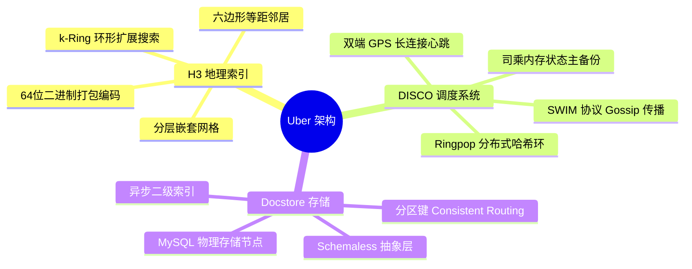
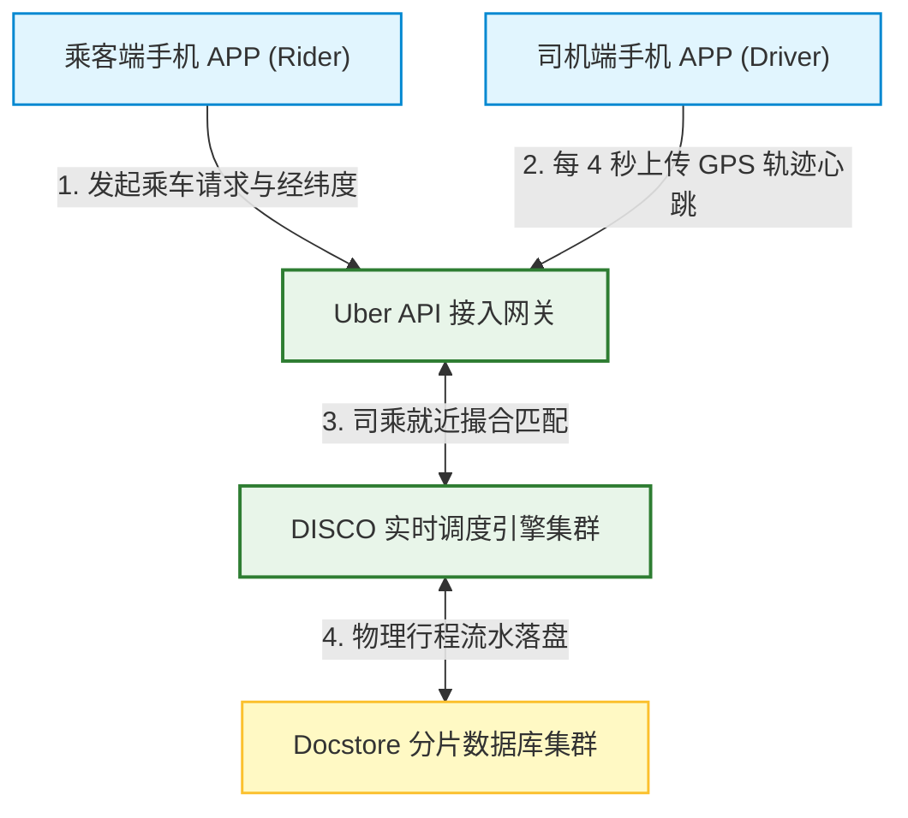
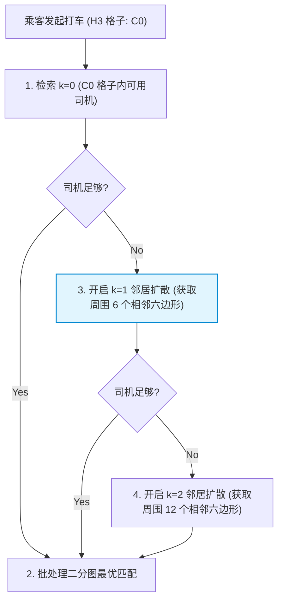
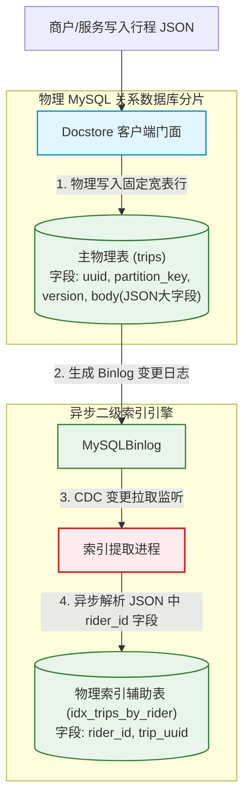
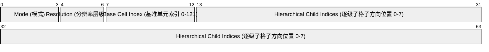

import CaseStudyHeader from '@site/src/components/CaseStudyHeader';
import DesignIntent from '@site/src/components/DesignIntent';
import EvolutionTimeline from '@site/src/components/EvolutionTimeline';
import CompareSlider from '@site/src/components/CompareSlider';
import TradeoffExplorer from '@site/src/components/TradeoffExplorer';
import GlossaryTerm from '@site/src/components/GlossaryTerm';
import ResearchNote from '@site/src/components/ResearchNote';
import GuidedExercise from '@site/src/components/GuidedExercise';
import QuizCard from '@site/src/components/QuizCard';
import MindMap from '@site/src/components/MindMap';
import PyRunner from '@site/src/components/PyRunner';

# Uber：全球实时派单撮合系统、H3 六边形地理索引与 Docstore 存储架构

<CaseStudyHeader
  oneLiner="Uber 是全球级实时调度与高频空间计算的代表。它将物理世界的供需匹配抽象为分布在对等哈希环上的微服务集群，研发了深刻改写空间计算标准的 H3 六边形分层地理索引系统。通过无中心、高容灾的 Ringpop 路由架构将司乘状态映射到区域 Owner 节点，配合基于 MySQL 强力重构的无模式 JSON 数据库 Docstore，Uber 达成了全球数千万司乘节点在毫秒级时延内的就近实时派单与千亿级行程记录的稳健落盘。"
  stats={[
    {label: '定位与类别', value: '全球级实时派单调度平台与高频地理空间计算基座'},
    {label: '空间索引技术', value: 'Uber H3 (六边形分层空间格网系统)'},
    {label: '调度网核心', value: 'DISCO 调度系统 (基于 Ringpop 的分布式哈希环调度)'},
    {label: '通信保障机制', value: 'SWIM Gossip 成员协议 + 一致性哈希分片路由'},
    {label: '存储引擎底座', value: 'Docstore (基于 MySQL 物理分片的 Schemaless JSON 数据库)'},
    {label: '网络长连架构', value: 'gRPC 流式双向通信 + WebSocket 实时期态同步'}
  ]}
/>

:::info 对应课程概念
本案例融合了以下课程核心概念：
*   **地理空间分区与检索（Month 3 索引技术）**：H3 六边形空间索引如何解决经典 GeoHash 或 R-Tree 树结构在邻居距离度量上的对角线失真。
*   **去中心化对等路由（Month 5 负载均衡）**：基于 SWIM Gossip 的自愈拓扑与一致性哈希，如何构建无 Master 单点故障的 Ringpop 实时调度环。
*   **非结构化存储模型（Month 3 数据存储）**：Docstore 架构如何在关系型 MySQL 的多副本强事务底座上，套入 Schemaless JSON 抽象层实现极速扩展。
*   **双向流式网络通信（Month 1 系统与 API）**：司乘两端高频（4 秒一次）GPS 心跳与服务端网关如何依靠 gRPC/Websocket 双向流降低连接握手开销。
:::

---

## 1. 设计初衷：攻克全球司乘“双端移动”下的秒级匹配难题

传统的出租车电调系统或地图应用是静态的，而 Uber 面临的是一个全球级的“移动竞态”：
1.  **地理计算的物理极限**：
    *   在全球范围，数百万司机每 4 秒上传一次 GPS 经纬度，数千万乘客同时在线刷图，系统必须在亚秒级内算准特定范围内的全部可用车辆、计算路径耗时、计算动态加价。
    *   传统的 `PostGIS` 关系型地理数据库依靠复杂的二维 R-Tree 索引。高频的读写冲突会导致锁页死锁，根本无法承载每秒数百万次的动态位置更新写入。
    *   为此，Uber 决定打破常规，将整个地球表面物理网格化。自研了 **H3 六边形网格空间索引系统**，把连续的经纬度直接坍缩转换为 64 位的离散整数 Hex ID，在内存中直接进行哈希检索。
2.  **派单所有权归属的单点瓶颈**：
    *   为了决定“乘客 A 应该配给哪个司机”，必须在内存里聚合乘客周边的所有车辆状态。如果状态分布在不同服务器上，跨机房调用（Network Hop）将产生可怕的延迟。
    *   如何让“某一个特定物理区域（如旧金山金融街）的全部司乘状态”绝对被路由且保存在**同一台物理服务器的内存里**？
    *   Uber 研发了基于 SWIM Gossip 的 **Ringpop 对等网络**。通过一致性哈希，将每一个 H3 六边形格子 ID 绑定到环上的 Owner 节点。所有在该格子内的司乘状态更新直接直连该节点，在单机内存中瞬间完成撮合，规避了全局数据库锁。
3.  **千亿级行程明细落盘的数据爆炸**：
    *   每次行程的 GPS 轨迹、订单、支付流水非常庞大，且随着业务演进，API 参数经常增删字段。如果用传统关系型 MySQL 频繁执行 `ALTER TABLE` 锁表迁移，会导致系统停机故障。
    *   Stripe 和 Amazon 的做法启发了 Uber：他们基于 MySQL 开发了 **Docstore**，在物理关系库上封装一层只读只写的无模式（Schemaless）JSON 数据列，既获得了 MySQL 坚固的 WAL/ACID 事务，又获得了 NoSQL 的弹性扩展。

<DesignIntent
  problem="如何设计一套能够每秒吞吐数百万次 GPS 坐标更新、消除全局数据库锁瓶颈，并在遭遇网络分区时保持区域派单功能不中断的实时空间撮合与分布式存储架构。"
  users="全球数千万日常网约车出行乘客、平台接单司机，以及致力于高频地理空间计算、高并发撮合和事务型非结构化持久化的系统架构师。"
  devices="司机端和乘客端手机 APP 通过加密双向 gRPC 流式长连接与 Location Gateway 通信，最终落盘在 Docstore 关系分片数据库中。"
  goals={[
    '亚秒级就近派单：司乘两端状态直接在网格 Owner 物理节点内存中进行聚合，完成单次撮合平均耗时控制在 50ms 以内',
    '空间邻居等距计算：通过 H3 六边形网格，消灭传统正方形网格在 diagonal（对角线）上的距离失真，平滑径向搜索算法',
    '调度网络无单点（Masterless）：依靠 Ringpop 对等 Gossip 协议，发生 20% 节点宕机时，集群能在秒级内完成哈希环拓扑自愈，保障可用性',
    '行程表架构零停机演进：Docstore 采用 JSON 大字段承载扩展字段，消灭生产环境执行 ALTER TABLE 导致的物理数据库锁死'
  ]}
  constraints={[
    'SWIM Gossip 广播的最终一致时延：节点之间的成员存活状态通过 gossip 异步传播，在节点大面积挂掉时，路由环更新存在几秒滞后，可能导致瞬间的路由失败，需要客户端库配合智能重试',
    '六边形分层嵌套的非完美对齐：六边形在几何上无法像正方形那样 100% 完美无缝嵌套（7 个小六边形合成的大六边形边缘会有微小凸凹），在进行跨分辨率空间跨越时需要特殊的近似校准算法',
    '内存状态丢失风险：由于实时撮合引擎 DISCO 在内存中维护司乘状态以保性能，一旦节点死机，内存状态会全部丢失，需要司乘手机客户端作为“状态主备份”，通过 4 秒一次的重连心跳瞬间在另一台自愈 Owner 节点上重建状态'
  ]}
  firstStep="将经纬度换算为 H3 六边形 Token 算法；建立 Ringpop 分布式哈希环及成员加入协议；编写 DISCO 派单撮合机制与批处理匹配窗口；设计 Docstore 无模式数据存取规范。"
/>

---

## 2. 知识全景脑图

### 2a. 全景架构思维导图



### 2b. 交互脑图导航

<MindMap
  root={{
    label: 'Uber 调度与存储',
    children: [
      {
        label: '空间计算与索引 (H3)',
        children: [
          { label: '六边形网格等距邻居' },
          { label: '64位编码内存级哈希' },
          { label: 'k-Ring 邻居扩散查找' }
        ]
      },
      {
        label: '调度网与路由 (DISCO)',
        children: [
          { label: 'Ringpop 去中心化自愈' },
          { label: 'SWIM 心跳与状态Owner' },
          { label: '客户端重连状态恢复' }
        ]
      },
      {
        label: '非结构化事务存储 (Docstore)',
        children: [
          { label: 'Schemaless on MySQL' },
          { label: '行锁与乐观并发控制' },
          { label: '二级索引异步构建' }
        ]
      }
    ]
  }}
/>

---

## 3. 系统架构总览 (C4 Model)

### 3a. System Context (系统上下文图)



### 3b. Container Diagram (容器结构图)

```mermaid
graph TB
  classDef gateway fill:#ffebee,stroke:#c62828,stroke-width:2px;
  classDef coordinate fill:#fff9c4,stroke:#fbc02d,stroke-width:1.5px;
  classDef dispatch fill:#e1f5fe,stroke:#0288d1,stroke-width:1.5px;
  classDef database fill:#e8f5e9,stroke:#2e7d32,stroke-width:1.5px;

  LocationIngest["司乘 GPS 数据流"] --> LocationGateway["Location Gateway网关<br/>负责高频 TCP/gRPC 长连接流式吞吐"]:::gateway
  
  LocationGateway -->|1. 解构经纬度坐标| H3Resolver["H3 空间解析器<br/>将 Lat/Lon 转换为 64位六边形 ID"]:::coordinate
  
  H3Resolver -->|2. 哈希 Ringpop 寻址路由| DiscoNodeA["DISCO 调度节点-A (旧金山金融区 Owner)"]:::dispatch
  H3Resolver -->|2. 哈希 Ringpop 寻址路由| DiscoNodeB["DISCO 调度节点-B (旧金山码头区 Owner)"]:::dispatch
  
  subgraph RingpopCluster [Ringpop 去中心化对等网络 (SWIM 协议广播)]
    DiscoNodeA <-->|3. gossip 心跳健康度比对| DiscoNodeB
  end
  
  DiscoNodeA -->|4. 达成匹配，生成行程| DocstoreClient["Docstore 存取客户端"]:::database
  
  subgraph DocstoreEngine [Docstore 事务分布式数据库]
    DocstoreClient -->|5. 分区键路由写盘| MySQLShard1["MySQL 物理分片表 1 (元数据/主行)"]:::database
    DocstoreClient -->|5. 分区键路由写盘| MySQLShard2["MySQL 物理分片表 2 (JSON 轨迹大字段)"]:::database
  end
```

---

## 4. 核心机制拆解

### 4a. H3 六边形分层网格空间索引设计

在地理信息系统（GIS）中，常用的空间划分网格有正方形和正三角形，但 Uber 却自研了六边形网格系统（H3）：
1.  **为什么是六边形？——天然的“等距邻居”**：
    *   在正方形网格下，一个网格有 8 个邻居（4 个邻接边，4 个对角线顶点）。中心点到邻接边邻居中心的距离为 1，但到对角线邻居中心的距离为 1.414。这种距离失真会导致圆形检索和扩散半径计算变得极其不均匀。
    *   而在**六边形网格**下，任意网格都有且仅有 6 个邻居。最精妙的是，**中心六边形到所有 6 个相邻六边形中心的物理距离是完全相等的**！这种几何性质使得地理圆域搜索、动态辐射扩散的复杂度直接退化为极简的离散网格步进。
2.  **分层嵌套与 64 位哈希表示**：
    *   H3 将地球表面划分为了 16 个不同分辨率（Resolution）的六边形层级。
    *   每个六边形都可以用一个 64 位无符号整数（uint64）唯一表示，编码中包含了层级分辨率、基准格子索引以及逐级子格子索引。在内存中比对和查找数据直接使用 `O(1)` 的内存哈希表，彻底终结了关系型 PostGIS 繁重的树状空间几何相交计算。

```mermaid
graph TD
  subgraph GridComparison [网格空间几何特征对比]
    subgraph SquareGrid [正方形网格 (对角线距离失真)]
      SqCenter["中心"] -->|距离 = 1.0| SqEdge["相邻正方形中心"]
      SqCenter -->|距离 = 1.414 (对角线!)| SqDiag["斜向正方形中心"]
    end
    
    subgraph HexagonalGrid [H3 六边形网格 (完美等距离邻接)]
      HexCenter["中心六边形"] -->|距离 = 1.0| HexN1["相邻 1"]
      HexCenter -->|距离 = 1.0| HexN2["相邻 2"]
      HexCenter -->|距离 = 1.0| HexN3["相邻 3"]
      HexCenter -->|距离 = 1.0| HexN4["相邻 4"]
      HexCenter -->|距离 = 1.0| HexN5["相邻 5"]
      HexCenter -->|距离 = 1.0| HexN6["相邻 6"]
    end
  end
```

---

### 4b. DISCO 分布式调度系统与 Ringpop 对等网机制

为了在内存中高速撮合，Uber 设计了分布式调度系统 **DISCO**，底层依托去中心化对等网络 **Ringpop**：
1.  **SWIM Gossip 成员关系**：
    *   没有全局的协调主节点，所有的调度节点通过对等的 SWIM（Structured Weakness Isolation Monitor）心跳协议，随机与邻居节点进行心跳包探测。
    *   新节点加入或旧节点宕机，状态会通过 Gossip 协议以指数级速度在秒级内广播至全球节点，形成一致的活跃节点视图。
2.  **一致性哈希确定 Owner**：
    *   当乘客发起打车请求时，系统算出乘客经纬度对应的 H3 六边形格子 ID（如 `85283473fffffff`）。
    *   将该格子 ID 作为 Hash Key，在 Ringpop 一致性哈希环上顺时针路由定位到对应的物理节点 Node-A。
    *   **Node-A 就是该区域唯一的“Owner 节点”**。在该六边形格子（及其附近环形网格）内行驶的所有司机的 GPS 定位数据，都会由于一致性哈希的物理指向性，被**强制路由汇聚写入到 Node-A 内存中**。Node-A 在本地内存中完成司乘匹配，实现零网络 Hopping 的极致响应。

```mermaid
graph TB
  classDef node fill:#ffebee,stroke:#c62828,stroke-width:1.5px;
  classDef app fill:#e1f5fe,stroke:#0288d1,stroke-width:1.5px;

  Rider["乘客 (旧金山金融街)"] -->|1. 算得 H3_ID: 8528_etc| Gateway["网关路由"]
  
  subgraph RingpopRing [Ringpop 分布式对等哈希环]
    Gateway -->|2. 哈希寻址指向唯一 Owner 节点| DiscoNodeA["DISCO 节点 A (旧金山金融街 Owner)"]:::node
    DiscoNodeB["DISCO 节点 B"]:::node
    DiscoNodeC["DISCO 节点 C"]:::node
    
    DiscoNodeA <-->|SWIM Gossip 同步活跃节点视图| DiscoNodeB <--> DiscoNodeC
  end

  Driver1["附近司机 1"] -->|3. 4秒 GPS 上传心跳| DiscoNodeA
  Driver2["附近司机 2"] -->|3. 4秒 GPS 上传心跳| DiscoNodeA
  
  Note over DiscoNodeA: 4. 在节点 A 本地内存完成匹配！<br/>(无跨节点查询，亚毫秒级撮合)
```

---

### 4c. 实时派单撮合与环状检索扩散算法

当乘客发起匹配请求，Owner 节点在本地内存执行实时撮合：
1.  **批处理匹配窗口（Batching Window）**：
    *   为了全局利益最大化（如降低所有乘客的平均等待时长 ETA），调度引擎并不采用先到先得的单点撮合，而是采用每 2 秒一个窗口的**小批次撮合算法（Batch Matching）**。
    *   在这 2 秒内，收集该 H3 六边形内所有的乘客需求和可用司机，利用二分图最大匹配（Bipartite Matching / 匈牙利算法）计算出全局最优配对。
2.  **k-Ring 环形邻居检索扩散**：
    *   如果在乘客所在的 H3 格子（k=0）内没有找到可用车辆，算法会开启 **k-Ring 扩散**：
        *   第一步：查找顺时针包围的第 1 圈相邻 6 个六边形网格（k=1）。
        *   第二步：仍不足，则进一步扩散到第 2 圈相邻的 12 个六边形网格（k=2）。
    *   由于六边形等距离性质，k-Ring 相当于在离散网格里做标准的圆形同心圆向外扫描，直到凑齐足够的可用车辆完成二分图匹配算路。



---

### 4d. Docstore 数据库无模式文档存储 (Schemaless on MySQL)

Uber 的核心持久化基座是 **Docstore**，一个构建在物理 MySQL 分片上的非关系型无模式文档库：
1.  **为什么依然基于 MySQL 物理分片？**：
    *   NoSQL 数据库（如 Cassandra）抗分区强，但缺乏局部强一致事务和完善的行级行锁（Row-level Lock）机制。在行程账单结算、退款、拆账等金融级逻辑中，缺乏事务会导致灾难性的财务混乱。
    *   Docstore 底座采用 MySQL 物理集群，依靠 MySQL 极其坚固的 InnoDB 存储引擎和乐观锁/行锁，获得了强一致事務和局部高并发。
2.  **Schemaless（无模式）的 JSON 抽象层**：
    *   在物理 MySQL 中，Docstore 采用固定的宽表表结构，包含主键列、分区键列、版本列以及一个 `body` 介质列（大容量 `BLOB` 或者是 `JSON` 大字段）。
    *   应用层的任意复杂 JSON 字段（如 GPS 轨迹明细、发票信息）被直接**序列化落入 body 字段中**。API 增减字段只需在应用层修改，完全不触发物理 MySQL 表结构变更。
3.  **异步二级索引（Asynchronous Secondary Indexing）**：
    *   如果需要对 body 内部的字段进行条件筛选（例如根据乘客 ID 查历史订单），Docstore 底层引擎会通过数据库 binlog 或者是变更日志（CDC），在后台**异步将指定字段提取出来，写入到专用的物理索引 MySQL 辅助表中**，实现了强事务落盘与灵活查询的统一。



---

## 5. 关键数据结构与算法

### 5a. H3 64位索引二进制位打包格式

每一个 H3 六边形网格都可以完全用一个 64 位无符号整数（uint64）唯一编码，其内存布局极致紧凑：


*   **0-3位**：表示 H3 索引模式（如普通六边形网格还是定向边缘）。
*   **4-6位**：记录当前的分辨率层级（Resolution 0 到 15）。
*   **7-12位**：表示在地球表面划分的 122 个最初始的“基准五边形/六边形（Base Cells）”的位置索引。
*   **13-63位**：以每 3 位为一个二进制位元组（Octal Digit），自高分辨率到低分辨率逐级记录子格子在其父格子内部的相对方向位置（0 至 7）。这使得判断两个格子是否具有父子嵌套关系，在内存中直接使用极快的位运算（Bitwise Shift / Mask）即可完成，极大地节省了计算开销。

---

### 5b. k-Ring 环形邻居搜索算法

六边形坐标系通常采用轴向坐标（Axial Coordinates）或立方坐标（Cubic Coordinates）来快速计算空间邻居：
*   **轴向坐标系表示**：每个六边形用 `(q, r)` 表示。
*   **邻居方向偏移数组**：
    `offsets = [ (+1, 0), (+1, -1), (0, -1), (-1, 0), (-1, +1), (0, +1) ]`
*   **k-Ring 边界计算**：
    要获取格子 `(q0, r0)` 在半径为 `k` 的所有邻居，只需在轴坐标系中执行二重向量循环求和，其过滤出的网格中心点距离绝对等于 `k`，不需要像正方形坐标系那样使用昂贵的欧式几何平方根距离过滤。

---

### 5c. SWIM 成员协议与 Gossip 心跳传播机制

DISCO 的对等自愈依靠 **SWIM** 协议控制：
1.  **探测周期**：每个节点 Node-A 以固定周期随机挑选一个 Peer Node-B，发送 `PING` 请求。
2.  **间接探测 (PING-REQ)**：若 Node-B 发生卡顿超时未回复，Node-A 会随机挑选另外 3 个 Peer，向它们发送 `PING-REQ(Node-B)`，让它们帮忙转发探测请求（防止因为 Node-A 自己局部断网误判 Node-B 挂掉）。
3.  **怀疑与宣告 (Suspicion Mechanism)**：如果依然收不到回复，Node-B 被标记为 `Suspect` 状态，此怀疑状态通过 Gossip 异步扩散。如果在设定超时内 Node-B 仍不发送心跳自证清白，它会被判定为下线，全网哈希环更新路由节点，彻底移除 Node-B。

---

## 6. 架构演进史

Uber 的空间计算和数据存储架构，深刻影响了出行科技和非结构化事务存储领域：

<EvolutionTimeline
  events={[
    {
      year: '2010',
      title: 'Monolith Python 与 Postgres 派单 v1',
      why: '业务在旧金山刚刚起步，快速验证 MVP 是第一要务，传统的单体关系库足以承载最初少量的司乘撮合。',
      change: '构建了单体 Python 应用程序；采用 PostgreSQL 的 PostGIS 扩展作为高频空间坐标更新存储，读写锁冲突瓶颈初显。'
    },
    {
      year: '2014',
      title: 'DISCO Node.js 时代与 Schemaless 诞生',
      why: '业务量呈百倍爆发，司乘两端的高频 GPS 更新把 Postgres 彻底击垮（读写锁导致严重死锁挂起）；频繁更改表字段导致严重的停机损失。',
      change: '将调度重构为基于 Node.js 异步 IO 的分布式撮合网（DISCO），引入去中心化 Ringpop 对等哈希环路由状态；开发了基于 MySQL 分片列存储大 JSON 的“无模式（Schemaless）”自研数据库抽象层。'
    },
    {
      year: '2018',
      title: 'H3 六边形地理空间索引开源',
      why: '原有的正方形切片网格（GeoHash / Google S2）在进行司乘径向圆距离搜索和热点扩散时，由于对角线对角线偏差大，计算效率低且不均。',
      change: '开源了历时数年研发的 H3 空间计算框架，用内存六边形等距离分片算法替代了传统的二维几何计算，直接定义了全球网约车地理索引的技术标准。'
    },
    {
      year: '2020 至今',
      title: 'Go 语言重构 Docstore 金融账本稳落盘',
      why: '早期的 Node.js 内存占用偏大、单线程计算遇到瓶颈；原有的 Schemaless 数据库在处理多行事务、异步二级索引、跨区查询时开发繁琐。',
      change: '用 Go 语言重构整个调度底座；将 Schemaless 演进升级为强事务文档数据库 Docstore，支持原子行锁与后台 binlog CDC 异步构建二级物理索引表，支撑万亿行程轨迹。'
    }
  ]}
/>

---

## 7. 架构对比：传统的 square 地图索引 (S2/GeoHash) vs. H3 六边形等距网格系统 (Uber)

<CompareSlider
  before={
    <div style={{ padding: '20px', background: '#ffebee', border: '1px solid #c62828', borderRadius: '8px', height: '100%', color: '#333' }}>
      <strong>正方形空间索引 (GeoHash / Google S2)</strong>
      <p style={{ marginTop: '10px', fontSize: '0.9rem' }}>基于正方形格子划分空间。虽然层级嵌套非常完美（一个父正方形可以无缝切分为四个子正方形），但在邻居距离计算上存在严重短板：对角线邻居距离远大于边相邻邻居。在做圆形派单范围计算时，产生明显的边界变形与计算冗余开销。</p>
    </div>
  }
  after={
    <div style={{ padding: '20px', background: '#e8f5e9', border: '1px solid #2e7d32', borderRadius: '8px', height: '100%', color: '#333' }}>
      <strong>H3 六边形分层格网空间索引</strong>
      <p style={{ marginTop: '10px', fontSize: '0.9rem' }}>基于六边形网格划分空间。中心格子到其周围全部 6 个方向相邻格子的中心点物理距离完全相同，完美拟合圆形扩散。虽然分层嵌套时存在微小的边缘凸凹，但在做距离计算、ETA 匹配、k-Ring 半径辐射检索时，运算速度获得指数级提升。</p>
    </div>
  }
  labels={['正方形索引', 'H3 六边形格网']}
/>

---

## 8. 设计模式与课程映射

本案例在实际全球大并发空间派单与大容量文档存储中，深度应用了以下课程章节中的核心设计模式与技术：

1.  **六边形空间分片模式**（参见 [存储与检索](../03-data-cache-queue/storage-engines.mdx) 章节）：
    *   H3 将连续的空间坐标（Float 经纬度）坍缩打包为离散的 64 位整型，是存储章节中“值域离散化与空间分桶（Bucket Partition）”的极致工程实现，大幅优化了索引性能。
2.  **去中心化对等路由模式**（参见 [共识与分布式协调](../05-core-components/consensus-coordination.mdx) 章节）：
    *   Ringpop 采用的一致性哈希 Owner 绑定、以及用 SWIM Gossip 协议自愈节点视图的设计，与分布式系统下的“哈希无主分区（Masterless Partitioning）”完全对应。
3.  **无模式数据库门面**（参见 [数据库系统与存储](../03-data-cache-queue/storage-engines.mdx) 章节）：
    *   Docstore 在关系型 MySQL 表之上包装只读 JSON body 的结构，应用了“门面模式（Facade Pattern）”，屏蔽了物理表执行 ALTER 时的数据库锁表风险，兼顾了事务与弹性。
4.  **长连接双向流代理模式**（参见 [分布式网络与通信](../05-core-components/load-balancing.mdx) 章节）：
    *   司乘两端通过 gRPC 双向流与 Location Gateway 传输 GPS 帧，是“双向多路复用（Multiplexing）”网络设计的经典案例，大幅度消除了网络握手头开销。

---

## 9. 权衡：地理计算系统中的架构抉择

Uber 在几何对称性、数据分片路由时延以及底层数据事务正确性之间做出了以下妥协：

<TradeoffExplorer
  title="Uber 地理计算与分布式存储架构权衡"
  dimensions={['圆形邻居搜索等距离度量', '空间层级无凸凹嵌套率', '司乘高并发写内存低延迟', '行程账单多表一致事务度', '集群成员拓扑更新同步实时性']}
  options={[
    {
      name: 'H3 六边形网格 + Ringpop 内存调度 + Docstore MySQL 物理底座 (Uber 模式)',
      scores: [5, 2, 5, 5, 2],
      note: 'H3 赋予了系统顶级的等距圆形邻居搜索效率，DISCO 在内存中执行撮合保证了极致低延迟，Docstore 基于 MySQL 强力支撑了支付事务。代价是六边形在层级跨越嵌套时会有边缘凸凹偏差，且 Ringpop 的 SWIM gossip 活跃视图同步存在最终一致滞后性，实例故障时会有几秒路由闪断。',
      whenToUse: '全球出行调度、O2O 即时配送、要求极快就近空间匹配且底层订单需要强行 ACID 事务的复杂高并发业务。'
    },
    {
      name: 'Google S2 正方形网格 + CP 一致性 ZooKeeper 路由 + 纯 Cassandra 存储',
      scores: [2, 5, 3, 2, 5],
      note: '利用正方形网格实现了 100% 完美的无缝层级嵌套，依靠 ZooKeeper 强一致维护路由表，避免了脑裂时路由出错。但缺点是正方形对角线距离失真大，导致空间搜索运算慢；且 NoSQL Cassandra 缺乏行级锁，在处理大容量复杂的行程账务时易产生数据不一致。',
      whenToUse: '高精度地图测绘、大范围空间覆盖计算、纯只读检索多过写事务、且对接口时戳一致性有严苛要求的地理数据底座。'
    },
    {
      name: 'PostgreSQL PostGIS 关系表存储 + Nginx 集中式路由调度',
      scores: [3, 4, 1, 5, 5],
      note: '基于经典的 R-Tree 二维空间几何相交计算，提供极其标准和高精度的 PostGIS 地理空间 SQL 事务查询，路由逻辑简单集中。但在遇到每秒数百万次的动态位置更新写入时，其数据库页锁冲突会导致高昂的 IO 挂起卡锁，完全无法承受大并发高弹性。',
      whenToUse: '局域网或中低流量空间资产监控系统、数据表关系极其紧密且写请求稀疏、对实时高并发没有极端需求的后台管理应用。'
    }
  ]}
/>

---

## 10. 如果是你来设计：六边形空间格网邻居探索与距离仿真器

### 场景设想
在 Uber 的 H3 地理空间计算底层：
*   我们要模拟六边形网格的等距邻接特征。
*   轴向坐标系（Axial Coordinates）是用 `(q, r)` 表示六边形的核心。对于任意中心格子 `(q, r)`：
    *   它的 6 个相邻邻居的相对坐标偏移量分别为：
        `offsets = [(+1, 0), (+1, -1), (0, -1), (-1, 0), (-1, +1), (0, +1)]`
*   我们要实现两个核心算法：
    1.  `get_neighbors(q, r)`：获取某个格子的第一圈相邻的 6 个邻居。
    2.  `calculate_distance(q1, r1, q2, r2)`：使用六边形轴向距离公式计算两个网格间的“曼哈顿格网距离”。
        `Distance = ( |q1 - q2| + |r1 - r2| + |(q1 + r1) - (q2 + r2)| ) / 2`
    3.  验证所有 6 个邻居到中心格子的格网距离**完全相等（且都等于 1）**，以此证明六边形等距离的绝妙物理特征。

请你用 Python 实现这套经典的六边形地理格网探索与等距校验引擎。

<GuidedExercise
  title="基于 Python 的 H3 六边形网格等距探索仿真"
  goal="实现六边形轴坐标位置解析、第一圈（k-Ring）邻居坐标计算、以及格网距离验证，证明相比正方形的对角线失真，六边形所有邻居到中心距离完全恒定为 1 的几何优势。"
  steps={[
    '步骤 1: 设计 HexCell 类，包含轴向坐标 `q` 和 `r`，并能计算三维立方坐标辅助值 `s = -q - r`。',
    '步骤 2: 实现 `get_neighbors()` 方法。利用偏移数组 `offsets`，计算出当前 HexCell 顺时针方向围绕的 6 个相邻格子坐标。',
    '步骤 3: 实现 `calculate_grid_distance(cell1, cell2)` 距离算法。根据六边形轴距计算公式，算出两个 HexCell 之间的最少步数。',
    '步骤 4: 执行等距验证。随机设定中心点坐标（如 `(3, -5)`），获取它的 6 个第一圈邻居，物理计算每个邻居到中心点的距离。',
    '步骤 5: 校验是否所有邻居的计算结果均绝对等于 1。若是，则打印“等距性验证成功”，证明不需要复杂的平方根浮点数学运算，即可在 O(1) 内算出径向圆范围。'
  ]}
  checks={[
    '确认在获取 `(0, 0)` 的邻居时，输出了 6 个相邻的六边形轴坐标',
    '验证 6 个相邻六边形到中心格子的 H3 网格距离物理计算结果全都是 1',
    '确认当控制台打印出“✅ H3 六边形等距邻接与网格扩散验证成功！”字样时，模拟器工作正常'
  ]}
/>

#### 交互式 Python 运行实验
在下方控制台中直接运行或修改已准备好的 H3 六边形邻居探索与等距验证仿真代码：

<PyRunner
  expect="H3 六边形等距邻接与网格扩散验证成功"
  rows={25}
  code={`class HexCell:
    def __init__(self, q, r):
        # 轴向坐标系: q 代表列, r 代表行
        self.q = q
        self.r = r

    def get_neighbors(self):
        # 六边形轴向坐标的 6 个方向相对偏移量 (顺时针)
        offsets = [
            (1, 0),   # 东北
            (1, -1),  # 正东
            (0, -1),  # 东南
            (-1, 0),  # 西南
            (-1, 1),  # 正西
            (0, 1)    # 西北
        ]
        neighbors = []
        for dq, dr in offsets:
            neighbors.append(HexCell(self.q + dq, self.r + dr))
        return neighbors

    @staticmethod
    def calculate_grid_distance(c1, c2):
        # 六边形曼哈顿轴距计算公式：
        # 相比欧氏距离，只需极其廉价的整型加减法，消除了平方根开方浮点损耗！
        dq = c1.q - c2.q
        dr = c1.r - c2.r
        return (abs(dq) + abs(dr) + abs(dq + dr)) // 2

    def __repr__(self):
        return f"Hex({self.q}, {self.r})"

# 测试开始
center = HexCell(0, 0)
neighbors = center.get_neighbors()

print("--- 步骤 1: 获取 Hex(0, 0) 周围的所有相邻六边形坐标 (k-Ring = 1) ---")
for i, n in enumerate(neighbors):
    print(f"  方向 {i+1}: {n}")

print("\\n--- 步骤 2: 计算这 6 个邻居到中心格子的 H3 网格曼哈顿距离 ---")
distances = []
for n in neighbors:
    dist = HexCell.calculate_grid_distance(center, n)
    distances.append(dist)
    print(f"  距离 {center} 到 {n} = {dist}")

# 随机指定一个远端格子，验证距离算法
print("\\n--- 步骤 3: 验证随机远端格子间的最短网格距离 ---")
c1 = HexCell(2, -3)
c2 = HexCell(-1, 2)
far_dist = HexCell.calculate_grid_distance(c1, c2)
print(f"  远端格子 {c1} 到 {c2} 的最短步数: {far_dist} 步")

# 自我校验
# 1. 第一圈邻居到中心距离必须全部恒等于 1 (等距性质)
# 2. 远端格子距离必须计算正确
all_neighbors_are_one = all(d == 1 for d in distances)
if all_neighbors_are_one and far_dist == 5:
    print("\\n[✅ 验证成功]: H3 六边形等距邻接与网格扩散验证成功！")
else:
    print("\\n[❌ 验证失败]")
`}
/>

---

## 11. 常见误解

### 误解 1：H3 六边形网格既然支持多分辨率分层（Resolution 0-15），那么高分辨率的小六边形一定可以完美无缝地拼合成低分辨率的父六边形
*   **澄清**：这是几何学上的绝对误区（常被正方形/GeoHash 完美嵌套误导）。
    1.  在数学上，**多个小六边形是绝对无法完美无缝地拼装嵌套组成一个大六边形的**（它们的边缘一定会有参差不齐的锯齿状重叠与缝隙）。
    2.  H3 通过引入 **“近似嵌套 / Approximate Hierarchy”** 解决了这个问题。它通过将 7 个子六边形的质心对齐合并到一个大六边形中，但在物理边界上存在微小的偏移。
    3.  因此，在 H3 中进行跨分辨率空间跳转（如从小单元聚类到大单元以计算热点）时，不能直接使用父子集合包含的等价代数判定，而必须通过 H3 库函数自带的中心邻接坐标映射算法执行，其几何学嵌套并非 100% 绝对边界重合。

### 误解 2：司乘端上传的 GPS 坐标是实时的，所以 Uber 服务端 Owner 节点内存里的司机位置绝对是当前司机的精确物理位置
*   **澄清**：这忽视了网络物理延迟和心跳周期的存在。
    1.  司机端 APP 默认每 4 秒上传一次最新的 GPS 坐标，数据从手机基站传输到 API 网关、再路由到 Owner 节点内存，整个链路最快也需要数百毫秒。
    2.  这意味着，Owner 节点在内存里执行二分图派单撮合时，使用的**全都是最多 4 秒以前的“历史影子状态（Stale State）”**。
    3.  如果在这 4 秒的真空期内，司机在高速公路上突然掉头或者转弯驶入单行道，Owner 节点算出来的 ETA（预计到达时间）和撮合匹配可能就会发生偏差。因此，调度系统在匹配成功后，必须允许两端通过长连接再次二次握手确认（Accept/Decline），而不是强行锁定强制匹配。

### 误解 3：Docstore 基于 MySQL 关系数据库分片来存储 JSON，其性能和高并发吞吐能力一定远逊于原生的 NoSQL 数据库（如 Cassandra 或 MongoDB）
*   **澄清**：这属于教条的选型偏见。
    1.  原生的 NoSQL 数据库在海量写吞吐上极佳，但由于缺乏行级行锁（Row Lock）和乐观并发控制，无法防止扣款/行程差账等金融级逻辑中常见的“写覆盖（Lost Update）”和并发篡改异常。
    2.  Docstore 通过将行物理分片到不同的物理 MySQL 实例上，将并发压力均匀分散。InnoDB 存储引擎拥有工业界最成熟、高度优化的 B+ 树物理引擎，其单点写入延迟被精细卡限在毫秒级内。
    3.  配合 Debezium / Binlog CDC 的**异步二级索引构建**，Docstore 成功将“核心事务写”和“复杂索引读”在物理上解耦，不仅保证了绝对的财务事务正确性，其并发写吞吐也完全达到了万亿级的高可靠性，证明了基于 MySQL 关系内核套上 NoSQL 门面能获得极佳的化学反应。

---

## 12. 知识自测

<QuizCard
  questions={[
    {
      q: '在网约车调度场景中，为什么 H3 空间索引采用“六边形网格”而不是传统地图中常见的“正方形网格（如 GeoHash）”？',
      options: [
        'A. 因为六边形网格的数据更容易进行 Gzip 压缩，从而节省 S3 存储开销',
        'B. 因为六边形具有完美的“等距离邻接”几何性质，中心六边形到周围 6 个相邻方向六边形中心点的物理距离绝对相等；而正方形邻居存在对角线距离远长于边邻居的对角线失真，导致圆形派单扩散计算缓慢且不均',
        'C. 因为手机屏幕的像素在物理上是用六边形晶格组成的',
        'D. 为了防止 Docker 容器在后台发生写时复制导致的内存穿透'
      ],
      answer: 1,
      explain: '这是 H3 的几何学核心动因。等距离邻居使得空间圆形扩散搜索（k-Ring）退化为纯整数计算，避免了正方形对角线对角线距离失真引发的浮点数开方运算，使得派单匹配在内存中能快上百倍。'
    },
    {
      q: '在 DISCO 调度引擎中，司乘的状态直接维护在节点的内存中。一旦某台物理节点突然死机，这部分内存状态丢失后，Uber 是如何保障数据自愈、重新建立这部分状态的？',
      options: [
        'A. 系统立刻终止该区域所有的打车服务，退回单体 Oracle 模式',
        'B. 系统使用 2PC 分布式事务，强行从远端的 Docstore 数据库同步拉取 4 秒内所有的 GPS 轨迹记录重建',
        'C. 司乘两端的手机客户端 APP 在物理上充当了“状态主备份”：手机 APP 探测到连接断开后会自动重连新 Owner 节点，并在下一次 4 秒的心跳包中强行带上当前所有的会话状态，瞬间在内存中重建 Owner 节点视图',
        'D. 依靠 Merkle Tree 逆熵机制在全球所有物理机之间进行 Gossip 全量广播'
      ],
      answer: 2,
      explain: '这是典型的“去中心化弹性恢复”设计。不依赖脆弱的中心数据库重建状态，而是直接将“边缘设备（手机 APP）”作为事实的主备份源。重连握手时由客户端带上状态重建 Owner 内存，实现了完美的轻量级快速故障自愈。'
    },
    {
      q: 'Docstore 数据库无模式存储方案中，它是如何实现在“不执行物理 MySQL 的 ALTER TABLE 锁表迁移”的前提下，允许行程明细表自由新增和删除复杂属性字段的？',
      options: [
        'A. 将每一行的属性字段拆分存入上万张不同的物理小表中',
        'B. 在 MySQL 数据库中强制加载了 Pyodide 离线解释器，在数据库内部用 Python 动态执行 AST 翻译',
        'C. 物理表结构始终保持固定宽表（主键、分区键、版本及一个大 body JSON 字段列），应用层的复杂字段直接序列化为 JSON 大字段塞入 body 中存储；后台通过 binlog 日志异步解析字段并写入索引辅助表以支持复杂条件检索',
        'D. 强制要求所有商户在写入数据前将数据转换成 Git 对象的 DAG 格式'
      ],
      answer: 2,
      explain: '这就是 Schemaless on MySQL 的精髓。表结构始终固定，对 body JSON 列读写完全免去了锁表大灾难。异步辅助表设计又完美保障了二级索引的检索效率，兼顾了关系型事务的稳固和 NoSQL 的开发敏捷度。'
    }
  ]}
/>

---

## 来源清单

*   [Brodsky, A. (2018), H3: Uber\'s Hexagonal Hierarchical Spatial Index (Uber Engineering Blog / GitHub)](https://www.uber.com/en-US/blog/h3/)
*   [Hagerty, M. (2014), Ringpop: Node.js library for gossip-based cluster membership & consistent hashing (Uber GitHub)](https://github.com/uber/ringpop-node)
*   [Uber Engineering Blog: Designing Docstore: Uber\'s transactional Schemaless database built on MySQL Go](https://www.uber.com/en-US/blog/docstore-migration/)
*   [SWIM Membership Protocol Spec: Gossip-based cluster membership and fault detection (ACM/IEEE)](https://ieeexplore.ieee.org/document/1018261)
