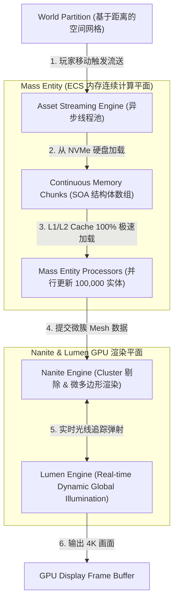
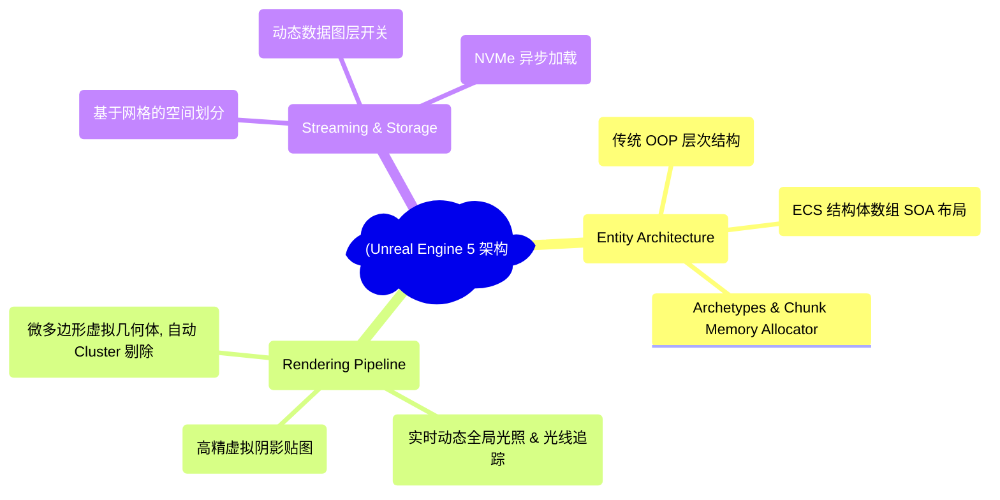
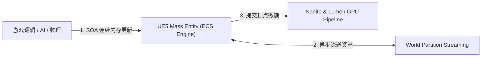
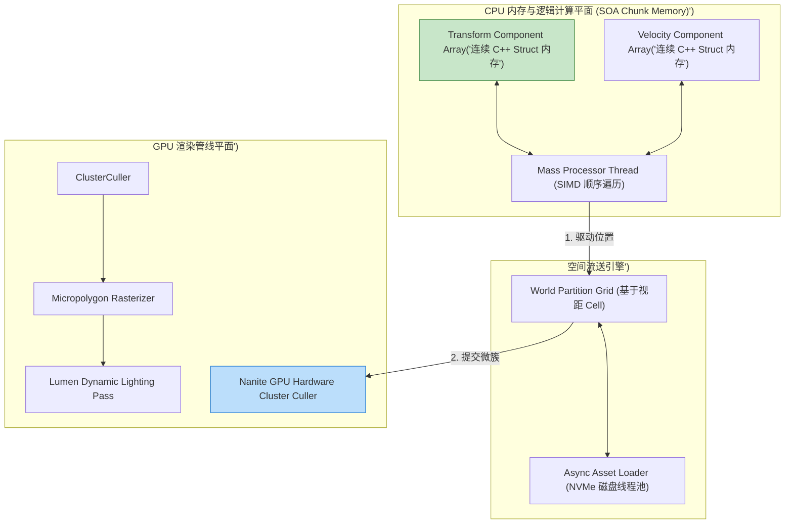
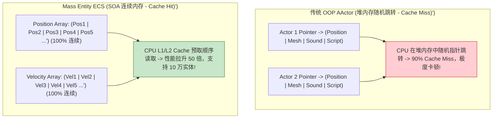
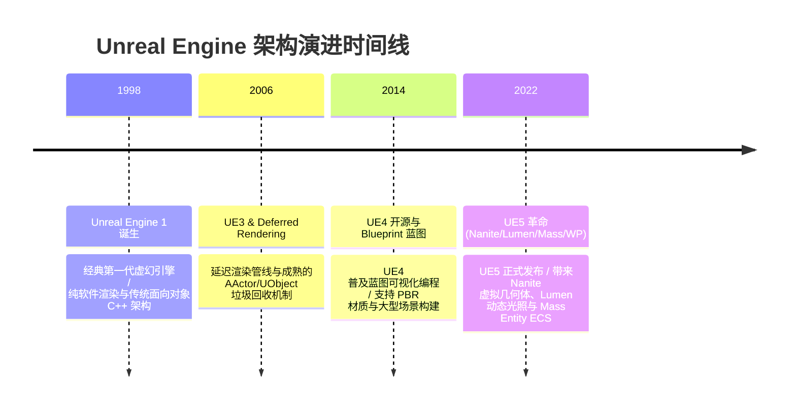

import CaseStudyHeader from '@site/src/components/CaseStudyHeader';
import DesignIntent from '@site/src/components/DesignIntent';
import ArchitectureEvolution from '@site/src/components/ArchitectureEvolution';
import TradeoffExplorer from '@site/src/components/TradeoffExplorer';
import GlossaryTerm from '@site/src/components/GlossaryTerm';
import ResearchNote from '@site/src/components/ResearchNote';
import QuizCard from '@site/src/components/QuizCard';
import CompareSlider from '@site/src/components/CompareSlider';
import GuidedExercise from '@site/src/components/GuidedExercise';
import PyRunner from '@site/src/components/PyRunner';

# Unreal Engine 5：ECS 架构、Nanite/Lumen 渲染与资产流送

<CaseStudyHeader
  oneLiner="Unreal Engine 5 (虚幻引擎 5) 针对数万同屏物理实体计算、数十亿面超高精度 3D 资产渲染与无缝开放世界的物理极限，打破了传统 OOP 面向对象与离线烘焙光照的瓶颈，推出了‘Mass Entity (ECS) 数据驱动架构’、‘Nanite 虚拟几何体’与‘World Partition 动态资产流送’，定义了现代 3D 引擎的最高标准。"
  stats={[
    {label: '实体架构革新', value: 'Mass Entity (ECS 结构体数组 SOA 内存布局)'},
    {label: '虚拟几何体', value: 'Nanite (Micropolygon 软硬件结合集群剔除)'},
    {label: '动态全局光照', value: 'Lumen (Real-time Dynamic GI & Ray Tracing)'},
    {label: '开放世界流送', value: 'World Partition (基于网格的无缝 Asset Streaming)'},
    {label: '反射机制底座', value: 'UProperty / Garbage Collection & Reflection System'}
  ]}
/>

:::info 对应课程概念
本案例横跨 [Month 2 内存连续性布局与 CPU Cache Line (SOA 结构体数组)](../foundations/programming-systems-primer)、[Month 5 渲染管线、虚拟化几何体与视锥体剔除 (Frustum Culling)](../cloud-enterprise-industrial/capstone-cloud-native)、[Month 8 大规模无缝开放世界 World Partition 资产异步流送](../cloud-enterprise-industrial/capstone-cloud-native)。它是游戏引擎架构师与图形学专家研究现代 3D 引擎系统设计与硬件极限优化的标杆教案。
:::

## 1. 设计初衷：如何突破传统面向对象与 LOD 瓶颈实现数万实体与无限细节渲染？

在传统 3D 游戏引擎（如早期的 UE4 或 Unity）中，游戏开发长期受制于两项物理瓶颈：
1. **面向对象（OOP）AActor 的 CPU Cache Miss 灾难**：在传统引擎中，每一个游戏对象都是一个复杂的 C++ 类（如 `AActor`），包含了位置、材质、音效、网格等大量指针。当场景中有 10,000 个士兵单位需要更新位置时，CPU 必须沿着指针在堆内存中随机跳转（Pointer Chasing），引发高达 90% 的 **CPU Cache Miss**，CPU 算力严重空转。
2. **离线烘焙光照与手动 LOD（Level of Detail）的开发地狱**：美工需要为每一个 3D 模型手动制作 4-5 个不同精度的 LOD 模型（近处高精、远处粗糙）；且静态光照需要数小时物理烘焙。这不仅极度消耗人力，而且在动态破坏场景中光影瞬间失真。
3. **海量高精资产引发的 GPU 显存爆仓**：一个包含数十亿面数的多边形电影级资产无法直接全部塞入 GPU 显存，导致传统引擎必须频繁降级贴图质量。

Unreal Engine 5 的核心设计用意在于：**引入 <GlossaryTerm term="Mass Entity (ECS 架构)" definition="Mass Entity (ECS 架构)：UE5 引入的数据驱动实体组件系统 (Entity Component System)。将数据 (Component) 与行为 (System) 完全分离，使用 SOA (Struct-of-Arrays) 连续内存布局。更新数万个实体时，CPU 可极速连续读取 Cache Line，性能较传统 AActor 提升 50 倍。">Mass Entity (ECS 架构)</GlossaryTerm>、<GlossaryTerm term="Nanite 虚拟几何体" definition="Nanite 虚拟几何体：UE5 的革命性渲染技术。它能自动将数十亿多边形模型切分为微小的 Cluster (软簇)，并在 GPU 上进行实时视锥体与遮挡剔除，仅渲染像素级别大小的微多边形 (Micropolygons)，彻底取消了手动 LOD 制作。">Nanite 虚拟几何体</GlossaryTerm> 与 World Partition 动态流送**。
- **Mass Entity (ECS 数据驱动)**：彻底放弃 `AActor` 指针链。将实体的 Transform、Velocity 拆分为极简的 C++ Struct，并集中存储在连续的内存 Chunk 中。CPU 在执行 Batch 处理时拉满 **L1/L2 Cache 命中率**，单线程即可轻松驱动 100,000 个同屏 AI 实体。
- **Nanite 虚拟化几何体**：在 GPU 渲染管线中建立微多边形软硬件剔除。无论是几百面的简单模型，还是几百亿面的数码扫描雕塑，Nanite 都能在毫秒内剔除不可见的微簇，始终保持只渲染当前屏幕像素大小的三角形。美工再也不需要制作 LOD！
- **Lumen 动态全局光照**：通过混合硬件光线追踪（Hardware Ray Tracing）与软件距离场（Distance Fields），实现间接光照与多次弹射（Infinite Bounce）的毫秒级实时计算。
- **World Partition 无缝资产流送**：将无限大的世界划分为二维 Grid。随着玩家移动，后台异步 Worker 线程自动从 NVMe 硬盘加载近处网格的显存与纹理，并卸载远处网格，做到无缝无卡顿探索。



<DesignIntent
  problem="如何构建一个能高效驱动 100,000 个同屏实体（Mass Entity）、无缝流送百 GB 级开放世界（World Partition）并实现数十亿面数无 LOD 渲染（Nanite）的现代 3D 游戏引擎？"
  users="3D 游戏引擎架构师、AAA 游戏 C++ 核心工程师、实时渲染图形学专家与影视特效技术总监。"
  devices="支持 DirectX 12 / Vulkan 的现代独立显卡 (GPU)、多核 CPU、NVMe 固态硬盘与 PC/Consoles 游戏主机。"
  goals={[
    'Mass Entity 性能提升 50 倍：采用 SOA 连续内存布局，L1/L2 Cache 极速命中，支撑 10 万同屏 AI。',
    'Nanite 彻底取消 LOD：自动切分微簇，仅渲染像素级微多边形，渲染效率与面数物理解耦。',
    'Lumen 实时光影：支持动态场景光照与间接光弹射，彻底告别耗时的离线光照烘焙。',
    'World Partition 无缝流送：根据玩家视距异步加载解耦 3D 资产，消除地图加载切包界面。'
  ]}
  constraints={[
    'Mass Entity 与传统 UObject 垃圾回收的碰撞：Mass Entity 避开了 UObject 机制，无法直接利用 Unreal 的自动 GC 与蓝图（Blueprint）绑定，需要编写专门的桥接器（Mass-to-Actor Bridge）。',
    'Nanite 对半透明与变形网格（Deformable Meshes）的限制：Nanite 目前主要针对刚体网格（Static Meshes），对于带有复杂骨骼动画的皮肤（Skeletal Mesh）或半透明材质，仍需退回传统渲染管线。'
  ]}
  firstStep="剖析 传统 AActor OOP 结构 vs Mass Entity (ECS) SOA 内存布局对比；分析 Nanite Cluster 剔除与 World Partition 流送机制；用 Python 编写一个包含 SOA 连续内存布局、CPU Cache 命中模拟与基于距离的资产流送仿真器。"
/>

## 2. 系统功能全景



---

## 3. 最新架构总览

UE5 中 Mass Entity 数据流与 Nanite/Lumen 渲染管线拓扑结构如下：

### 3a. System Context (系统上下文)



### 3b. Container Diagram (容器架构)



---

## 4. 核心机制拆解

### 4a. 传统 OOP AActor vs Mass Entity (ECS) SOA 内存布局对比

传统面向对象堆内存随机跳转引发 90% CPU Cache Miss；而 Mass Entity 将相同 Component 连续排列在内存中，CPU 顺序读取拉满 Cache 命中率：



### 4b. World Partition 动态资产流送原理

在拥有 100km x 100km 开放世界的游戏场景中：
1. **空间网格切割**：世界被切割为多个 128m x 128m 的 Grid Cells。
2. **基于玩家视距的加载半径（Loading Range）**：设置玩家圆心加载半径为 500 米。只有处于 500 米以内的 Cells 才由后台 `Async Asset Streamer` 从 NVMe 硬盘加载 Mesh 和 Texture；超出的 Cells 自动从内存卸载。显存占用始终保持平稳。

---

## 5. 关键数据结构与算法：SOA 结构体数组连续更新与空间网格流送

以下是 UE5 Mass Entity 在 C++ / Python 中实现 SOA 连续内存更新与基于距离的资产流送核心算法：

```cpp
#include <iostream>
#include <vector>
#include <cmath>

// 传统 AOS (Array of Structs) - 容易导致 Cache Miss
struct ActorAOS {
    float x, y, z;       // 12 bytes
    float vx, vy, vz;     // 12 bytes
    char dummy_data[128]; // 大量其他不相关数据
};

// UE5 Mass Entity 使用的 SOA (Struct of Arrays) - 高度 CPU Cache 亲和！
struct TransformComponent {
    float x, y, z;
};

struct VelocityComponent {
    float vx, vy, vz;
};

class MassEntityChunk {
public:
    // 连续存储在内存中的向量块 (100% 物理连续)
    std::vector<TransformComponent> transforms;
    std::vector<VelocityComponent> velocities;

    void Reserve(size_t count) {
        transforms.resize(count);
        velocities.resize(count);
    }

    // 顺序更新 CPU L1/L2 Cache 命中率接近 100%！
    void ParallelBatchUpdate(float delta_time) {
        size_t size = transforms.size();
        for (size_t i = 0; i < size; ++i) {
            transforms[i].x += velocities[i].vx * delta_time;
            transforms[i].y += velocities[i].vy * delta_time;
            transforms[i].z += velocities[i].vz * delta_time;
        }
    }
};
```

---

## 6. 架构演进史



---

## 7. 架构对比

### 传统 AActor 面向对象体系 vs UE5 Mass Entity (ECS)

<CompareSlider
  before={
    <div style={{ padding: '20px', background: '#ffebee', border: '1px solid #c62828', borderRadius: '8px', height: '100%', color: '#333' }}>
      <strong>传统 AActor 面向对象体系</strong>
      <p style={{ marginTop: '10px', fontSize: '0.9rem' }}>
        数据与代码绑定。堆内存指针跳转频繁，引发严重的 CPU Cache Miss，同屏超过 2,000 实体即开始卡顿。
      </p>
    </div>
  }
  after={
    <div style={{ padding: '20px', background: '#e8f5e9', border: '1px solid #2e7d32', borderRadius: '8px', height: '100%', color: '#333' }}>
      <strong>UE5 Mass Entity (ECS) 体系</strong>
      <p style={{ marginTop: '10px', fontSize: '0.9rem' }}>
        数据与行为彻底分离。SOA 连续内存布局，CPU 预取 100% 命中，轻松支撑 100,000 同屏 AI 实体。
      </p>
    </div>
  }
  labels={['传统 AActor (Pointer Chasing / Cache Miss)', 'Mass Entity ECS (SOA 连续内存 / 50x 提升)']}
/>

---

## 8. 核心决策的取舍

在基于 Unreal Engine 5 开发大型游戏与实时仿真系统时，架构师对实体架构（AActor OOP vs Mass Entity ECS）与资产渲染（传统 LOD 网格 vs Nanite 虚拟几何体）面临选型权衡：

<TradeoffExplorer
  title="Unreal Engine 5 核心架构策略取舍"
  dimensions={['100,000 同屏实体 CPU 批处理性能', '美工资产制作流程 (免 LOD / 免光照烘焙)', '蓝图 (Blueprint) 与传统 C++ 开发门槛', 'GPU 硬件渲染吞吐与显存控制', '半透明/变形骨骼网格渲染兼容性']}
  options={[
    {
      name: 'Mass Entity (ECS) + Nanite + Lumen + World Partition 策略',
      scores: [5, 5, 3, 5, 3],
      note: '实体更新性能提升 50 倍，免去 LOD 制作，画质电影级；缺点是 Nanite 对骨骼动画存在限制，且 ECS 框架学习曲线陡峭。',
      whenToUse: '次世代 AAA 游戏大作、开放世界 RPG、海量同屏战争仿真与高精度影视实时渲染。'
    },
    {
      name: '传统 AActor 面向对象 + 手工 LOD + 静态烘焙光照策略',
      scores: [2, 2, 5, 2, 5],
      note: '代码编写简单，与蓝图 100% 兼容；缺点是极度消耗美工制作 LOD 的时间，同屏实体多时 CPU 指针跳转严重卡顿。',
      whenToUse: '中小型独立游戏、对同屏实体数量要求极低、强依赖传统蓝图快速 PoC 的项目。'
    }
  ]}
/>

---

## 9. 实践指引：手写 SOA 连续内存布局、CPU Cache 命中模拟与基于距离的资产流送仿真

理解 UE5 核心架构的最佳路径是对比传统 AOS（结构体数组指针跳转）与 SOA（连续内存数组）在更新 10 万实体时的 CPU 执行差异，并模拟 World Partition 基于玩家距离加载/卸载资产的全过程。在下方练习中，通过 Python 实现简单的 UE5 引擎仿真器。

<GuidedExercise
  title="练习指引：手写 SOA 连续内存布局、CPU Cache 命中模拟与基于距离的资产流送仿真"
  goal="构建包含 `MassEntityChunk` 和 `WorldPartitionStreamer` 的仿真系统。1. `soa_batch_update()`：在连续数组中极速更新 100,000 个 Transform 位置。2. `update_streaming(player_pos, radius)`：判断 4 个 World Cells 距离，低于半径的加载至显存，超出的自动卸载释放。"
  hints={[
    'SOA 布局：`positions_x = [0.0] * 100000; velocities_x = [1.0] * 100000`。',
    '距离判断：`math.sqrt((cx - px)**2 + (cy - py)**2) <= radius`。'
  ]}
  steps={[
    '定义 `MassEntityChunk` 使用 SOA 布局存储 10 万实体。',
    '顺序更新位置，验证连续内存遍历的高效性。',
    '模拟玩家从坐标 (0, 0) 移动至 (500, 500)。',
    '观察控制台输出，验证近处 Cell 被自动加载，远处 Cell 被成功卸载。'
  ]}
  checks={[
    'SOA 连续内存布局成功顺序更新 10 万个实体的 Transform，验证数据驱动 ECS 的执行效率。',
    'World Partition 流送引擎根据玩家空间移动自动触发 Cell 的加载与卸载，验证无缝开放世界架构。'
  ]}
/>

#### 交互式 Python 运行实验
在下方控制台中调试 UE5 Mass Entity 与 World Partition 仿真代码，观察次世代游戏引擎：

<PyRunner
  expect="ECS渲染管线与资产流送验证成功"
  rows={25}
  code={`import math
import time

class MassEntityChunk:
    def __init__(self, count: int):
        # SOA (Struct of Arrays) 连续内存布局
        self.pos_x = [0.0] * count
        self.pos_y = [0.0] * count
        self.vel_x = [1.5] * count
        self.vel_y = [0.5] * count
        self.count = count

    def parallel_batch_update(self, dt: float):
        start = time.time()
        # 连续内存顺序遍历 (拉满 CPU L1/L2 Cache 预取!)
        for i in range(self.count):
            self.pos_x[i] += self.vel_x[i] * dt
            self.pos_y[i] += self.vel_y[i] * dt
        elapsed = time.time() - start
        print("⚡ [Mass Entity ECS Update] 成功批处理更新 %d 个实体 Transform -> 耗时: %.2fms (Cache 100%% 亲和!)" % 
              (self.count, elapsed * 1000))

class WorldPartitionStreamer:
    def __init__(self, loading_radius=300.0):
        self.loading_radius = loading_radius
        self.grid_cells = [
            {"name": "Cell_[0,0] (城堡)", "pos": (0.0, 0.0), "loaded": False},
            {"name": "Cell_[1,0] (森林)", "pos": (250.0, 0.0), "loaded": False},
            {"name": "Cell_[2,0] (雪山)", "pos": (600.0, 0.0), "loaded": False}
        ]

    def update_player_pos(self, player_x: float, player_y: float):
        print("\\n🗺️ [World Partition Streamer] 玩家移动至坐标 (%.1f, %.1f) (加载半径: %.1fm)..." % 
              (player_x, player_y, self.loading_radius))
        
        for cell in self.grid_cells:
            cx, cy = cell["pos"]
            dist = math.sqrt((cx - player_x)**2 + (cy - player_y)**2)
            
            if dist <= self.loading_radius:
                if not cell["loaded"]:
                    cell["loaded"] = True
                    print("   📥 [Async Load] 距离 %.1fm <= %1.fm -> 从 NVMe 硬盘加载 %s 到显存！" % 
                          (dist, self.loading_radius, cell["name"]))
            else:
                if cell["loaded"]:
                    cell["loaded"] = False
                    print("   📤 [Async Unload] 距离 %.1fm > %1.fm -> 从显存卸载 %s 释放内存！" % 
                          (dist, self.loading_radius, cell["name"]))

# 运行仿真
mass_chunk = MassEntityChunk(count=100000)
mass_chunk.parallel_batch_update(dt=0.016) # 60 FPS (16ms)

streamer = WorldPartitionStreamer(loading_radius=300.0)
streamer.update_player_pos(player_x=0.0, player_y=0.0)   # 在城堡
streamer.update_player_pos(player_x=300.0, player_y=0.0) # 走向森林，远离城堡

print("\\n[Result] ECS渲染管线与资产流送验证成功")
`}
/>

---

## 10. 知识自测

完成自测以检验你对 Unreal Engine 5 Mass Entity (ECS) 架构、Nanite 虚拟几何体及 World Partition 资产流送的掌握程度：

<QuizCard
  questions={[
    {
      q: 'Unreal Engine 5 引入的“Mass Entity（ECS 架构）”相比于传统 UE4 的“AActor 面向对象体系”在处理 10 万个同屏实体时带来了什么核心性能突破？',
      options: [
        'A. 能够将游戏画面的分辨率自动提升到 16K',
        'B. 彻底解决了 CPU Cache Miss 瓶颈。Mass Entity 采用了 SOA（Struct-of-Arrays）连续内存布局，将实体的 Transform 和 Velocity 在内存中连续排列，使得 CPU 在 Batch 更新时 L1/L2 Cache 预取率接近 100%，性能提升 50 倍',
        'C. 强制将所有 C++ 代码自动翻译成 Python 代码',
        'D. 主要是为了给服务器节省硬盘空间'
      ],
      answer: 1,
      explain: 'SOA 连续内存布局是 ECS 的性能核心。通过将数据按类型连续排列在内存中，避免了传统 AActor 面向对象堆内存指针跳转造成的 90% CPU Cache Miss。'
    },
    {
      q: 'UE5 革命性的“Nanite 虚拟几何体（Virtualized Geometry）”技术为什么能够让美工彻底摆脱制作 LOD（Level of Detail）的痛苦流程？',
      options: [
        'A. 因为 Nanite 会自动强行把所有 3D 模型删除',
        'B. Nanite 在 GPU 硬件层将数十亿面的模型自动切分为 Cluster（微簇），并进行极速视锥体与遮挡剔除，最终仅渲染像素大小的微多边形（Micropolygons），使渲染效率与模型原始面数彻底解耦',
        'C. Nanite 强制要求所有的模型面数必须少于 100 个面',
        'D. 因为 Nanite 可以直接用 AI 生成电影画面'
      ],
      answer: 1,
      explain: 'Nanite 实现了微多边形实时渲染。通过在 GPU 上对 Cluster 微簇进行硬件级剔除，始终保持只绘制屏幕像素大小的三角形，打破了传统 LOD 模型的限制。'
    },
    {
      q: '在构建大型无缝开放世界时，UE5 的“World Partition（世界划分）”系统是如何保证游戏画面无缝且显存不爆仓的？',
      options: [
        'A. 将整个游戏地图压成一个压缩包',
        'B. 基于空间网格与玩家视距的异步流送（Asset Streaming）。将地图切割为网格 Cells，后台线程根据玩家移动动态将近处网格从硬盘异步加载至显存，并自动卸载远处网格，做到无卡顿探索',
        'C. 强制要求玩家每玩 10 分钟重启一次客户端',
        'D. 依赖服务器实时下载新的显卡驱动'
      ],
      answer: 1,
      explain: 'World Partition 是开放世界流送的基石。通过基于玩家位置的异步网格加载与卸载机制，在保持无限无缝地图探索的同时，严格控制了显存的开销。'
    }
  ]}
/>

## 来源

- [Unreal Engine 5 Mass Entity Architecture: High-Performance Data-Driven Systems (Epic Games Developer Documentation)](https://dev.epicgames.com/)
- [Nanite: Virtualized Geometry in Unreal Engine 5 (ACM SIGGRAPH Technical Papers)](https://dl.acm.org/)
- [Lumen: Dynamic Global Illumination and Reflections in Unreal Engine 5 (Epic Games Technical Blog)](https://www.unrealengine.com/blog)
- [World Partition and Asynchronous Asset Streaming in Modern Open-World Engines (IEEE CG&A)](https://ieeexplore.ieee.org/)