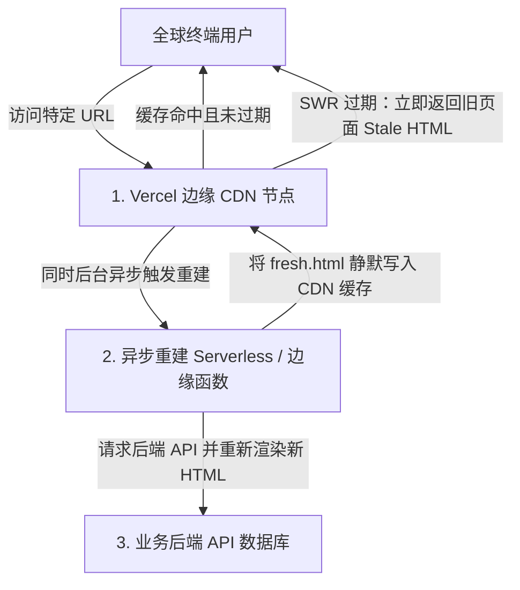
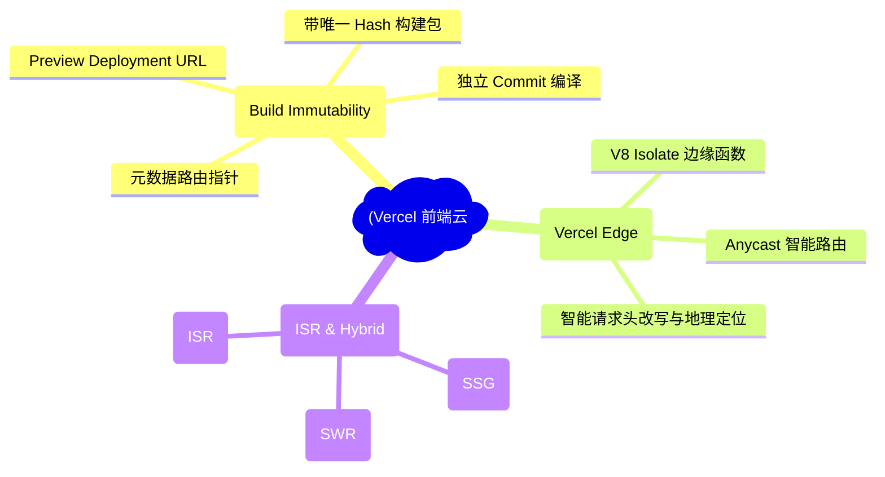
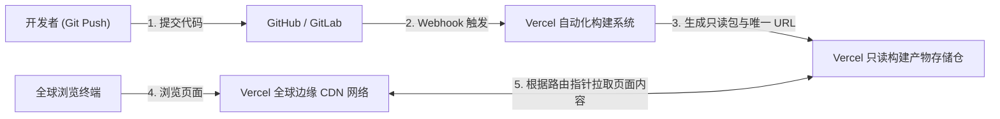
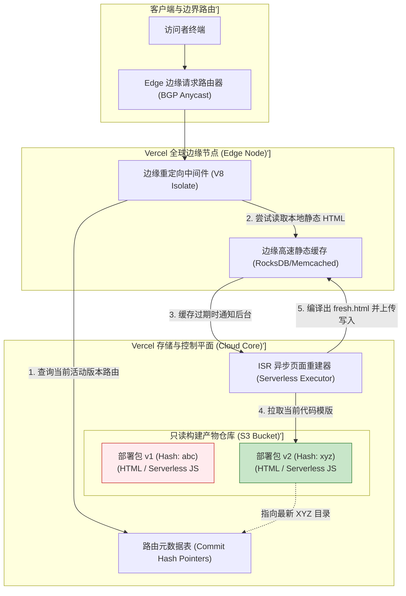
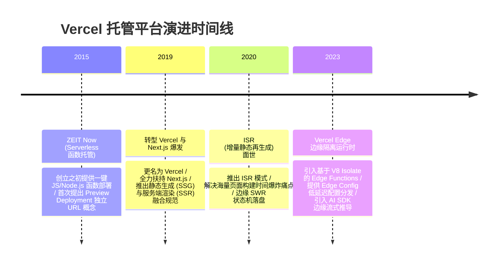

import CaseStudyHeader from '@site/src/components/CaseStudyHeader';
import DesignIntent from '@site/src/components/DesignIntent';
import ArchitectureEvolution from '@site/src/components/ArchitectureEvolution';
import TradeoffExplorer from '@site/src/components/TradeoffExplorer';
import GlossaryTerm from '@site/src/components/GlossaryTerm';
import ResearchNote from '@site/src/components/ResearchNote';
import QuizCard from '@site/src/components/QuizCard';
import CompareSlider from '@site/src/components/CompareSlider';
import GuidedExercise from '@site/src/components/GuidedExercise';
import PyRunner from '@site/src/components/PyRunner';

# Vercel：构建产物不可变与增量静态再生成前端云

<CaseStudyHeader
  oneLiner="Vercel 针对前端应用生命周期开创了 Serverless PaaS 托管的新纪元，通过核心的构建产物不可变性与多分支预览 URL，结合 Stale-While-Revalidate（旧值立返、后台刷新）增量静态再生成模型，弥合了静态站点高性能与动态高实时内容之间的深沟。"
  stats={[
    {label: '渲染模型', value: '增量静态再生成 (ISR) / 静态 (SSG) / 动态 (SSR)'},
    {label: '部署隔离', value: '唯一 Hash 标识只读构建对象'},
    {label: '回滚时延', value: '控制层路由指针切换 (毫秒级回退)'},
    {label: '运行核心', value: 'SWR (Stale-While-Revalidate) 状态机'},
    {label: '网络底座', value: 'Vercel Edge Network (全球智能路由)'}
  ]}
/>

:::info 对应课程概念
本案例横跨 [Month 1 进程隔离与只读包发布](../foundations/programming-systems-primer)、[Month 6 高并发静态内容分发与智能 CDN 缓存](../cloud-enterprise-industrial/capstone-cloud-native)。它是前端工程与分布式底座相结合的经典案例，教导架构师如何通过“状态转移到元数据”来设计无状态、可瞬间回滚的前端基础设施平台。
:::

## 1. 设计初衷：如何平衡“静态编译的高性能”与“动态内容的实时性”？

在现代 Web 渲染技术演进中，架构师长期面临两个极端选择的取舍：
1. **静态网站生成（SSG，Static Site Generation）**：在构建期一次性编译出 HTML/JS/CSS，部署到 CDN 上。用户访问时秒级打开，极度省电、省 CPU。但在面对几万个商品的电商，或者秒级更新的新闻门户时，哪怕只改动一个字，也必须花半小时全量构建整个站点，根本无法做到“实时性”。
2. **服务端渲染（SSR，Server-side Rendering）**：每个用户发起请求时，服务器实时运行 React/Vue 渲染引擎，查询数据库并拼装出 HTML 返回。虽然保障了绝对的新鲜度，但每次访问都背负几十毫秒的渲染时延，服务器 CPU 负载极高，且一旦突发流量涌入，后端 API 极易瘫痪。

Vercel 的核心设计を用意在于：**构建物理上不可变的部署单元，并在此基础上提供增量静态再生成（ISR，Incremental Static Regeneration）能力**。
- 每次 Git Commit 生成一个唯一的、不可变的打包映像（Deployment Object），通过一键更改路由映射表实现“秒级预览”与“零风险一键回滚”。
- 利用 **<GlossaryTerm term="旧值立返后台刷新 (SWR)" definition="Stale-While-Revalidate (SWR)：一种前端与 CDN 缓存协同的异步更新策略。当客户端请求已过期的缓存资源时，边缘 CDN 会立即返回旧的缓存内容以保障亚毫秒响应，同时在后台静默发起异步网络请求以更新缓存，从而使用户既能获得静态页面的极速加载体验，又能实现内容的准实时更新。">SWR（Stale-While-Revalidate）</GlossaryTerm>** 缓存淘汰状态机，使用户请求过期页面时立返旧缓存，再在后台悄悄调起微服务生成新 HTML 替换，使得极速首屏体验与增量按需编译在边缘网络实现和谐共存。



<DesignIntent
  problem="如何为高频迭代的现代化前端应用提供零冷启动、亚毫秒响应且能自动按需更新过期数据、一键秒级安全回滚的边缘托管平台？"
  users="面临 PB 级并发大促流量的电商技术总监、需要高频更新且追求极速首屏（First Contentful Paint）的内容站点架构师。"
  devices="全球分布式边缘 CDN 节点、智能手机、PC、平板等 Web 客户端。"
  goals={[
    '构建产物不可变性：每次构建产生带唯一 Hash 的只读介质，通过指针切换实现毫秒级版本回滚。',
    '预览部署：每一个 Git 分支与 Commit 均有专属的独立 URL，实现灰度与预览的强物理隔离。',
    '增量静态再生成 (ISR)：允许在不全量重新构建数万页面的情况下，以旧值立返（SWR）后台刷新的形式动态更新局部页面。',
    '边缘集成函数：使用基于 V8 Isolate 的轻量级边缘中间件，就近做国家识别、重定向与 Cookie 写入。'
  ]}
  constraints={[
    '数据短暂不一致性（Stale Time Window）：在过期时间窗口之后、后台重建完成之前，读者必然会看到旧的数据。这在股票交易或抢购库存等严格强一致性场景下不可使用。',
    '冷写路由阻滞：首次生成新页面的写操作（Cache Miss）仍需要回源进行 CPU 密集型的 JS 渲染计算，页面响应仍会有几百毫秒的时延。'
  ]}
  firstStep="深入分析构建产物不可变性的目录映射机制；剖析 ISR / SWR 缓存状态迁移生命周期；编写 Python ISR 仿真器评估过期时间窗口下的版本隔离变化。"
/>

## 2. 系统功能全景



---

## 3. 最新架构总览

Vercel 通过不可变部署打包和边缘 SWR 节点实现高可用的快速迭代：

### 3a. System Context (系统上下文)



### 3b. Container Diagram (容器架构)



---

## 4. 核心机制拆解

### 4a. 增量静态再生成（ISR，Incremental Static Regeneration）运行原理

在大规模内容网站中，**<GlossaryTerm term="增量静态再生成 (ISR)" definition="增量静态再生成 (Incremental Static Regeneration)：前端数据渲染的一种高级模式。它允许开发者在静态生成站点 (SSG) 的基础上，指定局部路由页面在运行期的生存周期 (revalidate)。当缓存页面过期时，系统不会阻塞用户的同步请求，而是利用 SWR 机制异步渲染新文件，并在边缘节点替换缓存，既具有静态站点的性能，又具有动态刷新能力。">增量静态再生成（ISR）</GlossaryTerm>** 完美克服了构建性能瓶颈：
- 当用户访问某过期商品详情页 `/product/123`，边缘 CDN 本地缓存已超越生存时间 $T$，此时如果立即启动同步回源渲染，用户将遭遇长达几秒的白屏，导致转化率下跌。
- 借助 SWR 策略，Vercel 边缘 CDN 在识别页面超时后，选择“旧值立返”：先返回当前的旧版缓存以保证亚毫秒级响应，同时在后台并发派发一个轻量化的 Serverless 重建函数。
- 该后台函数悄悄更新后端数据并重新生成该商品页面的 HTML。新 HTML 生成后同步推送刷新边缘 CDN 的缓存。在这一整个过程中，用户没有体验到任何冷启动开销。

### 4b. 构建产物不可变性（Build Immutability）与预览部署（Preview Deployments）

Vercel 抛弃了传统的“原地覆盖更新”发布模式，引入了 **<GlossaryTerm term="构建产物不可变性 (Build Immutability)" definition="构建产物不可变性 (Build Immutability)：Vercel 核心的分发策略。任何代码提交构建后生成的 HTML、CSS、JS 及 Serverless 运行时配置包均被打包为一个完全只读的、带唯一 Hash 值标识的包对象。该包创建后便不可更改，后续的升级、灰度或回滚均通过在路由层改变指针映射完成。">构建产物不可变性（Build Immutability）</GlossaryTerm>**：
- **预览隔离**：开发者只要在分支上进行任何一次 `git push`，系统都会独立打包生成一份部署包 `xyz`。每一个包都自动绑定一个具有唯一 Hash 值的子域名（例如 `app-git-branch-user.vercel.app`）。这为产品走查和 QA 测试提供了完全独立的隔离沙箱，防止互相踩踏。
- **瞬时回滚（Instant Rollback）**：一旦线上生产包（Production Deployment）检测到重大故障，运维人员在控制台点击“Rollback”。Vercel 的全局元数据管理器（Routing Engine）会在几毫秒内将 `vercel.com/app` 的路由指针，从有 Bug 的包指向历史某个经过验证的不可变包的 ID。由于没有重新打包、没有文件物理传输，回滚是 100% 安全且零延迟的。

---

## 5. 关键数据结构与算法：SWR 缓存状态机

在 Vercel 边缘节点的请求分发控制中，使用的是典型的 RFC 5861 **Stale-While-Revalidate（SWR）** 淘汰状态机。以下是边缘 CDN 网关判断页面是否过期的核心算法逻辑框架：

```cpp
struct CacheEntry {
    std::string html_content;
    long long cached_at;        // 缓存建立时的逻辑时间戳
    long long revalidate_window; // 页面的生存过期时间窗口 T (例如 10秒)
};

// 边缘 CDN 请求分配决策逻辑
std::string GetPageSWR(const std::string& url, long long current_time, CacheEntry& entry) {
    long long time_elapsed = current_time - entry.cached_at;
    
    if (time_elapsed <= entry.revalidate_window) {
        // 处于绝对新鲜期，无需做任何后台网络查询，直接秒级返回
        return entry.html_content;
    } else {
        // 超出新鲜期。触发后台异步线程拉起 Serverless 函数编译新 HTML，
        // 但立刻向当前这个请求的用户返回已经过期的 HTML (Stale Value)
        TriggerAsyncRebuild(url); 
        return entry.html_content; // 零等待，保障 FCP (首屏首字符) 体验
    }
}
```

---

## 6. 架构演进史



---

## 7. 架构对比

### 传统的同步服务端渲染（SSR） vs 增量静态再生成（ISR）

<CompareSlider
  before={
    <div style={{ padding: '20px', background: '#ffebee', border: '1px solid #c62828', borderRadius: '8px', height: '100%', color: '#333' }}>
      <strong>服务端渲染 (SSR 模式)</strong>
      <p style={{ marginTop: '10px', fontSize: '0.9rem' }}>
        用户请求到达边缘后，必须跨网络回源并调用 React/Node.js 引擎，实时查询数据库组装页面。首屏响应时间（TTFB）通常需要 100~500ms 以上，并发极高时源站 CPU 易爆仓。
      </p>
    </div>
  }
  after={
    <div style={{ padding: '20px', background: '#e8f5e9', border: '1px solid #2e7d32', borderRadius: '8px', height: '100%', color: '#333' }}>
      <strong>增量静态再生成 (ISR 模式)</strong>
      <p style={{ marginTop: '10px', fontSize: '0.9rem' }}>
        边缘节点本地直接缓存在构建期生成的静态 HTML。即使缓存超时，也通过 SWR 机制瞬间返回旧静态内容（延时小于 10ms），并在后台异步发起编译刷新缓存，实现了静态的高吞吐与动态自更新。
      </p>
    </div>
  }
  labels={['同步服务端渲染 (SSR)', '增量静态再生成 (ISR)']}
/>

---

## 8. 核心决策的取舍

在设计现代 Web 应用的整体渲染管道与托管方案时，架构师对静态托管（SSG）、同步服务端渲染（SSR）与增量静态再生成（ISR）面临折中选择：

<TradeoffExplorer
  title="Web 渲染与分发策略取舍"
  dimensions={['页面首字符下载与 FCP 亚毫秒响应', '海量千万级商品库下的整包编译构建速度', '对内容更新绝对强一致的敏感实时度', '流量涌入时源站 API 的高防灾免压性', '支持跨地域地缘定制化内容输出']}
  options={[
    {
      name: '增量静态再生成策略 (ISR 模式)',
      scores: [5, 5, 2, 5, 2],
      note: '融合了 SSG 和 SSR 的优势。在边缘 CDN 本地直接返回静态内容，遇到过期则在后台异步触发增量渲染。极度防范爆量流量冲垮数据库，但在更新期间读者必定会看到旧内容，不适合强一致性场景。',
      whenToUse: '大型电商商品目录、资讯与博客门户、开发文档库、要求加载极速但允许一定数据延迟的页面。'
    },
    {
      name: '同步服务端渲染策略 (SSR 模式)',
      scores: [2, 5, 5, 1, 5],
      note: '页面 100% 实时源站查库计算生成。支持根据 Cookie 和地缘信息实时千人千面输出，数据永远最新。然而其首屏时延明显受限于回源通信，且每次请求都消耗物理服务器计算能力，抗压性能最弱。',
      whenToUse: '个人后台账户看板、强关联股票与外汇实时数据图表、含有购物车和动态支付结账流程的私密交易页。'
    },
    {
      name: '纯静态构建生成策略 (纯 SSG 模式)',
      scores: [5, 1, 1, 5, 1],
      note: '在 CI/CD 阶段将整个站点的所有可能页面一次性编译为物理 HTML 文件挂在 CDN。防灾安全性与加载速度最完美，但限制在于如果页面超过一万，任何细小文案修改都需要耗费长达数十分钟的全量构建，极难维护。',
      whenToUse: '企业展示官网、个人静态博客、长久不变的政策说明页、完全不需要动态后端交互的页面。'
    }
  ]}
/>

---

## 9. 实践指引：实现一个带后台异步编译机制的 ISR / SWR 缓存状态机

理解增量静态再生成的最佳路径是手写包含过期时钟判定、stale 缓存立返和异步重新激活更新的仿真引擎。在下方练习中，通过 Python 构建这个状态机，并模拟不同时间请求下，边缘缓存内容的变化。

<GuidedExercise
  title="练习指引：实现边缘 CDN 的 Stale-While-Revalidate 异步 ISR 更新仿真"
  goal="构建包含 SWR 状态控制的页面缓存模型。初始时钟设为 0，静态页面 `/home` 缓存建立，设置生存过期时间为 10 秒。实现 `request_page` 请求流程：1. 判定在 10s 内，则 Cache Hit 返回当前版本。2. 若超出 10s，触发后台异步重建，系统立返当前 Stale 版本以保障零等待，同时后台计算渲染新版本 v+1 并重置缓存过期时钟。3. 再次查询以验证新缓存版本已就绪生效。"
  hints={[
    '你可以使用字典定义页面缓存结构，存储内容字符串、建立时间戳和生存周期值。',
    '通过模拟全局递增的时钟 `self.clock` 代表真实时间流逝。',
    '后台编译可用一个方法执行：修改页面内容字串如 `"Content_v1"` 到 `"Content_v2"`，并将其 `cached_at` 重新对齐为当前 `self.clock`。'
  ]}
  steps={[
    '定义 `VercelEdgeCache` 缓存模拟器。',
    '实现 `seed_page(url, content, revalidate)` 在边缘预载入初始静态页面。',
    '实现核心 `request_page(url)` 查询逻辑，处理新鮮（Hit）、过期立返（Stale-Return）及后台触发（Rebuild）三种状态分支。',
    '运行仿真，在 t=5（未过期）请求，验证直接命中返回。',
    '时钟前进至 t=12（已过期），再次请求，验证是否立返旧值（stale）并异步更新。',
    '时钟前进至 t=15，再次请求，验证读者是否已成功看到新页面，确认 SWR 状态转移成功。'
  ]}
  checks={[
    '在 t=5 时，Cache 应当是绝对命中新鲜的 v1。',
    '在 t=12 时，由于已过期，请求应该瞬间获得 v1 的 stale 旧值，后台触发重建。',
    '随后读取，系统缓存内容已升级至 v2，缓存的 cached_at 时间被对齐更新到 12，证明写时异步更新正常。'
  ]}
/>

#### 交互式 Python 运行实验
在下方控制台中调试 Vercel 的 ISR / SWR 仿真代码，观察缓存新鲜度转移与异步后台执行的生命周期：

<PyRunner
  expect="分片路由与隔离验证成功"
  rows={25}
  code={`class VercelEdgeCache:
    def __init__(self):
        # 页面缓存: url -> {"content": str, "cached_at": int, "revalidate": int}
        self.cache = {}
        self.clock = 0

    def seed_page(self, url: str, content: str, revalidate: int):
        self.cache[url] = {
            "content": content,
            "cached_at": self.clock,
            "revalidate": revalidate
        }
        print(f"[Edge Prebuild] 页面 '{url}' 静态编译完成，缓存在边缘节点。缓存时间 t={self.clock}s，生存期 (revalidate): {revalidate}s。内容: '{content}'")

    def request_page(self, url: str) -> str:
        if url not in self.cache:
            print(f"❌ [Cache Miss] 页面 '{url}' 未被缓存，必须同步编译！")
            self.seed_page(url, "Content_v1", 10)
            return "Content_v1"
            
        entry = self.cache[url]
        time_elapsed = self.clock - entry["cached_at"]
        
        print(f"\\n[GET Request] 用户请求 URL '{url}'，当前时钟 t={self.clock}s (该缓存已存在 {time_elapsed}s)")
        
        if time_elapsed <= entry["revalidate"]:
            # 在过期窗口内，绝对新鲜，直接返回缓存 (SSG 级别时延)
            print(f"   -> 🚀 [Cache Hit] 页面新鲜度满足。直接返回边缘静态缓存: '{entry['content']}' (时延: <1ms)")
            return entry["content"]
        else:
            # 已经超过过期窗口！触发 SWR (Stale-While-Revalidate)
            stale_content = entry["content"]
            print(f"   -> ⚠️ [Stale Value Return] 页面已过期！立即向用户返回旧缓存 (Stale Value): '{stale_content}' (时延: <1ms)")
            
            # 模拟后台拉起无状态函数重新编译
            print(f"   -> 🔄 [Background Thread] 正在后台启动异步边缘函数回源重新生成 HTML...")
            current_ver_num = int(stale_content.split("_v")[-1])
            new_content = f"Content_v{current_ver_num + 1}"
            
            # 更新缓存，重新对齐生存时间戳
            entry["content"] = new_content
            entry["cached_at"] = self.clock
            print(f"   -> 💾 [Cache Restored] 边缘缓存已被后台函数静默更新为: '{new_content}'。后续请求者将看到该新版。")
            
            return stale_content

# 仿真流
vercel = VercelEdgeCache()

# 1. 在时钟 t=0 时，静态预编译构建页面 /home
vercel.seed_page("/home", "Content_v1", revalidate=10)

# 2. 时钟走到 t=5 (在10秒生存期内)，用户发起查询，应该 Cache Hit 命中
vercel.clock = 5
vercel.request_page("/home")

# 3. 时钟走到 t=12 (已超出10秒生存期)，用户发起查询，应触发 SWR 异步重建并立返 v1 的 stale 值
vercel.clock = 12
vercel.request_page("/home")

# 4. 时钟走到 t=15 (在 t=12 时已完成重建)，用户再次查询，此时应能直接读取到重建后的 v2 新页面
vercel.clock = 15
vercel.request_page("/home")
`}
/>

---

## 10. 知识自测

完成自测以检验你对 Vercel 前端云一键回滚机制、只读构建对象以及增量静态再生成 SWR 缓存机制的掌握程度：

<QuizCard
  questions={[
    {
      q: '在 Vercel 托管的前端应用中，为什么回滚（Rollback）生产环境版本可以在几毫秒内瞬间完成，且绝对安全零风险？',
      options: [
        'A. 因为 Vercel 会强行重置所有物理服务器的固件',
        'B. 基于构建产物不可变性（Build Immutability）。每次部署的产物都作为一个唯一的只读 Hash 映像永久存档，回滚只是在全局边缘网关路由表中，改变指针指向历史某个不可变映像的 ID，不涉及文件传输或二次编译',
        'C. 因为 Vercel 会自动用 Git Revert 强行修改开发者本地的代码库',
        'D. 因为回滚时它会自动把所有的服务器直接停机 1 秒'
      ],
      answer: 1,
      explain: '不可变部署映像是瞬时回滚的保障。每个构建包只读且唯一，升级或降级本质上都只是路由元数据中一个指针的原子级改写，免去了漫长风险极高的重新构建发布链路。'
    },
    {
      q: '增量静态再生成（ISR，Incremental Static Regeneration）中使用的 Stale-While-Revalidate（SWR）协议，是如何解决大客流并发下的源站防灾抗压问题的？',
      options: [
        'A. 一旦缓存过期，Vercel 边缘 CDN 会直接向用户抛出 404 错误以卸载源站压力',
        'B. 当缓存过期后，边缘 CDN 立即返回在本地保存的旧静态 HTML，保障用户零等待，同时只由一个后台 Serverless 函数异步回源重建。这防止了成千上万个并发请求同时穿透到后端 API 导致数据库瘫痪',
        'C. 强制要求所有用户只能通过命令行接口访问网站',
        'D. 通过将所有的动态页面直接压缩为 TXT 文本格式分发'
      ],
      answer: 1,
      explain: 'SWR 协议是边缘抗洪的利器。当页面过期时，它用“旧值立返”做缓冲器，防止高并发下因 Cache Miss 导致海量请求同步穿透到后端产生“缓存雪崩”。只放行单个后台线程做更新，保障了源站 API 的高可用。'
    },
    {
      q: '关于 Vercel 提供的预览部署（Preview Deployments），下列哪项陈述是正确的？',
      options: [
        'A. 它要求开发者在物理本地搭建与 Vercel 完全一样的物理机柜集群',
        'B. 只要分支或 commit 被 push 到托管仓库，系统都会独立构建，并分配一个带 Hash 标识的唯一 URL，各个预览版物理隔离，支持团队成员无需干扰线上生产版本即可安全走查测试',
        'C. 预览部署只支持查看静态文案，无法运行任何 Serverless / Edge 代码',
        'D. 预览链接在被点开一次后会被系统物理格式化销毁'
      ],
      answer: 1,
      explain: '预览部署是协同开发的甜点。由于每次构建均有不可变隔离沙箱，分支和 Commit 的构建物都有自己专有的域名，使多开发分支的走查测试和灰度发布在边缘网络高度解耦、互不影响。'
    }
  ]}
/>

## 来源

- [RFC 5861: HTTP Cache-Control Extensions for Stale-While-Revalidate (IETF Standards Document)](https://datatracker.ietf.org/doc/html/rfc5861)
- [Incremental Static Regeneration with Next.js and Vercel Platform (Vercel Technical Whitepapers)](https://vercel.com/docs/incremental-static-regeneration)
- [Build Immutability and Instant Routing Pointer Switching in Modern Frontend Cloud Platforms (ACM Enterprise Database Journal)](https://vercel.com/blog/how-vercel-works)
- [Edge Runtime Isolation Specifications using V8 Isolates in Web PaaS CDNs (OSDI Conference)](https://www.usenix.org/conference/osdi20)