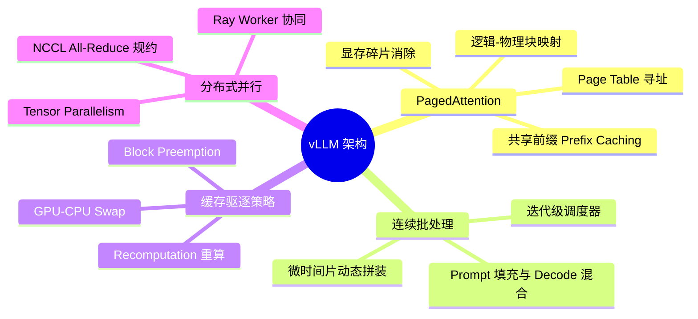
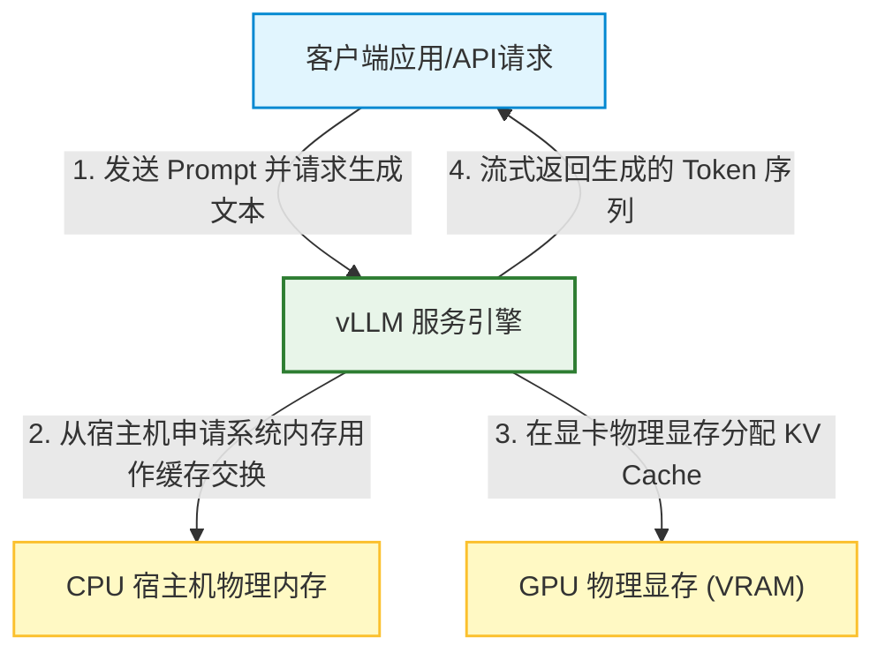
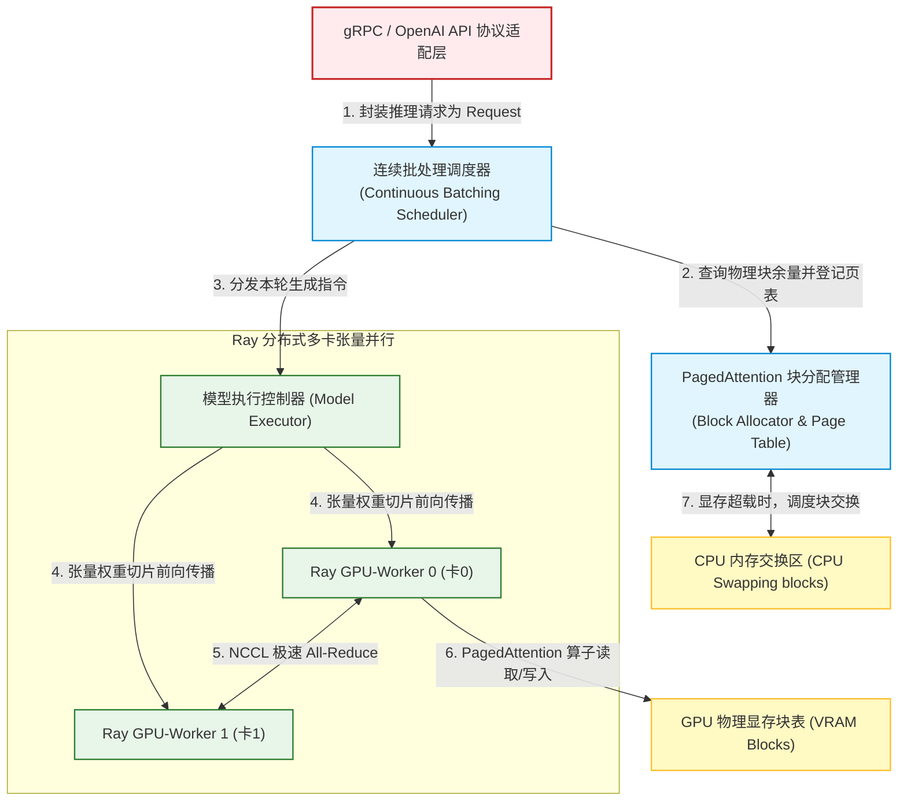
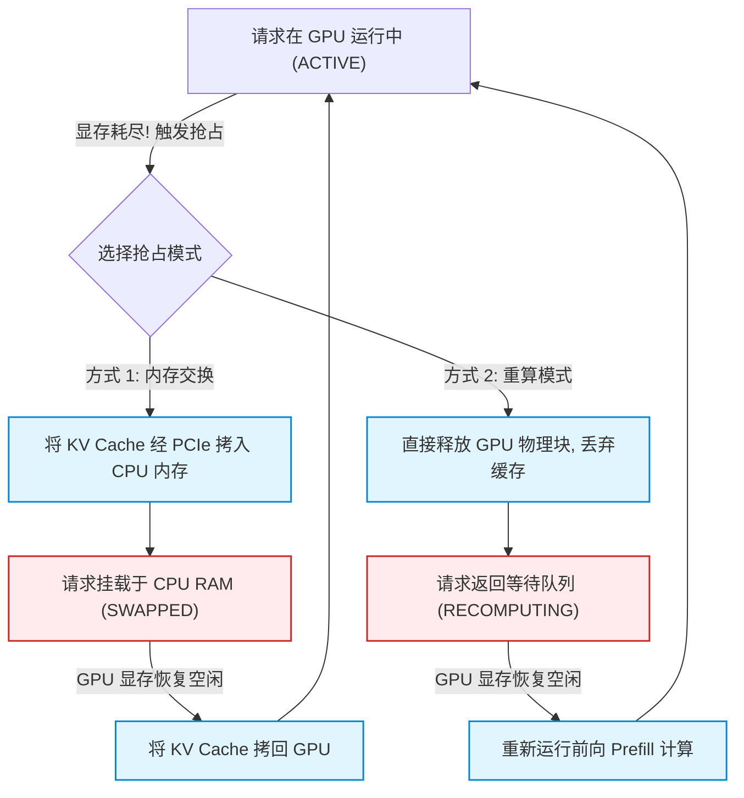
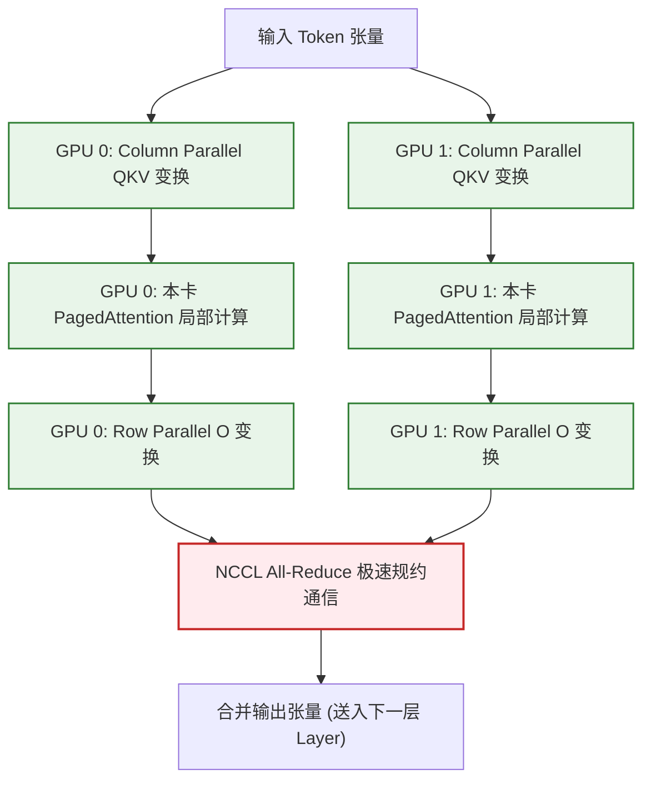

import CaseStudyHeader from '@site/src/components/CaseStudyHeader';
import DesignIntent from '@site/src/components/DesignIntent';
import EvolutionTimeline from '@site/src/components/EvolutionTimeline';
import CompareSlider from '@site/src/components/CompareSlider';
import TradeoffExplorer from '@site/src/components/TradeoffExplorer';
import GlossaryTerm from '@site/src/components/GlossaryTerm';
import ResearchNote from '@site/src/components/ResearchNote';
import GuidedExercise from '@site/src/components/GuidedExercise';
import QuizCard from '@site/src/components/QuizCard';
import MindMap from '@site/src/components/MindMap';
import PyRunner from '@site/src/components/PyRunner';

# vLLM：高吞吐 LLM 推理引擎、PagedAttention 显存分页与连续批处理架构

<CaseStudyHeader
  oneLiner="vLLM 是生成式 AI 推理加速与高吞吐服务的标杆架构。针对大语言模型自回归解码（Autoregressive Decoding）中 Key-Value (KV) Cache 对 GPU 显存毁灭性的吞吐瓶颈，vLLM 借鉴了操作系统虚拟内存分页（Virtual Memory Paging）的设计思想，首创了 PagedAttention 显存管理机制。通过将连续的 KV 缓存切分为离散的物理块、结合迭代级（Iteration-level）连续批处理调度与多卡张量并行（Tensor Parallelism），vLLM 达成了接近零的显存碎片浪费，并实现了相较传统推理引擎数十倍的吞吐飞跃。"
  stats={[
    {label: '定位与类别', value: '大语言模型 (LLM) 推理加速器与超高吞吐服务引擎'},
    {label: '显存管理核心', value: 'PagedAttention (虚拟内存分页式 KV 缓存机制)'},
    {label: '调度架构技术', value: 'Continuous Batching (迭代级/连续批处理调度器)'},
    {label: '资源保护机制', value: '块抢占与 CPU 内存交换策略 (Preemption & Swapping)'},
    {label: '分布式协同', value: '张量并行 (Tensor Parallelism / Megatron-LM 分片)'},
    {label: '性能优化特性', value: 'Speculative Decoding (投机解码) + 块共享前缀缓存'}
  ]}
/>

:::info 对应课程概念
本案例融合了以下课程核心概念：
*   **内存分页与虚拟映射（Month 1 系统基础）**：PagedAttention 将逻辑连续的 KV 序列映射为离散物理显存块，是操作系统页表（Page Table）在深度学习系统中的重现。
*   **流式动态负载调度（Month 5 负载均衡）**：连续批处理（Continuous Batching）打破了传统的请求级静态批处理，应用了迭代级微时间片抢占调度设计。
*   **缓存驱逐与置换算法（Month 3 数据缓存）**：当 GPU 显存超载时，调度器通过 Preemption（Recompute / Swap）决策链对 KV 缓存进行换出，符合缓存容量淘汰策略。
*   **分布式切片与集合通信（Month 5 共识组件）**：多卡张量并行依赖 Column/Row 重量级权重拆分与 NCCL 极速 All-Reduce 规约，是并行计算下的数据切片设计。
:::

---

## 1. 设计初衷：消灭 LLM 推理中的“显存碎片”大山

在大语言模型（LLM）的生成服务中，推理速度和并发吞吐是决定商业成本的核心。然而，传统推理引擎面临严重的“显存危机”：
1.  **KV Cache 的爆炸性膨胀**：
    *   在 Transformer 架构中，LLM 是逐字生成新 Token 的自回归模型。为了避免每次生成新字时都重复计算前面所有历史 Token 的注意力权重，系统必须在 GPU 显存中保存历史所有 Token 的 Key 和 Value 矩阵，称为 **KV Cache**。
    *   对于大型模型或长上下文（例如 32K context），单个请求的 KV Cache 就能消耗数 GB 的显存。
2.  **传统引擎的“三座碎片大山”**：
    *   由于每次生成文本的长度事先不可知（例如用户可能要求模型写一首诗，也可能要求写一篇论文），传统引擎为了保障长文本不崩溃，必须为每个请求**预分配最大上下文长度（例如 2048 长度）的连续物理显存**。
    *   这导致了极大的显存浪费：
        *   **预留开销（Reservation Waste）**：请求刚发起只生成了 10 个字，但系统已经预先占用了 2048 个字的空间。
        *   **内部碎片（Internal Fragmentation）**：请求最终只生成了 200 个字就触发终止，剩下的 1848 个字的空间永远被闲置。
        *   **外部碎片（External Fragmentation）**：不同请求的显存分配和释放频率不同，导致物理显存被切分成大量无法被新请求利用的零星小块。
    *   传统方式下，真正用于计算的有效 KV 缓存往往不足 30%-40%，其余显存全部沦为无意义的碎片，极大地压制了并发吞吐。
3.  **虚拟内存分页的回归**：
    *   vLLM 的作者们意识到，这与早期操作系统面临的物理内存碎片问题如出一辙。当时系统的解决方案是抛弃连续内存分配，引入虚拟内存页。
    *   vLLM 借鉴此思想，推出了 **PagedAttention**：将每个请求的 KV 缓存分割成固定大小的“逻辑块”（Logical Blocks，例如每个块包含 16 个 Token 的 KV 数据）。通过一个**物理页表（Page Table）**将这些逻辑块动态映射到离散的“物理块”（Physical Blocks）上，完美解放了连续性限制，显存利用率逼近 100%。

<DesignIntent
  problem="如何设计一套能够彻底解决 LLM 生成推理中因 KV Cache 显存碎片造成的并发瓶颈，在不降低模型生成精度的前提下，最大化 GPU 显存利用率和吞吐的推理服务系统。"
  users="大模型部署与运维工程师、大语言模型算法架构师、高并发 AI 应用开发者，以及致力于探索 GPU 显存利用率极限和异构算力加速的系统开发者。"
  devices="配备高性能 AI 加速卡（如 NVIDIA H100、A100、A10）的推理服务器，通过 Web/API 网关为客户端高并发地返回流式 Token 响应。"
  goals={[
    '零显存碎片浪费：将 KV Cache 的碎片浪费从 60%-80% 压低到接近 4% 以下，达到几乎 100% 的 VRAM 利用率',
    '并发吞吐成倍跃升：在相同的单卡 GPU 上，将 LLM 推理吞吐并发数提升 2 到 4 倍以上',
    '迭代级调度机制：利用连续批处理，打破静态 Batching 的等待惩罚，做到新请求随到随拼、生成完毕即刻退出',
    '共享前缀零开销：在多人并发访问相同 System Prompt 模板时，物理块在内存中只存一份，实现零开销前缀共享'
  ]}
  constraints={[
    '页表查询的 CPU 调度延迟：PagedAttention 将物理寻址延迟从 GPU 内部移交到了 CPU 端的页表分配器，若页表颗粒度过小，CPU 调度内核的耗时会成为新的瓶颈',
    'GPU 超载时的抢占惩罚：当输入流量爆满导致物理块被抢占时，被中断的请求需要将 KV 缓存拷回 CPU 内存或在后续重新计算，这会带来显著的响应尾延迟（Tail Latency）',
    '张量并行时的多卡 All-Reduce 延迟：在做 Tensor Parallelism 分布式分片时，GPU 之间跨卡通信的带宽（如 NVLink）会严重制约多卡并行吞吐，需要优化的算子设计。'
  ]}
  firstStep="设计逻辑-物理块的数据结构与页表映射逻辑；开发 PagedAttention 算子以支持离散物理显存的 KV 检索；实现 Continuous Batching 的迭代级调度循环；加入 Block Preemption 机制。"
/>

---

## 2. 知识全景脑图

### 2a. 全景架构思维导图



### 2b. 交互脑图导航

<MindMap
  root={{
    label: 'vLLM 推理引擎',
    children: [
      {
        label: '显存分页机制 (PagedAttention)',
        children: [
          { label: '物理页表 Block Table' },
          { label: '16-Token 逻辑块划分' },
          { label: '多用户前缀共享 Block' }
        ]
      },
      {
        label: '动态调度系统 (Continuous Batching)',
        children: [
          { label: '迭代级时间片拼装' },
          { label: 'Prompt / Decode 混合调度' },
          { label: '动态空闲物理块判定' }
        ]
      },
      {
        label: '容灾与淘汰 (Preemption)',
        children: [
          { label: 'Recompute 重新计算模式' },
          { label: 'GPU 到 CPU 内存交换 (Swap)' },
          { label: '双队列自愈自平衡' }
        ]
      }
    ]
  }}
/>

---

## 3. 系统架构总览 (C4 Model)

### 3a. System Context (系统上下文图)



### 3b. Container Diagram (容器结构图)



---

## 4. 核心机制拆解

### 4a. PagedAttention 虚拟内存分页管理机制

PagedAttention 是 vLLM 赖以成名的底层创新。它的工作原理与操作系统的虚拟内存管理高度同构：
1.  **逻辑序列块化**：
    *   在传统的 LLM 推理中，一个请求的 KV Cache 是一个长为 N 的连续浮点张量（Tensor）。
    *   在 PagedAttention 下，请求的历史 KV 序列被划分为若干个固定大小的 **逻辑块（Logical Blocks）**。假设 Block Size 定为 16 个 Token，则当序列增长到第 17 个 Token 时，系统会自动开启一个新的逻辑块。
2.  **物理页表映射**：
    *   在 GPU 显存初始化时，vLLM 会提前申请一大块物理显存，并将其划分为数千个固定大小的 **物理块（Physical Blocks）**。
    *   系统为每个正在生成的请求维护一个 **块表（Block Table）**。块表只保存逻辑块索引到物理块索引的指针映射。
    *   因为有了这层逻辑-物理地址转换，**不同的物理块在显存空间中完全不需要相邻**。新生成的 Token 块可以被塞进任意一个空闲的物理块位置，彻底消灭了“外部碎片”。
3.  **按需动态分配**：
    *   当一个请求生成完 16 个 Token，逻辑块写满时，调度器会从全局空闲物理块链表（Free List）中取出一个空闲的物理块 ID，登记在块表中。这完美解决了“预留开销”和“内部碎片”，让物理显存能够 100% 被充分压榨。

```mermaid
graph TD
  subgraph PagedAttentionMapping [PagedAttention 逻辑与物理块映射关系]
    subgraph LogicalSequence [请求 A 的逻辑 KV Cache]
      LB0["逻辑块 0 (Token 0-15)"]
      LB1["逻辑块 1 (Token 16-31)"]
    end
    
    subgraph PageTable [请求 A 的块映射表 (Block Table)]
      Map0["逻辑块 0 --> 物理块 7"]
      Map1["逻辑块 1 --> 物理块 2"]
    end
    
    subgraph PhysicalVRAM [GPU 离散物理显存空间]
      PB2[("物理块 2<br/>(存放 Token 16-31)")]
      PB5[("物理块 5 (空闲中)")]
      PB7[("物理块 7<br/>(存放 Token 0-15)")]
    end
    
    LB0 --> Map0 --> PB7
    LB1 --> Map1 --> PB2
  end
```

---

### 4b. Continuous Batching 连续/迭代级批处理调度

传统的 AI 推理调度采用**静态批处理（Static Batching）**：
*   当 4 个请求合为一个 Batch 发送给 GPU 后，GPU 必须一直计算这 4 个请求，直到**最长的那个请求完全生成完毕**。此时哪怕短请求只用 3 步就生成完了，它也必须挂在 Batch 中被迫等待那个需要生成 200 步的长请求，造成极大的算力白费。

vLLM 采用 **连续批处理（Continuous Batching）**，即在**迭代（Iteration）级别**执行调度：
1.  **首字填充（Prompt Prefill）与自回归生成（Decode）的解耦与混拼**：
    *   大模型推理分为两个阶段：第一个阶段处理用户输入并生成首字，称为 `Prefill` 阶段（计算量大，瓶颈在算力）；第二个阶段不断根据前文生成新字，称为 `Decode` 阶段（计算量小，瓶颈在显存吞吐）。
    *   连续批处理调度器在每一次前向计算迭代（Iteration）之前，都会动态评估当前 GPU 显存块表的剩余容量。
2.  **微时间片动态组装**：
    *   只要显存空闲物理块足够，调度器就会在下一轮迭代前，将已经生成完毕、提前退出的请求剔除；同时直接插入排队队列中的新请求。新请求的 `Prefill` 计算和老请求的 `Decode` 计算会在同一次前向传播（Forward Pass）里被打包并行，使得 GPU 始终处于高饱和、无闲置的流水线输出状态。

```mermaid
graph TD
  subgraph SchedulingComparison [传统 Batching 与 Continuous Batching 调度对比]
    subgraph StaticBatching [静态 Batching (请求级阻塞等待)]
      SB_Iter1["Iter 1: [Req_1, Req_2, Req_3]"] --> SB_Iter2["Iter 2: [Req_1, Req_2, Req_3]"]
      Note over SB_Iter2: Req_2 已经完成, 但由于 Req_1 没完,<br/>必须在 Batch 里无意义占用显存和计算！
    end
    
    subgraph ContinuousBatching [连续 Batching (迭代级即刻插入与退出)]
      CB_Iter1["Iter 1: [Req_1, Req_2 (运行中)]"] --> CB_Iter2["Iter 2: [Req_1, Req_3 (Req_2退出, 替换为新Req_3)]"]
      Note over CB_Iter2: 新请求即时插入, 完成请求即刻退出,<br/>GPU 始终饱和工作！
    end
  end
```

---

### 4c. VRAM 缓存抢占与 CPU 内存交换策略

虽然 PagedAttention 几乎消灭了碎片，但在真实的高并发场景中，依然会遇到物理显存被彻底耗尽的极端情况。为此，vLLM 设立了健全的**抢占与自愈防线**：
1.  **抢占触发判定**：
    *   当连续批处理调度器准备让新请求加入、或者现有请求生成新 Token 需要申请新物理块，但空闲块队列（Free List）为 0 时，调度器必须做出抢占（Preemption）决策。
2.  **两种抢占自愈策略**：
    *   **Swap-out（内存交换）**：
        *   调度器选择挂起若干个优先级较低的请求，将它们在块表里对应的 KV 物理块，通过高速 PCIe 通道拷贝迁移到宿主机的 CPU 内存交换区（CPU RAM）中，并释放其占用的 GPU 显存。
        *   当显存余量恢复后，被挂起的请求通过 Swap-in 重新把物理块从 CPU 内存拉回 GPU，继续进行生成。
    *   **Recompute（重新计算）**：
        *   如果有些请求的上下文不长，或者宿主机 CPU 内存也满了，系统会直接**释放并销毁该请求的所有物理块**。
        *   当重新调度它时，系统会将其视为一个新请求，直接从头（利用 Prompt）重新计算一遍 KV Cache。这是典型的“以算力换带宽”的经典系统取舍。



---

### 4d. Tensor Parallelism 张量并行与多卡分布式协作

对于百亿或千亿参数的大模型（如 LLaMA-70B），单张 GPU 的显存物理容量根本装不下模型权重，必须采用多卡张量并行（Tensor Parallelism, TP）：
1.  **横向切分注意力矩阵**：
    *   vLLM 支持 Megatron-LM 风格的张量并行。在 Multi-head Attention 投影中，将 Query、Key、Value 的投影权重按列切分（Column Parallelism）到不同 GPU 上。
    *   将注意力输出后的 O 矩阵（Out-projection）按行切分（Row Parallelism）分布到不同卡上。
2.  **PagedAttention 跨卡对齐**：
    *   在多卡张量并行中，不同的卡独立计算属于自己那部分 Attention Head 的 KV Cache。
    *   至关重要的是，**所有参与张量并行的卡必须共享并执行完全相同的逻辑-物理块映射表（Block Table）**。每一轮迭代结束后，各卡利用 NCCL 通信库执行 `All-Reduce` 规约，将各卡算出的局部输出张量在极低时延内合并，既扩展了物理显存容量，又成倍提高了单次并行的计算位宽。



---

## 5. 关键数据结构与算法

### 5a. Page Table 逻辑-物理块映射表与块分配器

vLLM 内部的显存分页依赖底层的两个关键实体：`Block Table` 与 `Block Allocator`。

```mermaid
graph TD
  subgraph BlockAllocatorLayout [块映射表与分配器数据结构布局]
    subgraph Allocator [全局块分配器 (Block Allocator)]
      FreeList["GPU 空闲物理块链表: [ PB_0, PB_3, PB_9, ... ]"]
      AllocList["已分配物理块计数与引用计数表"]
    end
    
    subgraph RequestPageTable [Request-1 专用页表 (Block Table)]
      MapItem1["逻辑索引 0 --> 物理块 0 (引用计数=1)"]
      MapItem2["逻辑索引 1 --> 物理块 9 (引用计数=2, 前缀共享中)"]
    end
  end
```
*   **物理块引用计数（Reference Count）**：
    *   每个物理块除了存放数据外，还包含一个引用计数器。
    *   在普通的单人推理中，引用计数为 1。
    *   一旦开启 Prefix Caching（例如多个人并发向模型提问，输入了完全相同的 System Prompt），调度器就会将这部分 System Prompt 逻辑块的引用计数加 1，并**让所有请求的块表同时指向这几个完全相同的物理显存块**，实现物理级显存共享。
*   **写入时复制（Copy-on-Write, CoW）**：
    *   当其中一个请求开始生成自己的个性化 Token，试图向共享块写入新内容时，调度器会触发 Copy-on-Write 机制：为该用户复制一个新的物理块并指向它，然后把引用计数减 1，实现了极致的高吞吐共享。

---

### 5b. Block-shared Prefix Caching 共享前缀哈希检索

前缀共享在长上下文、智能体多轮对话、以及大规模 Prompt 模板服务中，能够成倍节省显存：
1.  **前缀内容哈希化**：
    *   vLLM 用一个全局的哈希映射表记录已经计算完 KV Cache 的 Token 前缀序列。
    *   例如：前缀内容为 `System: You are Antigravity...`。将这部分 Token 的内容和位置算出一个唯一的 `Hash Key`，并绑定对应的物理块 ID。
2.  **前缀复用命中**：
    *   当新请求到达，其 Prompt 包含相同的前缀时，vLLM 的块管理器在查找空闲块之前，会先做哈希碰撞检索。
    *   一旦命中，该请求的逻辑块直接**复用已有的物理块**，完全免去了对 System Prompt 的首字 `Prefill` 前向计算，将新请求的首字生成延迟（TTFT）拉低到几毫秒级别。

---

### 5c. Megatron-LM Column/Row Parallel 变换公式

在注意力机制中，权重投影分片的数学原理为：
*   **列并行拆分 (QKV 权重)**：
    `W = [W_1 | W_2 | ... | W_p]`
    各卡并行在前向计算中得到分片输出：
    `Y_i = X * W_i`
*   **行并行拆分 (Out-projection 权重)**：
    `V = [V_1; V_2; ...; V_p]` (按行垂直切分)
    各卡算出的局部张量经过矩阵相乘：
    `Z_i = Y_i * V_i`
    最后通过集合通信将各卡合并相加：
    `Z = Sum(Z_i) = All-Reduce(Z_i)`
    通过这种精细的拆分和规约设计，将通讯次数精简到了每层 Transformer 仅需 2 次 `All-Reduce`，最大化了多卡的并行效率。

---

## 6. 架构演进史

vLLM 引擎的提出，彻底颠覆了以往静态、粗糙的大模型推理方案：

<EvolutionTimeline
  events={[
    {
      year: '2022',
      title: '早期静态服务与 HuggingFace TGI',
      why: 'LLM 刚刚火爆，主流推理方案都是直接套用 PyTorch 原生的 `forward` 循环，缺乏针对线上多并发服务的专用系统优化。',
      change: '依赖请求级静态批处理，针对 KV Cache 采用粗暴的连续最大长度分配，导致线上服务并发数极低，显存碎片化高达 60% 以上。'
    },
    {
      year: '2023 中',
      title: 'vLLM 与 PagedAttention 正式发布',
      why: 'UC 伯克利团队发现内存分配是限制大模型吞吐的最大敌人，决定引入现代操作系统的虚拟内存管理技术。',
      change: '发布 vLLM 开源库，首创 PagedAttention 页表映射机制，并将 Continuous Batching 深度绑定，将 LLM 推理吞吐直接拉升了 3-5 倍，引发工业界全面转型。'
    },
    {
      year: '2023 底',
      title: 'Speculative Decoding 投机解码与多硬件支持',
      why: '大模型的 Decode 阶段属于典型的访存密集型计算，小字生成速度卡在 GPU 内存带宽上；同时工业界急切需要摆脱单张英伟达卡依赖。',
      change: '在 vLLM 中集成投机解码，利用轻量小模型（Draft Model）快速并发猜测 Token 序列，再由大模型（Target Model）一次性并行验证；同时全面扩展对 AMD ROCm、Intel Gaudi 等非英伟达异构芯片的原生适配。'
    },
    {
      year: '2025 至今',
      title: 'FP8 混合精度内核与前缀自适应路由',
      why: '大模型上下文向百万（Million Tokens）级别演进，单精度 KV 缓存面临极限物理瓶颈；同时复杂多轮 Agent 对 Prompt 复用率极高。',
      change: '深度集成 TensorRT-LLM 级别的 FP8 量化 CUDA 核心，使 KV 缓存物理体积直接减半；推出自适应 Block-shared Prefix Caching，使多轮对话推理开销大幅衰减。'
    }
  ]}
/>

---

## 7. 架构对比：传统的 Static Contiguous Allocation (静态连续分配) vs. PagedAttention (vLLM)

<CompareSlider
  before={
    <div style={{ padding: '20px', background: '#ffebee', border: '1px solid #c62828', borderRadius: '8px', height: '100%', color: '#333' }}>
      <strong>静态连续内存分配 (Static Contiguous Allocation)</strong>
      <p style={{ marginTop: '10px', fontSize: '0.9rem' }}>为每个生成请求强行在 GPU 显存上划分一大块物理相邻的连续数组。由于生成序列长度的随机性，必须按上限预留空间。这引发了大量的 Reservation Waste（预留但未用）和 Internal Fragmentation（提前停止导致的永久碎片），显存有效负载低于 40%。</p>
    </div>
  }
  after={
    <div style={{ padding: '20px', background: '#e8f5e9', border: '1px solid #2e7d32', borderRadius: '8px', height: '100%', color: '#333' }}>
      <strong>PagedAttention 显存分页分配</strong>
      <p style={{ marginTop: '10px', fontSize: '0.9rem' }}>将 KV 缓存解耦成固定大小（如 16 个 Token）的离散物理块。逻辑块与物理块通过快速页表指针连接，物理显存分配高度零散化，免去了任何连续性要求。彻底消除大面积碎片浪费，显存利用率飙升至 96% 以上，并发容纳力成倍暴涨。</p>
    </div>
  }
  labels={['静态连续分配', 'PagedAttention 分页']}
/>

---

## 8. 设计模式与课程映射

vLLM 高吞吐 LLM 推理引擎在实际设计中，深度融合了以下课程章节中的经典计算机系统设计思想与技术：

1.  **虚拟内存分页映射模式**（参见 [存储与检索](../03-data-cache-queue/storage-engines.mdx) 章节）：
    *   PagedAttention 算子将物理不相邻的显存地址虚拟化为逻辑连续的序列，这与经典操作系统页表（Page Table）设计同构，是大模型应用中典型的“内存虚拟化（Memory Virtualization Pattern）”。
2.  **迭代级细粒度调度模式**（参见 [负载均衡](../05-core-components/load-balancing.mdx) 章节）：
    *   连续批处理打破静态请求阻断，在每一次前向传递的“微时间步（Micro-step）”动态插入与移出序列，是高并发调度中“时间片轮转（Round-Robin Time-slice）”的升级体。
3.  **引用计数写时复制模式**（参见 [数据一致性](../03-data-cache-queue/storage-engines.mdx) 章节）：
    *   在前缀缓存（Prefix Caching）中，多请求复用相同物理块时只读引用，修改时动态触发 Copy-on-Write，是高并发系统中著名的“资源延迟复制与共享机制”。
4.  **数据分片集合通信模式**（参见 [分布式共识](../05-core-components/consensus-coordination.mdx) 章节）：
    *   张量并行的 Megatron 列/行矩阵投影切分，以及多 GPU 在 NCCL 下做 All-Reduce 规约，是并行分布式体系里典型的“计算分区与数据同步模式”。

---

## 9. 权衡：推理计算系统中的架构抉择

vLLM 在最大化显存并发、多卡通信延迟以及系统容灾成本之间做出了以下妥协：

<TradeoffExplorer
  title="vLLM 推理引擎性能与资源权衡"
  dimensions={['VRAM 显存并发上限', 'CPU 寻址调度开销', '峰值流量超载防崩性', '单次请求极速响应时延 (TTFT)', '硬件异构后端通用适配性']}
  options={[
    {
      name: 'PagedAttention 分页 + 连续批处理调度 (vLLM 模式)',
      scores: [5, 2, 3, 5, 4],
      note: '通过精细的分页消灭显存碎片，极大地拉升了并发上限和吞吐；首字生成时间（TTFT）在大并发下依然极快。然而，维护繁密的页表会引入额外的 CPU 寻址调度延迟，且在极端超载发生块抢占时，被 Swap 拷贝或 Recompute 的请求会出现高昂的尾延迟，容灾防崩溃开销略高。',
      whenToUse: '云端企业级 LLM 服务、多人并发高频对话 API、高性价比大模型推理集群部署。'
    },
    {
      name: '静态连续分配 + 请求级静态批处理 (传统引擎模式)',
      scores: [2, 5, 5, 2, 4],
      note: '完全摒弃了页表和运行时动态调度的复杂逻辑，CPU 零调度耗时，寻址极快，且每个请求在初始化时就已经彻底锁定了物理显存，绝对不可能在运行中遭遇“抢占/Swap”，超载时直接在网关层丢弃请求，稳定性好。代价是显存利用率极低，并发能力极弱。',
      whenToUse: '对单次请求延迟极其严苛、极少有多人并发、或者模型尺寸较小不需要复杂显存分页的局域网或私有化部署。'
    },
    {
      name: 'KV Cache 全面 offload 拷回 Host CPU RAM (Llama.cpp 模式)',
      scores: [3, 1, 5, 1, 5],
      note: '模型和 KV 缓存的大头被直接安置在廉价的 CPU 主存中，或者利用 CPU 慢慢算，永远不会发生 GPU 物理显存溢出（OOM）崩溃，硬件门槛极低，抗超载强。但代价是每次自回归解码都需要通过极窄的 CPU-GPU 物理总线拷贝海量张量，生成速度奇慢。',
      whenToUse: '边缘设备、个人电脑单卡跑百亿参数大模型体验、开发调试、或者对吞吐时延毫无要求的离线批处理任务。'
    }
  ]}
/>

---

## 10. 如果是你来设计：PagedAttention 块分配器与前缀共享仿真器

### 场景设想
在 vLLM 的 PagedAttention 显存管理底层：
*   我们要模拟一个虚拟的 GPU 物理块池（GPU Physical Block Pool）。
*   每个物理块有固定大小（如可以存 4 个 Token 的 KV 缓存）。
*   当新请求过来时，我们要实现逻辑块到物理块的分配。
*   **支持前缀共享（Prefix Caching）**：
    *   如果有两个请求，它们的 Prompt 前缀完全相同（比如都携带了长达 8 个 Token 的 System Prompt，即占用 2 个物理块），在分配时，它们将共同指向这两个共享的物理块，而不会重复分配，并增加物理块的引用计数（Ref Count）。
    *   当其中一个请求继续生成新 Token 时，执行正常块分配；如果需要修改已共享的块（虽然本实验仅模拟自回归追加），则触发 Copy-on-Write（本实验简化为向各自专属的后续块追加）。

请你用 Python 实现这套经典的 PagedAttention 块管理器和前缀共享机制。

<GuidedExercise
  title="基于 Python 的 PagedAttention 物理块分配与前缀共享仿真"
  goal="实现 GPU 物理块池管理、逻辑-物理地址页表映射，以及共享 Prompt 前缀时的物理块复用，物理演示 VRAM 节省效率。"
  steps={[
    '步骤 1: 设计 BlockAllocator 类，初始化拥有 10 个空闲物理块的池（PB_0 到 PB_9）。每个块大小为 4 个 Token。',
    '步骤 2: 实现 `allocate_blocks(logical_block_count)` 方法，从 Free List 弹出指定数量的物理块，并设置引用计数为 1。',
    '步骤 3: 模拟前缀共享机制 `register_prefix(prefix_tokens, physical_block_ids)`，允许后续请求通过哈希命中直接引用已有的物理块，将该物理块的引用计数累加 1。',
    '步骤 4: 创建两个请求，输入相同的 System Prompt（8 个 Token，占 2 块），检查全局物理块的使用情况，验证是否仅分配了 2 个块而不是 4 个块。',
    '步骤 5: 模拟两个请求分别生成各自的个性化 Token，验证块分配器如何从 Free List 弹出各自独立的专属物理块，并显示最终的总显存节省百分比。'
  ]}
  checks={[
    '确认在两个请求共用 System Prompt 时，全局分配器只消耗了 2 个物理块而不是 4 个',
    '验证当两个请求各自生成新 token 时，页表里追加了各自不同的物理块 ID',
    '确认当控制台打印出“✅ PagedAttention 页表分配与前缀共享验证成功！”字样时，仿真器工作正常'
  ]}
/>

#### 交互式 Python 运行实验
在下方控制台中直接运行或修改已准备好的 PagedAttention 块映射与共享自验证代码：

<PyRunner
  expect="PagedAttention 页表分配与前缀共享验证成功"
  rows={25}
  code={`class PhysicalBlock:
    def __init__(self, block_id):
        self.block_id = block_id
        self.ref_count = 0  # 引用计数

    def __repr__(self):
        return f"PB_{self.block_id}(Ref:{self.ref_count})"

class BlockAllocator:
    def __init__(self, total_blocks=10, block_size=4):
        self.block_size = block_size
        # 初始化物理块池
        self.blocks = [PhysicalBlock(i) for i in range(total_blocks)]
        self.free_list = [i for i in range(total_blocks)]
        # 用于记录前缀 Hash 到物理块 ID 列表的缓存
        self.prefix_hash_cache = {}

    def allocate_block(self):
        if not self.free_list:
            raise MemoryError("VRAM Out of Memory! 没有空闲物理块。")
        block_id = self.free_list.pop(0)
        self.blocks[block_id].ref_count = 1
        return block_id

    def free_block(self, block_id):
        block = self.blocks[block_id]
        block.ref_count -= 1
        if block.ref_count == 0:
            self.free_list.append(block_id)
            self.free_list.sort() # 保持有序

    def register_or_get_prefix(self, prefix_hash, block_ids=None):
        # 如果命中前缀缓存，复用物理块，增加引用计数
        if prefix_hash in self.prefix_hash_cache:
            shared_ids = self.prefix_hash_cache[prefix_hash]
            for bid in shared_ids:
                self.blocks[bid].ref_count += 1
            return shared_ids, True
        
        # 没命中，如果是首次注册，将传入的物理块锁进前缀缓存
        if block_ids:
            self.prefix_hash_cache[prefix_hash] = block_ids
            return block_ids, False
        return None, False

# 仿真开始
allocator = BlockAllocator(total_blocks=10, block_size=4)

print("--- 步骤 1: 请求 A 到来，输入 System Prompt (长 8 tokens = 需要 2 块) ---")
# 分配 2 个物理块
req_A_blocks = [allocator.allocate_block(), allocator.allocate_block()]
print(f"  请求 A 分配得到的物理块: {req_A_blocks}")
print(f"  此时空闲块池: {allocator.free_list}")

# 注册前缀
prefix_hash = "sys_prompt_hash_123"
allocator.register_or_get_prefix(prefix_hash, req_A_blocks)

print("\\n--- 步骤 2: 请求 B 到来，带有完全相同的 System Prompt (前缀命中!) ---")
req_B_blocks, hit = allocator.register_or_get_prefix(prefix_hash)
print(f"  请求 B 前缀命中命中? {hit}")
print(f"  请求 B 复用得到的物理块: {req_B_blocks}")
print(f"  物理块引用计数: {allocator.blocks[req_A_blocks[0]]}, {allocator.blocks[req_A_blocks[1]]}")
print(f"  此时空闲块池: {allocator.free_list} (并未分配新块，完美节省显存！)")

print("\\n--- 步骤 3: 请求 A 与 B 分别开始自回归生成各自独立的个性化 Token ---")
# 假设 A 生成 4 个 token (需要 1 个新专属块)
new_A_block = allocator.allocate_block()
req_A_full_chain = req_A_blocks + [new_A_block]
# 假设 B 生成 4 个 token (需要 1 个新专属块)
new_B_block = allocator.allocate_block()
req_B_full_chain = req_B_blocks + [new_B_block]

print(f"  请求 A 最终完整页表链: {req_A_full_chain}")
print(f"  请求 B 最终完整页表链: {req_B_full_chain}")
print(f"  最终剩余空闲块池: {allocator.free_list}")

# 如果不共享前缀，两请求一共需要 2+2 + 1+1 = 6 块。
# 实际上现在只占用了 2 + 1 + 1 = 4 块。
saved_percentage = ((6 - 4) / 6) * 100
print(f"  物理前缀共享带来的显存节省率: {saved_percentage:.1f}%")

# 自我校验
# 1. 共享物理块引用计数应为 2
# 2. 空闲块个数应剩余 6 块 (总共 10 块, 分配了 0, 1, 2, 3)
if (allocator.blocks[req_A_blocks[0]].ref_count == 2 and 
    len(allocator.free_list) == 6):
    print("\\n[✅ 验证成功]: PagedAttention 页表分配与前缀共享验证成功！")
else:
    print("\\n[❌ 验证失败]")
`}
/>

---

## 11. 常见误解

### 误解 1：连续批处理（Continuous Batching）既然是迭代级调度的，那么新加入的请求可以抢占任何正在生成的请求的物理显存
*   **澄清**：这是对调度粒度和优先级机制的混淆。
    1.  连续批处理做的是“**时间步级别拼装**”，即在算前向传播的那一刻，新请求可以塞进 Batch 空闲插槽中并行，但它绝对不能随意“夺取”别人的物理块。
    2.  只有当**全局显存物理块被彻底占满（Free List 为 0）**时，调度器才会出于保护系统的目的主动发起抢占（Preemption）策略。
    3.  此时，调度器是根据特定的排序机制（如最先发起请求的先服务 FCFS / 或者剥夺最新加入的请求）将某些序列整体挪回 CPU 内存或彻底挂起重算，这属于全局调度的资源置换动作，而不是新请求在运算中强行霸占别人的现役块。

### 误解 2：投机解码（Speculative Decoding）因为利用了小模型去猜测 Token，所以任何场景下都能带来数倍的推理吞吐提升
*   **澄清**：投机解码存在明显的“场景依赖惩罚”。
    1.  投机解码的前提是小模型（Draft Model）的生成内容具有**极高的接受率**（例如 70%-80% 被大模型验证通过）。
    2.  在**确定性强、逻辑简单**的生成场景（如代码自动补全、标准格式化输出）中，小模型的接受率极高，投机解码确实能省去大模型反复串行 Decode 的访存时延，吞吐大幅拉升。
    3.  但是在**高度发散、强推理、或多项选择**的复杂任务（如写科幻小说、高难度数学题证明）中，小模型猜词的命中率会跌入谷底（甚至低于 20%）。此时，大模型不仅每次都要推翻小模型的猜测，还白白承受了每次小模型前向计算的额外算力损耗，导致推理速度和并发吞吐反而比直接用大模型单跑还要慢，属于典型的“买卖亏本”。

### 误解 3：PagedAttention 中物理块大小（Block Size）定得越小（例如定为 1 个 Token 一个物理块），显存碎片率就越低，系统吞吐也就越高
*   **澄清**：块大小并非越小越好，这属于忽略了控制开销的典型线形思维。
    1.  当 Block Size 定为 1 时，确实达到了理论上的零内部碎片（因为生成到哪个 Token，系统就只分配那 1 个 Token 对应显存）。
    2.  但代价是**块映射表的行数暴涨了 16 倍**！对于单请求 4K 上下文，页表行数直接从 256 行飙升到 4096 行。
    3.  这会导致：
        *   **CPU 调度负载急剧恶化**：调度器需要极其频繁地在 CPU 内存中检索、分配、回收这数以万计的碎片物理块，导致 CPU 调度延迟（CPU overhead）彻底打满并卡死生成流水线，GPU 只能饥饿等待。
        *   **GPU 硬件存取效率变差**：GPU 的显存控制器（Memory Controller）在读取 KV Cache 时，需要频繁地对极其离散的小地址段执行非连续性的跨页跳转访问（Coalesced Memory Access 破坏），数据存取吞吐急剧恶化。
    4.  因此，工业界在经历多轮压测后，发现 Block Size 设为 **16 或 32** 是折中 CPU 页表开销与 GPU 显存吞吐效率的最佳黄金平衡点。

---

## 12. 知识自测

<QuizCard
  questions={[
    {
      q: '在 vLLM 中，引自操作系统分页思想的 PagedAttention 机制，其消灭显存碎片并成倍提升并发吞吐的核心工程手段是什么？',
      options: [
        'A. 通过大幅降低模型的浮点计算精度，将 FP16 直接压缩为 1 位二进制值进行计算',
        'B. 将连续的 KV 缓存序列切割为固定大小的逻辑块，利用物理页表（Block Table）将它们映射到 GPU 显存空间内物理不相邻的离散块上，从而避免了为每个请求预分配连续最大上下文显存的浪费',
        'C. 强制要求所有商户在提交打车或推理请求前，必须将输入数据用 Git 对象的树状 DAG 格式打包',
        'D. 废除 GPU 的运算逻辑，将大模型的矩阵前向传播全部移交给 CPU 进行单线程运算'
      ],
      answer: 1,
      explain: '这正是 PagedAttention 的精髓。突破了显存物理上必须相邻的紧箍咒，使得大模型推理从“连续预分配”解耦成“离散页映射”，显存利用率逼近 100%，消灭了巨额的预留开销与内部碎片。'
    },
    {
      q: '在连续批处理（Continuous Batching）中，当 GPU 显存已完全被新旧请求的 KV Cache 占满且空闲块表为 0，而当前活跃请求又必须申请新物理块时，vLLM 调度器会启动何种资源置换动作？',
      options: [
        'A. 强行抛出 CUDA Out of Memory 异常，直接导致整个服务进程挂掉崩溃',
        'B. 启动块抢占机制（Block Preemption），根据规则挂起部分请求，将其占有的物理块拷贝释放至 CPU 主存交换区（Swap-out）或者直接丢弃其缓存后续从头重新计算（Recompute），以确保剩余活跃序列正常运行',
        'C. 强制将超载请求数据打包发送至 AWS S3 静态存储桶中冷冻起来',
        'D. 使用 2PC 两阶段提交协议，强行阻塞多卡并行计算，直到有用户手动关闭网页'
      ],
      answer: 1,
      explain: '这是推理引擎的高可用容灾底线。通过页表的 Swap（时间换显存）与 Recompute（算力换带宽）两种可配置方案，vLLM 能够在极度过载时保持服务的体面降级与自愈，防止进程 OOM 崩溃。'
    },
    {
      q: '在长上下文多轮对话服务中，vLLM 研发的 Block-shared Prefix Caching（共享前缀缓存）是如何实现大幅节省显存并降低首字延迟（TTFT）的？',
      options: [
        'A. 将多轮对话的所有历史文本全部丢弃，只保留当前输入的最后一个 Token',
        'B. 将 System Prompt 的 KV 缓存通过 PCIe 物理总线，在每一轮迭代前重新从外部 CPU 主存里拷入一遍',
        'C. 对前缀 Token 序列进行哈希化，后续携带相同 System Prompt 前缀的并发请求块表直接共享指向已算好的相同物理显存块，避免重复 Prefill 计算并提升引用计数，在向共享块写入新 token 时触发写入时复制',
        'D. 将大模型多卡张量并行彻底重构为电梯调度的 FIFO 先进先出流水线'
      ],
      answer: 2,
      explain: '这是一种资源极致复用。由于 System Prompt 往往完全一样，通过 Hash 命中将不同用户的逻辑页表直接指向同一组物理显存，不仅免去了首字填充的庞大 Prefill 算力，还实现了物理显存的零浪费共享。'
    }
  ]}
/>

---

## 来源清单

*   [Kwon, W., Li, Z., Zhuang, S., Sheng, Y., Zheng, L., Yu, C., Gonzalez, J. E., Zhang, H., & Stoica, I. (2023). Efficient Memory Management for Large Language Model Serving with PagedAttention (SOSP 2023 Paper)](https://arxiv.org/abs/2309.06180)
*   [vLLM Open Source Project: Design Architecture Documentation and Speculative Decoding Specs (GitHub)](https://github.com/vllm-project/vllm)
*   [Yu, G. (2023). Orca: A Distributed Serving System for Transformer-Based Generative Models (OSDI 2022 Continuous Batching Core Reference)](https://www.usenix.org/conference/osdi22/presentation/yu)
*   [Shoeybi, M. (2019). Megatron-LM: Training Multi-GigaParameter Language Models Using Model Parallelism (NVIDIA Research)](https://arxiv.org/abs/1909.00300)
