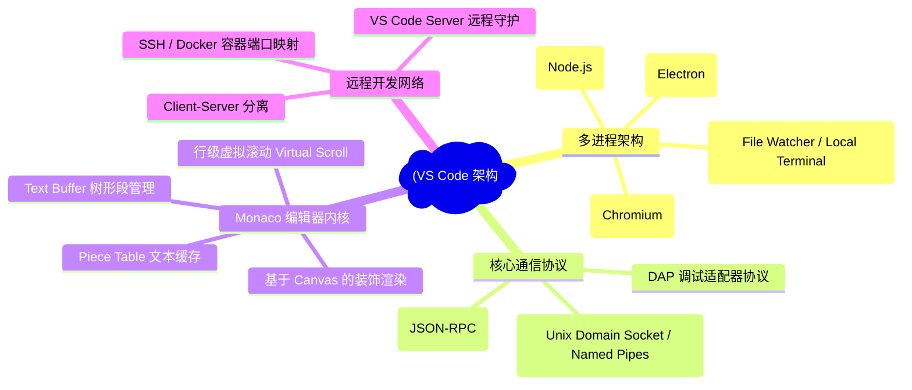
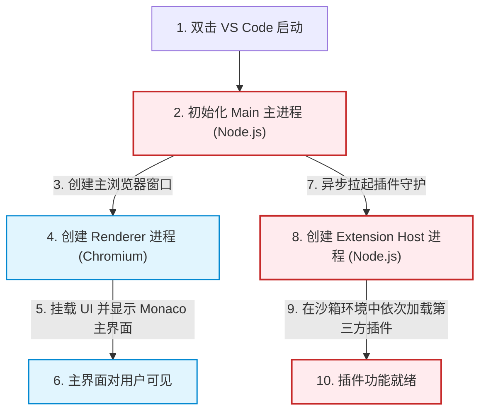
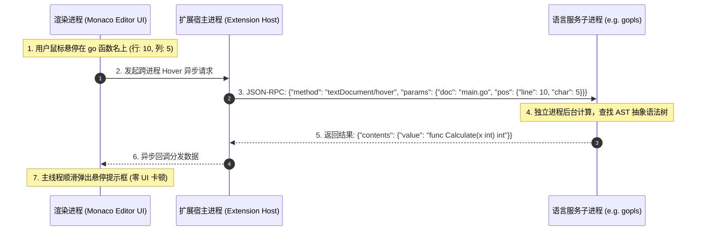

import CaseStudyHeader from '@site/src/components/CaseStudyHeader';
import DesignIntent from '@site/src/components/DesignIntent';
import EvolutionTimeline from '@site/src/components/EvolutionTimeline';
import CompareSlider from '@site/src/components/CompareSlider';
import TradeoffExplorer from '@site/src/components/TradeoffExplorer';
import GlossaryTerm from '@site/src/components/GlossaryTerm';
import ResearchNote from '@site/src/components/ResearchNote';
import GuidedExercise from '@site/src/components/GuidedExercise';
import QuizCard from '@site/src/components/QuizCard';
import MindMap from '@site/src/components/MindMap';
import PyRunner from '@site/src/components/PyRunner';

# VS Code：现代化多进程编辑器、扩展宿主隔离与 LSP 协议架构

<CaseStudyHeader
  oneLiner="VS Code 是全球占有率第一的现代化代码编辑器。它打破了传统 Web 技术编写桌面应用极易卡顿的时延魔咒，开创性地设计了扩展宿主隔离（Extension Host Isolation）的多进程架构，将所有第三方插件放逐到独立进程运行，力保 UI 渲染线程始终处于 60fps 极速响应。底层依靠 Monaco 编辑器的 Piece Table 数据结构与行虚拟滚动，配合 LSP 语言服务协议，以极致的弹性和低开销支撑起庞大的现代开发生态。"
  stats={[
    {label: '定位与类别', value: '轻量级多进程集成开发环境 (IDE)'},
    {label: '进程模型', value: '多进程架构 (Main, Renderer, Extension Host, Watcher)'},
    {label: '插件隔离模式', value: '独立的 Node.js 扩展宿主进程 (无 DOM 访问权)'},
    {label: '文本存储引擎', value: '片表 (Piece Table) 双缓冲区追加结构'},
    {label: '核心通信协议', value: 'LSP (语言服务协议) + DAP (调试适配器协议)'},
    {label: 'UI 虚拟化', value: 'Monaco Editor 视口行级虚拟滚动 (Virtual Scroll)'}
  ]}
/>

:::info 对应课程概念
本案例融合了以下课程核心概念：
*   **多进程隔离与沙箱（Month 1 操作系统）**：VS Code 通过将 Extension 移至独立 Node.js 进程，实现健壮的 UI 线程高优先级保护。
*   **RPC 与 JSON-RPC 协议（Month 5 跨进程通信）**：基于 LSP 协议的跨进程语言解析与自动补全通信机制。
*   **Piece Table 与不可变追加（Month 3 存储引擎）**：Monaco Editor 内部将大文本编辑抽象为“不可变原始缓冲区 + 追加缓冲区 + 逻辑片指针”，规避昂贵的内存字符拷贝。
*   **视口虚拟化滚动（Month 4 界面架构）**：只渲染可见区域 DOM 节点的 UI 虚拟滚动设计。
:::

---

## 1. 设计初衷：用 Web 技术打造桌面级时延的终极编辑器

在 VS Code 问世前，以 Atom 为首的第一代 Web 技术（Electron）编辑器面临严峻的性能拷问：
1.  **Atom 的卡顿泥潭**：
    *   Atom 让所有的第三方插件与核心编辑器共享同一个渲染主线程（UI Thread）。
    *   当一个插件在后台扫描项目目录、执行 ESLint 校验或者进行复杂的 Git 变更分析时，JavaScript 的单线程天性会导致渲染线程被直接占满。此时，开发人员敲击键盘的字符渲染会被直接延迟几百毫秒，产生极其恶劣的“打字卡顿感”。
2.  **隔离一切的“扩展宿主（Extension Host）”**：
    *   Erich Gamma 带领的 Microsoft 开发团队决定彻底重构进程边界：**绝对不允许插件碰 UI 的 DOM 树**。
    *   VS Code 创造性地启动了一个完全独立的 Node.js 子进程——<GlossaryTerm term="扩展宿主" definition="扩展宿主（Extension Host）是 VS Code 专门为运行第三方插件而启动的独立 Node.js 进程。插件在该进程中执行，无法直接访问 UI 的 DOM 树，所有对编辑器的操作必须通过 IPC 异步通道发送给渲染进程，从而防止插件阻塞打字渲染。">扩展宿主进程（Extension Host）</GlossaryTerm>。所有的插件（无论是代码美化、Git 增强还是主题加载）都必须运行在这个独立的沙箱进程里。
    *   插件若想修改编辑器状态，必须通过跨进程通信（IPC）向主渲染进程发送异步请求。即使某个插件由于死循环彻底卡死，也仅仅是扩展宿主进程 CPU 跑满，开发人员的打字主窗口依然能以 60 帧满速顺滑输入，完美保障了核心时延。
3.  **LSP 协议：将语言解析外包给子进程**：
    *   传统的 IDE（如 Eclipse、IntelliJ）需要在主进程中为每种语言编写复杂的 AST 语法分析器。
    *   VS Code 制定了开放的 <GlossaryTerm term="LSP" definition="LSP（Language Server Protocol，语言服务协议）是微软制定的一套基于 JSON-RPC 的开放标准协议。它将语法分析、自动补全、跳转定义等重度计算逻辑从编辑器主进程中剥离，交由独立的 Language Server 进程处理，双方通过标准协议通信，大幅降低了编辑器的内存占用与开发门槛。">LSP（语言服务协议）</GlossaryTerm>。自动补全、跳转定义等重度计算被打包进专门的子进程（Language Server，如 Pyright 或是 gopls）。编辑器只负责发送当前文档快照，Server 分析完后把 JSON 格式的结果发回。这不仅消除了主线程负荷，更以一套协议吞吐了上百种语言生态。

<DesignIntent
  problem="如何利用 Web 堆栈技术（TypeScript/HTML5/Electron）构建一个单机启动极快、打字输入毫无延迟、能够弹性接纳成千上万第三方插件，且绝不因为插件崩溃而导致主界面卡死的高性能开发平台。"
  users="全球所有的软件研发人员、前端/后端工程师，以及需要在远程容器或云端环境（GitHub Codespaces）中流畅敲击代码的高要求开发者。"
  devices="运行在 Windows、macOS 或 Linux 桌面客户端上，亦或是直接运行在现代化 Web 浏览器沙箱内（VS Code Web 模式）。"
  goals={[
    '极致打字流畅性：键盘输入到字符渲染的时延控制在 16ms（60fps 帧率）以内，消除打字卡顿',
    '扩展进程沙箱保护：将扩展插件彻底隔离在专属 Node.js 子进程中，UI 主渲染进程不受任何第三方插件计算负载的阻塞干扰',
    '标准化语言分析外包：通过标准 LSP 协议与外部语言进程进行 JSON-RPC 通信，实现轻量化的语法高亮、自动提示与跳转',
    '支持百万行级文本流畅编辑：底层 Monaco 编辑器采用 Piece Table 结构，避免由于大数组拷贝带来的内存溢出和高延迟'
  ]}
  constraints={[
    '跨进程通信（IPC）带宽瓶颈：由于插件运行在隔离进程，高频传递大体积数据（如数万行代码诊断信息）会产生序列化与反序列化 CPU 开销，造成暂时的网络堆积',
    'Electron baseline 内存开销：因为内置了 Chromium 内核和 V8 引擎，即使是一个空的 VS Code 实例，物理内存占用也在数百 MB 级，远超 Sublime 等纯原生编辑器',
    '无法直接修改 DOM 限制：由于插件被限制在 Extension Host，扩展开发人员无法随意用 CSS/HTML 篡改 VS Code 核心界面的 DOM 布局，使得部分极度个性的 UI 增强扩展难以实现'
  ]}
  firstStep="搭建 Electron 主进程（Main）与渲染进程（Renderer）的多进程生命周期框架；编写跨进程 IPC 异步协议信道；启动独立的 Node.js Extension Host 守护进程；构建 Monaco 编辑器核心的 Piece Table 模型。"
/>

---

## 2. 知识全景脑图

### 2a. 全景架构思维导图



### 2b. 交互脑图导航

<MindMap
  root={{
    label: 'VS Code 核心架构',
    children: [
      {
        label: '进程分工 (Processes)',
        children: [
          { label: 'Electron Main 主控制' },
          { label: 'Renderer 渲染界面 (Monaco)' },
          { label: 'Extension Host 插件隔离' }
        ]
      },
      {
        label: '标准通信 (Protocols)',
        children: [
          { label: 'LSP 语法分析协议' },
          { label: 'DAP 调试通道协议' },
          { label: '跨进程异步 IPC 信道' }
        ]
      },
      {
        label: 'Monaco 内核 (Editor)',
        children: [
          { label: 'Piece Table 插入双表' },
          { label: 'Virtual Scroll 视口截断' },
          { label: 'Tokenization 语法着色' }
        ]
      }
    ]
  }}
/>

---

## 3. 系统架构总览 (C4 Model)

### 3a. System Context (系统上下文图)

```mermaid
graph TB
  classDef client fill:#e1f5fe,stroke:#0288d1,stroke-width:1.5px;
  classDef main fill:#e8f5e9,stroke:#2e7d32,stroke-width:2px;
  classDef third fill:#fff9c4,stroke:#fbc02d,stroke-width:1.5px;

  Developer["开发人员 (Developer)"]:::client -->|编写/调试代码| VSCodeApp["VS Code 桌面集成开发环境"]:::main
  
  VSCodeApp <-->|读取/监控代码变更| LocalFS["("本地文件系统 (Local Filesystem)")"]:::main
  VSCodeApp <-->|获取诊断/自动补全| LanguageServer["外部语言分析服务 (Language Server, e.g. gopls)"]:::third
  VSCodeApp <-->|挂载断点调试| DebugAdapter["外部调试器 (Debug Adapter, e.g. lldb-vscode)"]:::third
```

### 3b. Container Diagram (容器结构图)

```mermaid
graph TB
  classDef main fill:#ffebee,stroke:#c62828,stroke-width:2px;
  classDef renderer fill:#e1f5fe,stroke:#0288d1,stroke-width:1.5px;
  classDef process fill:#e8f5e9,stroke:#2e7d32,stroke-width:1.5px;
  classDef protocol fill:#fff9c4,stroke:#fbc02d,stroke-width:1.5px;

  subgraph ElectronApp ["VS Code 桌面应用程序"]
    MainProcess["Electron Main 进程<br/>(负责窗口创建、菜单、本底文件 I/O)"]:::main
    
    subgraph UIWindow ["Renderer 渲染窗口进程 (Chromium)"]
      MonacoUI["Monaco Editor (UI 主界面)<br/>渲染打字、虚拟滚动、文件树"]:::renderer
    end
    
    subgraph PluginSandbox ["Extension Host 扩展宿主进程 (Node.js)"]
      ExtensionHost["Extension Host (插件运行环境)<br/>运行 GitLens, Prettier, Copilot 等插件"]:::process
    end

    MainProcess <-->|IPC 信道| MonacoUI
    MainProcess <-->|IPC 信道| ExtensionHost
    MonacoUI <-->|跨进程异步 RPC 信道 (无 DOM 直接绑定)| ExtensionHost
  end

  subgraph ExternalProcesses ["外部独立子进程"]
    LS_Process["Language Server (语言服务进程)"]:::protocol
    DAP_Process["Debug Adapter (调试适配器进程)"]:::protocol
    Watcher_Process["File Watcher (文件监控子进程 - chokidar)"]:::process
  end

  ExtensionHost <-->|JSON-RPC 协议 (LSP)| LS_Process
  ExtensionHost <-->|JSON-RPC 协议 (DAP)| DAP_Process
  MainProcess <-->|匿名管道 IPC| Watcher_Process
```

---

## 4. 核心机制拆解

### 4a. Electron 多进程架构分流与生命周期

VS Code 基于 Electron 构建，Electron 将应用分流为两层核心：
1.  **Main 进程（主进程）**：
    *   每个应用只有一个主进程。它直接运行在 Node.js 环境下，负责掌控原生操作系统的交互：创建窗口（BrowserWindow）、菜单栏控制、文件物理读写操作、以及其他进程的拉起与调度。
2.  **Renderer 进程（渲染进程）**：
    *   每个打开的 VS Code 编辑窗口对应一个独立的渲染进程。渲染进程是一个被裁剪的 Chromium 实例，只负责渲染 HTML/CSS/JS 页面。
    *   在渲染进程里，运行着核心的 **Monaco Editor**。为了打字速度，渲染进程几乎不承担重度 I/O，遇到保存文件、查找路径等重度耗时操作，一律通过 IPC 异步委派给主进程去调度，保证界面绝对不卡顿。



---

### 4b. 扩展宿主进程隔离 (Extension Host Isolation)

为了根治传统编辑器由于插件死锁导致整个编辑窗口冻结的顽疾，VS Code 设计了**扩展宿主进程隔离（Extension Host Isolation）**：
1.  **物理防线**：第三方插件绝对运行在独立的 `Extension Host` 进程里，该进程与 `Renderer` 物理隔离。
2.  **API 屏障**：
    *   扩展宿主进程通过定制的 API 向扩展开发者暴露接口，但这些接口**全部是纯数据异步的，不包含任何 DOM 树指针**（如插件只能调用 `vscode.window.showInformationMessage()` 传递文本数据，而无法直接通过 `document.getElementById` 获取 UI 上的某个按钮）。
    *   这样，即使插件内部运行着一个高耗时的死循环（例如扫描几十万行日志），卡死的也仅仅是 `Extension Host` 进程，用户依然可以用鼠标划选字符、敲击键盘，UI 主线程（Renderer）时延稳定如初。

```mermaid
graph LR
  classDef ui fill:#e1f5fe,stroke:#0288d1,stroke-width:2px;
  classDef host fill:#e8f5e9,stroke:#2e7d32,stroke-width:1.5px;
  classDef error fill:#ffebee,stroke:#c62828,stroke-width:1.5px;

  subgraph RendererProcess ["渲染窗口进程 (UI 主线程)"]
    Monaco["Monaco Editor (打字输入 60fps)"]:::ui
    UI_DOM["编辑窗口 DOM 树"]:::ui
  end

  subgraph ExtHostProcess ["扩展宿主进程 (隔离 Node.js 进程)"]
    PluginA["常规插件 (e.g., GitLens)"]:::host
    PluginB["异常插件 (发生大死循环 CPU 100%)"]:::error
  end

  Monaco <-->|跨进程异步 IPC 信道 (传递数据包)| ExtensionAPI["vscode API 边界 (序列化)"]
  ExtensionAPI <--> PluginA & PluginB

  PluginB -.->|DOM 隔离: 无法直接碰 DOM| UI_DOM
```

---

### 4c. 语言服务协议 (LSP) 与调试适配器协议 (DAP)

VS Code 在语言支持和调试上实现了划时代的标准化解耦：
1.  **LSP (Language Server Protocol)**：
    *   传统的编辑器要想支持 $M$ 种语言的自动提示、跳转定义等功能，需要为 $N$ 个不同的编辑器编写 $M \times N$ 套插件，造成生态的无意义损耗。
    *   LSP 定义了一套标准规范。VS Code 与后端的语言服务子进程（Language Server）之间使用基于 **JSON-RPC** 的网络/管道协议通信。
    *   例如，用户把鼠标悬停在 `main.go` 的某个函数上，渲染进程生成 `textDocument/hover` 的 JSON 数据发给 Language Server，Server 在后台解析语法后返回 hover 内容，VS Code 渲染悬浮窗。
2.  **DAP (Debug Adapter Protocol)**：
    *   采用与 LSP 类似的逻辑，将各种底层调试器（gdb, lldb, pdb）与编辑器的调试 UI 进行彻底解耦，使 VS Code 成为多语种调试的通用控制台。



<ResearchNote
  title="Language Server Protocol (LSP) Specification"
  source="Microsoft, RedHat, Codenvy (2016)"
  href="https://microsoft.github.io/language-server-protocol/specifications/lsp/3.17/specification/"
  insight="LSP 的出现将『编辑器研发』与『编译器前端分析』两套体系彻底解耦。通过简单的 JSON-RPC 管道，它将复杂的 O(N^2) 语言适配工程坍缩为 O(N) 的标准协议对接，成为了全行业各大 IDE 竞相效仿的事实标准。"
  application="架构启示：**协议解耦优于模块内聚**。在 Month 5 大并发平台与 Month 6 微服务设计中，当我们要对接异构的下游分析服务（如各种不同的第三方安全扫描引擎、或者多语种大模型），与其在核心系统中编写极其繁琐的适配器层（Adapter Layer），不如像 LSP 一样制定一套标准的数据交换协议契约，逼迫下游开发商提供适配的 Server 服务，将系统复杂度彻底甩给外部进程。"
/>

---

## 5. 关键数据结构与算法

### 5a. 文本编辑器核心：片表 (Piece Table) 数据结构

当用编辑器打开一个 1GB 的巨型文本文件时，如果采用传统的字符串数组（String Array）或者 Gap Buffer 存储数据，开发人员每插入一个字符，都会导致内存发生大块数据物理移动与拷贝，从而引发严重的打字卡顿甚至内存溢出。
为了解决这一世界级难题，Monaco Editor 采用了经典的 <GlossaryTerm term="片表" definition="片表（Piece Table）是文本编辑器中管理大文件编辑的数据结构。它不直接在原始字符串上插入，而是维护一个只读的 Original 缓冲区、一个只写的 Append 缓冲区，以及一个由逻辑指针节点组成的链表。所有的插入/删除操作仅需修改链表指针节点，从而实现 O(1) 级的编辑开销。">片表 (Piece Table)</GlossaryTerm> 结构：
*   **双缓冲区追加结构**：
    *   **Original Buffer**：只读缓冲区，存放打开文件时的原始文本（从不修改）。
    *   **Add Buffer**：只写追加缓冲区，存放所有新输入的内容。
*   **Piece 逻辑片列表**：
    *   Piece Table 在内存中维护一个片节点（Piece）的线性表（在 VS Code 内部使用红黑树或平衡二叉树组织以支持 $O(\log N)$ 寻址）。
    *   每个 Piece 节点仅存储三个要素：`[Source (指向 Original 还是 Add), Offset (在此 Buffer 中的起始位置), Length (长度)]`。
    *   **插入操作**：并不搬迁内存数据，仅在 `Add Buffer` 尾部追加新字符，然后将原本的 Piece 拆分为两段，中间插入一个指向 `Add Buffer` 新增位置的新 Piece，时间复杂度仅为 O(N_edits)，与文件大小完全无关。
    *   **删除操作**：同样不擦除内存，仅调整 Piece 节点的范围指针，完美达成了大文件的微秒级极速修改。

```mermaid
graph TD
  subgraph PieceTableState ["Piece Table 修改状态图 (原始: 'Hello World' -> 修改后: 'Hello Git World')"]
    subgraph Buffers ["缓冲区 (内存不改变 - 仅追加)"]
      OriginalBuf["Original Buffer (只读):<br/>'Hello World' (Len=11)"]
      AddBuf["Add Buffer (只写追加):<br/>' Git ' (Len=5)"]
    end
    
    subgraph Table ["Piece Table 节点链条 (逻辑拼接表示)"]
      Piece1["Piece 1:<br/>[Src: Original, Off: 0, Len: 6"]<br/>(逻辑代表: 'Hello ')"]
      Piece2["Piece 2:<br/>[Src: Add, Off: 0, Len: 5"]<br/>(逻辑代表: ' Git ')"]
      Piece3["Piece 3:<br/>[Src: Original, Off: 6, Len: 5"]<br/>(逻辑代表: 'World')"]
    end
  end

  Piece1 --> Piece2 --> Piece3
  Piece1 -.->|读取数据| OriginalBuf
  Piece2 -.->|读取数据| AddBuf
  Piece3 -.->|读取数据| OriginalBuf
```

---

### 5b. 虚拟滚动 (Virtual Scroll) 解决大文本页面渲染

如果一个文件有一百万行，如果直接在网页中渲染一百万个 `<div>` 标签，浏览器会因为 DOM 节点过多直接内存耗尽并卡死崩溃。
VS Code 的 Monaco 编辑器使用 <GlossaryTerm term="虚拟滚动" definition="虚拟滚动（Virtual Scroll / List Virtualization）是前端开发中用于展示海量行列表的一种性能优化技术。它并不物理渲染所有行，而是仅在 DOM 中创建与视口（Viewport）大小相同的行节点，在滚动时动态修改数据和高度位移，以此用极少的 DOM 节点表达无限的内容。">行级虚拟滚动 (Virtual Scroll)</GlossaryTerm>：
*   **视口裁剪**：渲染进程只在物理 DOM 树中渲染当前可见视口（Viewport）内的行节点（例如当前屏幕只能显示第 100 到 130 行，那么 DOM 树里就只有这 30 个 `<div>`）。
*   **绝对定位代偿**：通过计算每行的高度和当前滚动的 `scrollTop`，在可见行 `<div>` 上使用绝对定位 `translateY(y_offset)` 进行占位，并在右侧虚构一个与百万行等高的滚动条。当滚动时，Monaco 动态回收不可见行的 DOM 并复写其文本内容，将 DOM 节点数永远锚定在常数级别，实现大文件的瞬时顺滑加载。

```mermaid
graph TB
  classDef view fill:#e1f5fe,stroke:#0288d1,stroke-width:2px;
  classDef dom fill:#e8f5e9,stroke:#2e7d32,stroke-width:1.5px;
  classDef hide fill:#ffebee,stroke:#c62828,stroke-width:1.5px;

  subgraph VirtualScrollLayout ["虚拟滚动视口裁剪原理"]
    HiddenTop["[不可见行 1 ~ 99] (在内存中, 物理不创建 DOM)"]:::hide
    
    subgraph Viewport ["浏览器当前可见视口 (Viewport)"]
      DOM_Row100["DOM Row #100 (translateY: 2000px)"]:::dom
      DOM_Row101["DOM Row #101 (translateY: 2020px)"]:::dom
      DOM_Row102["DOM Row #102 (translateY: 2040px)"]:::dom
      DOM_Row103["DOM Row #103 (translateY: 2060px)"]:::dom
    end
    
    HiddenBottom["[不可见行 104 ~ 1000000] (在内存中, 物理不创建 DOM)"]:::hide
  end

  Viewport :::view
```

---

### 5c. 启发式文件观测器 (File Watcher)

为了响应外部源文件修改并刷新文件树与编辑区，VS Code 在后台拉起了一个实用的文件监视进程（File Watcher）。由于跨平台的文件监控 API（如 Linux `inotify`、macOS `FSEvents`）存在物理限额和内存损耗，VS Code 对大目录采用启发式轮询与操作系统原生事件相结合的策略，并建立黑名单机制排除 `node_modules` 等大文件夹，实现了高效的目录状态自动响应。

---

## 6. 架构演进史

VS Code 从一个浏览器内部的轻量文本输入控件，演进为撑起全球云原生开发和远程协同的霸主：

<EvolutionTimeline
  events={[
    {
      year: '2011',
      title: 'Monaco 编辑器与云端尝试',
      why: '微软需要一套完全基于 Web 标准（HTML5/JS）的高性能编辑器内核，用以支持云端控制台（Azure Console）和在线 Office 的编辑体验。',
      change: '推出基于 Canvas 装饰渲染和 DOM 混合排版的 Monaco Editor，为日后跨平台布局打下了极致的性能根基。'
    },
    {
      year: '2015',
      title: 'VS Code 开源发布 (多进程防线)',
      why: '第一代 Web 桌面编辑器（Atom）卡顿频发，微软团队在移植 Monaco 到桌面端时，下定决心必须解决插件阻塞主线程的顽疾。',
      change: '确立 Electron 多进程架构；强制推行隔离的 Extension Host 扩展宿主进程，划定不可触碰 DOM 的安全 API 边界。'
    },
    {
      year: '2016-2018',
      title: 'LSP / DAP 协议标准化革命',
      why: '多语种语法高亮与调试生态陷入重复造轮子泥潭，各开发商由于编辑器碎片化各自为战。',
      change: '联合多方正式推出 LSP 与 DAP 规范，将语言编译语法树计算剥离出主窗口进程，使 VS Code 瞬间拥有了媲美传统 IDE 的丰富功能生态。'
    },
    {
      year: '2019 至今',
      title: 'Remote Development 远程开发大拆分',
      why: '云计算时代到来，代码库体积达几十 GB，开发者的笔记本电脑性能与安全性无法承担在本地编译、调试巨型项目的压力。',
      change: '将 VS Code 核心架构垂直切开：本地仅保留 Renderer 渲染 UI，而将 Extension Host 和 LS/DAP 守护服务打包成 VS Code Server 进程，运行在远程服务器/ Docker 容器中，开辟了“本地编辑、云端执行”的全新云原生研发范式。'
    }
  ]}
/>

---

## 7. 架构对比：单线程插件 Atom 编辑器 vs. 多进程隔离 VS Code 架构

<CompareSlider
  before={
    <div style={{ padding: '20px', background: '#ffebee', border: '1px solid #c62828', borderRadius: '8px', height: '100%', color: '#333' }}>
      <strong>Atom 编辑器 (单主进程混合)</strong>
      <p style={{ marginTop: '10px', fontSize: '0.9rem' }}>插件直接运行在 UI 渲染主线程中，且插件拥有完全对 DOM 树的自由修改权。优点是高度灵活，定制范围极广；缺点是一旦某个插件在后台读取重度文件或计算卡死，整个打字界面会瞬间顿卡，打字延迟大幅飙升并经常崩溃。</p>
    </div>
  }
  after={
    <div style={{ padding: '20px', background: '#e8f5e9', border: '1px solid #2e7d32', borderRadius: '8px', height: '100%', color: '#333' }}>
      <strong>VS Code (多进程隔离架构)</strong>
      <p style={{ marginTop: '10px', fontSize: '0.9rem' }}>将扩展插件放逐到独立的 Node.js 扩展宿主子进程（Extension Host），只向插件提供基于序列化消息的数据 API 边界，严禁触碰 DOM。主 Renderer 进程近乎纯无状态 Monaco 打字渲染，时延极为平滑，插件卡死对 UI 线程毫无波及。</p>
    </div>
  }
  labels={['Atom 单线程混合', 'VS Code 多进程隔离']}
/>

---

## 8. 设计模式与课程映射

本案例在现代化大型客户端/服务器架构中，深度应用了以下课程章节中的核心设计模式与技术：

1.  **多进程隔离与守护模式**（参见 [操作系统与进程基石](../01-foundations/programming-systems-primer.mdx) 章节）：
    *   将 Extension 隔离到 Node.js 独立进程，与 Chrome 的 Sandbox 机制类似。这代表了软件安全性设计中“最小特权（Least Privilege）”和“故障域隔离（Fault Domain Isolation）”的核心理念。
2.  **JSON-RPC 协议与远程过程调用**（参见 [服务间通信与 RPC](../05-core-components/service-discovery.mdx) 章节）：
    *   LSP（语言服务协议）基于标准 JSON-RPC。这体现了跨进程通信中“松耦合、强类型契约”的设计，与 Month 5 大并发微服务中的 RPC 通信在思路上如出一辙。
3.  **不可变双缓冲区与片指针列表**（参见 [存储引擎与持久化](../03-data-cache-queue/storage-engines.mdx) 章节）：
    *   Monaco 的 Piece Table 将所有编辑操作转为“指针移动”，保留 Original Buffer 不变。这种做法实质上应用了设计模式中的“不可变模式”与存储层中“追加日志写（LSM Log-structured）”的思路，避免了随机内存移动的昂贵代价。
4.  **视口虚拟化代理模式**（参见 [设计模式与 LLD](../04-design-patterns-lld/overview.mdx) 章节）：
    *   行级虚拟滚动（Virtual Scroll）在 UI 前端应用了“代理模式（Proxy Pattern）”与“享元模式（Flyweight Pattern）”。它用数十个 DOM 实例在滚动时循环换装，代理展示了上百万行的庞大行库。

---

## 9. 权衡：桌面级 Web 堆栈开发工具的架构折中

VS Code 在可扩展性、时延保障以及物理资源占用之间做出了以下取舍：

<TradeoffExplorer
  title="VS Code 多进程、Electron 与高响应架构权衡"
  dimensions={['打字与渲染微秒级时延', '宿主客户端物理内存占用', '第三方插件生态接纳能力', '开发语言多端统一维护性', '大容量单文件编辑流畅性']}
  options={[
    {
      name: '多进程扩展隔离 + Electron/Web 堆栈 (VS Code)',
      scores: [5, 2, 5, 5, 4],
      note: '通过扩展宿主物理隔离和 LSP 协议，VS Code 获得了顶级的打字响应和近乎无限的跨平台插件生态，且 TypeScript 跨桌面和云端极易维护。代价是 Chromium + V8 的基线内存极高（随便吃掉几百 MB 内存），对低配机器不友好。',
      whenToUse: '拥有主流机器配置、极其看重打字相应和插件生态（如 Git 整合、Copilot 辅助）、且需要远程或 Web IDE 统一化协作的现代开发者。'
    },
    {
      name: '纯原生 C++ 单主进程单线程 UI 模型 (如早期 Sublime Text)',
      scores: [5, 5, 2, 1, 5],
      note: '使用纯原生 C++ 及系统 GUI 库编写，启动极其迅速，仅消耗几十 MB 内存。但由于不支持隔离运行的扩展进程，编写复杂 UI 插件极难，无法引入像 LSP 那样庞大的生态，且插件一旦死锁整个编辑器依然有卡顿概率。',
      whenToUse: '极度看重内存开销和极速启动时间、常需要秒级打开大型文本、仅做简单编辑的临时辅助开发场景。'
    },
    {
      name: '全云端全托管 Browser/IDE 彻底分离模型 (如 Codespaces 纯云开发)',
      scores: [3, 4, 5, 4, 3],
      note: '本地仅为一个网页，所有的插件、编译器、调试器全部运行在云端的高配置虚拟机中，本地物理开销无限接近于零。但代价是完全依赖稳定的网络连接，断网即瘫痪，且网络抖动直接导致打字命令交互反馈延迟。',
      whenToUse: '公司代码库高度机密不允许落盘本地、团队配有良好的专属专线网络、且大范围实行云端容器标准化构建的项目研发组。'
    }
  ]}
/>

---

## 10. 如果是你来设计：Monaco 编辑器 Piece Table 数据结构模拟器

### 场景设想
在 Monaco 编辑器底层中：
*   如果使用单纯的字符串拼接或者数组替换，当打开数万行的巨型代码文件并高频按键插入字符时，内存会发生严重的行级拷贝移动，甚至导致垃圾回收爆发、打字卡死。
*   为了实现 $O(1)$ 或极低时间开销的修改，Monaco 引入了 Piece Table（片表）：
    1.  `original_buf`：只读原始文件字符。
    2.  `add_buf`：专门追加存放新写入内容的字符串。
    3.  `pieces`：一个由 `Piece` 节点构成的逻辑列表。每个 `Piece` 定义为 `[source_buffer, offset, length]`。
*   当我们在文本的某个偏移量（offset）处插入数据时：
    *   在 `add_buf` 尾部追加新字符串（无随机拷贝，性能极高）。
    *   在 `pieces` 链表中找到对应位置的 piece，将其截断并拆分为两段：在中间插入一个指向 `add_buf` 最新追加段的新 piece。
    *   **没有任何原本的内容字符被物理移动！**

请你用 Python 实现这套巧妙的大文件 Piece Table 编辑算法模型。

<GuidedExercise
  title="基于 Python 的 Monaco Piece Table 编辑器内核仿真"
  goal="实现包含 Original/Add 双缓冲区、Piece 节点列表分割与插入逻辑的片表存储引擎，并验证在大文本编辑下的零内存复制优势。"
  steps={[
    '步骤 1: 设计 Piece 结构体。包含 `source` 指向（`"original"` 或 `"add"`）、在对应 buffer 中的 `offset`、以及本段文本长度 `length`。',
    '步骤 2: 设计 PieceTable 类。初始化时将全部初始文本放入 `original_buf`，并在 pieces 中加入一条指向它的初始 Piece。',
    '步骤 3: 实现 `get_text()`。遍历 pieces 列表，根据 source 和指针切片截取字符串，最后拼接出整个文档当前的最新视图文本。',
    '步骤 4: 实现核心的 `insert(char_index, new_text)` 方法。首先在 pieces 列表中精确定位出 `char_index` 所属的 Piece 节点以及在此节点内的偏移值。接着将新文本追加写入 `add_buf`，将原 Piece 一切为二，在中间插入新 Piece。',
    '步骤 5: 验证仿真。模拟打开文本“Hello World”，在 Index 6 处插入“Git ”，检验输出是否顺利拼接为“Hello Git World”；并且确认原始 “Hello World” 内存缓冲区未曾被修改半分。'
  ]}
  checks={[
    '确认在执行 insert 插入新文本后，`original_buf` 中的内容始终保持未变 (Immutable)',
    '验证每次插入仅会导致 pieces 列表中的指针节点数增加或分裂，没有涉及旧字符串数组的复制',
    '确认当控制台打印出“✅ Monaco Piece Table 状态机自验证成功！”时，模拟器工作正常'
  ]}
/>

#### 交互式 Python 运行实验
在下方控制台中直接运行或修改已准备好的 Monaco Piece Table 编辑算法仿真代码：

<PyRunner
  expect="Monaco Piece Table 状态机自验证成功"
  rows={25}
  code={`class Piece:
    def __init__(self, source, offset, length):
        self.source = source  # "original" 或者是 "add"
        self.offset = offset  # 在对应缓冲区中的起始偏移
        self.length = length  # 该片段包含的字符长度

    def __repr__(self):
        return f"[Src: {self.source} | Off: {self.offset} | Len: {self.length}]"

class PieceTable:
    def __init__(self, initial_text):
        self.original_buf = initial_text  # 原始只读缓冲区
        self.add_buf = ""                 # 物理追加写缓冲区
        # 初始只包含一个 Piece，指向整个 original_buf
        self.pieces = [Piece("original", 0, len(initial_text))]

    def get_text(self):
        # 顺着 Piece 链条，逻辑组装出当前最新的物理文本内容
        result = []
        for piece in self.pieces:
            if piece.source == "original":
                result.append(self.original_buf[piece.offset : piece.offset + piece.length])
            else:
                result.append(self.add_buf[piece.offset : piece.offset + piece.length])
        return "".join(result)

    def insert(self, char_index, new_text):
        if not new_text:
            return

        # 1. 在 add_buf 尾部顺序追加新输入的文本，记录在 add_buf 里的起始偏移
        add_offset = len(self.add_buf)
        self.add_buf += new_text
        new_piece = Piece("add", add_offset, len(new_text))

        # 2. 沿着 pieces 指针列表，寻找到要插入的位置所属的那个 Piece
        current_len = 0
        inserted = False

        for i, piece in enumerate(self.pieces):
            # 检查插入位置是否落在当前 Piece 的覆盖范围内
            if current_len <= char_index <= current_len + piece.length:
                # 算出在该 Piece 内部的偏移字符量
                inner_offset = char_index - current_len
                
                # 开始分拆 Piece 节点
                left_piece = Piece(piece.source, piece.offset, inner_offset)
                right_piece = Piece(piece.source, piece.offset + inner_offset, piece.length - inner_offset)
                
                # 重组 pieces 列表
                new_pieces_slice = []
                if left_piece.length > 0:
                    new_pieces_slice.append(left_piece)
                new_pieces_slice.append(new_piece)
                if right_piece.length > 0:
                    new_pieces_slice.append(right_piece)
                
                # 将原来的单节点分裂替换
                self.pieces[i:i+1] = new_pieces_slice
                inserted = True
                break
            current_len += piece.length

        if not inserted:
            # 若 char_index 处于文档末端，直接追加
            self.pieces.append(new_piece)

# 测试开始
pt = PieceTable("Hello World")

print("--- 步骤 1: 初始化 Piece Table ---")
print(f"初始文本内容: '{pt.get_text()}'")
print(f"Original Buffer 内容: '{pt.original_buf}'")
print(f"当前 Piece 列表: {pt.pieces}")


print("\\n--- 步骤 2: 在 Index 6 处插入 'Git ' (预期: 'Hello Git World') ---")
pt.insert(6, "Git ")
print(f"当前拼接文本: '{pt.get_text()}'")
print(f"Original Buffer 内容 (不变): '{pt.original_buf}'")
print(f"Add Buffer 内容 (追加): '{pt.add_buf}'")
print(f"当前 Piece 列表分裂变化:")
for p in pt.pieces:
    print(f"  {p}")


print("\\n--- 步骤 3: 在 Index 10 处追加插入 'Code ' (预期: 'Hello Git Code World') ---")
pt.insert(10, "Code ")
print(f"最终拼接文本: '{pt.get_text()}'")
print(f"最终 Piece 列表:")
for p in pt.pieces:
    print(f"  {p}")

# 最终自校验
if (pt.get_text() == "Hello Git Code World" and 
    pt.original_buf == "Hello World" and 
    len(pt.pieces) == 4):
    print("\\n[✅ 验证成功]: Monaco Piece Table 状态机自验证成功！")
else:
    print("\\n[❌ 验证失败]")
`}
/>

---

## 11. 常见误解

### 误解 1：VS Code 基于单线程 JavaScript 机制运行，因此任何高 CPU 负载的扩展插件都必然导致打字延迟
*   **澄清**：这是完全错误的。
    1.  VS Code 通过**物理多进程模型**彻底断绝了这一干扰。
    2.  第三方扩展并不在 Renderer（主打字和排版界面）的单线程中执行，而是在完全隔离的独立操作系统进程 `Extension Host` 中运行。
    3.  因此，即使一个扩展在后台执行非常重度且阻塞的 AST（抽象语法树）分析或递归正则匹配，导致扩展宿主进程 CPU 100% 满负荷卡死，Renderer 渲染进程所占用的打字输入主循环依旧正常轮询，时延完美控制在 16 毫秒以内。

### 误解 2：LSP 协议传输的是 JSON 格式的字符串，所以必然有高昂的网络延迟，开发提示体验差于传统本地 IDE
*   **澄清**：这是对现代跨进程 IPC 吞吐能力的低估。
    1.  VS Code 与 Language Server 之间的通信并不是跨越公网的 HTTP 请求，而是发生在同一台计算机本地的 **IPC 通道**（在 Linux/macOS 上是 Unix Domain Socket，在 Windows 上是 Named Pipe），其数据传递几乎等同于本地内存的物理读写。
    2.  在几毫秒的极速信道面前，网络传输的延迟根本不是核心矛盾。真正耗时的是语言解析引擎构建语法树和索引的耗时（即使是传统 IDE，这部分计算也在所难免）。LSP 的解耦反而使得这部分重度计算能脱离 UI 线程，大幅提升了整体流畅性。

### 误解 3：VS Code 的 Piece Table 可以无锁无限大并发操作，所以它是一套纯并发安全的多线程编辑库
*   **澄清**：这是误读。
    1.  虽然 Piece Table 数据结构因为不移动物理数据，其插入和删除速度惊人，但其底层链表（或红黑树）在被修改时**并非天生并发安全**。
    2.  VS Code 的 Monaco UI 始终是处于**渲染进程的单一主事件循环**中串行执行 Piece Table 指针移动的。也就是说，VS Code 通过将编辑操作序列化到单线程主循环里，巧妙避免了多线程并发竞争带来的数据错乱风险。如果多线程并发无锁去修改 Piece 链表，树结构极易分裂损毁。

---

## 12. 知识自测

<QuizCard
  questions={[
    {
      q: '在 VS Code 架构中，当某个第三方插件（例如一个不小心的 linter 插件）内部陷入了死循环导致 CPU 占满卡死，编辑器的表现会是怎样的？',
      options: [
        'A. 编辑器窗口会直接白屏，打字无响应，必须强制杀掉整个 VS Code 进程重启',
        'B. 当前插件功能失效，但打字区依然能够以 60fps 的速度流畅响应用户敲击键盘与鼠标选中，主界面不会有任何顿卡',
        'C. 只有保存文件功能被强制锁死，其他功能一切正常',
        'D. 编辑器会自动利用 Zookeeper 协商，切换到备用渲染进程'
      ],
      answer: 1,
      explain: '这得益于扩展宿主隔离（Extension Host Isolation）。插件运行在独立的 Node.js 子进程中，与负责 Monaco 打字渲染的 Renderer 进程完全物理隔离。因此插件进程卡死绝不会干扰到 Renderer 进程的主事件循环，保护了核心的时延体验。'
    },
    {
      q: 'Monaco 编辑器在处理 1GB 超大文本文件时，为什么能实现微秒级的修改并能有效防范内存溢出？',
      options: [
        'A. 它将整个大文件分成数万个小文件，在后台进行并发的磁盘写入',
        'B. 底层采用 Piece Table 结构，原始文件作为只读缓冲区从不修改，新修改只往追加缓冲区写，并通过 Piece 指针列表逻辑组装，避免了高昂的文件整体字符拷贝与内存位移开销',
        'C. 它会在用户打字时，强制将文本中的所有空格和换行擦除以节约空间',
        'D. 依靠多活 Active Controller 在本地执行 Raft 副本同步'
      ],
      answer: 1,
      explain: 'Piece Table 的精髓在于 Immutable + Pointer。原始文本 original_buf 和新增内容 add_buf 都是只读/只追加的不可变对象，编辑动作仅仅是分拆和重组 Piece 指针列表，把原有的 O(N) 级物理字符数据拷贝压缩到了 O(1) 指针裂变，从根本上攻克了大文本卡顿瓶颈。'
    },
    {
      q: 'LSP (Language Server Protocol) 核心标准化设计的最大价值是什么？',
      options: [
        'A. 统一了全球所有编辑器的界面主题风格，让开发人员无需重复配置',
        'B. 让编辑器主进程能直接以多线程并发安全地在 GPU 上渲染复杂的 3D 着色代码',
        'C. 将复杂的语言语法解析逻辑从特定编辑器的代码中解耦，使得一次编写的 Language Server（如 gopls）能被上百个支持 LSP 协议的异构开发工具共用，消除了 O(M*N) 的生态适配损耗',
        'D. 强制要求所有编程语言都必须符合 WebAssembly 标准才能执行'
      ],
      answer: 2,
      explain: 'LSP 成功的关键在于统一了编辑器与语法分析器之间的接口契约。把本来需要嵌入每个编辑器的重度 AST 分析、定义跳转等计算，划归给语言专有的子进程独立运行，实现了架构的高灵敏解耦。'
    }
  ]}
/>

---

## 来源清单

*   [Gamma, E., Pasero, B., & VS Code Engineering Team, Visual Studio Code Architecture & Multi-Process Model (Microsoft Wiki)](https://github.com/microsoft/vscode/wiki/Architecture-Overview)
*   [Microsoft, Language Server Protocol Official Standard Specification v3.17](https://microsoft.github.io/language-server-protocol/specifications/lsp/3.17/specification/)
*   [Xi, Y. (2018), Text Buffer Reimplementation - Piece Table in Monaco Editor (VS Code Technical Blogs)](https://code.visualstudio.com/blogs/2018/03/23/text-buffer-reimplementation)
*   [Benjamin Pasero, VS Code Remote Development internals and Server-Client Architecture](https://code.visualstudio.com/blogs/2019/05/02/remote-development)