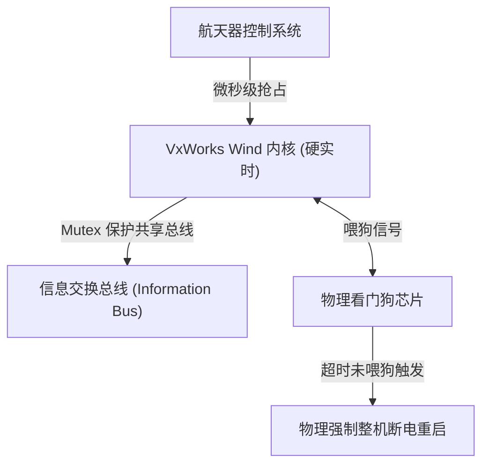
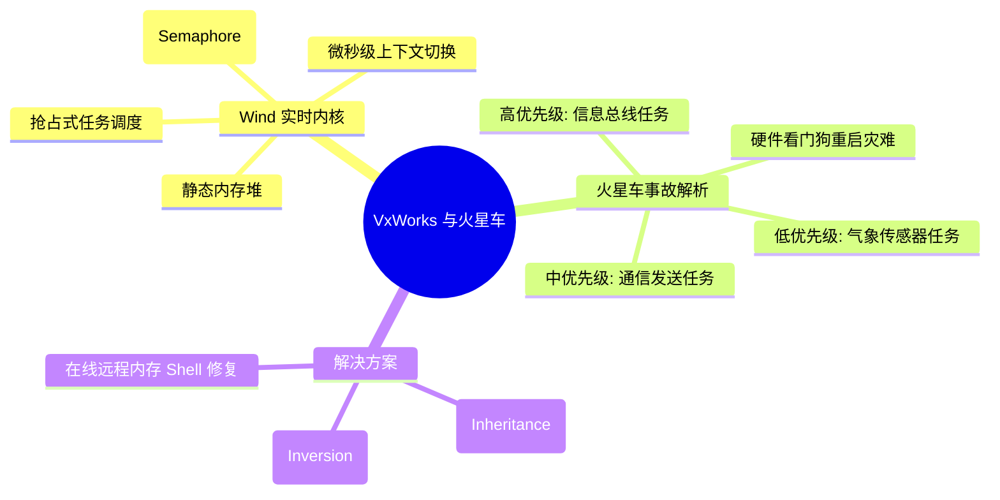
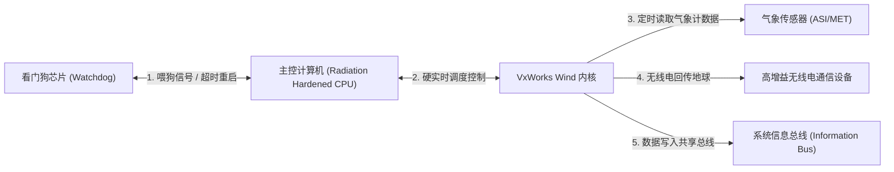
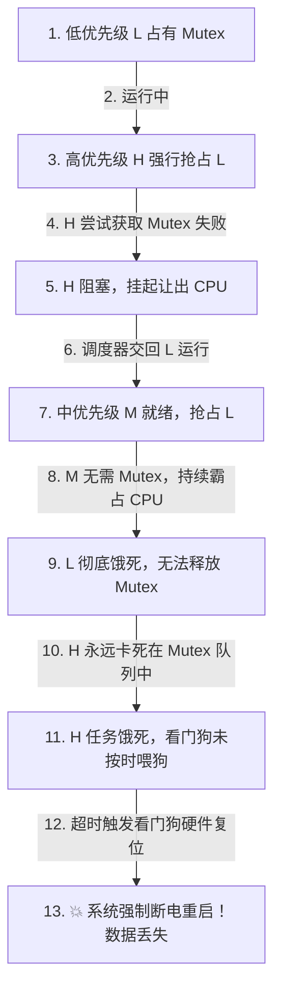
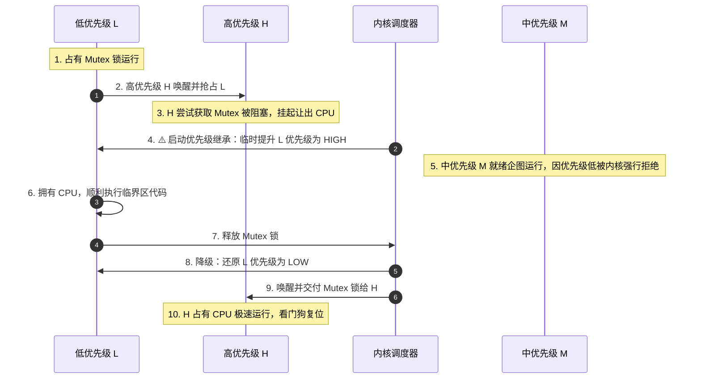
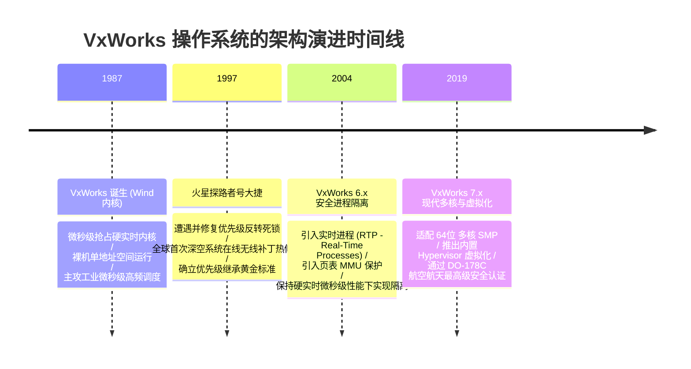

import CaseStudyHeader from '@site/src/components/CaseStudyHeader';
import DesignIntent from '@site/src/components/DesignIntent';
import ArchitectureEvolution from '@site/src/components/ArchitectureEvolution';
import TradeoffExplorer from '@site/src/components/TradeoffExplorer';
import GlossaryTerm from '@site/src/components/GlossaryTerm';
import ResearchNote from '@site/src/components/ResearchNote';
import QuizCard from '@site/src/components/QuizCard';
import CompareSlider from '@site/src/components/CompareSlider';
import GuidedExercise from '@site/src/components/GuidedExercise';
import PyRunner from '@site/src/components/PyRunner';

# VxWorks：硬实时内核与火星车优先级反转大捷

<CaseStudyHeader
  oneLiner="VxWorks 作为航空航天与国防级硬实时的无冕之王，以微秒级确定性抢占与卓越稳定性支撑了无数外星探测任务；其在火星探路者号上的‘优先级反转在线急救’，更是软件架构与实时并发设计史上最具传奇色彩的战役。"
  stats={[
    {label: '内核类型', value: 'Wind (微秒级抢占硬实时内核)'},
    {label: '核心故障', value: '1997 火星车优先级反转事故'},
    {label: '系统防护', value: 'Watchdog Timer (硬件看门狗复位)'},
    {label: '修复策略', value: 'Priority Inheritance (优先级继承补丁)'},
    {label: '航天案例', value: '火星探路者号 (Mars Pathfinder)'}
  ]}
/>

:::info 对应课程概念
本案例横跨 [Month 1 操作系统调度与硬件看门狗](../foundations/programming-systems-primer)、[Month 4 低阶设计 (LLD) 与互斥同步锁](../foundations/programming-systems-primer)、[Month 6 高可靠与航空级容错设计](../cloud-enterprise-industrial/capstone-cloud-native)。它向系统架构师展示了并发控制在没有人工干预的外星极端环境下，一个细微的信号量参数失误是如何被物理放大，并最终通过远程注入无线补丁实现起死回生的工程奇迹。
:::

## 1. 设计初衷：如何保障外星飞船的“绝对确定性”？

在远离地球数亿公里的深空探测中，航天控制计算机必须运行在极度严苛的硬实时环境里。控制喷推点火、姿态调整的任务哪怕被延迟了几毫秒，都可能导致飞船与地球彻底失联。

VxWorks 被设计为航空级硬实时操作系统的核心目标：
1. **微秒级确定性抢占（Microsecond Preemption）**：调度器必须保证，一旦最高优先级任务（如雷达避障、姿态控制）被硬件中断唤醒，它必须在微秒级时间内强行剥夺当前运行任务的 CPU 执掌权，并且调度时间不随系统任务总数的增加而衰减。
2. **硬件看门狗硬件容错（Watchdog Security）**：当系统由于死锁（Deadlock）或未知死循环导致 CPU 卡死时，物理上的 **<GlossaryTerm term="Watchdog Timer" definition="Watchdog Timer：看门狗计时器。一种硬件防死锁芯片。系统运行时，主控制任务必须高频向该芯片发送重置计数信号（俗称‘喂狗’）。如果系统发生死锁或任务卡死，导致规定时间内没有喂狗，看门狗芯片将触发硬件电路断电重启，强制重置整个系统以恢复运行。">看门狗（Watchdog Timer）</GlossaryTerm>** 必须能侦测到该异常并发出硬重置信号，强制整机重启以脱离死机状态。
3. **高并发下的线程同步防护**：在没有虚拟内存单元（MMU）的大多数航天裸板下，任务直接读写物理内存，线程之间依赖互斥量（Mutex）同步。内核必须提供可配置的死锁防御，保障高优先级任务不受阻碍。



<DesignIntent
  problem="如何在没有地表网络、无法物理接触的极端外星环境下，防范由于共享互斥量锁竞争引发的优先级反转死锁，并保证看门狗定时器不因为高优先级任务被饿死而频繁重启飞船？"
  users="NASA 深空探测工程师、防务装备架构师、高精度工业控制开发者，要求系统具有极佳的时间确定性，容忍恶劣的宇宙辐射与零本地人工维护环境。"
  devices="火星探路者号火星车、好奇号/毅力号火星车、军用相控阵雷达系统、大型重症监护呼吸机。"
  goals={[
    'Wind 实时调度器：实现以绝对优先级为导向的抢占调度，提供微秒级的上下文切换速率。',
    '火星车优先级反转防御：在 `semMCreate` 信号量创建中，开启优先级继承开关，防止中优先级通信任务卡死低优先级气象任务。',
    '看门狗复位防御：确保高频的信息总线任务能够按时喂狗，看门狗芯片维持正常计数。',
    '远程无线补丁更新：通过 VxWorks Shell 在线远程修改内核内存中的全局信号量参数标记，实现不重新烧录 ROM 的在线修复。'
  ]}
  constraints={[
    '优先级继承的计算开销：开启优先级继承意味着内核需要在每次任务阻塞时向上遍历锁的持有链，动态更新 TCB 优先级，带来轻微的时钟周期损耗。',
    '无 MMU 内存污染风险：由于任务直接寻址物理内存，任务异常写可能直接改写内核，需要极度严格的代码静态验证与测试。'
  ]}
  firstStep="深入剖析 Pathfinder 发生的 3 个优先级任务（H, M, L）的冲突原委；实现优先级继承提权逻辑；在仿真器中复现看门狗超时崩溃。"
/>

## 2. 系统功能全景

以下是 VxWorks 实时内核及火星车故障排查技术组成的全景图：



---

## 3. 最新架构总览

VxWorks 操作系统的整体硬件对齐与 Pathfinder 系统任务级隔离如下：

### 3a. System Context (系统上下文)



### 3b. Container Diagram (容器架构)

```mermaid
graph TB
  subgraph UserModeSpace["VxWorks 任务运行平面 (无 MMU 物理地址直寻)"]
    subgraph SpaceTasks["火星探测核心任务"]
      TaskHigh["高优先级: 信息总线任务 (Info Bus)"]
      TaskMed["中优先级: 无线通信任务 (Comm)"]
      TaskLow["低优先级: 气象数据任务 (ASI/MET)"]
    end
    
    subgraph WindOS["Wind 内核服务"]
      Scheduler["硬实时抢占调度器"]
      MutexMgr["信号量管理器 (Semaphore Manager)"]
      WatchdogFeeder["看门狗喂狗任务"]
    end
  end

  subgraph Hardware["火星车物理芯片 (RAD6000 处理器)"]
    SharedRAM["物理共享 SRAM (128MB)"]
    WatchdogChip["看门狗物理芯片 (WDT)"]
  end

  TaskHigh -->|1. 读写共享总线| SharedRAM
  TaskLow -->|2. 独占获取 Mutex 信号量| MutexMgr
  TaskHigh -->|3. 请求同一个 Mutex 锁 (阻塞)| MutexMgr
  
  TaskMed -->|4. 抢占低优先级 Task Low (无需锁)| Scheduler
  Scheduler <-->|5. 轮转任务控制块 TCB| SharedRAM
  
  WatchdogFeeder -->|6. 定期写入清零寄存器| WatchdogChip
  TaskHigh -->|7. 唤醒并驱动| WatchdogFeeder
```

---

## 4. 核心机制拆解

### 4a. 1997 火星探路者号“优先级反转”灾难原委 (Priority Inversion)

1997 年，NASA 火星探路者号在火星降落几天后，突然发生频繁的莫名死机重启，数据全部丢失。

技术剖析发现，Wind 内核遭遇了经典的**<GlossaryTerm term="Priority Inversion" definition="Priority Inversion：优先级反转。实时系统中的一种调度故障。高优先级任务因为等待一个被低优先级任务持有的锁而阻塞，而此时一个不需要锁的中优先级任务就绪并抢占了低优先级任务，导致低优先级任务无法执行释放锁，使得高优先级任务被中优先级任务无限期饿死。">优先级反转（Priority Inversion）</GlossaryTerm>**机制死锁：
1. **任务卡位**：低优先级气象任务 L（ASI/MET）占有了共享信息总线的互斥锁 `Mutex`。
2. **高优先级请求**：高优先级总线调度任务 H（Info Bus）启动，试图写总线，因为拿不到 `Mutex` 锁而被强行阻塞挂起。
3. **中优先级插刀**：中优先级的无线电通信任务 M（Comm）不需要任何锁，由于其优先级比 L 高，调度器立刻让 M 运行，抢占了 L 的 CPU 份额。
4. **饿死与崩溃**：中优先级任务 M 运算量巨大，持续霸占 CPU。导致低优先级任务 L 无法获得任何 CPU 时间去完成工作并释放 `Mutex`。结果，最高优先级的任务 H 被无限期饿死卡死！
5. **看门狗咬人**：高频运行的信息总线任务 H 长期得不到响应，导致看门狗守护任务无法按时重置看门狗芯片（俗称“喂狗”）。物理看门狗计数溢出，判定系统死机，强行发出 Reset 电性脉冲，火星车悲惨地重启复位。



### 4b. 解决方案：优先级继承机制与在线急救补丁

NASA 工程师在地球实验室连夜排查，发现了该 Bug 并非由于代码逻辑错误，而是由于 VxWorks 互斥信号量创建函数 `semMCreate` 默认关闭了优先级继承机制。

**修复对策（优先级继承 Priority Inheritance）**：
- 当高优先级任务 H 因为等待 L 持有的 `Mutex` 而进入阻塞时，Wind 内核调度器自动介入，**将 L 的优先级临时提升到与 H 完全一致的最高级**。
- 此时，新启动的中优先级任务 M 企图运行，由于其优先级低于此时已被提权的 L，抢占被内核拒绝。
- 低优先级任务 L 得以继续占用 CPU 运行，快速离开临界区并释放 `Mutex`。
- `Mutex` 一旦释放，L 自动降回其基准低优先级；高优先级任务 H 瞬间拿到锁并被唤醒运行，完成总线写入，看门狗复位，危机彻底解除。



---

## 5. 关键数据结构与算法：优先级继承互斥锁管理

在 VxWorks 的 Wind 内核底层，互斥量结构体及提权控制算法是保障实时系统不发生死锁的基石。

### 互斥信号量控制结构
```c
typedef struct {
    UINT8       semType;             // 信号量类型 (如 MUTEX)
    TASK_ID     owner;               // 当前占用该互斥锁的任务 ID (TCB_t 指针)
    UINT8       options;             // 创建参数 (如 SEM_INVERSION_SAFE 优先级继承开关)
    LIST        waitQueue;           // 被阻塞在该锁上的任务链表队列
    int         ownerBasePriority;   // 锁持有者的基准优先级 (用于释放后还原)
} VX_MUTEX;
```

*提权算法伪代码实现*：
```c
void taskLockBlockOnMutex(VX_MUTEX *mutex, TASK_ID currentTask) {
    if (mutex->options & SEM_INVERSION_SAFE) {
        TASK_ID lockHolder = mutex->owner;
        // 如果当前等待的任务优先级高于持有锁任务的当前优先级
        if (currentTask->priority > lockHolder->priority) {
            // 临时提升持有锁任务的优先级
            lockHolder->priority = currentTask->priority;
            // 重新排列就绪任务表位置，使其不被中优先级打断
            rescheduleTask(lockHolder);
        }
    }
}
```

---

## 6. 架构演进史

VxWorks 作为硬实时软件，经历了从裸机调度到太空控制，再到现代高安全多核虚拟化的演进：



---

## 7. 架构对比

### 默认无防御互斥锁（ Pathfinder 重启模式） vs 开启优先级继承互斥锁（火星大捷模式）

<CompareSlider
  before={
    <div style={{ padding: '20px', background: '#ffebee', border: '1px solid #c62828', borderRadius: '8px', height: '100%', color: '#333' }}>
      <strong>默认无防御互斥锁 (Pathfinder 重启)</strong>
      <p style={{ marginTop: '10px', fontSize: '0.9rem' }}>
        系统创建互斥量时，未开启反转保护参数。低优先级任务持有锁被中优先级任务抢占时，内核袖手旁观。高优先级任务被无限期阻塞导致看门狗溢出，物理硬件强制断电复位，系统频繁停机丢失工作数据。
      </p>
    </div>
  }
  after={
    <div style={{ padding: '20px', background: '#e8f5e9', border: '1px solid #2e7d32', borderRadius: '8px', height: '100%', color: '#333' }}>
      <strong>优先级继承安全锁 (火星大捷)</strong>
      <p style={{ marginTop: '10px', fontSize: '0.9rem' }}>
        系统创建锁时配置了 `SEM_INVERSION_SAFE` 参数。一旦高优先级发生等待，持有锁的低优先级任务被瞬间提权，力压中优先级进程的抢占，执行完毕后释放锁并原路降级。系统不发生卡顿，顺利完成深空任务。
      </p>
    </div>
  }
  labels={['默认无防御互斥锁', '优先级继承安全锁']}
/>

---

## 8. 核心决策的取舍

在硬实时系统设计中，架构师对共享资源的锁竞争策略有三种截然不同的方案：

<TradeoffExplorer
  title="实时系统锁同步死锁防御策略取舍"
  dimensions={['防止高优先级任务被饿死', '防止循环等待死锁 (Deadlock)', 'Malloc 动态提权算法性能损耗', '对任务最高优先级的已知要求', '开发和运行时配置复杂度']}
  options={[
    {
      name: '优先级继承策略 (Priority Inheritance - VxWorks 修复模式)',
      scores: [5, 4, 3, 5, 4],
      note: '当高优先级发生阻塞时，动态提升锁持有者的优先级。无需预先知道系统所有任务的属性，配置灵活。但缺点是它不能防止“嵌套锁循环等待”产生的死锁，且动态修改 TCB 存在一定的内核代码开销。',
      whenToUse: '深空探测设备、通用实时控制系统、无法在设计阶段穷尽所有任务优先级和锁依赖关系的复杂项目。'
    },
    {
      name: '优先级天花板策略 (Priority Ceiling - 严格硬实时模式)',
      scores: [5, 5, 2, 2, 2],
      note: '将互斥锁的优先级直接设为可能持有该锁的最高优先级任务的级别。一旦有任务（哪怕是低优先级任务）获取了该锁，就立刻将其提升至天花板级。能绝对防止任何反转并规避嵌套死锁，但算法开销大，且必须在设计期就精确知道所有任务的静态优先级，极其死板。',
      whenToUse: '生命安全级医疗监护设备、高精度短航线飞弹末端姿态控制等静态任务配置系统。'
    },
    {
      name: '无提权保护的裸互斥锁 (No Protection - 默认极速模式)',
      scores: [1, 1, 5, 5, 5],
      note: '最原始的互斥锁实现，不对任务优先级做任何干预。内核执行效率是物理上的最大值，零代码损耗。但系统极其脆弱，一旦遇到复杂的三个以上优先级并发竞争，几乎百分之百触发优先级反转死锁。',
      whenToUse: '极度简易、单核单任务或所有任务优先级完全相等的微型消费电子 MCU 设备。'
    }
  ]}
/>

---

## 9. 实践指引：实现火星探路者号优先级反转与自愈仿真

理解 1997 年火星 Pathfinder 灾难的最直观方法是编写一个实时调度模拟器。在下方练习中，通过 Python 实现三线程抢占，并模拟硬件看门狗在检测到高优先级总线任务被饿死时触发“系统硬件复位（Watchdog Reset）”的逻辑，然后开启优先级继承观察自愈。

<GuidedExercise
  title="练习指引：实现火星车三任务抢占及看门狗硬件复位仿真"
  goal="构建包含 High, Medium, Low 三个优先级的任务模型。Low 持有锁，High 请求锁阻塞，Medium 无需锁运行并强占 Low。模拟 Watchdog 累加未喂狗周期。当且仅当启用优先级继承时，Low 自动提权避开 Medium 的抢占，释放锁使 High 得以运行，看门狗顺利复位。"
  hints={[
    '你可以用一个整型变量 `remaining_time` 模拟每个任务的剩余计算周期。',
    '看门狗检测：如果 `task_high` 在被阻塞队列中持续超过 4 个时间周期，触发看门狗断电重启 `Watchdog Reset`。',
    '提权逻辑：当 `t=2` 时高优先级 H 请求锁，如果持有者 L 的优先级低于 H，临时将 `L.current_priority = H.priority`。'
  ]}
  steps={[
    '创建 `Task` 类，保存任务名、基准优先级、当前优先级与剩余时间。',
    '实现 `VxWorksMutex` 信号量类，设置优先级继承属性开关。',
    '编写 `MarsPathfinderSimulator` 仿真类，顺序在 `t=0` 让 L 拿锁，`t=2` 让 H 唤醒求锁并阻塞，`t=3` 让 M 就绪。',
    '在调度循环中，根据各就绪任务的当前最高优先级挑选执行，递减剩余时长。',
    '校验看门狗计时：如果 H 仍在等待，累加计数；如达 5 则宣布重启并返回失败。',
    '开启 `use_priority_inheritance=True` 再次运行验证。'
  ]}
  checks={[
    '未启用优先级继承时，模拟器打印 `M 持续霸占 CPU`，随后触发 `💥 [Watchdog Reset] 强制重启`。',
    '启用优先级继承后，L 任务被提权打败 M，顺利执行释放锁，系统未发生重启并提示安全结束。'
  ]}
/>

#### 交互式 Python 运行实验
在下方控制台中运行火星车调度仿真，仔细比对输出的日志，查看优先级继承是如何在线解救飞船的：

<PyRunner
  expect="分片路由与隔离验证成功"
  rows={25}
  code={`class Task:
    def __init__(self, name: str, priority: int, duration: int, needs_mutex: bool = False):
        self.name = name
        self.base_priority = priority
        self.current_priority = priority
        self.duration = duration
        self.needs_mutex = needs_mutex
        self.remaining_time = duration

class VxWorksMutex:
    def __init__(self, enable_inheritance=False):
        self.owner = None
        self.enable_inheritance = enable_inheritance
        # 等待锁的任务队列
        self.waiting_tasks = []

class MarsPathfinderSimulator:
    def __init__(self, use_priority_inheritance=False):
        self.use_priority_inheritance = use_priority_inheritance
        self.mutex = VxWorksMutex(enable_inheritance=use_priority_inheritance)
        
        # 初始化火星车上的三个核心任务
        # 1. 气象传感器任务 (低优先级)
        self.task_low = Task("ASI_MET_Task_Low", priority=1, duration=4, needs_mutex=True)
        # 2. 通信分流任务 (中优先级)
        self.task_med = Task("Comm_Task_Med", priority=2, duration=6, needs_mutex=False)
        # 3. 核心总线线程 (高优先级)
        self.task_high = Task("Info_Bus_Task_High", priority=3, duration=2, needs_mutex=True)
        
        self.active_tasks = [self.task_low, self.task_med, self.task_high]
        self.clock = 0
        self.watchdog_timer = 0
        self.watchdog_reset_limit = 5 # 连续5个时钟周期高优先级被挂起则触发看门狗重启
        
    def run_simulation(self) -> bool:
        print(f"===== 开始火星探路者号调度仿真 (启用优先级继承: {self.use_priority_inheritance}) =====")
        
        # 模拟执行时间序列
        for t in range(12):
            self.clock = t
            print(f"\n[Time = {t}] --- 任务状态评估 ---")
            
            # 1. 在第 0 个周期，低优先级气象任务 L 启动并占有 Mutex 锁
            if t == 0:
                self.mutex.owner = self.task_low
                print(f"   -> '{self.task_low.name}' 启动，并成功锁定互斥信号量 Mutex")
                
            # 2. 在第 2 个周期，高优先级信息总线任务 H 启动，试图获取 Mutex，但被阻塞
            if t == 2:
                print(f"   -> ⚡ 高优先级任务 '{self.task_high.name}' 唤醒，请求 Mutex 锁")
                if self.mutex.owner != self.task_high:
                    self.mutex.waiting_tasks.append(self.task_high)
                    print(f"   -> [Block] Mutex 被 '{self.mutex.owner.name}' 占有，高优先级任务 H 被强行挂起！")
                    
                    # 触发优先级继承！
                    if self.mutex.enable_inheritance:
                        old_p = self.mutex.owner.current_priority
                        self.mutex.owner.current_priority = self.task_high.current_priority
                        print(f"   -> ⚡ [Priority Inheritance] 提权！持有锁的低优先级任务 '{self.mutex.owner.name}' 优先级从 {old_p} 提升至 {self.mutex.owner.current_priority}")

            # 3. 在第 3 个周期，中优先级通信任务 M 启动就绪
            if t == 3:
                print(f"   -> 中优先级通信任务 '{self.task_med.name}' 就绪启动")

            # 确定当前谁可以占有 CPU 运行
            running_candidates = []
            for task in self.active_tasks:
                if task.remaining_time > 0 and task not in self.mutex.waiting_tasks:
                    running_candidates.append(task)
                    
            if not running_candidates:
                print("   -> CPU 空闲，等待就绪事件...")
                continue
                
            # 按当前优先级排队，挑出最高者运行
            running_candidates.sort(key=lambda x: x.current_priority, reverse=True)
            active_runner = running_candidates[0]
            
            active_runner.remaining_time -= 1
            print(f"   -> [RUNNING] 任务 '{active_runner.name}' (当前优先级 {active_runner.current_priority}) 占用 CPU 运行一周期 (剩余时长: {active_runner.remaining_time})")
            
            # 如果持有锁的任务 L 运行完成，释放锁
            if active_runner == self.task_low and active_runner.remaining_time == 0:
                print(f"   -> [Release] 低优先级任务 L 执行完毕，释放 Mutex 锁")
                self.mutex.owner = None
                
                # 唤醒高优先级任务 H
                if self.task_high in self.mutex.waiting_tasks:
                    self.mutex.waiting_tasks.remove(self.task_high)
                    self.mutex.owner = self.task_high
                    # 降级低优先级任务的优先级
                    self.task_low.current_priority = self.task_low.base_priority
                    print(f"   -> [Unblock] 高优先级任务 '{self.task_high.name}' 被唤醒，成功占有 Mutex 并投入运行！")
                    if self.use_priority_inheritance:
                        print(f"   -> [Priority Restore] 任务 '{self.task_low.name}' 还原优先级至基准值 {self.task_low.current_priority}")

            # 4. 看门狗定时器核验：如果高优先级任务 H 被阻塞挂起，计时器累加
            if self.task_high.remaining_time > 0 and self.task_high in self.mutex.waiting_tasks:
                self.watchdog_timer += 1
                print(f"   ⚠️ [Watchdog] 信息总线任务 H 仍在等待，看门狗超时计时器递增: {self.watchdog_timer}/{self.watchdog_reset_limit}")
                if self.watchdog_timer >= self.watchdog_reset_limit:
                    print("   💥 [Watchdog Reset] 看门狗断电重置启动！火星车系统发生死锁崩溃重启！")
                    return False
            else:
                self.watchdog_timer = 0
                
        print("\n===== 仿真成功：所有任务在时限内安全调度完毕，未触发重启！ =====")
        return True

# 1. 模拟未开启优先级继承：导致看门狗重置
sim_inversion = MarsPathfinderSimulator(use_priority_inheritance=False)
sim_inversion.run_simulation()

print("\n" + "="*70 + "\n")

# 2. 模拟开启优先级继承：系统安全运行
sim_safe = MarsPathfinderSimulator(use_priority_inheritance=True)
sim_safe.run_simulation()
`}
/>

---

## 10. 知识自测

完成自测以检验你对 1997 火星车优先级反转、看门狗工作原理、优先级继承补丁的掌握程度：

<QuizCard
  questions={[
    {
      q: '在 1997 年火星探路者号（Mars Pathfinder）发生的真实事故中，导致飞船频繁死机重启的直接技术诱因是什么？',
      options: [
        'A. 宇宙高能射线击穿了物理内存芯片，导致数据大面积物理坏死',
        'B. 低优先级气象任务持有互斥锁被不需要锁的中优先级通信任务抢占卡死，高优先级总线调度任务由于等锁被无限期饿死，引起硬件看门狗超时判定死机并发出硬重启脉冲',
        'C. 火星的极端低温导致 CPU 物理主频下降了一半',
        'D. 程序员在代码里写了一个 `while(true)` 的死循环忘记退出'
      ],
      answer: 1,
      explain: '这是经典的优先级反转事故。中优先级任务抢占了持有锁的低优先级任务，导致低优先级任务无法运行释放锁，进而卡死了等锁的高优先级任务，高频的喂狗动作丢失触发看门狗重置。'
    },
    {
      q: '在 NASA 工程师通过无线电远程注入的修复补丁中，开启的“优先级继承（Priority Inheritance）”是如何解除危机的？',
      options: [
        'A. 当高优先级任务因为等锁阻塞时，内核自动临时提升锁持有者的优先级到高优先级级别，压制中优先级任务的抢占，使其迅速运行完临界区并释放锁',
        'B. 它强行将中优先级的无线电通信任务永久从内存中卸载销毁',
        'C. 彻底关闭了看门狗芯片的电源，允许系统无限期死锁运行',
        'D. 将系统重装为 Linux 操作系统以支持多核调度'
      ],
      answer: 0,
      explain: '优先级继承起到了关键的借力提权作用。它临时将 L 提升至与 H 同级，压制了 M 的抢占，使 L 能在不被打扰的情况下快速执行并释放 Mutex，随后降级还原，H 得以成功唤醒。'
    },
    {
      q: '硬件看门狗定时器（Watchdog Timer）在航天级嵌入式高可靠设计中，起到什么根本性托底防线作用？',
      options: [
        'A. 作为硬盘存储，实时记录飞船收集的所有科学实验数据',
        'B. 一旦主程序卡死、死锁或进入无限期饿死，在规定时间内没有重置看门狗计数寄存器（喂狗），看门狗芯片会利用物理硬接线强行触发 CPU 复位重启，作为不停机的最后防线',
        'C. 自动调整飞船的太阳能电池板以对准太阳方向',
        'D. 当飞船被外部太空垃圾撞击时，发出警报信息'
      ],
      answer: 1,
      explain: '看门狗是高可靠性的硬件防线。在深空探测等无人维护环境下，看门狗能在大脑（CPU）完全罢工或死锁时，通过物理层面的电信号强制拉低 Reset 引脚，实现整机硬复位重启，使系统获得起死回生的机会。'
    }
  ]}
/>

## 来源

- [What really happened on Mars? Pathfinder Priority Inversion Incident (Glenn Reeves, Lead Software Engineer for Pathfinder)](https://www.rapitasystems.com/blog/what-really-happened-on-mars)
- [Introduction to Priority Inversion and Priority Inheritance Protocols (VxWorks Developer Reference Guide)](https://www.windriver.com/)
- [Watchdog Timers and System Reset Mechanisms in Aerospace Onboard Computers (NASA Technical Reports)](https://ntrs.nasa.gov/)
- [Real-Time Systems and Scheduling Deadlock Prevention: Mutex Strategies (Aerospace Engineering Journal)](https://www.windriver.com/)
