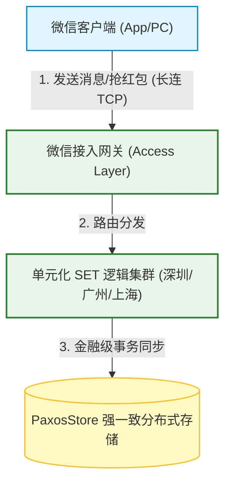
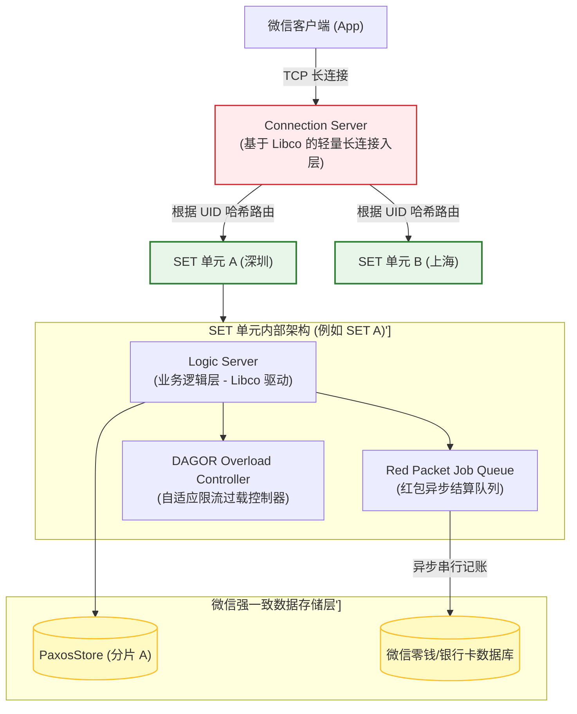
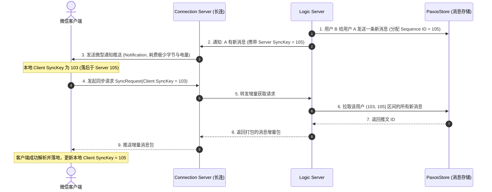
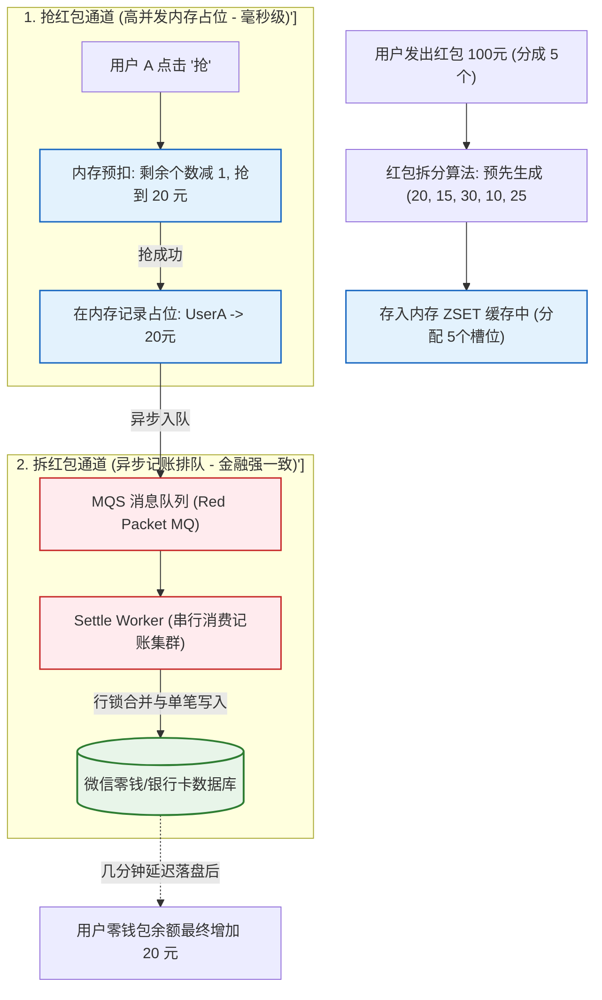
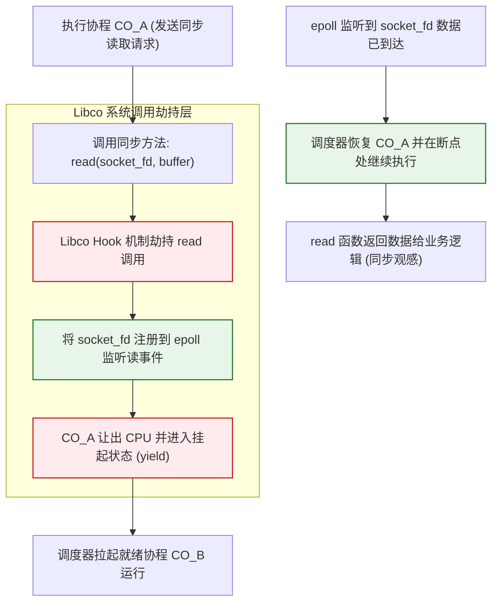

import CaseStudyHeader from '@site/src/components/CaseStudyHeader';
import DesignIntent from '@site/src/components/DesignIntent';
import EvolutionTimeline from '@site/src/components/EvolutionTimeline';
import CompareSlider from '@site/src/components/CompareSlider';
import TradeoffExplorer from '@site/src/components/TradeoffExplorer';
import GlossaryTerm from '@site/src/components/GlossaryTerm';
import ResearchNote from '@site/src/components/ResearchNote';
import GuidedExercise from '@site/src/components/GuidedExercise';
import QuizCard from '@site/src/components/QuizCard';
import MindMap from '@site/src/components/MindMap';

# 微信 WeChat：万亿消息 Sync 协议与红包高并发单元化 SET 架构

<CaseStudyHeader
  oneLiner="微信的架构是超大规模移动互联网应用的高可用典范。它通过『基于 Sync Key 的增量快照同步协议』化解了弱网下的万亿消息投递难题，借助 C++ 高性能协程库 Libco 实现了单机百万并发 TCP 长连接的极低资源开销，并通过『单元化 SET 隔离』与『抢-拆双通道异步记账』，在除夕夜等极端流量洪峰下支撑了红包的高效流转。"
  stats={[
    {label: '活跃用户', value: '13 亿+'},
    {label: '消息吞吐率', value: '每日数百亿条'},
    {label: '除夕红包峰值', value: '每秒数十万个 (Grab)'},
    {label: '单机长连并发', value: '100,000+ (Libco)'},
    {label: '存储一致性', value: 'PaxosStore / Quorum'},
    {label: '故障 blast radius', value: '单 SET 单元级隔离'}
  ]}
/>

:::info 对应课程概念
本案例融合了以下课程核心概念：
*   **状态同步与版本序列（Month 5）**：如何通过单调递增的 Sync Key 进行无状态服务器与移动客户端的数据同步。
*   **高并发事务与队列拆分（Month 4/11）**：如何将红包等高热度“秒杀型”资金事务，通过“内存预扣+异步记账”双排队机制避免数据库行锁死锁。
*   **水平单元化分片与异地多活（Month 11）**：如何在超大型多活系统中实施自包含的 SET（单元）划分以降低灾难半径。
:::

---

## 1. 设计初衷：移动弱网与瞬间资金洪峰的物理硬壁垒

微信作为国民级即时通讯与生活平台，其系统架构需要直面两个在常规架构下近乎无解的痛点：
1.  **弱网低功耗即时通讯**：移动网络环境（基站切换、电梯弱网）极其复杂。客户端如果高频轮询新消息，不仅耗费宝贵的无线信道带宽，手机电池也将在数小时内耗尽。
2.  **热点账户的行锁死锁**：中国除夕夜群红包发出时，同一群内上百人瞬间争抢同一个红包。这对应数据库里同一条红包记录（Hot Row）的并发高频扣减更新。如果采用常规的数据库行锁机制，锁等待队列将瞬间拉爆，导致严重的死锁与数据库崩溃。

为了克服这些极限场景，微信团队自主设计了基于 **Sync 协议** 的消息收发架构，开发了 **Libco 协程框架**，并推出了**单元化 SET** 与**抢/拆分离**的红包记账架构。

<DesignIntent
  problem="如何在极其恶劣的移动弱网下，保证万亿级消息不丢、不重、低延迟投递，同时在除夕夜等数十万级红包秒杀场景下，确保资金零偏差且系统防雪崩。"
  users="全球 13 亿以上微信日常社交、社群聊天、移动支付与红包消费用户。"
  devices="运行于 iOS/Android 手机移动端。后台部署在深圳、广州、上海等地大规模分布式腾讯数据中心（SET 集群）上。"
  goals={[
    '极致弱网消息可靠度：在 2G/3G 乃至频繁断线弱网下，消息能通过单次 Sync 请求完成完整状态同步',
    '极高并发红包抢占：除夕夜支持每秒几十万次以上的红包抢占（Grab），且数据库行不卡死',
    '百万并发连接开销极小：单台接入服务器能轻量承载 10W+ 并发长连，无高额内核线程切换损耗',
    'SET级容灾隔离：单 SET（用户分片单元）发生硬件彻底损坏时，故障影响完全隔离在局部，不影响其他 SET 用户'
  ]}
  constraints={[
    '移动端对电量和数据流量有严苛限制，绝不能使用重型的全量扫描拉取消息',
    '微信红包属于金融级事务，数据绝对不能有“超卖”（抢到红包却扣除失败/金额对不上）或多记账',
    '行级死锁：同一行数据并发 Update 的上限极低，常规 MySQL 行锁等待超时默认是 50s，必须从架构上避开行锁',
    '过载控制：流量突增数十倍时，必须能秒级识别垃圾请求并进行“优雅的主动丢弃”（DAGOR），防止雪崩'
  ]}
  firstStep="将系统按 ID 划分为独立的 SET 运行单元；消息收发引入基于 Sync Key 的顺序快照拉取；红包事务改造为“抢（内存预分配 ZSET）- 拆（数据库异步串行记账）”双路排队，并使用协程框架 Libco 实现低成本异步非阻塞 I/O。"
/>

---

## 2. 知识全景脑图

<MindMap
  root={{
    label: '微信 WeChat 架构全景',
    children: [
      {
        label: '万亿 IM 消息平面 (Sync)',
        children: [
          { label: '基于 Sync Key 增量同步' },
          { label: '长连接网关 (Long-Conns)' },
          { label: '消息通知推送推送 (Notification)' }
        ]
      },
      {
        label: '红包与高并发 (Red Packet)',
        children: [
          { label: '抢红包：内存 ZSET 快速占位' },
          { label: '拆红包：MQ 队列异步记账' },
          { label: '行锁缓解 (锁合并与Libco)' }
        ]
      },
      {
        label: '微服务框架 (Libco)',
        children: [
          { label: 'C/C++ 协程非阻塞 Hook' },
          { label: '同步编程模式 -> 异步 epoll 执行' },
          { label: '超轻量级上下文切换' }
        ]
      },
      {
        label: '单元化隔离 (SET)',
        children: [
          { label: '按 UID / 地区 Hash 划分单元' },
          { label: 'PaxosStore 强一致多活复制' },
          { label: '过载保护器 (DAGOR 令牌桶)' }
        ]
      }
    ]
  }}
/>

---

## 3. 系统架构总览 (C4 Model)

微信的系统是由一个个逻辑自包含的“SET”单元与全局消息队列构成的对等拓扑。

### 3a. System Context (系统上下文图)



### 3b. Container Diagram (容器结构图)



---

## 4. 核心机制拆解

### 4a. 消息 Sync 协议设计：移动端的无缝状态机

传统的聊天协议（如早期古老的 XMPP 协议）依靠大量长连接推送，当用户断线时会引发复杂的消息补发，在移动端不仅耗电，在弱网下还极易丢失消息。

微信推出了 **Sync 协议**：
*   **状态模型**：系统不保证直接把消息投递到客户端，而是把每个用户的消息流看作一个递增的序列。服务器上存放着每个用户最新的 **Sync Key**（版本单调递增的序列值）。
*   **轻量唤醒**：当有新消息来时，连接服务器（Connection Server）仅向客户端发送一个极其微小的“通知包（Notification）”包含最新的 `Server Sync Key`。
*   **增量拉取（Sync）**：客户端对比本地的 `Client Sync Key` 与 `Server Sync Key`。如果不一致，客户端主动向服务器发送一个 Sync 请求。请求携带 `Client Sync Key`。
*   **无状态拉取**：服务器只管拉出 `(Client Sync Key, Server Sync Key]` 之间的消息增量包，打包下发。客户端收到后更新本地的 `Client Sync Key`。这使得即使处于电梯断线、基站切换等恶劣环境，只要网络重新接通发起一次 Sync 即可拉出全部漏掉的消息，实现了“弱网低时延不丢消息”的境界。



---

### 4b. 微信红包高并发事务：“抢”与“拆”双通道异步架构

微信红包属于金融级资金结算，如果在除夕夜几十万抢红包并发请求中直接使用 `UPDATE account SET balance = balance - money WHERE user_id = xxx` 进行事务扣减，会在 MySQL 的行锁排队队列上堆积数十万个连接，导致死锁（Lock Wait Timeout）与崩溃。

为了避开热点行锁，微信使用了**抢与拆分离的双通道排队架构**：

1.  **抢红包（Grab Channel）——内存高速排队**：
    *   当红包发出时，系统自动通过分流算法（如双倍随机算法）提前将红包拆分成 $N$ 个具有特定金额的小红包包，放入高性能内存缓存中。
    *   用户点击“抢”时，系统仅在内存的高性能并发队列（如 Redis ZSET）中扣减小红包的剩余数量与余额。如果抢成功，仅在内存中记录占位标记 `(UserID -> Grabbed Amount)`。此时**并没有执行任何数据库扣减**，也没有任何数据库行锁竞争，速度在毫秒级。
2.  **拆红包（Settle Channel）——异步串行记账**：
    *   抢成功的占位信息被发入专门的异步队列（如 MQS 消息队列）。
    *   后台部署的记账 Worker 集群订阅该队列，以每个红包为单元，串行（Serial）消费队列消息，然后有序写入关系型数据库，实现用户零钱（微信钱包余额）和银行卡账户资金的“异步入账/扣账”。
    *   **防雪崩兜底**：如果在入账期间数据库由于写压力过载，记账任务允许在队列中安全积压（最多延迟几分钟到几十分钟入账），但用户在“抢”时瞬间就已经知道了结果，保障了极佳的体验与系统高可用。



---

### 4c. 微服务引擎 C++ 协程库 Libco：百万长连接的内核解放

微信早期基于多线程的同步编程框架，在应对 13 亿用户并发 TCP 长连接时遭遇致命瓶颈：一个长连接如果占用一个系统线程，10 万连接就需要 10 万个线程，JVM/Linux 内核在线程上下文切换（Context Switch）和堆栈空间占用上的损耗将吞噬掉所有 CPU 算力。

微信团队开源了 **Libco 协程库**，完成了无损协程化改造：
*   **同步编程，异步执行**：开发人员不需要写复杂的 Callback 或 Promise。他们编写传统的同步读写代码（类似于 `read(fd, buf)`）。
*   **系统调用劫持（Hook）**：Libco 通过动态链接劫持了 Linux 底层的阻塞系统调用（如 `socket`、`read`、`write`、`connect` 等）。
*   **无感知切换**：当协程执行到阻塞的 `read` 调用时，Libco 内部会将其自动改为向底层 `epoll` 注册读事件，并把当前协程 yield（让出）挂起。CPU 被立刻让给其他就绪协程。一旦 epoll 通知该 fd 可读，协程调度器会在原断点处 resume（恢复）该协程继续执行。
*   这使得微信仅用少量服务节点，以极小的 CPU 切换开销和每个协程仅几 KB 的物理内存，完美支撑了海量并发连接。



<ResearchNote
  title="Libco：微信高性能微服务背后的 C/C++ 协程库"
  source="Tencent WeChat Team (2016), Libco: An efficient coroutine library for C/C++ (GitHub Open Source)"
  href="https://github.com/tencent/libco"
  insight="微信后台团队在 GitHub 开源了其高并发利器 Libco。它利用 x86/x64 的汇编级寄存器保存与切换，在单线程内实现了毫秒级的用户态协程调度。由于全面 Hook 了 glibc 的底层 socket 读写函数，微信数万个遗留的传统同步微服务代码在未做改写的情况下，直接获得了高并发非阻塞 epoll 的极速吞吐加成。"
  application="架构启示：高并发系统改造不一定非要重写全部历史业务代码（重写代价极其昂贵）。利用 Libco 此类底层的“动态劫持（Hook）”机制，在不改变业务代码“同步观感”的前提下完成底层“非阻塞异步化”升级，是大型工业级系统架构演进的最佳平衡模板。这也验证了课程 Month 11 关于平台演化与微服务的设计思想。"
/>

---

## 5. 关键数据结构与算法

### 5a. 微信红包“双倍随机算法” (Double Random Algorithm)

为了保证抢红包的娱乐性（金额随机）与资金安全性（不超卖），微信采用了**双倍随机算法**。

#### 算法公式逻辑：
假设红包剩余的总金额为 `RemainAmount`，剩余的红包总个数为 `RemainCount`。
每次分配的随机上限（Range Limit）固定设定为当前平均金额的 **2 倍**：
$$Max\_Limit = 2 \times RemainAmount / RemainCount$$

系统在此区间内生成一个随机分包金额 `ActualAmount`：
$$ActualAmount = Random(0.01, Max\_Limit)$$

#### 算法优势：
*   **公平分布**：使用此公式能保证每个参与抢红包的人，预期能抢到的均值都是一样的，避免了“前面的人把钱抢光，后面的人一分没有”或者“越到后面钱越多”的倾斜现象。
*   **无锁约束**：此计算仅依赖 `RemainAmount` 与 `RemainCount` 两个标量，不需要向复杂的神经网络模型请求推理打分，极适合在超高并发下在 Redis 内存中计算，且天然不会超出总预算上限。

---

### 5b. Sync Key 增量快照数据结构

Sync Key 实际上是一个结构化的序列号数组（Sequence Pair List），代表了客户端在各个数据类型下的本地更新断点：

```json
{
  "SyncKey": [
    {"Key": 1, "Val": 1024345}, // 个人聊天消息 Sequence
    {"Key": 2, "Val": 876932},  // 群组消息 Sequence
    {"Key": 3, "Val": 1205}     // 联系人通讯录变更 Sequence
  ]
}
```

客户端在握手发起 `/sync` 请求时上传此结构。服务器的逻辑层根据 PaxosStore 中的变更表（Changelog Table），以 `(Val_client, Val_server]` 的区间执行并行拉取，返回数据包的同时返回服务器最新的 `Server SyncKey` 覆盖客户端，用简单的序列对比取代了高开销的锁状态查询。

---

## 6. 架构演进史

微信系统架构变迁，代表了中国互联网应用走向高可用极限的历程：

<EvolutionTimeline
  events={[
    {
      year: '2011',
      title: '早期单机房单体：传统多线程 IM',
      why: '微信刚发布，用户量在百万级，采用常规的多线程与 MySQL 单库存储消息，系统采用轮询拉取。',
      change: '推出长连接接入服务，利用 TCP 维持在线状态；引入早期 SyncKey 协议实现增量快照拉取。'
    },
    {
      year: '2013',
      title: '微服务与 PaxosStore 强一致时代',
      why: '朋友圈、微信支付上线，用户规模破亿，传统的 MySQL 分表面临高并发极限，网络抖动时强一致分布式存储缺失。',
      change: '后台逻辑全面微服务化；自研基于 Paxos 协议的多数据中心三副本存储 PaxosStore，解决了高频账户余额与朋友圈数据的跨地区多机房强一致同步。'
    },
    {
      year: '2015+',
      title: '全球单元化 SET 与 Libco 协程全量化',
      why: '除夕红包峰值、春晚互动摇一摇对整个微服务集群发起海啸般的并发压力。单机房资源耗尽，长连接线程切换瘫痪 CPU。',
      change: '开源并全面推广 C++ 协程库 Libco，将长连节点切换开销降低 95%；实施按 UID 划分的独立“SET单元化”架构，隔离物理故障 Blast radius（爆炸半径）；开发 DAGOR 过载保护控制以提供优雅的业务级降级。'
    }
  ]}
/>

---

## 7. 架构对比：常规行锁扣减交易 vs. 抢-拆分离异步记账

<CompareSlider
  before={
    <div style={{ padding: '20px', background: '#ffebee', border: '1px solid #c62828', borderRadius: '8px', height: '100%', color: '#333' }}>
      <strong>常规行锁扣减交易 (传统模式)</strong>
      <p style={{ marginTop: '10px', fontSize: '0.9rem' }}>每次抢红包直接向数据库发起 Update 事务。对于同一群的抢红包洪峰，由于全部竞争同一行红包记录，数据库行锁排队队列瞬间溢出。发生大量行锁超时等待与死锁冲突，系统瞬间卡死并报错。</p>
    </div>
  }
  after={
    <div style={{ padding: '20px', background: '#e8f5e9', border: '1px solid #2e7d32', borderRadius: '8px', height: '100%', color: '#333' }}>
      <strong>“抢-拆”双通道异步记账 (微信模式)</strong>
      <p style={{ marginTop: '10px', fontSize: '0.9rem' }}>抢红包在内存中通过双倍随机算力预分配并扣减数量（Grab），不触碰关系型数据库；拆红包将占位信息发入消息队列，由 Worker 串行写入零钱库（Settle）。数据库无任何行锁冲突，且流量在队列中安全缓冲。</p>
    </div>
  }
  labels={['常规行锁扣减', '“抢-拆”双通道异步记账']}
/>

---

## 8. 权衡：微信分布式架构的折中光谱

微信在面临极度高并发与资金安全的前提下，进行了深刻的系统架构权衡：

<TradeoffExplorer
  title="微信消息、支付与过载防护折中"
  dimensions={['并发长连吞吐', '数据强一致 (一致性级别)', '系统局部容灾能力', '业务降级体验度', '网络及磁盘 I/O 成本']}
  options={[
    {
      name: '单元化 SET 分片隔离',
      scores: [5, 4, 5, 2, 4],
      note: '按 UID 哈希将用户归档至各个自包含的 SET 单元。单 SET 硬件受损时只波及局部，其他单元不受影响，极大增强了集群防御力。代价是跨 SET 用户聊天或加好友时，需要额外的代理代理路由，增加了跨 SET 通信复杂性。',
      whenToUse: '拥有十亿级规模、多地域分布的大型分布式用户交互系统。'
    },
    {
      name: '抢拆分离之异步串行记账',
      scores: [5, 3, 4, 5, 5],
      note: '抢红包在内存中秒回结果，入账动作在 MQS 队列中异步排队落库。这完全抹平了除夕夜的写入峰值压力，保护了系统不崩。代价是用户账户余额入账会有秒级至分钟级的短暂延迟（最终一致性），非强读一致性。',
      whenToUse: '秒杀型、对瞬时吞吐要求极端且可容忍短时入账时差的支付场景。'
    },
    {
      name: 'DAGOR 业务层自适应限流',
      scores: [3, 5, 5, 1, 5],
      note: '根据微服务排队时延，主动丢弃一部分抢红包请求，返回“红包被抢光了”的降级提示。牺牲了少量倒霉用户的操作体验，但在极端海啸流量下保住了数据库和逻辑服务器不发生雪崩。',
      whenToUse: '高并发、流量毛刺极大且需要刚性自我保护的超大规模微服务集群。'
    }
  ]}
/>

---

## 9. 如果是你来设计：红包双倍随机拆分与预分配器

### 场景设想
在微信红包的写平面中，由于高并发压力，系统需要提前将大红包（如 `Amount = 10` 元）拆分成 $N$ 个（如 `Count = 3` 个）随机金额小红包：
*   金额以“分”为最小单位，每个包至少 `0.01` 元。
*   需要使用“双倍随机算法”在内存中一次性分配完。
*   分配的结果被依次 `PUSH` 存放到内存 Redis 的 ZSET / List 结构中以供客户端消费。

请你用 Python 实现这个红包拆分与预分配算法。

<GuidedExercise
  title="基于 Python 的红包双倍随机分配与内存预分包器实现"
  goal="编写代码实现双倍随机分包计算，并在算法末尾核对拆分出的小红包总和是否严格等于原始总金额，杜绝资金溢出偏差。"
  steps={[
    '步骤 1: 设计初始化方法。定义 `split_red_packet(total_amount, count)` 函数，其中 `total_amount` 为浮点数（元），`count` 为分包数。在函数内部，先将金额统一转化为以“分”为单位的整数进行计算，以避免浮点数精度丢失带来的对账错误。',
    '步骤 2: 循环执行双倍随机扣减。利用一个 Loop 循环 `count - 1` 次：每次计算当前剩余金额的 2 倍并除以剩余个数得到上限 `Max_Limit = (Remain_Amount / Remain_Count) * 2`。使用 `random.randint(1, Max_Limit - 1)` 取一个分值作为这笔分包的金额，并从剩余金额和剩余个数中扣减。',
    '步骤 3: 边界尾数处理。循环结束后，最后一个小红包不需要再随机，其金额必须直接等于剩余的 `Remain_Amount`，以保障分包总和的百分之百精确对齐。',
    '步骤 4: 执行校验逻辑。将分出的各小包金额从“分”重新转换为“元”，计算它们之和，验证其是否绝对等于 `total_amount`。'
  ]}
  checks={[
    '确认对于 3 个包、10 元总额的输入，能够分出 3 个随机浮点金额',
    '确认所有分配出来的小红包金额总和，分毫不差地等于 10.00 元',
    '验证当设置包数为 10 个、金额为 0.10 元时，每个包恰好分到 0.01 元，未出现多分配或溢出报错'
  ]}
/>

---

## 10. 知识自测

<QuizCard
  questions={[
    {
      q: '关于微信 IM 消息收发中采用的基于“Sync Key”的增量快照同步协议，以下描述正确的是：',
      options: [
        'A. 客户端必须每秒发起一次全表 SELECT JOIN 查询以更新消息',
        'B. 服务器仅发送微小的 Notification 唤醒通知；客户端在感知到 Server SyncKey 领先于本地 Client SyncKey 时，主动发起增量 Sync 请求，拉取落后区间段的消息包。这使得弱网断线后仅需单次握手即可无漏恢复，省电且省带宽',
        'C. Sync 协议要求客户端和服务器时刻保持 TCP 零丢包',
        'D. Sync Key 是基于雪花算法时钟回拨自动合并生成的 HTML 断链'
      ],
      answer: 1,
      explain: '移动网络天然具有不稳定性。Sync 协议将消息持久化看作一条时间递增流，通过对比客户端和服务器端的版本序列（SyncKey），将同步拉取转为幂等的“无状态区间增量”，消除了高延迟长连推送的丢包漏信隐患。'
    },
    {
      q: '在微信红包高并发场景下，微信团队是如何巧妙化解数据库“热点行锁等待死锁”这一硬骨头难题的？',
      options: [
        'A. 强制每个群同一时间只能有一个人抢红包',
        'B. 利用“抢”与“拆”的双通道异步化架构：在内存层中完成小红包的双倍随机预扣与占位（Grab），瞬间返回客户端结果；将具体的入账事务（Settle）推入异步消息队列由后台 Worker 串行写入关系库，使数据库压力降为稳定的匀速写',
        'C. 彻底放弃关系型数据库，全部存放在不带落盘的 Redis 内存集群里',
        'D. 通过 Libco 协程在每次 SQL 写入时强行添加 Lock Tables 全表锁'
      ],
      answer: 1,
      explain: '如果所有的并发都在写时死锁在 DB 上，系统瞬间雪崩。微信的抢拆分离将强吞吐动作（抢，毫秒级在内存中快速完成）与资金入账写动作（拆，发入 MQ 串行削峰记账）进行了解耦，保全了系统的生存能力。'
    },
    {
      q: '微信后台微服务集群中全面使用开源协程框架 Libco 的核心价值是：',
      options: [
        'A. 彻底取消底层 epoll 机制，退回到多线程并发架构',
        'B. 它在 glibc 层面动态 Hook 劫持了同步阻塞 I/O，使开发人员可用最直观的同步编程风格写出实质上是非阻塞异步 epoll 调度的底层逻辑，在极小内存与 CPU 开销下承载单机百万并发长连',
        'C. 可以直接在 C++ 进程中运行 PyRunner Python 代码而无需离线 Pyodide',
        'D. 保证红包拆分算法每次生成的随机金额都是两倍偶数'
      ],
      answer: 1,
      explain: '传统多线程切换的物理成本限制了长连接的无上限横向扩展。Libco 的伟大之处在于无缝的 Hook 机制。对同步阻塞 read/write 函数的无感拦截，将业务写代码的低难度与协程异步 epoll 的高吞吐、轻量上下文切换完美融合在了一起。'
    }
  ]}
/>

---

## 来源清单

*   [Tencent WeChat Team (2016), Libco: An efficient coroutine library for C/C++ (GitHub Open Source)](https://github.com/tencent/libco)
*   [Lu et al. (2016), PaxosStore: High-availability Storage Database Service for WeChat (VLDB)](http://www.vldb.org/pvldb/vol10/p1730-lu.pdf)
*   [Sheng et al. (2015), Overload Control at the Science of WeChat Microservices (DAGOR, SoCC)](https://dl.acm.org/doi/10.1145/2806777.2806838)
*   [WeChat Engineering Blog: High Concurrency Design of Red Packet Transactions](https://cloud.tencent.com/developer/article/1168910)