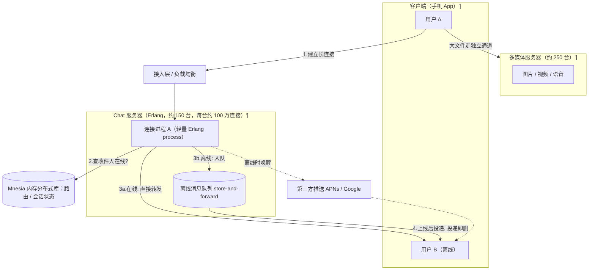
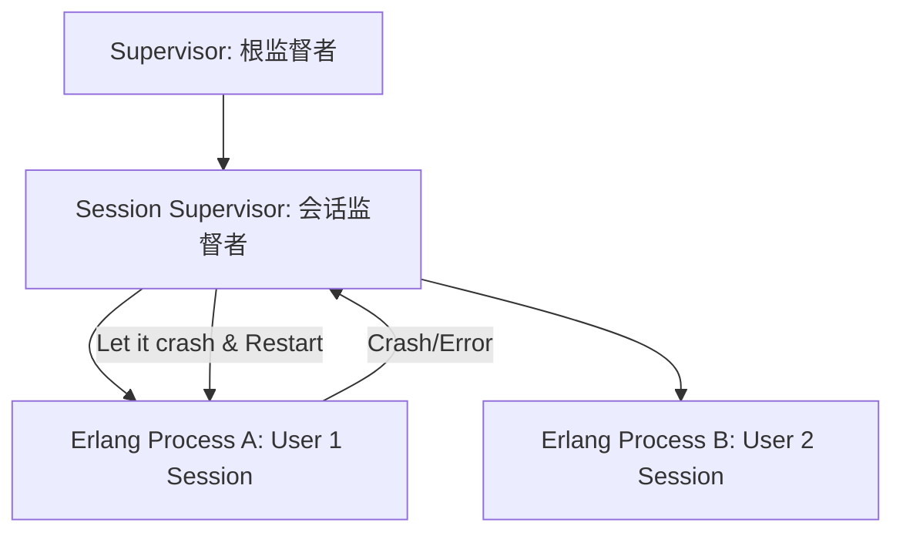
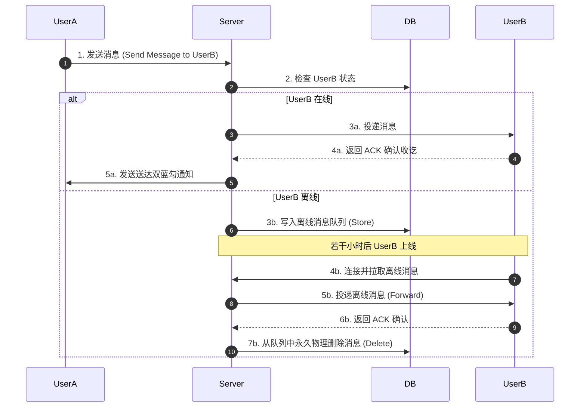

import CaseStudyHeader from '@site/src/components/CaseStudyHeader';
import DesignIntent from '@site/src/components/DesignIntent';
import ArchitectureEvolution from '@site/src/components/ArchitectureEvolution';
import TradeoffExplorer from '@site/src/components/TradeoffExplorer';
import GlossaryTerm from '@site/src/components/GlossaryTerm';
import ResearchNote from '@site/src/components/ResearchNote';
import QuizCard from '@site/src/components/QuizCard';

# WhatsApp：50 人扛 10 亿用户的极简主义

<CaseStudyHeader
  oneLiner="WhatsApp 用一套极度克制的架构证明了：选对技术、做少的事、保持小团队，几十个工程师也能扛起全球数十亿人的实时通讯。"
  stats={[
    {label: '月活用户（2014 收购时）', value: '约 4.5 亿'},
    {label: '工程师（2014）', value: '约 32 人'},
    {label: '每天消息', value: '500 亿+'},
    {label: '峰值并发连接', value: '1.47 亿'},
    {label: '单机连接数', value: '100 万 – 200 万+'},
    {label: 'Erlang 核心数', value: '11,000+'}
  ]}
/>

:::info 对应课程概念
本案例强烈印证 [L4 错误处理"Let it crash"](../foundations/error-handling)、[L1 的可扩展性与延迟数量级](../foundations/programming-systems-primer)、[L2 的小团队与 Conway 定律](../foundations/modules-and-contracts)。读完这一年的并发（L8）与状态（L5）课，你会更看懂它。
:::

## 1. 设计初衷：架构师在白纸前先问什么

任何庞大系统都不是一开始就庞大的。它始于一个架构师在白纸前的几个根本问题。2009 年，两位前 Yahoo 工程师 Brian Acton 和 Jan Koum 创立 WhatsApp 时，墙上贴着那句著名便签：**"No Ads. No Games. No Gimmicks."**（不要广告、不要游戏、不要花哨）。这句价值观，其实就是下面这套"起点四问"的答案：

<DesignIntent
  problem="在全球范围、在很差的移动网络上，可靠且即时地把一条消息从一个人送到另一个人——而且极省资源、极重隐私。"
  users="全球普通人，尤其是新兴市场用户、有跨国通讯需求、对短信/流量资费敏感的人群。"
  devices="五花八门的廉价安卓机和功能机，运行在 2G/3G 这种高丢包、高延迟、时断时续的弱网上。"
  goals={[
    '消息近乎实时送达，弱网下也能最终送达',
    '单机扛尽可能多的长连接，把机器和成本压到最低',
    '极高可靠性：单点故障不影响全局',
    '隐私：服务器尽量不长期持有用户内容'
  ]}
  constraints={[
    '团队极小（几十人），不能靠堆人维持',
    '不靠广告盈利，所以必须极度省服务器',
    '要快速上线，不能从零造轮子'
  ]}
  firstStep="不自研，从成熟的开源 XMPP 服务器 ejabberd 起步（它本身就是 Erlang 写的），选定 Erlang + FreeBSD 技术栈，先把最核心的『一对一消息可靠送达 + 离线暂存』这一件事做扎实，再逐步往上加规模、加多媒体、加加密、加多设备。"
/>

**怎么一步步长大？** 一句话概括 WhatsApp 的建造顺序：**先把"一件事"做对，再被增长一步步逼着升级**——先用现成的 XMPP 把一对一消息跑通；用户暴涨后回头死磕单机连接数；规模再大就加多媒体服务器和双数据中心；价值观要求隐私就上端到端加密；用户要多端就重构出多设备架构。下面第 4 节的交互演进图，会让你亲眼看到这个"一层层长出来"的过程。

## 2. 架构总览（今天的样子）

WhatsApp 的后端建立在一个为消息而生的技术栈上：<GlossaryTerm term="Erlang" definition="一门为电信级高并发、高可靠系统设计的函数式语言，运行在 BEAM 虚拟机上。支持数百万轻量级进程、抢占式调度、进程隔离、监督树和热代码升级。">Erlang</GlossaryTerm> + <GlossaryTerm term="BEAM" definition="Erlang 的虚拟机。它能在单机上调度数百万个极轻量的进程，每个进程独立崩溃互不影响——这是 WhatsApp 单机扛百万连接的基础。">BEAM 虚拟机</GlossaryTerm> + FreeBSD 操作系统，数据库用 Erlang 自带的内存分布式数据库 <GlossaryTerm term="Mnesia" definition="Erlang/OTP 内置的分布式数据库，运行在 BEAM 进程内（与应用同进程），因此读取几乎没有跨网络/跨进程开销。">Mnesia</GlossaryTerm>。

核心数据流就两句话：**长连接 + store-and-forward**。每个在线用户和某台 chat 服务器保持一条长连接（由一个独立的 Erlang 进程持有）；发消息时，若对方在线就直接转发，若离线就**暂存进队列**，等对方上线再投递，**投递成功后立刻从服务器删除**。

<ResearchNote
  title="规模数字：近 5 亿用户、11000 核、每秒数千万消息"
  source="High Scalability: How WhatsApp Grew to Nearly 500 Million Users, 11,000 Cores"
  href="https://highscalability.com/how-whatsapp-grew-to-nearly-500-million-users-11000-cores-an/"
  insight="截至 2014 年：约 550 台服务器、11000+ CPU 核、约 150 台 chat 服务器（各约 100 万连接）、250 台多媒体服务器；峰值 1.47 亿并发连接、每秒 23 万登录、每秒 34.2 万条消息进 / 71.2 万条出；Mnesia 用约 2TB 内存、16 个分区存 180 亿条记录。栈：Erlang R16B01（自打补丁）、FreeBSD 9.2、Yaws、SoftLayer 裸金属、双数据中心。"
  application="注意它的对角扩展：用少量极强的大机器（垂直）配合适度的水平扩展，而不是堆海量小实例。这与多数互联网公司的无脑水平扩展形成鲜明对比——也因此运维面更小、团队更小。"
/>

## 3. 关键设计模式 / 设计思维

### (a) Actor 模型：一个连接 = 一个轻量进程

BEAM 能在单机调度**数百万个**极轻量进程。WhatsApp 把每条用户长连接交给一个独立的 Erlang 进程处理。进程之间不共享内存、只靠消息通信——这正是 <GlossaryTerm term="Actor Model" definition="一种并发模型：系统由大量互相隔离的 actor 组成，每个 actor 有自己的状态，只通过收发消息交互，不共享内存。天然适合高并发，且一个 actor 崩溃不影响其它。">Actor 模型</GlossaryTerm>。这让"单机百万连接"成为可能，也让一个用户的崩溃不会波及其他人（你会在 **L8 并发** 深入它）。

### (b) Let it crash + 监督树：可靠性的反直觉做法

还记得 [L4 的"让它崩"](../foundations/error-handling)吗？Erlang 就是这套哲学的发源地。WhatsApp 不靠"到处写防御代码"求稳，而是让出问题的进程**干净地崩溃**，由<GlossaryTerm term="Supervision Tree" definition="Erlang/OTP 的容错结构：监督者进程负责监控子进程，子进程崩溃时按预设策略自动重启到已知良好状态。">监督树</GlossaryTerm>自动把它重启到已知良好状态。几十人能维护这么大系统，很大程度上靠的就是这种"故障自愈"，而不是人去救火。

### (c) Store-and-forward：用"投递即删"换隐私与省钱

消息只在送达前暂存，送达后即从服务器删除。这一个决定同时拿下三样东西：**省存储**（不堆历史）、**强隐私**（服务器不长期持有内容）、**简单**（没有庞大的消息数据库要维护）。这是"设计初衷"如何直接塑造架构的典型例子。

### (d) 把数据库塞进进程：Mnesia 消灭网络跳数

用 BEAM 内的 Mnesia 而不是外部数据库，路由/会话状态的读取几乎没有跨网络开销——回看 [L1 的延迟数量级表](../foundations/programming-systems-primer)：少一次跨网络调用，就少几个数量级的延迟。

<ResearchNote
  title="把规模做到极致：单机从 100 万到 200 万+ 连接"
  source="Rick Reed (WhatsApp), That's 'Billion' with a 'B': Scaling to the Next Level (InfoQ)"
  href="https://www.infoq.com/presentations/whatsapp-scalability/"
  insight="WhatsApp 工程师 Rick Reed 在演讲中详述：通过给 BEAM 打补丁、调优 FreeBSD 内核（文件/套接字上限）、修复锁竞争、正确分区工作负载，他们把单机并发连接从 20 万一路推到 200 万以上（测试中达 280 万），并把整个系统推到 11000+ 核、每秒数千万条 Erlang 内部消息。"
  application="这是垂直扩展到极限的教科书：先把单机榨干，再谈加机器。对小团队，这意味着要管的机器更少、故障面更小。但它高度依赖对运行时和内核的深度掌控——是一种有意识的取舍。"
/>

## 4. 架构演进：从 2009 到今天，一层层长出来

下面这个交互图是本案例的核心。**点击每个年份**，看 WhatsApp 的架构在那一年新增/重构了哪些组件（高亮的就是当年的新东西），以及驱动这次升级的"新压力"是什么。这正是你研究架构师思维方式的最佳切片——真实系统从来不是设计出来的，是被增长和需求一步步逼出来的。

<ArchitectureEvolution
  eras={[
    {
      year: '2009',
      title: '诞生：站在 XMPP 肩上',
      intent: '零用户、小团队、没钱。要在最短时间内，把一对一消息可靠送达跑通。',
      change: '基于开源 XMPP 服务器 ejabberd（Erlang 写成）改造，跑在 FreeBSD 上，用 Mnesia 存路由状态，确立 store-and-forward 内核。',
      why: '不自研、站在成熟方案肩上能最快上线；Erlang 的高并发与容错正好匹配海量长连接加高可靠的本质需求。',
      layers: [
        {name: '客户端', comps: [{label: '手机 App', isNew: true}]},
        {name: '接入层', comps: [{label: 'XMPP 长连接（ejabberd）', isNew: true}]},
        {name: '消息逻辑', comps: [{label: 'Erlang chat 进程', isNew: true}, {label: 'store-and-forward 队列', isNew: true}]},
        {name: '数据', comps: [{label: 'Mnesia 内存库', isNew: true}]},
        {name: '基础设施', comps: [{label: 'FreeBSD（少量机器）', isNew: true}]}
      ]
    },
    {
      year: '2011–2012',
      title: '单机连接数攻坚',
      intent: '用户爆发式增长，但团队和预算都极小——不能靠堆机器、堆人。',
      change: '深度优化：给 BEAM 打补丁、调 FreeBSD 内核（文件/套接字上限）、修锁竞争、分区工作负载，把单机并发连接从 20 万推到 100 万、再到 200 万+。',
      why: '把单机榨到极限，要运维的机器最少、故障面最小，最匹配小团队约束。这是垂直扩展优先的典型决策。',
      layers: [
        {name: '客户端', comps: [{label: '手机 App'}]},
        {name: '接入层', comps: [{label: 'XMPP 长连接'}, {label: 'BEAM 补丁（百万连接）', isNew: true}, {label: 'FreeBSD 内核调优', isNew: true}]},
        {name: '消息逻辑', comps: [{label: 'Erlang chat 进程'}, {label: '连接进程池', isNew: true}]},
        {name: '数据', comps: [{label: 'Mnesia 内存库'}]},
        {name: '基础设施', comps: [{label: 'FreeBSD 大机器', isNew: true}]}
      ]
    },
    {
      year: '2014',
      title: '规模顶峰 + 被 Facebook 收购',
      intent: '近 5 亿用户、每天 500 亿消息、多媒体（图片/语音/视频）暴增，单一机房不够稳。',
      change: '横向加到约 150 台 chat 服务器加约 250 台多媒体服务器，前面加负载均衡，Mnesia 分 16 区（约 2TB 内存），部署到 SoftLayer 裸金属的双数据中心。',
      why: '单机已榨干，必须适度水平扩展；多媒体与文本分离（不同负载特性各自扩展）；双机房保障可用性。约 190 亿美元被 Facebook 收购。',
      layers: [
        {name: '客户端', comps: [{label: '手机 App'}]},
        {name: '接入层', comps: [{label: '负载均衡', isNew: true}, {label: '约 150 台 chat 服务器', isNew: true}]},
        {name: '消息逻辑', comps: [{label: 'Erlang chat 进程'}, {label: 'store-and-forward'}]},
        {name: '多媒体', comps: [{label: '约 250 台多媒体服务器', isNew: true}]},
        {name: '数据', comps: [{label: 'Mnesia 16 分区 / 2TB', isNew: true}]},
        {name: '基础设施', comps: [{label: 'SoftLayer 双数据中心', isNew: true}]}
      ]
    },
    {
      year: '2016',
      title: '默认端到端加密',
      intent: '隐私是创始价值观；但要在不牺牲送达可靠性的前提下，让服务器也无法读取消息内容。',
      change: '全量上线基于 Signal 协议的端到端加密：X3DH 密钥协商加 Double Ratchet 棘轮，每条消息一把一次性密钥，提供前向保密。',
      why: '直接采用经过同行评审的 Signal 协议，而不是自研密码学（永远不要自己发明加密）。加密在客户端完成，服务器只转发密文，几乎不动原有转发架构。',
      layers: [
        {name: '客户端', comps: [{label: '手机 App'}, {label: '端到端加密（Signal）', isNew: true}]},
        {name: '安全', comps: [{label: 'X3DH 密钥协商', isNew: true}, {label: 'Double Ratchet 棘轮', isNew: true}]},
        {name: '接入层', comps: [{label: '约 150 台 chat 服务器'}]},
        {name: '消息逻辑', comps: [{label: 'store-and-forward（只转密文）'}]},
        {name: '数据', comps: [{label: 'Mnesia 路由状态'}]}
      ]
    },
    {
      year: '2021',
      title: '多设备架构重构',
      intent: '用户要在电脑/平板上用，且手机关机也能用——但原架构把手机当作唯一的密钥中心，做不到。',
      change: '重构出多设备能力：最多 4 台伴随设备各有独立身份密钥，主设备与伴随设备互签（账号签名加设备签名），各自建立端到端会话；并新增跨设备的加密历史同步。',
      why: '核心假设（手机=唯一密钥源）失效时，必须做根本性重构而非打补丁。这是演进中最能体现架构师判断力的一次。',
      layers: [
        {name: '客户端', comps: [{label: '手机（主设备）'}, {label: '伴随设备 ×4', isNew: true}]},
        {name: '安全 / 密钥', comps: [{label: '每设备独立身份密钥', isNew: true}, {label: '账号签名 + 设备签名', isNew: true}]},
        {name: '消息逻辑', comps: [{label: '多设备扇出 / 同步', isNew: true}, {label: 'store-and-forward'}]},
        {name: '数据', comps: [{label: '加密历史同步', isNew: true}, {label: 'Mnesia 路由'}]}
      ]
    },
    {
      year: '2020s',
      title: '20 亿用户 + 融入 Meta',
      intent: '用户破 20 亿，业务从纯消息扩到语音/视频/社区/商业消息；需要与 Meta 基础设施协同。',
      change: '逐步整合 Meta 基础设施，扩展语音/视频通话、社区、商业 API 等能力，团队仍维持约 50 人。',
      why: '增长曲线远快于团队曲线——小团队加克制的基因在更大规模下延续，新增能力尽量复用既有的连接/转发内核。',
      layers: [
        {name: '客户端', comps: [{label: '手机 + 多设备'}, {label: '语音 / 视频通话', isNew: true}]},
        {name: '能力层', comps: [{label: '社区 / 群组', isNew: true}, {label: '商业消息 API', isNew: true}]},
        {name: '安全', comps: [{label: '端到端加密（含通话）'}]},
        {name: '消息逻辑', comps: [{label: 'store-and-forward 内核（沿用）'}]},
        {name: '基础设施', comps: [{label: '整合 Meta 基础设施', isNew: true}]}
      ]
    }
  ]}
/>

<ResearchNote
  title="端到端加密：直接采用 Signal 协议，而非自研"
  source="Meta Engineering: How WhatsApp enables multi-device capability"
  href="https://engineering.fb.com/2021/07/14/security/whatsapp-multi-device/"
  insight="WhatsApp 的端到端加密基于 Open Whisper Systems 的 Signal 协议（X3DH + Double Ratchet，提供前向保密）。2021 的多设备方案给每台伴随设备独立身份密钥，主设备与伴随设备互相签名后各自建立端到端会话，从而在不依赖手机常在线的前提下保持加密。"
  application="两条架构原则：① 安全相关的核心算法用经过同行评审的成熟方案（Signal），不要自己发明密码学；② 当核心假设（手机是唯一密钥中心）不再成立时，要敢于做根本性重构，而不是打补丁。"
/>

## 5. 权衡与教训

WhatsApp 的每个"优点"背后都有明确的取舍。点选下面的扩展路线对比：

<TradeoffExplorer
  title="即时通讯的服务器扩展路线"
  dimensions={['单机承载', '团队/运维负担', '弹性伸缩', '技术门槛', '成本效率']}
  options={[
    {
      name: '垂直/对角扩展（WhatsApp：Erlang 大机器）',
      scores: [5, 5, 2, 1, 5],
      note: '用少量极强的大机器，把单机连接数榨到百万级。要管的机器少、团队小、成本极省，但严重依赖对运行时和内核的深度掌控，弹性不如云原生灵活。',
      whenToUse: '工作负载是海量长连接、团队精干、且愿意深耕一套技术栈（如 Erlang）时。'
    },
    {
      name: '水平扩展 + 微服务',
      scores: [3, 2, 5, 3, 3],
      note: '大量无状态小实例加服务拆分，弹性和团队自治最好，但运维复杂度和网络开销大，需要更大团队。',
      whenToUse: '业务能力多、需要多团队独立演进、流量弹性波动大时（如电商、超级 App）。'
    },
    {
      name: '托管云 / Serverless',
      scores: [2, 4, 5, 4, 2],
      note: '把扩展和运维外包给云厂商，上手快、弹性好，但长连接成本高、深度优化空间小、易被厂商锁定。',
      whenToUse: '团队想专注业务、流量不可预测、且对极致单机成本不敏感时。'
    }
  ]}
/>

**三条核心教训：**

1. **"做少"是一种架构策略，不只是产品策略。** 只做消息，让整个系统的复杂度、团队规模、故障面都被压到最小（呼应 [L2 的 Conway 定律](../foundations/modules-and-contracts)）。
2. **选对底层技术能改变可能性边界。** Erlang 的并发与容错模型，让"几十人扛十亿用户"从口号变成现实——技术选型是架构师最重的杠杆之一。
3. **先垂直榨干，再谈分布式。** 在盲目水平扩展之前，把单机性能压到极限，往往能省下巨大的运维与团队成本（呼应 [L1 的扩展取舍](../foundations/programming-systems-primer)）。

## 6. 架构师深问（给自己 30 分钟）

- 如果让你**不用 Erlang**（比如用 Go 或 Java）重做 WhatsApp 的连接层，你会怎么实现"单机百万长连接 + 进程级隔离 + 故障自愈"？会损失什么？
- "投递即删"的 store-and-forward 很省、很隐私，但用户换手机会丢历史消息。多设备时代要同步历史，这个取舍该怎么重新平衡？（提示：看 2021 的重构。）
- 画出你自己的"群消息"投递架构：一条群消息发给 500 人，在线/离线混合，你怎么扇出？怎么避免 [L4 的重试风暴](../foundations/error-handling)？

## 知识自测

<QuizCard
  questions={[
    {
      q: 'WhatsApp 采用 Erlang 语言支撑其海量长连接服务的最大技术优势是什么？',
      options: [
        'A. Erlang 具有卓越的数学计算与矩阵计算性能，能加速音视频转码',
        'B. Erlang 运行在 BEAM 虚拟机之上，能以极低的内存开销（几 KB）运行数百万个完全隔离的轻量级进程（Actor），且内置了进程级别的强隔离和垃圾回收，这使得单机处理百万长连接时，单用户崩溃不会影响其他用户',
        'C. Erlang 拥有丰富的原生 Web 前端框架，便于开发复杂的用户界面',
        'D. Erlang 可以直接对操作系统文件系统进行块级操作'
      ],
      answer: 1,
      explain: 'Erlang 是为电信级高可靠、高并发系统设计的。其 BEAM 虚拟机提供的进程（Process）不是操作系统的物理线程，而是极其轻量的协程（类似于 Go channel 驱动的 goroutine 但具备进程级隔离性，不共享内存）。这种 Actor 并发模型能轻松承载百万并发，且具备强隔离、故障自愈等优点。'
    },
    {
      q: 'Erlang 的“Let it crash（让它崩）”容错哲学指的是什么？',
      options: [
        'A. 忽略所有系统警告，允许服务器在高负载下随意宕机',
        'B. 在开发中尽量不写防御性代码和复杂的 `try-catch` 异常处理；当子进程遇到异常状态时，直接让其干净地崩溃退出，交由监督者进程（Supervisor）根据预设的重启策略（如 One-For-One）将其重置回已知良好状态',
        'C. 将所有的系统错误直接抛给客户端去处理，降低服务端开发成本',
        'D. 频繁地手动重启服务器，以清理内存碎片和泄露的连接'
      ],
      answer: 1,
      explain: '“Let it crash” 是 Erlang 的核心容错哲学：与其用大量的 defensive programming 试图掩盖或修复未知的、处于脏状态的异常，不如干脆让进程立即死掉（Crash），由外部的监控进程（Supervisor）将其重启并重置。这能保证程序状态始终处于可预期的健康轨道上，即故障自愈。'
    },
    {
      q: 'WhatsApp 的“Store-and-forward（存储并转发）”模式，在系统架构上做出了何种取舍？',
      options: [
        'A. 优先保证强一致性（Consistency），即使消息延迟发送也必须完全同步',
        'B. 优先考虑高可用性与隐私保护：服务器仅在接收方离线时暂存消息，一旦接收方在线投递成功并返回 ACK，便立即从服务器数据库彻底物理删除该消息',
        'C. 在服务器永久保留所有消息的历史记录，以便用户随时恢复数据',
        'D. 强制所有客户端必须将历史聊天记录上传至 Meta 的云端大数据库中进行冷备'
      ],
      answer: 1,
      explain: 'WhatsApp 极度克制的架构哲学之一是“不为用户保存历史聊天记录”（投递即删）。这个决策带来了巨大的系统红利：不需要维护庞大、重度读写的持久化消息库，数据库大小只与未投递消息量相关，从而实现极致的省钱、安全和简单。'
    }
  ]}
/>

## 来源

- [High Scalability: How WhatsApp Grew to Nearly 500 Million Users, 11,000 Cores, 70M Messages/sec](https://highscalability.com/how-whatsapp-grew-to-nearly-500-million-users-11000-cores-an/)
- [High Scalability: The WhatsApp Architecture Facebook Bought for $19 Billion](https://highscalability.com/the-whatsapp-architecture-facebook-bought-for-19-billion/)
- [Rick Reed, "That's 'Billion' with a 'B': Scaling to the Next Level at WhatsApp" (InfoQ)](https://www.infoq.com/presentations/whatsapp-scalability/)
- [System Design One: WhatsApp Engineering](https://newsletter.systemdesign.one/p/whatsapp-engineering)
- [Meta Engineering: How WhatsApp enables multi-device capability](https://engineering.fb.com/2021/07/14/security/whatsapp-multi-device/)
- [InfoQ: WhatsApp Adopts the Signal Protocol for Secure Multi-Device Communication](https://www.infoq.com/news/2021/07/WhatsApp-signal-protocol/)