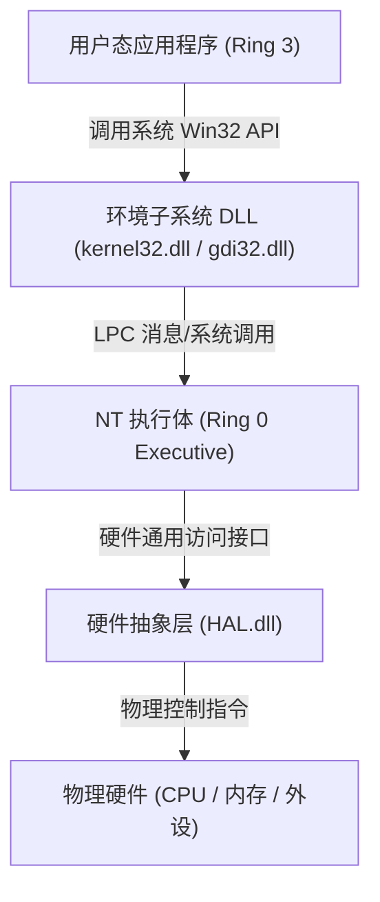
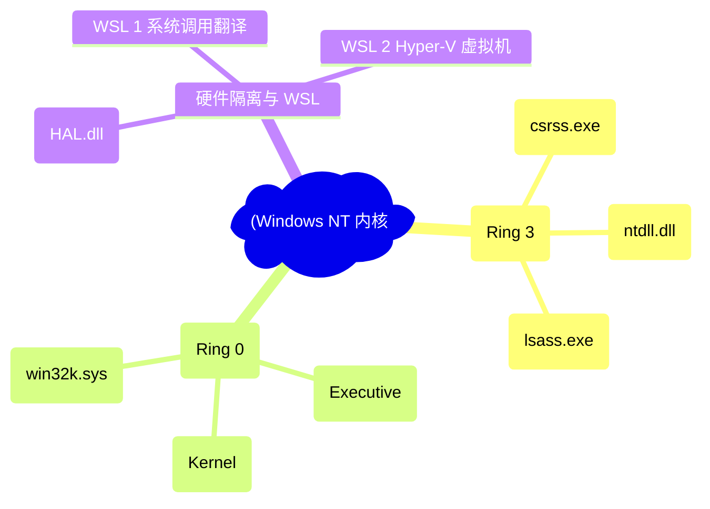
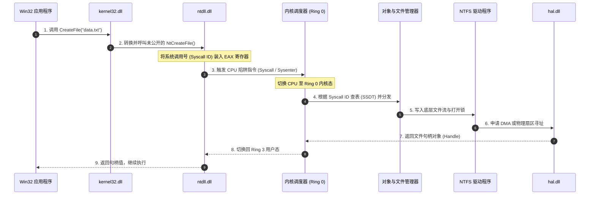
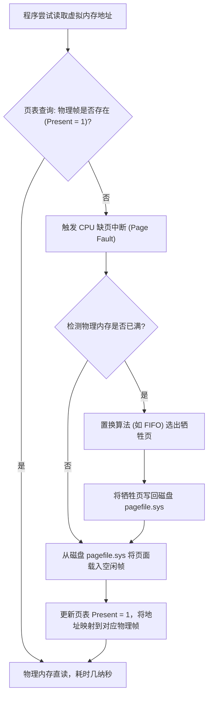
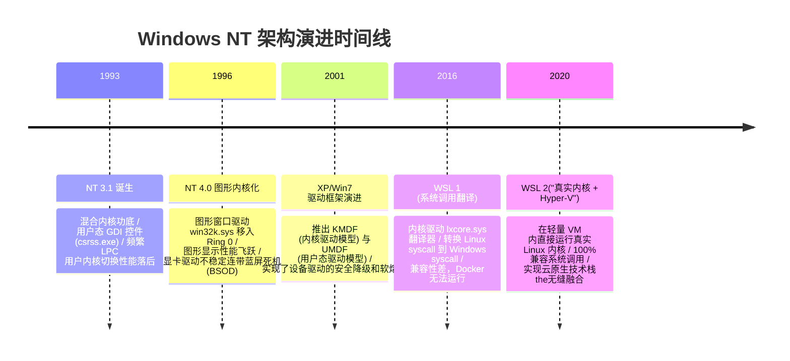

import CaseStudyHeader from '@site/src/components/CaseStudyHeader';
import DesignIntent from '@site/src/components/DesignIntent';
import ArchitectureEvolution from '@site/src/components/ArchitectureEvolution';
import TradeoffExplorer from '@site/src/components/TradeoffExplorer';
import GlossaryTerm from '@site/src/components/GlossaryTerm';
import ResearchNote from '@site/src/components/ResearchNote';
import QuizCard from '@site/src/components/QuizCard';
import CompareSlider from '@site/src/components/CompareSlider';
import GuidedExercise from '@site/src/components/GuidedExercise';
import PyRunner from '@site/src/components/PyRunner';

# Windows NT：混合内核与子系统兼容架构演进

<CaseStudyHeader
  oneLiner="Windows NT 巧妙地将微内核的『子系统物理隔离哲学』与宏内核的『高吞吐执行性能』相结合，通过硬件抽象层（HAL）隔离平台差异，并基于轻量级 Hyper-V 虚拟化底座演进出 WSL 2，构筑了兼顾极高后向兼容性与现代云原生生态的混合内核经典典范。"
  stats={[
    {label: '内核类型', value: 'Hybrid Kernel (混合内核)'},
    {label: '硬件隔离', value: 'HAL (硬件抽象层)'},
    {label: '子系统架构', value: 'Environment Subsystem (csrss.exe 等)'},
    {label: '图形内核化', value: 'win32k.sys 移入 Ring 0 空间'},
    {label: 'Linux 子系统', value: 'WSL 2 (Hyper-V 轻量虚拟化)'}
  ]}
/>

:::info 对应课程概念
本案例横跨 [Month 1 操作系统设计哲学与虚拟内存](../foundations/programming-systems-primer)、[Month 4 低阶设计 (LLD) 与微内核模式](../foundations/programming-systems-primer)、[Month 6 云原生虚拟化与容器隔离](../cloud-enterprise-industrial/capstone-cloud-native)。它帮助架构师深刻理解在大型基础软件工程中，如何通过引入分层抽象（HAL）与多环境适配面，在几十年漫长周期内维持软件向前演进与兼容的强大生命力。
:::

## 1. 设计初衷：如何兼顾“微内核隔离”与“宏内核速度”？

在 1980 年代末 Windows NT 立项之初，学术界与工业界正为“微内核（Microkernel）与宏内核（Monolithic Kernel）孰优孰劣”争论不休。微内核将几乎所有的服务（文件系统、网络协议栈、图形引擎）都放在用户态（Ring 3），服务之间依靠消息传递（IPC）通信，安全性极高但频繁的上下文切换导致性能低下；宏内核将所有服务塞入内核空间（Ring 0），速度飞快但一个驱动崩溃就会导致蓝屏死机。

Windows NT 设计师 Dave Cutler 采取了务实的折中策略：
1. **微内核的逻辑划分**：将应用所需的 API 接口划分到不同的 **<GlossaryTerm term="Environment Subsystem" definition="环境子系统：Windows NT 为了兼容不同操作系统 API 而设计的用户态代理服务。例如 Win32 子系统（csrss.exe）负责处理所有的 Windows GUI 与核心窗口逻辑。通过子系统隔离，使得 NT 能够同时运行 OS/2、POSIX 和 Win32 应用程序。">环境子系统（Environment Subsystem）</GlossaryTerm>** 中（如 Win32 子系统 `csrss.exe`），这保留了微内核的极强扩展性与 API 隔离性。
2. **宏内核的性能整合**：将最核心的进程调度、虚拟内存管理、安全审计直接塞入内核空间（称为 NT 执行体 Executive），并且在后续 NT 4.0 中将高频通信的图形引擎 **<GlossaryTerm term="win32k.sys" definition="win32k.sys：Windows 内核态的图形和窗口管理驱动程序。在 Windows NT 4.0 中，Atlassian 团队为了消除用户态与内核态频繁 IPC 导致的渲染卡顿，将原本位于用户态环境子系统的 GDI（图形设备接口）和 User 模块移入内核态，显著提升了图形交互性能。">win32k.sys</GlossaryTerm>** 从用户态移入内核态，从而终结了微内核的上下文切换卡顿，形成了经典的**<GlossaryTerm term="Hybrid Kernel" definition="混合内核：结合了微内核与宏内核特性的操作系统内核架构。它在内核态运行核心的执行体服务（进程管理、内存管理等）以保证性能，同时通过用户态子系统和分层驱动机制保障应用的兼容性与稳定性。">混合内核（Hybrid Kernel）</GlossaryTerm>**。
3. **屏蔽底层硬件异构性**：为了让 NT 能够运行在不同的处理器架构（X86, MIPS, Alpha 等）上，在内核最底层抽象出了 **<GlossaryTerm term="Hardware Abstraction Layer" definition="Hardware Abstraction Layer (HAL)：硬件抽象层。Windows 内核最底层的软件层，它屏蔽了主板、中断控制器、时钟芯片等硬件的芯片级差异，向上提供统一的硬件访问接口，使得上层内核代码无需修改即可跨平台移植。">硬件抽象层（HAL）</GlossaryTerm>**，将主板和 CPU 差异封装在统一接口下。



<DesignIntent
  problem="如何在大型操作系统架构中，既能运行多套互不兼容的 API 子系统（如 Win32、POSIX），又能保持宏内核级别的高图形渲染速度，且屏蔽底层复杂芯片的硬件差异？"
  users="全球数十亿普通桌面用户、大型企业服务器、系统驱动开发者，要求操作系统高稳定、支持游戏/3D 渲染，且对旧软件绝对向后兼容。"
  devices="支持多核 x86、x64、ARM 架构的台式机、笔记本、企业级服务器及嵌入式设备。"
  goals={[
    '混合内核架构分工：在内核态保留高频进程调度与内存管理（Executive），通过用户态 Environment Subsystem 隔离应用程序。',
    '硬件抽象层 HAL 抽象：提供 `hal.dll` 封装中断向量管理、物理时钟及 DMA 通信，保证内核主体的跨平台移植性。',
    'win32k.sys 图形内核化：将 GUI 的 GDI（图形设备）与窗口管理器移入 Ring 0，用内存直接拷贝消灭 IPC 通信延迟。',
    'WSL 2 云原生融合：基于超轻量级 Hyper-V 虚拟化，在物理 Windows 内跑真实的 Linux 固化内核，消灭 WSL 1 翻译层的系统调用兼容性死角。'
  ]}
  constraints={[
    '图形内核化的稳定性代价：由于 win32k.sys 运行在 Ring 0，第三方显卡驱动或 GUI 库的崩溃可能直接导致系统蓝屏（BSOD），需要引入驱动隔离（UMDF/KMDF）。',
    'WSL 2 的内存膨胀问题：真正的 VM 机制会占用独立的内存物理页，必须通过动态内存归还技术（Dynamic Memory Reclaim）在后台压缩 Linux 占用的内存。'
  ]}
  firstStep="划分 Ring 0 执行体与 Ring 3 子系统分界线；编写统一的 LPC（本地过程调用）进行进程通信；在内核层引入 HAL 驱动接口屏蔽 APIC 等中断控制器差异。"
/>

## 2. 系统功能全景

以下是 Windows NT 混合内核系统功能与适配边界的全景图：



---

## 3. 最新架构总览

Windows NT 操作系统的整体数据流转和组件层级划分如下：

### 3a. System Context (系统上下文)

```mermaid
graph LR
  User["系统用户 / 程序员"] -->|发起交互与执行应用| App["Win32 / Linux 应用程序"]
  App -->|1. 系统 API 呼叫| Subsystems["用户态子系统平面 (Subsystems)"]
  Subsystems -->|2. 系统调用 (Int 2E / Sysenter)| NTKernel["NT 混合内核空间 (Ring 0)"]
  NTKernel <-->|3. 设备驱动与硬件控制| HAL["硬件抽象层 (HAL)"]
  HAL -->|4. 读写寄存器 / DMA| PhysicalHardware["物理芯片与 CPU"]
```

### 3b. Container Diagram (容器架构)

```mermaid
graph TB
  subgraph UserMode["用户空间 (User Mode - Ring 3)"]
    subgraph Win32Subsystem["Win32 兼容子系统"]
      Win32App["Win32 应用程序 (exe)"]
      Kernel32["kernel32.dll / user32.dll"]
      Csrss["子系统控制进程 (csrss.exe)"]
    end
    
    subgraph SystemServices["核心系统服务"]
      Lsass["本地安全认证 (lsass.exe)"]
      Ntdll["底层系统调用封装 (ntdll.dll)"]
    end
    
    subgraph WSL2Subsystem["WSL 2 运行平面"]
      LinuxApp["Linux 应用程序 (ELF)"]
      Vmlxe["轻量虚拟化宿主 (VMWP.exe)"]
    end
  end

  subgraph KernelMode["内核空间 (Kernel Mode - Ring 0)"]
    SyscallDispatcher["系统服务调度器 (System Service Dispatcher)"]
    
    subgraph NTExecutive["NT 执行体 (Executive Services)"]
      ObjectMgr["对象管理器"]
      ProcessMgr["进程/线程管理器"]
      VMM["虚拟内存管理器 (Virtual Memory Mgr)"]
      Win32k["图形与窗口驱动 (win32k.sys)"]
    end

    Microkernel["微核心 (Microkernel Scheduling)"]
    HalDll["硬件抽象层 (hal.dll)"]
    
    subgraph HyperV["轻量虚拟化层"]
      LinuxKernel["真实 Linux 内核 (WSL 2)"]
    end
  end

  Win32App -->|API Call| Kernel32
  Kernel32 -->|LPC 通信| Csrss
  Kernel32 -->|包装跳转| Ntdll
  
  Ntdll -->|系统调用 (syscall)| SyscallDispatcher
  LinuxApp -->|Linux 内核呼叫| LinuxKernel
  
  SyscallDispatcher --> NTExecutive
  NTExecutive --> Microkernel
  Microkernel --> HalDll
  
  Win32k <-->|直接绘制信号| HalDll
  LinuxKernel <-->|基于 Hyper-V 硬件共享| HalDll
  Vmlxe <-->|管理虚拟机| LinuxKernel
```

---

## 4. 核心机制拆解

### 4a. 混合内核执行逻辑与系统调用转移 (System Call Transition)

当一个 Win32 应用程序调用 `CreateFile` 来打开一个磁盘文件时，系统经历了一次精细的用户态到内核态的穿透和转换：



### 4b. 虚拟内存管理器（Virtual Memory Manager - VMM）

Windows NT 拥有极其精密的**虚拟内存管理器（VMM）**，它为每个进程分配独立的 4GB（在 32 位系统下）或 128TB（在 64 位下）的虚拟地址空间。

其核心工作机制如下：
1. **两阶段内存分配**：
   - **保留（Reserve）**：仅在虚拟地址空间中划定一段范围，此时不消耗任何物理内存或磁盘分页文件。
   - **提交（Commit）**：真正将虚拟页面映射到物理帧或备份的分页文件（`pagefile.sys`）中。
2. **缺页中断处理（Page Fault Handling）**：
   - 当程序访问某个已被“提交”但尚未载入物理内存的虚拟页面时，CPU 触发 **Page Fault** 中断。
   - 内核接管中断，从磁盘分页文件中读取该页面，将其调入物理内存页框（Frame），并更新页表（Page Table）中的 Present 位。如果物理内存已满，则利用 FIFO/LRU 置换算法将不常用页面换出到磁盘。



### 4c. 从 WSL 1 到 WSL 2 的架构跃迁

为了在 Windows 平台上支持 Linux 运行环境，微内核/混合内核的子系统机制发挥了关键作用。微软经历了两次完全不同的架构抉择：

```mermaid
graph TB
  subgraph WSL1["WSL 1: 系统调用翻译模式 (Translation)"]
    LinuxApp1["Linux ELF 应用"] -->|发出 Linux Syscall (如 fork)| LxCore["lxcore.sys / lxss.sys 内核驱动"]
    LxCore -->|翻译为 NT API| WinKernel1["Windows 内核执行体"]
  end

  subgraph WSL2["WSL 2: 真实 Linux 内核 + Hyper-V 微虚拟机 (VM)"]
    LinuxApp2["Linux ELF 应用"] -->|直接发送物理 Syscall| VM["Hyper-V 极其轻量的 VM"]
    VM -->|完全兼容运行| RealLinux["真实编译的 Linux 内核"]
    RealLinux <-->|9P 协议 / 共享内存| Hypervisor["Hyper-V 虚拟机监控器"]
    Hypervisor <-->|硬件级对接| WinKernel2["Windows 内核执行体"]
  end
```

- **WSL 1（系统调用翻译）**：将 Linux 应用程序的系统调用（Syscalls）在内核态中通过驱动程序（`lxcore.sys`）实时“翻译”为等效的 Windows NT API。这种做法无需运行虚拟机，速度较快，但由于 Windows 和 Linux 在进程模型、文件系统（NTFS vs ext4）上存在本质差异，导致大量 Linux 复杂调用（如 `ptrace`、特定网络协议栈操作）无法被完美翻译，兼容性漏洞百出。
- **WSL 2（轻量级 Hyper-V 虚拟机）**：彻底抛弃翻译模式。利用 Windows 内部的 Hyper-V 虚拟机监控器，在极轻量级微型虚拟机（Utility VM）中直接运行一个**真实的、针对 Windows 深度优化裁剪的 Linux 内核**。由于内核是真实的，Linux 系统调用兼容性达到 100%，且通过 9P 协议与底层 Windows 实现高频文件系统共享，奠定了现代 Windows 作为顶级开发机和 Docker 宿主的基础。

---

## 5. 架构演进史

Windows NT 内核与系统架构经历了几次关键变革：



---

## 6. 关键数据结构与算法：页表与页置换控制

在 NT 的虚拟内存管理中，多级页表（Multi-level Page Table）设计与虚拟页面管理是精髓所在。

### 多级页表地址转换公式
当 CPU 在 x64 架构下进行地址转换时，通常会将一个 64 位的虚拟地址（Virtual Address）拆分为多段索引，在多级页表中逐级寻址：

$$VA = (PML4\_Idx, PDPT\_Idx, PD\_Idx, PT\_Idx, Offset)$$

*设计用意*：
- 避免为每个进程分配连续的巨大扁平页表。在稀疏地址空间中，许多页表目录指针可直接设为 Null，极大地压缩了进程页表本身占用的系统物理内存。

---

## 7. 架构对比

### 早期用户态 GUI 模式 vs 内核态图形化 win32k.sys 模式

<CompareSlider
  before={
    <div style={{ padding: '20px', background: '#ffebee', border: '1px solid #c62828', borderRadius: '8px', height: '100%', color: '#333' }}>
      <strong>用户态 GUI 模式 (Windows NT 3.1)</strong>
      <p style={{ marginTop: '10px', fontSize: '0.9rem' }}>
        所有的图形设备接口（GDI）与窗口管理器运行在用户态子系统进程（csrss.exe）中。程序画图时需要通过 LPC 发送大量跨进程消息。每次绘制都会发生频繁的用户态-内核态-子系统上下文切换，界面拖动有明显的撕裂感与卡顿。
      </p>
    </div>
  }
  after={
    <div style={{ padding: '20px', background: '#e8f5e9', border: '1px solid #2e7d32', borderRadius: '8px', height: '100%', color: '#333' }}>
      <strong>内核态图形化模式 (Windows NT 4.0+)</strong>
      <p style={{ marginTop: '10px', fontSize: '0.9rem' }}>
        将 GDI 和窗口控件驱动（win32k.sys）整体移入 Ring 0 内核空间。绘图操作直接通过 Ring 0 系统服务分发，消除了所有的 IPC 进程间切换成本。图形渲染速度提升了数倍，提供了极致流畅的桌面体验。
      </p>
    </div>
  }
  labels={['用户态 GUI 模式', '内核态图形化模式']}
/>

---

## 8. 核心决策的取舍

在实现系统级环境兼容时，架构师必须在调用兼容度、运行效率与资源消耗之间做出取舍：

<TradeoffExplorer
  title="操作系统级 Linux 兼容架构取舍"
  dimensions={['Linux 调用 100% 绝对兼容', '文件系统跨界读写性能', '系统冷启动与内存开销', '驱动程序开发与维护难度', '物理硬件直接透传率']}
  options={[
    {
      name: '系统调用内核翻译层 (WSL 1 模式)',
      scores: [2, 5, 5, 2, 4],
      note: '在 Windows 内核中写驱动拦截 Linux 系统调用并转换为 Windows 系统调用。无需运行任何虚拟机，冷启动仅需零点几秒，内存占用几乎为零。但在遇到 Linux 复杂文件锁和底层 Socket 操作时无法完美模拟，导致很多软件（如 Docker 守护进程）无法运行。',
      whenToUse: '仅需运行基础 Linux 命令行工具、对内存消耗极度敏感的低配环境。'
    },
    {
      name: '轻量化 Hyper-V 虚拟机 (WSL 2 模式)',
      scores: [5, 3, 3, 5, 3],
      note: '运行一个真实裁剪的 Linux 内核。系统调用兼容度达到完美的 100%，原生支持运行 Docker 和复杂的 Linux 服务。缺点是由于存在轻量虚拟机，需要占用数百兆的独立物理内存页，且跨文件系统读写（Windows 读 Linux 目录）性能有折损。',
      whenToUse: '需要完整 Linux 云原生开发体验（如 Docker, Kubernetes 调试）、高稳定性保障的现代开发环境。'
    },
    {
      name: '完全独立双系统引导 (Dual Boot)',
      scores: [5, 1, 1, 5, 5],
      note: '在物理硬盘分区安装两个完全独立的操作系统。能100%发挥两个系统的物理硬件性能，但必须重启才能切换，无法实现任何实时的进程协作和数据快速拷贝。',
      whenToUse: '需要绝对榨干显卡或 CPU 算力进行深度学习训练、运行 3D 大型游戏等单系统独占场景。'
    }
  ]}
/>

---

## 9. 实践指引：实现一个虚拟内存缺页中断与 FIFO 页面置换仿真器

虚拟内存的“按需调页”与“缺页置换”是 Windows NT VMM 能够让程序运行超过物理内存限制大小的核心法宝。

在下方练习中，使用 Python 模拟一个简易的 VMM 页表寻址、缺页中断抛出及 FIFO（先进先出）页面换出置换逻辑。

<GuidedExercise
  title="练习指引：编写缺页异常处理器与页面置换算法"
  goal="模拟虚拟内存管理器（VMM）。给定有限的物理内存页框（例如 3 个 Frame），当顺序访问一组虚拟页时，若该页 present 标识为 False，抛出缺页异常，并使用 FIFO 置换算法换出最久远的页，释放物理页框供新页载入。"
  hints={[
    '你可以用字典模拟页表，Key 是虚拟页号，值包含物理帧号 `frame_id` 以及是否载入的布尔值 `present`。',
    '物理页框列表可用固定大小的列表模拟：`[None, None, None]`。',
    'FIFO 队列：使用一个 Python 列表跟踪页面调入的先后顺序，置换时弹出第 0 位元素。'
  ]}
  steps={[
    '设计 `PageTableEntry` 类，维护 `frame_id` 和 `present` 标记。',
    '实现 `VirtualMemoryManager` 核心类，初始化虚拟页总数与物理帧数。',
    '实现 `access_page(page_id)` 方法：若 present 命中则直接返回；若未命中则调用 `handle_page_fault` 逻辑进行置换并载入。',
    '模拟一段高频访问流，观察并打印页面载入、换出、物理帧腾空以及最终页表 Present 状态变化。'
  ]}
  checks={[
    '在物理内存未满时，新页面能够被顺序载入物理帧并打上 present 标记。',
    '在物理内存满后，新页面能正确触发置换，最先进入的旧虚拟页被成功换出且其 present 标记被清空为 False。'
  ]}
/>

#### 交互式 Python 运行实验
在下方控制台中运行并测试准备好的虚拟内存缺页置换算法代码，试着改变物理帧容量，观察缺页率的变化：

<PyRunner
  expect="分片路由与隔离验证成功"
  rows={25}
  code={`class PageTableEntry:
    def __init__(self):
        self.frame_id = None # 当前映射的物理页框 ID
        self.present = False # 该虚拟页是否在物理内存中

class VirtualMemoryManager:
    def __init__(self, virtual_pages_count=8, physical_frames_count=3):
        self.vp_count = virtual_pages_count
        self.pf_count = physical_frames_count
        
        # 初始化页表：虚拟页号 -> 页表项
        self.page_table = {i: PageTableEntry() for i in range(virtual_pages_count)}
        # 物理帧数组：[虚拟页号1, 虚拟页号2, ...]
        self.physical_frames = [None] * physical_frames_count
        # 用列表记录页面载入顺序，作为 FIFO（先进先出）队列
        self.fifo_queue = []
        
    def access_page(self, page_id: int):
        print(f"[VMM] 进程请求访问虚拟页 {page_id}...")
        if page_id < 0 or page_id >= self.vp_count:
            print("   -> ❌ 访问拒绝：越界访问引发段错误 (Segmentation Fault)")
            return "SEG_FAULT"
            
        entry = self.page_table[page_id]
        
        # 1. 页表命中 (Page Hit)
        if entry.present:
            print(f"   -> [Page Hit] 命中！虚拟页 {page_id} 已映射在物理帧 {entry.frame_id}")
            return "HIT"
            
        # 2. 缺页异常 (Page Fault)
        print(f"   -> ❌ [Page Fault] 缺页异常！虚拟页 {page_id} 不在物理内存中，触发硬件中断")
        self.handle_page_fault(page_id)
        return "PAGE_FAULT"
        
    def handle_page_fault(self, page_id: int):
        entry = self.page_table[page_id]
        
        # 检查物理内存中是否有空闲的物理帧
        allocated_frame = None
        for i, val in enumerate(self.physical_frames):
            if val is None:
                allocated_frame = i
                break
                
        # 3. 物理内存已满，触发页面换出 (Page Out)
        if allocated_frame is None:
            # 队列头部的是最先进入内存的页面，将其换出
            victim_page_id = self.fifo_queue.pop(0)
            victim_entry = self.page_table[victim_page_id]
            allocated_frame = victim_entry.frame_id
            
            # 从内存中剥离该牺牲页
            victim_entry.present = False
            victim_entry.frame_id = None
            self.physical_frames[allocated_frame] = None
            print(f"   -> [Page Out] 物理内存满！牺牲虚拟页 {victim_page_id}，回收其占用的物理帧 {allocated_frame}")
            
        # 4. 从虚拟磁盘将新页面调入内存 (Page In)
        self.physical_frames[allocated_frame] = page_id
        entry.frame_id = allocated_frame
        entry.present = True
        self.fifo_queue.append(page_id)
        print(f"   -> [Page In] 从 pagefile.sys 载入虚拟页 {page_id} 到物理帧 {allocated_frame}")

# 1. 实例化 VMM (8个虚拟页，但只有3个物理帧)
vmm = VirtualMemoryManager(virtual_pages_count=8, physical_frames_count=3)

# 2. 顺序访问页面
vmm.access_page(0) # 缺页载入
vmm.access_page(1) # 缺页载入
vmm.access_page(2) # 缺页载入

print("\n--- 此时物理内存已满，再次读取 1 (期望命中) ---")
vmm.access_page(1)

print("\n--- 访问新页 3 (触发置换，最先进入的 0 号页应该被置换出去) ---")
vmm.access_page(3)

print("\n--- 重新访问已置换出的 0 号页 (触发置换，1 号页应该被置换) ---")
vmm.access_page(0)
`}
/>

---

## 10. 知识自测

完成自测以检验你对 Windows NT 混合内核、环境子系统、win32k.sys 图形优化以及 WSL 1/2 架构本质的掌握程度：

<QuizCard
  questions={[
    {
      q: 'Windows NT 在架构上被归类为“混合内核（Hybrid Kernel）”，其最核心的设计权衡表现在哪里？',
      options: [
        'A. 它只在白天以微内核模式运行，晚上为了提高速度切换为宏内核模式',
        'B. 它将核心的进程调度、虚拟内存和对象管理保留在 Ring 0 内核态（Executive）以获取极高速度，同时将不常用的 OS 兼容层（如 POSIX, OS/2, Win32）作为 Ring 3 用户态环境子系统运行，以兼顾安全性与兼容性',
        'C. 它完全摒弃了所有的 Ring 0 空间，所有的代码全部在用户态运行',
        'D. 仅仅是为了能够同时安装 Windows 和 Linux 两套桌面'
      ],
      answer: 1,
      explain: '混合内核兼顾了性能与兼容性。最基础的 OS 执行体服务（Ring 0 Executive）保障了系统的核心吞吐，而多子系统环境（Ring 3 Environment Subsystems）如 csrss.exe 让 Windows 能优雅兼容其他异构系统的应用程序 API，不至于牵一发而动全身。'
    },
    {
      q: '在 Windows NT 4.0 中， Atlassian / 微软团队将图形与窗口管理器驱动 win32k.sys 从 Ring 3 用户态移入 Ring 0 内核态，这做出的架构妥协是什么？',
      options: [
        'A. 牺牲了系统在断网情况下的文件保存功能',
        'B. 显著提升了绘图渲染速度并消灭了频繁跨进程 LPC 通信卡顿，但妥协代价是：由于第三方显卡和图形驱动拥有了 Ring 0 特权，一旦驱动程序发生非法内存写崩溃，会直接连带导致整个操作系统蓝屏挂掉',
        'C. 彻底取消了对多线程并发计算的支持',
        'D. 使得所有的 Windows 游戏都无法运行在低配 CPU 上'
      ],
      answer: 1,
      explain: '这是一个经典的性能与安全性妥协。在 NT 3.5 之前，GUI 运行在用户态，因为上下文切换太频密导致画图极慢。移入 Ring 0 内核空间消除了消息传递延迟，让 Windows 桌面如丝般顺滑，但代价是显卡驱动代码的不稳定性会直接导致整个内核死锁或蓝屏。'
    },
    {
      q: 'WSL 2（Windows Subsystem for Linux 2）相比 WSL 1，在底层架构上做出的最大变革是什么？',
      options: [
        'A. WSL 2 重新采用了更高效的 Linux 汇编翻译引擎，取消了任何文件共享',
        'B. 彻底抛弃了在 Windows 内核中翻译 Linux 系统调用的不完全模拟器驱动，转而基于超轻量级 Hyper-V 虚拟化层运行真实的、由微软高度裁剪优化的真实 Linux 内核，实现了 100% 的系统调用绝对兼容',
        'C. WSL 2 强迫用户必须将硬盘格式化为 ext4，无法再读取 NTFS 分区',
        'D. WSL 2 只是给 Windows 换了一个 Linux 风格的桌面皮肤'
      ],
      answer: 1,
      explain: 'WSL 1 的系统调用翻译层（Translation Layer）难以模拟 Linux 底层极为繁琐复杂的底层硬件和网络 syscall，导致 Docker 等高级云原生工具无法运行。WSL 2 直接运行真实的 Linux 内核，消灭了翻译死角，依靠 Hyper-V hypervisor 实现了物理级别的云原生融合。'
    }
  ]}
/>

## 来源

- [Windows Internals, Seventh Edition: Part 1 (Mark Russinovich et al.)](https://learn.microsoft.com/en-us/sysinternals/resources/windows-internals)
- [Inside Windows NT: Architectural Principles and Hybrid Design (Cutler et al.)](https://microsoft.com/)
- [Comparing WSL 1 and WSL 2: Architecture and Hypervisor Utilities (Microsoft Learn)](https://learn.microsoft.com/en-us/windows/wsl/compare-versions)
- [Virtual Memory Management in the Windows NT Executive (VMM Architecture Documentation)](https://learn.microsoft.com/en-us/windows-hardware/drivers/kernel/virtual-memory-and-address-spaces)