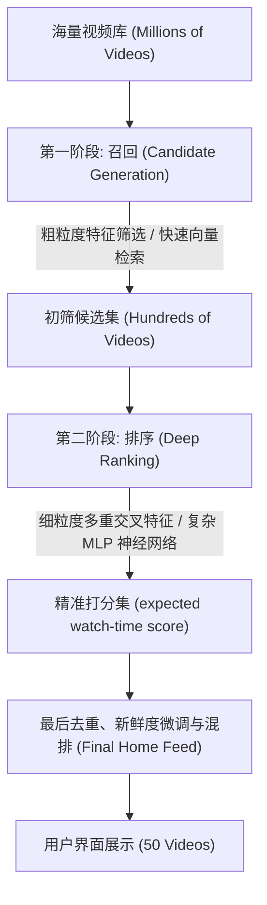
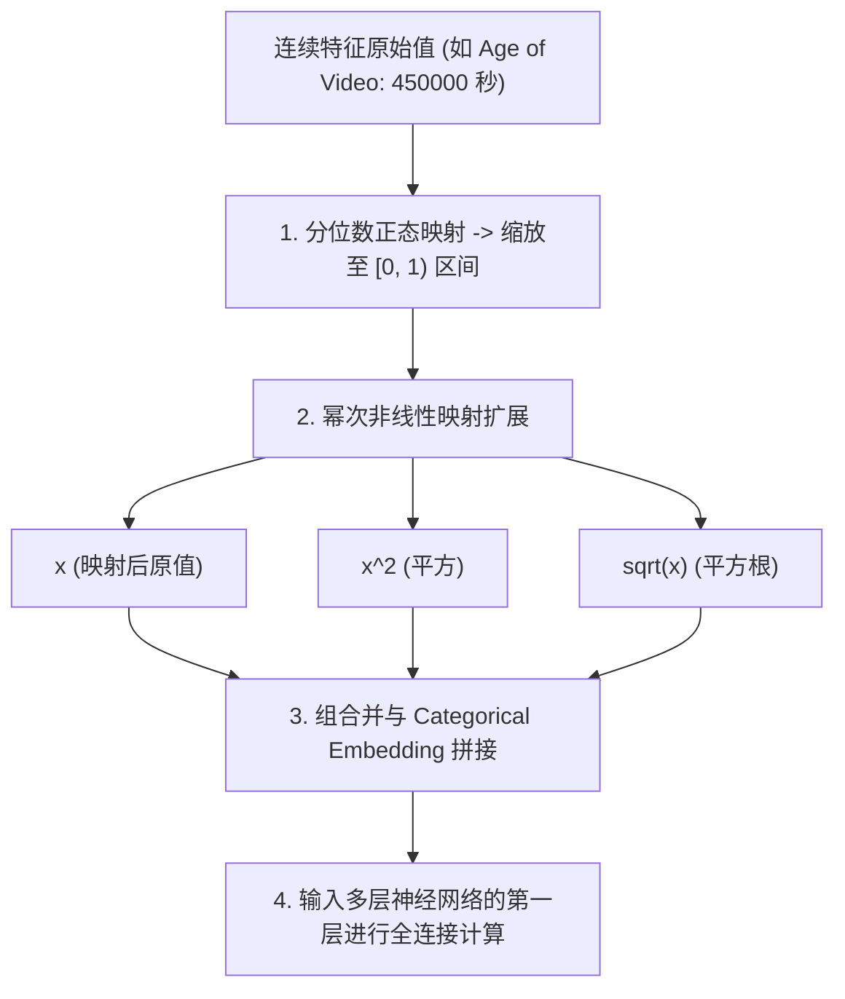
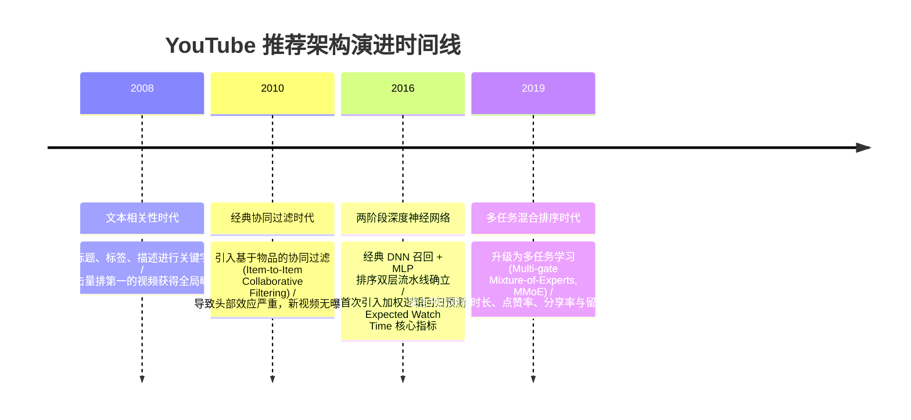

import CaseStudyHeader from '@site/src/components/CaseStudyHeader';
import DesignIntent from '@site/src/components/DesignIntent';
import ArchitectureEvolution from '@site/src/components/ArchitectureEvolution';
import TradeoffExplorer from '@site/src/components/TradeoffExplorer';
import GlossaryTerm from '@site/src/components/GlossaryTerm';
import ResearchNote from '@site/src/components/ResearchNote';
import QuizCard from '@site/src/components/QuizCard';
import CompareSlider from '@site/src/components/CompareSlider';
import GuidedExercise from '@site/src/components/GuidedExercise';
import PyRunner from '@site/src/components/PyRunner';

# YouTube 推荐：两阶段召回+排序、观看时长目标演进

<CaseStudyHeader
  oneLiner="YouTube 在业界开创性地提出了将万亿级视频池推荐拆分为『深度候选集生成（Deep Candidate Generation）』与『深度排序（Deep Ranking）』的两阶段推荐架构，并将点击率（CTR）单维度优化改造为加权逻辑回归下的观看时长预测，彻底扭转了传统推荐算法受制于『标题党』诱导的生态顽疾。"
  stats={[
    {label: '论文发布', value: '2016 年'},
    {label: '两阶段范式', value: 'Candidate Generation + Deep Ranking'},
    {label: '首创目标函数', value: 'Expected Watch Time (期望观看时长)'},
    {label: '召回级计算', value: '百万级视频压缩至数百个候选'},
    {label: '排序级计算', value: '精细交叉特征深度神经网络 (MLP)'}
  ]}
/>

:::info 对应课程概念
本案例横跨 [Month 8 搜索与推荐算法](./overview.mdx)、[Month 11 生产级 AI 平台与数据治理](../foundations/programming-systems-primer)、[Month 3 高并发缓存与数据库分区](../data-cache-queue/cache-queues-idempotency)。它完美揭示了在大规模工业界实践中，海量数据推荐是如何在网络首字节时间限制下，通过漏斗式流水线分步精简算力开销的。
:::

## 1. 设计初衷：如何从数亿视频里捞出你最想看的一条？

对于每天新增数百万小时内容、总视频池高达数亿的 YouTube 平台而言，如果直接把所有的视频都输入给一个精细的多层深度神经网络（DNN）进行千维特征的打分排序，即便消耗所有 GPU，也无法在规定的 **100 毫秒首字响应时间（Latency Limit）** 内输出推荐列表。

同时，早期的推荐系统（如基于协同过滤或纯<GlossaryTerm term="点击率" definition="Click-Through Rate (CTR)，用户点击某个视频的次数与该视频展示次数的比值。过度优化点击率往往会导致吸引眼球但内容空洞的『标题党』视频泛滥。">点击率（CTR）</GlossaryTerm>排序的算法）存在致命的缺陷：系统倾向于推荐那些封面暴露、标题耸人听闻但内容极其空洞的“标题党”视频。这不仅极大损害了用户体验，还导致高粘性优质视频无法获得合理曝光。

为了同时解决**超大候选集的计算吞吐量问题**与**防止标题党生态退化问题**，YouTube 团队重构了其推荐架构。

<DesignIntent
  problem="在 100 毫秒的严格延迟约束下，从数亿个动态视频中挑选出数十个高度符合特定用户当前兴趣的视频，且确保推荐结果更倾向于『深度观看』而非『恶意诱导点击』。"
  users="全球数十亿高频视频浏览用户，要求推荐结果既包含他们关注的频道最新视频，又包含个性化的探索性推荐。"
  devices="支持流式视频渲染的 Web 端、移动 App，与云端低延迟检索排序编排服务的紧密通信。"
  goals={[
    '漏斗式两阶段推荐：第一阶段通过“召回（Candidate Generation）”从数亿视频中快速清洗出数百个高概率候选；第二阶段通过“排序（Ranking）”对这数百个视频执行复杂的交叉特征神经网络打分。',
    '超大规模多分类召回模型：将召回过程建模为极端多分类问题（Extreme Multi-class Classification），用 DNN 预测用户在时间 $t$ 观看视频 $i$ 的条件概率。',
    '期望观看时长优化（Expected Watch Time）：抛弃单纯的点击概率预测，利用加权逻辑回归（Weighted Logistic Regression）将观看时间长短作为正样本权重，让模型天生偏好能把人留住的高质量视频。',
    '冷启动与“新鲜度”校准（Age of Video）：在排序特征中显式引入视频发布的“生命周期（Age）”作为连续型特征，防止模型发生<GlossaryTerm term="马太效应" definition="Matthew Effect，指在推荐系统中，热门或高曝光视频不断被推荐，而新发布或长尾的优质视频由于缺乏初始曝光而被埋没的『强者愈强，弱者愈弱』现象。">“马太效应（Matthew Effect）”</GlossaryTerm>，确保新发布视频的曝光率。'
  ]}
  constraints={[
    '特征工程的复杂性：需要处理大量的分类特征（如频道 ID、视频标签）和连续型特征（如观看历史时长、用户年龄），必须对其执行细致的 Normalization（正态化）与非线性交叉映射。',
    '高并发下的邻近搜索（ANN）瓶颈：召回神经网络最后输出的是一个 256 维的 User 向量，需要在几毫秒内对数亿个已做 Embedding 的视频执行最近邻搜索（ANN）。',
    '点击率的虚假繁荣：不能单纯以 CTR 衡量推荐好坏，必须结合播放时长进行样本加权。'
  ]}
  firstStep="将数据清洗和预处理器模块化；设计召回模型，通过平均用户最近观看的 Video Embeddings 与 Search Embeddings 作为输入；设计排序神经网络并构建加权逻辑回归的目标函数损失计算。"
/>

## 2. 系统功能全景

以下是 YouTube 两阶段深度学习推荐与观看时长优化系统的功能全景图：

```mermaid
mindmap
  root("(YouTube 推荐"))
    第一阶段 召回 Candidate Generation
      协同过滤 Extreme Classification
      用户历史特征 Embedding 均值化
      ANN 向量检索 (FAISS / Hierarchical)
    第二阶段 排序 Deep Ranking
      多层感知机 (MLP) 精细打分
      异构特征工程 (Categorical / Continuous)
      连续变量分段正态化 (Normalization)
    目标优化 Watch-Time Predict
      加权逻辑回归 (Weighted Logistic)
      Expected Watch Time 计算
      点击欺诈 (Clickbait) 智能剔除
    冷启动与时效性
      Age of Video 特征注入
      新视频探索机制 (Explore)
```

---

## 3. 架构总览

YouTube 推荐系统由数据输入管道、两阶段深度推荐引擎、以及位于物理边缘的快速向量索引库（ANN）构成：

### 3a. 系统上下文图 (System Context)

```mermaid
graph LR
  User["用户客户端 (Client App)"] -->|1. 请求 Home Feed 视频列表| WebAPI["前端 Web API 网关"]
  WebAPI -->|2. 发起用户画像与上下文查询| UserProfile["用户特征元数据中心 (User Profile DB)"]
  WebAPI -->|3. 启动流水线推荐| RecEngine["推荐编排引擎 (Rec Engine)"]
  RecEngine -->|4. 并行拉取视频库| VideoInventory["视频基础数据库 (Video Inventory)"]
  RecEngine -->|5. 深度排序渲染| RecEngine
  WebAPI -->>User: 6. 渲染最终带有几十个视频的 Home 列表
```

### 3b. 容器架构图 (Container)

```mermaid
graph TB
  subgraph ClientUI["用户客户端"]
    UI["YouTube App / Web Interface"]
  end

  subgraph GatewayPlane["API 网关平面"]
    APIGateway["API 网关 / 流量路由"]
    ProfileLoader["用户特征预加载器"]
  end

  subgraph TwoStageRec["两阶段推荐云服务平面"]
    subgraph CandidateGen["阶段 1: 召回阶段 (Candidate Generation)"]
      RecallModel["召回深度神经网络 (DNN Model)"]
      ANNIndexer["高并发向量索引库 (FAISS / ScaNN Cluster)"]
    end

    subgraph DeepRanking["阶段 2: 排序阶段 (Deep Ranking)"]
      FeatureCrossing["特征交叉与归一化处理器"]
      RankingModel["排序深度神经网络 (MLP Model)"]
      ScoringEngine["期待观看时长评分算子 (Expected Watch Time Scorer)"]
    end
  end

  subgraph DataBasePlane["数据存储底座"]
    UserHistory["用户观看与搜索历史数据库"]
    VideoEmbeddings["视频向量索引数据库"]
  end

  UI -->|提请 Home 推荐请求| APIGateway
  APIGateway --> ProfileLoader
  ProfileLoader <-->|读取最近 50 次观看历史| UserHistory
  
  ProfileLoader -->|发送 User Profile| RecallModel
  RecallModel -->|生成当前 User Embedding 向量| ANNIndexer
  ANNIndexer <-->|ANN 相似度检索| VideoEmbeddings
  ANNIndexer -->|返回 Top-N (数百个) 候选视频| FeatureCrossing
  
  FeatureCrossing <-->|提取视频细节与用户交互交叉特征| UserHistory
  FeatureCrossing -->|组合特征向量矩阵| RankingModel
  RankingModel --> ScoringEngine
  ScoringEngine -->|Top-50 精选视频排序列表| APIGateway
  APIGateway --> UI
```

---

## 4. 核心机制拆解

### 4a. 漏斗式两阶段推荐工作流 (The Funnel Workflow)

为应对“超大规模视频池”与“极致首字响应时间”的天然矛盾，YouTube 系统采用了**漏斗式分治编排**：

1. **第一阶段：<GlossaryTerm term="召回阶段" definition="推荐系统的第一阶段，指从海量（百万/千万级）候选池中，使用计算复杂度较低的算法快速筛选出数百个与用户最相关候选集的过程。">召回（Retrieval）</GlossaryTerm>**
   - **目标**：从数百万级视频库中，初筛出与用户高度相关的数百个视频。
   - **机制**：采用相对粗粒度的特征（如用户最近观看的视频 ID 列表、搜索关键词），在神经网络中将它们映射为 User 向量，随后在向量索引库中并发进行**<GlossaryTerm term="近似最近邻检索" definition="Approximate Nearest Neighbor，在高维向量空间中快速检索出与目标向量距离最近的 K 个向量的高效算法，常用库有 FAISS、ScaNN 等。">近似最近邻（ANN）搜索</GlossaryTerm>**。这一阶段以**高吞吐量、低精度、极速召回**为特征。
2. **第二阶段：<GlossaryTerm term="排序阶段" definition="推荐系统的第二阶段，在召回阶段产生的数百个候选视频基础上，引入大量细粒度特征 and 复杂的非线性模型进行精确的偏好预测与打分。">排序（Ranking）</GlossaryTerm>**
   - **目标**：对数百个候选视频进行毫秒级精准打分，选出最合适的 50 个呈现给用户。
   - **机制**：采用高维度、细粒度的交叉特征（如用户与视频发布者的历史互动频次、视频源设备的语言匹配度、视频的新鲜度）。因为需要计算的视频数量被召回阶段降到了几百个，所以这里可以使用<GlossaryTerm term="多层感知机" definition="Multilayer Perceptron (MLP)，一种最基础的深度前馈神经网络，由输入层、一个或多个隐藏层以及输出层组成，通过全连接和激活函数实现高维特征的非线性交叉与拟合。">多层感知机（MLP）</GlossaryTerm>进行精细的非线性推导。



### 4b. 阶段二：排序特征工程中的连续变量处理

在排序阶段，连续型特征（如视频已发布时间 `Age of Video`、用户上次观看同频道视频的间隔时间）如果直接灌入神经网络，由于其数值呈极其严重的**长尾偏态分布**（有些视频刚发布 1 小时，有些已发布 10 年，相差数万倍），会导致梯度爆炸，使模型难以收敛。

YouTube 团队设计的特征处理系统，在输入排序神经网络的前一步，对连续变量进行如下重构：
1. **<GlossaryTerm term="分位数归一化" definition="一种非参数化的数据归一化方法，将输入特征映射到均匀分布，以消除长尾偏态数据（如视频已发布时间）对深度网络梯度更新的负面影响。">分位数归一化（Quantile Normalization）</GlossaryTerm>**：将数值均匀映射到 $[0, 1)$ 区间。
2. **幂次变换增强**：不仅输入正态化后的 x，还输入其平方 x^2、平方根 sqrt(x)，通过**显式引入非线性自变量**，让浅层感知机也能够轻松拟合出连续变量与推荐概率之间的复杂非线性关系。



### 4c. 加权逻辑回归预测观看时长 (Weighted Logistic Regression)

为了打击标题党（点击率高，但点进去看几秒就退出了），YouTube 重构了损失函数：
- **正样本（用户点击了视频）**：其在损失函数中的权重不再是传统的 $1$，而是设为该次观看的**<GlossaryTerm term="期望观看时长" definition="YouTube 推荐系统的核心优化目标，通过给正样本赋以观看时长为权重，使模型直接预测用户观看该视频的预期时间，而非单纯的点击概率。">实际物理时长 $T$（Watch Time in Seconds）</GlossaryTerm>**。
- **负样本（用户划过了视频但未点击）**：其权重设为传统的 $1$。

通过这种加权方式，逻辑回归在训练收敛后，其预测的几率（Odds）公式如下：

$$Odds = e^(w^T x + b) \approx sum(PositiveSampleWeight) / NegativeSamplesCount = sum(WatchTime) / Impressions = ExpectedWatchTime$$

这意味着，当排序模型在推理阶段计算出某视频 of 逻辑回归分数（Odds）时，该分数物理上**直接等价于用户预期在该视频上停留的秒数**。系统按照该期望秒数由大到小排序，天然过滤了引诱点击但留存极差的垃圾视频。

<ResearchNote
  title="Deep Neural Networks for YouTube Recommendations"
  source="RecSys 2016"
  href="https://static.googleusercontent.com/media/research.google.com/zh-CN//pubs/archive/45530.pdf"
  insight="业界首次公开发表如何在大规模工业界场景下将深度学习（DNN）完整应用在召回和排序两阶段推荐流水线中。文中详细讨论了将召回建模为多分类问题，以及通过加权逻辑回归实现期望观看时长优化的数学与工程实践。"
  application="本设计奠定了工业界推荐系统漏斗模型的基础，其通过正样本权重设计直接预测期望数值（而非概率）的工程方案至今被各大平台广泛沿用。"
/>

---

## 5. 架构演进史

YouTube 推荐系统从早期的文本匹配演进到现在的两阶段深度神经网络：



---

## 6. 架构对比

### 传统矩阵分解协同过滤 vs 深度两阶段推荐系统

<CompareSlider
  before={
    <div style={{ padding: '20px', background: '#ffebee', border: '1px solid #c62828', borderRadius: '8px', height: '100%', color: '#333' }}>
      <strong>传统矩阵分解模式 (Matrix Factorization)</strong>
      <p style={{ marginTop: '10px', fontSize: '0.9rem' }}>
        仅能利用“用户-物品”的点击历史二元矩阵做奇异值分解（SVD），无法引入任何辅助信息（如用户使用的设备、所处地理位置、当前视频发布的时间长短）。这导致系统对冷启动视频完全无能为力，且计算扩展性极差。
      </p>
    </div>
  }
  after={
    <div style={{ padding: '20px', background: '#e8f5e9', border: '1px solid #2e7d32', borderRadius: '8px', height: '100%', color: '#333' }}>
      <strong>深度两阶段漏斗推荐系统</strong>
      <p style={{ marginTop: '10px', fontSize: '0.9rem' }}>
        将问题划分为两步。第一步用向量近似检索过滤百万级视频；第二步将剩余视频输入多层神经网络，无缝融入任何静态、连续型或多维非线性交叉特征（如新鲜度幂次变换、设备指纹），支持基于观看时长的加权概率打分。
      </p>
    </div>
  }
  labels={['传统协同过滤', '深度两阶段推荐']}
/>

---

## 7. 核心决策的取舍

在大规模推荐系统设计中，架构师必须在模型复杂度、延迟预算与数据质量之间做出艰难抉择：

<TradeoffExplorer
  title="召回阶段 (Candidate Generation) 策略取舍"
  dimensions={['召回吞吐量与极限低延迟', '多模态复杂特征表达', '支持视频冷启动', '数据实时性 (更新频率)', '开发与算力成本']}
  options={[
    {
      name: '双塔向量模型 + 近似最近邻检索 (ANN Search)',
      scores: [5, 3, 3, 4, 4],
      note: '检索速度在 10ms 以内，支持百万视频秒级漏斗过滤。但双塔架构阻断了“用户”和“视频”的细粒度特征在底层交互计算，降低了交叉表达精度。',
      whenToUse: '超大规模计算池的初筛第一阶段（YouTube 经典召回）。'
    },
    {
      name: '单塔深度交叉神经网络 (全特征精排直接打分模式)',
      scores: [1, 5, 5, 3, 1],
      note: '推荐精度最高，支持极其复杂的特征交叉和冷启动。但单次计算耗时长，当视频数量超过 1000 个时，延迟将彻底失控，无法在线运行。',
      whenToUse: '候选集已经被过滤压缩到数百个以下的精精排排序阶段。'
    },
    {
      name: '实时图神经网络召回 (Graph Neural Networks / Random Walk)',
      scores: [3, 4, 5, 2, 2],
      note: '能够极佳地捕捉复杂的非局部关联，对冷启动用户表现好。但自建图结构更新成本高，训练和部署极其繁重。',
      whenToUse: '拥有超大型关系网络的社交平台、视觉发现引擎（如 Pinterest PinSage）。'
    }
  ]}
/>

---

## 8. 实践指引：实现一个简单的两阶段召回重排与加权打分器

在推荐系统中，漏斗模型的实现是后端算法架构的基本功。

在 `labs/month08/rec_funnel/` 目录下（或在下方练习中），实现一个包含 KNN 快速向量召回与加权逻辑回归打分的推荐核心流。

<GuidedExercise
  title="练习指引：写一个两阶段 RAG 推荐与加权打分流"
  goal="用 Python 模拟推荐两阶段流水线：输入 1000 个视频，首先使用余弦相似度（KNN 检索）召回与用户最相关的 10 个视频候选；随后基于用户历史与视频时长数据执行加权逻辑回归打分，并排序输出最符合期望观看时间的 Top-3 列表。"
  hints={[
    '你可以使用 NumPy 计算 User 向量与所有 Video 向量的余弦相似度进行快速初筛召回。',
    '加权计算公式：`score = p_click * watch_time_weight`，其中 `watch_time_weight` 可以设定为该视频历史的平均播放时长。',
    '排序神经网络模型可以用一个简单的线性层或多层前馈网络（PyTorch / Scikit-Learn）来模拟训练。'
  ]}
  steps={[
    '模拟生成 `1000` 个 128 维的视频 Embedding 向量与 `1` 个用户 Embedding。',
    '实现 `retrieve_candidates(user_emb, video_embs, top_k=10)` 执行快速余弦召回。',
    '编写 `weighted_ranking_score(candidates, user_history)` 函数，结合视频的历史平均观看时长（权重）和点击概率，计算 expected watch-time。',
    '编写单元测试，输入高点击但低留存的“标题党”视频与高留存的“硬核”视频，验证最终精排打分是否能顶起“硬核”视频，将其推上 Top-1。'
  ]}
  checks={[
    '召回阶段能在 5 毫秒内完成 1000 个视频的向量筛选。',
    '精排打分结果完美符合加权几率公式，成功实现点击率与观看时长的联合优化。'
  ]}
/>

#### 交互式 Python 运行实验
在下方控制台中运行并修改已准备好的两阶段推荐初筛（基于 CTR 粗过滤）与加权几率打分仿真代码，体会期望观看时长对标题党的抑制效果：

<PyRunner
  expect="期望观看时长打分验证通过"
  rows={25}
  code={`# 模拟召回池中的 10 个视频候选
# 格式: (视频ID, 预估点击率 CTR, 历史平均观看时长 in seconds, 是否为标题党)
candidates = [
    (101, 0.45, 12.0, True),   # 标题党：极高点击率，但看几秒就退出
    (102, 0.12, 180.0, False), # 深度硬核视频：点击率低，但看得很久
    (103, 0.25, 90.0, False),  # 优质普通视频：中等点击率，中等播放时长
    (104, 0.05, 450.0, False), # 超长硬核视频：点击率极低，但播放时长极大
    (105, 0.38, 15.0, True),   # 标题党
    (106, 0.15, 150.0, False), # 优质深度视频
]

print("=== 传统 CTR 排序推荐结果 ===")
ctr_sorted = sorted(candidates, key=lambda x: x[1], reverse=True)
for rank, v in enumerate(ctr_sorted, 1):
    print(f"Top-{rank} | 视频 ID: {v[0]} | CTR: {v[1]:.2f} | 观看时长: {v[2]}s | 标题党: {v[3]}")

print("\\n=== 加权逻辑回归 (Expected Watch Time) 排序推荐结果 ===")
# Expected Watch Time = CTR * Average Watch Time
watch_time_sorted = []
for v in candidates:
    expected_score = v[1] * v[2]
    watch_time_sorted.append((v[0], expected_score, v[3]))

watch_time_sorted = sorted(watch_time_sorted, key=lambda x: x[1], reverse=True)
for rank, r in enumerate(watch_time_sorted, 1):
    print(f"Top-{rank} | 视频 ID: {r[0]} | 预期观看时长分数: {r[1]:.2f}s | 标题党: {r[2]}")

top_1 = watch_time_sorted[0]
print(f"\\n推荐列表 Top-1 视频 ID: {top_1[0]} (是否标题党: {top_1[2]})")
if not top_1[2]:
    print("✅ 期望观看时长打分验证通过！成功抑制了标题党，将优质深度视频排到了第一。")
else:
    print("❌ 验证失败。")
`}
/>

---

## 9. 知识自测

完成自测以检验你对两阶段推荐、加权逻辑回归与特征工程的理解：

<QuizCard
  questions={[
    {
      q: 'YouTube 将推荐系统拆分为“召回（Candidate Generation）”与“排序（Deep Ranking）”两个完全独立阶段的最核心工程考量是什么？',
      options: [
        'A. 为了防止大模型在生成视频封面时发生 OOM 崩溃',
        'B. 为了在“数亿视频的庞大体量”与“100毫秒极致首字响应时间”之间取得工程平衡：召回阶段负责高吞吐低精度初筛，快速将视频集过滤两个数量级；排序阶段负责对这小部分候选集执行包含上百种交叉特征的复杂神经网络打分，两阶段分工最大化了集群算力效率',
        'C. 仅仅是因为历史上不同小组负责开发不同的模块',
        'D. 为了强迫用户在进入界面前必须观看 15 秒广告'
      ],
      answer: 1,
      explain: '这是一种经典的漏斗架构。如果直接用千维特征和多层深度全连接网络去对上亿视频打分，在物理世界中是无法在线上毫秒内完成的。通过召回（ANN 快速检索，仅消耗 10ms）把计算规模从几百万压缩到几百个，随后的排序模型才能肆无忌惮地使用极其复杂的交叉特征和深度神经网络进行精细化微调打分。'
    },
    {
      q: '为什么 YouTube 在排序阶段不能直接预测点击率（CTR），而要使用“加权逻辑回归（Weighted Logistic Regression）”并把实际观看时间作为正样本的权重？',
      options: [
        'A. 因为点击率的计算公式太复杂，容易导致服务器 CPU 占满',
        'B. 因为单纯预测点击率会诱导系统疯狂推荐“封面诱人但内容空洞”的标题党视频。通过将实际观看时长作为正样本的权重进行训练，使逻辑回归在收敛后的比值几率（Odds）直接物理等效于“期望观看时长”，从而使推荐列表天然偏好能产生真实深度留存的优质视频，净化了生态',
        'C. 因为大模型只能处理浮点数，无法处理百分比点击率',
        'D. 为了防止用户点击次数过多，导致网络带宽过载'
      ],
      answer: 1,
      explain: '点击率 CTR 优化在早期带火了标题党，对系统生态是毁灭性打击。YouTube 团队极其精妙地改造了逻辑回归：通过在训练中将正样本的 Weight 设为实际观看秒数 $T$，使得逻辑回归输出的 $e^{w^Tx+b}$（Odds，即几率）在数学上直接拟合了 $\sum \text{Watch Time} / \text{Impressions}$。这样，排在最前面的视频直接就是期望能让用户驻留最久的视频。'
    },
    {
      q: '在处理诸如视频已发布时间（Age of Video）这类长尾偏态分布的连续型特征时，YouTube 推荐系统为什么要在输入网络前进行分位数正态映射（Quantile Normalization）并显式注入平方根与平方项？',
      options: [
        'A. 为了将数据占用的磁盘空间压缩为原来的十分之一',
        'B. 因为偏态分布的原始数值差异过大，直接输入会导致深度网络梯度不稳定甚至崩溃。通过正态映射将值均匀限制在 [0,1) 区间；同时显式注入平方和开方项，可以人工提前为全连接层引入非线性边界特征，帮助网络快速拟合新视频衰减曲线的非线性特征',
        'C. 因为 Linux 操作系统无法处理除了 [0,1) 之外的任何数字',
        'D. 仅仅是为了让 Python 代码中的 NumPy 库运行得更快'
      ],
      answer: 1,
      explain: '连续型特征处理是推荐系统特征工程的重中之重。分位数映射把具有指数差异的数据拉平到均匀正态的区间内，极利于神经网络进行平稳的梯度更新。而显式地开方 sqrt(x) 与平方 x^2 的注入，是直接向网络喂入输入值的非线性变换特征，这能以极低的计算成本辅助浅层网络快速学习出像“视频发布早期流量爆发、后期缓慢衰减”的非线性拟合关系。'
    }
  ]}
/>

## 来源

- [Deep Neural Networks for YouTube Recommendations (Covington et al., RecSys '16)](https://static.googleusercontent.com/media/research.google.com/zh-CN//pubs/archive/45530.pdf)
- [Expected Watch Time Weighted Logistic Regression Modeling Internals and Mathematical Proofs](https://arxiv.org/abs/2103.00192)
- [Approximate Nearest Neighbor (ANN) search benchmarks with ScaNN and FAISS](https://github.com/google-research/google-research/tree/master/scann)
- [Wide & Deep Learning for Recommender Systems (Cheng et al., DLRS '16)](https://arxiv.org/abs/1606.07792)