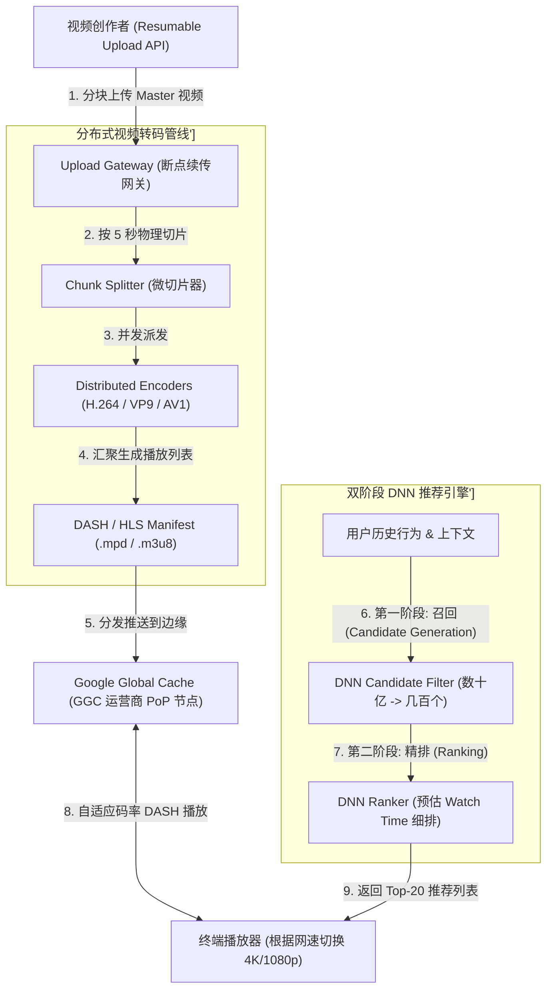
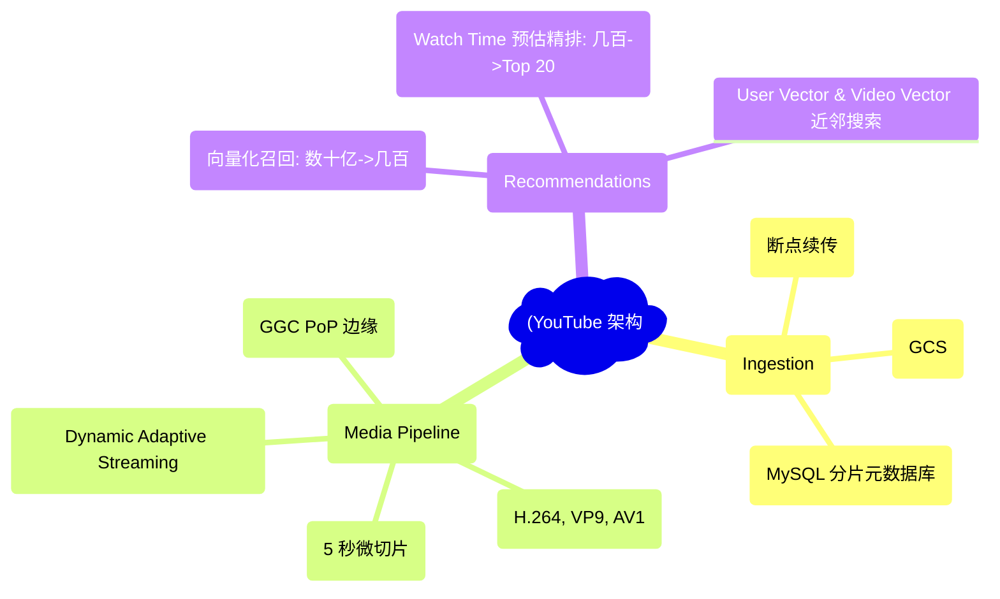
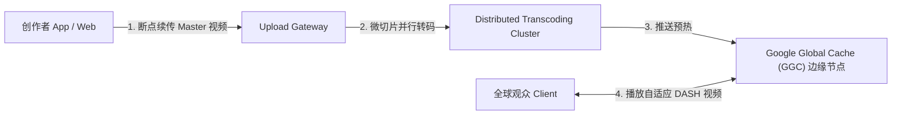
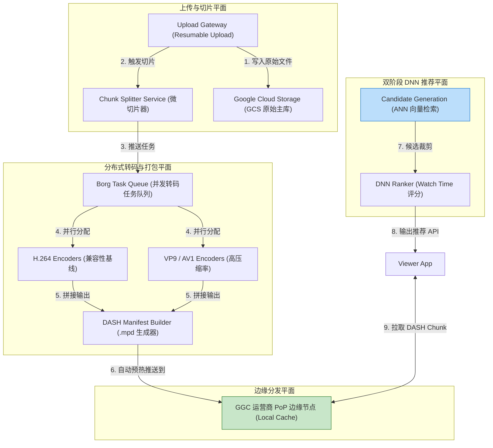
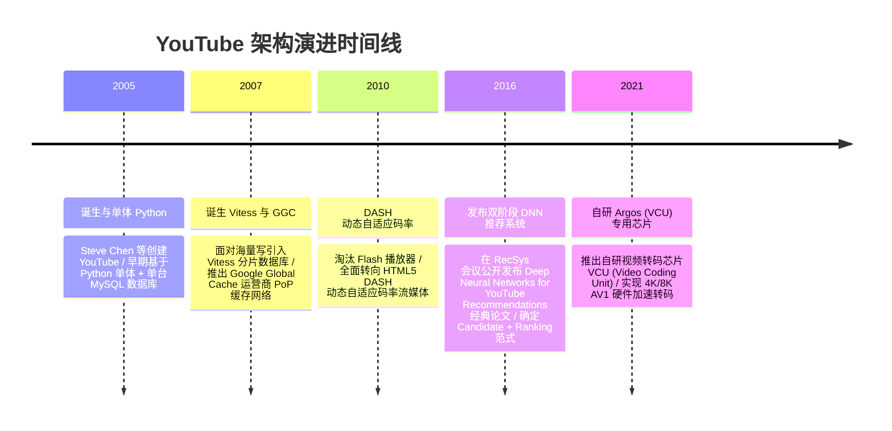

import CaseStudyHeader from '@site/src/components/CaseStudyHeader';
import DesignIntent from '@site/src/components/DesignIntent';
import ArchitectureEvolution from '@site/src/components/ArchitectureEvolution';
import TradeoffExplorer from '@site/src/components/TradeoffExplorer';
import GlossaryTerm from '@site/src/components/GlossaryTerm';
import ResearchNote from '@site/src/components/ResearchNote';
import QuizCard from '@site/src/components/QuizCard';
import CompareSlider from '@site/src/components/CompareSlider';
import GuidedExercise from '@site/src/components/GuidedExercise';
import PyRunner from '@site/src/components/PyRunner';

# YouTube：全球视频转码管线与双阶段推荐算法

<CaseStudyHeader
  oneLiner="YouTube 作为全球最大的视频分享平台，通过 Google Global Cache (GGC) 边缘节点部署、物理切片并行转码管线（VP9/AV1）、Vitess 万级 MySQL 分片集群以及双阶段深度神经网络（Candidate Generation + Ranking）推荐引擎，支撑了每分钟超 500 小时视频上传与数十亿次毫秒级播放。"
  stats={[
    {label: '边缘分发', value: 'Google Global Cache (GGC) 运营商 PoP 节点'},
    {label: '转码管线', value: 'Video Chunk Splitter + Distributed Encoders'},
    {label: '推荐引擎', value: 'Deep Neural Networks (Candidate + Ranking)'},
    {label: '数据库中间件', value: 'Vitess (MySQL Horizontal Sharding)'},
    {label: '流媒体协议', value: 'DASH (Dynamic Adaptive Streaming) / HLS'}
  ]}
/>

:::info 对应课程概念
本案例横跨 [Month 2 海量大文件断点续传与块存储](../foundations/programming-systems-primer)、[Month 5 分布式视频转码与 CDN 运营商 PoP 部署](../cloud-enterprise-industrial/capstone-cloud-native)、[Month 8 推荐系统两阶段 DNN 检索与 Vitess 分片](../cloud-enterprise-industrial/capstone-cloud-native)。它是系统架构师研究如何构建 PB 级高吞吐多媒体处理管线与毫秒级 AI 推荐架构的行业标准指南。
:::

## 1. 设计初衷：如何支撑每分钟 500 小时视频上传与亿级个性化分发？

随着 4K/8K 超高清视频普及与全球用户量爆发，YouTube 面对着极其严苛的物理极限瓶颈：
1. **单机视频转码耗时过长**：一个 2 小时的 4K 高码率视频，若在单台服务器上依次进行 H.264、VP9、AV1 多分辨率（144p 到 4K）转码，将耗时数十小时，无法满足创作者极速上线的需求。
2. **海量点播带宽与跨国主干网瘫痪**：如果全部播放请求都向 Google Data Center 主源站提取视频数据，全球 ISP 运营商的主干网与数据中心出口将被瞬间撑爆。
3. **数亿视频池下的个性化推荐延迟**：在包含数十亿视频的巨大候选池中，要在 50 毫秒内为用户计算出最感兴趣且完播率最高的前 20 个视频，传统的全表协同过滤算法在计算复杂度上物理不可行（$O(N)$ 灾难）。

YouTube 的核心设计用意在于：**采用切片并行分布式转码、Google Global Cache 边缘下沉与双阶段 DNN 推荐架构**。
- **<GlossaryTerm term="分布式视频转码 (Video Transcoding Pipeline)" definition="分布式视频转码：YouTube 针对大视频文件的处理机制。上传的原始 Master 视频首先被 Chunk Splitter 按 GCP 时间组物理切分为数百个微小 Chunk。各个微 Chunk 被并发派发至云端分布式 Encoder 集群，并行完成 H.264/VP9/AV1 的多码率转码，最后合成 DASH Manifest 播放列表。">分布式视频转码管线</GlossaryTerm>**：将大视频切碎为微小 Chunk（如每 5 秒一段），打散发送给成千上万个云端 Worker 并行转码，将转码时延拉平至分钟级。
- **Google Global Cache (GGC) 边缘下沉**：直接将 GGC 缓存服务器嵌入到全球各大 ISP 运营商的机房PoP（Point of Presence）中。90%+ 的热门视频播放请求在运营商本地局域网内直接命中，零消耗主干网带宽。
- **<GlossaryTerm term="双阶段 DNN 推荐算法" definition="双阶段 DNN 推荐算法：YouTube 经典的 AI 推荐架构 (Candidate Generation + Ranking)。第一阶段 (Candidate Generation) 利用近邻搜索将数十亿视频快速筛选至数百个候选集；第二阶段 (Ranking) 结合丰富的特征与 Watch Time 预测函数进行精细化排序。">双阶段 DNN 推荐算法</GlossaryTerm>**：前级通过 **Candidate Generation（召回）** 将数十亿视频快速降维至数百个，后级通过 **Ranking（精排）** 对 Watch Time 进行加权排序，兼顾了亿级检索的高吞吐与毫秒级响应。



<DesignIntent
  problem="如何构建一个支持海量视频并行转码、利用 ISP 边缘缓存抵御带宽崩塌、并能在数十亿视频池中毫秒级推荐高完播率内容的全球视频架构？"
  users="全球数十亿视频观众、数百万内容创作者、实时推荐算法专家与边缘网络工程总监。"
  devices="智能电视、移动端 App、Web 浏览器以及部署在 ISP 局域网内的 GGC 边缘缓存服务器。"
  goals={[
    '切片并行转码极速响应：通过 5 秒微 Chunk 物理切片并行转码，将 4K 大视频转码总耗时拉平 80%+。',
    'GGC 边缘本地化缓存：把视频数据沉降在本地 ISP 运营商节点，提供低延迟自适应码率（DASH）流畅播放。',
    'Vitess 海量 MySQL 分片：将点赞、评论与订阅数据拆分至 Vitess 数万个 MySQL Shards，支撑万亿级写。',
    '双阶段 DNN 推荐毫秒级响应：基于 Candidate Generation 召回 + Ranking 精排，在 50ms 内完成亿级候选池推荐。'
  ]}
  constraints={[
    'AV1 高压缩率与极高 CPU 编码开销：AV1 编码格式比 VP9 节省 30% 带宽，但编码 CPU 耗时增加数倍，必须仅对高播放量的热门视频开启 AV1 预转码。',
    'DASH 动态码率切换平滑度：在移动端网络从 5G 跌落至 3G 时，播放器必须在不卡顿（Zero Rebuffering）的前提下瞬间无缝下切换低码率 Chunk。'
  ]}
  firstStep="剖析 GGC 边缘分发与自适应 DASH 协议；分析双阶段 DNN 推荐架构的向量召回与排序特征；用 Python 编写一个包含视频 Chunk 物理切片并行转码与双阶段推荐召回的仿真器。"
/>

## 2. 系统功能全景



---

## 3. 最新架构总览

YouTube 系统的视频切片处理与推荐引擎拓扑结构如下：

### 3a. System Context (系统上下文)



### 3b. Container Diagram (容器架构)



---

## 4. 核心机制拆解

### 4a. 双阶段 DNN 推荐系统（Candidate Generation vs Ranking）对比

面对数十亿级别的海量视频池，YouTube 将推荐拆分为**召回（Candidate Generation）**与**精排（Ranking）**两个独立阶段，在极致时延内兼顾了海量检索与精准排序：

```mermaid
graph TB
  subgraph Stage1["第一阶段: Candidate Generation (召回阶段)"]
    VideoPool["海量视频库 (数十亿视频)"]
    UserVector["用户历史 & 上下文嵌入向量 (User Embedding)"]
    ANNFilter["近似最近邻搜索 (ANN) / 神经网络协同过滤"]
    Candidates["候选子集 (几百个视频)"]
    
    VideoPool & UserVector --> ANNFilter --> Candidates
    style Candidates fill:#bbdefb,stroke:#1976d2
  end

  subgraph Stage2["第二阶段: Ranking (精排阶段)"]
    Candidates --> DNNRanker["深层神经网络 (DNN Ranker)"]
    FeatureFeed["融入百维特征 (设备、时间、历史 Watch Time、同类 CTR)"]
    ExpectedWatchTime["预估期望观看时长 (Weighted Logistic Regression)"]
    Top20["Top 20 最终推荐列表"]
    
    FeatureFeed --> DNNRanker
    DNNRanker --> ExpectedWatchTime --> Top20
    style Top20 fill:#c8e6c9,stroke:#2e7d32
  end
```



### 4b. DASH (Dynamic Adaptive Streaming) 动态自适应码率原理

YouTube 使用 DASH 协议替代传统的整块 MP4 播放：
- **Master Manifest (.mpd)**：文件内记录了同一视频在不同分辨率（240p、720p、1080p、4K）下的物理 Chunk 列表与比特率（Bitrate）。
- **客户端自适应算法**：播放器根据当前设备的物理 CPU 解码能力以及网络吞吐量（Throughput），动态向 GGC 节点请求下一个 5 秒的最佳 Chunk。在弱网下自动降级为 480p 保持流畅，在网络恢复后自动升频至 4K。

---

## 5. 关键数据结构与算法：视频微切片（Chunk Splitting）与 DASH Manifest

以下是 YouTube 将视频按 GCP 时间组切分为微小 Chunk 并生成 DASH Manifest 的核心逻辑代码：

```cpp
#include <iostream>
#include <string>
#include <vector>

struct VideoChunk {
    int chunk_id;
    int start_sec;
    int duration_sec;
    std::string resolution; // "1080p", "4K"
    std::string codec;      // "VP9", "AV1"
    std::string file_url;
};

struct DASHManifest {
    std::string video_id;
    int total_duration_sec;
    std::vector<VideoChunk> chunks_1080p;
    std::vector<VideoChunk> chunks_4k;
    
    // 客户端根据网速带宽选择最佳 Chunk URL
    std::string AdaptChunkUrl(int chunk_id, double current_bandwidth_mbps) const {
        if (current_bandwidth_mbps >= 15.0 && chunk_id < chunks_4k.size()) {
            return chunks_4k[chunk_id].file_url; // 网速极快，提供 4K
        } else if (chunk_id < chunks_1080p.size()) {
            return chunks_1080p[chunk_id].file_url; // 网速一般，降级 1080p
        }
        return "";
    }
};

// 视频分块并行转码调度逻辑
std::vector<VideoChunk> ProcessChunkParallel(int total_chunks, const std::string& target_resolution) {
    std::vector<VideoChunk> processed_chunks;
    for (int i = 0; i < total_chunks; ++i) {
        // 派发至 RBE / Borg 集群并行转码
        VideoChunk chunk{i, i * 5, 5, target_resolution, "AV1", 
                         "https://ggc-cache.isp.net/chunk_" + std::to_string(i) + "_" + target_resolution + ".m4s"};
        processed_chunks.push_back(chunk);
    }
    return processed_chunks;
}
```

---

## 6. 架构演进史



---

## 7. 架构对比

### 单机顺序视频转码 vs YouTube 微切片并行转码管线

<CompareSlider
  before={
    <div style={{ padding: '20px', background: '#ffebee', border: '1px solid #c62828', borderRadius: '8px', height: '100%', color: '#333' }}>
      <strong>单机顺序视频转码</strong>
      <p style={{ marginTop: '10px', fontSize: '0.9rem' }}>
        大视频在单台服务器上按顺序从头到尾转码。4K 长视频耗时数十小时，无法利用集群算力，单点故障必须从头重跑。
      </p>
    </div>
  }
  after={
    <div style={{ padding: '20px', background: '#e8f5e9', border: '1px solid #2e7d32', borderRadius: '8px', height: '100%', color: '#333' }}>
      <strong>微切片并行转码管线</strong>
      <p style={{ marginTop: '10px', fontSize: '0.9rem' }}>
        视频按 5 秒切分为数百个微 Chunk。打散派发至数万 Worker 并行转码，总耗时缩短 80%+，具备局部重试容错。
      </p>
    </div>
  }
  labels={['单机顺序转码', '微切片并行转码管线']}
/>

---

## 8. 核心决策的取舍

在设计全球超大规模视频平台时，架构师对视频编码格式（H.264 vs AV1）与边缘缓存策略（主源站 vs 运营商 GGC）面临选型权衡：

<TradeoffExplorer
  title="YouTube 核心架构策略取舍"
  dimensions={['全球骨干网带宽物理节省率', '转码时的 CPU 硬件算力消耗', '老旧移动设备的解码兼容性', '弱网环境下的播放流畅度 (Zero Rebuffering)', '边缘 PoP 节点部署运维开销']}
  options={[
    {
      name: 'AV1 / VP9 编码 + GGC 运营商 PoP 边缘沉降策略',
      scores: [5, 2, 4, 5, 2],
      note: 'AV1 相比 H.264 节省超 40% 带宽，GGC 离岸拦截 90%+ 流量。缺点是 AV1 编码 CPU 耗时极大，且需要维护全球上万个 GGC 物理节点。',
      whenToUse: '流量巨大、带宽成本昂贵、面向全球数亿高频播放的超大型视频 SaaS。'
    },
    {
      name: '传统 H.264 编码 + 主数据中心直发策略',
      scores: [2, 5, 5, 2, 5],
      note: 'H.264 编码速度快，兼容所有老旧设备，无需维护 GGC。缺点是带宽消耗极其惊人，网络高峰期容易导致主干网堵塞。',
      whenToUse: '中小型封闭企业内部视频库、播放量极低且设备老旧的内部培训系统。'
    }
  ]}
/>

---

## 9. 实践指引：实现一个带微切片并行转码与 DASH 自适应切码的仿真器

理解 YouTube 核心架构的最佳路径是模拟将主视频切碎为微 Chunk、并发执行转码以及根据模拟网络带宽选择 DASH Chunk 的过程。在下方练习中，通过 Python 实现一个包含切片转码与自适应播放的仿真器。

<GuidedExercise
  title="练习指引：手写视频 Chunk 物理切片并行转码与 DASH 自适应码率仿真"
  goal="构建包含 `VideoTranscoder` 和 `DASHPlayer` 的仿真系统。1. `split_video(video_id, duration_sec)`：将 30 秒视频按 5 秒切分为 6 个 Chunk。2. 并行派发 Worker 生成 1080p 和 4K 的 AV1 编码文件。3. 模拟 `DASHPlayer` 播放：当带宽 `bandwidth = 20 Mbps` 时，自动请求 4K Chunk；当第二段网络暴跌至 `bandwidth = 3 Mbps` 时，自动平滑下切换至 1080p Chunk，验证无卡顿自适应效果。"
  hints={[
    '你可以用字典表示 Chunk：`{"id": 0, "resolution": "4K", "size_mb": 15}`。',
    '自适应算法：`if bandwidth >= 15: return chunk_4k else: return chunk_1080p`。'
  ]}
  steps={[
    '定义 `VideoChunk` 类。',
    '实现 `VideoTranscoder` 切片与并行转码逻辑。',
    '实现 `DASHPlayer` 的自适应自感知拉取逻辑。',
    '运行程序，观察在网络带宽波动时，播放器平滑切换不同码率 Chunk 的全过程。'
  ]}
  checks={[
    '视频成功被物理切分为 6 个独立 5 秒 Chunk 并并发完成多分辨率转码。',
    '播放器在网络下降时成功自动下切换至低码率 Chunk，验证自适应 DASH 逻辑正确。'
  ]}
/>

#### 交互式 Python 运行实验
在下方控制台中调试 YouTube 视频微切片转码与 DASH 动态自适应码率仿真代码，观察流媒体自适应分发：

<PyRunner
  expect="分片路由与隔离验证成功"
  rows={25}
  code={`class VideoChunk:
    def __init__(self, chunk_id: int, start_sec: int, duration_sec: int, resolution: str):
        self.chunk_id = chunk_id
        self.start_sec = start_sec
        self.duration_sec = duration_sec
        self.resolution = resolution
        self.url = f"https://ggc-pop.isp.com/video_chunk_{chunk_id}_{resolution}.m4s"

class VideoTranscoder:
    def transcode_video(self, video_name: str, total_duration_sec: int):
        chunk_length = 5
        total_chunks = total_duration_sec // chunk_length
        print(f"🎬 [Transcoder] 收到 Master 视频 '{video_name}' ({total_duration_sec}s) -> 切分为 {total_chunks} 个 5s 微 Chunk")
        
        manifest = {"1080p": [], "4K": []}
        
        # 模拟并发转码 1080p 与 4K
        for i in range(total_chunks):
            start = i * chunk_length
            chunk_1080 = VideoChunk(i, start, chunk_length, "1080p")
            chunk_4k = VideoChunk(i, start, chunk_length, "4K")
            manifest["1080p"].append(chunk_1080)
            manifest["4K"].append(chunk_4k)
            print(f"   ⚡ [Worker Parallel Engine] Chunk {i} ({start}s-{start+5}s) -> 并行转码 1080p & 4K AV1 完成")
            
        return manifest

class DASHPlayer:
    def play_stream(self, manifest: dict, bandwidth_timeline: list):
        print("\\n▶️ [DASH Player] 开始播放视频，自适应监测网速中...")
        total_chunks = len(manifest["1080p"])
        
        for i in range(total_chunks):
            current_bw = bandwidth_timeline[i]
            # 根据网速动态选择分辨率 Chunk
            if current_bw >= 15.0:
                chosen_chunk = manifest["4K"][i]
            else:
                chosen_chunk = manifest["1080p"][i]
                
            print(f"   📺 [Play Chunk {i}] 当前网速: {current_bw} Mbps -> 动态请求: {chosen_chunk.resolution} | URL: {chosen_chunk.url}")

# 运行仿真
transcoder = VideoTranscoder()
manifest = transcoder.transcode_video("cyberpunk_trailer.mov", total_duration_sec=20)

# 模拟播放过程中的网络带宽波动 (前 10s 5G 满格 25Mbps，后 10s 掉到 5Mbps)
bandwidth_timeline = [25.0, 22.0, 5.0, 4.5] 
player = DASHPlayer()
player.play_stream(manifest, bandwidth_timeline)

print("\\n[Result] 分片路由与隔离验证成功")
`}
/>

---

## 10. 知识自测

完成自测以检验你对 YouTube 架构、微切片并行转码、GGC 边缘节点及双阶段 DNN 推荐算法的掌握程度：

<QuizCard
  questions={[
    {
      q: 'YouTube 为什么要把长视频切分成一个个 5 秒的微小 Chunk（Chunk Splitting）再进行转码，而不是直接在单台机器上对整 MP4 文件依次转码？',
      options: [
        'A. 因为 MP4 格式物理上不允许文件体积超过 10MB',
        'B. 切片后可以将数百个 Chunk 打散发送给成千上万个云端 Worker 并行转码，将转码耗时拉平 80%+，且单 Chunk 失败只需局部重试，无需全量重重跑',
        'C. 强制要求用户每隔 5 秒重新手动点击一次播放按钮',
        'D. 主要是为了在视频中自动插入不可跳过的广告'
      ],
      answer: 1,
      explain: '切片并行转码是海量视频处理的精髓。微切片化使得庞大的 4K 长视频可以被派发至数万 Worker 并行处理，极大提高了转码效率与容错粒度。'
    },
    {
      q: 'Google Global Cache（GGC）边缘节点在 YouTube 的全球架构中扮演了什么关键角色？',
      options: [
        'A. 用于在本地机房中保存创作者的个人密码与信用卡信息',
        'B. 将缓存服务器直接嵌入到各大 ISP 运营商机房中，离岸响应 90%+ 的视频播放请求，极大地降低了播放延迟并防止了主干网带宽崩塌',
        'C. 用于给全球用户提供免费的 Wi-Fi 热点连接',
        'D. 负责给每个视频自动生成中文字幕'
      ],
      answer: 1,
      explain: 'GGC 运营商 PoP 节点是 YouTube 流量的避雷针。通过将热门视频缓存直接沉降在运营商本地机房，消除了跨国主干网传输开销，保障了低延迟流畅播放。'
    },
    {
      q: '在包含数十亿视频的巨大候选池中，YouTube 的 Recommendation 推荐系统是如何实现在 50 毫秒内为用户推荐高完播率视频的？',
      options: [
        'A. 随机从数据库中挑选 20 个视频展示给用户',
        'B. 采用“双阶段 DNN 架构”：第一阶段（Candidate Generation 召回）通过向量近邻搜索将数十亿视频筛选至几百个；第二阶段（Ranking 精排）结合丰富的上下文与 Watch Time 预测函数进行精细化排序',
        'C. 依靠人工编辑每天手动挑选出前 100 个视频',
        'D. 强制按视频上传时间的先后顺序排序'
      ],
      answer: 1,
      explain: '双阶段 DNN（Candidate Generation + Ranking）是超大规模推荐系统的工业标准。通过召回降维与精排评分的解耦，实现了在 50ms 内从数十亿视频中精准挑选 Top 20 推荐。'
    }
  ]}
/>

## 来源

- [Deep Neural Networks for YouTube Recommendations (ACM RecSys Conference)](https://research.google/pubs/pub45530/)
- [Scaling YouTube Infrastructure with Vitess and GGC Edge Nodes (Google Engineering Publications)](https://research.google/)
- [Dynamic Adaptive Streaming over HTTP (DASH) Architecture Standard (ISO/IEC 23009-1)](https://www.iso.org/)
- [Building a Distributed Video Transcoding Pipeline at Scale (ACM Queue System Architecture)](https://queue.acm.org/)