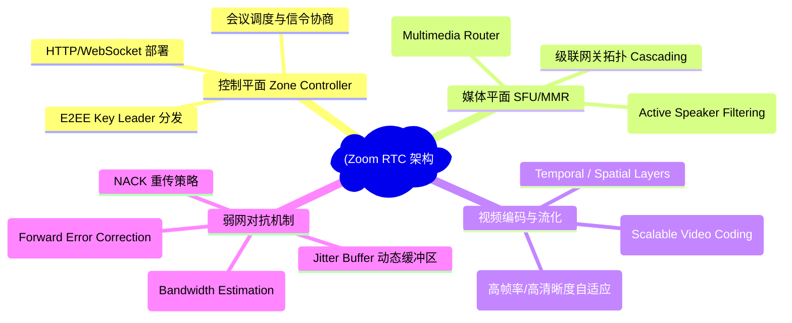
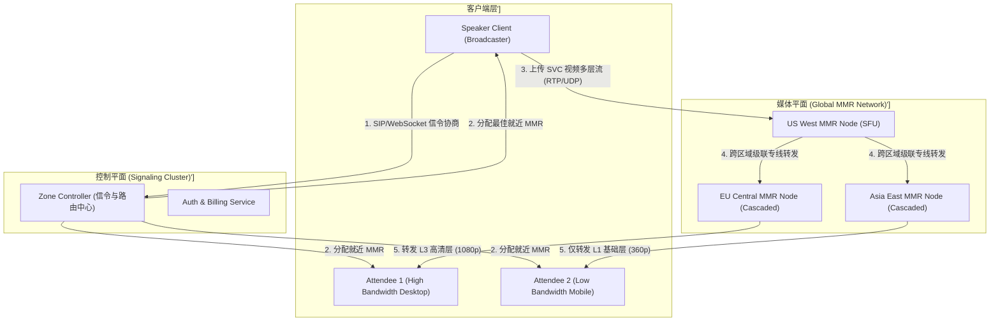
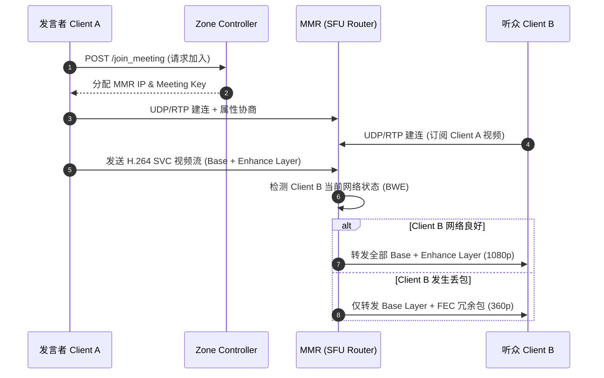
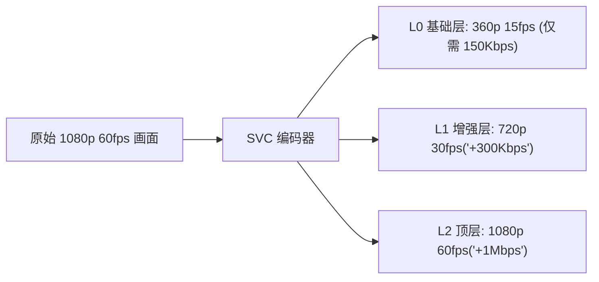

import CaseStudyHeader from '@site/src/components/CaseStudyHeader';
import DesignIntent from '@site/src/components/DesignIntent';
import EvolutionTimeline from '@site/src/components/EvolutionTimeline';
import CompareSlider from '@site/src/components/CompareSlider';
import TradeoffExplorer from '@site/src/components/TradeoffExplorer';
import GuidedExercise from '@site/src/components/GuidedExercise';
import QuizCard from '@site/src/components/QuizCard';
import GlossaryTerm from '@site/src/components/GlossaryTerm';
import ResearchNote from '@site/src/components/ResearchNote';

# Zoom：SFU 媒体选路与弱网实时音视频架构

<CaseStudyHeader
  oneLiner="Zoom 没有采用传统的 MCU (Multipoint Control Unit) 服务器解码混流方案，而是构建了基于 SFU (Selective Forwarding Unit) 的多级 MMR 选路集群。配合 SVC 可伸缩视频编码与动态 FEC 前向纠错，Zoom 实现了在 50% 极高丢包率下依然维持流畅音视频沟通。"
  stats={[
    {label: '日参与者峰值', value: '3 亿+'},
    {label: '单会议支持人数', value: '最高 10,000 人 (大型 Web 会议)'},
    {label: '媒体核心架构', value: 'SFU (Selective Forwarding Unit)'},
    {label: '核心路由节点', value: 'MMR (Multimedia Router 级联网关)'},
    {label: '弱网抗丢包', value: '音频 80% 丢包可听 / 视频 50% 丢包可看'},
    {label: '端到端加密', value: 'AES-256-GCM (Key Leader 协商机制)'}
  ]}
/>

:::info 对应课程概念
本案例主要映射 [Month 3 数据、缓存与队列]（UDP/RTP 实时数据流控制）、[Month 5 分布式核心组件]（级联路由与软交换）及 [Month 6 云原生与企业级架构]。
:::

## 1. 设计初衷：任何网络下开会都不卡

音视频通信的核心痛点是**延迟**与**丢包**。在早期 WebEx 时代，视频会议极其依赖昂贵的专用硬件终端或服务器端混合渲染（MCU）。Zoom 的目标是：**在普通手机与便携笔记本上，即使用户处于极差的公共 Wi-Fi 或移动 3G 蜂窝网络，也能实现 150ms 极低延迟会议。**

<DesignIntent
  problem="如何在不依赖昂贵专线硬件的前提下，让全球数万参与者同时加入单场会议，并在严重弱网（高延迟、高丢包）下维持毫秒级音视频协同？"
  users="企业员工、学校师生、政企客户及普通大众。"
  devices="Windows, macOS, iOS, Android, Linux 及 H.323/SIP 专用会议硬件。"
  goals={[
    '极致的端到端低延迟：全球跨洲会议延迟小于 150ms',
    '超强弱网生存力：音频支持高达 80% 丢包不卡顿，视频支持 50% 丢包仍可辨识',
    '极高并发扩展性：支持千人乃至万人互动大型会议，服务器 CPU 占用极低',
    '动态带宽自适应：自动根据屏幕尺寸与网络状况切换分发分辨率（1080p / 720p / 360p / 90p）'
  ]}
  constraints={[
    '传统 MCU 服务端转码混流极度消耗 CPU，无法弹性扩展至数亿用户',
    '不同设备网络带宽差异巨大，不能用单一码率强制分发',
    '跨国跨洲传输受到公网 BGP 路由波动影响，必须自建全球多点 MMR 骨干网'
  ]}
  firstStep="放弃 MCU 服务端转码，采用 SFU 纯数据包选路与转发；引入 SVC（Scalable Video Coding）分层编码与自适应 FEC 冗余。"
/>

## 2. 全景思维导图



## 3. 最新架构总览 (C4 风格)





## 4. 核心机制拆解

### 4a. SFU vs MCU 媒体路由机制

传统 <GlossaryTerm term="MCU 架构" definition="Multipoint Control Unit，多点控制单元。服务器需要对所有输入的音视频流进行硬解码、重新拼接渲染、再编码吐出给客户端。极度消耗 CPU 算力。">MCU</GlossaryTerm> 与 Zoom 使用的 <GlossaryTerm term="SFU 架构" definition="Selective Forwarding Unit，选择性转发单元。服务器不对音视频数据进行任何解码解密与重新渲染，仅在 RTP 数据包层根据订阅关系与网络带宽进行纯选择性路由与丢包转发。">SFU</GlossaryTerm> 差异巨大：


- **选路策略（Active Speaker）**：SFU 仅广播发言者（Active Speaker）的高清画面，非发言者仅广播缩略图或音频，使每路客户端下行流量从 $O(N)$ 降至 $O(1)$。

### 4b. SVC（Scalable Video Coding）分层编码

Zoom 采用了 <GlossaryTerm term="SVC 可伸缩视频编码" definition="将单个视频流编码为一个基础层 (Base Layer) 与多个增强层 (Enhancement Layers)。基础层保证最底限可看，增强层提高分辨率与帧率。">SVC 编码</GlossaryTerm> 技术：



MMR 路由器无需重新解码，只需直接在 IP 封包层丢弃 L1/L2 即可为弱网设备瘦身。

### 4c. FEC（前向纠错）与 Jitter Buffer

为了防范 50% 极高丢包率，Zoom 引入了动态 <GlossaryTerm term="FEC 算法" definition="Forward Error Correction，在发送数据包的同时额外附带由 XOR 运算生成的冗余纠错包。接收端丢包时无需等待重传，直接由剩余包恢复丢失数据。">FEC 纠错</GlossaryTerm> 机制：

- 每发送 N 个音视频 RTP 数据包，附加 M 个冗余纠错包。
- 只要接收方收到任意 N 个包，即可通过线性方程或 XOR 完整还原原始数据，零延迟打回 Jitter Buffer。

## 5. 关键数据结构与算法

### FEC XOR 冗余矩阵恢复原理

假定发送 2 个数据包 `P1, P2`，生成 1 个 FEC 冗余包 `F12 = P1 ^ P2`：

```text
若 P1 在网络中丢失，则：P1 = P2 ^ F12
```

Zoom 根据动态检测到的网络丢包率（Packet Loss Rate），实时调整冗余度 `R = M / N`：网络良好时 R=0%，丢包 30% 时自动提升至 R=50%。

## 6. 架构演进史

<EvolutionTimeline
  events={[
    {
      year: '2011',
      title: '放弃 H.323/MCU，拥抱 C++ SFU',
      why: '袁征 (Eric Yuan) 带着 WebEx 核心团队创业，决心摒弃硬件混流的古老架构。',
      change: '自研极简 C++ SFU MMR 引擎，单服务器并发能力提升 50 倍。'
    },
    {
      year: '2019',
      title: '全球多区域 MMR 级联集群拓扑',
      why: '全球用户爆发，跨洲网络延迟居高不下。',
      change: '引入多级 MMR Cascading 拓扑，实现跨洲流量在云端骨干网专线内传输。'
    },
    {
      year: '2020',
      title: 'AES-256-GCM 端到端加密全面升级',
      why: '疫情期间爆发 Zoombombing 与安全隐患挑战。',
      change: '发布 256 位 AES-GCM E2EE 架构，由 Key Leader 客户端通过 Diffie-Hellman 分发会议秘钥。'
    }
  ]}
/>

### 架构演进对比

<CompareSlider
  before={
    <div style={{ padding: '20px', background: '#ffebee', borderRadius: '8px', height: '100%' }}>
      <h3>早期 MCU 硬解码混流架构 (WebEx 时代)</h3>
      <p>服务器 CPU 被编解码拉满，100 人会议需占用多台昂贵硬件服务器，弱网极易卡顿花屏。</p>
    </div>
  }
  after={
    <div style={{ padding: '20px', background: '#e8f5e9', borderRadius: '8px', height: '100%' }}>
      <h3>Zoom 全球级联 SFU + SVC + 动态 FEC 架构</h3>
      <p>服务器仅做内存包路由，单节点支撑数万人，音视频支持 50% 丢包抗性与 150ms 超低延迟。</p>
    </div>
  }
/>

## 7. 设计模式与课程映射

1. **观察者模式 (Observer Pattern)**：MMR 作为 Publisher，各 Attendee 根据屏幕视窗状态订阅特定的视频 Layer。
2. **责任链模式 (Chain of Responsibility)**：弱网处理管道中依次经过 BWE Bandwidth Estimator -> FEC Injector -> NACK Retransmitter -> Jitter Buffer。
3. **映射 [Month 3 数据、缓存与队列]**：实时流数据 UDP 包处理与滑动窗口控制。

## 8. 架构取舍与权衡

<TradeoffExplorer
  title="Zoom RTC 核心架构设计取舍"
  dimensions={['服务端 CPU 开销', '端侧解码压力', '弱网适应力', 'E2EE 复杂度']}
  options={[
    {
      name: 'SFU + SVC 分层选路 (Zoom 方案)',
      scores: [5, 4, 5, 4],
      note: '服务端几乎零 CPU 解码开销，扩展性极高；但客户端需要同时解码多路 SVC 流，移动端耗电略增。',
      whenToUse: '支持千人/万人超大型互动会议、重视网络自适应与高扩展度的实时音视频平台。'
    },
    {
      name: 'MCU 解码混流 (传统视频会议系统方案)',
      scores: [2, 5, 3, 5],
      note: '客户端极度轻量（仅接收 1 路合成好的画中画流）；但服务端成本高昂，无法横向弹性扩展。',
      whenToUse: '专用会议室嵌入式硬件（如 Cisco/Polycom 专用终端设备）。'
    }
  ]}
/>

## 9. 常见误解与澄清

:::warning 常见误解澄清
- **误解一：Zoom 的服务器负责把所有人的画面剪辑合并成一个大视频发给每个人。**
  *事实*：这是典型的 MCU 模式。Zoom 的 SFU 服务器绝不合并画面，它只是把多个独立的数据包像快递员一样分发给客户端，画面合成完全在用户的手机/电脑显卡（GPU）中完成。
- **误解二：丢包时只能靠重传（NACK），所以丢包必然导致卡顿。**
  *事实*：在 RTC 中重传会带来额外的 RTT 延迟。Zoom 主要依赖 FEC（前向纠错），在发包时故意混入冗余数据包，接收端不用重传就能瞬间用算法计算出丢失的数据包。
:::

## 10. 如果是你来设计 (Guided Exercise)

<GuidedExercise
  title="设计 FEC XOR 纠错数据恢复算法"
  goal="在 Python 或 C++ 中实现简单的 (2, 1) XOR FEC 编码与解码还原。"
  steps={[
    '步骤 1: 准备两个数据包 P1 = b"Hello ", P2 = b"World!"。',
    '步骤 2: 计算冗余包 F = bytes([a ^ b for a, b in zip(P1, P2)])。',
    '步骤 3: 模拟传输过程，假设 P1 数据包在网络中丢失，仅接收到 P2 与 F。',
    '步骤 4: 计算恢复公式 Restored_P1 = bytes([b ^ f for b, f in zip(P2, F)])。',
    '步骤 5: 验证 Restored_P1 是否与原始 b"Hello " 完全一致。'
  ]}
  hints={[
    '实际 Zoom 使用的 RS (Reed-Solomon) 纠错码基于 Galois Field (GF(2^8)) 伽罗瓦域运算，原理与此类似。'
  ]}
  checks={[
    '若 P2 丢失，能否由 P1 与 F 恢复 P2？',
    '当丢包率超过冗余包覆盖范围时，系统应如何退化回 NACK 重传模式？'
  ]}
/>

## 11. 自测题与来源清单

<QuizCard
  questions={[
    {
      q: 'Zoom 采用的 SFU (Selective Forwarding Unit) 相比传统 MCU 架构的核心优势是什么？',
      options: [
        'A. SFU 可以在服务器端免费录制 4K 视频',
        'B. SFU 不对音视频流进行解码与合成，仅做纯 RTP 包转发，服务端 CPU 开销降至极致',
        'C. SFU 能够降低客户端的 GPU 解码开销',
        'D. SFU 不需要消耗任何公网带宽'
      ],
      answer: 1,
      explain: 'SFU 的本质是选择性数据包路由器，极大解放了服务器 CPU，使单台服务器能够同时服务数万路并发音视频流。'
    },
    {
      q: '在视频会议中，SVC (Scalable Video Coding) 分层编码的主要作用是什么？',
      options: [
        'A. 用于对视频进行自动加密',
        'B. 将视频切分为基础层与增强层，SFU 可根据接收端的实际网络状况灵活丢弃高增强层以降码率',
        'C. 自动去除画面中的背景杂音',
        'D. 提升视频的压缩比至 100 倍'
      ],
      answer: 1,
      explain: 'SVC 允许发送端仅编码一次，SFU 服务器无需重新转码即可按需向不同网络条件的接收端分发不同分辨率/帧率的图层。'
    },
    {
      q: '当用户的网络丢包率高达 30% 时，Zoom 能维持声音连续不卡顿的关键技术是：',
      options: [
        'A. 动态前向纠错 (FEC) 注入冗余包，无需重传即可在接收端原地恢复丢失数据',
        'B. 强制断开连接并重新拨号',
        'C. 将音频采样率降低为 1Hz',
        'D. 依赖 TCP 协议的按序重传机制'
      ],
      answer: 0,
      explain: 'FEC 冗余包能够在不引入 RTT 延迟的前提下由客户端直接解算恢复丢包，是实时 RTC 弱网对抗的基石。'
    }
  ]}
/>

## 来源

:::caution 关于来源
Zoom 未公开完整架构论文；下列为其依赖技术的一手标准，SFU 级联与弱网对抗的具体机制为**基于公开信息的教学重构**。
:::

- [RFC 8831: WebRTC Data Channels (IETF)](https://datatracker.ietf.org/doc/html/rfc8831) 及 RTCWEB 系列标准 —— 实时音视频传输的一手规范。
- [SFU 选择性转发单元开源实现（mediasoup）](https://mediasoup.org/documentation/v3/) —— 与 Zoom 类似的 SFU 媒体路由架构的可查证参考。

<ResearchNote
  title="Zoom 架构与实时音视频技术白皮书"
  source="Zoom Technical Whitepaper & Engineering Architecture"
  href="https://zoom.us/docs/doc/Zoom-Architecture-White-Paper.pdf"
  insight="详细介绍了 Zoom 全球 MMR 级联网关拓扑、SVC 分层选路机制与 AES-256-GCM 安全体系。"
  application="架构借鉴：如何设计超大规模、超低延迟的全球分布式 RTC 音视频与弱网通信系统。"
/>